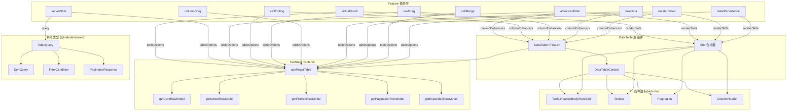

## 用户需求

针对项目中现有的 `DataTable<TData>` 表格组件（基于 @tanstack/react-table v8 + shadcn/ui），制定一份对标 Ant Design Table / AG Grid 企业级标准的全面增强计划。

## 产品概述

将当前基础表格组件（支持单列排序、文本搜索、列可见性、列宽调整、行选择、前端分页）升级为企业级数据表格，覆盖性能优化、交互体验、数据展示、工程化扩展四大核心模块，同时保持与现有技术栈（React 19 + TanStack 生态 + shadcn/ui + Tailwind CSS v4）的一致性，并对现有业务页面（用户管理、角色管理、字典管理）向下兼容。

## 核心特性

1. **性能优化**：虚拟滚动（万行级渲染）、服务端分页/排序/筛选模式、表格状态持久化（localStorage / URL 同步）、大数据量渲染优化策略
2. **交互体验**：高级筛选（条件/范围/多值/日期）、多列排序、单元格编辑（行内编辑 + 校验）、行拖拽排序、列拖拽换序、个性化列配置持久化
3. **数据展示**：树形数据（递归展开/缩进线）、主从展开（子表格）、合并单元格（rowSpan/colSpan）、增强自定义渲染插槽
4. **工程化与扩展**：统一插槽机制（render props + slot 组件）、全量 TypeScript 类型安全（泛型特征标志）、插件化架构（feature 插件注册与组合）

## 技术栈

### 现有技术栈（复用）

- 表格核心：`@tanstack/react-table` v8.21.3（已支持 sorting/filtering/pagination/expansion/column visibility/column sizing/column pinning/row selection 等内置 feature）
- UI 组件：shadcn/ui + Radix UI + Tailwind CSS v4
- 状态管理：TanStack Query v5（服务端数据）、Zustand（全局状态）
- 共享类型：`@nebula/shared`（`PaginatedResponse<T>`、`ApiResponse<T>`、`PaginationQuery`）
- 测试：Vitest 4 + Testing Library

### 新增依赖

- `@tanstack/react-virtual` — 虚拟滚动，与 TanStack Table 同生态，API 契合度高，bundle 增量约 6KB gzipped
- `@dnd-kit/core` + `@dnd-kit/sortable` + `@dnd-kit/utilities` — 行列拖拽，轻量、无障碍、React 原生，替代 react-beautiful-dnd（已停止维护）

### 不引入的依赖及理由

- **AG Grid / Ant Design Table** — 项目已深度绑定 TanStack Table 生态，引入会带来重复的表格核心和样式冲突
- **react-window** — @tanstack/react-virtual 与 TanStack Table 的 `getRowModel().rows` 配合更紧密，API 更现代
- **react-beautiful-dnd** — 已停止维护，@dnd-kit 是社区推荐的替代方案

## 实现方案

### 架构设计：Feature 插件化组合

TanStack Table v8 本身采用 feature 函数式插件架构（`getSortedRowModel`、`getFilteredRowModel` 等）。本方案在此基础上封装一层 **DataTable Feature Plugin** 抽象，将每个增强功能模块化为独立插件，通过 `features` prop 组合启用：

```typescript
// 插件接口契约
interface DataTableFeature<TData> {
  id: string;
  // 注入 TanStack Table options
  tableOptions?: (ctx: FeatureContext<TData>) => Partial<TableOptions<TData>>;
  // 注入列定义增强
  columnEnhancers?: (ctx: FeatureContext<TData>) => ColumnDef<TData>[];
  // 渲染钩子（header/cell/row/toolbar/pagination）
  renderSlots?: Partial<DataTableSlots<TData>>;
  // 状态初始化
  initialState?: Partial<TableState>;
}
```

通过 `features` 数组传入，DataTable 内部统一合并 options、column enhancers 和 render slots。这样新增功能只需编写新 Feature 文件，不修改核心组件。

### 模块一：性能优化

| 特性 | 实现方案 | 实现约束 |
| --- | --- | --- |
| **虚拟滚动** | 使用 `@tanstack/react-virtual` 的 `useVirtualizer`，将 `TableBody` 内的 `TableRow` 替换为虚拟化行。基于 `table.getRowModel().rows` 提供数据，`estimateSize` 默认 36px（与现有 `h-9` 一致），通过 `measureElement` 支持动态行高 | 需为 `TableBody` 容器设置固定高度或 `max-h` + `overflow-auto`；sticky header 需保留；行高动态测量时避免频繁 reflow |
| **服务端数据模式** | 新增 `enableServerSide` prop + `serverQuery` 配置。开启后 `manualPagination: true`、`manualSorting: true`、`manualFiltering: true`，将 sorting/filtering/pagination state 通过回调透传给消费方，消费方用 TanStack Query 请求数据。`pageCount` 由 `PaginatedResponse.totalPages` 提供 | 后端需扩展排序/筛选查询参数（见下文共享类型变更）；前端分页组件需适配服务端模式（显示 total 而非 `getFilteredRowModel().rows.length`） |
| **状态持久化** | 新增 `statePersistence` 配置（`storage: 'localStorage' | 'url'`，`key: string`），将 sorting/columnVisibility/columnSizing/columnOrder/pagination 序列化存储。URL 模式使用 `URLSearchParams`，支持分享链接 | localStorage 写入需 debounce（500ms）；URL 模式需与 React Router 7 集成；状态反序列化需做 schema 校验 |
| **大数据量优化** | `React.memo` 包裹 TableRow；列定义 `memo` 化；`useReactTable` 的 `autoResetPageIndex` 按需关闭；虚拟滚动 + 分页组合（虚拟滚动作用于当前页数据） | 避免在 render 中创建新对象/函数引用；`getRowId` 必须提供稳定 key |


### 模块二：交互体验

| 特性 | 实现方案 | 实现约束 |
| --- | --- | --- |
| **高级筛选** | 每列支持自定义 `filterFn` + 筛选 UI 组件。内置筛选器：文本（包含/等于/开头）、数字范围（min-max）、日期范围（DatePicker）、多选（Checkbox/Select）。筛选 UI 在列头 DropdownMenu 中展开，支持多条件组合（AND/OR）。活跃筛选状态以 Badge 显示在工具栏 | 复用 shadcn/ui 的 DropdownMenu/Popover/Calendar/Select/Checkbox；筛选条件类型需泛型化；服务端模式下筛选条件序列化为查询参数 |
| **多列排序** | 启用 `enableMultiSort: true`（TanStack Table 内置），列头点击循环 asc→desc→none，Shift+点击追加排序列。排序优先级以数字角标显示 | 需修改 `data-table-column-header.tsx` 支持多列排序 UI；服务端模式下排序状态序列化为 `sort: field:asc,field2:desc` 格式 |
| **单元格编辑** | 新增 `EditableCell` 组件，双击/单击进入编辑态，支持 Input/Select/DatePicker/NumberInput 编辑器类型。编辑完成后通过 `onCellEdit(row, columnId, newValue)` 回调，支持 Zod 校验（与后端校验对齐） | 编辑态需 `stopPropagation` 避免触发行点击；校验失败显示 inline error；Escape 取消编辑、Enter 确认 |
| **行拖拽排序** | 使用 `@dnd-kit/sortable` 的 `SortableContext` + `useSortable`。拖拽手柄列（非整行拖拽，避免与行选择/点击冲突）。拖拽完成后 `onRowReorder(newData: TData[])` 回调 | 需新增拖拽手柄列定义；虚拟滚动模式下需用 `@dnd-kit` 的虚拟化适配方案；拖拽中需禁止排序/选择操作 |
| **列拖拽换序** | 使用 `@dnd-kit` 在 TableHeader 层实现列拖拽。结合 TanStack Table 的 `columnOrder` state，拖拽完成后更新 `setColumnOrder` | 与列宽调整手柄共存需区分交互区域（拖拽手柄 vs resize 手柄）；列固定（pinning）时不可拖拽 |
| **个性化列配置持久化** | 扩展 `DataTableViewOptions` 为完整的列设置面板：列顺序拖拽、列显示/隐藏、列宽重置、固定列（左/右）。配置通过状态持久化模块保存 | 配置 key 需包含表格唯一标识；支持「恢复默认」操作；列设置面板使用 Popover/Sheet |


### 模块三：数据展示

| 特性 | 实现方案 | 实现约束 |
| --- | --- | --- |
| **树形数据** | 使用 TanStack Table 的 `getExpandedRowModel` + `getSubRows` 配置。数据结构支持 `children` 嵌套或 `parentId` 扁平结构。展开/折叠按钮列，缩进线（CSS border-left），支持递归选择（父选则子全选） | `getSubRows` 需稳定引用（useMemo/useCallback）；虚拟滚动下树形展开需正确计算可见行；大量子节点时需懒加载 |
| **主从展开** | 使用 `getExpandedRowModel` + 自定义展开行渲染。展开行通过 `renderExpandedRow(row) => ReactNode` 插槽渲染子内容（可为子表格、详情面板、图表等）。展开图标列 | 与树形数据共用 expansion state 但语义不同（`expanded` state 的 key 需区分）；展开行需 `colSpan={columns.length}` 占满宽度 |
| **合并单元格** | 通过 `aggregatedCell` + `colSpan`/`rowSpan` 实现。提供 `getColSpan(cell)` 和 `getRowSpan(row, columnId)` 回调函数，在 `TableCell` 渲染时动态设置 span 属性 | 合并逻辑需在渲染前预计算（useMemo）；与虚拟滚动兼容时需确保合并行不被虚拟化切割；排序/筛选后合并范围需重新计算 |
| **自定义渲染** | 增强插槽机制：`renderCell`（单元格级）、`renderHeader`（列头级）、`renderRow`（行级）、`renderExpandedContent`（展开内容）、`renderToolbar`（工具栏级）、`renderPagination`（分页级）、`renderEmpty`（空状态）。每个插槽支持 render props 形式，提供完整 table context | 插槽优先级：列定义中的 cell/header > feature 插件注入 > 默认渲染；插槽类型需泛型化 |


### 模块四：工程化与扩展

| 特性 | 实现方案 | 实现约束 |
| --- | --- | --- |
| **插槽机制** | 定义 `DataTableSlots<TData>` 接口，统一管理所有渲染插槽。插槽通过 `slots` prop 传入，也可通过 Feature 插件的 `renderSlots` 注入。提供 `useDataTableContext()` Hook 供插槽组件访问 table 实例 | 插槽类型必须严格类型化（不允许 `ReactNode` 覆盖所有场景）；插槽组件需 `memo` 化；Context 默认值需安全 |
| **TypeScript 类型安全** | 全量泛型化：`DataTable<TData, TFeature extends string = string>`；Feature 插件泛型 `DataTableFeature<TData>`；列定义强类型 `ColumnDef<TData, TValue>`（移除 `unknown`）；服务端模式查询参数类型化；筛选条件 discriminated union | 禁止 `as any`/`@ts-ignore`（项目规范）；泛型约束需覆盖所有 feature 组合；公共 API 需导出完整类型 |
| **插件化架构** | Feature 插件注册系统：`createDataTableFeature(config)` 工厂函数 → 注册到 `features` 数组 → DataTable 内部合并。内置插件：`virtualScrollFeature`、`serverSideFeature`、`advancedFilterFeature`、`cellEditingFeature`、`rowDragFeature`、`columnDragFeature`、`treeDataFeature`、`masterDetailFeature`、`cellMergeFeature`、`statePersistenceFeature` | 插件间冲突检测（如 virtualScroll + cellMerge 需特殊处理）；插件依赖声明（如 serverSide 依赖 serverQuery 配置）；插件加载顺序可控 |


### 共享类型变更（packages/shared）

```typescript
// packages/shared/src/types/api.types.ts — 扩展排序/筛选查询参数

export interface SortQuery {
  field: string;
  order: 'asc' | 'desc';
}

export interface FilterCondition {
  field: string;
  operator: 'eq' | 'ne' | 'contains' | 'startsWith' | 'endsWith' | 
            'gt' | 'gte' | 'lt' | 'lte' | 'between' | 'in';
  value: unknown;
}

export interface TableQuery extends PaginationQuery {
  sort?: SortQuery[];
  filters?: FilterCondition[];
  search?: string;
}

export interface TableQueryResult<T> extends PaginatedResponse<T> {
  // 复用现有 PaginatedResponse<T> 结构
}
```

```typescript
// packages/shared/src/schemas/paginated.schema.ts — 扩展 Zod schema

export const SortQuerySchema = z.object({
  field: z.string(),
  order: z.enum(['asc', 'desc']),
});

export const FilterConditionSchema = z.object({
  field: z.string(),
  operator: z.enum(['eq', 'ne', 'contains', 'startsWith', 'endsWith', 'gt', 'gte', 'lt', 'lte', 'between', 'in']),
  value: z.unknown(),
});

export const TableQuerySchema = PaginationQuerySchema.extend({
  sort: z.array(SortQuerySchema).optional(),
  filters: z.array(FilterConditionSchema).optional(),
  search: z.string().optional(),
});
```

## 实现注意事项

### 性能关键路径

- 虚拟滚动 `useVirtualizer` 的 `estimateSize` 必须返回稳定值，避免每帧重计算；`measureElement` 在行高变化时触发，需 `requestAnimationFrame` 节流
- 服务端模式下 `pageCount` 必须显式设置，否则分页按钮状态计算错误
- `columnVisibility`/`columnOrder`/`columnSizing` 变化时避免全量 re-render，使用 `table.setOptions` 的细粒度更新

### 向后兼容

- 所有新特性通过 `features` / `enable*` props 可选启用，默认行为与现有 `DataTable` 完全一致
- 现有 `DataTableProps` 接口保持兼容，新增字段全部可选
- 现有业务页面（users-page / roles-page / dicts-page）无需修改即可继续工作

### 日志与调试

- Feature 插件加载时 `console.debug` 输出插件列表（仅 dev 环境）
- 服务端模式查询参数变化时输出调试日志
- 虚拟滚动性能指标（渲染行数 / 总行数）通过 React DevTools Profiler 可观测

## 目录结构

```
apps/web/src/components/data-table/
├── data-table.tsx                        # [MODIFY] 主组件重构为 feature 插件组合架构，保持 props 向后兼容
├── data-table-column-header.tsx          # [MODIFY] 增加多列排序角标、列拖拽手柄、高级筛选入口
├── data-table-pagination.tsx             # [MODIFY] 支持服务端模式（显示 total 而非 filteredRowModel）、跳页输入
├── data-table-toolbar.tsx                # [MODIFY] 增加高级筛选条件 Badge 展示、活跃筛选状态清除
├── data-table-view-options.tsx           # [MODIFY] 升级为完整列设置面板：列顺序拖拽、固定列、宽度重置
├── data-table-checkbox.tsx               # [MODIFY] 支持树形数据的半选状态
├── create-column-helper.ts               # [MODIFY] 增强类型推导，支持 editable/filterType 元数据
├── index.ts                              # [MODIFY] 导出新类型、Feature 插件、插槽组件
├── types.ts                              # [NEW] DataTableProps 扩展、DataTableFeature 接口、DataTableSlots、FeatureContext 类型定义
├── context.ts                            # [NEW] DataTableContext + useDataTableContext Hook
├── features/                             # [NEW] Feature 插件目录
│   ├── virtual-scroll.tsx                # [NEW] 虚拟滚动插件：useVirtualizer 集成、动态行高测量
│   ├── server-side.ts                    # [NEW] 服务端模式插件：manualPagination/Sorting/Filtering、query 回调透传
│   ├── state-persistence.ts              # [NEW] 状态持久化插件：localStorage/URL 序列化、debounce 写入、schema 校验
│   ├── advanced-filter.tsx               # [NEW] 高级筛选插件：列级筛选器组件（文本/数字/日期/多选）、条件组合
│   ├── cell-editing.tsx                  # [NEW] 单元格编辑插件：EditableCell 组件、编辑器注册、Zod 校验
│   ├── row-drag.tsx                      # [NEW] 行拖拽插件：@dnd-kit/sortable 集成、拖拽手柄列、虚拟化适配
│   ├── column-drag.tsx                   # [NEW] 列拖拽插件：列头 @dnd-kit 拖拽、columnOrder state 同步
│   ├── tree-data.tsx                     # [NEW] 树形数据插件：getSubRows、展开/折叠、缩进线、递归选择
│   ├── master-detail.tsx                 # [NEW] 主从展开插件：展开行渲染插槽、colSpan 占满
│   ├── cell-merge.ts                     # [NEW] 合并单元格插件：getColSpan/getRowSpan 回调、预计算逻辑
│   └── index.ts                          # [NEW] 统一导出所有 Feature 插件
├── slots/                                # [NEW] 插槽组件目录
│   ├── default-slots.tsx                 # [NEW] 默认插槽实现（header/cell/row/empty/toolbar/pagination）
│   └── slot-helpers.ts                   # [NEW] 插槽合并工具函数（用户 slots > feature slots > default）
├── filters/                              # [NEW] 内置筛选器组件
│   ├── text-filter.tsx                   # [NEW] 文本筛选器（包含/等于/开头/结尾）
│   ├── number-range-filter.tsx           # [NEW] 数字范围筛选器
│   ├── date-range-filter.tsx             # [NEW] 日期范围筛选器
│   ├── select-filter.tsx                 # [NEW] 多选筛选器
│   └── index.ts                          # [NEW] 筛选器注册表
├── editors/                              # [NEW] 内置编辑器组件
│   ├── text-editor.tsx                   # [NEW] 文本编辑器
│   ├── number-editor.tsx                 # [NEW] 数字编辑器
│   ├── select-editor.tsx                 # [NEW] 下拉编辑器
│   ├── date-editor.tsx                   # [NEW] 日期编辑器
│   └── index.ts                          # [NEW] 编辑器注册表
├── data-table.test.tsx                   # [MODIFY] 增加新特性测试用例
└── __tests__/                            # [NEW] 特性级测试
    ├── virtual-scroll.test.tsx           # [NEW] 虚拟滚动测试
    ├── advanced-filter.test.tsx          # [NEW] 高级筛选测试
    ├── cell-editing.test.tsx             # [NEW] 单元格编辑测试
    ├── tree-data.test.tsx                # [NEW] 树形数据测试
    └── server-side.test.tsx              # [NEW] 服务端模式测试

packages/shared/src/
├── types/api.types.ts                    # [MODIFY] 新增 SortQuery、FilterCondition、TableQuery、TableQueryResult 类型
└── schemas/paginated.schema.ts           # [MODIFY] 新增 SortQuerySchema、FilterConditionSchema、TableQuerySchema

apps/web/package.json                     # [MODIFY] 新增 @tanstack/react-virtual、@dnd-kit/core、@dnd-kit/sortable、@dnd-kit/utilities 依赖
```

## 关键代码结构

```typescript
// types.ts — 核心 Feature 插件接口与增强后的 Props

/** Feature 插件上下文 */
interface FeatureContext<TData> {
  table: Table<TData>;
  props: DataTableProps<TData>;
  getState: () => TableState;
}

/** Feature 插件接口 */
interface DataTableFeature<TData> {
  id: string;
  deps?: string[];
  tableOptions?: (ctx: FeatureContext<TData>) => Partial<TableOptions<TData>>;
  columnEnhancers?: (ctx: FeatureContext<TData>) => ColumnDef<TData, unknown>[];
  renderSlots?: Partial<DataTableSlots<TData>>;
  initialState?: Partial<TableState>;
}

/** 增强后的 DataTableProps（向后兼容扩展） */
interface DataTableProps<TData> {
  // === 现有 props 保持不变 ===
  data: TData[];
  columns: ColumnDef<TData, unknown>[];
  getRowId?: (row: TData) => string;
  isLoading?: boolean;
  searchPlaceholder?: string;
  searchColumnIds?: string[];
  enableRowSelection?: boolean;
  enableColumnResize?: boolean;
  onBatchDelete?: (rows: TData[]) => void;
  batchDeleteConfirmMessage?: string;
  toolbarLeftContent?: React.ReactNode;
  toolbarRightContent?: React.ReactNode;
  emptyIcon?: React.ReactNode;
  emptyTitle?: string;
  emptyDescription?: string;
  onRowClick?: (row: TData) => void;
  className?: string;

  // === 新增：Feature 插件 ===
  features?: DataTableFeature<TData>[];

  // === 新增：虚拟滚动 ===
  enableVirtualScroll?: boolean;
  virtualScrollHeight?: number | string;

  // === 新增：服务端模式 ===
  enableServerSide?: boolean;
  serverQuery?: {
    pageCount?: number;
    total?: number;
    onQueryChange?: (query: TableQuery) => void;
  };

  // === 新增：状态持久化 ===
  statePersistence?: {
    storage: 'localStorage' | 'url';
    key: string;
    include?: ('sorting' | 'columnVisibility' | 'columnSizing' | 'columnOrder' | 'pagination')[];
  };

  // === 新增：多列排序 ===
  enableMultiSort?: boolean;

  // === 新增：单元格编辑 ===
  enableCellEditing?: boolean;
  onCellEdit?: (row: TData, columnId: string, newValue: unknown) => void | Promise<void>;

  // === 新增：行拖拽 ===
  enableRowDrag?: boolean;
  onRowReorder?: (newData: TData[]) => void;

  // === 新增：列拖拽 ===
  enableColumnDrag?: boolean;

  // === 新增：树形数据 ===
  getSubRows?: (row: TData) => TData[] | undefined;

  // === 新增：主从展开 ===
  renderExpandedRow?: (row: TData) => React.ReactNode;

  // === 新增：合并单元格 ===
  getColSpan?: (row: TData, columnId: string) => number | undefined;
  getRowSpan?: (row: TData, columnId: string) => number | undefined;

  // === 新增：插槽 ===
  slots?: Partial<DataTableSlots<TData>>;
}

/** 统一插槽定义 */
interface DataTableSlots<TData> {
  renderHeader?: (ctx: HeaderContext<TData, unknown>) => React.ReactNode;
  renderCell?: (ctx: CellContext<TData, unknown>) => React.ReactNode;
  renderRow?: (row: Row<TData>, cells: React.ReactNode) => React.ReactNode;
  renderToolbar?: (table: Table<TData>) => React.ReactNode;
  renderPagination?: (table: Table<TData>) => React.ReactNode;
  renderEmpty?: () => React.ReactNode;
  renderExpandedContent?: (row: Row<TData>) => React.ReactNode;
}
```

## 架构关系图



## 设计方案

基于现有 shadcn/ui + Tailwind CSS v4 设计体系，为增强后的 DataTable 新增交互组件保持视觉一致性。

### 设计风格

延续项目现有的 shadcn/ui 设计语言：简洁、克制、注重信息密度。新增组件（筛选面板、列设置面板、拖拽手柄、展开指示器、编辑态输入框）均使用现有色彩体系和圆角规范。

### 新增 UI 组件设计

**列头区域**：

- 排序角标：排序列右侧显示数字角标（排序优先级），使用 `bg-primary text-primary-foreground` 圆形小标签
- 筛选入口：列头下拉菜单增加「筛选」分区，活跃筛选列头显示 `text-primary` + 底部 `border-b-2 border-primary` 指示
- 列拖拽手柄：列头最左侧 `GripVertical` 图标，hover 时显示，dragging 时 `opacity-50`

**工具栏区域**：

- 活跃筛选条件以 Badge 形式展示（`variant=secondary`），点击 Badge 可快速清除单条件
- 「清除所有筛选」按钮在存在筛选条件时显示

**列设置面板**：

- 从简单 DropdownMenu 升级为 Popover/Sheet 面板
- 面板内分三区：列顺序拖拽区、列显示/隐藏区、列宽设置区
- 每列行：拖拽手柄 + 列名 + 显示开关 + 固定按钮（左/右/无）+ 宽度输入

**树形/展开指示器**：

- 树形：展开/折叠使用 `ChevronRight`/`ChevronDown` 图标，子行缩进 20px/层级，缩进线 `border-l border-border/40`
- 主从展开：展开行使用 `ChevronRight`/`ChevronDown`，展开内容面板 `bg-muted/30` 背景

**单元格编辑态**：

- 双击进入编辑，单元格内嵌 Input/Select，`ring-2 ring-primary` 边框高亮
- 校验失败 `ring-2 ring-destructive` + 下方 `text-xs text-destructive` 错误提示
- 确认/取消通过 Enter/Escape 键盘操作

**行拖拽态**：

- 拖拽手柄列：`GripVertical` 图标，`cursor-grab`，拖拽中 `cursor-grabbing`
- 拖拽中目标行 `border-t-2 border-primary` 上边框高亮指示插入位置