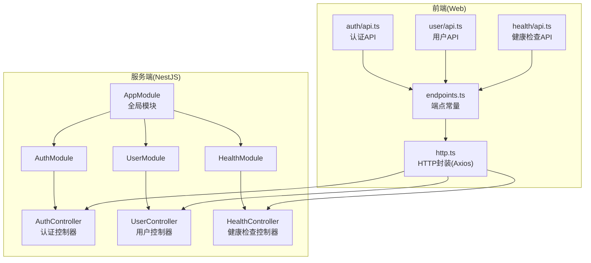
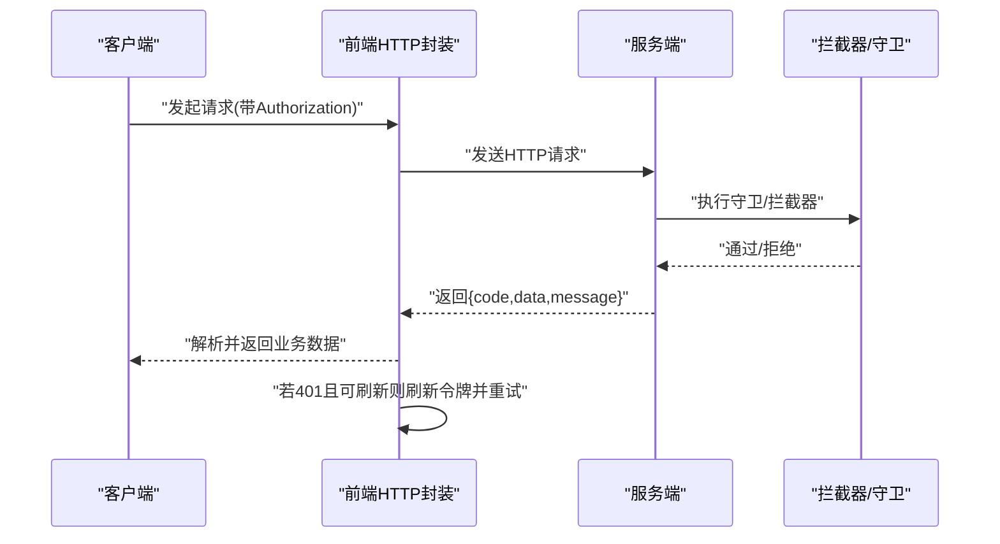
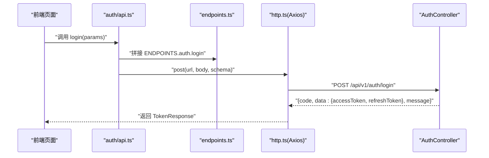
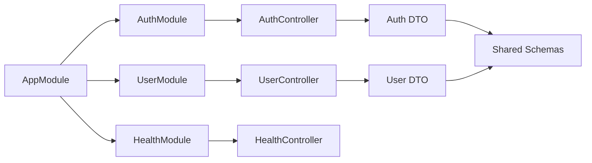

# API 文档

<cite>
**本文引用的文件**
- [apps/nestjs-server/src/modules/auth/auth.controller.ts](file://apps/nestjs-server/src/modules/auth/auth.controller.ts)
- [apps/nestjs-server/src/modules/auth/dto/auth.dto.ts](file://apps/nestjs-server/src/modules/auth/dto/auth.dto.ts)
- [apps/nestjs-server/src/modules/user/user.controller.ts](file://apps/nestjs-server/src/modules/user/user.controller.ts)
- [apps/nestjs-server/src/modules/user/dto/user.dto.ts](file://apps/nestjs-server/src/modules/user/dto/user.dto.ts)
- [apps/nestjs-server/src/modules/health/health.controller.ts](file://apps/nestjs-server/src/modules/health/health.controller.ts)
- [apps/web/src/api/core/endpoints.ts](file://apps/web/src/api/core/endpoints.ts)
- [apps/web/src/api/core/http.ts](file://apps/web/src/api/core/http.ts)
- [apps/web/src/api/modules/auth/api.ts](file://apps/web/src/api/modules/auth/api.ts)
- [apps/web/src/api/modules/user/api.ts](file://apps/web/src/api/modules/user/api.ts)
- [apps/web/src/api/modules/health/api.ts](file://apps/web/src/api/modules/health/api.ts)
- [apps/nestjs-server/src/app.module.ts](file://apps/nestjs-server/src/app.module.ts)
- [apps/nestjs-server/src/common/decorators/api-success-response.decorator.ts](file://apps/nestjs-server/src/common/decorators/api-success-response.decorator.ts)
- [apps/nestjs-server/src/common/enums/biz-code.enum.ts](file://apps/nestjs-server/src/common/enums/biz-code.enum.ts)
- [packages/shared/src/index.ts](file://packages/shared/src/index.ts)
</cite>

## 目录

1. [简介](#简介)
2. [项目结构](#项目结构)
3. [核心组件](#核心组件)
4. [架构总览](#架构总览)
5. [详细组件分析](#详细组件分析)
6. [依赖关系分析](#依赖关系分析)
7. [性能考虑](#性能考虑)
8. [故障排除指南](#故障排除指南)
9. [结论](#结论)
10. [附录](#附录)

## 简介

本文件为 Nebula 项目的完整 API 文档，覆盖认证模块（登录、注册、刷新令牌、退出登录、获取当前用户信息）、用户管理模块（CRUD 操作）、健康检查接口等。文档基于 NestJS 服务端与前端 Web 客户端的实际实现，统一采用共享的 Zod Schema 进行前后端字段一致性校验，并通过 Swagger 注解自动生成接口规范。同时提供 Postman 集合与 cURL 示例的使用指引。

## 项目结构

- 服务端采用 NestJS，模块化组织认证、用户、健康检查等功能；全局启用 JWT 守卫、限流守卫、拦截器与过滤器。
- 前端 Web 使用 Axios 封装 HTTP 请求，内置鉴权刷新流程与响应数据校验。
- 共享包提供统一的业务状态码、错误类型与 Zod Schema，确保前后端契约一致。

图表来源

- [apps/nestjs-server/src/app.module.ts:18-61](file://apps/nestjs-server/src/app.module.ts#L18-L61)
- [apps/nestjs-server/src/modules/auth/auth.controller.ts:30-115](file://apps/nestjs-server/src/modules/auth/auth.controller.ts#L30-L115)
- [apps/nestjs-server/src/modules/user/user.controller.ts:24-79](file://apps/nestjs-server/src/modules/user/user.controller.ts#L24-L79)
- [apps/nestjs-server/src/modules/health/health.controller.ts:8-86](file://apps/nestjs-server/src/modules/health/health.controller.ts#L8-L86)
- [apps/web/src/api/core/endpoints.ts:1-21](file://apps/web/src/api/core/endpoints.ts#L1-L21)
- [apps/web/src/api/core/http.ts:66-179](file://apps/web/src/api/core/http.ts#L66-L179)

章节来源

- [apps/nestjs-server/src/app.module.ts:18-61](file://apps/nestjs-server/src/app.module.ts#L18-L61)
- [apps/web/src/api/core/endpoints.ts:1-21](file://apps/web/src/api/core/endpoints.ts#L1-L21)

## 核心组件

- 认证模块：验证码获取、用户注册、账号密码登录、刷新访问令牌、退出登录、获取当前用户信息。
- 用户模块：创建用户、查询所有用户、按 ID 查询、更新用户、删除用户。
- 健康检查模块：健康状态检查、Ping 检查。
- 前端 HTTP 封装：统一请求头、鉴权刷新、响应数据校验与错误抛出。
- 共享 Schema：前后端字段与校验逻辑一致，保证契约稳定。

章节来源

- [apps/nestjs-server/src/modules/auth/auth.controller.ts:38-115](file://apps/nestjs-server/src/modules/auth/auth.controller.ts#L38-L115)
- [apps/nestjs-server/src/modules/user/user.controller.ts:28-79](file://apps/nestjs-server/src/modules/user/user.controller.ts#L28-L79)
- [apps/nestjs-server/src/modules/health/health.controller.ts:14-85](file://apps/nestjs-server/src/modules/health/health.controller.ts#L14-L85)
- [apps/web/src/api/core/http.ts:94-179](file://apps/web/src/api/core/http.ts#L94-L179)
- [packages/shared/src/index.ts:1-15](file://packages/shared/src/index.ts#L1-L15)

## 架构总览

- 服务端通过 Swagger 注解暴露 REST 接口，统一响应包装为 { code, data?, message }，其中 data 为具体业务对象或数组。
- 前端通过 Axios 发起请求，自动附加 Bearer Token；当 401 且存在刷新令牌时，自动触发刷新流程并重试原请求。
- 全局拦截器负责统一响应结构与日志记录；全局过滤器负责统一错误响应格式。

图表来源

- [apps/web/src/api/core/http.ts:94-179](file://apps/web/src/api/core/http.ts#L94-L179)
- [apps/nestjs-server/src/common/decorators/api-success-response.decorator.ts:88-126](file://apps/nestjs-server/src/common/decorators/api-success-response.decorator.ts#L88-L126)

章节来源

- [apps/web/src/api/core/http.ts:66-179](file://apps/web/src/api/core/http.ts#L66-L179)
- [apps/nestjs-server/src/common/decorators/api-success-response.decorator.ts:20-68](file://apps/nestjs-server/src/common/decorators/api-success-response.decorator.ts#L20-L68)

## 详细组件分析

### 认证模块 API

- 基础路径：/api/v1/auth
- 端点一览
  - GET /auth/captcha
    - 功能：获取 SVG 验证码，返回验证码 ID 与图片内容，登录时需携带。
    - 权限：公开访问
    - 限流：短时间窗口内限制次数
    - 响应：TokenResponse 或 CaptchaResponse（Swagger 注解已声明）
    - 状态码：200
  - POST /auth/register
    - 功能：注册新用户，成功后返回访问令牌与刷新令牌。
    - 权限：公开访问
    - 请求体：RegisterDto（字段来自共享 Schema）
    - 响应：TokenResponse
    - 状态码：201
  - POST /auth/login
    - 功能：账号密码登录，需提供验证码 ID 与验证码内容。
    - 权限：公开访问
    - 请求体：LoginDto（字段来自共享 Schema）
    - 响应：TokenResponse
    - 状态码：200
  - POST /auth/refresh
    - 功能：使用刷新令牌换取新的访问令牌与刷新令牌，旧刷新令牌立即失效。
    - 权限：公开访问
    - 请求体：RefreshTokenDto（字段来自共享 Schema）
    - 响应：TokenResponse
    - 状态码：200
  - POST /auth/logout
    - 功能：退出登录，撤销该用户的所有刷新令牌。
    - 权限：需要 JWT 令牌
    - 响应：无数据（仅 { code, message }）
    - 状态码：200
  - GET /auth/profile
    - 功能：获取当前登录用户信息（不含密码）。
    - 权限：需要 JWT 令牌
    - 响应：ProfileResponseDto
    - 状态码：200

- 请求参数与响应格式
  - 所有请求体均通过 Zod 校验，字段与共享 Schema 严格一致。
  - 响应统一包装为 { code:number, data, message:string }，Swagger 注解自动映射。

- 错误处理
  - 400 参数错误：ApiGlobalErrors 已在控制器/方法上标注。
  - 500 服务器内部错误：ApiGlobalErrors 已在控制器/方法上标注。
  - 401 未授权：前端自动触发刷新流程（若可用）。

- 速率限制
  - 登录接口短时间窗口限制为每 60 秒最多 5 次。
  - 验证码接口短时间窗口限制为每 60 秒最多 10 次。

章节来源

- [apps/nestjs-server/src/modules/auth/auth.controller.ts:38-115](file://apps/nestjs-server/src/modules/auth/auth.controller.ts#L38-L115)
- [apps/nestjs-server/src/modules/auth/dto/auth.dto.ts:13-30](file://apps/nestjs-server/src/modules/auth/dto/auth.dto.ts#L13-L30)
- [apps/web/src/api/modules/auth/api.ts:20-45](file://apps/web/src/api/modules/auth/api.ts#L20-L45)
- [apps/web/src/api/core/endpoints.ts:3-11](file://apps/web/src/api/core/endpoints.ts#L3-L11)
- [apps/nestjs-server/src/common/decorators/api-success-response.decorator.ts:136-148](file://apps/nestjs-server/src/common/decorators/api-success-response.decorator.ts#L136-L148)

### 用户模块 API

- 基础路径：/api/v1/users
- 端点一览
  - POST /users
    - 功能：创建用户，提供邮箱、用户名与密码。
    - 权限：需要 JWT 令牌
    - 请求体：CreateUserDto（字段来自共享 Schema）
    - 响应：UserResponseDto（时间字段为字符串）
    - 状态码：201
  - GET /users
    - 功能：获取所有用户列表（不含密码）。
    - 权限：需要 JWT 令牌
    - 响应：UserResponseDto 数组
    - 状态码：200
  - GET /users/:id
    - 功能：按 ID 获取用户详情（不含密码）。
    - 权限：需要 JWT 令牌
    - 响应：UserResponseDto
    - 状态码：200
  - PATCH /users/:id
    - 功能：更新指定用户信息（可选邮箱、用户名、显示名称）。
    - 权限：需要 JWT 令牌
    - 响应：UserResponseDto
    - 状态码：200
  - DELETE /users/:id
    - 功能：删除用户及其相关数据（不可恢复）。
    - 权限：需要 JWT 令牌
    - 响应：无数据（仅 { code, message }）
    - 状态码：200

- 请求参数与响应格式
  - 请求体通过 Zod 校验，字段与共享 Schema 一致。
  - 响应对象的时间字段使用后端 DateTimeStringSchema（Date 对象预处理为字符串）。

- 错误处理
  - 400/500 错误：统一由 ApiGlobalErrors 标注并在 Swagger 中展示。

章节来源

- [apps/nestjs-server/src/modules/user/user.controller.ts:28-79](file://apps/nestjs-server/src/modules/user/user.controller.ts#L28-L79)
- [apps/nestjs-server/src/modules/user/dto/user.dto.ts:14-26](file://apps/nestjs-server/src/modules/user/dto/user.dto.ts#L14-L26)
- [apps/web/src/api/modules/user/api.ts:15-34](file://apps/web/src/api/modules/user/api.ts#L15-L34)
- [apps/web/src/api/core/endpoints.ts:12](file://apps/web/src/api/core/endpoints.ts#L12)

### 健康检查 API

- 基础路径：/api/v1（根路径）
- 端点一览
  - GET /api/v1
    - 功能：健康状态检查，返回服务状态、时间戳、运行时长与数据库连接状态。
    - 权限：公开访问
    - 响应：包含 status、timestamp、uptime、database 的对象
    - 状态码：200
  - GET /api/v1/ping
    - 功能：Ping 检查，返回固定字符串。
    - 权限：公开访问
    - 响应：{ message:"pong" }
    - 状态码：200

- 速率限制
  - 健康检查跳过限流策略，便于频繁探测。

章节来源

- [apps/nestjs-server/src/modules/health/health.controller.ts:48-85](file://apps/nestjs-server/src/modules/health/health.controller.ts#L48-L85)
- [apps/web/src/api/modules/health/api.ts:19-25](file://apps/web/src/api/modules/health/api.ts#L19-L25)
- [apps/web/src/api/core/endpoints.ts:13-16](file://apps/web/src/api/core/endpoints.ts#L13-L16)

### 前端调用与鉴权刷新流程

- 端点常量：VITE_API_BASE_URL 默认为 /api/v1，包含认证、用户、健康检查等端点。
- HTTP 封装：
  - 自动附加 Authorization: Bearer Token
  - 统一响应解析与错误抛出
  - 401 且存在刷新令牌时，串行排队等待刷新完成并重试原请求
- 认证 API 封装：getCaptcha、register、login、refreshToken、logout、getProfile
- 用户 API 封装：createUser、getUsers、getUserById、updateUser、deleteUser
- 健康 API 封装：checkHealth、ping

图表来源

- [apps/web/src/api/modules/auth/api.ts:28-30](file://apps/web/src/api/modules/auth/api.ts#L28-L30)
- [apps/web/src/api/core/endpoints.ts:7](file://apps/web/src/api/core/endpoints.ts#L7)
- [apps/web/src/api/core/http.ts:191-206](file://apps/web/src/api/core/http.ts#L191-L206)
- [apps/nestjs-server/src/modules/auth/auth.controller.ts:72-76](file://apps/nestjs-server/src/modules/auth/auth.controller.ts#L72-L76)

章节来源

- [apps/web/src/api/core/endpoints.ts:1-21](file://apps/web/src/api/core/endpoints.ts#L1-L21)
- [apps/web/src/api/core/http.ts:94-179](file://apps/web/src/api/core/http.ts#L94-L179)
- [apps/web/src/api/modules/auth/api.ts:20-45](file://apps/web/src/api/modules/auth/api.ts#L20-L45)

## 依赖关系分析

- 服务端
  - AppModule 导入 AuthModule、UserModule、HealthModule、PrismaModule、LoggerModule 等，并注册全局守卫、拦截器、管道与过滤器。
  - 控制器通过 Swagger 注解声明接口规范，DTO 通过 createZodDto 与共享 Schema 绑定。
- 前端
  - 通过 endpoints.ts 统一管理端点，http.ts 统一封装请求与响应解析。
  - 各模块 API 文件对 http.ts 进行语义化封装。

图表来源

- [apps/nestjs-server/src/app.module.ts:18-61](file://apps/nestjs-server/src/app.module.ts#L18-L61)
- [apps/nestjs-server/src/modules/auth/dto/auth.dto.ts:13-30](file://apps/nestjs-server/src/modules/auth/dto/auth.dto.ts#L13-L30)
- [apps/nestjs-server/src/modules/user/dto/user.dto.ts:14-26](file://apps/nestjs-server/src/modules/user/dto/user.dto.ts#L14-L26)
- [packages/shared/src/index.ts:1-15](file://packages/shared/src/index.ts#L1-15)

章节来源

- [apps/nestjs-server/src/app.module.ts:18-61](file://apps/nestjs-server/src/app.module.ts#L18-L61)
- [apps/nestjs-server/src/modules/auth/dto/auth.dto.ts:13-30](file://apps/nestjs-server/src/modules/auth/dto/auth.dto.ts#L13-L30)
- [apps/nestjs-server/src/modules/user/dto/user.dto.ts:14-26](file://apps/nestjs-server/src/modules/user/dto/user.dto.ts#L14-L26)
- [packages/shared/src/index.ts:1-15](file://packages/shared/src/index.ts#L1-15)

## 性能考虑

- 限流策略：服务端为登录与验证码接口设置了短时间窗口内的请求上限，防止暴力破解与刷取验证码。
- 健康检查：跳过限流，便于监控系统高频探测。
- 前端鉴权刷新：采用串行队列避免并发刷新，减少无效请求与服务端压力。
- 响应数据校验：前端对响应进行 Zod 校验，提前发现数据结构异常，降低后续处理成本。

## 故障排除指南

- 400 参数错误
  - 现象：请求体不符合 Zod Schema。
  - 处理：检查字段类型、必填项与格式，参考 Swagger 文档。
- 401 未授权
  - 现象：缺少或无效的 Bearer Token。
  - 处理：前端会尝试使用刷新令牌刷新访问令牌；若失败请重新登录。
- 403 禁止访问
  - 现象：权限不足或令牌无效。
  - 处理：确认用户角色与权限范围。
- 500 服务器内部错误
  - 现象：服务端异常。
  - 处理：查看服务端日志与错误过滤器输出。
- 健康检查失败
  - 现象：/api/v1 返回 degraded 或数据库连接断开。
  - 处理：检查数据库连接与服务运行状态。

章节来源

- [apps/nestjs-server/src/common/decorators/api-success-response.decorator.ts:136-148](file://apps/nestjs-server/src/common/decorators/api-success-response.decorator.ts#L136-L148)
- [apps/web/src/api/core/http.ts:133-179](file://apps/web/src/api/core/http.ts#L133-L179)

## 结论

本项目通过共享 Schema 与 Swagger 注解实现了前后端一致的 API 规范，结合全局守卫、拦截器与过滤器，提供了安全、可观测与易维护的服务端架构。前端以 Axios 封装统一处理鉴权刷新与响应校验，提升了开发效率与用户体验。建议在生产环境中配合完善的监控与告警体系，持续优化限流策略与数据库连接池配置。

## 附录

### API 版本管理

- 当前基础路径为 /api/v1，未来可通过变更 VITE_API_BASE_URL 实现版本切换。
- 建议在共享 Schema 层面引入版本号字段，以便平滑迁移。

章节来源

- [apps/web/src/api/core/endpoints.ts:1](file://apps/web/src/api/core/endpoints.ts#L1)

### Swagger 文档集成

- 服务端通过 ApiTags、ApiBearerAuth、ApiSuccessResponse、ApiGlobalErrors 等装饰器自动生成接口文档。
- 可通过 Swagger UI 访问在线文档，确保与实际接口一致。

章节来源

- [apps/nestjs-server/src/modules/auth/auth.controller.ts:28-30](file://apps/nestjs-server/src/modules/auth/auth.controller.ts#L28-L30)
- [apps/nestjs-server/src/common/decorators/api-success-response.decorator.ts:88-126](file://apps/nestjs-server/src/common/decorators/api-success-response.decorator.ts#L88-L126)

### 客户端调用示例（概念性）

- 前端调用方式
  - 使用 endpoints.ts 提供的端点常量与 http.ts 封装的 get/post/patch/del 方法。
  - 认证流程：先获取验证码，再注册/登录，保存返回的访问令牌与刷新令牌，后续请求自动附加 Authorization。
- Postman 集合
  - 建议导入本仓库中与接口对应的集合文件（若存在），或基于 Swagger JSON 导入。
- cURL 示例
  - 获取验证码
    - curl -X GET "{{baseUrl}}/api/v1/auth/captcha"
  - 用户注册
    - curl -X POST "{{baseUrl}}/api/v1/auth/register" -H "Content-Type: application/json" -d '{}'
  - 用户登录
    - curl -X POST "{{baseUrl}}/api/v1/auth/login" -H "Content-Type: application/json" -d '{}'
  - 刷新令牌
    - curl -X POST "{{baseUrl}}/api/v1/auth/refresh" -H "Content-Type: application/json" -d '{}'
  - 退出登录
    - curl -X POST "{{baseUrl}}/api/v1/auth/logout" -H "Authorization: Bearer {{accessToken}}"
  - 获取当前用户信息
    - curl -X GET "{{baseUrl}}/api/v1/auth/profile" -H "Authorization: Bearer {{accessToken}}"
  - 创建用户
    - curl -X POST "{{baseUrl}}/api/v1/users" -H "Authorization: Bearer {{accessToken}}" -H "Content-Type: application/json" -d '{}'
  - 获取所有用户
    - curl -X GET "{{baseUrl}}/api/v1/users" -H "Authorization: Bearer {{accessToken}}"
  - 获取指定用户
    - curl -X GET "{{baseUrl}}/api/v1/users/{{id}}" -H "Authorization: Bearer {{accessToken}}"
  - 更新用户
    - curl -X PATCH "{{baseUrl}}/api/v1/users/{{id}}" -H "Authorization: Bearer {{accessToken}}" -H "Content-Type: application/json" -d '{}'
  - 删除用户
    - curl -X DELETE "{{baseUrl}}/api/v1/users/{{id}}" -H "Authorization: Bearer {{accessToken}}"
  - 健康检查
    - curl -X GET "{{baseUrl}}/api/v1"
  - Ping 检查
    - curl -X GET "{{baseUrl}}/api/v1/ping"
