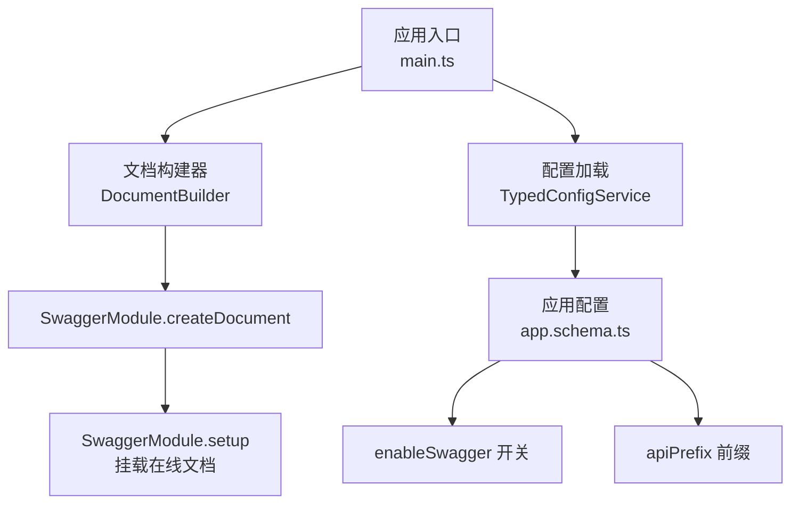
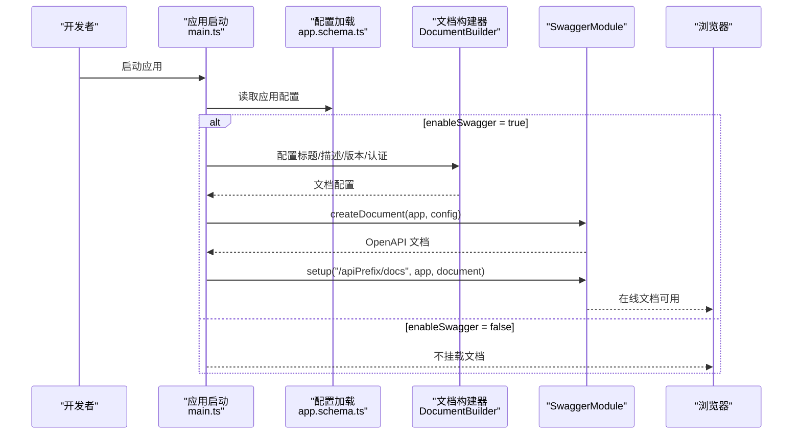
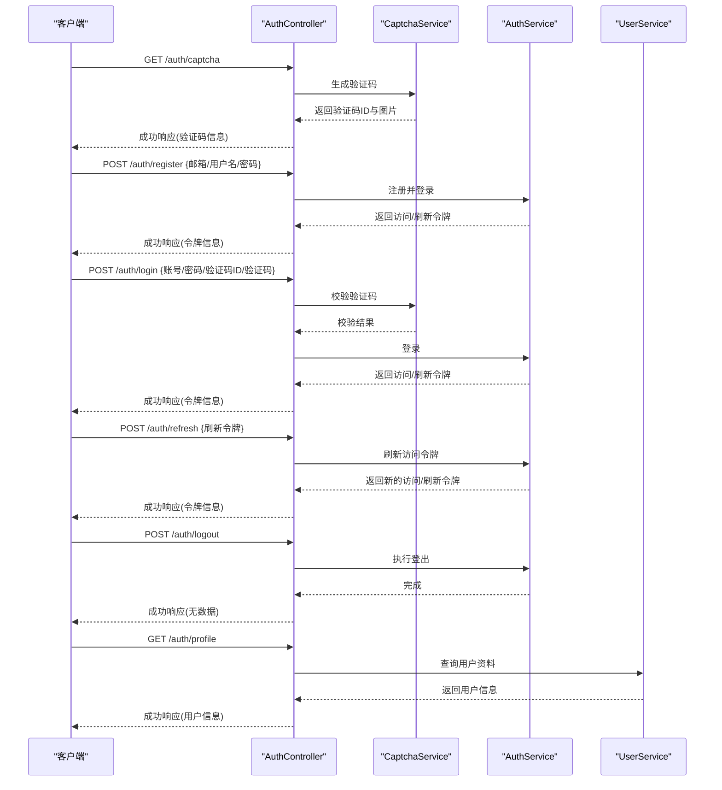
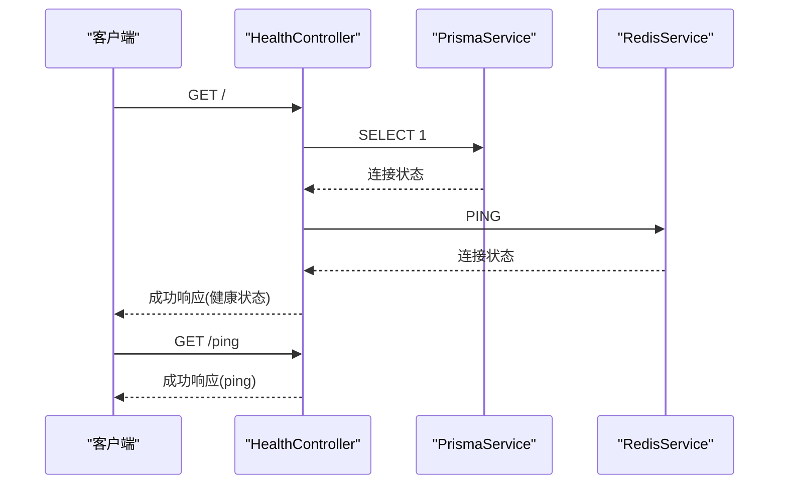
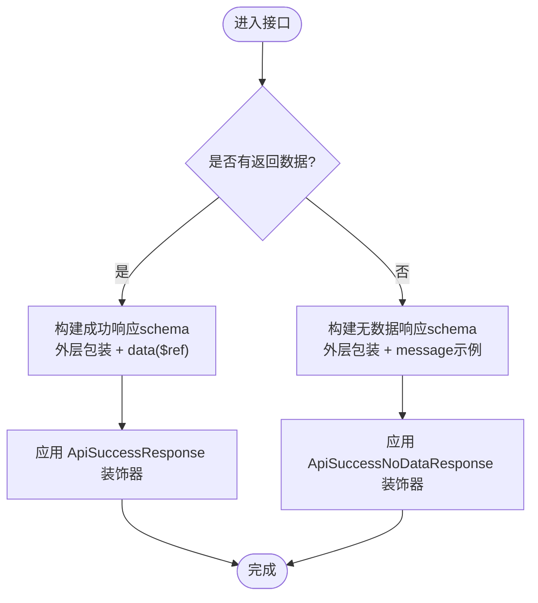
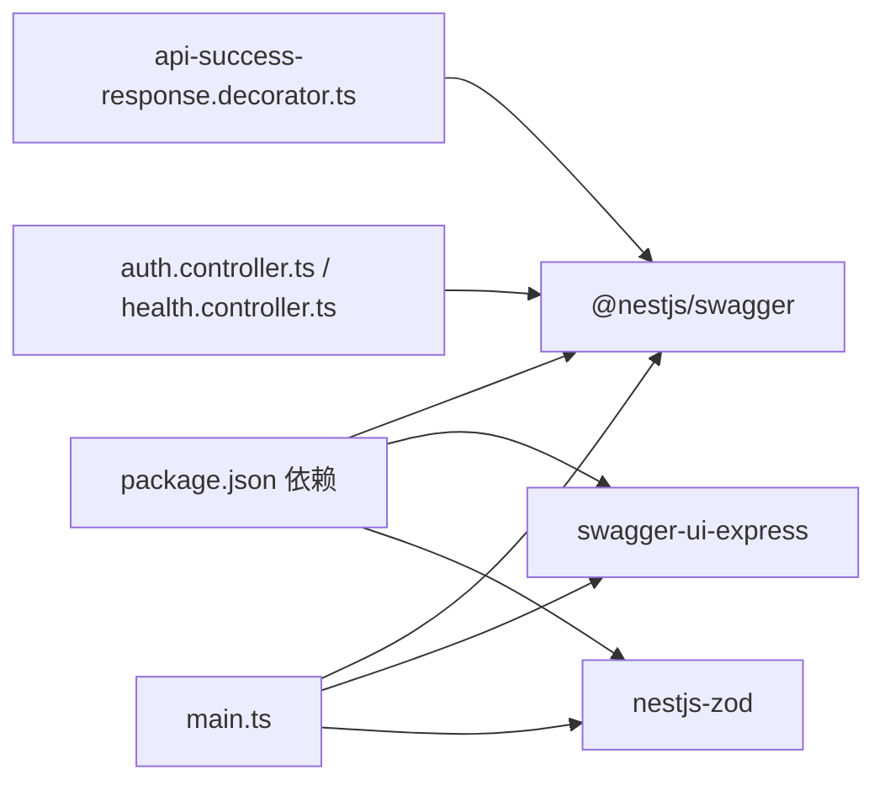

# Swagger 文档

<cite>
**本文引用的文件**
- [apps/nestjs-server/src/main.ts](file://apps/nestjs-server/src/main.ts)
- [apps/nestjs-server/src/config/schemas/app.schema.ts](file://apps/nestjs-server/src/config/schemas/app.schema.ts)
- [apps/nestjs-server/src/common/decorators/api-success-response.decorator.ts](file://apps/nestjs-server/src/common/decorators/api-success-response.decorator.ts)
- [apps/nestjs-server/src/common/decorators/response-message.decorator.ts](file://apps/nestjs-server/src/common/decorators/response-message.decorator.ts)
- [apps/nestjs-server/src/common/decorators/public.decorator.ts](file://apps/nestjs-server/src/common/decorators/public.decorator.ts)
- [apps/nestjs-server/src/modules/auth/auth.controller.ts](file://apps/nestjs-server/src/modules/auth/auth.controller.ts)
- [apps/nestjs-server/src/modules/health/health.controller.ts](file://apps/nestjs-server/src/modules/health/health.controller.ts)
- [apps/nestjs-server/package.json](file://apps/nestjs-server/package.json)
</cite>

## 目录
1. [简介](#简介)
2. [项目结构](#项目结构)
3. [核心组件](#核心组件)
4. [架构总览](#架构总览)
5. [详细组件分析](#详细组件分析)
6. [依赖关系分析](#依赖关系分析)
7. [性能考虑](#性能考虑)
8. [故障排查指南](#故障排查指南)
9. [结论](#结论)
10. [附录](#附录)

## 简介
本指南面向使用 NestJS 的开发者，系统讲解如何在本项目中启用、访问与维护 Swagger/OpenAPI 文档。内容涵盖：
- 如何访问在线文档
- 参数说明、请求示例与响应格式
- 文档定制化配置、标签分类与描述信息设置
- 交互式测试与调试技巧
- API 版本管理与文档更新流程

## 项目结构
Swagger 在本项目的启用位置与关键配置如下：
- 应用启动时按环境变量动态决定是否启用 Swagger，并在指定前缀路径下挂载在线文档界面
- 使用装饰器为控制器与接口补充标签、摘要、描述与响应模型
- 通过统一的成功响应装饰器与全局错误响应装饰器，保证文档与实际返回结构一致

图表来源
- [apps/nestjs-server/src/main.ts:24-33](file://apps/nestjs-server/src/main.ts#L24-L33)
- [apps/nestjs-server/src/config/schemas/app.schema.ts:3-9](file://apps/nestjs-server/src/config/schemas/app.schema.ts#L3-L9)

章节来源
- [apps/nestjs-server/src/main.ts:1-46](file://apps/nestjs-server/src/main.ts#L1-L46)
- [apps/nestjs-server/src/config/schemas/app.schema.ts:1-12](file://apps/nestjs-server/src/config/schemas/app.schema.ts#L1-L12)

## 核心组件
- 文档构建与挂载
  - 在应用启动时，根据配置决定是否启用 Swagger；若启用，则使用 DocumentBuilder 构建文档元信息（标题、描述、版本、认证方式），随后通过 SwaggerModule.createDocument 生成文档，并通过 SwaggerModule.setup 将在线文档路由挂载到 {apiPrefix}/docs
  - 文档在开发环境下默认开启，生产环境可通过配置关闭
- 装饰器体系
  - 控制器级：使用 ApiTags 为模块分组，便于在文档中按模块查看接口
  - 接口级：使用 ApiOperation 提供摘要与描述；使用 ApiSuccessResponse 或 ApiSuccessNoDataResponse 描述成功响应结构；使用 ApiGlobalErrors 注入 400/500 错误响应文档
  - 认证：使用 ApiBearerAuth 为需要鉴权的接口标注 Bearer Token
  - 公开接口：使用 Public 装饰器标注无需鉴权的接口，便于在文档中识别
- 统一响应包装
  - 所有成功响应均遵循统一的外层包装结构 { code, data?, message }，其中 data 通过 $ref 引用具体 DTO 的 schema，确保文档与运行时一致
  - 无数据响应（如删除、登出）通过 ApiSuccessNoDataResponse 自动填充 message 示例

章节来源
- [apps/nestjs-server/src/main.ts:24-33](file://apps/nestjs-server/src/main.ts#L24-L33)
- [apps/nestjs-server/src/common/decorators/api-success-response.decorator.ts:82-126](file://apps/nestjs-server/src/common/decorators/api-success-response.decorator.ts#L82-L126)
- [apps/nestjs-server/src/common/decorators/api-success-response.decorator.ts:136-148](file://apps/nestjs-server/src/common/decorators/api-success-response.decorator.ts#L136-L148)
- [apps/nestjs-server/src/common/decorators/public.decorator.ts:1-4](file://apps/nestjs-server/src/common/decorators/public.decorator.ts#L1-L4)

## 架构总览
下图展示 Swagger 文档从构建到对外提供的完整链路。

图表来源
- [apps/nestjs-server/src/main.ts:24-33](file://apps/nestjs-server/src/main.ts#L24-L33)
- [apps/nestjs-server/src/config/schemas/app.schema.ts:3-9](file://apps/nestjs-server/src/config/schemas/app.schema.ts#L3-L9)

## 详细组件分析

### 认证模块接口文档
- 分类与权限
  - 使用 ApiTags('认证模块') 对接口进行分组
  - 部分接口使用 ApiBearerAuth 标注需要 Bearer Token
  - 使用 Public 装饰器标识无需鉴权的接口
- 接口示例
  - 获取验证码：公开接口，返回验证码 ID 与图片内容
  - 用户注册：公开接口，创建用户并返回访问/刷新令牌
  - 用户登录：公开接口，校验验证码后返回访问/刷新令牌
  - 刷新访问令牌：公开接口，使用刷新令牌换取新令牌
  - 退出登录：需要鉴权，执行登出并使刷新令牌失效
  - 获取当前用户信息：需要鉴权，返回用户资料
- 响应模型
  - 成功响应统一采用 ApiSuccessResponse 装饰器，data 字段引用对应 DTO 的 schema
  - 退出登录等无数据场景使用 ApiSuccessNoDataResponse，自动填充 message 示例

图表来源
- [apps/nestjs-server/src/modules/auth/auth.controller.ts:28-115](file://apps/nestjs-server/src/modules/auth/auth.controller.ts#L28-L115)

章节来源
- [apps/nestjs-server/src/modules/auth/auth.controller.ts:1-115](file://apps/nestjs-server/src/modules/auth/auth.controller.ts#L1-L115)

### 健康检查接口文档
- 分类与权限
  - 使用 ApiTags('health') 对接口进行分组
  - 使用 Public 与 SkipThrottle 标识公开且跳过速率限制
- 接口示例
  - 健康检查：返回服务状态、时间戳、运行时长以及数据库与缓存连接状态
  - Ping 检查：返回简单的 pong 响应
- 响应模型
  - 使用 ApiResponse + schema 显式声明响应结构，确保文档与实际一致

图表来源
- [apps/nestjs-server/src/modules/health/health.controller.ts:9-99](file://apps/nestjs-server/src/modules/health/health.controller.ts#L9-L99)

章节来源
- [apps/nestjs-server/src/modules/health/health.controller.ts:1-99](file://apps/nestjs-server/src/modules/health/health.controller.ts#L1-L99)

### 统一响应与错误文档
- 成功响应
  - ApiSuccessResponse：为接口标注成功响应结构，支持单对象与数组两种形态
  - ApiSuccessNoDataResponse：为无数据响应（如删除、登出）标注 message 示例
- 全局错误响应
  - ApiGlobalErrors：为接口或控制器注入 400 与 500 错误响应文档，确保与异常过滤器的统一错误结构一致
- 元数据联动
  - 当使用 ApiSuccessNoDataResponse 并传入 message 时，会同时设置响应消息元数据，便于拦截器与装饰器协同

图表来源
- [apps/nestjs-server/src/common/decorators/api-success-response.decorator.ts:82-126](file://apps/nestjs-server/src/common/decorators/api-success-response.decorator.ts#L82-L126)
- [apps/nestjs-server/src/common/decorators/api-success-response.decorator.ts:136-148](file://apps/nestjs-server/src/common/decorators/api-success-response.decorator.ts#L136-L148)

章节来源
- [apps/nestjs-server/src/common/decorators/api-success-response.decorator.ts:1-149](file://apps/nestjs-server/src/common/decorators/api-success-response.decorator.ts#L1-L149)
- [apps/nestjs-server/src/common/decorators/response-message.decorator.ts:1-5](file://apps/nestjs-server/src/common/decorators/response-message.decorator.ts#L1-L5)

## 依赖关系分析
- Swagger 相关依赖
  - @nestjs/swagger：提供装饰器与文档生成能力
  - swagger-ui-express：提供在线文档界面
  - nestjs-zod：提供 OpenAPI 文档清理工具，确保与 Zod 校验器生成的 schema 一致
- 项目内集成点
  - 应用入口通过 DocumentBuilder 与 SwaggerModule 完成文档构建与挂载
  - 控制器通过装饰器完善接口元信息
  - 统一响应装饰器确保文档与运行时输出一致

图表来源
- [apps/nestjs-server/package.json:36-55](file://apps/nestjs-server/package.json#L36-L55)
- [apps/nestjs-server/src/main.ts:24-33](file://apps/nestjs-server/src/main.ts#L24-L33)
- [apps/nestjs-server/src/common/decorators/api-success-response.decorator.ts:1-11](file://apps/nestjs-server/src/common/decorators/api-success-response.decorator.ts#L1-L11)
- [apps/nestjs-server/src/modules/auth/auth.controller.ts:28-115](file://apps/nestjs-server/src/modules/auth/auth.controller.ts#L28-L115)
- [apps/nestjs-server/src/modules/health/health.controller.ts:9-99](file://apps/nestjs-server/src/modules/health/health.controller.ts#L9-L99)

章节来源
- [apps/nestjs-server/package.json:1-85](file://apps/nestjs-server/package.json#L1-L85)

## 性能考虑
- 文档生成与挂载仅在应用启动阶段执行一次，对运行时性能影响极小
- 在生产环境建议关闭 Swagger，避免暴露接口细节与潜在安全风险
- 若接口较多，建议合理使用 ApiTags 进行模块化分组，提升文档可读性

## 故障排查指南
- 无法访问在线文档
  - 检查配置项 enableSwagger 是否为 true
  - 确认 apiPrefix 是否正确，文档地址为 {host}/{apiPrefix}/docs
  - 查看应用启动日志中 Swagger 文档可用的提示信息
- 文档与实际响应不一致
  - 确认接口是否使用了 ApiSuccessResponse 或 ApiSuccessNoDataResponse
  - 确认是否使用了 ApiGlobalErrors 以统一 400/500 错误文档
  - 若使用了 createZodDto，请确认已配合 nestjs-zod 的文档清理工具
- 认证相关问题
  - 需要鉴权的接口请使用 ApiBearerAuth 标注
  - 公开接口请使用 Public 装饰器，避免被鉴权守卫拦截
- 速率限制导致接口不可用
  - 对于健康检查等高频接口，可使用 SkipThrottle 跳过限制

章节来源
- [apps/nestjs-server/src/main.ts:38-43](file://apps/nestjs-server/src/main.ts#L38-L43)
- [apps/nestjs-server/src/common/decorators/public.decorator.ts:1-4](file://apps/nestjs-server/src/common/decorators/public.decorator.ts#L1-L4)
- [apps/nestjs-server/src/common/decorators/api-success-response.decorator.ts:136-148](file://apps/nestjs-server/src/common/decorators/api-success-response.decorator.ts#L136-L148)

## 结论
本项目通过装饰器与统一响应包装，实现了与运行时一致的 Swagger 文档。开发者只需在控制器与接口上添加必要的装饰器，即可获得结构清晰、易于交互测试的在线文档。建议在开发与联调阶段开启 Swagger，在生产环境关闭以降低风险。

## 附录

### 如何访问在线文档
- 开发环境默认开启 Swagger，启动应用后访问 {host}/{apiPrefix}/docs
- 生产环境可通过配置关闭 Swagger，避免暴露接口详情

章节来源
- [apps/nestjs-server/src/main.ts:24-33](file://apps/nestjs-server/src/main.ts#L24-L33)
- [apps/nestjs-server/src/config/schemas/app.schema.ts:3-9](file://apps/nestjs-server/src/config/schemas/app.schema.ts#L3-L9)

### 参数说明、请求示例与响应格式
- 参数说明
  - 使用 ApiOperation 提供接口摘要与描述
  - 使用 ApiTags 对接口进行模块化分组
- 请求示例
  - 在 Swagger UI 中直接填写参数并发送请求，支持 Bearer Token
- 响应格式
  - 成功响应统一为 { code, data?, message }，其中 data 通过 $ref 引用具体 DTO
  - 无数据响应仅包含 code 与 message

章节来源
- [apps/nestjs-server/src/modules/auth/auth.controller.ts:40-115](file://apps/nestjs-server/src/modules/auth/auth.controller.ts#L40-L115)
- [apps/nestjs-server/src/modules/health/health.controller.ts:18-99](file://apps/nestjs-server/src/modules/health/health.controller.ts#L18-L99)
- [apps/nestjs-server/src/common/decorators/api-success-response.decorator.ts:20-68](file://apps/nestjs-server/src/common/decorators/api-success-response.decorator.ts#L20-L68)

### 文档定制化配置、标签分类与描述信息
- 标题、描述与版本
  - 在 DocumentBuilder 中设置标题、描述与版本号
- 认证方式
  - 使用 addBearerAuth 为需要鉴权的接口提供认证说明
- 标签分类
  - 使用 ApiTags 为控制器或接口分组，便于在文档中筛选
- 描述信息
  - 使用 ApiOperation(summary, description) 为接口提供简短与详细说明

章节来源
- [apps/nestjs-server/src/main.ts:25-30](file://apps/nestjs-server/src/main.ts#L25-L30)
- [apps/nestjs-server/src/modules/auth/auth.controller.ts:28](file://apps/nestjs-server/src/modules/auth/auth.controller.ts#L28)
- [apps/nestjs-server/src/modules/health/health.controller.ts:9](file://apps/nestjs-server/src/modules/health/health.controller.ts#L9)

### 交互式测试与调试技巧
- 在线测试
  - 在 Swagger UI 中选择接口，填写参数，点击“Try it out”发送请求
  - 可直接在页面看到请求与响应的完整过程
- 调试技巧
  - 对高频接口使用 SkipThrottle 跳过速率限制
  - 对公开接口使用 Public 装饰器，避免被鉴权守卫拦截
  - 使用统一的 ApiGlobalErrors 保证错误响应的一致性

章节来源
- [apps/nestjs-server/src/common/decorators/skip-throttle.decorator.ts:1-12](file://apps/nestjs-server/src/common/decorators/skip-throttle.decorator.ts#L1-L12)
- [apps/nestjs-server/src/common/decorators/public.decorator.ts:1-4](file://apps/nestjs-server/src/common/decorators/public.decorator.ts#L1-L4)
- [apps/nestjs-server/src/common/decorators/api-success-response.decorator.ts:136-148](file://apps/nestjs-server/src/common/decorators/api-success-response.decorator.ts#L136-L148)

### API 版本管理与文档更新流程
- 版本管理
  - 在 DocumentBuilder 中设置版本号，作为文档版本依据
- 文档更新流程
  - 修改控制器接口的 ApiOperation、ApiTags、ApiSuccessResponse 等装饰器
  - 重新启动应用，访问 {host}/{apiPrefix}/docs 即可查看最新文档
  - 如需清理与 Zod schema 对齐的文档，可使用 nestjs-zod 的清理工具

章节来源
- [apps/nestjs-server/src/main.ts:25-30](file://apps/nestjs-server/src/main.ts#L25-L30)
- [apps/nestjs-server/src/common/decorators/api-success-response.decorator.ts:82-126](file://apps/nestjs-server/src/common/decorators/api-success-response.decorator.ts#L82-L126)