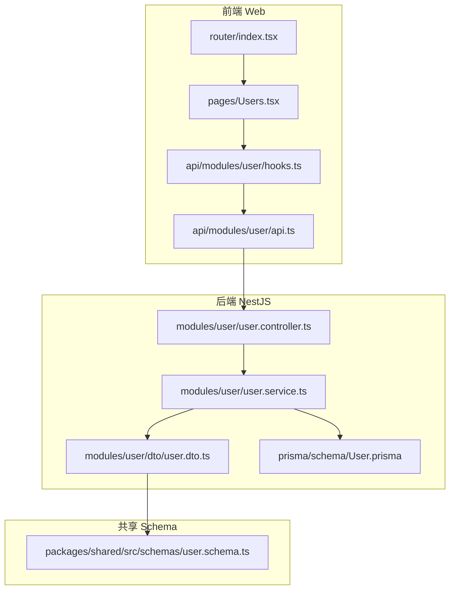
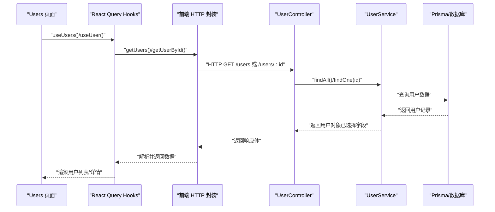
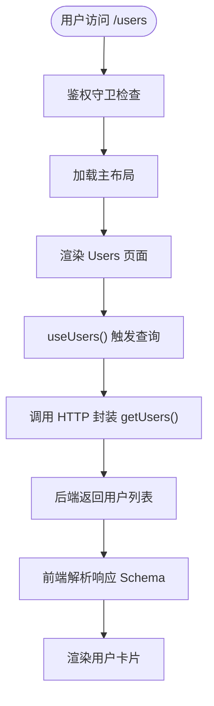
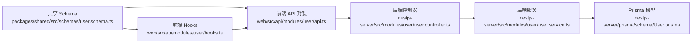

# 用户管理 API

<cite>
**本文引用的文件**
- [apps/nestjs-server/src/modules/user/user.controller.ts](file://apps/nestjs-server/src/modules/user/user.controller.ts)
- [apps/nestjs-server/src/modules/user/user.service.ts](file://apps/nestjs-server/src/modules/user/user.service.ts)
- [apps/nestjs-server/src/modules/user/dto/user.dto.ts](file://apps/nestjs-server/src/modules/user/dto/user.dto.ts)
- [apps/web/src/api/modules/user/api.ts](file://apps/web/src/api/modules/user/api.ts)
- [apps/web/src/api/modules/user/hooks.ts](file://apps/web/src/api/modules/user/hooks.ts)
- [apps/web/src/pages/Users.tsx](file://apps/web/src/pages/Users.tsx)
- [apps/web/src/router/index.tsx](file://apps/web/src/router/index.tsx)
- [apps/nestjs-server/prisma/schema/User.prisma](file://apps/nestjs-server/prisma/schema/User.prisma)
- [packages/shared/src/schemas/user.schema.ts](file://packages/shared/src/schemas/user.schema.ts)
</cite>

## 目录

1. [简介](#简介)
2. [项目结构](#项目结构)
3. [核心组件](#核心组件)
4. [架构总览](#架构总览)
5. [详细组件分析](#详细组件分析)
6. [依赖关系分析](#依赖关系分析)
7. [性能考虑](#性能考虑)
8. [故障排查指南](#故障排查指南)
9. [结论](#结论)
10. [附录](#附录)

## 简介

本文件面向“用户管理 API”的使用者与维护者，系统化梳理后端 NestJS 服务与前端 React 应用之间的用户 CRUD 接口设计与实现，覆盖以下能力：

- RESTful 端点：创建、读取、更新、删除用户
- 数据模型与字段验证：基于 Zod Schema 的请求/响应校验
- 权限控制：基于 JWT 的认证装饰器与守卫
- 前端集成：React Query Hooks 与路由页面联动
- 扩展方向：分页、筛选、排序、批量操作、导入导出等（当前仓库未实现，但具备扩展基础）

## 项目结构

用户管理相关代码分布在后端模块与前端模块中，采用“共享 Schema + 双端校验”的设计：

- 后端：NestJS 控制器、服务、DTO、Prisma 模型
- 前端：HTTP 封装、React Query Hooks、页面组件
- 共享：Zod Schema 定义于共享包，前后端复用

图表来源

- [apps/web/src/api/modules/user/api.ts:1-34](file://apps/web/src/api/modules/user/api.ts#L1-L34)
- [apps/web/src/api/modules/user/hooks.ts:1-56](file://apps/web/src/api/modules/user/hooks.ts#L1-L56)
- [apps/web/src/pages/Users.tsx:1-34](file://apps/web/src/pages/Users.tsx#L1-L34)
- [apps/web/src/router/index.tsx:1-51](file://apps/web/src/router/index.tsx#L1-L51)
- [apps/nestjs-server/src/modules/user/user.controller.ts:1-79](file://apps/nestjs-server/src/modules/user/user.controller.ts#L1-L79)
- [apps/nestjs-server/src/modules/user/user.service.ts:1-113](file://apps/nestjs-server/src/modules/user/user.service.ts#L1-L113)
- [apps/nestjs-server/src/modules/user/dto/user.dto.ts:1-26](file://apps/nestjs-server/src/modules/user/dto/user.dto.ts#L1-L26)
- [apps/nestjs-server/prisma/schema/User.prisma:1-15](file://apps/nestjs-server/prisma/schema/User.prisma#L1-L15)
- [packages/shared/src/schemas/user.schema.ts:1-33](file://packages/shared/src/schemas/user.schema.ts#L1-L33)

章节来源

- [apps/web/src/api/modules/user/api.ts:1-34](file://apps/web/src/api/modules/user/api.ts#L1-L34)
- [apps/web/src/api/modules/user/hooks.ts:1-56](file://apps/web/src/api/modules/user/hooks.ts#L1-L56)
- [apps/web/src/pages/Users.tsx:1-34](file://apps/web/src/pages/Users.tsx#L1-L34)
- [apps/web/src/router/index.tsx:1-51](file://apps/web/src/router/index.tsx#L1-L51)
- [apps/nestjs-server/src/modules/user/user.controller.ts:1-79](file://apps/nestjs-server/src/modules/user/user.controller.ts#L1-L79)
- [apps/nestjs-server/src/modules/user/user.service.ts:1-113](file://apps/nestjs-server/src/modules/user/user.service.ts#L1-L113)
- [apps/nestjs-server/src/modules/user/dto/user.dto.ts:1-26](file://apps/nestjs-server/src/modules/user/dto/user.dto.ts#L1-L26)
- [apps/nestjs-server/prisma/schema/User.prisma:1-15](file://apps/nestjs-server/prisma/schema/User.prisma#L1-L15)
- [packages/shared/src/schemas/user.schema.ts:1-33](file://packages/shared/src/schemas/user.schema.ts#L1-L33)

## 核心组件

- 用户控制器（UserController）：暴露 RESTful 端点，负责请求映射与响应包装
- 用户服务（UserService）：业务逻辑封装，含密码哈希、唯一性约束、错误处理
- 用户 DTO 与 Schema：前后端统一的数据契约，确保类型安全与一致性
- 前端 API 封装与 Hooks：对后端接口进行封装，并通过 React Query 进行缓存与状态管理
- Prisma 模型：数据库表结构定义与索引约束

章节来源

- [apps/nestjs-server/src/modules/user/user.controller.ts:24-78](file://apps/nestjs-server/src/modules/user/user.controller.ts#L24-L78)
- [apps/nestjs-server/src/modules/user/user.service.ts:14-112](file://apps/nestjs-server/src/modules/user/user.service.ts#L14-L112)
- [apps/nestjs-server/src/modules/user/dto/user.dto.ts:1-26](file://apps/nestjs-server/src/modules/user/dto/user.dto.ts#L1-L26)
- [apps/web/src/api/modules/user/api.ts:1-34](file://apps/web/src/api/modules/user/api.ts#L1-L34)
- [apps/web/src/api/modules/user/hooks.ts:1-56](file://apps/web/src/api/modules/user/hooks.ts#L1-L56)
- [apps/nestjs-server/prisma/schema/User.prisma:1-15](file://apps/nestjs-server/prisma/schema/User.prisma#L1-L15)

## 架构总览

下图展示从前端到后端的关键交互流程，以及数据在各层之间的传递与转换。

图表来源

- [apps/web/src/pages/Users.tsx:6-33](file://apps/web/src/pages/Users.tsx#L6-L33)
- [apps/web/src/api/modules/user/hooks.ts:9-22](file://apps/web/src/api/modules/user/hooks.ts#L9-L22)
- [apps/web/src/api/modules/user/api.ts:19-25](file://apps/web/src/api/modules/user/api.ts#L19-L25)
- [apps/nestjs-server/src/modules/user/user.controller.ts:39-57](file://apps/nestjs-server/src/modules/user/user.controller.ts#L39-L57)
- [apps/nestjs-server/src/modules/user/user.service.ts:33-51](file://apps/nestjs-server/src/modules/user/user.service.ts#L33-L51)

## 详细组件分析

### 用户控制器（RESTful 端点）

- 创建用户
  - 方法与路径：POST /users
  - 认证：需要 Bearer Token（受保护端点）
  - 输入：CreateUserDto（邮箱、用户名、密码等）
  - 输出：UserResponse（不包含敏感字段）
  - 处理：委托 UserService.create
- 获取所有用户
  - 方法与路径：GET /users
  - 输出：UserResponse 数组
  - 处理：委托 UserService.findAll
- 根据 ID 获取用户
  - 方法与路径：GET /users/:id
  - 输出：单个 UserResponse
  - 处理：委托 UserService.findOne
- 更新用户
  - 方法与路径：PATCH /users/:id
  - 输入：UpdateUserDto（可部分字段）
  - 输出：更新后的 UserResponse
  - 处理：委托 UserService.update
- 删除用户
  - 方法与路径：DELETE /users/:id
  - 输出：空响应（成功）
  - 处理：委托 UserService.remove

章节来源

- [apps/nestjs-server/src/modules/user/user.controller.ts:28-78](file://apps/nestjs-server/src/modules/user/user.controller.ts#L28-L78)

### 用户服务（业务逻辑与数据访问）

- 密码处理：注册时对明文密码进行哈希存储；登录时比对密码
- 数据访问：通过 Prisma 查询/更新/删除用户；仅返回白名单字段（select）
- 错误处理：当用户不存在时抛出业务异常
- 辅助查询：按邮箱、用户名、账号（邮箱或用户名）查询用户

章节来源

- [apps/nestjs-server/src/modules/user/user.service.ts:17-97](file://apps/nestjs-server/src/modules/user/user.service.ts#L17-L97)

### 数据模型与字段验证

- Prisma 模型（User）
  - 字段：id、email（唯一）、username（唯一）、password、name、isActive、createdAt、updatedAt
  - 关系：与 RefreshToken、Role 的关联
- 共享 Schema（Create/Update/Response）
  - Create：邮箱、用户名、密码、可选显示名
  - Update：Create 的可选子集（排除密码）
  - Response：包含 id、邮箱、用户名、显示名、启用状态、创建/更新时间（字符串）
- 后端响应 Schema 覆盖时间字段为字符串格式，确保前后端一致

章节来源

- [apps/nestjs-server/prisma/schema/User.prisma:1-15](file://apps/nestjs-server/prisma/schema/User.prisma#L1-L15)
- [packages/shared/src/schemas/user.schema.ts:12-29](file://packages/shared/src/schemas/user.schema.ts#L12-L29)
- [apps/nestjs-server/src/modules/user/dto/user.dto.ts:14-19](file://apps/nestjs-server/src/modules/user/dto/user.dto.ts#L14-L19)

### 前端集成与状态管理

- HTTP 封装
  - 提供 createUser、getUsers、getUserById、updateUser、deleteUser 方法
  - 使用共享 Schema 进行参数与响应的编译校验
- React Query Hooks
  - useUsers/useUser：查询用户列表与单个用户
  - useCreateUser/useUpdateUser/useDeleteUser：变更用户数据并自动失效缓存
- 页面组件
  - Users 页面通过 useUsers 渲染用户卡片列表
- 路由
  - /users 路由受鉴权保护，进入主布局

图表来源

- [apps/web/src/router/index.tsx:12-31](file://apps/web/src/router/index.tsx#L12-L31)
- [apps/web/src/pages/Users.tsx:6-33](file://apps/web/src/pages/Users.tsx#L6-L33)
- [apps/web/src/api/modules/user/hooks.ts:9-22](file://apps/web/src/api/modules/user/hooks.ts#L9-L22)
- [apps/web/src/api/modules/user/api.ts:19-21](file://apps/web/src/api/modules/user/api.ts#L19-L21)

章节来源

- [apps/web/src/api/modules/user/api.ts:15-33](file://apps/web/src/api/modules/user/api.ts#L15-L33)
- [apps/web/src/api/modules/user/hooks.ts:9-55](file://apps/web/src/api/modules/user/hooks.ts#L9-L55)
- [apps/web/src/pages/Users.tsx:6-33](file://apps/web/src/pages/Users.tsx#L6-L33)
- [apps/web/src/router/index.tsx:12-31](file://apps/web/src/router/index.tsx#L12-L31)

### 权限控制机制

- 控制器层
  - 使用 Bearer 认证装饰器与全局错误装饰器
- 守卫与拦截器
  - JWT 认证守卫与节流守卫（位于通用 guards 与 interceptors 中）
- 建议
  - 在需要管理员权限的场景，可在控制器或方法上增加角色守卫与自定义装饰器

章节来源

- [apps/nestjs-server/src/modules/user/user.controller.ts:21-24](file://apps/nestjs-server/src/modules/user/user.controller.ts#L21-L24)

### 扩展能力：分页、筛选、排序、批量操作、导入导出

- 当前实现
  - 未提供分页、筛选、排序参数
  - 未提供批量操作与导入导出接口
- 扩展建议
  - 分页/筛选/排序：在控制器新增查询参数，服务层构建动态 where/select/orderBy
  - 批量操作：新增批量创建/更新/删除端点，服务层使用事务与批量写入
  - 导入导出：新增文件上传/下载端点，结合 CSV/Excel 解析与生成
  - 注意：以上为扩展方向，非当前仓库实现内容

## 依赖关系分析

- 前端依赖后端接口与共享 Schema
- 后端依赖 Prisma 与业务异常枚举
- 共享 Schema 作为前后端契约，避免重复实现

图表来源

- [packages/shared/src/schemas/user.schema.ts:1-33](file://packages/shared/src/schemas/user.schema.ts#L1-L33)
- [apps/web/src/api/modules/user/api.ts:1-34](file://apps/web/src/api/modules/user/api.ts#L1-L34)
- [apps/web/src/api/modules/user/hooks.ts:1-56](file://apps/web/src/api/modules/user/hooks.ts#L1-L56)
- [apps/nestjs-server/src/modules/user/user.controller.ts:1-79](file://apps/nestjs-server/src/modules/user/user.controller.ts#L1-L79)
- [apps/nestjs-server/src/modules/user/user.service.ts:1-113](file://apps/nestjs-server/src/modules/user/user.service.ts#L1-L113)
- [apps/nestjs-server/prisma/schema/User.prisma:1-15](file://apps/nestjs-server/prisma/schema/User.prisma#L1-L15)

章节来源

- [apps/nestjs-server/src/modules/user/user.controller.ts:1-79](file://apps/nestjs-server/src/modules/user/user.controller.ts#L1-L79)
- [apps/nestjs-server/src/modules/user/user.service.ts:1-113](file://apps/nestjs-server/src/modules/user/user.service.ts#L1-L113)
- [apps/web/src/api/modules/user/api.ts:1-34](file://apps/web/src/api/modules/user/api.ts#L1-L34)
- [apps/web/src/api/modules/user/hooks.ts:1-56](file://apps/web/src/api/modules/user/hooks.ts#L1-L56)
- [apps/nestjs-server/prisma/schema/User.prisma:1-15](file://apps/nestjs-server/prisma/schema/User.prisma#L1-L15)
- [packages/shared/src/schemas/user.schema.ts:1-33](file://packages/shared/src/schemas/user.schema.ts#L1-L33)

## 性能考虑

- 查询优化
  - 服务层使用 select 白名单字段，避免传输敏感与冗余数据
  - 单条查询使用 findUnique，保证唯一性与性能
- 缓存策略
  - 前端使用 React Query，默认缓存策略与失效机制减少重复请求
- 安全与成本
  - 密码哈希使用固定轮数，平衡安全性与性能
  - 批量操作建议引入事务与分批处理，避免长事务阻塞

## 故障排查指南

- 常见问题
  - 用户不存在：服务层在找不到用户时抛出业务异常
  - 参数校验失败：前后端均使用 Zod Schema 校验，需检查字段类型与长度
  - 认证失败：确认请求头携带有效 Bearer Token
- 建议排查步骤
  - 检查控制器装饰器与守卫配置
  - 查看服务层日志与异常栈
  - 使用前端 Hooks 的错误提示定位问题
- 相关实现参考
  - 业务异常抛出与用户查询逻辑
  - 前端错误 UI 组件与查询状态

章节来源

- [apps/nestjs-server/src/modules/user/user.service.ts:46-48](file://apps/nestjs-server/src/modules/user/user.service.ts#L46-L48)
- [apps/web/src/pages/Users.tsx:13-15](file://apps/web/src/pages/Users.tsx#L13-L15)

## 结论

本项目以“共享 Schema + 双端校验”为核心，实现了用户管理的基础 CRUD 能力，并通过前端 React Query 实现了良好的状态管理与用户体验。当前版本未包含分页、筛选、排序、批量操作与导入导出等高级特性，但具备清晰的扩展路径与一致的契约设计，便于后续迭代增强。

## 附录

### API 端点一览（当前实现）

- 创建用户
  - 方法：POST
  - 路径：/users
  - 认证：是
  - 请求体：CreateUserParams
  - 响应：UserResponse
- 获取所有用户
  - 方法：GET
  - 路径：/users
  - 认证：是
  - 响应：UserResponse[]
- 获取单个用户
  - 方法：GET
  - 路径：/users/:id
  - 认证：是
  - 响应：UserResponse
- 更新用户
  - 方法：PATCH
  - 路径：/users/:id
  - 认证：是
  - 请求体：UpdateUserParams
  - 响应：UserResponse
- 删除用户
  - 方法：DELETE
  - 路径：/users/:id
  - 认证：是
  - 响应：空

章节来源

- [apps/nestjs-server/src/modules/user/user.controller.ts:28-78](file://apps/nestjs-server/src/modules/user/user.controller.ts#L28-L78)
- [apps/web/src/api/modules/user/api.ts:15-33](file://apps/web/src/api/modules/user/api.ts#L15-L33)
