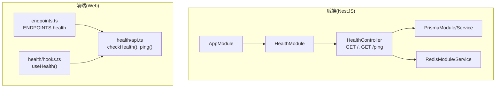
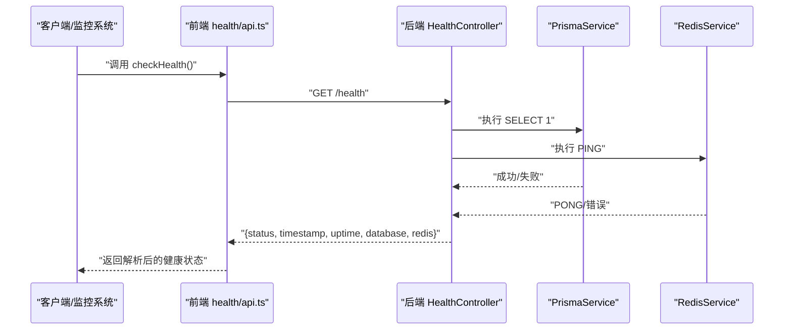
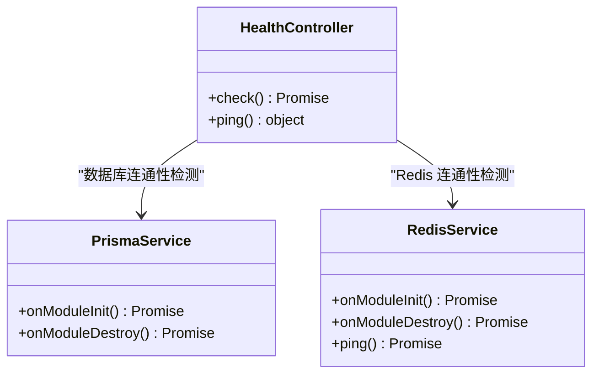
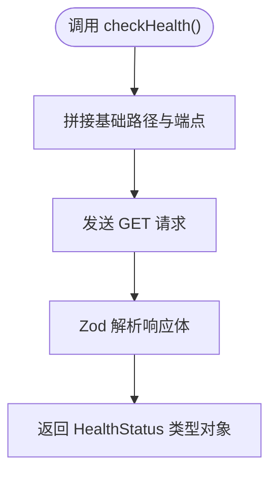
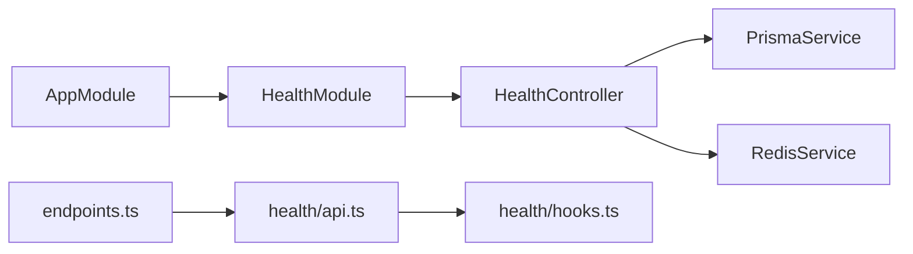

# 系统健康 API

<cite>
**本文引用的文件**
- [apps/nestjs-server/src/modules/health/health.controller.ts](file://apps/nestjs-server/src/modules/health/health.controller.ts)
- [apps/nestjs-server/src/modules/health/health.module.ts](file://apps/nestjs-server/src/modules/health/health.module.ts)
- [apps/nestjs-server/src/app.module.ts](file://apps/nestjs-server/src/app.module.ts)
- [apps/nestjs-server/src/prisma/prisma.service.ts](file://apps/nestjs-server/src/prisma/prisma.service.ts)
- [apps/nestjs-server/src/modules/redis/redis.service.ts](file://apps/nestjs-server/src/modules/redis/redis.service.ts)
- [apps/web/src/api/modules/health/api.ts](file://apps/web/src/api/modules/health/api.ts)
- [apps/web/src/api/modules/health/hooks.ts](file://apps/web/src/api/modules/health/hooks.ts)
- [apps/web/src/api/core/endpoints.ts](file://apps/web/src/api/core/endpoints.ts)
- [apps/nestjs-server/src/config/schemas/database.schema.ts](file://apps/nestjs-server/src/config/schemas/database.schema.ts)
- [apps/nestjs-server/src/config/schemas/root.schema.ts](file://apps/nestjs-server/src/config/schemas/root.schema.ts)
</cite>

## 目录
1. [简介](#简介)
2. [项目结构](#项目结构)
3. [核心组件](#核心组件)
4. [架构总览](#架构总览)
5. [详细组件分析](#详细组件分析)
6. [依赖关系分析](#依赖关系分析)
7. [性能考量](#性能考量)
8. [故障排查指南](#故障排查指南)
9. [结论](#结论)
10. [附录](#附录)

## 简介
本文件面向系统运维与开发团队，系统化说明“系统健康检查 API”的设计与使用，包括：
- 服务可用性检查与降级判定
- 数据库连接状态检测
- 缓存系统（Redis）状态检测
- 健康检查的响应格式、状态码与语义
- 故障诊断方法与常见问题定位
- 监控集成示例与告警配置建议

该健康检查能力在后端以独立模块提供，前端通过统一的 API 层进行调用，并可被外部监控系统直接拉取。

## 项目结构
健康检查相关代码分布于后端 NestJS 服务与前端 Web 应用两部分：
- 后端：健康控制器与模块负责对外暴露 / 与 /ping 两个端点；依赖 Prisma 与 Redis 服务进行连通性检测。
- 前端：定义了健康检查的请求封装与 React Query Hooks，便于在 UI 中展示与轮询。

图表来源
- [apps/nestjs-server/src/app.module.ts:19-34](file://apps/nestjs-server/src/app.module.ts#L19-L34)
- [apps/nestjs-server/src/modules/health/health.module.ts:5-8](file://apps/nestjs-server/src/modules/health/health.module.ts#L5-L8)
- [apps/nestjs-server/src/modules/health/health.controller.ts:10-16](file://apps/nestjs-server/src/modules/health/health.controller.ts#L10-L16)
- [apps/web/src/api/core/endpoints.ts:13-16](file://apps/web/src/api/core/endpoints.ts#L13-L16)
- [apps/web/src/api/modules/health/api.ts:19-25](file://apps/web/src/api/modules/health/api.ts#L19-L25)
- [apps/web/src/api/modules/health/hooks.ts:4-10](file://apps/web/src/api/modules/health/hooks.ts#L4-L10)

章节来源
- [apps/nestjs-server/src/app.module.ts:19-34](file://apps/nestjs-server/src/app.module.ts#L19-L34)
- [apps/nestjs-server/src/modules/health/health.module.ts:5-8](file://apps/nestjs-server/src/modules/health/health.module.ts#L5-L8)
- [apps/web/src/api/core/endpoints.ts:13-16](file://apps/web/src/api/core/endpoints.ts#L13-L16)

## 核心组件
- 健康控制器（HealthController）
  - 提供两类端点：
    - GET /：综合健康检查，返回服务状态、时间戳、运行时长以及数据库与 Redis 的连接状态。
    - GET /ping：轻量 Ping 检查，用于快速探测服务存活。
  - 访问控制：对上述端点标注为公开访问，跳过节流限制，便于监控系统高频探测。
  - 响应体字段：
    - status：枚举值，ok 或 degraded
    - timestamp：字符串，当前时间
    - uptime：数字，进程运行时长（秒）
    - database：枚举值，connected 或 disconnected
    - redis：枚举值，connected 或 disconnected
  - 状态码：200 OK 返回健康数据；异常情况下由全局过滤器处理，可能返回 5xx。

- 健康模块（HealthModule）
  - 引入 PrismaModule 并注册 HealthController，作为健康检查能力的入口模块。

- 前端健康 API 与 Hooks
  - 定义了 checkHealth() 与 ping() 的请求函数，配合 Zod Schema 对响应进行校验。
  - 提供 useHealth() Hook，支持定时轮询健康状态。

章节来源
- [apps/nestjs-server/src/modules/health/health.controller.ts:18-76](file://apps/nestjs-server/src/modules/health/health.controller.ts#L18-L76)
- [apps/nestjs-server/src/modules/health/health.controller.ts:78-97](file://apps/nestjs-server/src/modules/health/health.controller.ts#L78-L97)
- [apps/nestjs-server/src/modules/health/health.module.ts:5-8](file://apps/nestjs-server/src/modules/health/health.module.ts#L5-L8)
- [apps/web/src/api/modules/health/api.ts:5-17](file://apps/web/src/api/modules/health/api.ts#L5-L17)
- [apps/web/src/api/modules/health/api.ts:19-25](file://apps/web/src/api/modules/health/api.ts#L19-L25)
- [apps/web/src/api/modules/health/hooks.ts:4-10](file://apps/web/src/api/modules/health/hooks.ts#L4-L10)

## 架构总览
健康检查的执行流程如下：
- 前端通过 endpoints.ts 中定义的基础路径与端点名，调用 health/api.ts 的封装函数。
- 后端 HealthController 在同一进程中并发执行数据库与 Redis 的连通性检测。
- 响应中根据两者结果综合判定整体健康状态（全连通为 ok，任一断开为 degraded）。

图表来源
- [apps/web/src/api/core/endpoints.ts:13-16](file://apps/web/src/api/core/endpoints.ts#L13-L16)
- [apps/web/src/api/modules/health/api.ts:19-21](file://apps/web/src/api/modules/health/api.ts#L19-L21)
- [apps/nestjs-server/src/modules/health/health.controller.ts:58-76](file://apps/nestjs-server/src/modules/health/health.controller.ts#L58-L76)
- [apps/nestjs-server/src/prisma/prisma.service.ts:28-34](file://apps/nestjs-server/src/prisma/prisma.service.ts#L28-L34)
- [apps/nestjs-server/src/modules/redis/redis.service.ts:65-73](file://apps/nestjs-server/src/modules/redis/redis.service.ts#L65-L73)

## 详细组件分析

### 健康控制器（HealthController）
- 端点与行为
  - GET /
    - 并发检测数据库与 Redis 连通性
    - 综合判定 status：全部连通为 ok，否则为 degraded
    - 返回 timestamp 与 uptime 字段，便于外部系统计算服务持续运行情况
  - GET /ping
    - 快速返回固定消息，用于存活探测
- 访问控制
  - 使用公共装饰器与跳过节流装饰器，确保监控系统可无阻碍地探测
- 响应模型
  - 使用 Swagger 注解声明响应结构，包含字段说明与示例

图表来源
- [apps/nestjs-server/src/modules/health/health.controller.ts:10-16](file://apps/nestjs-server/src/modules/health/health.controller.ts#L10-L16)
- [apps/nestjs-server/src/prisma/prisma.service.ts:6-35](file://apps/nestjs-server/src/prisma/prisma.service.ts#L6-L35)
- [apps/nestjs-server/src/modules/redis/redis.service.ts:11-74](file://apps/nestjs-server/src/modules/redis/redis.service.ts#L11-L74)

章节来源
- [apps/nestjs-server/src/modules/health/health.controller.ts:18-97](file://apps/nestjs-server/src/modules/health/health.controller.ts#L18-L97)

### 健康模块（HealthModule）
- 作用：引入 PrismaModule 并注册 HealthController，使健康检查端点成为应用的一部分。
- 依赖：HealthController 依赖 PrismaService 与 RedisService，因此需要对应模块已加载。

章节来源
- [apps/nestjs-server/src/modules/health/health.module.ts:5-8](file://apps/nestjs-server/src/modules/health/health.module.ts#L5-L8)

### 前端健康 API 与 Hooks
- checkHealth()
  - 通过统一的 HTTP 工具与 ENDPOINTS.health.check 发起请求
  - 使用 Zod Schema 对响应进行编译期与运行期校验
- ping()
  - 请求 ENDPOINTS.health.ping，返回固定消息
- useHealth()
  - 基于 React Query 的 useQuery，键名为 'health'
  - 默认每 30 秒轮询一次，便于在 UI 中展示实时健康状态

图表来源
- [apps/web/src/api/core/endpoints.ts:13-16](file://apps/web/src/api/core/endpoints.ts#L13-L16)
- [apps/web/src/api/modules/health/api.ts:19-21](file://apps/web/src/api/modules/health/api.ts#L19-L21)
- [apps/web/src/api/modules/health/api.ts:5-10](file://apps/web/src/api/modules/health/api.ts#L5-L10)

章节来源
- [apps/web/src/api/modules/health/api.ts:5-25](file://apps/web/src/api/modules/health/api.ts#L5-L25)
- [apps/web/src/api/modules/health/hooks.ts:4-10](file://apps/web/src/api/modules/health/hooks.ts#L4-L10)
- [apps/web/src/api/core/endpoints.ts:13-16](file://apps/web/src/api/core/endpoints.ts#L13-L16)

## 依赖关系分析
- 后端模块装配
  - AppModule 引入 HealthModule，使健康检查端点生效
  - HealthModule 引入 PrismaModule，保证数据库检测可用
  - RedisService 由 RedisModule/Service 提供，HealthController 通过注入使用
- 前端依赖
  - endpoints.ts 定义了健康端点的相对路径
  - health/api.ts 依赖 endpoints.ts 与通用 HTTP 工具
  - hooks.ts 依赖 health/api.ts 与 React Query

图表来源
- [apps/nestjs-server/src/app.module.ts:19-34](file://apps/nestjs-server/src/app.module.ts#L19-L34)
- [apps/nestjs-server/src/modules/health/health.module.ts:5-8](file://apps/nestjs-server/src/modules/health/health.module.ts#L5-L8)
- [apps/web/src/api/core/endpoints.ts:13-16](file://apps/web/src/api/core/endpoints.ts#L13-L16)
- [apps/web/src/api/modules/health/api.ts:19-25](file://apps/web/src/api/modules/health/api.ts#L19-L25)
- [apps/web/src/api/modules/health/hooks.ts:4-10](file://apps/web/src/api/modules/health/hooks.ts#L4-L10)

章节来源
- [apps/nestjs-server/src/app.module.ts:19-34](file://apps/nestjs-server/src/app.module.ts#L19-L34)
- [apps/nestjs-server/src/modules/health/health.module.ts:5-8](file://apps/nestjs-server/src/modules/health/health.module.ts#L5-L8)
- [apps/web/src/api/core/endpoints.ts:13-16](file://apps/web/src/api/core/endpoints.ts#L13-L16)

## 性能考量
- 并发检测：健康检查内部对数据库与 Redis 检测采用并发执行，减少单点故障导致的延迟放大。
- 轻量端点：/ping 仅返回固定消息，适合高频存活探测。
- 轮询策略：前端默认 30 秒轮询一次，可根据环境调整以平衡观测精度与负载。
- 节流豁免：健康端点被标记为公开且跳过节流，避免自身限流影响监控准确性。

## 故障排查指南
- 常见症状与定位
  - status 为 degraded，database/disconnected：检查数据库连接串、网络连通性、数据库实例状态。
  - status 为 degraded，redis/disconnected：检查 Redis 地址、认证信息、网络连通性与实例状态。
  - /ping 失败：确认后端服务进程运行正常，端口监听与反向代理配置正确。
- 关键日志与信号
  - RedisService 在连接阶段会输出连接尝试与失败信息，可用于快速定位连接问题。
  - PrismaService 在初始化与销毁时有日志输出，有助于判断数据库连接生命周期。
- 响应字段解读
  - status：ok 表示所有检测项均通过；degraded 表示至少一项检测失败。
  - uptime：结合 timestamp 可推算服务重启时间或异常窗口。
- 建议排查步骤
  1) 先调用 /ping 确认服务存活
  2) 再调用 / 获取完整健康状态
  3) 根据 database/redis 字段分别检查对应服务
  4) 查看后端日志中的连接错误信息

章节来源
- [apps/nestjs-server/src/modules/redis/redis.service.ts:47-63](file://apps/nestjs-server/src/modules/redis/redis.service.ts#L47-L63)
- [apps/nestjs-server/src/prisma/prisma.service.ts:28-34](file://apps/nestjs-server/src/prisma/prisma.service.ts#L28-L34)
- [apps/nestjs-server/src/modules/health/health.controller.ts:58-76](file://apps/nestjs-server/src/modules/health/health.controller.ts#L58-L76)

## 结论
本健康检查 API 以简洁明确的端点与响应模型，覆盖服务存活、数据库与缓存的关键连通性指标，既满足运维监控的即时需求，也便于前端集成与自动化告警。通过并发检测与公开豁免策略，降低了监控对业务的影响并提升了可观测性。

## 附录

### 接口定义与使用示例

- 健康检查端点
  - 方法与路径
    - GET /health（后端）
    - GET /api/v1/health（前端基于基础路径）
  - 响应字段
    - status：枚举，ok 或 degraded
    - timestamp：字符串，当前时间
    - uptime：数字，进程运行时长（秒）
    - database：枚举，connected 或 disconnected
    - redis：枚举，connected 或 disconnected
  - 状态码
    - 200：返回健康状态
    - 5xx：内部错误（由全局过滤器处理）

- Ping 端点
  - 方法与路径
    - GET /health/ping（后端）
    - GET /api/v1/health/ping（前端）
  - 响应字段
    - message：字符串，pong
  - 状态码
    - 200：返回 ping 响应

- 前端调用示例
  - 使用 checkHealth() 获取健康状态
  - 使用 ping() 进行存活探测
  - 使用 useHealth() 在组件中订阅健康状态变化

章节来源
- [apps/nestjs-server/src/modules/health/health.controller.ts:18-97](file://apps/nestjs-server/src/modules/health/health.controller.ts#L18-L97)
- [apps/web/src/api/modules/health/api.ts:5-25](file://apps/web/src/api/modules/health/api.ts#L5-L25)
- [apps/web/src/api/modules/health/hooks.ts:4-10](file://apps/web/src/api/modules/health/hooks.ts#L4-L10)
- [apps/web/src/api/core/endpoints.ts:13-16](file://apps/web/src/api/core/endpoints.ts#L13-L16)

### 监控集成与告警配置建议
- Prometheus/Blackbox Exporter
  - 使用 HTTP 抓取目标：/api/v1/health
  - 指标建议
    - health_status{status="ok"}=1 或 0
    - health_uptime_seconds
    - health_database_connected{value=1|0}
    - health_redis_connected{value=1|0}
  - 告警规则示例
    - 当 health_status != 1 持续 1 分钟触发严重告警
    - 当 health_uptime_seconds 低于阈值触发重启告警
- Grafana
  - 仪表盘展示：status、uptime、database、redis 指标趋势
  - 即时告警：结合阈值与持续时间
- 前端集成
  - 在管理后台页面使用 useHealth() 自动轮询并展示状态
  - 将健康状态接入全局通知系统，异常时自动弹窗提醒

[本节为概念性指导，不直接分析具体源码文件]