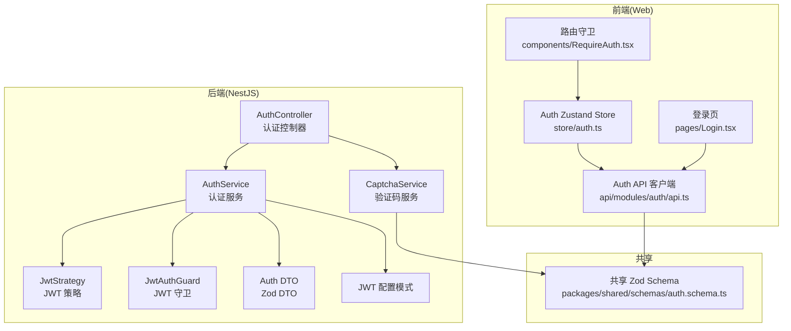
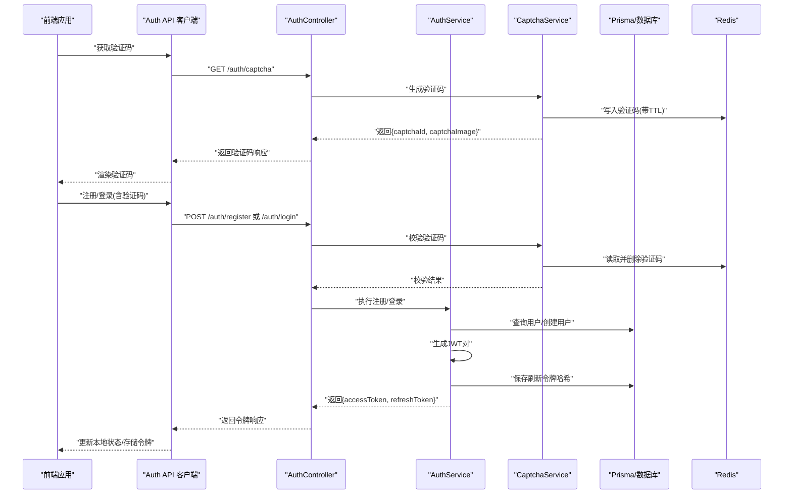
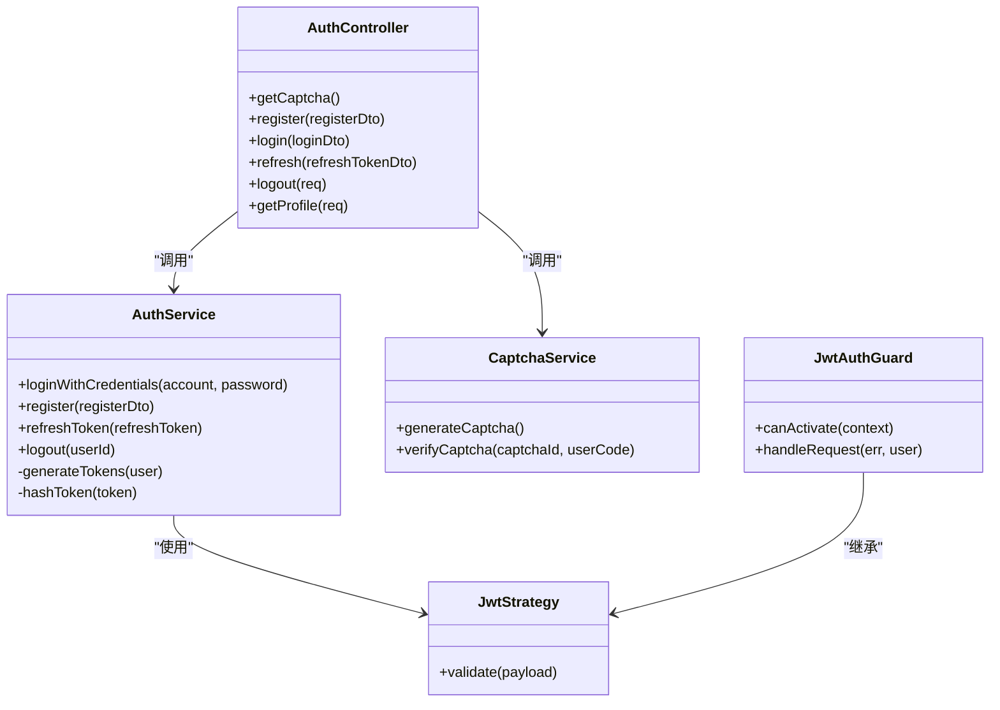

# 认证 API

<cite>
**本文引用的文件**
- [apps/nestjs-server/src/modules/auth/auth.controller.ts](file://apps/nestjs-server/src/modules/auth/auth.controller.ts)
- [apps/nestjs-server/src/modules/auth/auth.service.ts](file://apps/nestjs-server/src/modules/auth/auth.service.ts)
- [apps/nestjs-server/src/modules/auth/captcha.service.ts](file://apps/nestjs-server/src/modules/auth/captcha.service.ts)
- [apps/nestjs-server/src/modules/auth/dto/auth.dto.ts](file://apps/nestjs-server/src/modules/auth/dto/auth.dto.ts)
- [apps/nestjs-server/src/modules/auth/strategies/jwt.strategy.ts](file://apps/nestjs-server/src/modules/auth/strategies/jwt.strategy.ts)
- [apps/nestjs-server/src/common/guards/jwt-auth.guard.ts](file://apps/nestjs-server/src/common/guards/jwt-auth.guard.ts)
- [apps/nestjs-server/src/common/decorators/public.decorator.ts](file://apps/nestjs-server/src/common/decorators/public.decorator.ts)
- [apps/nestjs-server/src/config/schemas/jwt.schema.ts](file://apps/nestjs-server/src/config/schemas/jwt.schema.ts)
- [apps/web/src/api/modules/auth/api.ts](file://apps/web/src/api/modules/auth/api.ts)
- [apps/web/src/store/auth.ts](file://apps/web/src/store/auth.ts)
- [apps/web/src/pages/Login.tsx](file://apps/web/src/pages/Login.tsx)
- [apps/web/src/components/RequireAuth.tsx](file://apps/web/src/components/RequireAuth.tsx)
- [packages/shared/src/schemas/auth.schema.ts](file://packages/shared/src/schemas/auth.schema.ts)
</cite>

## 目录

1. [简介](#简介)
2. [项目结构](#项目结构)
3. [核心组件](#核心组件)
4. [架构总览](#架构总览)
5. [详细组件分析](#详细组件分析)
6. [依赖关系分析](#依赖关系分析)
7. [性能考量](#性能考量)
8. [故障排查指南](#故障排查指南)
9. [结论](#结论)
10. [附录](#附录)

## 简介

本文件面向前端与后端开发者，系统性梳理认证模块的 API 设计与实现，覆盖以下能力：

- 用户登录、注册、令牌刷新、登出、获取当前用户信息
- JWT 访问令牌与刷新令牌的生成与校验
- 密码加密与存储策略
- 验证码系统（SVG 图片、Redis 存储、一次性使用）
- 前端 Hook 与状态管理集成方案
- 请求/响应示例、错误处理与安全建议

## 项目结构

认证相关代码主要分布在后端 NestJS 服务与前端 Web 应用两部分，并通过共享的 Zod Schema 保证前后端字段一致性。

图表来源

- [apps/nestjs-server/src/modules/auth/auth.controller.ts:30-115](file://apps/nestjs-server/src/modules/auth/auth.controller.ts#L30-L115)
- [apps/nestjs-server/src/modules/auth/auth.service.ts:14-151](file://apps/nestjs-server/src/modules/auth/auth.service.ts#L14-L151)
- [apps/nestjs-server/src/modules/auth/captcha.service.ts:18-67](file://apps/nestjs-server/src/modules/auth/captcha.service.ts#L18-L67)
- [apps/nestjs-server/src/modules/auth/strategies/jwt.strategy.ts:9-49](file://apps/nestjs-server/src/modules/auth/strategies/jwt.strategy.ts#L9-L49)
- [apps/nestjs-server/src/common/guards/jwt-auth.guard.ts:17-43](file://apps/nestjs-server/src/common/guards/jwt-auth.guard.ts#L17-L43)
- [apps/web/src/api/modules/auth/api.ts:1-45](file://apps/web/src/api/modules/auth/api.ts#L1-L45)
- [apps/web/src/store/auth.ts:1-64](file://apps/web/src/store/auth.ts#L1-L64)
- [apps/web/src/pages/Login.tsx:60-221](file://apps/web/src/pages/Login.tsx#L60-L221)
- [apps/web/src/components/RequireAuth.tsx:4-14](file://apps/web/src/components/RequireAuth.tsx#L4-L14)
- [packages/shared/src/schemas/auth.schema.ts:1-35](file://packages/shared/src/schemas/auth.schema.ts#L1-L35)

章节来源

- [apps/nestjs-server/src/modules/auth/auth.controller.ts:1-115](file://apps/nestjs-server/src/modules/auth/auth.controller.ts#L1-L115)
- [apps/web/src/api/modules/auth/api.ts:1-45](file://apps/web/src/api/modules/auth/api.ts#L1-L45)

## 核心组件

- 认证控制器：暴露验证码、注册、登录、刷新、登出、获取当前用户信息等端点。
- 认证服务：负责凭据校验、令牌签发与刷新、登出撤销、密码校验。
- 验证码服务：生成 SVG 验证码、存入 Redis 并一次性校验。
- JWT 策略与守卫：从请求头解析 Bearer 令牌，校验并注入用户上下文。
- 前端 API 客户端与状态管理：封装认证 API、持久化令牌与用户信息、路由守卫。

章节来源

- [apps/nestjs-server/src/modules/auth/auth.controller.ts:30-115](file://apps/nestjs-server/src/modules/auth/auth.controller.ts#L30-L115)
- [apps/nestjs-server/src/modules/auth/auth.service.ts:14-151](file://apps/nestjs-server/src/modules/auth/auth.service.ts#L14-L151)
- [apps/nestjs-server/src/modules/auth/captcha.service.ts:18-67](file://apps/nestjs-server/src/modules/auth/captcha.service.ts#L18-L67)
- [apps/nestjs-server/src/modules/auth/strategies/jwt.strategy.ts:9-49](file://apps/nestjs-server/src/modules/auth/strategies/jwt.strategy.ts#L9-L49)
- [apps/nestjs-server/src/common/guards/jwt-auth.guard.ts:17-43](file://apps/nestjs-server/src/common/guards/jwt-auth.guard.ts#L17-L43)
- [apps/web/src/api/modules/auth/api.ts:1-45](file://apps/web/src/api/modules/auth/api.ts#L1-L45)
- [apps/web/src/store/auth.ts:1-64](file://apps/web/src/store/auth.ts#L1-L64)

## 架构总览

下图展示认证端到端流程：前端调用后端 API，后端通过服务层完成业务逻辑，使用 JWT 与 Redis/数据库进行令牌与验证码管理，最终返回标准化响应。

图表来源

- [apps/nestjs-server/src/modules/auth/auth.controller.ts:38-113](file://apps/nestjs-server/src/modules/auth/auth.controller.ts#L38-L113)
- [apps/nestjs-server/src/modules/auth/auth.service.ts:29-149](file://apps/nestjs-server/src/modules/auth/auth.service.ts#L29-L149)
- [apps/nestjs-server/src/modules/auth/captcha.service.ts:24-65](file://apps/nestjs-server/src/modules/auth/captcha.service.ts#L24-L65)
- [apps/web/src/api/modules/auth/api.ts:20-42](file://apps/web/src/api/modules/auth/api.ts#L20-L42)

## 详细组件分析

### 接口定义与行为

- 获取验证码
  - 方法与路径：GET /auth/captcha
  - 请求参数：无
  - 响应字段：captchaId、captchaImage（SVG 字符串）
  - 速率限制：短时间窗口内最多 10 次请求
  - 典型用途：登录/注册前先获取验证码，提交时携带 captchaId 与 captchaCode
  - 章节来源
    - [apps/nestjs-server/src/modules/auth/auth.controller.ts:38-48](file://apps/nestjs-server/src/modules/auth/auth.controller.ts#L38-L48)
    - [apps/nestjs-server/src/modules/auth/captcha.service.ts:24-46](file://apps/nestjs-server/src/modules/auth/captcha.service.ts#L24-L46)

- 用户注册
  - 方法与路径：POST /auth/register
  - 请求体字段：email、username、password、name（可选）
  - 响应字段：accessToken、refreshToken
  - 行为要点：校验邮箱与用户名唯一性；成功后签发 JWT 对并持久化刷新令牌
  - 章节来源
    - [apps/nestjs-server/src/modules/auth/auth.controller.ts:50-61](file://apps/nestjs-server/src/modules/auth/auth.controller.ts#L50-L61)
    - [apps/nestjs-server/src/modules/auth/auth.service.ts:44-57](file://apps/nestjs-server/src/modules/auth/auth.service.ts#L44-L57)
    - [packages/shared/src/schemas/auth.schema.ts:19-24](file://packages/shared/src/schemas/auth.schema.ts#L19-L24)

- 用户登录
  - 方法与路径：POST /auth/login
  - 请求体字段：account、password、captchaId、captchaCode
  - 响应字段：accessToken、refreshToken
  - 行为要点：先校验验证码（一次性），再校验账号与密码，成功后签发 JWT 对
  - 章节来源
    - [apps/nestjs-server/src/modules/auth/auth.controller.ts:63-76](file://apps/nestjs-server/src/modules/auth/auth.controller.ts#L63-L76)
    - [apps/nestjs-server/src/modules/auth/auth.service.ts:29-37](file://apps/nestjs-server/src/modules/auth/auth.service.ts#L29-L37)
    - [apps/nestjs-server/src/modules/auth/captcha.service.ts:48-65](file://apps/nestjs-server/src/modules/auth/captcha.service.ts#L48-L65)

- 刷新访问令牌
  - 方法与路径：POST /auth/refresh
  - 请求体字段：refreshToken
  - 响应字段：accessToken、refreshToken
  - 行为要点：使用刷新令牌换取新的访问令牌；旧刷新令牌立即作废
  - 章节来源
    - [apps/nestjs-server/src/modules/auth/auth.controller.ts:78-89](file://apps/nestjs-server/src/modules/auth/auth.controller.ts#L78-L89)
    - [apps/nestjs-server/src/modules/auth/auth.service.ts:64-84](file://apps/nestjs-server/src/modules/auth/auth.service.ts#L64-L84)

- 退出登录
  - 方法与路径：POST /auth/logout
  - 请求头：Authorization: Bearer <accessToken>
  - 响应：无内容（200 OK）
  - 行为要点：撤销当前用户的所有刷新令牌，需重新登录或使用刷新令牌获取新访问令牌
  - 章节来源
    - [apps/nestjs-server/src/modules/auth/auth.controller.ts:91-102](file://apps/nestjs-server/src/modules/auth/auth.controller.ts#L91-L102)
    - [apps/nestjs-server/src/modules/auth/auth.service.ts:90-98](file://apps/nestjs-server/src/modules/auth/auth.service.ts#L90-L98)

- 获取当前用户信息
  - 方法与路径：GET /auth/profile
  - 请求头：Authorization: Bearer <accessToken>
  - 响应字段：用户详情（不含密码）
  - 章节来源
    - [apps/nestjs-server/src/modules/auth/auth.controller.ts:104-113](file://apps/nestjs-server/src/modules/auth/auth.controller.ts#L104-L113)
    - [apps/web/src/api/modules/auth/api.ts:40-42](file://apps/web/src/api/modules/auth/api.ts#L40-L42)

### JWT 令牌生成与验证流程

- 生成流程
  - 服务层根据用户 ID 生成负载，分别使用不同密钥与过期时间签发访问令牌与刷新令牌
  - 刷新令牌以哈希形式持久化，便于快速校验与撤销
- 验证流程
  - 守卫从 Authorization 头提取 Bearer 令牌，使用对应密钥验证签名与有效期
  - 策略从数据库加载用户的角色信息并注入到请求上下文
- 配置要点
  - 访问令牌与刷新令牌密钥长度均要求至少 32 位
  - 默认访问令牌过期时间为 15 分钟，刷新令牌默认为 7 天
- 章节来源
  - [apps/nestjs-server/src/modules/auth/auth.service.ts:105-149](file://apps/nestjs-server/src/modules/auth/auth.service.ts#L105-L149)
  - [apps/nestjs-server/src/modules/auth/strategies/jwt.strategy.ts:22-47](file://apps/nestjs-server/src/modules/auth/strategies/jwt.strategy.ts#L22-L47)
  - [apps/nestjs-server/src/common/guards/jwt-auth.guard.ts:36-41](file://apps/nestjs-server/src/common/guards/jwt-auth.guard.ts#L36-L41)
  - [apps/nestjs-server/src/config/schemas/jwt.schema.ts:3-8](file://apps/nestjs-server/src/config/schemas/jwt.schema.ts#L3-L8)

### 密码加密机制

- 用户注册时对明文密码进行加密后存储
- 登录时使用相同算法校验输入密码与存储值
- 章节来源
  - [apps/nestjs-server/src/modules/auth/auth.service.ts:30-36](file://apps/nestjs-server/src/modules/auth/auth.service.ts#L30-L36)

### 验证码系统集成

- 生成：服务端生成随机 UUID 的验证码 ID 与 SVG 文本，异步写入 Redis 并设置 5 分钟过期
- 校验：客户端提交 captchaId 与 captchaCode；服务端读取并删除该键，若不存在或不匹配则抛出相应业务异常
- 章节来源
  - [apps/nestjs-server/src/modules/auth/captcha.service.ts:24-65](file://apps/nestjs-server/src/modules/auth/captcha.service.ts#L24-L65)

### 前端 Hook 与状态管理集成

- API 客户端
  - 提供 getCaptcha、register、login、refreshToken、logout、getProfile 等方法，内部使用共享 Zod Schema 进行参数与响应校验
- 状态管理（Zustand）
  - 维护 accessToken、refreshToken、user、isAuthenticated 四项状态
  - 支持持久化与 devtools/watermark
- 登录页面
  - 加载验证码并渲染 SVG；表单提交时携带 captchaId 与 captchaCode
- 路由守卫
  - 未认证用户跳转至登录页
- 章节来源
  - [apps/web/src/api/modules/auth/api.ts:20-42](file://apps/web/src/api/modules/auth/api.ts#L20-L42)
  - [apps/web/src/store/auth.ts:30-63](file://apps/web/src/store/auth.ts#L30-L63)
  - [apps/web/src/pages/Login.tsx:62-92](file://apps/web/src/pages/Login.tsx#L62-L92)
  - [apps/web/src/components/RequireAuth.tsx:4-14](file://apps/web/src/components/RequireAuth.tsx#L4-L14)

### 错误处理与状态码

- 全局错误装饰器统一包装响应结构
- 业务异常枚举涵盖认证相关错误（如凭据无效、验证码无效/不存在、刷新令牌无效、未授权等）
- 常见状态码
  - 200 OK：登录、刷新、登出、获取资料
  - 201 Created：注册
  - 400 Bad Request：参数校验失败
  - 401 Unauthorized：未授权或令牌无效
  - 429 Too Many Requests：触发限流
- 章节来源
  - [apps/nestjs-server/src/modules/auth/auth.controller.ts:18-22](file://apps/nestjs-server/src/modules/auth/auth.controller.ts#L18-L22)
  - [apps/nestjs-server/src/common/guards/jwt-auth.guard.ts:36-41](file://apps/nestjs-server/src/common/guards/jwt-auth.guard.ts#L36-L41)

## 依赖关系分析

- 控制器依赖服务与验证码服务，服务依赖用户服务、Prisma、JWT 服务与配置服务
- 守卫与策略依赖配置服务与 Prisma，用于密钥与用户信息加载
- 前端 API 客户端依赖共享 Schema 与核心 HTTP 工具
- 状态管理与页面组件依赖 API 客户端与路由守卫

图表来源

- [apps/nestjs-server/src/modules/auth/auth.controller.ts:32-113](file://apps/nestjs-server/src/modules/auth/auth.controller.ts#L32-L113)
- [apps/nestjs-server/src/modules/auth/auth.service.ts:16-149](file://apps/nestjs-server/src/modules/auth/auth.service.ts#L16-L149)
- [apps/nestjs-server/src/modules/auth/captcha.service.ts:19-65](file://apps/nestjs-server/src/modules/auth/captcha.service.ts#L19-L65)
- [apps/nestjs-server/src/modules/auth/strategies/jwt.strategy.ts:10-47](file://apps/nestjs-server/src/modules/auth/strategies/jwt.strategy.ts#L10-L47)
- [apps/nestjs-server/src/common/guards/jwt-auth.guard.ts:17-42](file://apps/nestjs-server/src/common/guards/jwt-auth.guard.ts#L17-L42)

## 性能考量

- 验证码一次性使用并立即删除，避免重复利用与缓存膨胀
- 刷新令牌采用哈希存储，查询与撤销操作复杂度低
- 登录/注册并发场景建议结合限流策略（控制器已内置节流装饰器）
- 建议在高并发场景下为验证码与刷新令牌建立独立的缓存分区与监控指标

## 故障排查指南

- 登录失败
  - 检查 captchaId 是否存在且未过期
  - 确认 captchaCode 是否与验证码一致（不区分大小写）
  - 核对账号与密码是否正确
- 刷新令牌无效
  - 确认 refreshToken 是否被撤销或过期
  - 确保使用最新 refreshToken 调用刷新接口
- 未授权访问受保护资源
  - 确认请求头 Authorization 是否携带有效的 Bearer 令牌
  - 检查令牌是否过期或密钥配置是否正确
- 前端状态异常
  - 检查 Zustand 存储中的 accessToken/refreshToken 是否正确更新
  - 确认路由守卫是否正确识别 isAuthenticated

章节来源

- [apps/nestjs-server/src/modules/auth/captcha.service.ts:48-65](file://apps/nestjs-server/src/modules/auth/captcha.service.ts#L48-L65)
- [apps/nestjs-server/src/modules/auth/auth.service.ts:64-84](file://apps/nestjs-server/src/modules/auth/auth.service.ts#L64-L84)
- [apps/nestjs-server/src/common/guards/jwt-auth.guard.ts:36-41](file://apps/nestjs-server/src/common/guards/jwt-auth.guard.ts#L36-L41)
- [apps/web/src/store/auth.ts:30-63](file://apps/web/src/store/auth.ts#L30-L63)

## 结论

本认证模块通过清晰的分层设计与严格的参数校验，提供了完整的登录、注册、令牌刷新与登出能力。配合验证码与 JWT 策略，既提升了安全性也兼顾了易用性。前端通过 API 客户端与状态管理实现了良好的用户体验与可维护性。

## 附录

### 请求/响应示例（基于共享 Schema）

- 获取验证码
  - 请求：GET /auth/captcha
  - 响应：{
    "captchaId": "字符串",
    "captchaImage": "SVG 字符串"
    }
  - 章节来源
    - [apps/nestjs-server/src/modules/auth/auth.controller.ts:38-48](file://apps/nestjs-server/src/modules/auth/auth.controller.ts#L38-L48)
    - [packages/shared/src/schemas/auth.schema.ts:4-9](file://packages/shared/src/schemas/auth.schema.ts#L4-L9)

- 用户注册
  - 请求：POST /auth/register
  - 请求体：{
    "email": "邮箱",
    "username": "用户名",
    "password": "密码",
    "name": "可选显示名"
    }
  - 响应：{
    "accessToken": "JWT",
    "refreshToken": "JWT"
    }
  - 章节来源
    - [apps/nestjs-server/src/modules/auth/auth.controller.ts:50-61](file://apps/nestjs-server/src/modules/auth/auth.controller.ts#L50-L61)
    - [packages/shared/src/schemas/auth.schema.ts:19-24](file://packages/shared/src/schemas/auth.schema.ts#L19-L24)

- 用户登录
  - 请求：POST /auth/login
  - 请求体：{
    "account": "邮箱或用户名",
    "password": "密码",
    "captchaId": "验证码ID",
    "captchaCode": "验证码内容"
    }
  - 响应：{
    "accessToken": "JWT",
    "refreshToken": "JWT"
    }
  - 章节来源
    - [apps/nestjs-server/src/modules/auth/auth.controller.ts:63-76](file://apps/nestjs-server/src/modules/auth/auth.controller.ts#L63-L76)
    - [packages/shared/src/schemas/auth.schema.ts:26-31](file://packages/shared/src/schemas/auth.schema.ts#L26-L31)

- 刷新访问令牌
  - 请求：POST /auth/refresh
  - 请求体：{
    "refreshToken": "刷新令牌"
    }
  - 响应：{
    "accessToken": "JWT",
    "refreshToken": "JWT"
    }
  - 章节来源
    - [apps/nestjs-server/src/modules/auth/auth.controller.ts:78-89](file://apps/nestjs-server/src/modules/auth/auth.controller.ts#L78-L89)
    - [packages/shared/src/schemas/auth.schema.ts:33-35](file://packages/shared/src/schemas/auth.schema.ts#L33-L35)

- 退出登录
  - 请求：POST /auth/logout
  - 请求头：Authorization: Bearer <accessToken>
  - 响应：无内容
  - 章节来源
    - [apps/nestjs-server/src/modules/auth/auth.controller.ts:91-102](file://apps/nestjs-server/src/modules/auth/auth.controller.ts#L91-L102)

- 获取当前用户信息
  - 请求：GET /auth/profile
  - 请求头：Authorization: Bearer <accessToken>
  - 响应：用户详情对象（不含密码）
  - 章节来源
    - [apps/nestjs-server/src/modules/auth/auth.controller.ts:104-113](file://apps/nestjs-server/src/modules/auth/auth.controller.ts#L104-L113)
    - [apps/web/src/api/modules/auth/api.ts:40-42](file://apps/web/src/api/modules/auth/api.ts#L40-L42)

### 安全考虑

- 密钥管理
  - 访问令牌与刷新令牌密钥长度至少 32 位，定期轮换
- 令牌生命周期
  - 访问令牌短期有效，刷新令牌长期有效但可撤销
- 验证码安全
  - 一次性使用并删除，防止重放攻击
- 传输安全
  - 建议仅在 HTTPS 下传输，避免令牌泄露
- 速率限制
  - 控制器已内置节流装饰器，建议结合网关/反向代理进一步限制
