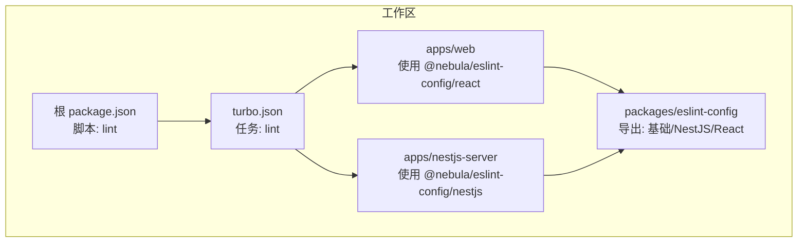
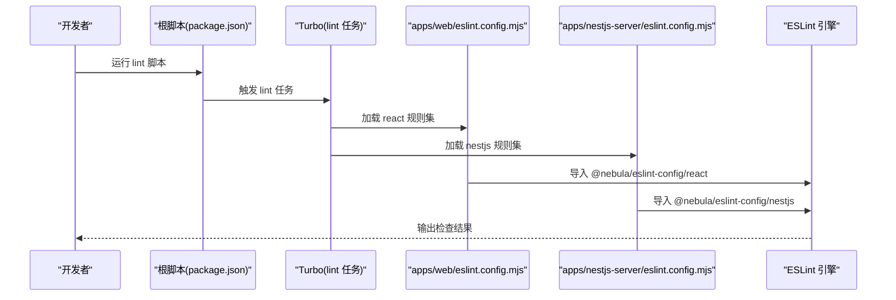
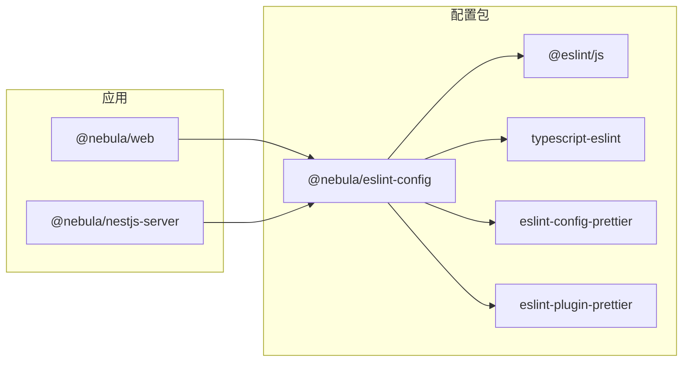

# ESLint 配置包

<cite>
**本文引用的文件**
- [packages/eslint-config/package.json](file://packages/eslint-config/package.json)
- [apps/nestjs-server/eslint.config.mjs](file://apps/nestjs-server/eslint.config.mjs)
- [apps/web/eslint.config.mjs](file://apps/web/eslint.config.mjs)
- [apps/nestjs-server/package.json](file://apps/nestjs-server/package.json)
- [apps/web/package.json](file://apps/web/package.json)
- [package.json](file://package.json)
- [turbo.json](file://turbo.json)
</cite>

## 目录

1. [简介](#简介)
2. [项目结构](#项目结构)
3. [核心组件](#核心组件)
4. [架构总览](#架构总览)
5. [详细组件分析](#详细组件分析)
6. [依赖关系分析](#依赖关系分析)
7. [性能考虑](#性能考虑)
8. [故障排查指南](#故障排查指南)
9. [结论](#结论)
10. [附录](#附录)

## 简介

本文件面向团队与新项目，系统化介绍共享 ESLint 配置包的设计与使用方法。该配置包通过模块化导出不同场景的规则集（基础、NestJS 后端、React 前端），结合 Prettier 统一格式化，实现跨应用的一致性与可维护性。文档涵盖规则优先级、覆盖范围、自定义扩展机制、冲突解决策略、升级指南以及新项目集成步骤。

## 项目结构

该仓库采用 pnpm workspace + Turbo 的多包管理方式，ESLint 配置以独立包形式提供，并在各应用中按需引入。关键位置如下：

- 配置包：packages/eslint-config（导出基础、NestJS、React 三类规则）
- 应用侧：apps/web 与 apps/nestjs-server 分别消费对应规则集
- 工作流：根目录 package.json 提供 lint 脚本，turbo.json 定义 lint 任务依赖

图表来源

- [packages/eslint-config/package.json:6-10](file://packages/eslint-config/package.json#L6-L10)
- [apps/web/eslint.config.mjs:1-9](file://apps/web/eslint.config.mjs#L1-L9)
- [apps/nestjs-server/eslint.config.mjs:1-20](file://apps/nestjs-server/eslint.config.mjs#L1-L20)
- [package.json:5-14](file://package.json#L5-L14)
- [turbo.json:12-17](file://turbo.json#L12-L17)

章节来源

- [packages/eslint-config/package.json:1-22](file://packages/eslint-config/package.json#L1-L22)
- [apps/web/eslint.config.mjs:1-9](file://apps/web/eslint.config.mjs#L1-L9)
- [apps/nestjs-server/eslint.config.mjs:1-20](file://apps/nestjs-server/eslint.config.mjs#L1-L20)
- [package.json:1-22](file://package.json#L1-L22)
- [turbo.json:1-26](file://turbo.json#L1-L26)

## 核心组件

- 配置包导出结构
  - 默认导出：基础规则集
  - 命名导出：nestjs、react
- 依赖生态
  - @eslint/js：官方 JS 规则集合
  - typescript-eslint：TS 规则增强
  - eslint-config-prettier：关闭与 Prettier 冲突的 ESLint 规则
  - eslint-plugin-prettier：以 Prettier 作为报告器
  - globals：浏览器/Node 等全局变量集合

章节来源

- [packages/eslint-config/package.json:6-17](file://packages/eslint-config/package.json#L6-L17)

## 架构总览

下图展示从命令到具体规则生效的全链路：开发者执行 lint 脚本 → Turbo 调度 → 应用加载对应配置 → ESLint 执行规则 → 输出结果。

图表来源

- [package.json:5-14](file://package.json#L5-L14)
- [turbo.json:12-17](file://turbo.json#L12-L17)
- [apps/web/eslint.config.mjs:1-9](file://apps/web/eslint.config.mjs#L1-L9)
- [apps/nestjs-server/eslint.config.mjs:1-20](file://apps/nestjs-server/eslint.config.mjs#L1-L20)

## 详细组件分析

### 基础规则集（默认导出）

- 作用：为通用 JS/TS 项目提供统一的基础规则
- 适用：未显式声明场景时的兜底规则
- 与 Prettier 协同：通过 eslint-config-prettier 关闭冲突规则，确保格式一致性

章节来源

- [packages/eslint-config/package.json:6-17](file://packages/eslint-config/package.json#L6-L17)

### NestJS 规则集（nestjs 场景）

- 使用方式：在应用的 eslint.config.mjs 中导入 @nebula/eslint-config/nestjs
- 自定义扩展点：
  - 语言选项：设置 tsconfigRootDir 指向应用根目录，保证 TS 解析正确
  - 忽略项：排除构建产物、测试配置等不需要检查的路径
- 典型配置片段路径
  - [apps/nestjs-server/eslint.config.mjs:8-20](file://apps/nestjs-server/eslint.config.mjs#L8-L20)

章节来源

- [apps/nestjs-server/eslint.config.mjs:1-20](file://apps/nestjs-server/eslint.config.mjs#L1-L20)

### React 规则集（react 场景）

- 使用方式：在前端应用的 eslint.config.mjs 中导入 @nebula/eslint-config/react
- 自定义扩展点：
  - 忽略项：排除自身配置文件等
- 典型配置片段路径
  - [apps/web/eslint.config.mjs:4-9](file://apps/web/eslint.config.mjs#L4-L9)

章节来源

- [apps/web/eslint.config.mjs:1-9](file://apps/web/eslint.config.mjs#L1-L9)

### 规则优先级与覆盖范围

- 导入顺序即优先级：后导入的规则会覆盖先前规则
- 应用层追加配置：可在导入共享规则后继续追加语言选项、忽略列表等
- 跨应用一致性：通过 workspace:\* 版本锁定，避免版本漂移导致的规则差异

章节来源

- [apps/nestjs-server/eslint.config.mjs:8-20](file://apps/nestjs-server/eslint.config.mjs#L8-L20)
- [apps/web/eslint.config.mjs:4-9](file://apps/web/eslint.config.mjs#L4-L9)
- [apps/nestjs-server/package.json:60-61](file://apps/nestjs-server/package.json#L60-L61)
- [apps/web/package.json:30-31](file://apps/web/package.json#L30-L31)

### 自定义扩展机制

- 在各自应用的 eslint.config.mjs 中追加对象，支持：
  - languageOptions.parserOptions.tsconfigRootDir：确保 TS 解析指向正确根目录
  - ignores：排除不需要检查的文件/目录
- 示例片段路径
  - [apps/nestjs-server/eslint.config.mjs:10-19](file://apps/nestjs-server/eslint.config.mjs#L10-L19)
  - [apps/web/eslint.config.mjs:6-9](file://apps/web/eslint.config.mjs#L6-L9)

章节来源

- [apps/nestjs-server/eslint.config.mjs:10-19](file://apps/nestjs-server/eslint.config.mjs#L10-L19)
- [apps/web/eslint.config.mjs:6-9](file://apps/web/eslint.config.mjs#L6-L9)

### 规则冲突解决

- 与 Prettier 冲突的 ESLint 规则由 eslint-config-prettier 自动关闭，避免双重格式化
- 如出现“某条规则被禁用但未生效”的现象，检查是否被后续规则覆盖，或确认导入顺序
- 若需要临时放宽规则，建议在文件/目录级别添加注释指令，而非全局放宽

章节来源

- [packages/eslint-config/package.json:12-14](file://packages/eslint-config/package.json#L12-L14)

### 团队统一规范实施

- 版本锁定：通过 workspace:\* 将 @nebula/eslint-config 锁定到本地开发树，避免不同机器产生差异
- 脚本统一：根脚本统一调用 lint；Turbo 任务串联，保证构建前检查
- 新增规则：在配置包内集中更新，所有应用自动受益
- 典型集成路径
  - [apps/web/package.json:30-31](file://apps/web/package.json#L30-L31)
  - [apps/nestjs-server/package.json:60-61](file://apps/nestjs-server/package.json#L60-L61)
  - [package.json:5-14](file://package.json#L5-L14)
  - [turbo.json:12-17](file://turbo.json#L12-L17)

章节来源

- [apps/web/package.json:30-31](file://apps/web/package.json#L30-L31)
- [apps/nestjs-server/package.json:60-61](file://apps/nestjs-server/package.json#L60-L61)
- [package.json:5-14](file://package.json#L5-L14)
- [turbo.json:12-17](file://turbo.json#L12-L17)

### 规则升级指南

- 升级路径
  - 更新配置包内部依赖版本（@eslint/js、typescript-eslint、eslint-config-prettier、eslint-plugin-prettier）
  - 在应用层执行 lint，观察新增或修复的规则提示
  - 对于破坏性变更，先在小范围分支验证，再逐步推广
- 版本锁定策略：保持 workspace:\*，确保团队成员一致

章节来源

- [packages/eslint-config/package.json:11-17](file://packages/eslint-config/package.json#L11-L17)

### 新项目集成步骤

- 步骤 1：安装依赖
  - 在新应用的 devDependencies 中加入 @nebula/eslint-config
  - 参考现有应用的依赖写法
    - [apps/web/package.json:30-31](file://apps/web/package.json#L30-L31)
    - [apps/nestjs-server/package.json:60-61](file://apps/nestjs-server/package.json#L60-L61)
- 步骤 2：创建 eslint.config.mjs
  - 导入对应场景规则集（react 或 nestjs）
  - 追加语言选项与忽略项
  - 参考现有配置
    - [apps/web/eslint.config.mjs:1-9](file://apps/web/eslint.config.mjs#L1-L9)
    - [apps/nestjs-server/eslint.config.mjs:1-20](file://apps/nestjs-server/eslint.config.mjs#L1-L20)
- 步骤 3：接入脚本与缓存
  - 在应用 package.json 中添加 lint 脚本
  - 在根 package.json 的 lint 脚本中统一触发
  - 参考
    - [package.json:5-14](file://package.json#L5-L14)
    - [turbo.json:12-17](file://turbo.json#L12-L17)

章节来源

- [apps/web/package.json:30-31](file://apps/web/package.json#L30-L31)
- [apps/nestjs-server/package.json:60-61](file://apps/nestjs-server/package.json#L60-L61)
- [apps/web/eslint.config.mjs:1-9](file://apps/web/eslint.config.mjs#L1-L9)
- [apps/nestjs-server/eslint.config.mjs:1-20](file://apps/nestjs-server/eslint.config.mjs#L1-L20)
- [package.json:5-14](file://package.json#L5-L14)
- [turbo.json:12-17](file://turbo.json#L12-L17)

## 依赖关系分析

- 配置包对外依赖
  - @eslint/js：提供基础 JS 规则
  - typescript-eslint：提供 TS 规则
  - eslint-config-prettier：关闭与 Prettier 冲突的规则
  - eslint-plugin-prettier：以 Prettier 作为报告器
- 应用对配置包的依赖
  - 通过 workspace:\* 锁定本地开发树，确保团队一致性
- 任务编排
  - 根脚本统一触发 lint
  - Turbo 任务串行依赖，保证构建产物稳定后再检查

图表来源

- [packages/eslint-config/package.json:11-17](file://packages/eslint-config/package.json#L11-L17)
- [apps/web/package.json:30-31](file://apps/web/package.json#L30-L31)
- [apps/nestjs-server/package.json:60-61](file://apps/nestjs-server/package.json#L60-L61)

章节来源

- [packages/eslint-config/package.json:11-17](file://packages/eslint-config/package.json#L11-L17)
- [apps/web/package.json:30-31](file://apps/web/package.json#L30-L31)
- [apps/nestjs-server/package.json:60-61](file://apps/nestjs-server/package.json#L60-L61)

## 性能考虑

- 规则数量与解析成本：尽量复用共享规则，减少重复配置带来的解析开销
- 忽略无关目录：通过 ignores 排除构建产物、缓存、测试配置等，降低扫描时间
- 并行与缓存：利用 Turbo 的持久化与缓存能力，缩短重复 lint 时间
- 格式化与检查分离：将 Prettier 作为独立格式化工具，避免 ESLint 重复格式化工作

## 故障排查指南

- 症状：某些规则不生效或被覆盖
  - 排查：检查导入顺序与后续追加配置是否覆盖了共享规则
  - 参考：[apps/nestjs-server/eslint.config.mjs:8-20](file://apps/nestjs-server/eslint.config.mjs#L8-L20)
- 症状：Prettier 与 ESLint 冲突报错
  - 处理：确认已启用 eslint-config-prettier；必要时检查插件版本兼容性
  - 参考：[packages/eslint-config/package.json:12-14](file://packages/eslint-config/package.json#L12-L14)
- 症状：TS 解析错误或类型检查失败
  - 处理：在应用配置中设置正确的 tsconfigRootDir
  - 参考：[apps/nestjs-server/eslint.config.mjs:11-15](file://apps/nestjs-server/eslint.config.mjs#L11-L15)
- 症状：忽略列表无效
  - 处理：确认 ignores 的路径匹配当前工作目录与文件结构
  - 参考：[apps/web/eslint.config.mjs:7-8](file://apps/web/eslint.config.mjs#L7-L8)

章节来源

- [apps/nestjs-server/eslint.config.mjs:8-20](file://apps/nestjs-server/eslint.config.mjs#L8-L20)
- [packages/eslint-config/package.json:12-14](file://packages/eslint-config/package.json#L12-L14)
- [apps/web/eslint.config.mjs:7-8](file://apps/web/eslint.config.mjs#L7-L8)

## 结论

该 ESLint 配置包通过模块化导出与应用层轻量扩展，实现了跨应用的一致性与可维护性。配合 Prettier 与 Turbo，既能保证格式统一，又能提升开发效率。团队应遵循版本锁定、统一脚本与任务编排的原则，持续演进规则集并平滑升级。

## 附录

- 快速参考
  - 导入场景规则集：在应用的 eslint.config.mjs 中导入 @nebula/eslint-config/react 或 @nebula/eslint-config/nestjs
  - 追加配置：在导入共享规则后追加对象，设置 tsconfigRootDir 与 ignores
  - 脚本与任务：根脚本统一触发 lint，Turbo 任务串行依赖
- 参考路径
  - [apps/web/eslint.config.mjs:1-9](file://apps/web/eslint.config.mjs#L1-L9)
  - [apps/nestjs-server/eslint.config.mjs:1-20](file://apps/nestjs-server/eslint.config.mjs#L1-L20)
  - [package.json:5-14](file://package.json#L5-L14)
  - [turbo.json:12-17](file://turbo.json#L12-L17)
