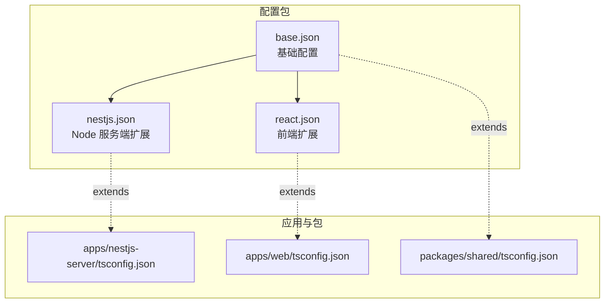
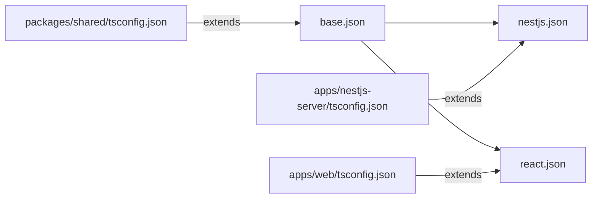
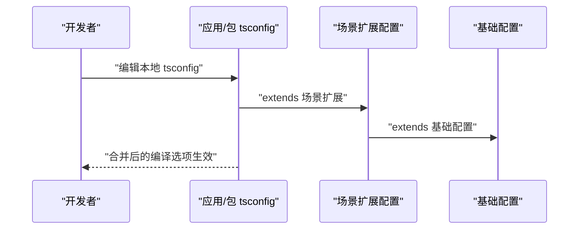
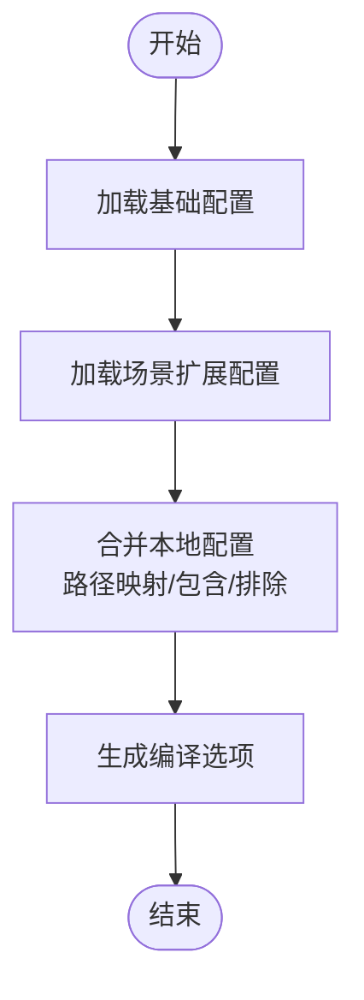
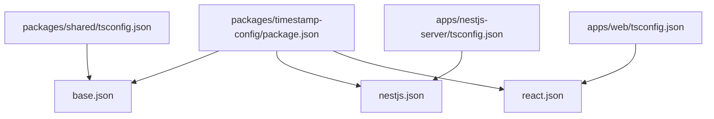

# TypeScript 配置包

<cite>
**本文档引用的文件**
- [packages\typescript-config\package.json](file://packages/timestamp-config/package.json)
- [packages\typescript-config\base.json](file://packages/timestamp-config/base.json)
- [packages\typescript-config\nestjs.json](file://packages/timestamp-config/nestjs.json)
- [packages\typescript-config\react.json](file://packages/timestamp-config/react.json)
- [apps\nestjs-server\tsconfig.json](file://apps/nestjs-server/tsconfig.json)
- [apps\nestjs-server\tsconfig.build.json](file://apps/nestjs-server/tsconfig.build.json)
- [apps\nestjs-server\tsconfig.test.json](file://apps/nestjs-server/tsconfig.test.json)
- [apps\web\tsconfig.json](file://apps/web/tsconfig.json)
- [packages\shared\tsconfig.json](file://packages/shared/tsconfig.json)
</cite>

## 目录

1. [简介](#简介)
2. [项目结构](#项目结构)
3. [核心组件](#核心组件)
4. [架构总览](#架构总览)
5. [详细组件分析](#详细组件分析)
6. [依赖分析](#依赖分析)
7. [性能考虑](#性能考虑)
8. [故障排除指南](#故障排除指南)
9. [结论](#结论)
10. [附录](#附录)

## 简介

本文件系统化介绍 Nebula 工作区中的 TypeScript 配置包设计与使用方法，涵盖：

- 基础配置、严格模式配置、模块解析配置与编译选项的设置策略
- 配置文件的继承关系、环境特定配置与项目特定配置的管理机制
- 具体配置示例、编译性能优化与类型检查策略
- 配置升级指南与多项目共享配置的实施方案

该配置包通过统一的基础配置与面向场景的扩展配置，为 NestJS 服务端、React 前端与共享库提供一致且可演进的 TypeScript 编译体验。

## 项目结构

配置包位于 packages/timestamp-config，包含三类预设配置：

- base.json：通用基础配置（严格模式、模块解析、声明与映射等）
- nestjs.json：Node 环境下服务端项目的扩展配置
- react.json：浏览器/前端打包工具环境下的扩展配置

各应用与包通过 extends 引用上述配置，并在本地 tsconfig 中叠加路径映射、包含/排除规则与环境特定选项。

图表来源

- [packages\typescript-config\base.json:1-23](file://packages/timestamp-config/base.json#L1-L23)
- [packages\typescript-config\nestjs.json:1-15](file://packages/timestamp-config/nestjs.json#L1-L15)
- [packages\typescript-config\react.json:1-11](file://packages/timestamp-config/react.json#L1-L11)
- [apps\nestjs-server\tsconfig.json:1-16](file://apps/nestjs-server/tsconfig.json#L1-L16)
- [apps\web\tsconfig.json:1-15](file://apps/web/tsconfig.json#L1-L15)
- [packages\shared\tsconfig.json:1-11](file://packages/shared/tsconfig.json#L1-L11)

章节来源

- [packages\typescript-config\package.json:1-11](file://packages/timestamp-config/package.json#L1-L11)
- [packages\typescript-config\base.json:1-23](file://packages/timestamp-config/base.json#L1-L23)
- [packages\typescript-config\nestjs.json:1-15](file://packages/timestamp-config/nestjs.json#L1-L15)
- [packages\typescript-config\react.json:1-11](file://packages/timestamp-config/react.json#L1-L11)

## 核心组件

- 基础配置（base.json）
  - 统一目标版本、模块与解析策略，启用严格模式与声明产物
  - 关键点：严格空值检查、隐式 any 限制、跳过库检查以提升性能
- Node 服务端扩展（nestjs.json）
  - 针对 NodeNext 模块与解析、装饰器元数据、Jest 类型等进行适配
  - 输出目录与根目录配置，便于构建与运行时调试
- 前端扩展（react.json）
  - 面向浏览器/DOM 的库集合、React JSX 输出、禁用 emit 以交由打包器处理
  - 保留 node 类型以便工具链兼容

章节来源

- [packages\typescript-config\base.json:1-23](file://packages/timestamp-config/base.json#L1-L23)
- [packages\typescript-config\nestjs.json:1-15](file://packages/timestamp-config/nestjs.json#L1-L15)
- [packages\typescript-config\react.json:1-11](file://packages/timestamp-config/react.json#L1-L11)

## 架构总览

配置包采用“基础层 + 场景扩展层”的分层设计，所有项目从基础配置派生，再按需叠加场景配置与本地定制。

图表来源

- [packages\typescript-config\base.json:1-23](file://packages/timestamp-config/base.json#L1-L23)
- [packages\typescript-config\nestjs.json:1-15](file://packages/timestamp-config/nestjs.json#L1-L15)
- [packages\typescript-config\react.json:1-11](file://packages/timestamp-config/react.json#L1-L11)
- [apps\nestjs-server\tsconfig.json:1-16](file://apps/nestjs-server/tsconfig.json#L1-L16)
- [apps\web\tsconfig.json:1-15](file://apps/web/tsconfig.json#L1-L15)
- [packages\shared\tsconfig.json:1-11](file://packages/shared/tsconfig.json#L1-L11)

## 详细组件分析

### 基础配置（base.json）设计要点

- 目标与模块策略
  - 目标版本与模块/解析策略统一，确保跨平台一致性
- 严格模式与类型安全
  - 启用严格模式与关键严格选项，减少运行时隐患
- 产物与调试支持
  - 生成声明与映射，开启 sourceMap 便于调试
- 性能优化
  - 跳过库检查，降低大型依赖的类型检查开销

章节来源

- [packages\typescript-config\base.json:1-23](file://packages/timestamp-config/base.json#L1-L23)

### Node 服务端配置（nestjs.json）设计要点

- 模块与解析
  - 使用 NodeNext 模块与解析，适配 NestJS 运行时生态
- 装饰器与注释
  - 启用装饰器元数据与实验性装饰器，移除注释以精简产物
- 类型覆盖
  - 注入 Node 与 Jest 类型，满足测试与运行时需求
- 构建输出
  - 明确 outDir 与 rootDir，配合构建脚本稳定产出

章节来源

- [packages\typescript-config\nestjs.json:1-15](file://packages/timestamp-config/nestjs.json#L1-L15)

### 前端配置（react.json）设计要点

- 浏览器能力
  - 包含 DOM 与 DOM.Iterable 库，满足 React/Vite 环境需求
- JSX 处理
  - 指定 JSX 转换策略，禁用 emit 交由打包器统一处理
- 类型覆盖
  - 保留 node 类型以兼容工具链

章节来源

- [packages\typescript-config\react.json:1-11](file://packages/timestamp-config/react.json#L1-L11)

### 应用与包的本地配置与继承

- NestJS 服务端
  - 通过 extends 引用服务端扩展；本地覆盖路径映射、包含范围与排除项
- Web 前端
  - 通过 extends 引用前端扩展；本地覆盖模块与解析策略、路径映射与包含范围
- 共享库
  - 通过 extends 引用基础配置；本地覆盖输出目录与根目录，关闭声明映射以减小产物体积

图表来源

- [apps\nestjs-server\tsconfig.json:1-16](file://apps/nestjs-server/tsconfig.json#L1-L16)
- [apps\web\tsconfig.json:1-15](file://apps/web/tsconfig.json#L1-L15)
- [packages\shared\tsconfig.json:1-11](file://packages/shared/tsconfig.json#L1-L11)
- [packages\typescript-config\nestjs.json:1-15](file://packages/timestamp-config/nestjs.json#L1-L15)
- [packages\typescript-config\react.json:1-11](file://packages/timestamp-config/react.json#L1-L11)
- [packages\typescript-config\base.json:1-23](file://packages/timestamp-config/base.json#L1-L23)

章节来源

- [apps\nestjs-server\tsconfig.json:1-16](file://apps/nestjs-server/tsconfig.json#L1-L16)
- [apps\nestjs-server\tsconfig.build.json:1-5](file://apps/nestjs-server/tsconfig.build.json#L1-L5)
- [apps\nestjs-server\tsconfig.test.json:1-4](file://apps/nestjs-server/tsconfig.test.json#L1-L4)
- [apps\web\tsconfig.json:1-15](file://apps/web/tsconfig.json#L1-L15)
- [packages\shared\tsconfig.json:1-11](file://packages/shared/tsconfig.json#L1-L11)

### 编译流程与路径映射

- NestJS 服务端
  - 本地定义多组路径别名，覆盖 include 排除项，构建与测试分别使用独立配置
- Web 前端
  - 本地覆盖模块与解析策略以适配打包器，定义路径别名，限定包含范围
- 共享库
  - 本地覆盖输出目录与根目录，关闭声明映射，仅生成声明文件

图表来源

- [apps\nestjs-server\tsconfig.json:1-16](file://apps/nestjs-server/tsconfig.json#L1-L16)
- [apps\web\tsconfig.json:1-15](file://apps/web/tsconfig.json#L1-L15)
- [packages\shared\tsconfig.json:1-11](file://packages/shared/tsconfig.json#L1-L11)
- [packages\typescript-config\nestjs.json:1-15](file://packages/timestamp-config/nestjs.json#L1-L15)
- [packages\typescript-config\react.json:1-11](file://packages/timestamp-config/react.json#L1-L11)
- [packages\typescript-config\base.json:1-23](file://packages/timestamp-config/base.json#L1-L23)

章节来源

- [apps\nestjs-server\tsconfig.json:1-16](file://apps/nestjs-server/tsconfig.json#L1-L16)
- [apps\web\tsconfig.json:1-15](file://apps/web/tsconfig.json#L1-L15)
- [packages\shared\tsconfig.json:1-11](file://packages/shared/tsconfig.json#L1-L11)

## 依赖分析

- 配置包内部依赖
  - base.json 作为根配置被 nestjs.json 与 react.json 扩展
- 应用与包对配置包的依赖
  - 通过工作区引用安装，本地 tsconfig 通过 extends 引用配置包内的具体配置文件
- 继承链路
  - 应用/包 -> 场景扩展 -> 基础配置

图表来源

- [packages\typescript-config\package.json:1-11](file://packages/timestamp-config/package.json#L1-L11)
- [packages\typescript-config\base.json:1-23](file://packages/timestamp-config/base.json#L1-L23)
- [packages\typescript-config\nestjs.json:1-15](file://packages/timestamp-config/nestjs.json#L1-L15)
- [packages\typescript-config\react.json:1-11](file://packages/timestamp-config/react.json#L1-L11)
- [apps\nestjs-server\tsconfig.json:1-16](file://apps/nestjs-server/tsconfig.json#L1-L16)
- [apps\web\tsconfig.json:1-15](file://apps/web/tsconfig.json#L1-L15)
- [packages\shared\tsconfig.json:1-11](file://packages/shared/tsconfig.json#L1-L11)

章节来源

- [packages\typescript-config\package.json:1-11](file://packages/timestamp-config/package.json#L1-L11)
- [apps\nestjs-server\tsconfig.json:1-16](file://apps/nestjs-server/tsconfig.json#L1-L16)
- [apps\web\tsconfig.json:1-15](file://apps/web/tsconfig.json#L1-L15)
- [packages\shared\tsconfig.json:1-11](file://packages/shared/tsconfig.json#L1-L11)

## 性能考虑

- 跳过库检查
  - 在基础配置中启用跳过库检查，显著降低大型依赖的类型检查时间
- 严格模式与增量检查
  - 严格模式有助于早期发现错误，结合增量编译可提升迭代效率
- 声明产物与映射
  - 生成声明与映射便于下游消费，但会增加构建时间；可在共享库中按需调整
- 模块与解析策略
  - Node 环境使用 NodeNext，前端使用 bundler 策略，避免不必要的解析开销
- 包含/排除范围
  - 精准控制 include/exclude，避免扫描无关目录，缩短编译时间

章节来源

- [packages\typescript-config\base.json:1-23](file://packages/timestamp-config/base.json#L1-L23)
- [packages\typescript-config\nestjs.json:1-15](file://packages/timestamp-config/nestjs.json#L1-L15)
- [packages\typescript-config\react.json:1-11](file://packages/timestamp-config/react.json#L1-L11)
- [apps\nestjs-server\tsconfig.json:1-16](file://apps/nestjs-server/tsconfig.json#L1-L16)
- [apps\web\tsconfig.json:1-15](file://apps/web/tsconfig.json#L1-L15)
- [packages\shared\tsconfig.json:1-11](file://packages/shared/tsconfig.json#L1-L11)

## 故障排除指南

- 继承链问题
  - 若本地配置无法生效，请确认 extends 路径正确且配置包已安装
- 路径映射冲突
  - 检查本地 paths 与模块解析策略是否匹配，避免与第三方包命名空间冲突
- 类型缺失
  - 在 Node 环境下确保注入 node/jest 类型，在前端确保注入 DOM 类型
- 构建失败
  - 检查 include/exclude 是否遗漏必要文件，确认 outDir/rootDir 设置合理
- 性能退化
  - 如类型检查变慢，检查是否启用了不必要的严格选项或包含过多文件

章节来源

- [packages\typescript-config\nestjs.json:1-15](file://packages/timestamp-config/nestjs.json#L1-L15)
- [packages\typescript-config\react.json:1-11](file://packages/timestamp-config/react.json#L1-L11)
- [apps\nestjs-server\tsconfig.json:1-16](file://apps/nestjs-server/tsconfig.json#L1-L16)
- [apps\web\tsconfig.json:1-15](file://apps/web/tsconfig.json#L1-L15)
- [packages\shared\tsconfig.json:1-11](file://packages/shared/tsconfig.json#L1-L11)

## 结论

该 TypeScript 配置包通过“基础 + 场景扩展 + 本地定制”的分层设计，实现了多项目的一致性与可维护性。建议在新增项目时优先复用现有扩展配置，仅在必要时进行本地微调；同时结合性能优化策略与严格的类型检查策略，持续提升开发体验与构建稳定性。

## 附录

### 配置示例与最佳实践

- 服务端项目
  - 通过 extends 引用服务端扩展，本地补充路径映射与包含/排除规则
- 前端项目
  - 通过 extends 引用前端扩展，本地覆盖模块与解析策略以适配打包器
- 共享库
  - 通过 extends 引用基础配置，本地覆盖输出目录与根目录，按需关闭声明映射

章节来源

- [apps\nestjs-server\tsconfig.json:1-16](file://apps/nestjs-server/tsconfig.json#L1-L16)
- [apps\web\tsconfig.json:1-15](file://apps/web/tsconfig.json#L1-L15)
- [packages\shared\tsconfig.json:1-11](file://packages/shared/tsconfig.json#L1-L11)

### 配置升级指南

- 版本升级
  - 升级配置包版本后，先在本地验证继承链是否正常，再逐步迁移严格选项
- 严格模式演进
  - 从基础严格模式起步，按团队规范逐步收紧选项，确保 CI 与本地一致
- 模块策略迁移
  - 从 CommonJS 渐进到 NodeNext/bundler，同步更新路径映射与打包器配置

章节来源

- [packages\typescript-config\base.json:1-23](file://packages/timestamp-config/base.json#L1-L23)
- [packages\typescript-config\nestjs.json:1-15](file://packages/timestamp-config/nestjs.json#L1-L15)
- [packages\typescript-config\react.json:1-11](file://packages/timestamp-config/react.json#L1-L11)

### 多项目共享配置实施方案

- 工作区发布
  - 将配置包纳入工作区，通过 workspace:\* 引用，确保所有项目共享同一套配置
- 分层治理
  - 基础配置集中维护，场景扩展按需扩展，本地配置最小化
- 变更流程
  - 对基础配置的任何变更均需评估影响面，优先在测试项目验证后再推广

章节来源

- [packages\typescript-config\package.json:1-11](file://packages/timestamp-config/package.json#L1-L11)
- [apps\nestjs-server\tsconfig.json:1-16](file://apps/nestjs-server/tsconfig.json#L1-L16)
- [apps\web\tsconfig.json:1-15](file://apps/web/tsconfig.json#L1-L15)
- [packages\shared\tsconfig.json:1-11](file://packages/shared/tsconfig.json#L1-L11)
