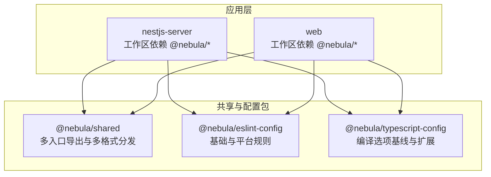
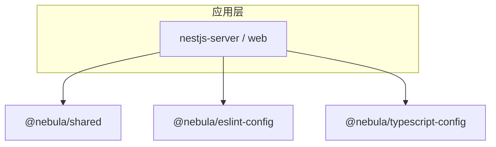
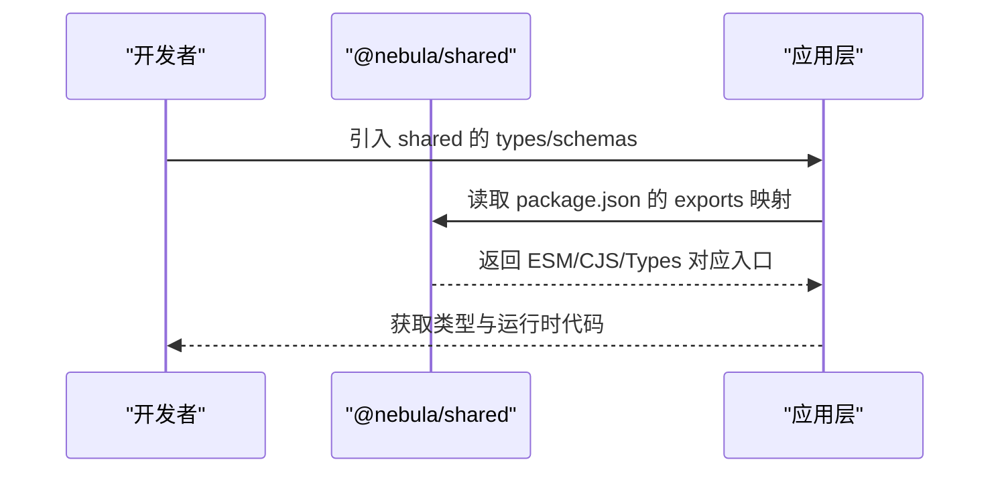
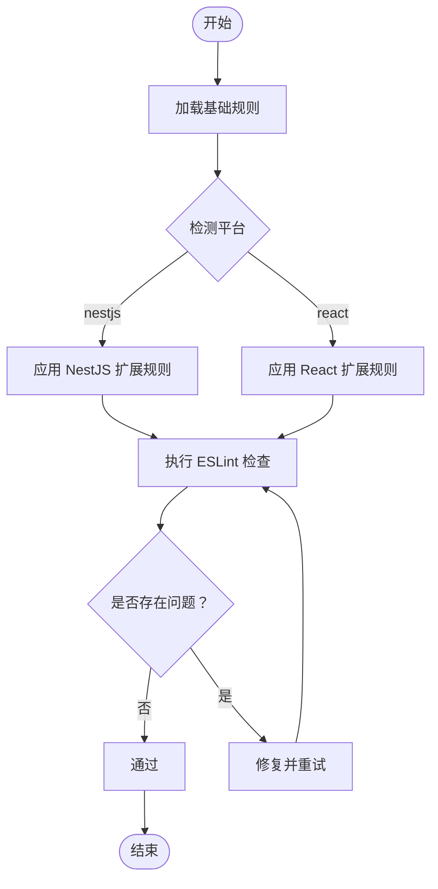
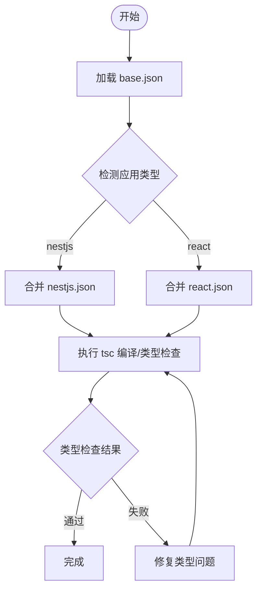
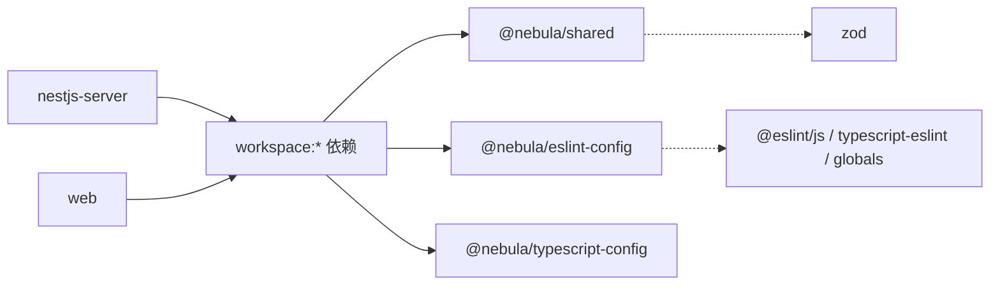

# 共享包

<cite>
**本文引用的文件**
- [packages/shared/package.json](file://packages/shared/package.json)
- [packages/shared/src/index.ts](file://packages/shared/src/index.ts)
- [packages/eslint-config/package.json](file://packages/eslint-config/package.json)
- [packages/typescript-config/package.json](file://packages/typescript-config/package.json)
- [packages/typescript-config/base.json](file://packages/typescript-config/base.json)
- [apps/nestjs-server/package.json](file://apps/nestjs-server/package.json)
- [apps/web/package.json](file://apps/web/package.json)
</cite>

## 目录
1. [简介](#简介)
2. [项目结构](#项目结构)
3. [核心组件](#核心组件)
4. [架构总览](#架构总览)
5. [详细组件分析](#详细组件分析)
6. [依赖分析](#依赖分析)
7. [性能考虑](#性能考虑)
8. [故障排查指南](#故障排查指南)
9. [结论](#结论)
10. [附录](#附录)

## 简介
本文件系统性梳理并说明项目中的共享包与配置模块，包括：
- shared 包：统一导出业务类型、Zod 校验模式（Schemas）、错误模型与通用工具，支持多入口导出与多格式分发（ESM/CJS/Types）。
- ESLint 配置包：提供基础规则与针对 NestJS、React 的扩展规则，统一团队代码风格与静态检查。
- TypeScript 配置包：提供严格且一致的编译选项基线，以及面向不同场景的扩展配置。

目标是帮助开发者快速理解设计理念、使用方式、集成步骤与最佳实践，并为后续发布、版本管理与依赖更新提供策略建议。

## 项目结构
共享包与配置模块位于 packages 目录下，采用工作区（workspace）组织，通过 package.json 的 exports 字段实现多入口与多格式分发；应用层（nestjs-server、web）通过工作区依赖引用这些包。

**图表来源**
- [packages/shared/package.json:6-56](file://packages/shared/package.json#L6-L56)
- [packages/eslint-config/package.json:6-10](file://packages/eslint-config/package.json#L6-L10)
- [packages/typescript-config/package.json:5-9](file://packages/typescript-config/package.json#L5-L9)
- [apps/nestjs-server/package.json](file://apps/nestjs-server/package.json)
- [apps/web/package.json](file://apps/web/package.json)

**章节来源**
- [packages/shared/package.json:1-80](file://packages/shared/package.json#L1-L80)
- [packages/eslint-config/package.json:1-23](file://packages/eslint-config/package.json#L1-L23)
- [packages/typescript-config/package.json:1-11](file://packages/typescript-config/package.json#L1-L11)

## 核心组件
- shared 包
  - 多入口导出：types、schemas、errors、utils，便于按需引入与 Tree-shaking。
  - 统一导出：index 将各域模块聚合，简化上层导入路径。
  - 分发格式：同时输出 ESM、CommonJS 与类型声明，满足不同运行时与工具链需求。
  - 依赖：Zod 用于数据校验与类型推断增强。
- ESLint 配置包
  - 基础规则：统一语言特性、全局变量、Prettier 集成。
  - 平台扩展：nestjs、react 子入口，覆盖各自生态的最佳实践。
- TypeScript 配置包
  - 基线：严格模式、ESNext 目标、NodeNext 模块解析、声明与 SourceMap 输出。
  - 扩展：提供 nestjs.json、react.json 以适配不同应用类型。

**章节来源**
- [packages/shared/package.json:6-56](file://packages/shared/package.json#L6-L56)
- [packages/shared/src/index.ts:1-15](file://packages/shared/src/index.ts#L1-L15)
- [packages/eslint-config/package.json:6-10](file://packages/eslint-config/package.json#L6-L10)
- [packages/typescript-config/package.json:5-9](file://packages/typescript-config/package.json#L5-L9)
- [packages/typescript-config/base.json:1-23](file://packages/typescript-config/base.json#L1-L23)

## 架构总览
共享包与配置包在工作区内形成“标准基线 + 场景扩展”的架构：
- shared 提供统一的数据契约（类型/Schemas）与基础设施（错误/工具），作为业务模块的共同依赖。
- eslint-config 与 typescript-config 为所有应用提供一致的静态检查与编译策略，避免重复配置。
- 应用层仅需通过工作区依赖即可获得统一的开发体验与质量保障。

**图表来源**
- [packages/shared/package.json:6-56](file://packages/shared/package.json#L6-L56)
- [packages/eslint-config/package.json:6-10](file://packages/eslint-config/package.json#L6-L10)
- [packages/typescript-config/package.json:5-9](file://packages/typescript-config/package.json#L5-L9)
- [apps/nestjs-server/package.json](file://apps/nestjs-server/package.json)
- [apps/web/package.json](file://apps/web/package.json)

## 详细组件分析

### shared 包设计与使用
- 设计理念
  - 聚合式导出：通过 index 聚合各域模块，减少上层导入层级。
  - 命名空间导出：对 types 与 schemas 使用命名空间导出，便于区分与按需使用。
  - 多入口与多格式：支持 import/require 两种入口与对应类型声明，提升兼容性。
- 典型使用
  - 在业务模块中按需从 shared 导入类型或 Schemas，确保前后端/模块间契约一致。
  - 使用 errors 与 utils 提供的通用能力，降低重复实现。
- 发布与构建
  - 构建脚本基于 tsdown，生成多格式产物与类型声明。
  - 清单文件仅包含 dist，确保发布内容最小化。

**图表来源**
- [packages/shared/package.json:6-56](file://packages/shared/package.json#L6-L56)
- [packages/shared/src/index.ts:1-15](file://packages/shared/src/index.ts#L1-L15)

**章节来源**
- [packages/shared/package.json:1-80](file://packages/shared/package.json#L1-L80)
- [packages/shared/src/index.ts:1-15](file://packages/shared/src/index.ts#L1-L15)

### ESLint 配置包规则定制与质量保证
- 规则组成
  - 基础规则：统一语言特性与全局变量，结合 Prettier 实现格式化一致性。
  - 平台扩展：nestjs、react 子入口分别覆盖各自生态的规则集。
- 质量保证机制
  - 通过工作区依赖，确保所有应用使用同一套规则，避免“配置漂移”。
  - 开发者只需安装编辑器插件或在 CI 中执行 eslint，即可自动发现并修复问题。
- 集成指导
  - 应用层直接引用相应子入口（如 nestjs 或 react），无需额外配置。
  - 如需自定义，可在应用层覆盖局部规则，但建议保持与基线一致。

**图表来源**
- [packages/eslint-config/package.json:6-10](file://packages/eslint-config/package.json#L6-L10)

**章节来源**
- [packages/eslint-config/package.json:1-23](file://packages/eslint-config/package.json#L1-L23)

### TypeScript 配置包编译选项与类型检查策略
- 编译选项策略
  - 严格模式：开启 strict、strictNullChecks、noImplicitAny，提升类型安全。
  - 现代化目标：ES2023 目标与 NodeNext 模块解析，适配现代 Node 运行时。
  - 声明与 SourceMap：生成 declaration 与 declarationMap，便于消费方获得良好 DX。
- 类型检查策略
  - 基线：base.json 提供统一的严格配置。
  - 场景扩展：nestjs.json、react.json 作为基线的补充，覆盖特定生态的类型需求。
- 集成指导
  - 应用层通过 extends 引用相应配置，避免重复维护。
  - 在本地与 CI 中统一执行 tsc --noEmit，确保类型检查一致性。

**图表来源**
- [packages/typescript-config/base.json:1-23](file://packages/typescript-config/base.json#L1-L23)
- [packages/typescript-config/package.json:5-9](file://packages/typescript-config/package.json#L5-L9)

**章节来源**
- [packages/typescript-config/base.json:1-23](file://packages/typescript-config/base.json#L1-L23)
- [packages/typescript-config/package.json:1-11](file://packages/typescript-config/package.json#L1-L11)

## 依赖分析
- 工作区依赖关系
  - shared、eslint-config、typescript-config 均通过 workspace:* 依赖彼此，确保版本一致性。
  - 应用层（nestjs-server、web）通过工作区依赖引用上述包，避免重复安装与版本漂移。
- 外部依赖
  - shared 依赖 zod，用于数据校验与类型推断。
  - eslint-config 依赖 @eslint/js、typescript-eslint、globals、eslint-config-prettier、eslint-plugin-prettier。
  - typescript-config 无运行时依赖，仅提供 JSON 配置文件。

**图表来源**
- [packages/shared/package.json:70-72](file://packages/shared/package.json#L70-L72)
- [packages/eslint-config/package.json:11-17](file://packages/eslint-config/package.json#L11-L17)
- [apps/nestjs-server/package.json](file://apps/nestjs-server/package.json)
- [apps/web/package.json](file://apps/web/package.json)

**章节来源**
- [packages/shared/package.json:70-72](file://packages/shared/package.json#L70-L72)
- [packages/eslint-config/package.json:11-17](file://packages/eslint-config/package.json#L11-L17)
- [apps/nestjs-server/package.json](file://apps/nestjs-server/package.json)
- [apps/web/package.json](file://apps/web/package.json)

## 性能考虑
- 构建与分发
  - shared 使用 tsdown 生成多格式产物，减少打包阶段的转换开销。
  - 清理脚本 clean 可用于重建环境，避免缓存导致的不一致。
- 类型检查
  - base.json 启用 declaration 与 declarationMap，有利于增量编译与 IDE 快速反馈。
  - CI 中统一执行 tsc --noEmit，可提前暴露类型问题，避免运行时风险。
- Lint 性能
  - 通过工作区集中管理规则，减少每个应用的配置扫描时间。
  - Prettier 与 ESLint 协同，避免重复格式化计算。

**章节来源**
- [packages/shared/package.json:64-69](file://packages/shared/package.json#L64-L69)
- [packages/typescript-config/base.json:17-19](file://packages/typescript-config/base.json#L17-L19)

## 故障排查指南
- 构建失败
  - 症状：shared 构建报错或产物缺失。
  - 排查：确认 tsdown 版本与 TypeScript 版本兼容；清理 node_modules 与 dist 后重试。
- 类型检查失败
  - 症状：tsc 报告类型错误。
  - 排查：核对 extends 的配置是否正确；检查 base.json 与场景扩展的合并顺序。
- Lint 不生效
  - 症状：ESLint 未按预期规则执行。
  - 排查：确认应用层引用了正确的子入口（nestjs 或 react）；检查编辑器插件与 ESLint 版本。
- 运行时导入异常
  - 症状：ESM/CJS 导入报错。
  - 排查：确认 package.json 的 exports 映射与运行时模块解析设置一致。

**章节来源**
- [packages/shared/package.json:64-69](file://packages/shared/package.json#L64-L69)
- [packages/typescript-config/base.json:1-23](file://packages/typescript-config/base.json#L1-L23)
- [packages/eslint-config/package.json:6-10](file://packages/eslint-config/package.json#L6-L10)

## 结论
共享包与配置模块通过“统一基线 + 场景扩展”的方式，为整个工作区提供了稳定、可复用且易于演进的基础设施。开发者可以专注于业务逻辑，而无需重复配置与维护规则。配合严格的类型检查与代码规范，能够显著提升代码质量与协作效率。

## 附录

### 发布流程与版本管理
- 版本策略
  - 采用语义化版本（SemVer），在 packages/* 下统一维护 version 字段。
- 发布步骤
  - 在根目录执行统一构建与测试（如适用）。
  - 使用工作区发布工具（如 pnpm publish --filter @nebula/*）批量发布。
  - 更新变更日志，记录 breaking change 与新增功能。
- 回滚策略
  - 若发布后发现问题，及时回滚到上一个稳定版本并发布 hotfix。

### 依赖更新策略
- 定期审计
  - 使用 pnpm outdated 或类似工具定期检查依赖更新。
- 渐进式升级
  - 先在 devDependencies 中尝试升级，验证 CI 与本地开发无异常后再迁移至 dependencies。
- 工作区同步
  - 通过 workspace:* 保持内部包版本一致，避免跨包冲突。

### 集成指导清单
- 在应用层安装工作区依赖：
  - @nebula/shared
  - @nebula/eslint-config
  - @nebula/typescript-config
- 应用层配置要点
  - TypeScript：在 tsconfig 中 extends 相应配置文件。
  - ESLint：引用对应子入口（nestjs 或 react）。
  - shared：按需从多入口导入 types/schemas/errors/utils。