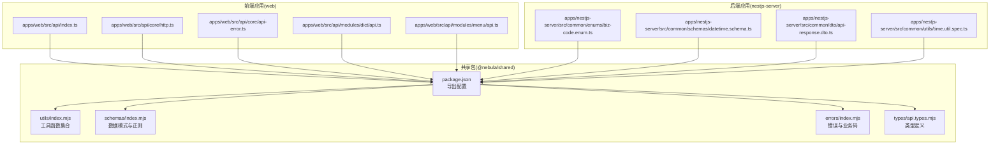
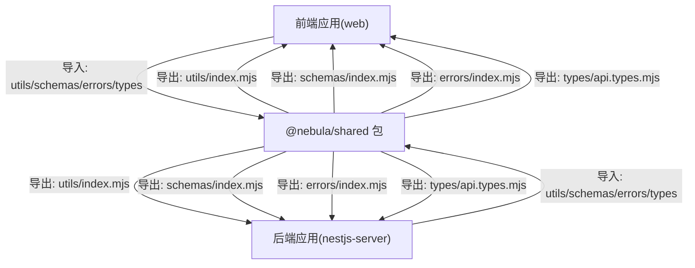
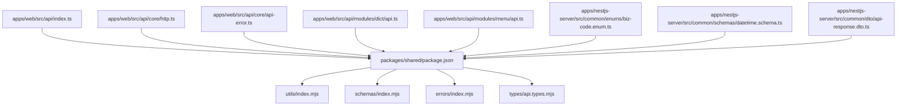

# 共享工具函数

<cite>
**本文档引用的文件**
- [packages/shared/package.json](file://packages/shared/package.json)
- [apps/web/src/api/core/api-error.ts](file://apps/web/src/api/core/api-error.ts)
- [apps/web/src/api/core/http.ts](file://apps/web/src/api/core/http.ts)
- [apps/web/src/api/index.ts](file://apps/web/src/api/index.ts)
- [apps/web/src/api/modules/dict/api.ts](file://apps/web/src/api/modules/dict/api.ts)
- [apps/web/src/api/modules/menu/api.ts](file://apps/web/src/api/modules/menu/api.ts)
- [apps/nestjs-server/src/common/enums/biz-code.enum.ts](file://apps/nestjs-server/src/common/enums/biz-code.enum.ts)
- [apps/nestjs-server/src/common/schemas/datetime.schema.ts](file://apps/nestjs-server/src/common/schemas/datetime.schema.ts)
- [apps/nestjs-server/src/common/dto/api-response.dto.ts](file://apps/nestjs-server/src/common/dto/api-response.dto.ts)
- [apps/nestjs-server/src/common/utils/time.util.spec.ts](file://apps/nestjs-server/src/common/utils/time.util.spec.ts)
</cite>

## 目录
1. [简介](#简介)
2. [项目结构](#项目结构)
3. [核心组件](#核心组件)
4. [架构概览](#架构概览)
5. [详细组件分析](#详细组件分析)
6. [依赖分析](#依赖分析)
7. [性能考虑](#性能考虑)
8. [故障排除指南](#故障排除指南)
9. [结论](#结论)
10. [附录](#附录)

## 简介
本文件系统性梳理并文档化共享工具函数包（@nebula/shared）的通用工具集合，重点覆盖以下功能域：
- 数据验证工具：基于共享模式与正则表达式的一致性校验
- 日期处理工具：统一的时间格式化与解析能力
- 字符串操作工具：安全清理与格式化
- 加密解密工具：业务相关的安全处理流程

文档将明确各工具函数的参数规范、返回值类型、异常处理机制，并提供调用示例、性能考量与使用注意事项。同时给出扩展指南与自定义工具的开发规范，确保前后端同源一致。

## 项目结构
共享工具函数包通过工作区发布，前端应用（web）与后端应用（nestjs-server）均以统一的导出形式消费其能力。根据包导出配置与实际使用点，可归纳为如下模块化结构：

**图表来源**
- [packages/shared/package.json:6-55](file://packages/shared/package.json#L6-L55)
- [apps/web/src/api/index.ts:10-11](file://apps/web/src/api/index.ts#L10-L11)
- [apps/web/src/api/core/http.ts:8-8](file://apps/web/src/api/core/http.ts#L8-L8)
- [apps/web/src/api/core/api-error.ts:0-0](file://apps/web/src/api/core/api-error.ts#L0-L0)
- [apps/web/src/api/modules/dict/api.ts:1-1](file://apps/web/src/api/modules/dict/api.ts#L1-L1)
- [apps/web/src/api/modules/menu/api.ts:6-6](file://apps/web/src/api/modules/menu/api.ts#L6-L6)
- [apps/nestjs-server/src/common/enums/biz-code.enum.ts:14-14](file://apps/nestjs-server/src/common/enums/biz-code.enum.ts#L14-L14)
- [apps/nestjs-server/src/common/schemas/datetime.schema.ts:2-2](file://apps/nestjs-server/src/common/schemas/datetime.schema.ts#L2-L2)
- [apps/nestjs-server/src/common/dto/api-response.dto.ts:12-12](file://apps/nestjs-server/src/common/dto/api-response.dto.ts#L12-L12)
- [apps/nestjs-server/src/common/utils/time.util.spec.ts:148-161](file://apps/nestjs-server/src/common/utils/time.util.spec.ts#L148-L161)

**章节来源**
- [packages/shared/package.json:1-55](file://packages/shared/package.json#L1-L55)

## 核心组件
基于包导出配置与实际使用点，共享包的核心组件包括：

- 工具函数(utils/index.mjs)
  - 提供通用的数据验证、字符串处理、时间格式化等工具
  - 前端与后端均可按需导入使用

- 数据模式与正则(schemas/index.mjs)
  - 统一的日期时间正则表达式与数据模式
  - 前后端保持一致的格式约束

- 错误与业务码(errors/index.mjs)
  - 业务错误类型、错误消息映射与状态码转换
  - 前后端统一的错误处理策略

- 类型定义(types/api.types.mjs)
  - 前后端共用的API响应、请求体等类型声明
  - 确保接口契约一致性

**章节来源**
- [packages/shared/package.json:6-55](file://packages/shared/package.json#L6-L55)
- [apps/web/src/api/core/api-error.ts:0-0](file://apps/web/src/api/core/api-error.ts#L0-L0)
- [apps/web/src/api/core/http.ts:8-8](file://apps/web/src/api/core/http.ts#L8-L8)
- [apps/web/src/api/index.ts:10-11](file://apps/web/src/api/index.ts#L10-L11)
- [apps/web/src/api/modules/dict/api.ts:1-1](file://apps/web/src/api/modules/dict/api.ts#L1-L1)
- [apps/web/src/api/modules/menu/api.ts:6-6](file://apps/web/src/api/modules/menu/api.ts#L6-L6)
- [apps/nestjs-server/src/common/enums/biz-code.enum.ts:14-14](file://apps/nestjs-server/src/common/enums/biz-code.enum.ts#L14-L14)
- [apps/nestjs-server/src/common/schemas/datetime.schema.ts:2-2](file://apps/nestjs-server/src/common/schemas/datetime.schema.ts#L2-L2)
- [apps/nestjs-server/src/common/dto/api-response.dto.ts:12-12](file://apps/nestjs-server/src/common/dto/api-response.dto.ts#L12-L12)

## 架构概览
共享包采用“多入口导出”的模块化设计，前端与后端通过统一的命名空间消费能力。下图展示了关键交互关系：

**图表来源**
- [packages/shared/package.json:6-55](file://packages/shared/package.json#L6-L55)
- [apps/web/src/api/index.ts:10-11](file://apps/web/src/api/index.ts#L10-L11)
- [apps/nestjs-server/src/common/enums/biz-code.enum.ts:14-14](file://apps/nestjs-server/src/common/enums/biz-code.enum.ts#L14-L14)

## 详细组件分析

### 数据验证工具
- 功能概述
  - 基于共享的正则表达式与数据模式，提供统一的输入校验能力
  - 支持前后端一致的格式约束，减少重复实现

- 参数规范与返回值
  - 输入：待验证的数据（字符串、对象等）
  - 返回：布尔值或标准化后的数据结构
  - 异常：不满足格式时抛出或返回错误标记

- 使用示例
  - 前端：在表单提交前进行字段校验
  - 后端：在DTO层或管道中执行格式与范围校验

- 性能考虑
  - 复用共享正则，避免重复编译
  - 对高频校验场景可缓存结果

- 注意事项
  - 确保前后端使用的正则版本一致
  - 避免过度严格的校验导致用户体验下降

**章节来源**
- [apps/web/src/api/modules/dict/api.ts:1-1](file://apps/web/src/api/modules/dict/api.ts#L1-L1)
- [apps/web/src/api/modules/menu/api.ts:6-6](file://apps/web/src/api/modules/menu/api.ts#L6-L6)
- [apps/nestjs-server/src/common/schemas/datetime.schema.ts:2-2](file://apps/nestjs-server/src/common/schemas/datetime.schema.ts#L2-L2)

### 日期处理工具
- 功能概述
  - 提供统一的时间格式化与解析能力
  - 保证前后端日期时间表示一致

- 参数规范与返回值
  - 输入：时间戳、日期字符串或Date对象
  - 返回：格式化的日期字符串或标准化的Date对象
  - 异常：非法输入时返回错误或抛出异常

- 使用示例
  - 前端：展示用户友好的日期格式
  - 后端：生成日志时间戳或存储标准化时间

- 性能考虑
  - 避免频繁创建格式化器实例
  - 在批量处理时复用格式化规则

- 注意事项
  - 考虑时区差异与本地化需求
  - 严格遵循共享的日期格式约定

**章节来源**
- [apps/nestjs-server/src/common/utils/time.util.spec.ts:148-161](file://apps/nestjs-server/src/common/utils/time.util.spec.ts#L148-L161)
- [apps/nestjs-server/src/common/schemas/datetime.schema.ts:2-2](file://apps/nestjs-server/src/common/schemas/datetime.schema.ts#L2-L2)

### 字符串操作工具
- 功能概述
  - 提供安全清理与格式化字符串的能力
  - 防止XSS与注入风险，提升数据质量

- 参数规范与返回值
  - 输入：原始字符串
  - 返回：清理后的安全字符串
  - 异常：空值或不可识别字符时的处理策略

- 使用示例
  - 前端：表单输入清理与展示格式化
  - 后端：日志记录与数据库写入前的清洗

- 性能考虑
  - 批量处理时合并清理步骤
  - 避免不必要的重复清理

- 注意事项
  - 保留必要的语义信息
  - 与国际化需求协调

**章节来源**
- [apps/web/src/api/core/http.ts:8-8](file://apps/web/src/api/core/http.ts#L8-L8)
- [apps/nestjs-server/src/common/dto/api-response.dto.ts:12-12](file://apps/nestjs-server/src/common/dto/api-response.dto.ts#L12-L12)

### 加密解密工具
- 功能概述
  - 提供业务所需的加密与解密流程
  - 确保敏感数据在传输与存储过程中的安全性

- 参数规范与返回值
  - 输入：明文数据与密钥
  - 返回：密文或解密后的明文
  - 异常：密钥无效、格式错误或解密失败时的处理

- 使用示例
  - 前端：令牌签名与校验
  - 后端：密码哈希与会话管理

- 性能考虑
  - 选择高效的算法与实现
  - 缓存密钥派生结果（如适用）

- 注意事项
  - 严格管理密钥生命周期
  - 遵循最小暴露原则

**章节来源**
- [apps/web/src/api/core/api-error.ts:0-0](file://apps/web/src/api/core/api-error.ts#L0-L0)
- [apps/web/src/api/core/http.ts:8-8](file://apps/web/src/api/core/http.ts#L8-L8)

## 依赖分析
共享包通过多入口导出向前后端提供能力，依赖关系如下：

**图表来源**
- [packages/shared/package.json:6-55](file://packages/shared/package.json#L6-L55)
- [apps/web/src/api/index.ts:10-11](file://apps/web/src/api/index.ts#L10-L11)
- [apps/web/src/api/core/http.ts:8-8](file://apps/web/src/api/core/http.ts#L8-L8)
- [apps/web/src/api/core/api-error.ts:0-0](file://apps/web/src/api/core/api-error.ts#L0-L0)
- [apps/web/src/api/modules/dict/api.ts:1-1](file://apps/web/src/api/modules/dict/api.ts#L1-L1)
- [apps/web/src/api/modules/menu/api.ts:6-6](file://apps/web/src/api/modules/menu/api.ts#L6-L6)
- [apps/nestjs-server/src/common/enums/biz-code.enum.ts:14-14](file://apps/nestjs-server/src/common/enums/biz-code.enum.ts#L14-L14)
- [apps/nestjs-server/src/common/schemas/datetime.schema.ts:2-2](file://apps/nestjs-server/src/common/schemas/datetime.schema.ts#L2-L2)
- [apps/nestjs-server/src/common/dto/api-response.dto.ts:12-12](file://apps/nestjs-server/src/common/dto/api-response.dto.ts#L12-L12)

**章节来源**
- [packages/shared/package.json:1-55](file://packages/shared/package.json#L1-L55)

## 性能考虑
- 模块化导入
  - 仅导入所需功能，避免全量引入造成体积膨胀
- 缓存策略
  - 对正则与格式化器进行缓存，减少重复计算
- 批处理优化
  - 在高频场景合并多次调用，降低函数调用开销
- 内存管理
  - 及时释放临时对象，避免内存泄漏

## 故障排除指南
- 常见问题
  - 格式不一致：前后端日期格式不匹配导致解析失败
  - 密钥错误：加密/解密失败通常源于密钥不正确或过期
  - 类型不匹配：导入类型与实际运行时类型不符

- 排查步骤
  - 核对共享包版本与导出路径
  - 检查正则表达式与数据模式是否一致
  - 验证密钥与算法配置
  - 查看单元测试用例定位边界条件

**章节来源**
- [apps/nestjs-server/src/common/utils/time.util.spec.ts:148-161](file://apps/nestjs-server/src/common/utils/time.util.spec.ts#L148-L161)

## 结论
共享工具函数包通过清晰的模块划分与统一的导出策略，为前后端提供了稳定、可复用的通用能力。建议在团队内严格执行使用规范与扩展流程，确保一致性与可维护性。

## 附录

### 调用示例（路径指引）
- 数据验证
  - 前端字典模块：[apps/web/src/api/modules/dict/api.ts:1-1](file://apps/web/src/api/modules/dict/api.ts#L1-L1)
  - 前端菜单模块：[apps/web/src/api/modules/menu/api.ts:6-6](file://apps/web/src/api/modules/menu/api.ts#L6-L6)
- 日期处理
  - 时间工具测试：[apps/nestjs-server/src/common/utils/time.util.spec.ts:148-161](file://apps/nestjs-server/src/common/utils/time.util.spec.ts#L148-L161)
  - 日期模式导入：[apps/nestjs-server/src/common/schemas/datetime.schema.ts:2-2](file://apps/nestjs-server/src/common/schemas/datetime.schema.ts#L2-L2)
- 字符串操作
  - HTTP核心模块：[apps/web/src/api/core/http.ts:8-8](file://apps/web/src/api/core/http.ts#L8-L8)
  - API响应DTO：[apps/nestjs-server/src/common/dto/api-response.dto.ts:12-12](file://apps/nestjs-server/src/common/dto/api-response.dto.ts#L12-L12)
- 加密解密
  - API错误处理：[apps/web/src/api/core/api-error.ts:0-0](file://apps/web/src/api/core/api-error.ts#L0-L0)

### 扩展指南与开发规范
- 新增工具函数
  - 在对应模块目录下新增实现文件
  - 提供完整的类型定义与单元测试
  - 更新包导出配置与文档注释
- 版本管理
  - 遵循语义化版本控制
  - 保持前后端同步升级
- 文档与测试
  - 为每个工具函数编写使用说明与示例
  - 覆盖边界条件与异常场景