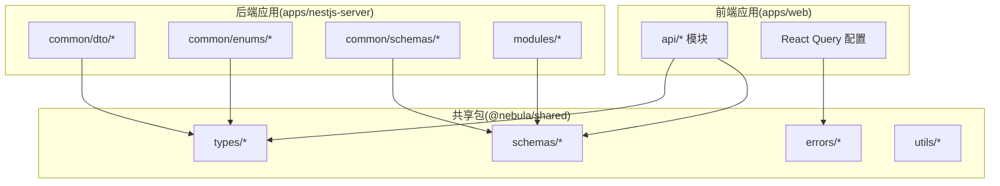
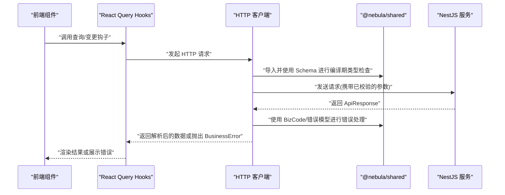
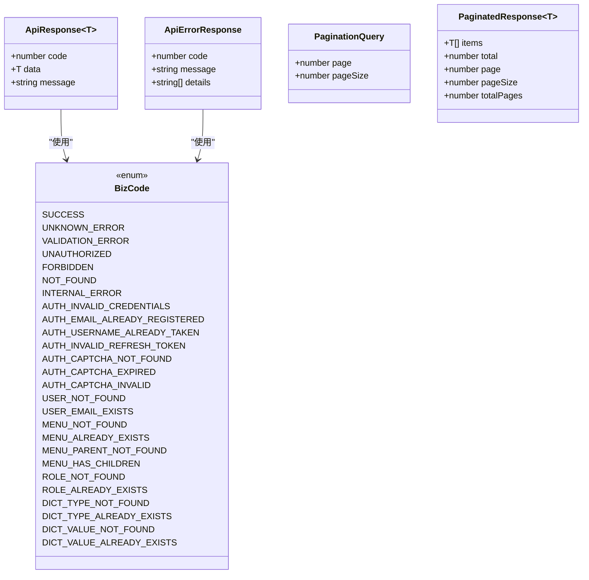
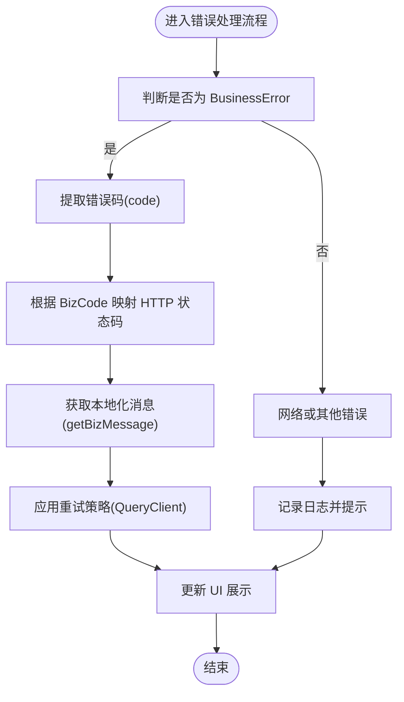
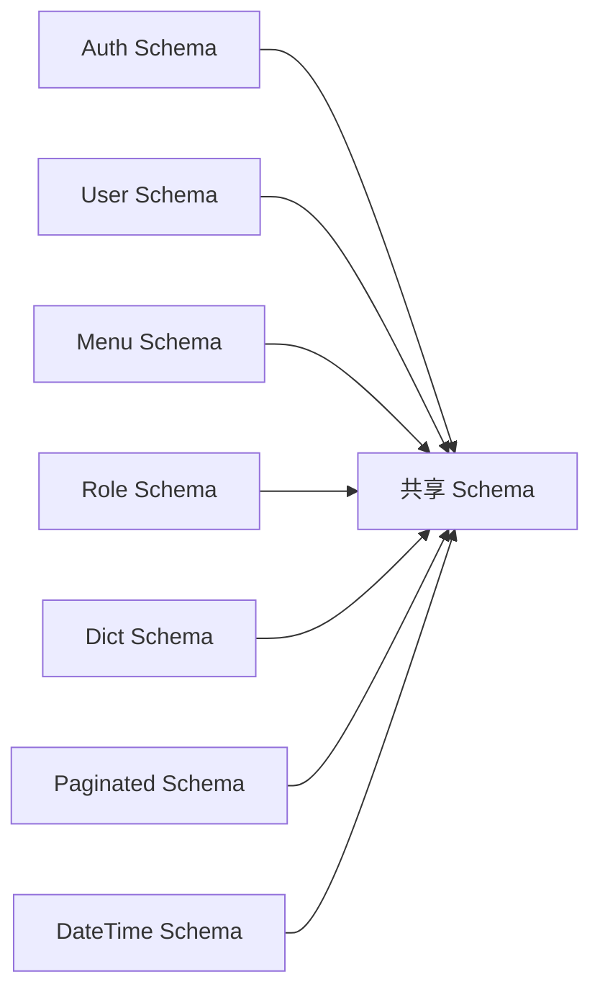
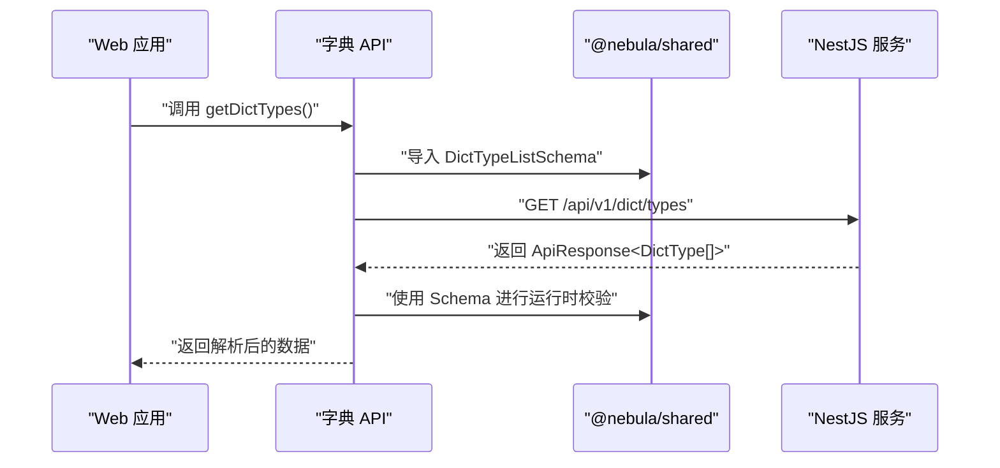
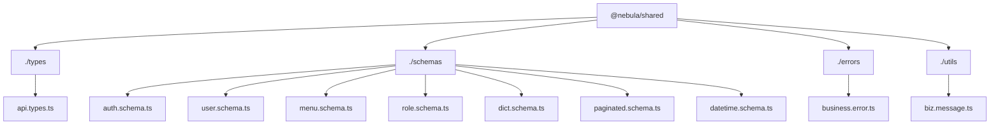

# 共享类型定义

<cite>
**本文档引用的文件**
- [packages/shared/src/types/api.types.ts](file://packages/shared/src/types/api.types.ts)
- [packages/shared/src/schemas/index.ts](file://packages/shared/src/schemas/index.ts)
- [packages/shared/src/schemas/paginated.schema.ts](file://packages/shared/src/schemas/paginated.schema.ts)
- [packages/shared/src/schemas/auth.schema.ts](file://packages/shared/src/schemas/auth.schema.ts)
- [packages/shared/src/schemas/user.schema.ts](file://packages/shared/src/schemas/user.schema.ts)
- [packages/shared/src/schemas/menu.schema.ts](file://packages/shared/src/schemas/menu.schema.ts)
- [packages/shared/src/schemas/role.schema.ts](file://packages/shared/src/schemas/role.schema.ts)
- [packages/shared/src/schemas/dict.schema.ts](file://packages/shared/src/schemas/dict.schema.ts)
- [packages/shared/src/schemas/datetime.schema.ts](file://packages/shared/src/schemas/datetime.schema.ts)
- [packages/shared/src/errors/index.ts](file://packages/shared/src/errors/index.ts)
- [packages/shared/src/utils/index.ts](file://packages/shared/src/utils/index.ts)
- [packages/shared/package.json](file://packages/shared/package.json)
- [apps/web/src/api/modules/dict/api.ts](file://apps/web/src/api/modules/dict/api.ts)
- [apps/web/src/api/core/query-client.ts](file://apps/web/src/api/core/query-client.ts)
- [apps/web/src/api/core/http.ts](file://apps/web/src/api/core/http.ts)
- [apps/web/src/api/core/api-error.ts](file://apps/web/src/api/core/api-error.ts)
- [apps/nestjs-server/src/common/enums/biz-code.enum.ts](file://apps/nestjs-server/src/common/enums/biz-code.enum.ts)
- [apps/nestjs-server/src/common/dto/api-response.dto.ts](file://apps/nestjs-server/src/common/dto/api-response.dto.ts)
- [apps/nestjs-server/src/common/schemas/datetime.schema.ts](file://apps/nestjs-server/src/common/schemas/datetime.schema.ts)
- [apps/nestjs-server/src/modules/auth/dto/auth.dto.ts](file://apps/nestjs-server/src/modules/auth/dto/auth.dto.ts)
- [apps/nestjs-server/src/modules/user/dto/user.dto.ts](file://apps/nestjs-server/src/modules/user/dto/user.dto.ts)
- [.trae/documents/frontend-api-integration-plan.md](file://.trae/documents/frontend-api-integration-plan.md)
</cite>

## 目录
1. [简介](#简介)
2. [项目结构](#项目结构)
3. [核心组件](#核心组件)
4. [架构概览](#架构概览)
5. [详细组件分析](#详细组件分析)
6. [依赖分析](#依赖分析)
7. [性能考虑](#性能考虑)
8. [故障排除指南](#故障排除指南)
9. [结论](#结论)

## 简介
本文件系统性梳理了 Nebula 项目中共享类型定义的设计与实现，重点覆盖 packages/shared 包提供的 TypeScript 类型定义、Zod Schema、错误处理模型以及跨前端与后端的统一契约。该共享包通过明确的模块划分与严格的导出策略，确保前后端在接口契约、数据验证与错误处理上保持一致性。

## 项目结构
共享类型定义位于 packages/shared 包内，采用按功能域拆分的模块化组织方式：
- types：通用类型与业务枚举
- schemas：各领域 Zod Schema 定义
- errors：业务错误模型与工具
- utils：通用工具类型与辅助函数

**图表来源**
- [packages/shared/package.json:1-55](file://packages/shared/package.json#L1-L55)
- [packages/shared/src/schemas/index.ts:1-7](file://packages/shared/src/schemas/index.ts#L1-L7)

**章节来源**
- [packages/shared/package.json:1-55](file://packages/shared/package.json#L1-L55)
- [packages/shared/src/schemas/index.ts:1-7](file://packages/shared/src/schemas/index.ts#L1-L7)

## 核心组件
共享包的核心能力围绕以下几类类型与模型展开：

- 通用响应与分页类型
  - ApiResponse<T>：统一的响应载体，包含业务码、数据与消息
  - ApiErrorResponse：错误响应结构，支持可选的细节数组
  - PaginationQuery/PaginatedResponse<T>：分页查询参数与分页响应结构
  - getHttpStatus：根据业务码映射到 HTTP 状态码

- 业务枚举与值类型
  - BizCode：业务码枚举，用于统一标识各类业务状态
  - BizCodeValue：业务码字面量类型，用于约束取值范围

- 各领域 Zod Schema
  - 认证(Auth)、用户(User)、菜单(Menu)、角色(Role)、字典(Dict)等领域的输入输出模式
  - 通用分页 Schema：PaginationQuerySchema/PaginatedResponseSchema
  - 日期时间 Schema：DATETIME_REGEX 及相关解析逻辑

- 错误处理模型
  - BusinessError：前端业务错误封装，包含 code、message、details 等字段
  - isBusinessError：类型守卫，用于区分业务错误与网络异常
  - getBizMessage：根据业务码获取本地化或默认消息

- 工具类型与辅助
  - 通用工具函数与类型别名，支撑跨模块复用

**章节来源**
- [packages/shared/src/types/api.types.ts:60-122](file://packages/shared/src/types/api.types.ts#L60-L122)
- [packages/shared/src/schemas/paginated.schema.ts:1-17](file://packages/shared/src/schemas/paginated.schema.ts#L1-L17)
- [packages/shared/src/schemas/datetime.schema.ts:1-50](file://packages/shared/src/schemas/datetime.schema.ts#L1-L50)
- [packages/shared/src/errors/index.ts:1-200](file://packages/shared/src/errors/index.ts#L1-L200)

## 架构概览
共享类型定义在全栈中的作用是作为“单一真实来源”，确保前后端在接口契约、数据验证与错误处理上保持一致。前端通过 React Query 与自定义 HTTP 客户端消费后端接口，所有请求参数与响应均基于共享 Schema 进行编译期与运行时双重校验。

**图表来源**
- [apps/web/src/api/modules/dict/api.ts:1-31](file://apps/web/src/api/modules/dict/api.ts#L1-L31)
- [apps/web/src/api/core/http.ts:1-200](file://apps/web/src/api/core/http.ts#L1-L200)
- [packages/shared/src/schemas/index.ts:1-7](file://packages/shared/src/schemas/index.ts#L1-L7)
- [packages/shared/src/errors/index.ts:1-200](file://packages/shared/src/errors/index.ts#L1-L200)

## 详细组件分析

### 通用响应与分页类型
- ApiResponse<T>：承载 code、data、message 的标准响应结构，T 为泛型数据载荷
- ApiErrorResponse：标准错误响应，支持 details 数组用于细化错误信息
- PaginationQuery：page/pageSize 的分页查询参数
- PaginatedResponse<T>：包含 items、total、page、pageSize、totalPages 的分页响应
- getHttpStatus：将 BizCode 映射到 HTTP 状态码，便于前端统一处理

**图表来源**
- [packages/shared/src/types/api.types.ts:60-122](file://packages/shared/src/types/api.types.ts#L60-L122)

**章节来源**
- [packages/shared/src/types/api.types.ts:60-122](file://packages/shared/src/types/api.types.ts#L60-L122)

### 业务错误模型与工具
- BusinessError：前端业务错误对象，包含 code、message、details 等字段
- isBusinessError：类型守卫，用于在运行时识别业务错误
- getBizMessage：根据 BizCode 获取对应消息文本
- 前端 QueryClient 默认配置：针对 UNAUTHORIZED 等业务错误进行智能重试控制

**图表来源**
- [packages/shared/src/errors/index.ts:1-200](file://packages/shared/src/errors/index.ts#L1-L200)
- [apps/web/src/api/core/query-client.ts:1-31](file://apps/web/src/api/core/query-client.ts#L1-L31)

**章节来源**
- [packages/shared/src/errors/index.ts:1-200](file://packages/shared/src/errors/index.ts#L1-L200)
- [apps/web/src/api/core/query-client.ts:1-31](file://apps/web/src/api/core/query-client.ts#L1-L31)

### 各领域 Zod Schema
- 认证(Auth)：登录凭据、验证码等输入校验
- 用户(User)：用户信息、密码等输入校验
- 菜单(Menu)：菜单树、父子关系等输入校验
- 角色(Role)：角色权限、关联资源等输入校验
- 字典(Dict)：字典类型与值的输入校验
- 通用分页：PaginationQuerySchema/PaginatedResponseSchema
- 日期时间：DATETIME_REGEX 及解析逻辑，确保前后端日期格式一致

**图表来源**
- [packages/shared/src/schemas/index.ts:1-7](file://packages/shared/src/schemas/index.ts#L1-L7)
- [packages/shared/src/schemas/paginated.schema.ts:1-17](file://packages/shared/src/schemas/paginated.schema.ts#L1-L17)
- [packages/shared/src/schemas/datetime.schema.ts:1-50](file://packages/shared/src/schemas/datetime.schema.ts#L1-L50)

**章节来源**
- [packages/shared/src/schemas/index.ts:1-7](file://packages/shared/src/schemas/index.ts#L1-L7)
- [packages/shared/src/schemas/paginated.schema.ts:1-17](file://packages/shared/src/schemas/paginated.schema.ts#L1-L17)
- [packages/shared/src/schemas/datetime.schema.ts:1-50](file://packages/shared/src/schemas/datetime.schema.ts#L1-L50)

### 前后端集成示例
- 前端字典模块通过共享 Schema 对请求参数与响应进行编译期与运行时校验
- QueryClient 基于 BizCode 控制重试策略，UNAUTHORIZED 不自动重试
- 后端 DTO 与 Schema 从共享包导入，确保前后端字段与校验规则一致

**图表来源**
- [apps/web/src/api/modules/dict/api.ts:1-31](file://apps/web/src/api/modules/dict/api.ts#L1-L31)
- [packages/shared/src/schemas/dict.schema.ts:1-200](file://packages/shared/src/schemas/dict.schema.ts#L1-L200)

**章节来源**
- [apps/web/src/api/modules/dict/api.ts:1-31](file://apps/web/src/api/modules/dict/api.ts#L1-L31)

## 依赖分析
共享包通过 exports 字段提供多入口导出，支持 ESM/CJS 与类型声明的完整构建产物：
- 根入口：./types、./schemas、./errors、./utils
- 依赖管理：zod 版本与后端保持一致，确保 Schema 行为一致

**图表来源**
- [packages/shared/package.json:6-55](file://packages/shared/package.json#L6-L55)
- [packages/shared/src/schemas/index.ts:1-7](file://packages/shared/src/schemas/index.ts#L1-L7)

**章节来源**
- [packages/shared/package.json:6-55](file://packages/shared/package.json#L6-L55)
- [packages/shared/src/schemas/index.ts:1-7](file://packages/shared/src/schemas/index.ts#L1-L7)

## 性能考虑
- 编译期类型检查：通过共享类型减少重复定义，降低维护成本并提升类型安全性
- 运行时 Schema 校验：在前端与后端统一使用 Zod Schema，避免重复校验逻辑
- 错误处理缓存：QueryClient 默认配置针对业务错误进行智能重试，减少不必要的网络请求
- 日期格式统一：前后端日期格式一致，避免额外的格式转换开销

## 故障排除指南
- 业务错误无法识别
  - 确认使用 isBusinessError 进行类型守卫
  - 检查错误对象是否包含 code/message/details 字段
- 重试策略不符合预期
  - UNAUTHORIZED 不应自动重试，确认 QueryClient 配置
  - 其他业务错误可根据需要调整 retry 次数
- 响应结构不匹配
  - 确保前后端使用相同的 ApiResponse/ApiErrorResponse 结构
  - 检查 getHttpStatus 是否正确映射 BizCode
- Schema 校验失败
  - 确认前端与后端使用的 Zod Schema 完全一致
  - 检查字段名称、类型与约束条件

**章节来源**
- [apps/web/src/api/core/query-client.ts:1-31](file://apps/web/src/api/core/query-client.ts#L1-L31)
- [packages/shared/src/errors/index.ts:1-200](file://packages/shared/src/errors/index.ts#L1-L200)
- [packages/shared/src/types/api.types.ts:75-122](file://packages/shared/src/types/api.types.ts#L75-L122)

## 结论
@nebula/shared 通过清晰的模块划分与严格的导出策略，实现了前后端在类型、Schema 与错误处理上的高度一致性。借助编译期类型检查与运行时 Schema 校验，显著提升了系统的可靠性与可维护性。建议在新增领域或修改既有 Schema 时，遵循统一的命名规范与约束策略，确保共享契约的稳定性与演进可控性。