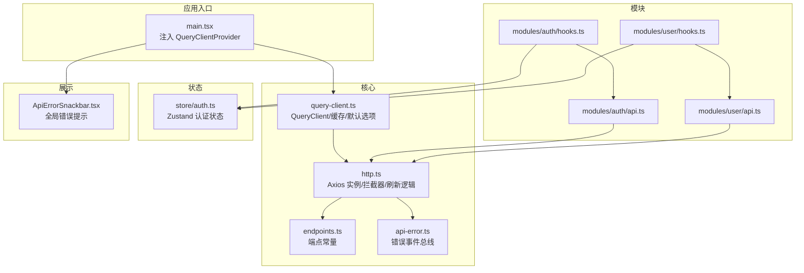
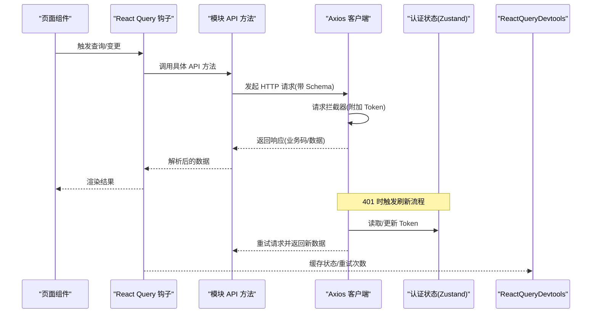
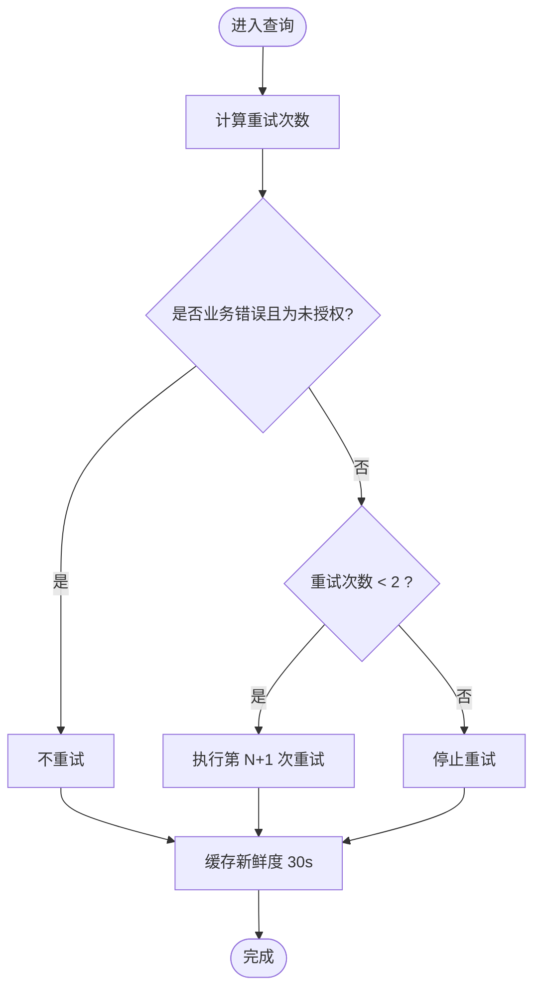
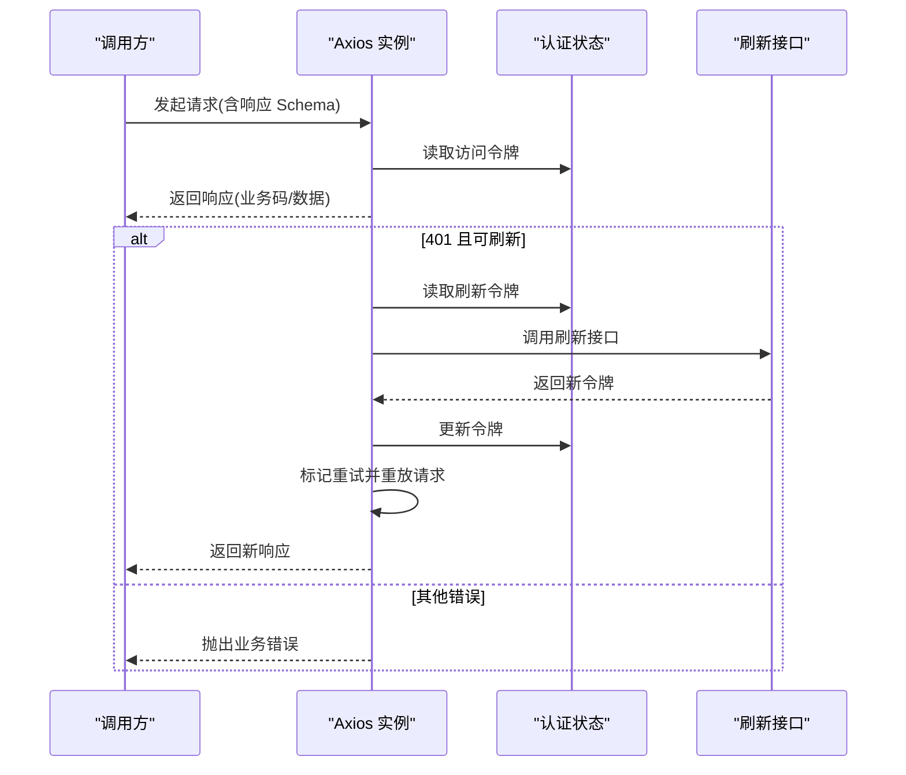
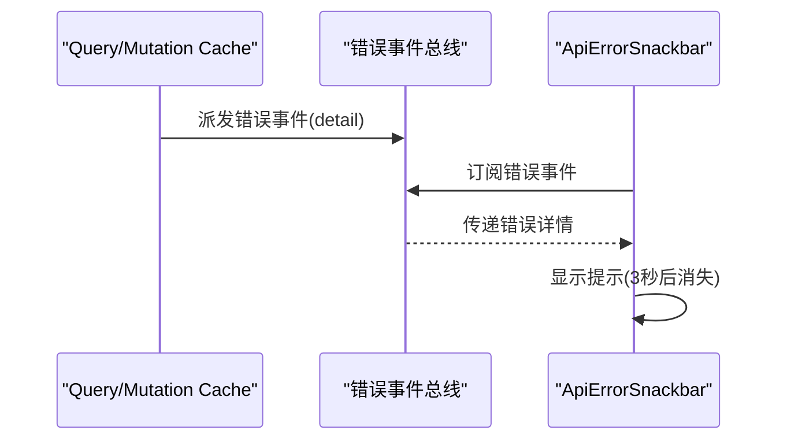
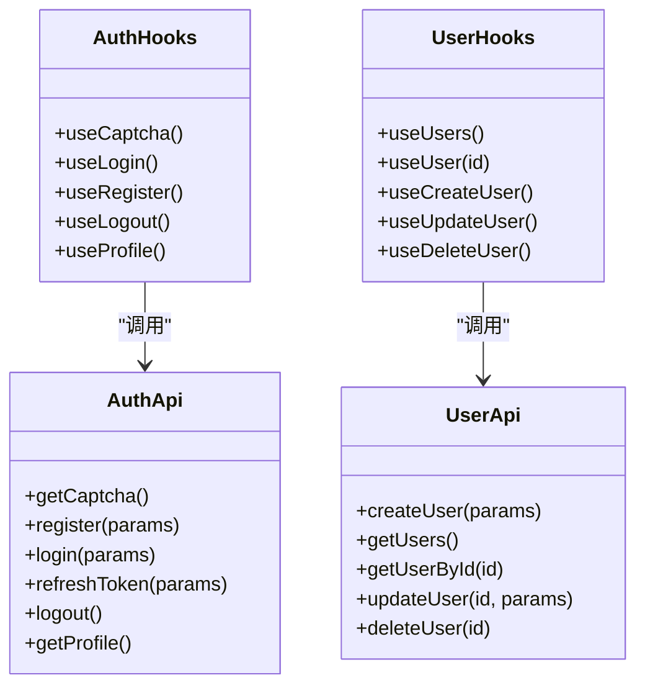
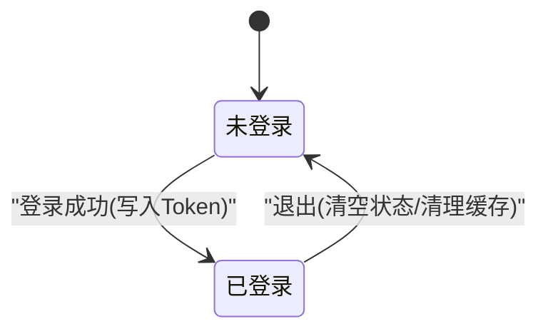
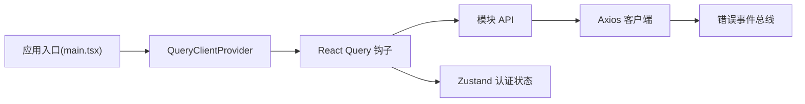

# API 集成

<cite>
**本文引用的文件**
- [apps/web/src/api/core/query-client.ts](file://apps/web/src/api/core/query-client.ts)
- [apps/web/src/api/core/http.ts](file://apps/web/src/api/core/http.ts)
- [apps/web/src/api/core/endpoints.ts](file://apps/web/src/api/core/endpoints.ts)
- [apps/web/src/api/core/api-error.ts](file://apps/web/src/api/core/api-error.ts)
- [apps/web/src/api/index.ts](file://apps/web/src/api/index.ts)
- [apps/web/src/api/modules/auth/api.ts](file://apps/web/src/api/modules/auth/api.ts)
- [apps/web/src/api/modules/auth/hooks.ts](file://apps/web/src/api/modules/auth/hooks.ts)
- [apps/web/src/api/modules/user/api.ts](file://apps/web/src/api/modules/user/api.ts)
- [apps/web/src/api/modules/user/hooks.ts](file://apps/web/src/api/modules/user/hooks.ts)
- [apps/web/src/store/auth.ts](file://apps/web/src/store/auth.ts)
- [apps/web/src/components/ApiErrorSnackbar.tsx](file://apps/web/src/components/ApiErrorSnackbar.tsx)
- [apps/web/src/main.tsx](file://apps/web/src/main.tsx)
</cite>

## 目录

1. [简介](#简介)
2. [项目结构](#项目结构)
3. [核心组件](#核心组件)
4. [架构总览](#架构总览)
5. [详细组件分析](#详细组件分析)
6. [依赖关系分析](#依赖关系分析)
7. [性能考量](#性能考量)
8. [故障排查指南](#故障排查指南)
9. [结论](#结论)
10. [附录](#附录)

## 简介

本文件系统性梳理基于 TanStack React Query 的 API 集成方案，覆盖 API 客户端配置、请求/响应拦截器、认证刷新、错误处理、模块化设计、查询客户端与缓存策略、请求重试与网络错误处理，并提供调用示例与性能优化建议。目标是帮助开发者快速理解并正确使用该集成方式。

## 项目结构

前端应用通过统一入口导出模块化 API 与 React Query 钩子，核心能力集中在以下目录：

- 核心层：HTTP 客户端、端点常量、错误事件总线、React Query 客户端
- 模块层：按业务域划分的 API 方法与对应的 React Query 钩子
- 状态层：认证状态存储
- 展示层：全局错误提示组件

图表来源

- [apps/web/src/main.tsx:12-22](file://apps/web/src/main.tsx#L12-L22)
- [apps/web/src/api/core/query-client.ts:5-31](file://apps/web/src/api/core/query-client.ts#L5-L31)
- [apps/web/src/api/core/http.ts:66-80](file://apps/web/src/api/core/http.ts#L66-L80)
- [apps/web/src/api/core/endpoints.ts:1-21](file://apps/web/src/api/core/endpoints.ts#L1-L21)
- [apps/web/src/api/core/api-error.ts:16-32](file://apps/web/src/api/core/api-error.ts#L16-L32)
- [apps/web/src/api/modules/auth/api.ts:17-18](file://apps/web/src/api/modules/auth/api.ts#L17-L18)
- [apps/web/src/api/modules/auth/hooks.ts:1-49](file://apps/web/src/api/modules/auth/hooks.ts#L1-L49)
- [apps/web/src/api/modules/user/api.ts:10-11](file://apps/web/src/api/modules/user/api.ts#L10-L11)
- [apps/web/src/api/modules/user/hooks.ts:1-56](file://apps/web/src/api/modules/user/hooks.ts#L1-L56)
- [apps/web/src/store/auth.ts:30-63](file://apps/web/src/store/auth.ts#L30-L63)
- [apps/web/src/components/ApiErrorSnackbar.tsx:1-58](file://apps/web/src/components/ApiErrorSnackbar.tsx#L1-L58)

章节来源

- [apps/web/src/api/index.ts:14-41](file://apps/web/src/api/index.ts#L14-L41)
- [apps/web/src/main.tsx:12-22](file://apps/web/src/main.tsx#L12-L22)

## 核心组件

- 查询客户端与缓存
  - 默认查询重试策略：对业务错误且为未授权时禁用重试；否则最多重试两次
  - 查询缓存新鲜度：30 秒
  - 窗口焦点重抓取：关闭
  - 变更操作重试：0 次
  - 全局查询/变更缓存错误事件：统一派发到错误事件总线
- HTTP 客户端与拦截器
  - 基础配置：基础 URL、超时、Content-Type
  - 请求拦截：自动附加 Bearer Token
  - 响应拦截：统一业务码校验、Schema 校验、401 自动刷新令牌、网络异常兜底
  - 刷新流程：并发队列、重试标记、失败回退与登出
- 错误事件总线
  - 发送：捕获业务错误与非业务错误，去重通知
  - 监听：全局订阅，用于 UI 提示
- 端点常量
  - 统一维护 API 路径，便于集中管理与替换

章节来源

- [apps/web/src/api/core/query-client.ts:5-31](file://apps/web/src/api/core/query-client.ts#L5-L31)
- [apps/web/src/api/core/http.ts:66-80](file://apps/web/src/api/core/http.ts#L66-L80)
- [apps/web/src/api/core/http.ts:94-179](file://apps/web/src/api/core/http.ts#L94-L179)
- [apps/web/src/api/core/api-error.ts:16-32](file://apps/web/src/api/core/api-error.ts#L16-L32)
- [apps/web/src/api/core/endpoints.ts:1-21](file://apps/web/src/api/core/endpoints.ts#L1-L21)

## 架构总览

下图展示了从页面组件到 API 层的整体调用链路，包括认证状态、查询缓存、错误事件与 UI 提示的交互。

图表来源

- [apps/web/src/api/modules/auth/hooks.ts:12-22](file://apps/web/src/api/modules/auth/hooks.ts#L12-L22)
- [apps/web/src/api/modules/auth/api.ts:24-30](file://apps/web/src/api/modules/auth/api.ts#L24-L30)
- [apps/web/src/api/core/http.ts:94-179](file://apps/web/src/api/core/http.ts#L94-L179)
- [apps/web/src/store/auth.ts:36-46](file://apps/web/src/store/auth.ts#L36-L46)
- [apps/web/src/main.tsx:18-19](file://apps/web/src/main.tsx#L18-L19)

## 详细组件分析

### 查询客户端与缓存策略

- 查询缓存
  - 默认重试：最多两次，遇到未授权业务错误直接放弃
  - 新鲜时间：30 秒
  - 窗口焦点重抓取：关闭，避免不必要的后台请求
- 变更缓存
  - 默认不重试，变更成功后通过查询键失效进行一致性维护
- 错误处理
  - 查询/变更缓存统一 onError，派发到错误事件总线

图表来源

- [apps/web/src/api/core/query-client.ts:18-26](file://apps/web/src/api/core/query-client.ts#L18-L26)

章节来源

- [apps/web/src/api/core/query-client.ts:5-31](file://apps/web/src/api/core/query-client.ts#L5-L31)

### HTTP 客户端与拦截器

- 基础实例
  - 基础 URL 来源于环境变量，超时 15 秒，JSON 内容类型
- 请求拦截
  - 从认证状态读取访问令牌并附加 Authorization 头
- 响应拦截
  - 业务码校验：非成功码抛出业务错误
  - Schema 校验：若配置了响应 Schema，则进行解析与校验
  - 网络异常兜底：无响应时抛出业务错误
- 401 自动刷新
  - 若未携带重试标记且未显式禁止刷新，且存在刷新令牌，则串行刷新
  - 并发请求排队等待新 Token 后重试
  - 刷新失败则清空认证状态并抛错

图表来源

- [apps/web/src/api/core/http.ts:94-179](file://apps/web/src/api/core/http.ts#L94-L179)
- [apps/web/src/store/auth.ts:36-46](file://apps/web/src/store/auth.ts#L36-L46)

章节来源

- [apps/web/src/api/core/http.ts:66-80](file://apps/web/src/api/core/http.ts#L66-L80)
- [apps/web/src/api/core/http.ts:94-179](file://apps/web/src/api/core/http.ts#L94-L179)

### 错误事件总线与 UI 提示

- 错误事件总线
  - 发送：对业务错误提取消息与代码，非业务错误使用兜底消息；去重防止重复通知
  - 监听：订阅窗口自定义事件，回调中消费错误详情
- UI 提示
  - 全局 Snackbar 组件监听错误事件并在 3 秒后自动隐藏

图表来源

- [apps/web/src/api/core/api-error.ts:16-32](file://apps/web/src/api/core/api-error.ts#L16-L32)
- [apps/web/src/components/ApiErrorSnackbar.tsx:10-28](file://apps/web/src/components/ApiErrorSnackbar.tsx#L10-L28)

章节来源

- [apps/web/src/api/core/api-error.ts:16-42](file://apps/web/src/api/core/api-error.ts#L16-L42)
- [apps/web/src/components/ApiErrorSnackbar.tsx:1-58](file://apps/web/src/components/ApiErrorSnackbar.tsx#L1-L58)

### 模块化 API 设计与钩子

- 模块 API
  - 每个业务域提供一组方法，封装端点路径与请求 Schema
  - 使用统一的 get/post/patch/del 封装，自动携带响应 Schema
- React Query 钩子
  - 查询：以稳定 queryKey 作为缓存键，必要时通过 enabled 控制启用条件
  - 变更：在 onSuccess/onSettled 中清理/失效相关查询，保持缓存一致性
  - 认证场景：登录成功写入 Token，退出时清空状态并清理缓存

图表来源

- [apps/web/src/api/modules/auth/api.ts:20-42](file://apps/web/src/api/modules/auth/api.ts#L20-L42)
- [apps/web/src/api/modules/auth/hooks.ts:5-48](file://apps/web/src/api/modules/auth/hooks.ts#L5-L48)
- [apps/web/src/api/modules/user/api.ts:15-33](file://apps/web/src/api/modules/user/api.ts#L15-L33)
- [apps/web/src/api/modules/user/hooks.ts:9-55](file://apps/web/src/api/modules/user/hooks.ts#L9-L55)

章节来源

- [apps/web/src/api/modules/auth/api.ts:1-45](file://apps/web/src/api/modules/auth/api.ts#L1-L45)
- [apps/web/src/api/modules/auth/hooks.ts:1-49](file://apps/web/src/api/modules/auth/hooks.ts#L1-L49)
- [apps/web/src/api/modules/user/api.ts:1-34](file://apps/web/src/api/modules/user/api.ts#L1-L34)
- [apps/web/src/api/modules/user/hooks.ts:1-56](file://apps/web/src/api/modules/user/hooks.ts#L1-L56)

### 认证集成与状态管理

- 认证状态
  - 使用 Zustand 管理访问令牌、刷新令牌、用户信息与登录态
  - 支持持久化与开发工具中间件
- 登录/退出流程
  - 登录成功：写入 Token，使“资料”查询可用
  - 退出：清空状态并清理查询缓存

图表来源

- [apps/web/src/store/auth.ts:36-46](file://apps/web/src/store/auth.ts#L36-L46)
- [apps/web/src/api/modules/auth/hooks.ts:17-21](file://apps/web/src/api/modules/auth/hooks.ts#L17-L21)
- [apps/web/src/api/modules/auth/hooks.ts:35-39](file://apps/web/src/api/modules/auth/hooks.ts#L35-L39)

章节来源

- [apps/web/src/store/auth.ts:1-64](file://apps/web/src/store/auth.ts#L1-L64)
- [apps/web/src/api/modules/auth/hooks.ts:12-39](file://apps/web/src/api/modules/auth/hooks.ts#L12-L39)

### 端点常量与统一导出

- 端点常量
  - 统一维护各模块端点路径，支持运行时替换
- 统一导出
  - 对外仅暴露核心与模块 API、钩子与共享类型，便于按需引入

章节来源

- [apps/web/src/api/core/endpoints.ts:1-21](file://apps/web/src/api/core/endpoints.ts#L1-L21)
- [apps/web/src/api/index.ts:14-41](file://apps/web/src/api/index.ts#L14-L41)

## 依赖关系分析

- 组件耦合
  - 钩子依赖模块 API，模块 API 依赖 HTTP 客户端
  - 认证钩子依赖认证状态存储
  - 错误事件总线被查询/变更缓存与 HTTP 客户端共同使用
- 外部依赖
  - TanStack React Query：查询/变更生命周期与缓存
  - Axios：HTTP 通信与拦截器
  - Zod：响应数据 Schema 校验
  - Zustand：轻量状态管理

图表来源

- [apps/web/src/api/modules/auth/hooks.ts:1-49](file://apps/web/src/api/modules/auth/hooks.ts#L1-L49)
- [apps/web/src/api/modules/user/hooks.ts:1-56](file://apps/web/src/api/modules/user/hooks.ts#L1-L56)
- [apps/web/src/api/modules/auth/api.ts:17-18](file://apps/web/src/api/modules/auth/api.ts#L17-L18)
- [apps/web/src/api/modules/user/api.ts:10-11](file://apps/web/src/api/modules/user/api.ts#L10-L11)
- [apps/web/src/api/core/http.ts:102-179](file://apps/web/src/api/core/http.ts#L102-L179)
- [apps/web/src/store/auth.ts:30-63](file://apps/web/src/store/auth.ts#L30-L63)
- [apps/web/src/main.tsx:14-20](file://apps/web/src/main.tsx#L14-L20)

章节来源

- [apps/web/src/api/index.ts:14-41](file://apps/web/src/api/index.ts#L14-L41)
- [apps/web/src/main.tsx:12-22](file://apps/web/src/main.tsx#L12-L22)

## 性能考量

- 缓存策略
  - 查询新鲜时间为 30 秒，减少重复请求
  - 窗口焦点重抓取关闭，避免频繁后台刷新
- 重试策略
  - 默认最多两次，未授权业务错误不重试，降低无效请求
- 变更一致性
  - 使用查询键失效替代手动更新，保证缓存一致性
- 数据校验
  - 响应 Schema 校验在服务端之外再做一层防护，提升健壮性
- 开发调试
  - React Query Devtools 可视化缓存与重试状态，便于定位问题

章节来源

- [apps/web/src/api/core/query-client.ts:16-30](file://apps/web/src/api/core/query-client.ts#L16-L30)
- [apps/web/src/api/core/http.ts:47-58](file://apps/web/src/api/core/http.ts#L47-L58)
- [apps/web/src/main.tsx:18-19](file://apps/web/src/main.tsx#L18-L19)

## 故障排查指南

- 401 未授权
  - 现象：出现未授权错误或自动刷新
  - 排查：确认刷新令牌是否存在；查看刷新流程是否成功；检查 Token 是否被正确写入与携带
- 业务错误
  - 现象：弹出错误提示
  - 排查：根据错误码与消息定位问题；关注错误事件总线是否重复通知
- 网络异常
  - 现象：无响应或超时
  - 排查：检查基础 URL 与端点常量；确认跨域与代理配置；观察超时时间
- 缓存不一致
  - 现象：更新/删除后数据未刷新
  - 排查：确认变更钩子是否失效相关查询键；检查 queryKey 是否唯一且一致

章节来源

- [apps/web/src/api/core/http.ts:121-179](file://apps/web/src/api/core/http.ts#L121-L179)
- [apps/web/src/api/core/api-error.ts:16-32](file://apps/web/src/api/core/api-error.ts#L16-L32)
- [apps/web/src/api/modules/user/hooks.ts:29-54](file://apps/web/src/api/modules/user/hooks.ts#L29-L54)

## 结论

该集成方案以 TanStack React Query 为核心，结合 Axios 拦截器与 Zod Schema 校验，实现了统一的 API 客户端、模块化 API 设计、自动认证刷新与全局错误提示。通过合理的缓存与重试策略，兼顾了性能与可靠性。建议在实际使用中遵循统一的查询键命名、Schema 校验与错误事件监听规范，确保团队协作的一致性与可维护性。

## 附录

### API 调用示例（步骤说明）

- 登录
  - 步骤：调用登录钩子 -> 成功后写入 Token -> 使“资料”查询可用 -> 失效相关查询
  - 参考路径
    - [apps/web/src/api/modules/auth/hooks.ts:12-22](file://apps/web/src/api/modules/auth/hooks.ts#L12-L22)
    - [apps/web/src/api/modules/auth/api.ts:28-30](file://apps/web/src/api/modules/auth/api.ts#L28-L30)
- 获取用户列表
  - 步骤：调用用户查询钩子 -> 自动缓存 -> 变更后失效并刷新
  - 参考路径
    - [apps/web/src/api/modules/user/hooks.ts:9-14](file://apps/web/src/api/modules/user/hooks.ts#L9-L14)
    - [apps/web/src/api/modules/user/api.ts:19-21](file://apps/web/src/api/modules/user/api.ts#L19-L21)
- 更新用户
  - 步骤：调用更新变更钩子 -> 成功后失效用户列表查询
  - 参考路径
    - [apps/web/src/api/modules/user/hooks.ts:35-44](file://apps/web/src/api/modules/user/hooks.ts#L35-L44)
    - [apps/web/src/api/modules/user/api.ts:27-29](file://apps/web/src/api/modules/user/api.ts#L27-L29)

### 关键配置一览

- 查询客户端默认选项
  - 参考路径
    - [apps/web/src/api/core/query-client.ts:16-30](file://apps/web/src/api/core/query-client.ts#L16-L30)
- HTTP 客户端基础配置
  - 参考路径
    - [apps/web/src/api/core/http.ts:66-80](file://apps/web/src/api/core/http.ts#L66-L80)
- 端点常量
  - 参考路径
    - [apps/web/src/api/core/endpoints.ts:1-21](file://apps/web/src/api/core/endpoints.ts#L1-L21)
- 应用入口注入
  - 参考路径
    - [apps/web/src/main.tsx:14-20](file://apps/web/src/main.tsx#L14-L20)
