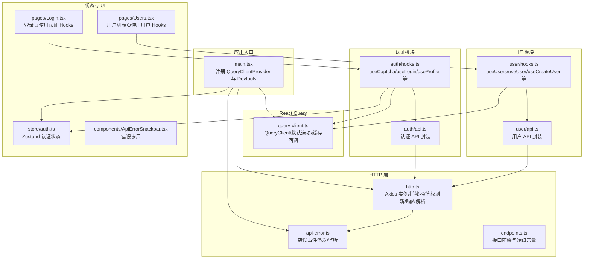
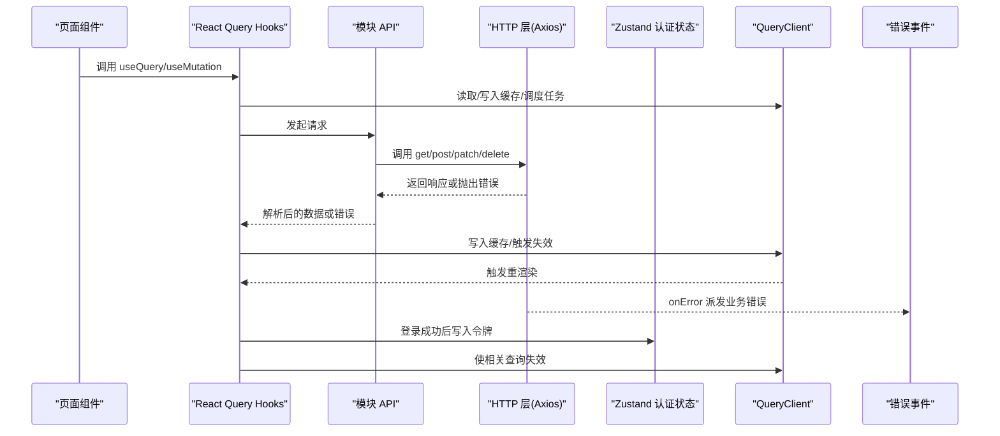
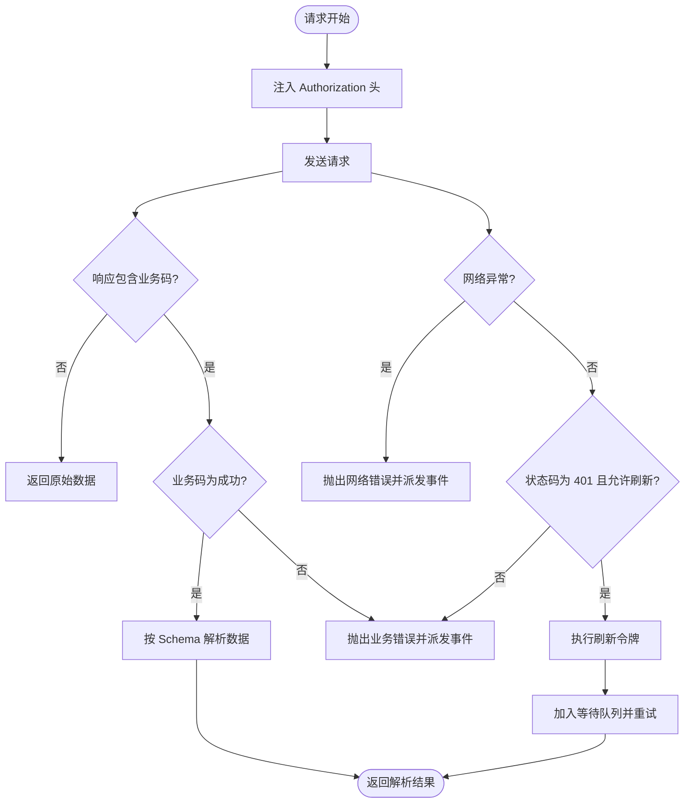
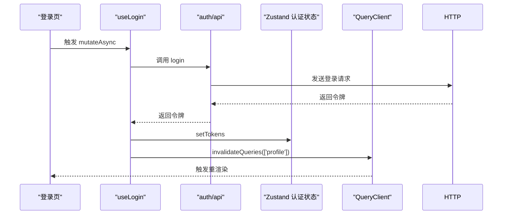
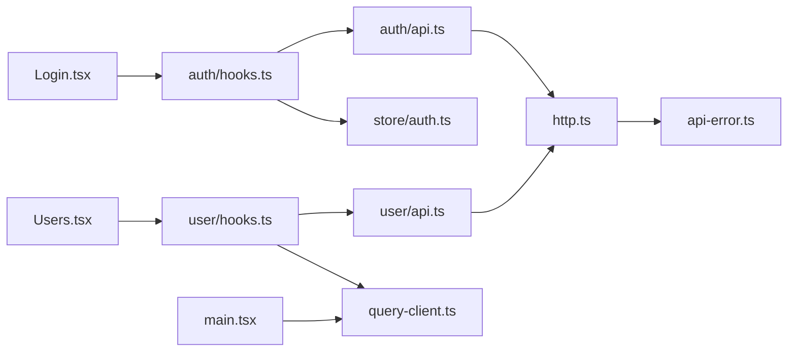

# React Query 集成

<cite>
**本文引用的文件**
- [apps/web/src/main.tsx](file://apps/web/src/main.tsx)
- [apps/web/src/api/core/query-client.ts](file://apps/web/src/api/core/query-client.ts)
- [apps/web/src/api/core/http.ts](file://apps/web/src/api/core/http.ts)
- [apps/web/src/api/core/endpoints.ts](file://apps/web/src/api/core/endpoints.ts)
- [apps/web/src/api/core/api-error.ts](file://apps/web/src/api/core/api-error.ts)
- [apps/web/src/store/auth.ts](file://apps/web/src/store/auth.ts)
- [apps/web/src/api/modules/auth/hooks.ts](file://apps/web/src/api/modules/auth/hooks.ts)
- [apps/web/src/api/modules/auth/api.ts](file://apps/web/src/api/modules/auth/api.ts)
- [apps/web/src/api/modules/user/hooks.ts](file://apps/web/src/api/modules/user/hooks.ts)
- [apps/web/src/api/modules/user/api.ts](file://apps/web/src/api/modules/user/api.ts)
- [apps/web/src/pages/Login.tsx](file://apps/web/src/pages/Login.tsx)
- [apps/web/src/pages/Users.tsx](file://apps/web/src/pages/Users.tsx)
- [apps/web/src/components/ApiErrorSnackbar.tsx](file://apps/web/src/components/ApiErrorSnackbar.tsx)
</cite>

## 目录
1. [简介](#简介)
2. [项目结构](#项目结构)
3. [核心组件](#核心组件)
4. [架构总览](#架构总览)
5. [详细组件分析](#详细组件分析)
6. [依赖关系分析](#依赖关系分析)
7. [性能考虑](#性能考虑)
8. [故障排查指南](#故障排查指南)
9. [结论](#结论)
10. [附录](#附录)

## 简介
本文件系统性梳理前端应用中基于 TanStack React Query 的集成方案，覆盖查询客户端配置、默认查询与变更选项、缓存策略、查询键设计、数据预取与失效、状态管理、乐观更新建议、错误边界处理以及性能优化实践。文档结合仓库现有实现进行说明，并给出可落地的最佳实践与改进建议。

## 项目结构
前端采用模块化组织，围绕“查询客户端 → 核心 HTTP 层 → 模块 API 与 Hooks → 页面组件”的分层设计：
- 查询客户端与 Provider：在入口文件中注入 React Query Provider，并通过统一的 QueryClient 实例提供全局缓存与重试策略。
- 核心 HTTP 层：封装 axios、拦截器、鉴权刷新、响应解析与错误事件派发。
- 模块 API 与 Hooks：按功能域拆分（如认证、用户），每个模块提供 API 方法与对应的 React Query Hooks。
- 页面组件：消费 Hooks，渲染查询状态与错误提示。

图表来源
- [apps/web/src/main.tsx:1-23](file://apps/web/src/main.tsx#L1-L23)
- [apps/web/src/api/core/query-client.ts:1-32](file://apps/web/src/api/core/query-client.ts#L1-L32)
- [apps/web/src/api/core/http.ts:1-236](file://apps/web/src/api/core/http.ts#L1-L236)
- [apps/web/src/api/core/endpoints.ts:1-21](file://apps/web/src/api/core/endpoints.ts#L1-L21)
- [apps/web/src/api/core/api-error.ts:1-45](file://apps/web/src/api/core/api-error.ts#L1-L45)
- [apps/web/src/store/auth.ts:1-64](file://apps/web/src/store/auth.ts#L1-L64)
- [apps/web/src/api/modules/auth/api.ts:1-45](file://apps/web/src/api/modules/auth/api.ts#L1-L45)
- [apps/web/src/api/modules/auth/hooks.ts:1-49](file://apps/web/src/api/modules/auth/hooks.ts#L1-L49)
- [apps/web/src/api/modules/user/api.ts:1-34](file://apps/web/src/api/modules/user/api.ts#L1-L34)
- [apps/web/src/api/modules/user/hooks.ts:1-56](file://apps/web/src/api/modules/user/hooks.ts#L1-L56)
- [apps/web/src/pages/Login.tsx:1-221](file://apps/web/src/pages/Login.tsx#L1-L221)
- [apps/web/src/pages/Users.tsx:1-34](file://apps/web/src/pages/Users.tsx#L1-L34)
- [apps/web/src/components/ApiErrorSnackbar.tsx:1-58](file://apps/web/src/components/ApiErrorSnackbar.tsx#L1-L58)

章节来源
- [apps/web/src/main.tsx:1-23](file://apps/web/src/main.tsx#L1-L23)
- [apps/web/src/api/core/query-client.ts:1-32](file://apps/web/src/api/core/query-client.ts#L1-L32)

## 核心组件
- 查询客户端与 Provider
  - 在入口文件中注册 QueryClientProvider，并挂载 ReactQueryDevtools 以便开发调试。
  - 查询客户端实例集中配置默认选项与缓存回调，确保全局一致的行为。
- 默认查询选项
  - 查询重试：对业务错误且为未授权时禁用重试；否则最多重试两次。
  - 缓存新鲜度：staleTime 设为 30 秒，减少频繁重复请求。
  - 窗口焦点重抓取：关闭自动重抓取，避免不必要的网络开销。
  - 变更重试：默认不重试，降低副作用风险。
- 错误处理
  - QueryCache/MutationCache 的 onError 回调统一派发业务错误事件，交由全局错误提示组件展示。
- HTTP 层与鉴权刷新
  - 请求拦截器设置 Authorization 头。
  - 响应拦截器解析业务码，非成功码抛出业务错误；401 且未标记跳过刷新时触发令牌刷新队列。
  - 支持响应数据 Zod 校验，保证类型安全。
- 端点常量
  - 统一管理 API 基础路径与各模块端点，便于维护与替换。

章节来源
- [apps/web/src/main.tsx:1-23](file://apps/web/src/main.tsx#L1-L23)
- [apps/web/src/api/core/query-client.ts:5-31](file://apps/web/src/api/core/query-client.ts#L5-L31)
- [apps/web/src/api/core/http.ts:94-179](file://apps/web/src/api/core/http.ts#L94-L179)
- [apps/web/src/api/core/endpoints.ts:1-21](file://apps/web/src/api/core/endpoints.ts#L1-L21)
- [apps/web/src/api/core/api-error.ts:16-32](file://apps/web/src/api/core/api-error.ts#L16-L32)

## 架构总览
下图展示了从页面组件到查询客户端的整体调用链路，包括错误事件派发与状态同步。

图表来源
- [apps/web/src/pages/Login.tsx:60-92](file://apps/web/src/pages/Login.tsx#L60-L92)
- [apps/web/src/api/modules/auth/hooks.ts:12-22](file://apps/web/src/api/modules/auth/hooks.ts#L12-L22)
- [apps/web/src/api/modules/auth/api.ts:20-42](file://apps/web/src/api/modules/auth/api.ts#L20-L42)
- [apps/web/src/api/core/http.ts:102-179](file://apps/web/src/api/core/http.ts#L102-L179)
- [apps/web/src/store/auth.ts:36-46](file://apps/web/src/store/auth.ts#L36-L46)
- [apps/web/src/api/core/query-client.ts:6-15](file://apps/web/src/api/core/query-client.ts#L6-L15)
- [apps/web/src/api/core/api-error.ts:16-32](file://apps/web/src/api/core/api-error.ts#L16-L32)

## 详细组件分析

### 查询客户端与默认选项
- 配置要点
  - QueryCache.onError：统一派发错误事件，便于 UI 提示。
  - MutationCache.onError：同上，保证变更失败也能被感知。
  - 默认查询选项：
    - retry：对未授权业务错误禁用重试，其余最多两次。
    - staleTime：30 秒，兼顾实时性与性能。
    - refetchOnWindowFocus：关闭，避免无意义的重抓取。
  - 默认变更选项：retry=0，强调幂等性与谨慎变更。
- 适用场景
  - 适用于大多数列表与详情类查询；对强一致性的写操作，配合失效策略即可满足一致性需求。

章节来源
- [apps/web/src/api/core/query-client.ts:5-31](file://apps/web/src/api/core/query-client.ts#L5-L31)

### HTTP 层与鉴权刷新
- 请求拦截器
  - 从 Zustand 认证状态读取访问令牌，统一注入 Authorization 头。
- 响应拦截器
  - 解析业务码：非成功码抛出业务错误，触发错误事件。
  - 401 且未跳过刷新：进入令牌刷新流程，支持并发请求排队与重试。
  - 响应数据校验：若配置了 Schema，则使用 Zod 进行解析，失败则抛出业务错误。
- 刷新流程
  - 单实例刷新标志位与等待队列，避免重复刷新。
  - 成功后更新认证状态，批量恢复等待队列请求。
- 错误事件
  - emitApiError：去重派发，支持严重级别。
  - listenApiError：订阅错误事件，用于全局提示组件。

图表来源
- [apps/web/src/api/core/http.ts:94-179](file://apps/web/src/api/core/http.ts#L94-L179)
- [apps/web/src/api/core/api-error.ts:16-32](file://apps/web/src/api/core/api-error.ts#L16-L32)

章节来源
- [apps/web/src/api/core/http.ts:94-179](file://apps/web/src/api/core/http.ts#L94-L179)
- [apps/web/src/api/core/api-error.ts:16-32](file://apps/web/src/api/core/api-error.ts#L16-L32)

### 认证模块 Hooks 与状态联动
- 查询
  - useCaptcha：获取验证码图片与标识，键名为固定字符串，便于独立刷新。
  - useProfile：根据访问令牌存在与否启用查询，避免无效请求。
- 变更
  - useLogin：登录成功后写入令牌，并使 profile 相关查询失效，确保下次拉取最新资料。
  - useLogout：登出时清理认证状态并清空整个缓存，防止数据泄露。
- 与状态存储联动
  - 登录成功后通过 Zustand 更新令牌，后续请求拦截器自动生效。

图表来源
- [apps/web/src/api/modules/auth/hooks.ts:12-22](file://apps/web/src/api/modules/auth/hooks.ts#L12-L22)
- [apps/web/src/api/modules/auth/api.ts:28-30](file://apps/web/src/api/modules/auth/api.ts#L28-L30)
- [apps/web/src/store/auth.ts:36-38](file://apps/web/src/store/auth.ts#L36-L38)
- [apps/web/src/pages/Login.tsx:60-92](file://apps/web/src/pages/Login.tsx#L60-L92)

章节来源
- [apps/web/src/api/modules/auth/hooks.ts:1-49](file://apps/web/src/api/modules/auth/hooks.ts#L1-L49)
- [apps/web/src/api/modules/auth/api.ts:1-45](file://apps/web/src/api/modules/auth/api.ts#L1-L45)
- [apps/web/src/store/auth.ts:1-64](file://apps/web/src/store/auth.ts#L1-L64)
- [apps/web/src/pages/Login.tsx:60-92](file://apps/web/src/pages/Login.tsx#L60-L92)

### 用户模块 Hooks 与缓存失效
- 查询
  - useUsers：获取用户列表，键名固定，适合整体失效。
  - useUser：按用户 ID 查询详情，键名包含 ID，支持细粒度失效。
- 变更
  - useCreateUser/useUpdateUser/useDeleteUser：变更成功后使用户列表查询失效，确保列表视图尽快反映最新数据。
- 设计原则
  - 使用层级化键名（如 ['users', id]）提升失效精确度。
  - 对列表型查询采用扁平键名（如 ['users']），便于批量失效。

章节来源
- [apps/web/src/api/modules/user/hooks.ts:1-56](file://apps/web/src/api/modules/user/hooks.ts#L1-L56)
- [apps/web/src/api/modules/user/api.ts:1-34](file://apps/web/src/api/modules/user/api.ts#L1-L34)

### 页面组件中的使用模式
- 登录页
  - 使用 useCaptcha 获取验证码，useLogin 执行登录，根据状态渲染加载与错误提示。
  - 登录成功后导航至首页。
- 用户列表页
  - 使用 useUsers 渲染列表，处理加载与错误状态。
- 全局错误提示
  - ApiErrorSnackbar 订阅错误事件，自动展示并定时消失。

章节来源
- [apps/web/src/pages/Login.tsx:60-221](file://apps/web/src/pages/Login.tsx#L60-L221)
- [apps/web/src/pages/Users.tsx:1-34](file://apps/web/src/pages/Users.tsx#L1-L34)
- [apps/web/src/components/ApiErrorSnackbar.tsx:1-58](file://apps/web/src/components/ApiErrorSnackbar.tsx#L1-L58)

## 依赖关系分析
- 组件耦合
  - 页面组件仅依赖 Hooks，Hooks 依赖模块 API，模块 API 依赖 HTTP 层，形成清晰单向依赖。
  - QueryClient 作为全局单例，被所有 Hooks 间接依赖。
- 外部依赖
  - React Query：查询缓存、重试、失效与状态管理。
  - Axios：HTTP 请求与拦截器。
  - Zod：响应数据校验。
  - Zustand：轻量状态管理，仅保存令牌与用户信息。
- 潜在循环依赖
  - 当前结构为线性依赖，未发现循环导入。

图表来源
- [apps/web/src/pages/Login.tsx:1-221](file://apps/web/src/pages/Login.tsx#L1-L221)
- [apps/web/src/pages/Users.tsx:1-34](file://apps/web/src/pages/Users.tsx#L1-L34)
- [apps/web/src/api/modules/auth/hooks.ts:1-49](file://apps/web/src/api/modules/auth/hooks.ts#L1-L49)
- [apps/web/src/api/modules/user/hooks.ts:1-56](file://apps/web/src/api/modules/user/hooks.ts#L1-L56)
- [apps/web/src/api/modules/auth/api.ts:1-45](file://apps/web/src/api/modules/auth/api.ts#L1-L45)
- [apps/web/src/api/modules/user/api.ts:1-34](file://apps/web/src/api/modules/user/api.ts#L1-L34)
- [apps/web/src/api/core/http.ts:1-236](file://apps/web/src/api/core/http.ts#L1-L236)
- [apps/web/src/api/core/api-error.ts:1-45](file://apps/web/src/api/core/api-error.ts#L1-L45)
- [apps/web/src/store/auth.ts:1-64](file://apps/web/src/store/auth.ts#L1-L64)
- [apps/web/src/api/core/query-client.ts:1-32](file://apps/web/src/api/core/query-client.ts#L1-L32)
- [apps/web/src/main.tsx:1-23](file://apps/web/src/main.tsx#L1-L23)

章节来源
- [apps/web/src/main.tsx:1-23](file://apps/web/src/main.tsx#L1-L23)
- [apps/web/src/api/core/query-client.ts:1-32](file://apps/web/src/api/core/query-client.ts#L1-L32)
- [apps/web/src/api/core/http.ts:1-236](file://apps/web/src/api/core/http.ts#L1-L236)

## 性能考虑
- 缓存策略
  - 合理设置 staleTime，避免频繁请求；对高变化数据可缩短或关闭。
  - 对只读列表使用较长 staleTime，对详情页可按需缩短。
- 重试策略
  - 默认仅有限次重试，避免雪崩效应；对网络瞬断友好。
- 窗口焦点与并发
  - 关闭 refetchOnWindowFocus，减少不必要流量；并发请求通过等待队列处理，避免重复刷新。
- 数据预取
  - 在路由进入前使用 prefetchQuery 或 queryClient.setQueryData 预填充常用列表，提升首屏体验。
- 选择性失效
  - 使用精确键名（如 ['users', id]）进行局部失效，避免整表重建。
- 乐观更新（建议）
  - 对写操作可在 mutationFn 前先 setQueryData 乐观更新 UI，失败时 rollback，显著改善交互流畅度。
- 开发工具
  - 启用 ReactQueryDevtools，定位缓存命中率与失效时机。

## 故障排查指南
- 常见问题
  - 401 未授权：确认是否已正确注入 Authorization 头；检查刷新流程是否被阻断。
  - 业务错误未显示：确认 QueryCache.onError 是否派发事件；检查 ApiErrorSnackbar 是否正常监听。
  - 列表未更新：确认变更后是否调用了 invalidateQueries；检查键名是否匹配。
- 排查步骤
  - 查看 Network 面板确认请求头与响应码。
  - 打开 Devtools 观察 QueryClient 缓存状态与失效日志。
  - 在组件中打印 queryKey 与 enabled 条件，验证查询是否按预期启用。
- 监控与告警
  - 通过 emitApiError 的严重级别区分提示样式，便于快速识别问题类型。

章节来源
- [apps/web/src/api/core/query-client.ts:6-15](file://apps/web/src/api/core/query-client.ts#L6-L15)
- [apps/web/src/api/core/api-error.ts:16-32](file://apps/web/src/api/core/api-error.ts#L16-L32)
- [apps/web/src/components/ApiErrorSnackbar.tsx:1-58](file://apps/web/src/components/ApiErrorSnackbar.tsx#L1-L58)

## 结论
本项目以统一的 QueryClient 为核心，结合严格的 HTTP 层与状态管理，实现了稳定可靠的前端数据流。通过合理的键设计、失效策略与错误事件派发，既保证了用户体验，也提升了系统的可观测性与可维护性。建议在后续迭代中引入乐观更新与更精细的预取策略，进一步优化交互与性能。

## 附录
- 查询键设计清单
  - 列表：['users']
  - 详情：['users', id]
  - 固定资源：['captcha'], ['profile']
- 默认选项速览
  - 查询：staleTime=30s，refetchOnWindowFocus=false，retry=2 次（除未授权业务错误）
  - 变更：retry=0
- 错误事件
  - 统一通过 emitApiError 派发，ApiErrorSnackbar 自动监听并展示。