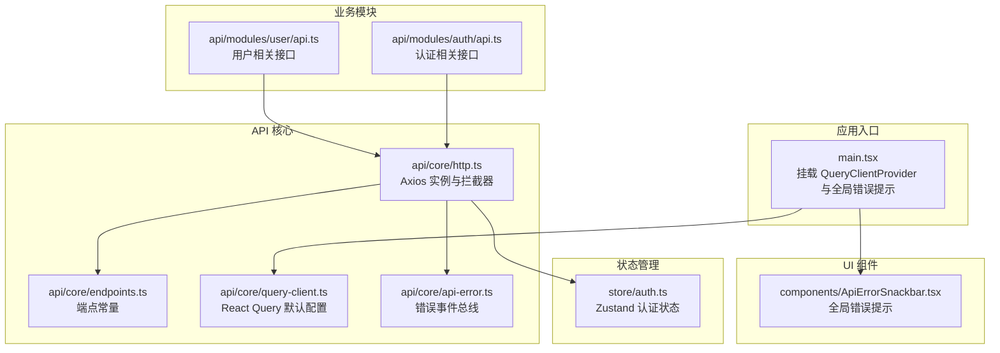
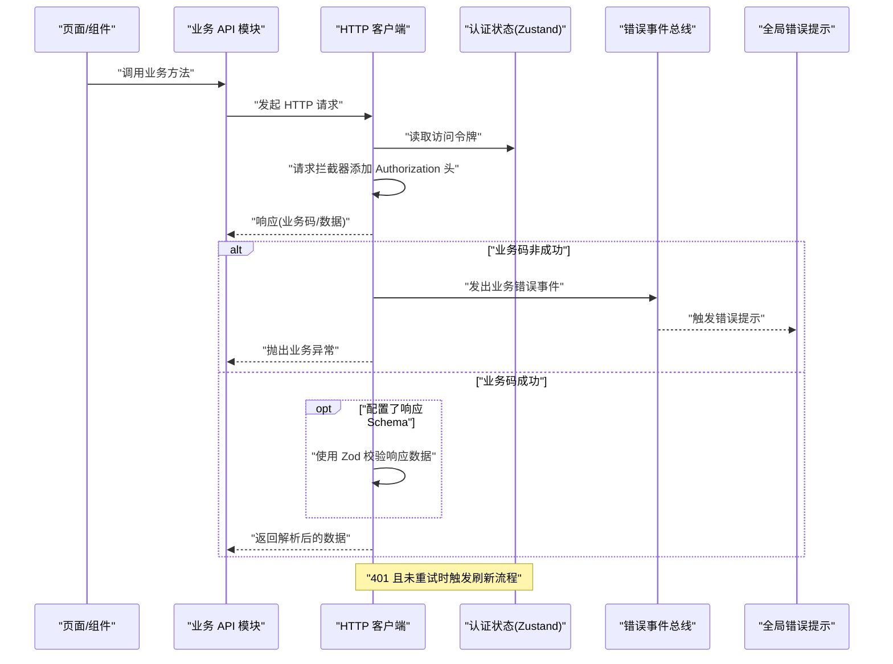
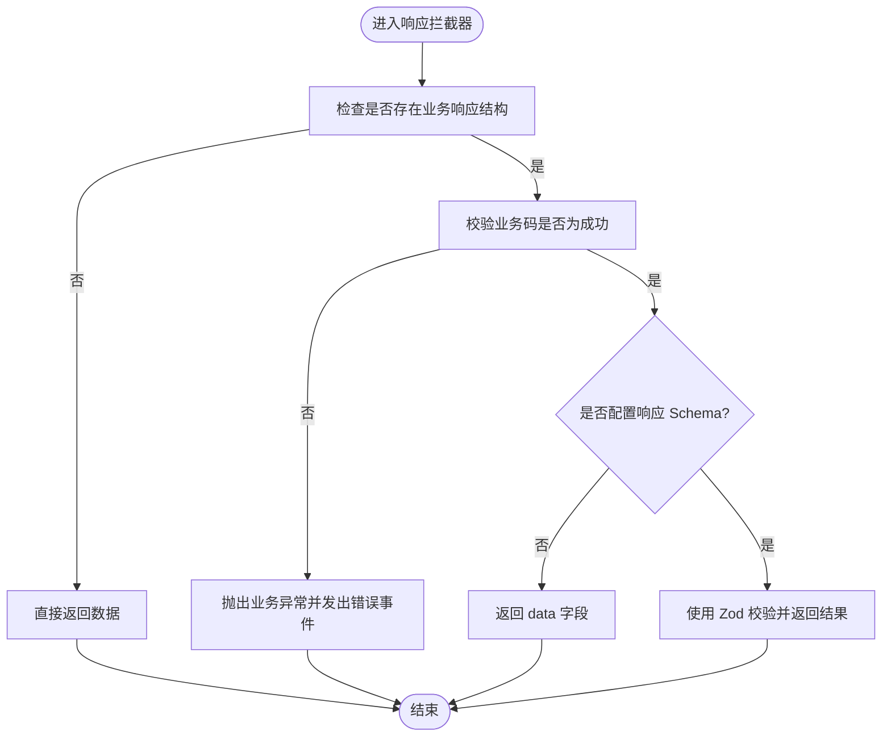
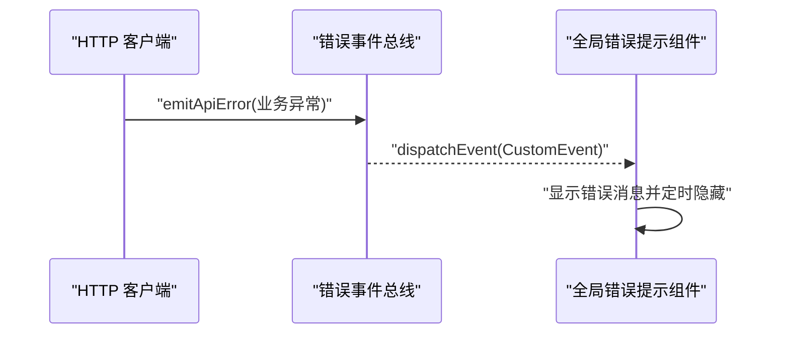
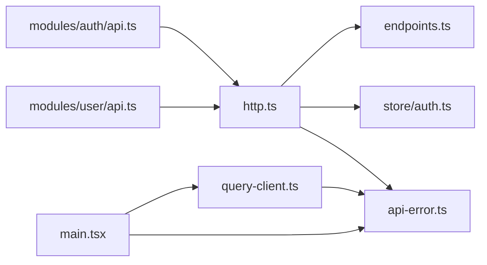

# 核心 API 客户端

<cite>
**本文引用的文件**
- [apps/web/src/api/core/http.ts](file://apps/web/src/api/core/http.ts)
- [apps/web/src/api/core/endpoints.ts](file://apps/web/src/api/core/endpoints.ts)
- [apps/web/src/api/core/query-client.ts](file://apps/web/src/api/core/query-client.ts)
- [apps/web/src/api/core/api-error.ts](file://apps/web/src/api/core/api-error.ts)
- [apps/web/src/store/auth.ts](file://apps/web/src/store/auth.ts)
- [apps/web/src/api/modules/auth/api.ts](file://apps/web/src/api/modules/auth/api.ts)
- [apps/web/src/api/modules/user/api.ts](file://apps/web/src/api/modules/user/api.ts)
- [apps/web/src/components/ApiErrorSnackbar.tsx](file://apps/web/src/components/ApiErrorSnackbar.tsx)
- [apps/web/src/main.tsx](file://apps/web/src/main.tsx)
- [packages/shared/src/errors/index.ts](file://packages/shared/src/errors/index.ts)
- [packages/shared/src/types/api.types.ts](file://packages/shared/src/types/api.types.ts)
</cite>

## 目录
1. [简介](#简介)
2. [项目结构](#项目结构)
3. [核心组件](#核心组件)
4. [架构总览](#架构总览)
5. [详细组件分析](#详细组件分析)
6. [依赖关系分析](#依赖关系分析)
7. [性能考量](#性能考量)
8. [故障排查指南](#故障排查指南)
9. [结论](#结论)
10. [附录](#附录)

## 简介
本文件系统性梳理前端 Web 应用中的核心 API 客户端实现，围绕基于 axios 的 HTTP 客户端配置、请求/响应拦截器、认证令牌自动注入、错误处理与重试策略展开，并结合端点定义、基础 URL、请求头、超时配置等进行深入解析。同时给出客户端初始化示例与最佳实践建议，帮助开发者快速理解并正确使用该客户端。

## 项目结构
Web 前端通过模块化方式组织 API 层：核心 HTTP 客户端位于 core 目录，各业务模块的 API 方法封装在 modules 下，状态管理采用 Zustand，错误事件通过自定义事件总线广播，UI 层通过 React Query 进行缓存与重试控制。

**图表来源**
- [apps/web/src/main.tsx:12-22](file://apps/web/src/main.tsx#L12-L22)
- [apps/web/src/api/core/http.ts:66-80](file://apps/web/src/api/core/http.ts#L66-L80)
- [apps/web/src/api/core/endpoints.ts:1-21](file://apps/web/src/api/core/endpoints.ts#L1-L21)
- [apps/web/src/api/core/query-client.ts:5-31](file://apps/web/src/api/core/query-client.ts#L5-L31)
- [apps/web/src/api/core/api-error.ts:16-32](file://apps/web/src/api/core/api-error.ts#L16-L32)
- [apps/web/src/store/auth.ts:30-63](file://apps/web/src/store/auth.ts#L30-L63)
- [apps/web/src/api/modules/auth/api.ts:17-44](file://apps/web/src/api/modules/auth/api.ts#L17-L44)
- [apps/web/src/api/modules/user/api.ts:10-33](file://apps/web/src/api/modules/user/api.ts#L10-L33)
- [apps/web/src/components/ApiErrorSnackbar.tsx:7-57](file://apps/web/src/components/ApiErrorSnackbar.tsx#L7-L57)

**章节来源**
- [apps/web/src/main.tsx:12-22](file://apps/web/src/main.tsx#L12-L22)
- [apps/web/src/api/core/http.ts:66-80](file://apps/web/src/api/core/http.ts#L66-L80)
- [apps/web/src/api/core/endpoints.ts:1-21](file://apps/web/src/api/core/endpoints.ts#L1-L21)
- [apps/web/src/api/core/query-client.ts:5-31](file://apps/web/src/api/core/query-client.ts#L5-L31)
- [apps/web/src/api/core/api-error.ts:16-32](file://apps/web/src/api/core/api-error.ts#L16-L32)
- [apps/web/src/store/auth.ts:30-63](file://apps/web/src/store/auth.ts#L30-L63)
- [apps/web/src/api/modules/auth/api.ts:17-44](file://apps/web/src/api/modules/auth/api.ts#L17-L44)
- [apps/web/src/api/modules/user/api.ts:10-33](file://apps/web/src/api/modules/user/api.ts#L10-L33)
- [apps/web/src/components/ApiErrorSnackbar.tsx:7-57](file://apps/web/src/components/ApiErrorSnackbar.tsx#L7-L57)

## 核心组件
- Axios 实例与拦截器
  - 创建两个 Axios 实例：主实例用于业务请求，独立的刷新实例用于刷新令牌请求，避免循环依赖与重复拦截。
  - 请求拦截器：从认证状态中读取访问令牌，自动为请求头添加 Bearer 令牌。
  - 响应拦截器：统一解析后端返回的业务响应结构，非业务响应直接透传；当业务码不等于成功时抛出业务异常；支持可选的响应体 Zod 校验；对 401 且未重试过的请求触发令牌刷新流程。
- 端点与基础 URL
  - 基础 URL 来源于环境变量，端点常量集中管理，便于维护与复用。
- 错误处理与事件总线
  - 将错误转换为业务异常并发出全局事件，UI 组件监听事件展示错误提示。
- 查询客户端与重试策略
  - 使用 React Query 的 QueryClient，默认开启查询重试（最多两次），对未授权错误禁用重试；Mutation 默认不重试。
- 认证状态管理
  - 使用 Zustand 存储访问令牌、刷新令牌与用户信息，持久化到本地存储，支持恢复状态并自动标记登录态。

**章节来源**
- [apps/web/src/api/core/http.ts:66-80](file://apps/web/src/api/core/http.ts#L66-L80)
- [apps/web/src/api/core/http.ts:94-100](file://apps/web/src/api/core/http.ts#L94-L100)
- [apps/web/src/api/core/http.ts:102-179](file://apps/web/src/api/core/http.ts#L102-L179)
- [apps/web/src/api/core/endpoints.ts:1-21](file://apps/web/src/api/core/endpoints.ts#L1-L21)
- [apps/web/src/api/core/api-error.ts:16-32](file://apps/web/src/api/core/api-error.ts#L16-L32)
- [apps/web/src/api/core/query-client.ts:5-31](file://apps/web/src/api/core/query-client.ts#L5-L31)
- [apps/web/src/store/auth.ts:30-63](file://apps/web/src/store/auth.ts#L30-L63)

## 架构总览
下图展示了从页面调用到后端响应的完整链路，包括拦截器、认证刷新、错误事件与 UI 提示。

**图表来源**
- [apps/web/src/api/core/http.ts:94-100](file://apps/web/src/api/core/http.ts#L94-L100)
- [apps/web/src/api/core/http.ts:102-179](file://apps/web/src/api/core/http.ts#L102-L179)
- [apps/web/src/api/core/api-error.ts:16-32](file://apps/web/src/api/core/api-error.ts#L16-L32)
- [apps/web/src/store/auth.ts:30-63](file://apps/web/src/store/auth.ts#L30-L63)
- [apps/web/src/components/ApiErrorSnackbar.tsx:7-57](file://apps/web/src/components/ApiErrorSnackbar.tsx#L7-L57)

## 详细组件分析

### HTTP 客户端与拦截器
- 实例配置
  - 基础 URL：来自端点常量。
  - 超时时间：15 秒。
  - 默认请求头：JSON 内容类型。
- 请求拦截器
  - 自动从认证状态中读取访问令牌并在请求头中添加 Bearer 前缀。
- 响应拦截器
  - 解析统一业务响应结构，非业务响应直接透传。
  - 当业务码不为成功时，抛出业务异常并发出全局错误事件。
  - 若配置了响应 Schema，则使用 Zod 对响应数据进行校验。
  - 对 401 且未重试过的请求，执行令牌刷新流程：
    - 若正在刷新中，将后续请求加入待处理队列，等待刷新完成后再重试。
    - 刷新成功后更新认证状态中的令牌，逐个放行等待队列中的请求。
    - 刷新失败则清空认证状态并发出错误事件。
- 辅助方法
  - 提供 get/post/patch/del 包装函数，支持可选的响应 Schema 参数，简化调用方写法。

**图表来源**
- [apps/web/src/api/core/http.ts:102-120](file://apps/web/src/api/core/http.ts#L102-L120)
- [apps/web/src/api/core/http.ts:47-58](file://apps/web/src/api/core/http.ts#L47-L58)

**章节来源**
- [apps/web/src/api/core/http.ts:66-80](file://apps/web/src/api/core/http.ts#L66-L80)
- [apps/web/src/api/core/http.ts:94-100](file://apps/web/src/api/core/http.ts#L94-L100)
- [apps/web/src/api/core/http.ts:102-179](file://apps/web/src/api/core/http.ts#L102-L179)
- [apps/web/src/api/core/http.ts:181-232](file://apps/web/src/api/core/http.ts#L181-L232)

### 端点定义与基础 URL
- 基础 URL 来源于环境变量，若未配置则回退到相对路径前缀。
- 端点常量集中定义认证、用户、健康、菜单、角色、字典等模块的路由路径，便于统一管理与替换。

**章节来源**
- [apps/web/src/api/core/endpoints.ts:1-21](file://apps/web/src/api/core/endpoints.ts#L1-L21)

### 错误处理与事件总线
- 错误事件总线
  - 将错误对象标准化为事件细节，去重发送，支持严重级别。
  - 提供监听器注册与注销方法，便于 UI 组件订阅。
- 全局错误提示
  - 页面入口挂载全局错误提示组件，监听事件并在窗口顶部显示错误消息，自动隐藏。

**图表来源**
- [apps/web/src/api/core/api-error.ts:16-32](file://apps/web/src/api/core/api-error.ts#L16-L32)
- [apps/web/src/components/ApiErrorSnackbar.tsx:7-57](file://apps/web/src/components/ApiErrorSnackbar.tsx#L7-L57)

**章节来源**
- [apps/web/src/api/core/api-error.ts:16-32](file://apps/web/src/api/core/api-error.ts#L16-L32)
- [apps/web/src/components/ApiErrorSnackbar.tsx:7-57](file://apps/web/src/components/ApiErrorSnackbar.tsx#L7-L57)

### 认证状态管理
- 状态字段：访问令牌、刷新令牌、用户信息、登录态标识。
- 动作：设置令牌、设置用户、清理认证。
- 持久化：仅持久化令牌字段，恢复时根据令牌自动标记登录态。

**章节来源**
- [apps/web/src/store/auth.ts:30-63](file://apps/web/src/store/auth.ts#L30-L63)

### 查询客户端与重试策略
- QueryClient 默认配置：
  - 查询重试：最多两次；若错误为未授权业务错误则禁止重试。
  - 缓存策略：静默时间、窗口焦点重取等。
  - Mutation 默认不重试。
- 与业务错误的联动：当拦截器抛出业务错误时，QueryCache/MutationCache 会接收并触发全局错误事件，交由 UI 层处理。

**章节来源**
- [apps/web/src/api/core/query-client.ts:5-31](file://apps/web/src/api/core/query-client.ts#L5-L31)

### 业务模块 API 封装
- 认证模块：提供验证码、注册、登录、刷新、登出、个人资料等方法，均使用统一的端点常量与 HTTP 客户端。
- 用户模块：提供增删改查等方法，统一使用 Schema 校验与响应解析。

**章节来源**
- [apps/web/src/api/modules/auth/api.ts:17-44](file://apps/web/src/api/modules/auth/api.ts#L17-L44)
- [apps/web/src/api/modules/user/api.ts:10-33](file://apps/web/src/api/modules/user/api.ts#L10-L33)

## 依赖关系分析
- 组件耦合
  - HTTP 客户端依赖认证状态与错误事件总线，但不直接依赖具体业务模块，保持高内聚低耦合。
  - 业务模块仅依赖端点常量与 HTTP 客户端，职责清晰。
- 外部依赖
  - axios：HTTP 客户端核心。
  - zod：响应数据校验。
  - @tanstack/react-query：缓存与重试。
  - zustand：轻量状态管理。
- 可能的循环依赖
  - 通过分离“主实例”和“刷新实例”，避免刷新请求被主实例拦截导致的循环。

**图表来源**
- [apps/web/src/api/core/http.ts:66-80](file://apps/web/src/api/core/http.ts#L66-L80)
- [apps/web/src/store/auth.ts:30-63](file://apps/web/src/store/auth.ts#L30-L63)
- [apps/web/src/api/core/api-error.ts:16-32](file://apps/web/src/api/core/api-error.ts#L16-L32)
- [apps/web/src/api/core/endpoints.ts:1-21](file://apps/web/src/api/core/endpoints.ts#L1-L21)
- [apps/web/src/api/modules/auth/api.ts:17-44](file://apps/web/src/api/modules/auth/api.ts#L17-L44)
- [apps/web/src/api/modules/user/api.ts:10-33](file://apps/web/src/api/modules/user/api.ts#L10-L33)
- [apps/web/src/api/core/query-client.ts:5-31](file://apps/web/src/api/core/query-client.ts#L5-L31)
- [apps/web/src/main.tsx:12-22](file://apps/web/src/main.tsx#L12-L22)

**章节来源**
- [apps/web/src/api/core/http.ts:66-80](file://apps/web/src/api/core/http.ts#L66-L80)
- [apps/web/src/api/core/endpoints.ts:1-21](file://apps/web/src/api/core/endpoints.ts#L1-L21)
- [apps/web/src/api/core/query-client.ts:5-31](file://apps/web/src/api/core/query-client.ts#L5-L31)
- [apps/web/src/api/core/api-error.ts:16-32](file://apps/web/src/api/core/api-error.ts#L16-L32)
- [apps/web/src/store/auth.ts:30-63](file://apps/web/src/store/auth.ts#L30-L63)
- [apps/web/src/api/modules/auth/api.ts:17-44](file://apps/web/src/api/modules/auth/api.ts#L17-L44)
- [apps/web/src/api/modules/user/api.ts:10-33](file://apps/web/src/api/modules/user/api.ts#L10-L33)
- [apps/web/src/main.tsx:12-22](file://apps/web/src/main.tsx#L12-L22)

## 性能考量
- 超时与重试
  - 单请求超时 15 秒，避免长时间阻塞。
  - 查询默认最多重试两次，未授权错误禁用重试，减少无效请求。
- 缓存策略
  - 设置合理的静默时间，降低重复请求频率。
- 数据校验
  - 在响应层使用 Zod 校验，提前发现数据结构问题，减少运行时错误。
- 令牌刷新
  - 使用队列避免并发刷新导致的重复请求与状态竞争。

[本节为通用指导，无需列出章节来源]

## 故障排查指南
- 401 未授权
  - 检查认证状态中是否存在有效访问令牌；确认刷新流程是否正常执行。
  - 若刷新失败，确认刷新令牌是否可用，后端是否返回成功响应。
- 网络异常
  - 检查基础 URL 与代理配置；确认请求超时时间是否合理。
  - 观察错误事件总线是否发出“网络异常”提示。
- 响应数据校验失败
  - 检查业务模块使用的 Schema 是否与后端返回一致；关注 details 字段定位问题。
- 重复错误提示
  - 错误事件总线具备去重逻辑，若仍出现重复提示，检查事件派发与监听是否正确。

**章节来源**
- [apps/web/src/api/core/http.ts:121-179](file://apps/web/src/api/core/http.ts#L121-L179)
- [apps/web/src/api/core/api-error.ts:16-32](file://apps/web/src/api/core/api-error.ts#L16-L32)
- [apps/web/src/store/auth.ts:30-63](file://apps/web/src/store/auth.ts#L30-L63)

## 结论
该核心 API 客户端以 axios 为基础，结合拦截器、Zod 校验、错误事件总线与 React Query，构建了统一、可扩展且健壮的前端 HTTP 交互层。通过集中式端点管理、自动认证注入与智能重试策略，显著提升了开发效率与用户体验。建议在新增模块时遵循现有模式，统一使用 Schema 校验与错误事件处理，确保一致性与可维护性。

[本节为总结性内容，无需列出章节来源]

## 附录

### 客户端初始化示例
- 在应用入口挂载 QueryClientProvider 并引入全局错误提示组件，确保错误事件总线与查询缓存生效。
- 业务模块通过导入端点常量与 HTTP 客户端，按需封装 API 方法。

**章节来源**
- [apps/web/src/main.tsx:12-22](file://apps/web/src/main.tsx#L12-L22)
- [apps/web/src/api/modules/auth/api.ts:17-44](file://apps/web/src/api/modules/auth/api.ts#L17-L44)
- [apps/web/src/api/modules/user/api.ts:10-33](file://apps/web/src/api/modules/user/api.ts#L10-L33)

### 最佳实践
- 统一使用 Schema 校验响应数据，保证类型安全与契约清晰。
- 对需要鉴权的请求避免手动设置 Authorization，依赖拦截器自动注入。
- 对于幂等请求启用查询缓存与重试，对于写操作谨慎使用重试。
- 将错误处理与 UI 提示解耦，通过事件总线驱动 UI 更新。
- 严格区分业务错误与网络错误，针对不同错误采取差异化处理策略。

[本节为通用指导，无需列出章节来源]