# 健康监控模块 API

<cite>
**本文档引用的文件**
- [health.controller.ts](file://apps/nestjs-server/src/modules/health/health.controller.ts)
- [health.module.ts](file://apps/nestjs-server/src/modules/health/health.module.ts)
- [redis.service.ts](file://apps/nestjs-server/src/modules/redis/redis.service.ts)
- [redis.module.ts](file://apps/nestjs-server/src/modules/redis/redis.module.ts)
- [prisma.service.ts](file://apps/nestjs-server/src/prisma/prisma.service.ts)
- [api.ts](file://apps/web/src/api/modules/health/api.ts)
- [hooks.ts](file://apps/web/src/api/modules/health/hooks.ts)
- [endpoints.ts](file://apps/web/src/api/core/endpoints.ts)
- [Dashboard.tsx](file://apps/web/src/pages/Dashboard.tsx)
- [app.module.ts](file://apps/nestjs-server/src/app.module.ts)
- [typed-config.service.ts](file://apps/nestjs-server/src/config/typed-config.service.ts)
</cite>

## 目录

1. [简介](#简介)
2. [项目结构](#项目结构)
3. [核心组件](#核心组件)
4. [架构概览](#架构概览)
5. [详细组件分析](#详细组件分析)
6. [API 接口规范](#api-接口规范)
7. [监控指标与状态报告](#监控指标与状态报告)
8. [前端集成与使用](#前端集成与使用)
9. [性能优化与缓存策略](#性能优化与缓存策略)
10. [故障排除指南](#故障排除指南)
11. [结论](#结论)

## 简介

健康监控模块是 Nebula 系统中的关键基础设施组件，负责提供系统健康检查、性能监控和状态查询功能。该模块通过检查核心依赖服务（数据库和缓存）的连接状态，为系统提供实时的健康状态报告，并支持前端仪表板的可视化展示。

本模块采用微服务架构设计，结合 NestJS 框架的强大功能，实现了高可用、可扩展的健康监控解决方案。系统通过异步并发检查多个服务依赖，确保监控结果的准确性和实时性。

## 项目结构

健康监控模块在项目中的组织结构如下：

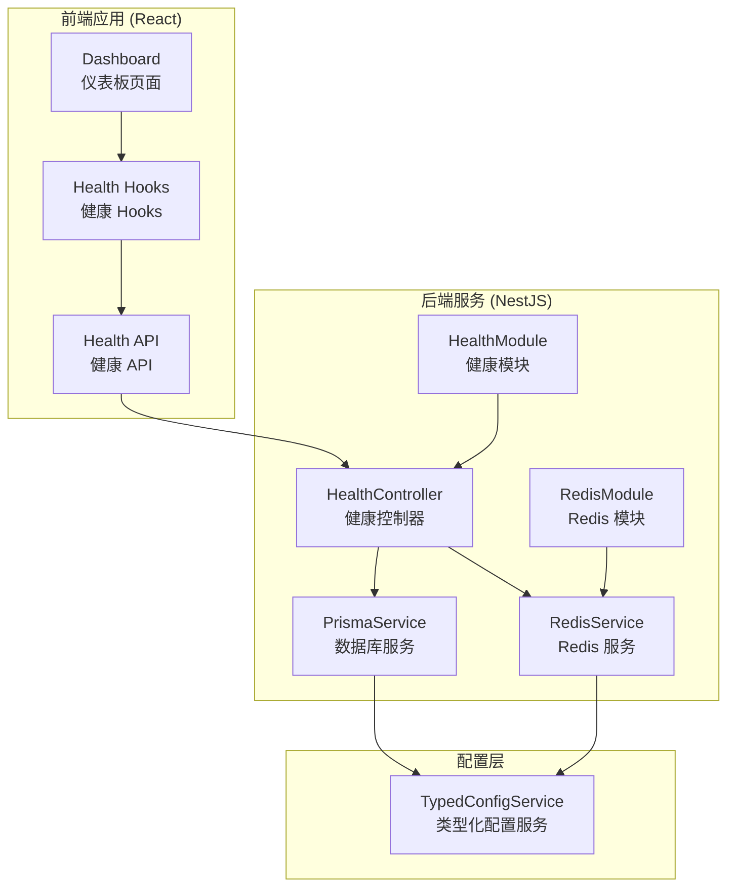

**图表来源**

- [health.controller.ts:1-99](file://apps/nestjs-server/src/modules/health/health.controller.ts#L1-L99)
- [health.module.ts:1-10](file://apps/nestjs-server/src/modules/health/health.module.ts#L1-L10)
- [redis.service.ts:1-149](file://apps/nestjs-server/src/modules/redis/redis.service.ts#L1-L149)
- [prisma.service.ts:1-36](file://apps/nestjs-server/src/prisma/prisma.service.ts#L1-L36)

**章节来源**

- [health.controller.ts:1-99](file://apps/nestjs-server/src/modules/health/health.controller.ts#L1-L99)
- [health.module.ts:1-10](file://apps/nestjs-server/src/modules/health/health.module.ts#L1-L10)
- [redis.service.ts:1-149](file://apps/nestjs-server/src/modules/redis/redis.service.ts#L1-L149)
- [prisma.service.ts:1-36](file://apps/nestjs-server/src/prisma/prisma.service.ts#L1-L36)

## 核心组件

健康监控模块由以下核心组件构成：

### 1. 健康控制器 (HealthController)

负责处理所有健康检查相关的 HTTP 请求，提供系统状态查询和响应。

### 2. Redis 服务 (RedisService)

管理 Redis 连接池，提供连接状态检查和性能监控功能。

### 3. 数据库服务 (PrismaService)

封装数据库连接管理，提供数据库健康状态检查。

### 4. 健康模块 (HealthModule)

模块化组织健康检查相关的控制器和服务。

### 5. 前端健康 API (Health API)

提供类型安全的前端健康检查接口和 React Query 集成。

**章节来源**

- [health.controller.ts:10-16](file://apps/nestjs-server/src/modules/health/health.controller.ts#L10-L16)
- [redis.service.ts:18-25](file://apps/nestjs-server/src/modules/redis/redis.service.ts#L18-L25)
- [prisma.service.ts:6-7](file://apps/nestjs-server/src/prisma/prisma.service.ts#L6-L7)
- [health.module.ts:5-8](file://apps/nestjs-server/src/modules/health/health.module.ts#L5-L8)

## 架构概览

健康监控模块采用分层架构设计，确保各组件职责明确、耦合度低：

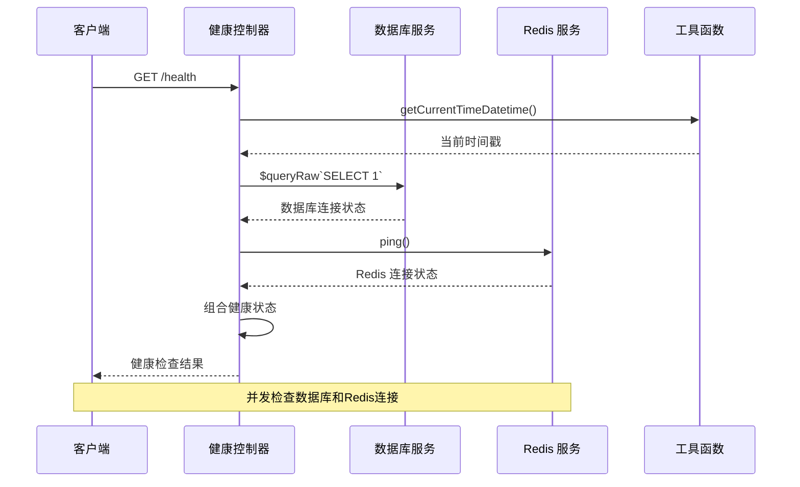

**图表来源**

- [health.controller.ts:58-76](file://apps/nestjs-server/src/modules/health/health.controller.ts#L58-L76)

系统架构的关键特点：

- **异步并发检查**：使用 Promise.all 并发检查数据库和 Redis 连接状态
- **状态聚合**：根据所有依赖服务的状态计算最终健康状态
- **类型安全**：前后端都使用 TypeScript 和 Zod 验证数据结构
- **模块化设计**：清晰的模块边界和依赖注入机制

## 详细组件分析

### 健康控制器实现

健康控制器是整个模块的核心，负责处理所有健康检查请求：

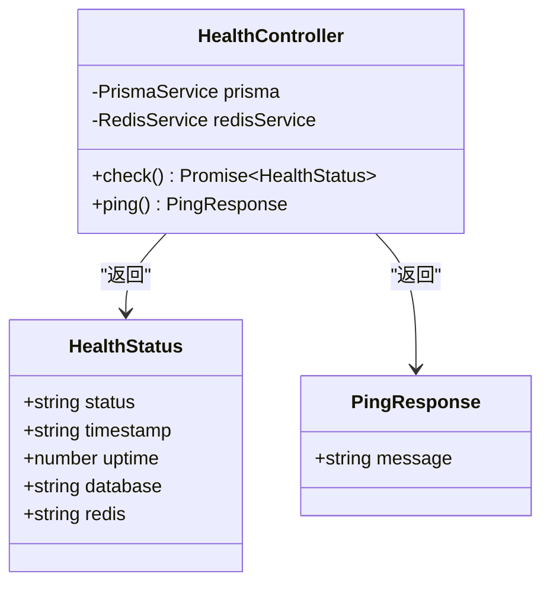

**图表来源**

- [health.controller.ts:12-16](file://apps/nestjs-server/src/modules/health/health.controller.ts#L12-L16)
- [health.controller.ts:69-75](file://apps/nestjs-server/src/modules/health/health.controller.ts#L69-L75)

#### 健康检查算法流程

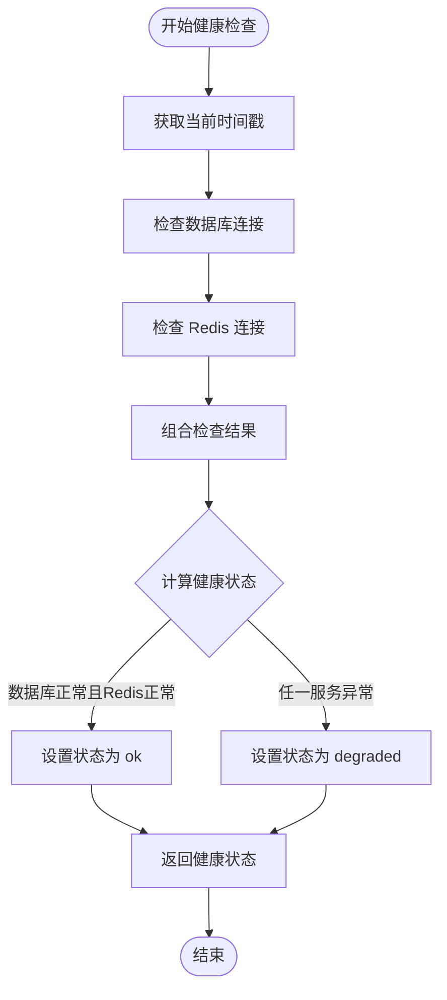

**图表来源**

- [health.controller.ts:58-76](file://apps/nestjs-server/src/modules/health/health.controller.ts#L58-L76)

**章节来源**

- [health.controller.ts:58-76](file://apps/nestjs-server/src/modules/health/health.controller.ts#L58-L76)

### Redis 服务实现

Redis 服务提供了强大的连接管理和状态监控功能：

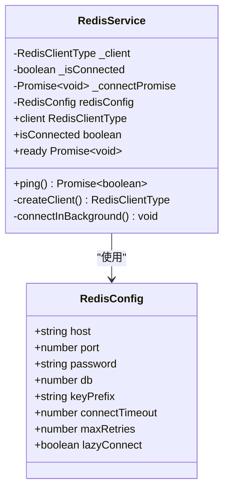

**图表来源**

- [redis.service.ts:19-40](file://apps/nestjs-server/src/modules/redis/redis.service.ts#L19-L40)
- [redis.service.ts:84-92](file://apps/nestjs-server/src/modules/redis/redis.service.ts#L84-L92)

#### Redis 连接策略

Redis 服务采用了智能的连接管理策略：

1. **懒加载模式**：客户端在首次访问时才创建
2. **非阻塞启动**：连接过程在后台进行，不影响应用初始化
3. **重试机制**：支持最大重试次数限制，避免无限等待
4. **超时控制**：通过连接超时参数控制单次连接尝试的时间

**章节来源**

- [redis.service.ts:83-92](file://apps/nestjs-server/src/modules/redis/redis.service.ts#L83-L92)
- [redis.service.ts:132-147](file://apps/nestjs-server/src/modules/redis/redis.service.ts#L132-L147)

### 数据库服务实现

Prisma 服务提供了数据库连接的统一管理：

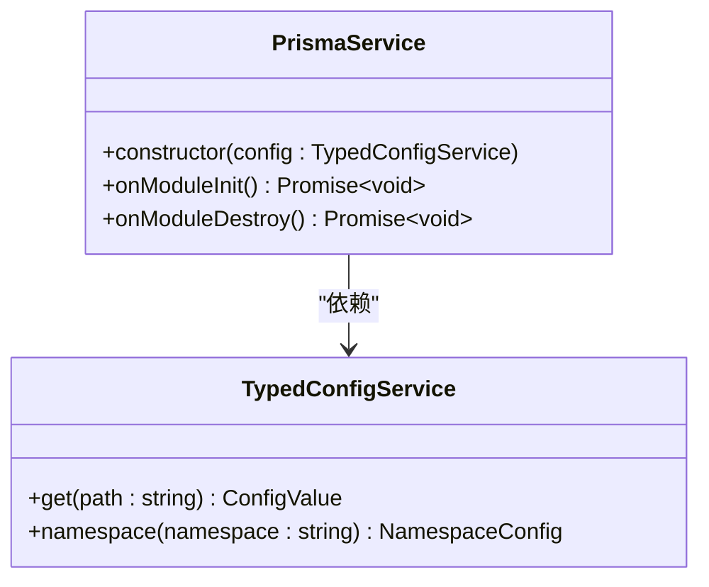

**图表来源**

- [prisma.service.ts:10-26](file://apps/nestjs-server/src/prisma/prisma.service.ts#L10-L26)

**章节来源**

- [prisma.service.ts:10-26](file://apps/nestjs-server/src/prisma/prisma.service.ts#L10-L26)

## API 接口规范

### 健康检查接口

#### 基础健康检查

**HTTP 方法**: GET  
**路径**: `/health`  
**认证**: 公开访问  
**节流**: 已禁用

**响应结构**:

```typescript
interface HealthStatus {
  status: 'ok' | 'degraded';
  timestamp: string;
  uptime: number;
  database: 'connected' | 'disconnected';
  redis: 'connected' | 'disconnected';
}
```

**响应示例**:

```json
{
  "status": "ok",
  "timestamp": "2026-06-07 12:00:00",
  "uptime": 3600,
  "database": "connected",
  "redis": "connected"
}
```

#### Ping 检查

**HTTP 方法**: GET  
**路径**: `/health/ping`  
**认证**: 公开访问  
**节流**: 已禁用

**响应结构**:

```typescript
interface PingResponse {
  message: string;
}
```

**响应示例**:

```json
{
  "message": "pong"
}
```

**章节来源**

- [health.controller.ts:18-76](file://apps/nestjs-server/src/modules/health/health.controller.ts#L18-L76)
- [health.controller.ts:78-97](file://apps/nestjs-server/src/modules/health/health.controller.ts#L78-L97)

### 前端 API 规范

#### 类型定义

```typescript
// 健康状态类型
export type HealthStatus = {
  status: 'ok' | 'degraded';
  timestamp: string;
  uptime: number;
  database: 'connected' | 'disconnected';
};

// Ping 响应类型
export type PingResponse = {
  message: string;
};
```

#### API 函数

```typescript
// 健康检查
export function checkHealth(): Promise<HealthStatus>;

// Ping 检查
export function ping(): Promise<PingResponse>;
```

**章节来源**

- [api.ts:5-25](file://apps/web/src/api/modules/health/api.ts#L5-L25)

## 监控指标与状态报告

### 健康状态指标

健康监控模块提供以下关键指标：

| 指标名称  | 数据类型 | 描述           | 取值范围                    |
| --------- | -------- | -------------- | --------------------------- |
| status    | string   | 服务整体状态   | 'ok', 'degraded'            |
| timestamp | string   | 检查时间戳     | ISO 8601 格式               |
| uptime    | number   | 服务运行时长   | 秒                          |
| database  | string   | 数据库连接状态 | 'connected', 'disconnected' |
| redis     | string   | Redis 连接状态 | 'connected', 'disconnected' |

### 状态计算逻辑

健康状态的计算遵循以下规则：

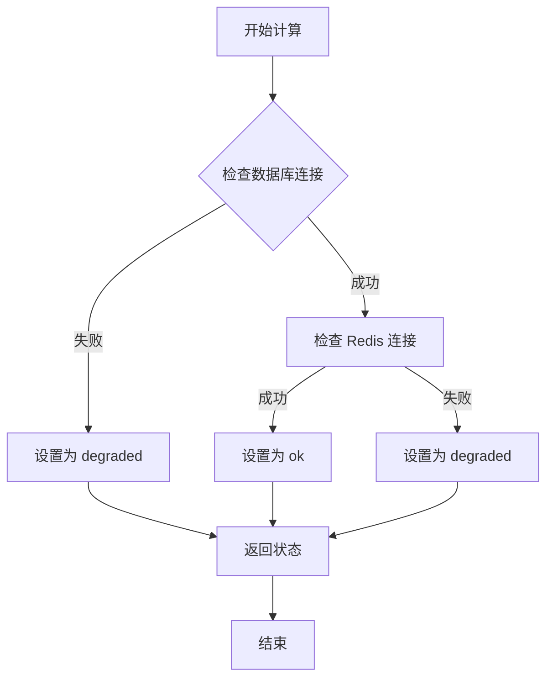

**图表来源**

- [health.controller.ts:67-70](file://apps/nestjs-server/src/modules/health/health.controller.ts#L67-L70)

### 状态报告格式

系统支持多种状态报告格式：

1. **JSON 格式**: 标准的 REST API 响应
2. **HTML 格式**: 用于浏览器直接访问
3. **文本格式**: 简化的状态信息

**章节来源**

- [health.controller.ts:24-56](file://apps/nestjs-server/src/modules/health/health.controller.ts#L24-L56)

## 前端集成与使用

### React Query 集成

前端使用 React Query 实现健康状态的自动刷新和缓存：

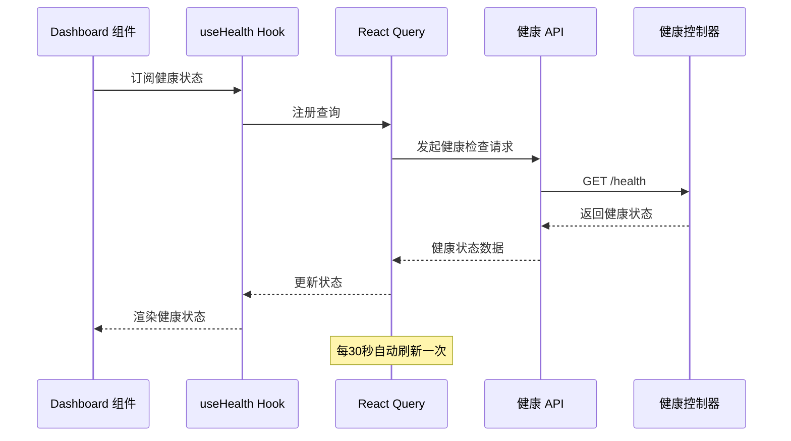

**图表来源**

- [hooks.ts:4-10](file://apps/web/src/api/modules/health/hooks.ts#L4-L10)

### 仪表板集成

Dashboard 页面集成了健康监控功能：

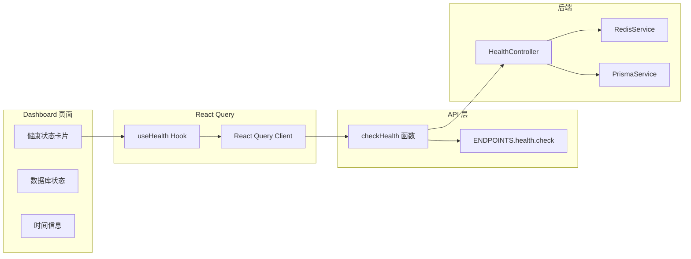

**图表来源**

- [Dashboard.tsx:81-196](file://apps/web/src/pages/Dashboard.tsx#L81-L196)
- [hooks.ts:4-10](file://apps/web/src/api/modules/health/hooks.ts#L4-L10)

**章节来源**

- [hooks.ts:4-10](file://apps/web/src/api/modules/health/hooks.ts#L4-L10)
- [Dashboard.tsx:81-196](file://apps/web/src/pages/Dashboard.tsx#L81-L196)

### 状态显示组件

Dashboard 提供了直观的状态显示组件：

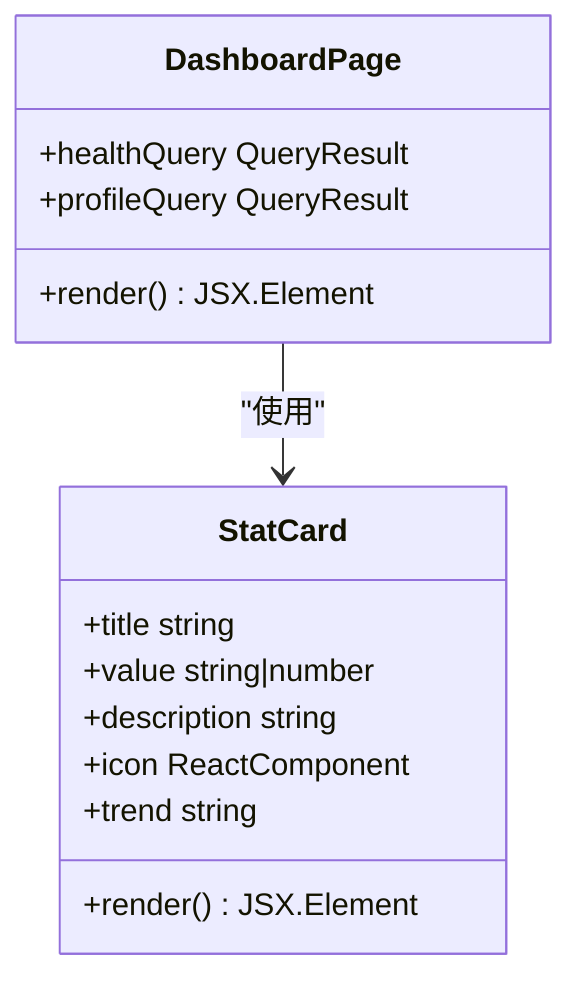

**图表来源**

- [Dashboard.tsx:17-52](file://apps/web/src/pages/Dashboard.tsx#L17-L52)

**章节来源**

- [Dashboard.tsx:17-52](file://apps/web/src/pages/Dashboard.tsx#L17-L52)

## 性能优化与缓存策略

### 缓存策略

健康监控模块采用了多层次的缓存策略：

1. **前端缓存**：使用 React Query 的本地缓存机制
2. **请求去重**：避免重复的健康检查请求
3. **智能刷新**：30秒间隔的自动刷新策略

### 性能优化建议

#### 1. 并发检查优化

- 使用 Promise.all 并发检查多个依赖服务
- 避免串行检查导致的延迟累积

#### 2. 连接池管理

- Redis 服务采用懒加载模式减少初始开销
- 支持连接复用和重用

#### 3. 内存优化

- 及时释放不再使用的连接
- 监控内存使用情况

#### 4. 网络优化

- 合理设置连接超时时间
- 实现重试机制但避免无限重试

**章节来源**

- [health.controller.ts:59-62](file://apps/nestjs-server/src/modules/health/health.controller.ts#L59-L62)
- [redis.service.ts:132-147](file://apps/nestjs-server/src/modules/redis/redis.service.ts#L132-L147)

## 故障排除指南

### 常见问题诊断

#### 1. 健康检查失败

**症状**: 健康状态始终为 'degraded'

**可能原因**:

- 数据库连接异常
- Redis 服务不可达
- 网络连接问题

**解决步骤**:

1. 检查数据库连接字符串
2. 验证 Redis 服务器状态
3. 确认网络连通性

#### 2. 前端状态不更新

**症状**: Dashboard 显示过期的健康状态

**可能原因**:

- React Query 缓存问题
- 网络请求失败
- 前端组件未正确订阅状态

**解决步骤**:

1. 检查网络连接
2. 刷新页面强制重新获取
3. 查看浏览器开发者工具的网络面板

#### 3. 性能问题

**症状**: 健康检查响应缓慢

**可能原因**:

- 数据库查询超时
- Redis 连接池耗尽
- 网络延迟过高

**解决步骤**:

1. 优化数据库查询
2. 调整 Redis 连接池大小
3. 检查网络带宽

### 日志记录

系统提供了完善的日志记录机制：

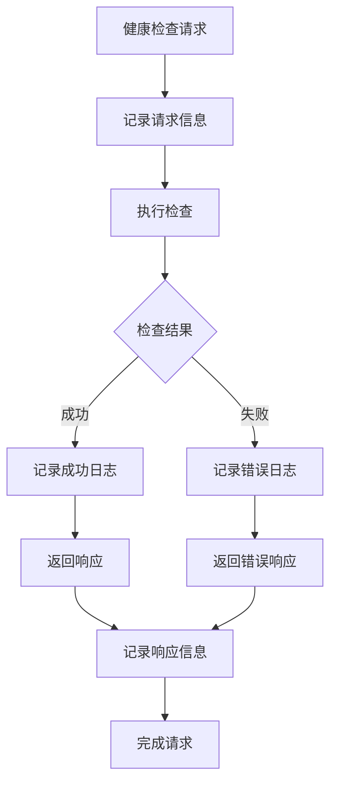

**图表来源**

- [redis.service.ts:116-127](file://apps/nestjs-server/src/modules/redis/redis.service.ts#L116-L127)
- [prisma.service.ts:8](file://apps/nestjs-server/src/prisma/prisma.service.ts#L8)

**章节来源**

- [redis.service.ts:116-127](file://apps/nestjs-server/src/modules/redis/redis.service.ts#L116-L127)
- [prisma.service.ts:8](file://apps/nestjs-server/src/prisma/prisma.service.ts#L8)

## 结论

健康监控模块为 Nebula 系统提供了全面的健康检查和状态监控能力。通过精心设计的架构和实现，该模块能够：

1. **实时监控**：提供准确的系统健康状态报告
2. **高性能**：采用并发检查和智能缓存策略
3. **易集成**：提供简洁的 API 接口和前端集成方案
4. **可扩展**：模块化设计便于添加新的监控指标

该模块的成功实施为系统的稳定运行提供了重要保障，同时也为未来的功能扩展奠定了坚实基础。通过持续的监控和优化，可以进一步提升系统的可靠性和用户体验。
