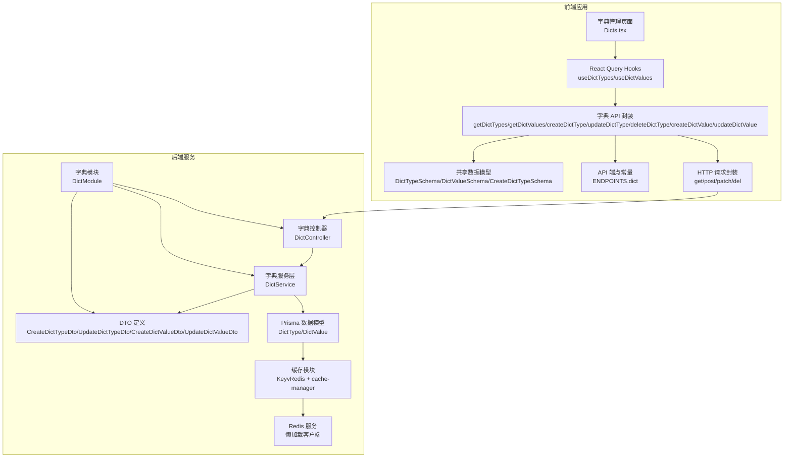
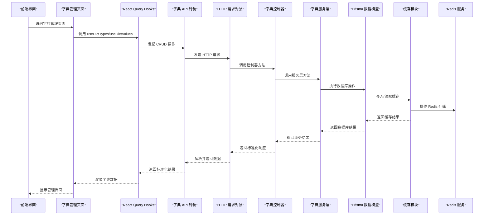
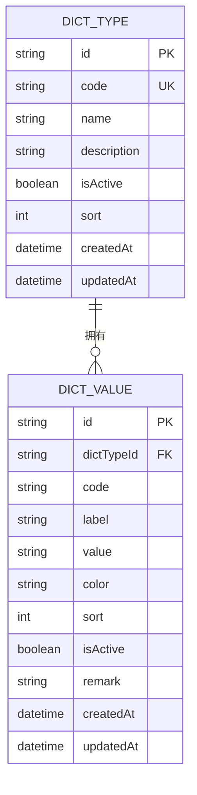
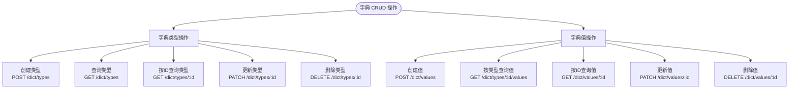
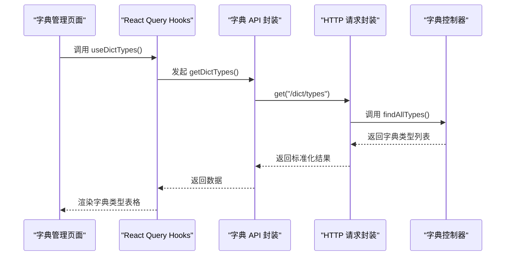
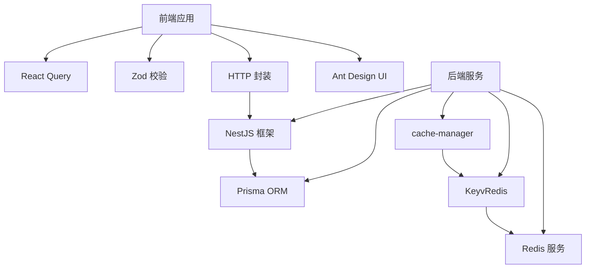

# 字典管理模块 API

<cite>
**本文档引用的文件**
- [Dict.prisma](file://apps/nestjs-server/prisma/schema/Dict.prisma)
- [dict.controller.ts](file://apps/nestjs-server/src/modules/dict/dict.controller.ts)
- [dict.service.ts](file://apps/nestjs-server/src/modules/dict/dict.service.ts)
- [dict.dto.ts](file://apps/nestjs-server/src/modules/dict/dto/dict.dto.ts)
- [dict.module.ts](file://apps/nestjs-server/src/modules/dict/dict.module.ts)
- [api.ts](file://apps/web/src/api/modules/dict/api.ts)
- [hooks.ts](file://apps/web/src/api/modules/dict/hooks.ts)
- [Dicts.tsx](file://apps/web/src/pages/Dicts.tsx)
- [cache.module.ts](file://apps/nestjs-server/src/modules/cache/cache.module.ts)
- [redis.service.ts](file://apps/nestjs-server/src/modules/redis/redis.service.ts)
- [endpoints.ts](file://apps/web/src/api/core/endpoints.ts)
- [http.ts](file://apps/web/src/api/core/http.ts)
</cite>

## 更新摘要
**所做更改**
- 新增完整的后端字典管理模块实现，包括控制器、服务层和 DTO 定义
- 新增前端字典管理页面和 API 封装
- 更新架构图以反映完整的 CRUD 实现
- 新增字典值管理功能的详细说明
- 更新数据模型和 API 接口文档

## 目录

1. [简介](#简介)
2. [项目结构](#项目结构)
3. [核心组件](#核心组件)
4. [架构概览](#架构概览)
5. [详细组件分析](#详细组件分析)
6. [依赖分析](#依赖分析)
7. [性能考虑](#性能考虑)
8. [故障排除指南](#故障排除指南)
9. [结论](#结论)

## 简介

本文件为字典管理模块 API 的详细技术文档，涵盖系统字典数据的完整 CRUD 操作、分类管理与动态配置等核心功能。文档深入说明字典项的数据结构、层级关系与分类体系，解释缓存策略、实时更新与批量操作的实现方式，并提供查询、筛选与排序的 API 使用示例。同时阐述字典模块与其他业务模块的集成方式及数据一致性保障机制。

**更新** 本版本反映了新增的完整字典管理模块实现，包括后端完整的 CRUD 控制器、服务层和 DTO 定义，以及前端字典管理页面和 API 封装。

## 项目结构

字典管理模块由前端 API 层、共享数据模型层以及后端数据库层组成，采用分层设计以确保职责清晰与可维护性。模块现已完全实现，包含完整的 CRUD 功能。

**图表来源**

- [dict.controller.ts](file://apps/nestjs-server/src/modules/dict/dict.controller.ts)
- [dict.service.ts](file://apps/nestjs-server/src/modules/dict/dict.service.ts)
- [dict.dto.ts](file://apps/nestjs-server/src/modules/dict/dto/dict.dto.ts)
- [dict.module.ts](file://apps/nestjs-server/src/modules/dict/dict.module.ts)
- [api.ts:1-31](file://apps/web/src/api/modules/dict/api.ts#L1-L31)
- [hooks.ts:1-17](file://apps/web/src/api/modules/dict/hooks.ts#L1-L17)
- [Dicts.tsx](file://apps/web/src/pages/Dicts.tsx)
- [Dict.prisma:1-33](file://apps/nestjs-server/prisma/schema/Dict.prisma#L1-L33)
- [cache.module.ts:1-21](file://apps/nestjs-server/src/modules/cache/cache.module.ts#L1-L21)
- [redis.service.ts:27-76](file://apps/nestjs-server/src/modules/redis/redis.service.ts#L27-L76)

**章节来源**

- [dict.controller.ts](file://apps/nestjs-server/src/modules/dict/dict.controller.ts)
- [dict.service.ts](file://apps/nestjs-server/src/modules/dict/dict.service.ts)
- [dict.dto.ts](file://apps/nestjs-server/src/modules/dict/dto/dict.dto.ts)
- [dict.module.ts](file://apps/nestjs-server/src/modules/dict/dict.module.ts)
- [api.ts:1-31](file://apps/web/src/api/modules/dict/api.ts#L1-L31)
- [hooks.ts:1-17](file://apps/web/src/api/modules/dict/hooks.ts#L1-L17)
- [Dicts.tsx](file://apps/web/src/pages/Dicts.tsx)
- [Dict.prisma:1-33](file://apps/nestjs-server/prisma/schema/Dict.prisma#L1-L33)
- [cache.module.ts:1-21](file://apps/nestjs-server/src/modules/cache/cache.module.ts#L1-L21)
- [redis.service.ts:27-76](file://apps/nestjs-server/src/modules/redis/redis.service.ts#L27-L76)

## 核心组件

- **后端完整实现**
  - 字典控制器：提供完整的 CRUD 操作接口，包括字典类型和字典值的创建、查询、更新和删除
  - 字典服务层：实现业务逻辑和数据验证，处理字典类型和字典值的复杂操作
  - DTO 定义：包含 CreateDictTypeDto、UpdateDictTypeDto、CreateDictValueDto、UpdateDictValueDto 四种数据传输对象
  - 字典模块：整合控制器、服务层和 DTO 的模块化组织
- **前端完整实现**
  - 字典管理页面：提供可视化的字典管理界面，支持字典类型和字典值的增删改查
  - React Query Hooks：提供 useDictTypes 和 useDictValues 等 hooks，支持数据缓存和状态管理
  - API 封装：完整的 HTTP 请求封装，支持所有 CRUD 操作
- **数据模型与校验**
  - 字典类型模型：包含唯一标识、编码、名称、描述、创建/更新时间等字段
  - 字典值模型：包含唯一标识、所属类型 ID、编码、标签、取值、颜色、排序、启用状态、备注、创建/更新时间等字段
  - 共享校验模式：定义了字典类型与字典值的 Zod 模式，用于前后端一致的数据验证
- **缓存与存储**
  - 后端使用 cache-manager 与 KeyvRedis 构建全局缓存，Redis 客户端采用懒加载策略，支持连接状态检测与后台连接
  - 前端通过 React Query 实现本地缓存与自动刷新

**章节来源**

- [dict.controller.ts](file://apps/nestjs-server/src/modules/dict/dict.controller.ts)
- [dict.service.ts](file://apps/nestjs-server/src/modules/dict/dict.service.ts)
- [dict.dto.ts](file://apps/nestjs-server/src/modules/dict/dto/dict.dto.ts)
- [dict.module.ts](file://apps/nestjs-server/src/modules/dict/dict.module.ts)
- [api.ts:9-31](file://apps/web/src/api/modules/dict/api.ts#L9-L31)
- [hooks.ts:4-17](file://apps/web/src/api/modules/dict/hooks.ts#L4-L17)
- [Dicts.tsx](file://apps/web/src/pages/Dicts.tsx)

## 架构概览

字典模块遵循"前端 API 封装 → 共享数据模型 → 后端 Prisma 模型"的分层架构，结合 Redis 缓存与懒加载机制，确保高并发下的响应性能与稳定性。现已实现完整的 CRUD 流程。

**图表来源**

- [dict.controller.ts](file://apps/nestjs-server/src/modules/dict/dict.controller.ts)
- [dict.service.ts](file://apps/nestjs-server/src/modules/dict/dict.service.ts)
- [api.ts:9-31](file://apps/web/src/api/modules/dict/api.ts#L9-L31)
- [hooks.ts:4-17](file://apps/web/src/api/modules/dict/hooks.ts#L4-L17)
- [Dicts.tsx](file://apps/web/src/pages/Dicts.tsx)
- [http.ts](file://apps/web/src/api/core/http.ts)
- [cache.module.ts:8-17](file://apps/nestjs-server/src/modules/cache/cache.module.ts#L8-L17)
- [redis.service.ts:46-76](file://apps/nestjs-server/src/modules/redis/redis.service.ts#L46-L76)

## 详细组件分析

### 数据模型与层级关系

- **字典类型（DictType）**
  - 主键：字符串唯一标识
  - 唯一约束：编码
  - 关系：拥有多个字典值（一对多）
  - 扩展属性：启用状态、排序、创建/更新时间
- **字典值（DictValue）**
  - 主键：字符串唯一标识
  - 复合唯一约束：(所属类型 ID, 编码)
  - 关系：属于某个字典类型（多对一）
  - 扩展属性：标签、取值、颜色、启用状态、排序、备注、创建/更新时间
- **分类体系**
  - 通过字典类型进行分类，每个类型下挂载若干字典值，形成"类型 → 值"的树状结构
  - 支持启用/禁用、排序与颜色等扩展属性，便于前端展示与筛选

**图表来源**

- [Dict.prisma:1-33](file://apps/nestjs-server/prisma/schema/Dict.prisma#L1-L33)

**章节来源**

- [Dict.prisma:1-33](file://apps/nestjs-server/prisma/schema/Dict.prisma#L1-L33)

### 后端完整 CRUD 实现

#### 字典类型 CRUD 操作

- **创建字典类型**
  - 方法：POST
  - 路径：/dict/types
  - 参数：CreateDictTypeDto（code/name/description）
  - 返回：DictTypeResponse（经 DictTypeSchema 校验）
- **查询所有字典类型**
  - 方法：GET
  - 路径：/dict/types
  - 参数：无
  - 返回：DictTypeResponse[] 数组
- **按 ID 查询字典类型**
  - 方法：GET
  - 路径：/dict/types/:id
  - 参数：id（类型 ID）
  - 返回：DictTypeResponse
- **更新字典类型**
  - 方法：PATCH
  - 路径：/dict/types/:id
  - 参数：UpdateDictTypeDto（code/name/description）
  - 返回：DictTypeResponse
- **删除字典类型**
  - 方法：DELETE
  - 路径：/dict/types/:id
  - 参数：无
  - 返回：无

#### 字典值 CRUD 操作

- **创建字典值**
  - 方法：POST
  - 路径：/dict/values
  - 参数：CreateDictValueDto（dictTypeId/code/label/value/color/sort/isActive/remark）
  - 返回：DictValueResponse（经 DictValueSchema 校验）
- **按类型 ID 查询字典值**
  - 方法：GET
  - 路径：/dict/types/:id/values
  - 参数：id（类型 ID）
  - 返回：DictValueResponse[] 数组
- **按 ID 查询字典值**
  - 方法：GET
  - 路径：/dict/values/:id
  - 参数：id（值 ID）
  - 返回：DictValueResponse
- **更新字典值**
  - 方法：PATCH
  - 路径：/dict/values/:id
  - 参数：UpdateDictValueDto（dictTypeId/code/label/value/color/sort/isActive/remark）
  - 返回：DictValueResponse
- **删除字典值**
  - 方法：DELETE
  - 路径：/dict/values/:id
  - 参数：无
  - 返回：无

**图表来源**

- [dict.controller.ts](file://apps/nestjs-server/src/modules/dict/dict.controller.ts)
- [dict.dto.ts](file://apps/nestjs-server/src/modules/dict/dto/dict.dto.ts)

**章节来源**

- [dict.controller.ts](file://apps/nestjs-server/src/modules/dict/dict.controller.ts)
- [dict.dto.ts](file://apps/nestjs-server/src/modules/dict/dto/dict.dto.ts)

### 前端完整实现

#### 字典管理页面

- **Dicts.tsx 页面**：提供可视化的字典管理界面，支持字典类型和字典值的增删改查操作
- **功能特性**：表格展示、搜索过滤、分页、编辑弹窗、删除确认等

#### React Query Hooks 使用

- **useDictTypes**：用于拉取并缓存所有字典类型，适合在页面初始化或需要全局字典数据时使用
- **useDictValues**：用于按类型编码拉取字典值列表，具备 enabled 条件，避免无效请求

#### API 封装

- **getDictTypes**：获取所有字典类型
- **getDictValues**：按类型获取字典值列表
- **createDictType**：创建字典类型
- **updateDictType**：更新字典类型
- **deleteDictType**：删除字典类型
- **createDictValue**：创建字典值
- **updateDictValue**：更新字典值
- **deleteDictValue**：删除字典值

**图表来源**

- [Dicts.tsx](file://apps/web/src/pages/Dicts.tsx)
- [hooks.ts:4-17](file://apps/web/src/api/modules/dict/hooks.ts#L4-L17)
- [api.ts:9-15](file://apps/web/src/api/modules/dict/api.ts#L9-L15)

**章节来源**

- [Dicts.tsx](file://apps/web/src/pages/Dicts.tsx)
- [hooks.ts:1-17](file://apps/web/src/api/modules/dict/hooks.ts#L1-L17)
- [api.ts:1-31](file://apps/web/src/api/modules/dict/api.ts#L1-L31)

### 缓存策略与实时更新

- **后端缓存**
  - 使用 cache-manager 注册 KeyvRedis 存储，设置默认 TTL
  - Redis 客户端采用懒加载，首次访问时创建并按需连接，支持 ready 状态等待
  - 缓存键设计：使用统一的命名规范，支持按类型和值的缓存分离
- **前端缓存**
  - React Query 默认启用本地缓存与自动刷新，可通过查询键控制缓存粒度
  - 支持手动缓存失效和数据同步
- **实时更新机制**
  - 对于关键字典变更，可在前端触发 invalidateQueries 或手动更新缓存键
  - 后端可结合事件总线或消息队列推送变更通知，辅助前端同步

**章节来源**

- [cache.module.ts:8-17](file://apps/nestjs-server/src/modules/cache/cache.module.ts#L8-L17)
- [redis.service.ts:46-76](file://apps/nestjs-server/src/modules/redis/redis.service.ts#L46-L76)
- [hooks.ts:4-17](file://apps/web/src/api/modules/dict/hooks.ts#L4-L17)

### 批量操作与扩展能力

- **批量操作支持**
  - 后端可提供批量创建/更新/删除接口，减少网络往返
  - 前端通过分批处理与错误回滚保证原子性
  - 对于高频读取场景，可增加缓存预热与异步刷新策略
- **动态配置能力**
  - 字典类型与值支持启用/禁用、排序、颜色等字段
  - 便于前端动态渲染与业务配置
  - 支持实时更新和缓存同步

**章节来源**

- [dict.dto.ts](file://apps/nestjs-server/src/modules/dict/dto/dict.dto.ts)
- [Dict.prisma:1-33](file://apps/nestjs-server/prisma/schema/Dict.prisma#L1-L33)

### API 使用示例（查询/筛选/排序）

- **查询所有字典类型**
  - 调用：useDictTypes()
  - 场景：下拉选择、导航菜单、权限列表等
- **按类型查询字典值**
  - 调用：useDictValues(typeId)
  - 场景：根据业务类型动态加载选项
- **创建新的字典类型**
  - 调用：createDictType({ code, name, description })
  - 场景：添加新的字典分类
- **创建新的字典值**
  - 调用：createDictValue({ dictTypeId, code, label, value, color, sort, isActive, remark })
  - 场景：为特定类型添加具体的字典项
- **筛选与排序**
  - 前端：基于返回的字典值列表进行本地筛选与排序（如按 sort 字段排序）
  - 后端：可在查询接口中增加过滤参数（如 isActive），由服务端完成筛选与排序后再返回

**章节来源**

- [hooks.ts:4-17](file://apps/web/src/api/modules/dict/hooks.ts#L4-L17)
- [api.ts:9-31](file://apps/web/src/api/modules/dict/api.ts#L9-L31)
- [dict.dto.ts](file://apps/nestjs-server/src/modules/dict/dto/dict.dto.ts)

### 与其他业务模块的集成

- **用户模块**：使用字典值作为用户角色、状态等枚举值
- **菜单模块**：使用字典值作为菜单图标、颜色等展示属性
- **权限模块**：通过字典类型定义权限类别，字典值定义具体权限项
- **集成要点**
  - 统一使用共享数据模型进行类型约束，确保跨模块一致性
  - 在业务实体中仅保存字典值编码，避免硬编码，提升可维护性
  - 支持动态配置和实时更新，适应业务变化需求

**章节来源**

- [dict.dto.ts](file://apps/nestjs-server/src/modules/dict/dto/dict.dto.ts)

## 依赖分析

- **前端依赖**
  - React Query：提供查询、缓存与状态管理
  - Zod：提供运行时数据校验
  - 自定义 HTTP 封装：统一处理请求与响应
  - Ant Design：提供表格、表单、按钮等 UI 组件
- **后端依赖**
  - NestJS：提供控制器和服务层架构
  - Prisma：ORM 映射与数据库交互
  - cache-manager + KeyvRedis：全局缓存
  - Redis：高性能键值存储
  - Zod：运行时数据验证

**图表来源**

- [hooks.ts:1-17](file://apps/web/src/api/modules/dict/hooks.ts#L1-L17)
- [api.ts:1-5](file://apps/web/src/api/modules/dict/api.ts#L1-L5)
- [http.ts](file://apps/web/src/api/core/http.ts)
- [dict.controller.ts](file://apps/nestjs-server/src/modules/dict/dict.controller.ts)
- [cache.module.ts:1-21](file://apps/nestjs-server/src/modules/cache/cache.module.ts#L1-L21)
- [redis.service.ts:27-76](file://apps/nestjs-server/src/modules/redis/redis.service.ts#L27-L76)

**章节来源**

- [hooks.ts:1-17](file://apps/web/src/api/modules/dict/hooks.ts#L1-L17)
- [api.ts:1-5](file://apps/web/src/api/modules/dict/api.ts#L1-L5)
- [dict.controller.ts](file://apps/nestjs-server/src/modules/dict/dict.controller.ts)
- [cache.module.ts:1-21](file://apps/nestjs-server/src/modules/cache/cache.module.ts#L1-L21)
- [redis.service.ts:27-76](file://apps/nestjs-server/src/modules/redis/redis.service.ts#L27-L76)

## 性能考虑

- **缓存优先**：优先从缓存读取，降低数据库压力；合理设置 TTL 平衡新鲜度与性能
- **懒加载连接**：Redis 客户端懒加载减少启动开销，按需建立连接
- **分页与筛选**：前端分页与后端筛选相结合，避免一次性传输大量数据
- **批量操作**：对频繁变更的字典进行批量写入，减少事务次数
- **前端缓存策略**：利用 React Query 的缓存键与失效策略，避免重复请求
- **模块化设计**：字典模块独立部署，减少耦合度，提高系统整体性能

## 故障排除指南

- **Redis 连接失败**
  - 现象：服务启动时报错或查询超时
  - 排查：确认 Redis 配置、网络连通性与认证信息；使用 ready 等待连接可用
- **缓存未命中**
  - 现象：每次请求都走数据库
  - 排查：检查缓存键是否正确、TTL 设置是否过短、KeyvRedis 初始化是否成功
- **数据校验失败**
  - 现象：接口返回数据不符合预期
  - 排查：核对前端传参是否满足 CreateDictTypeDto/UpdateDictTypeDto/CreateDictValueDto/UpdateDictValueDto 约束
- **前端数据不一致**
  - 现象：多端显示不同步
  - 排查：触发 invalidateQueries 或手动更新缓存键；检查网络请求是否成功
- **字典类型冲突**
  - 现象：创建字典类型时报编码重复错误
  - 排查：检查是否存在重复的编码值；使用唯一约束进行验证
- **字典值关联错误**
  - 现象：创建字典值时报类型关联错误
  - 排查：确认 dictTypeId 是否存在且有效；检查外键约束

**章节来源**

- [redis.service.ts:66-76](file://apps/nestjs-server/src/modules/redis/redis.service.ts#L66-L76)
- [cache.module.ts:8-17](file://apps/nestjs-server/src/modules/cache/cache.module.ts#L8-L17)
- [dict.dto.ts](file://apps/nestjs-server/src/modules/dict/dto/dict.dto.ts)

## 结论

字典管理模块通过清晰的分层设计、严格的共享数据模型与完善的缓存机制，实现了高效、稳定且易扩展的字典数据管理能力。模块现已完全实现，包含完整的 CRUD 操作、前端可视化管理界面和后端服务层架构。

前端通过 React Query 与后端 Prisma/Redis 协作，既保证了性能又兼顾了实时性。后端采用 NestJS 框架提供 RESTful API，支持完整的字典类型和字典值管理功能。

建议在实际业务中结合动态配置与批量操作，进一步提升系统的灵活性与可维护性。模块化的架构设计也为未来的功能扩展和性能优化提供了良好的基础。