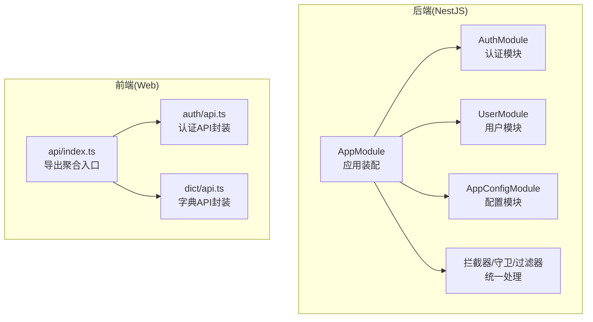
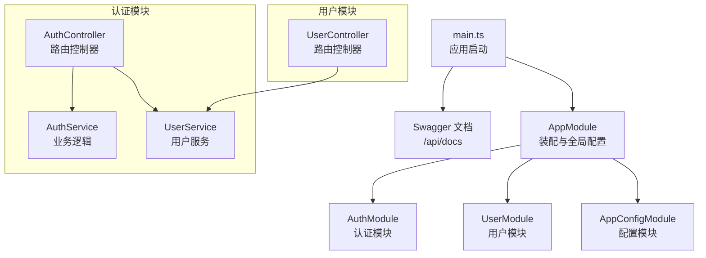
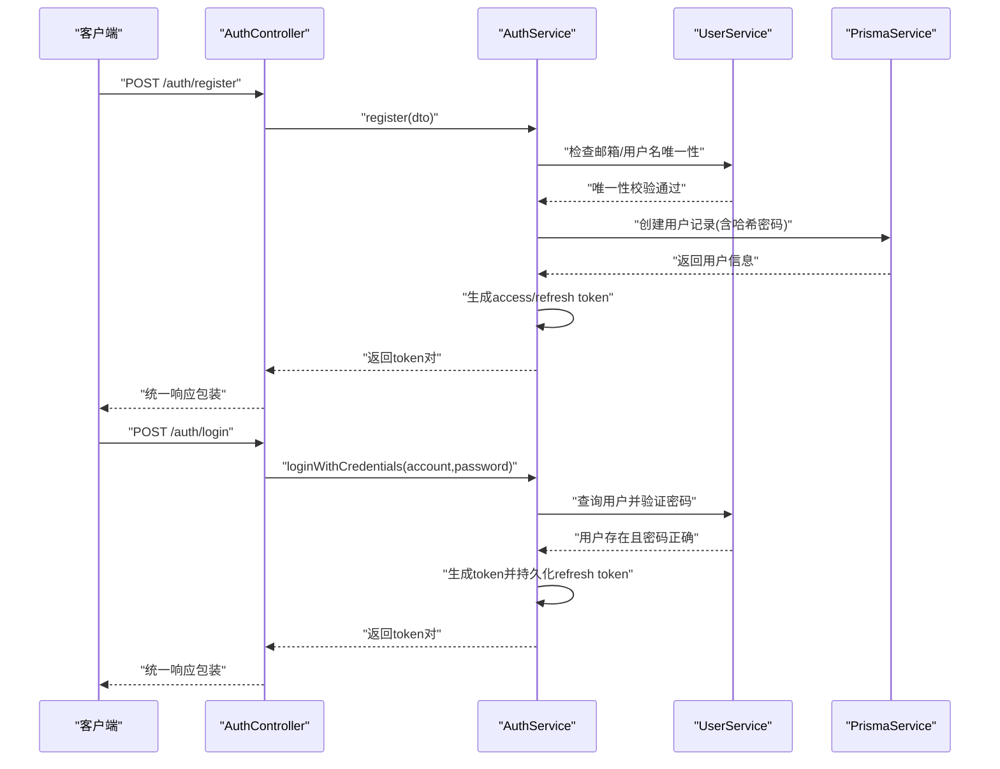
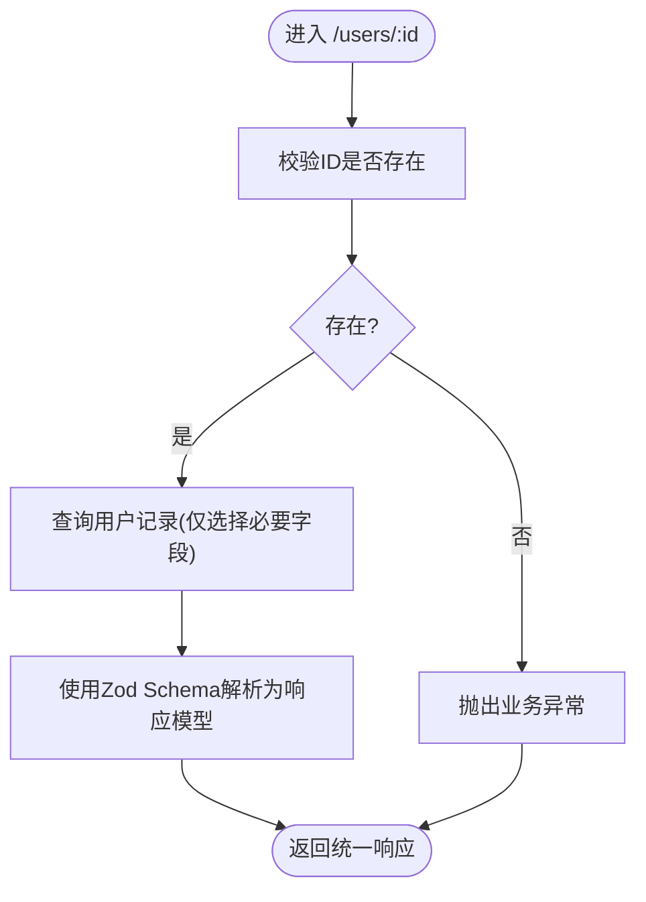
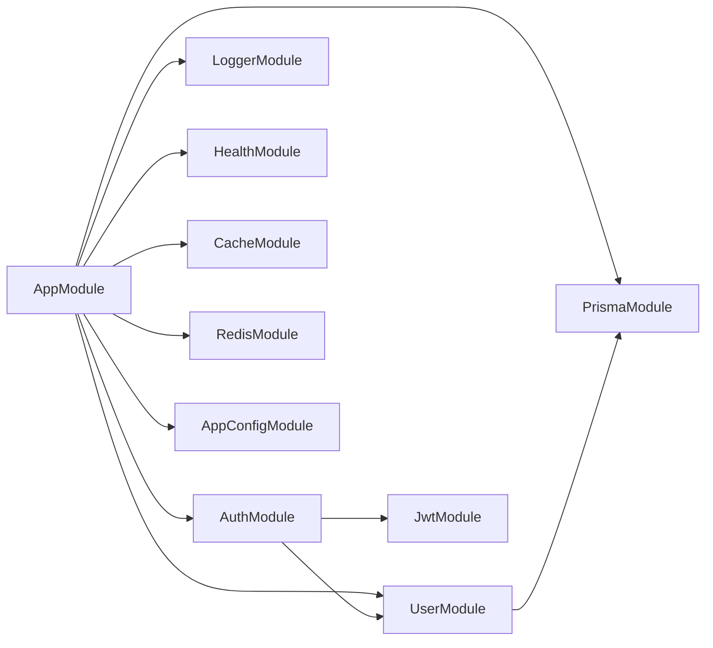

# 模块化 API 设计

<cite>
**本文引用的文件**
- [apps/nestjs-server/src/app.module.ts](file://apps/nestjs-server/src/app.module.ts)
- [apps/nestjs-server/src/main.ts](file://apps/nestjs-server/src/main.ts)
- [apps/nestjs-server/src/modules/auth/auth.module.ts](file://apps/nestjs-server/src/modules/auth/auth.module.ts)
- [apps/nestjs-server/src/modules/auth/auth.controller.ts](file://apps/nestjs-server/src/modules/auth/auth.controller.ts)
- [apps/nestjs-server/src/modules/auth/auth.service.ts](file://apps/nestjs-server/src/modules/auth/auth.service.ts)
- [apps/nestjs-server/src/modules/user/user.module.ts](file://apps/nestjs-server/src/modules/user/user.module.ts)
- [apps/nestjs-server/src/modules/user/user.controller.ts](file://apps/nestjs-server/src/modules/user/user.controller.ts)
- [apps/nestjs-server/src/modules/user/user.service.ts](file://apps/nestjs-server/src/modules/user/user.service.ts)
- [apps/web/src/api/index.ts](file://apps/web/src/api/index.ts)
- [apps/web/src/api/modules/auth/api.ts](file://apps/web/src/api/modules/auth/api.ts)
- [apps/web/src/api/modules/dict/api.ts](file://apps/web/src/api/modules/dict/api.ts)
- [apps/nestjs-server/src/common/decorators/api-success-response.decorator.ts](file://apps/nestjs-server/src/common/decorators/api-success-response.decorator.ts)
- [apps/nestjs-server/src/common/guards/jwt-auth.guard.ts](file://apps/nestjs-server/src/common/guards/jwt-auth.guard.ts)
- [apps/nestjs-server/src/common/interceptors/transform.interceptor.ts](file://apps/nestjs-server/src/common/interceptors/transform.interceptor.ts)
- [apps/nestjs-server/src/config/config.module.ts](file://apps/nestjs-server/src/config/config.module.ts)
</cite>

## 目录
1. [引言](#引言)
2. [项目结构](#项目结构)
3. [核心组件](#核心组件)
4. [架构总览](#架构总览)
5. [详细组件分析](#详细组件分析)
6. [依赖分析](#依赖分析)
7. [性能考虑](#性能考虑)
8. [故障排查指南](#故障排查指南)
9. [结论](#结论)
10. [附录](#附录)

## 引言
本文件系统化梳理了基于 NestJS 的模块化 API 设计方案，重点覆盖以下方面：
- 按功能模块划分的 API 组织方式：认证模块、用户管理模块、字典模块等
- 模块间依赖关系、接口复用策略与命名规范
- 模块化路由配置、接口分组管理与版本控制策略
- 扩展新模块的实践范式与接口设计最佳实践

目标是帮助开发者在保持高内聚、低耦合的前提下，快速扩展与维护 API。

## 项目结构
后端采用 NestJS 的模块化架构，前端通过共享类型与统一的 API 封装进行对接。整体结构如下：

图表来源
- [apps/nestjs-server/src/app.module.ts:19-61](file://apps/nestjs-server/src/app.module.ts#L19-L61)
- [apps/nestjs-server/src/modules/auth/auth.module.ts:12-33](file://apps/nestjs-server/src/modules/auth/auth.module.ts#L12-L33)
- [apps/nestjs-server/src/modules/user/user.module.ts:5-9](file://apps/nestjs-server/src/modules/user/user.module.ts#L5-L9)
- [apps/web/src/api/index.ts:26-32](file://apps/web/src/api/index.ts#L26-L32)

章节来源
- [apps/nestjs-server/src/app.module.ts:19-61](file://apps/nestjs-server/src/app.module.ts#L19-L61)
- [apps/web/src/api/index.ts:26-32](file://apps/web/src/api/index.ts#L26-L32)

## 核心组件
- 应用装配与全局配置
  - 应用主模块负责导入子模块、注册全局守卫/拦截器/管道/过滤器，并设置全局前缀与 Swagger 文档。
  - 配置模块以全局方式提供类型化配置服务，供其他模块按命名空间读取配置。
- 认证模块
  - 提供验证码、注册、登录、刷新令牌、退出登录、获取当前用户信息等接口。
  - 依赖用户模块与 JWT 策略，使用拦截器统一响应包装。
- 用户模块
  - 提供用户增删改查接口，内部对密码进行哈希处理与唯一性校验。
- 前端 API 封装
  - 通过统一入口导出各模块 API 与 Hooks，便于按需引入与版本管理。

章节来源
- [apps/nestjs-server/src/app.module.ts:19-61](file://apps/nestjs-server/src/app.module.ts#L19-L61)
- [apps/nestjs-server/src/config/config.module.ts:6-18](file://apps/nestjs-server/src/config/config.module.ts#L6-L18)
- [apps/nestjs-server/src/modules/auth/auth.controller.ts:28-114](file://apps/nestjs-server/src/modules/auth/auth.controller.ts#L28-L114)
- [apps/nestjs-server/src/modules/user/user.controller.ts:21-78](file://apps/nestjs-server/src/modules/user/user.controller.ts#L21-L78)
- [apps/web/src/api/index.ts:26-32](file://apps/web/src/api/index.ts#L26-L32)

## 架构总览
下图展示了从启动到请求处理的关键路径，以及模块间的依赖关系与职责边界。

图表来源
- [apps/nestjs-server/src/main.ts:9-35](file://apps/nestjs-server/src/main.ts#L9-L35)
- [apps/nestjs-server/src/app.module.ts:19-34](file://apps/nestjs-server/src/app.module.ts#L19-L34)
- [apps/nestjs-server/src/modules/auth/auth.module.ts:12-33](file://apps/nestjs-server/src/modules/auth/auth.module.ts#L12-L33)
- [apps/nestjs-server/src/modules/user/user.module.ts:5-9](file://apps/nestjs-server/src/modules/user/user.module.ts#L5-L9)

## 详细组件分析

### 认证模块（Auth）
- 路由与控制器
  - 控制器以“/auth”为基路径，提供验证码、注册、登录、刷新令牌、退出登录、获取当前用户信息等接口。
  - 使用 Swagger 装饰器标注标签、操作描述与成功/错误响应。
- 服务与业务流程
  - 登录/注册：先校验凭据与唯一性，再生成访问令牌与刷新令牌；刷新令牌时对存储的哈希进行校验并撤销旧令牌。
  - 退出登录：批量撤销用户所有未失效的刷新令牌。
- 安全与鉴权
  - 默认启用 JWT 守卫；公开接口通过“@Public”装饰器豁免鉴权。
  - 统一响应包装由拦截器完成，错误由过滤器捕获并转换为标准格式。

图表来源
- [apps/nestjs-server/src/modules/auth/auth.controller.ts:50-76](file://apps/nestjs-server/src/modules/auth/auth.controller.ts#L50-L76)
- [apps/nestjs-server/src/modules/auth/auth.service.ts:44-57](file://apps/nestjs-server/src/modules/auth/auth.service.ts#L44-L57)
- [apps/nestjs-server/src/modules/auth/auth.service.ts:29-37](file://apps/nestjs-server/src/modules/auth/auth.service.ts#L29-L37)

章节来源
- [apps/nestjs-server/src/modules/auth/auth.controller.ts:28-114](file://apps/nestjs-server/src/modules/auth/auth.controller.ts#L28-L114)
- [apps/nestjs-server/src/modules/auth/auth.service.ts:14-151](file://apps/nestjs-server/src/modules/auth/auth.service.ts#L14-L151)
- [apps/nestjs-server/src/common/guards/jwt-auth.guard.ts:17-42](file://apps/nestjs-server/src/common/guards/jwt-auth.guard.ts#L17-L42)
- [apps/nestjs-server/src/common/interceptors/transform.interceptor.ts:9-35](file://apps/nestjs-server/src/common/interceptors/transform.interceptor.ts#L9-L35)

### 用户模块（User）
- 路由与控制器
  - 控制器以“/users”为基路径，提供创建、查询列表、按ID查询、更新、删除接口。
  - 使用 Swagger 装饰器标注标签、操作描述与成功/错误响应。
- 服务与数据访问
  - 统一选择返回字段，避免敏感信息泄露；提供按邮箱/用户名/账号查询与密码校验能力。
  - 删除用户时先做存在性校验，再执行删除。

图表来源
- [apps/nestjs-server/src/modules/user/user.controller.ts:49-57](file://apps/nestjs-server/src/modules/user/user.controller.ts#L49-L57)
- [apps/nestjs-server/src/modules/user/user.service.ts:40-51](file://apps/nestjs-server/src/modules/user/user.service.ts#L40-L51)

章节来源
- [apps/nestjs-server/src/modules/user/user.controller.ts:21-78](file://apps/nestjs-server/src/modules/user/user.controller.ts#L21-L78)
- [apps/nestjs-server/src/modules/user/user.service.ts:13-113](file://apps/nestjs-server/src/modules/user/user.service.ts#L13-L113)

### 字典模块（Dict）
- 前端 API 封装
  - 提供字典类型与字典值的增删改查与列表查询接口，使用 Zod Schema 进行参数与响应校验。
- 后端模块
  - 当前仓库未提供后端实现文件，但前端已具备完整的 API 封装与类型定义，便于后续后端对接。

章节来源
- [apps/web/src/api/modules/dict/api.ts:1-32](file://apps/web/src/api/modules/dict/api.ts#L1-L32)

### 前端 API 导出与分组
- 统一入口导出
  - 通过聚合入口导出各模块 API 与 Hooks，便于按需引入与版本管理。
- 分组管理
  - 按模块分组导出，形成清晰的命名空间，降低命名冲突风险。

章节来源
- [apps/web/src/api/index.ts:26-41](file://apps/web/src/api/index.ts#L26-L41)

## 依赖分析
- 模块依赖
  - AppModule 导入并装配认证模块、用户模块、健康检查、缓存、日志、Redis、Prisma 等模块。
  - 认证模块依赖用户模块与 JWT 策略；用户模块依赖 Prisma 服务。
- 全局中间件与治理
  - 全局注册守卫（JWT 与节流）、拦截器（日志与响应包装）、验证管道（Zod）、异常过滤器。
  - 配置模块提供类型化配置，支持命名空间读取。

图表来源
- [apps/nestjs-server/src/app.module.ts:19-34](file://apps/nestjs-server/src/app.module.ts#L19-L34)
- [apps/nestjs-server/src/modules/auth/auth.module.ts:12-33](file://apps/nestjs-server/src/modules/auth/auth.module.ts#L12-L33)

章节来源
- [apps/nestjs-server/src/app.module.ts:19-61](file://apps/nestjs-server/src/app.module.ts#L19-L61)
- [apps/nestjs-server/src/modules/auth/auth.module.ts:12-33](file://apps/nestjs-server/src/modules/auth/auth.module.ts#L12-L33)

## 性能考虑
- 请求限流
  - 通过全局节流守卫限制短/中/长窗口内的请求数，保护下游服务。
- 响应统一与序列化
  - 拦截器统一包装响应，减少重复逻辑；结合 Zod 验证提升序列化一致性与可观测性。
- 数据库查询优化
  - 服务层使用精确的 select 字段集，避免不必要的字段传输与内存占用。
- 缓存与外部集成
  - 模块化引入缓存与 Redis，建议在热点接口上配合缓存策略降低数据库压力。

## 故障排查指南
- 通用错误响应
  - 统一错误响应由拦截器与过滤器协作生成，便于前端一致处理。
- 业务异常
  - 业务异常通过枚举化的业务码进行标识，便于定位与国际化提示。
- 鉴权失败
  - JWT 守卫在缺失或无效令牌时抛出业务异常，需检查请求头与令牌有效期。
- 接口文档
  - 启用 Swagger 后可通过统一文档页面核对请求/响应结构与状态码。

章节来源
- [apps/nestjs-server/src/common/interceptors/transform.interceptor.ts:9-35](file://apps/nestjs-server/src/common/interceptors/transform.interceptor.ts#L9-L35)
- [apps/nestjs-server/src/common/decorators/api-success-response.decorator.ts:136-148](file://apps/nestjs-server/src/common/decorators/api-success-response.decorator.ts#L136-L148)
- [apps/nestjs-server/src/common/guards/jwt-auth.guard.ts:36-41](file://apps/nestjs-server/src/common/guards/jwt-auth.guard.ts#L36-L41)

## 结论
本项目通过模块化设计实现了清晰的职责边界与可扩展的 API 组织方式。认证、用户与字典等模块均遵循统一的装饰器、拦截器与守卫规范，前端通过统一入口与类型约束对接后端接口。建议在新增模块时沿用现有模式：控制器负责路由与文档，服务封装业务，拦截器/守卫/过滤器提供横切关注点，配置模块提供类型化配置。

## 附录

### 模块化路由配置与命名规范
- 路由前缀
  - 通过全局前缀统一管理 API 命名空间，便于版本控制与多环境部署。
- 控制器命名
  - 控制器类名以“...Controller”结尾，模块目录与控制器路径保持一致，增强可发现性。
- 装饰器与文档
  - 使用统一的响应装饰器与全局错误装饰器，保证 Swagger 文档与实际响应一致。

章节来源
- [apps/nestjs-server/src/main.ts:22](file://apps/nestjs-server/src/main.ts#L22)
- [apps/nestjs-server/src/modules/auth/auth.controller.ts:28-114](file://apps/nestjs-server/src/modules/auth/auth.controller.ts#L28-L114)
- [apps/nestjs-server/src/modules/user/user.controller.ts:21-78](file://apps/nestjs-server/src/modules/user/user.controller.ts#L21-L78)
- [apps/nestjs-server/src/common/decorators/api-success-response.decorator.ts:88-126](file://apps/nestjs-server/src/common/decorators/api-success-response.decorator.ts#L88-L126)

### 接口分组管理与版本控制策略
- 分组管理
  - 通过模块化目录与统一导出入口实现接口分组，前端按需引入，降低包体积与编译时间。
- 版本控制
  - 可在全局前缀中加入版本号（如“/api/v1”），并在 Swagger 中体现版本信息，便于演进与兼容。

章节来源
- [apps/web/src/api/index.ts:26-41](file://apps/web/src/api/index.ts#L26-L41)
- [apps/nestjs-server/src/main.ts:24-33](file://apps/nestjs-server/src/main.ts#L24-L33)

### 模块扩展示例（以字典模块为例）
- 前端
  - 在统一入口导出模块 API 与 Hooks，保持命名空间一致。
- 后端
  - 创建模块目录与控制器、服务，按需引入 Prisma 与 DTO；在主模块中装配新模块。
- 文档
  - 使用统一的响应装饰器与全局错误装饰器，自动生成一致的 Swagger 文档。

章节来源
- [apps/web/src/api/modules/dict/api.ts:1-32](file://apps/web/src/api/modules/dict/api.ts#L1-L32)
- [apps/web/src/api/index.ts:26-32](file://apps/web/src/api/index.ts#L26-L32)