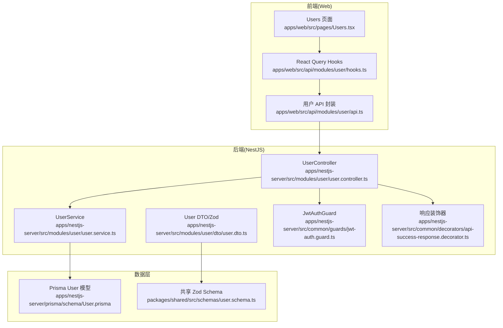
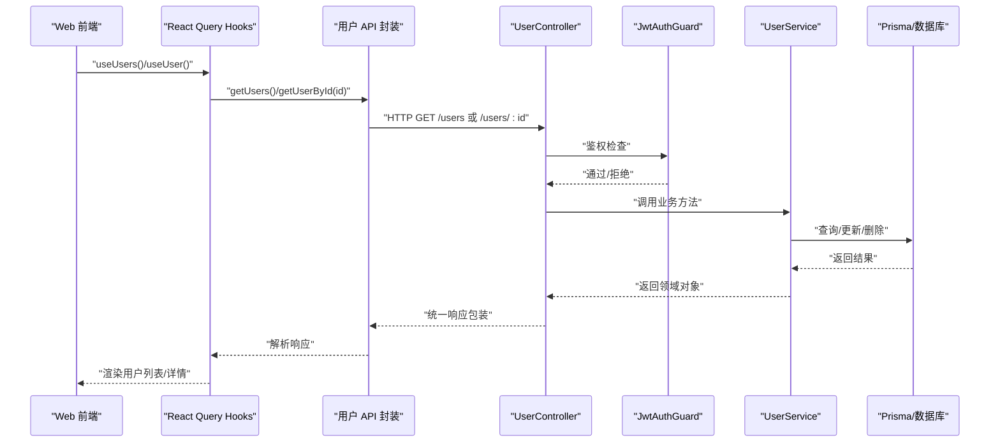
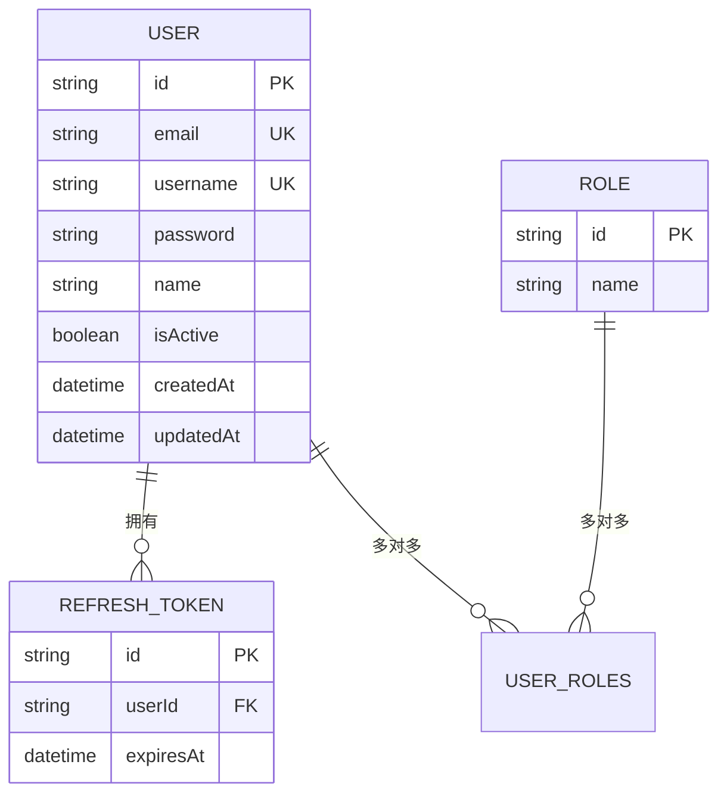
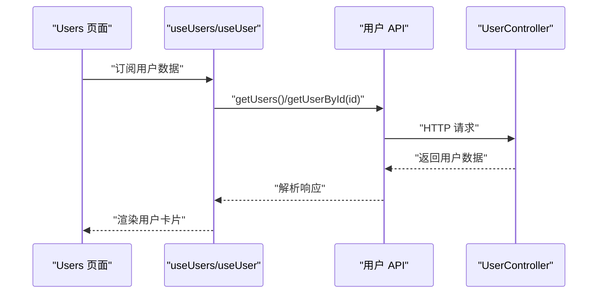
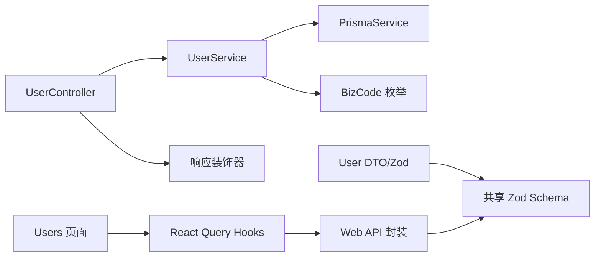

# 用户管理模块 API

<cite>
**本文引用的文件**
- [apps/nestjs-server/src/modules/user/user.controller.ts](file://apps/nestjs-server/src/modules/user/user.controller.ts)
- [apps/nestjs-server/src/modules/user/user.service.ts](file://apps/nestjs-server/src/modules/user/user.service.ts)
- [apps/nestjs-server/src/modules/user/dto/user.dto.ts](file://apps/nestjs-server/src/modules/user/dto/user.dto.ts)
- [apps/nestjs-server/prisma/schema/User.prisma](file://apps/nestjs-server/prisma/schema/User.prisma)
- [apps/web/src/api/modules/user/api.ts](file://apps/web/src/api/modules/user/api.ts)
- [apps/web/src/api/modules/user/hooks.ts](file://apps/web/src/api/modules/user/hooks.ts)
- [apps/web/src/pages/Users.tsx](file://apps/web/src/pages/Users.tsx)
- [apps/nestjs-server/src/common/guards/jwt-auth.guard.ts](file://apps/nestjs-server/src/common/guards/jwt-auth.guard.ts)
- [apps/nestjs-server/src/common/decorators/api-success-response.decorator.ts](file://apps/nestjs-server/src/common/decorators/api-success-response.decorator.ts)
- [packages/shared/src/schemas/user.schema.ts](file://packages/shared/src/schemas/user.schema.ts)
- [apps/nestjs-server/src/common/enums/biz-code.enum.ts](file://apps/nestjs-server/src/common/enums/biz-code.enum.ts)
</cite>

## 目录
1. [简介](#简介)
2. [项目结构](#项目结构)
3. [核心组件](#核心组件)
4. [架构总览](#架构总览)
5. [详细组件分析](#详细组件分析)
6. [依赖关系分析](#依赖关系分析)
7. [性能考量](#性能考量)
8. [故障排查指南](#故障排查指南)
9. [结论](#结论)
10. [附录](#附录)

## 简介
本文件面向用户管理模块的 API 设计与实现，覆盖用户 CRUD 操作、查询、状态管理、数据验证、权限控制与安全策略，并提供分页、搜索与排序的扩展建议及批量操作指南。文档基于实际代码仓库进行梳理，确保内容可追溯至具体源文件。

## 项目结构
用户管理模块在后端采用典型的三层结构：控制器（Controller）负责 HTTP 接口与文档标注；服务（Service）封装业务逻辑与数据访问；DTO 与 Zod Schema 定义输入输出结构；Prisma 定义数据模型；前端通过 React Query 与后端 API 进行交互。

图表来源
- [apps/web/src/pages/Users.tsx:1-34](file://apps/web/src/pages/Users.tsx#L1-L34)
- [apps/web/src/api/modules/user/hooks.ts:1-56](file://apps/web/src/api/modules/user/hooks.ts#L1-L56)
- [apps/web/src/api/modules/user/api.ts:1-34](file://apps/web/src/api/modules/user/api.ts#L1-L34)
- [apps/nestjs-server/src/modules/user/user.controller.ts:1-79](file://apps/nestjs-server/src/modules/user/user.controller.ts#L1-L79)
- [apps/nestjs-server/src/modules/user/user.service.ts:1-113](file://apps/nestjs-server/src/modules/user/user.service.ts#L1-L113)
- [apps/nestjs-server/src/modules/user/dto/user.dto.ts:1-26](file://apps/nestjs-server/src/modules/user/dto/user.dto.ts#L1-L26)
- [apps/nestjs-server/prisma/schema/User.prisma:1-15](file://apps/nestjs-server/prisma/schema/User.prisma#L1-L15)
- [packages/shared/src/schemas/user.schema.ts:1-34](file://packages/shared/src/schemas/user.schema.ts#L1-L34)

章节来源
- [apps/nestjs-server/src/modules/user/user.controller.ts:1-79](file://apps/nestjs-server/src/modules/user/user.controller.ts#L1-L79)
- [apps/nestjs-server/src/modules/user/user.service.ts:1-113](file://apps/nestjs-server/src/modules/user/user.service.ts#L1-L113)
- [apps/nestjs-server/src/modules/user/dto/user.dto.ts:1-26](file://apps/nestjs-server/src/modules/user/dto/user.dto.ts#L1-L26)
- [apps/nestjs-server/prisma/schema/User.prisma:1-15](file://apps/nestjs-server/prisma/schema/User.prisma#L1-L15)
- [apps/web/src/api/modules/user/api.ts:1-34](file://apps/web/src/api/modules/user/api.ts#L1-L34)
- [apps/web/src/api/modules/user/hooks.ts:1-56](file://apps/web/src/api/modules/user/hooks.ts#L1-L56)
- [apps/web/src/pages/Users.tsx:1-34](file://apps/web/src/pages/Users.tsx#L1-L34)

## 核心组件
- 控制器（UserController）
  - 提供用户 CRUD 接口：POST /users（创建）、GET /users（列表）、GET /users/:id（详情）、PATCH /users/:id（更新）、DELETE /users/:id（删除）
  - 使用 Swagger 注解与统一响应装饰器，保证接口文档一致性
- 服务（UserService）
  - 实现用户创建（密码哈希）、查询、更新、删除
  - 提供按邮箱、用户名、账号（邮箱或用户名）检索方法
  - 使用 Prisma 访问数据库，仅选择必要字段避免泄露敏感信息
- 数据传输对象（DTO）
  - 基于共享 Zod Schema，前端与后端对输入输出进行强类型约束
  - 响应 Schema 中时间字段使用后端 DateTimeStringSchema 覆盖，确保序列化为字符串
- 权限与安全
  - 控制器使用 JWT 授权守卫与全局错误响应装饰器
  - 业务异常码统一来源于共享枚举，便于前后端一致处理

章节来源
- [apps/nestjs-server/src/modules/user/user.controller.ts:21-79](file://apps/nestjs-server/src/modules/user/user.controller.ts#L21-L79)
- [apps/nestjs-server/src/modules/user/user.service.ts:14-113](file://apps/nestjs-server/src/modules/user/user.service.ts#L14-L113)
- [apps/nestjs-server/src/modules/user/dto/user.dto.ts:10-26](file://apps/nestjs-server/src/modules/user/dto/user.dto.ts#L10-L26)
- [apps/nestjs-server/src/common/guards/jwt-auth.guard.ts:17-43](file://apps/nestjs-server/src/common/guards/jwt-auth.guard.ts#L17-L43)
- [apps/nestjs-server/src/common/decorators/api-success-response.decorator.ts:20-149](file://apps/nestjs-server/src/common/decorators/api-success-response.decorator.ts#L20-L149)
- [apps/nestjs-server/src/common/enums/biz-code.enum.ts:1-16](file://apps/nestjs-server/src/common/enums/biz-code.enum.ts#L1-L16)

## 架构总览
下图展示从前端到后端的典型调用链路与数据流：

图表来源
- [apps/web/src/api/modules/user/api.ts:15-33](file://apps/web/src/api/modules/user/api.ts#L15-L33)
- [apps/web/src/api/modules/user/hooks.ts:9-55](file://apps/web/src/api/modules/user/hooks.ts#L9-L55)
- [apps/nestjs-server/src/modules/user/user.controller.ts:28-77](file://apps/nestjs-server/src/modules/user/user.controller.ts#L28-L77)
- [apps/nestjs-server/src/modules/user/user.service.ts:33-51](file://apps/nestjs-server/src/modules/user/user.service.ts#L33-L51)
- [apps/nestjs-server/src/common/guards/jwt-auth.guard.ts:23-41](file://apps/nestjs-server/src/common/guards/jwt-auth.guard.ts#L23-L41)

## 详细组件分析

### 数据模型与字段定义
- Prisma 模型字段
  - id：主键（UUID）
  - email：唯一索引
  - username：唯一索引
  - password：存储哈希后的密码
  - name：可选显示名称
  - isActive：默认启用
  - createdAt/updatedAt：时间戳
  - 关联：refreshTokens、roles
- 共享 Schema 字段
  - 创建：email、username、password、name（可选）
  - 更新：email、username、name（可选，密码不可更新）
  - 响应：id、email、username、name、isActive、createdAt、updatedAt（字符串时间）

图表来源
- [apps/nestjs-server/prisma/schema/User.prisma:1-15](file://apps/nestjs-server/prisma/schema/User.prisma#L1-L15)
- [packages/shared/src/schemas/user.schema.ts:21-29](file://packages/shared/src/schemas/user.schema.ts#L21-L29)

章节来源
- [apps/nestjs-server/prisma/schema/User.prisma:1-15](file://apps/nestjs-server/prisma/schema/User.prisma#L1-L15)
- [packages/shared/src/schemas/user.schema.ts:12-29](file://packages/shared/src/schemas/user.schema.ts#L12-L29)

### 控制器与路由设计
- 路径与方法
  - POST /users：创建用户
  - GET /users：获取用户列表
  - GET /users/:id：获取指定用户
  - PATCH /users/:id：更新用户
  - DELETE /users/:id：删除用户
- 文档与响应
  - 使用 Swagger 注解与统一成功/错误响应装饰器
  - 成功响应包装结构由拦截器统一生成，Swagger 文档与 DTO 同步

章节来源
- [apps/nestjs-server/src/modules/user/user.controller.ts:28-77](file://apps/nestjs-server/src/modules/user/user.controller.ts#L28-L77)
- [apps/nestjs-server/src/common/decorators/api-success-response.decorator.ts:82-149](file://apps/nestjs-server/src/common/decorators/api-success-response.decorator.ts#L82-L149)

### 服务层实现要点
- 创建用户
  - 密码使用 bcrypt 哈希存储
  - 通过 Prisma 创建并仅选择必要字段返回
- 查询用户
  - 支持按 ID、邮箱、用户名、账号（邮箱或用户名）查询
  - 未找到时抛出业务异常
- 更新与删除
  - 先校验用户存在性，再执行更新/删除
- 密码校验
  - 提供明文与哈希对比方法

章节来源
- [apps/nestjs-server/src/modules/user/user.service.ts:17-97](file://apps/nestjs-server/src/modules/user/user.service.ts#L17-L97)

### DTO 与数据验证
- 输入验证
  - 创建：邮箱格式、用户名长度、密码长度
  - 更新：部分字段允许更新，密码不可更新
- 输出验证
  - 响应 Schema 使用后端 DateTimeStringSchema，确保时间字段为字符串
- 共享 Schema
  - 前后端共享同一套 Zod Schema，减少耦合与不一致风险

章节来源
- [apps/nestjs-server/src/modules/user/dto/user.dto.ts:10-19](file://apps/nestjs-server/src/modules/user/dto/user.dto.ts#L10-L19)
- [packages/shared/src/schemas/user.schema.ts:4-29](file://packages/shared/src/schemas/user.schema.ts#L4-L29)

### 权限控制与安全策略
- 鉴权
  - 控制器使用 JwtAuthGuard，未携带有效 Token 将触发业务异常
  - 可通过公共装饰器标记例外路径（如登录接口）
- 异常与状态码
  - 业务异常码来自共享枚举，统一 0 为成功，其他为各类业务错误
- 响应包装
  - 成功响应由拦截器统一包装，Swagger 文档与实际返回一致

章节来源
- [apps/nestjs-server/src/common/guards/jwt-auth.guard.ts:17-43](file://apps/nestjs-server/src/common/guards/jwt-auth.guard.ts#L17-L43)
- [apps/nestjs-server/src/common/enums/biz-code.enum.ts:1-16](file://apps/nestjs-server/src/common/enums/biz-code.enum.ts#L1-L16)

### 前端集成与使用示例
- 列表与详情
  - 使用 React Query Hooks 获取用户列表与单个用户
  - 页面渲染展示用户名、邮箱与状态
- 创建/更新/删除
  - 通过 API 封装发起请求，成功后刷新缓存

图表来源
- [apps/web/src/pages/Users.tsx:6-33](file://apps/web/src/pages/Users.tsx#L6-L33)
- [apps/web/src/api/modules/user/hooks.ts:9-22](file://apps/web/src/api/modules/user/hooks.ts#L9-L22)
- [apps/web/src/api/modules/user/api.ts:19-25](file://apps/web/src/api/modules/user/api.ts#L19-L25)

章节来源
- [apps/web/src/pages/Users.tsx:1-34](file://apps/web/src/pages/Users.tsx#L1-L34)
- [apps/web/src/api/modules/user/hooks.ts:1-56](file://apps/web/src/api/modules/user/hooks.ts#L1-L56)
- [apps/web/src/api/modules/user/api.ts:1-34](file://apps/web/src/api/modules/user/api.ts#L1-L34)

## 依赖关系分析
- 控制器依赖服务与装饰器，服务依赖 Prisma 与业务异常枚举
- DTO 依赖共享 Zod Schema，确保前后端一致
- 前端 Hooks 依赖 API 封装，API 封装依赖共享类型与 HTTP 工具

图表来源
- [apps/nestjs-server/src/modules/user/user.controller.ts:12-24](file://apps/nestjs-server/src/modules/user/user.controller.ts#L12-L24)
- [apps/nestjs-server/src/modules/user/user.service.ts:3-11](file://apps/nestjs-server/src/modules/user/user.service.ts#L3-L11)
- [apps/nestjs-server/src/common/enums/biz-code.enum.ts:15](file://apps/nestjs-server/src/common/enums/biz-code.enum.ts#L15)
- [apps/nestjs-server/src/modules/user/dto/user.dto.ts:4-8](file://apps/nestjs-server/src/modules/user/dto/user.dto.ts#L4-L8)
- [apps/web/src/api/modules/user/api.ts:3-9](file://apps/web/src/api/modules/user/api.ts#L3-L9)
- [apps/web/src/api/modules/user/hooks.ts:1-2](file://apps/web/src/api/modules/user/hooks.ts#L1-L2)

章节来源
- [apps/nestjs-server/src/modules/user/user.controller.ts:12-24](file://apps/nestjs-server/src/modules/user/user.controller.ts#L12-L24)
- [apps/nestjs-server/src/modules/user/user.service.ts:3-11](file://apps/nestjs-server/src/modules/user/user.service.ts#L3-L11)
- [apps/nestjs-server/src/common/enums/biz-code.enum.ts:15](file://apps/nestjs-server/src/common/enums/biz-code.enum.ts#L15)
- [apps/nestjs-server/src/modules/user/dto/user.dto.ts:4-8](file://apps/nestjs-server/src/modules/user/dto/user.dto.ts#L4-L8)
- [apps/web/src/api/modules/user/api.ts:3-9](file://apps/web/src/api/modules/user/api.ts#L3-L9)
- [apps/web/src/api/modules/user/hooks.ts:1-2](file://apps/web/src/api/modules/user/hooks.ts#L1-L2)

## 性能考量
- 查询优化
  - 服务层仅选择必要字段，避免传输敏感与冗余数据
  - 建议在数据库层面为常用查询字段建立索引（如 email、username）
- 分页与排序（扩展建议）
  - 当前接口未内置分页/排序/搜索参数，可在控制器新增分页参数（如 page、pageSize）与排序参数（如 sortBy、order），并在服务层映射到 Prisma 查询
  - 搜索可基于用户名、邮箱等字段模糊匹配，注意 SQL 注入与性能
- 缓存策略
  - 对只读列表与详情可引入缓存中间件，降低数据库压力
- 并发与幂等
  - 删除操作不可逆，建议在前端增加二次确认与日志审计

## 故障排查指南
- 401 未授权
  - 检查请求头是否包含有效的 JWT Token；确认守卫未被错误标记为公开
- 404 用户不存在
  - 更新/删除前先查询是否存在，服务层会抛出相应业务异常
- 参数校验失败
  - 检查请求体是否符合共享 Zod Schema；前端可通过 API 封装自动解析与校验
- 业务异常码
  - 统一来源于共享枚举，便于定位问题类型与国际化提示

章节来源
- [apps/nestjs-server/src/common/guards/jwt-auth.guard.ts:36-41](file://apps/nestjs-server/src/common/guards/jwt-auth.guard.ts#L36-L41)
- [apps/nestjs-server/src/modules/user/user.service.ts:46-48](file://apps/nestjs-server/src/modules/user/user.service.ts#L46-L48)
- [apps/nestjs-server/src/common/enums/biz-code.enum.ts:1-16](file://apps/nestjs-server/src/common/enums/biz-code.enum.ts#L1-L16)

## 结论
用户管理模块通过清晰的分层设计与共享 Schema，实现了前后端一致的数据契约与强类型约束。控制器提供标准 CRUD 接口，服务层封装业务与数据访问，配合 JWT 鉴权与统一响应包装，满足生产环境的安全与可维护性要求。后续可按需扩展分页、搜索与排序能力，并完善批量操作与审计日志。

## 附录

### API 使用示例（基于现有实现）
- 获取用户列表
  - 方法：GET /users
  - 响应：用户数组（不含密码）
- 获取指定用户
  - 方法：GET /users/:id
  - 响应：单个用户详情
- 创建用户
  - 方法：POST /users
  - 请求体：email、username、password、name（可选）
  - 响应：创建后的用户信息
- 更新用户
  - 方法：PATCH /users/:id
  - 请求体：email、username、name（可选，密码不可更新）
  - 响应：更新后的用户信息
- 删除用户
  - 方法：DELETE /users/:id
  - 响应：空数据（仅成功消息）

章节来源
- [apps/nestjs-server/src/modules/user/user.controller.ts:28-77](file://apps/nestjs-server/src/modules/user/user.controller.ts#L28-L77)
- [apps/web/src/api/modules/user/api.ts:15-33](file://apps/web/src/api/modules/user/api.ts#L15-L33)

### 用户状态管理与批量操作建议
- 状态管理
  - 当前模型包含 isActive 字段，可通过更新接口切换启用/禁用
- 批量操作
  - 建议新增批量更新/删除接口，支持传入用户 ID 数组
  - 注意事务与回滚策略，以及权限校验与审计日志

### 查询参数与过滤条件（扩展建议）
- 分页
  - page：页码（从 1 开始）
  - pageSize：每页条数
- 排序
  - sortBy：排序字段（如 createdAt、username）
  - order：asc/desc
- 过滤
  - isActive：启用/禁用筛选
  - keyword：用户名或邮箱模糊匹配