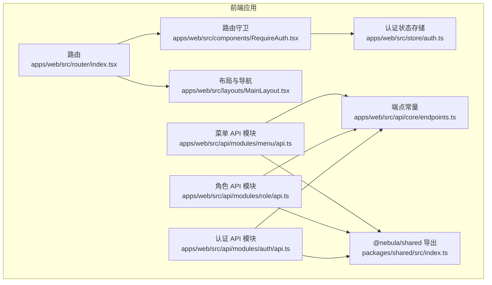
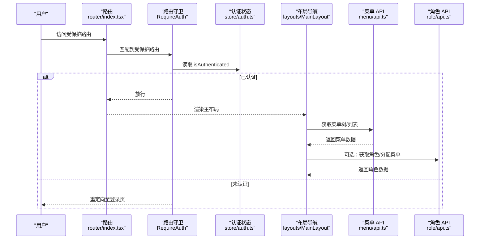
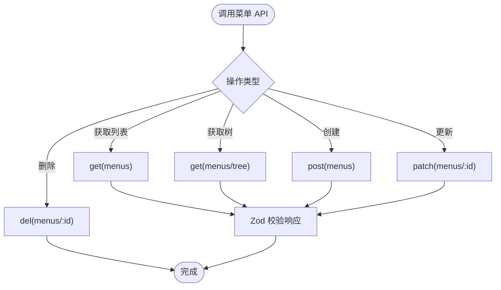
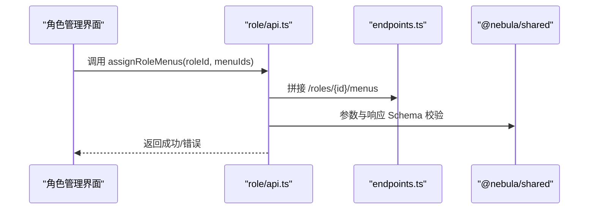
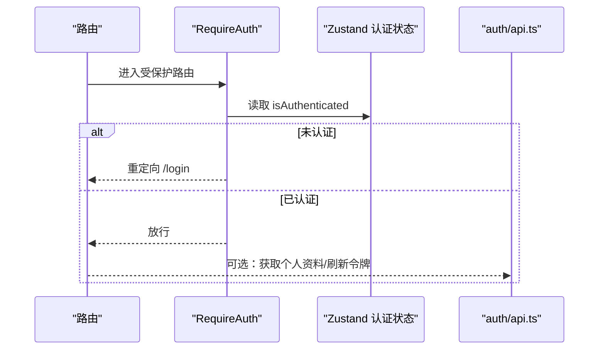
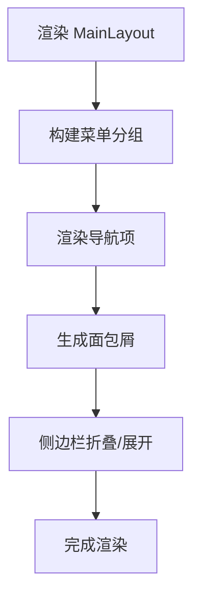
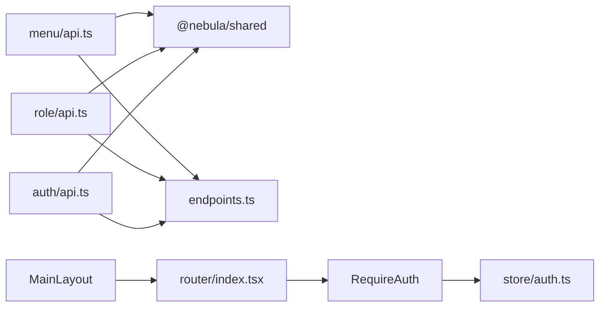

# 菜单权限模块 API

<cite>
**本文引用的文件**
- [apps/web/src/api/modules/menu/api.ts](file://apps/web/src/api/modules/menu/api.ts)
- [apps/web/src/api/modules/role/api.ts](file://apps/web/src/api/modules/role/api.ts)
- [apps/web/src/api/modules/auth/api.ts](file://apps/web/src/api/modules/auth/api.ts)
- [apps/web/src/router/index.tsx](file://apps/web/src/router/index.tsx)
- [apps/web/src/store/auth.ts](file://apps/web/src/store/auth.ts)
- [apps/web/src/components/RequireAuth.tsx](file://apps/web/src/components/RequireAuth.tsx)
- [apps/web/src/layouts/MainLayout.tsx](file://apps/web/src/layouts/MainLayout.tsx)
- [apps/web/src/api/core/endpoints.ts](file://apps/web/src/api/core/endpoints.ts)
- [packages/shared/src/index.ts](file://packages/shared/src/index.ts)
</cite>

## 目录

1. [简介](#简介)
2. [项目结构](#项目结构)
3. [核心组件](#核心组件)
4. [架构总览](#架构总览)
5. [详细组件分析](#详细组件分析)
6. [依赖关系分析](#依赖关系分析)
7. [性能考虑](#性能考虑)
8. [故障排查指南](#故障排查指南)
9. [结论](#结论)
10. [附录](#附录)

## 简介

本文件面向前端“菜单权限模块”的 API 设计与实现，覆盖菜单树形结构、权限节点与角色分配的接口调用方式；阐述菜单权限的动态加载、权限验证与访问控制策略；提供菜单导航、权限判断与路由守卫的集成示例；并讨论 RBAC 权限模型在前端的落地与性能优化方案。

## 项目结构

前端采用模块化组织，菜单与角色权限相关 API 分别位于独立模块中，并通过统一的端点常量进行集中管理。路由层使用 React Router v6 的嵌套路由与路由守卫，配合全局状态管理实现认证态与访问控制。

图表来源

- [apps/web/src/router/index.tsx:1-51](file://apps/web/src/router/index.tsx#L1-L51)
- [apps/web/src/layouts/MainLayout.tsx:1-317](file://apps/web/src/layouts/MainLayout.tsx#L1-L317)
- [apps/web/src/components/RequireAuth.tsx:1-14](file://apps/web/src/components/RequireAuth.tsx#L1-L14)
- [apps/web/src/store/auth.ts:1-64](file://apps/web/src/store/auth.ts#L1-L64)
- [apps/web/src/api/core/endpoints.ts:1-21](file://apps/web/src/api/core/endpoints.ts#L1-L21)
- [apps/web/src/api/modules/menu/api.ts:1-33](file://apps/web/src/api/modules/menu/api.ts#L1-L33)
- [apps/web/src/api/modules/role/api.ts:1-32](file://apps/web/src/api/modules/role/api.ts#L1-L32)
- [apps/web/src/api/modules/auth/api.ts:1-45](file://apps/web/src/api/modules/auth/api.ts#L1-L45)
- [packages/shared/src/index.ts:1-15](file://packages/shared/src/index.ts#L1-L15)

章节来源

- [apps/web/src/router/index.tsx:1-51](file://apps/web/src/router/index.tsx#L1-L51)
- [apps/web/src/layouts/MainLayout.tsx:1-317](file://apps/web/src/layouts/MainLayout.tsx#L1-L317)
- [apps/web/src/components/RequireAuth.tsx:1-14](file://apps/web/src/components/RequireAuth.tsx#L1-L14)
- [apps/web/src/store/auth.ts:1-64](file://apps/web/src/store/auth.ts#L1-L64)
- [apps/web/src/api/core/endpoints.ts:1-21](file://apps/web/src/api/core/endpoints.ts#L1-L21)
- [apps/web/src/api/modules/menu/api.ts:1-33](file://apps/web/src/api/modules/menu/api.ts#L1-L33)
- [apps/web/src/api/modules/role/api.ts:1-32](file://apps/web/src/api/modules/role/api.ts#L1-L32)
- [apps/web/src/api/modules/auth/api.ts:1-45](file://apps/web/src/api/modules/auth/api.ts#L1-L45)
- [packages/shared/src/index.ts:1-15](file://packages/shared/src/index.ts#L1-L15)

## 核心组件

- 菜单 API 模块：提供菜单列表、菜单树、创建、更新、删除等能力，返回类型由共享 Schema 校验。
- 角色 API 模块：提供角色列表、创建、更新、为角色分配菜单等能力，返回类型由共享 Schema 校验。
- 认证 API 模块：提供验证码、注册、登录、刷新令牌、登出、获取个人资料等能力。
- 路由与守卫：通过 RequireAuth 实现受保护路由，结合全局认证状态决定是否放行。
- 布局与导航：MainLayout 定义菜单分组与导航项，承载面包屑与侧边栏交互。
- 端点常量：统一管理后端 API 基础路径与各模块端点，便于维护与替换。
- 共享类型：通过 @nebula/shared 提供认证、用户、菜单、角色、字典等 Schema 与类型导出。

章节来源

- [apps/web/src/api/modules/menu/api.ts:14-32](file://apps/web/src/api/modules/menu/api.ts#L14-L32)
- [apps/web/src/api/modules/role/api.ts:13-31](file://apps/web/src/api/modules/role/api.ts#L13-L31)
- [apps/web/src/api/modules/auth/api.ts:20-44](file://apps/web/src/api/modules/auth/api.ts#L20-L44)
- [apps/web/src/components/RequireAuth.tsx:4-12](file://apps/web/src/components/RequireAuth.tsx#L4-L12)
- [apps/web/src/layouts/MainLayout.tsx:32-46](file://apps/web/src/layouts/MainLayout.tsx#L32-L46)
- [apps/web/src/api/core/endpoints.ts:3-20](file://apps/web/src/api/core/endpoints.ts#L3-L20)
- [packages/shared/src/index.ts:4-11](file://packages/shared/src/index.ts#L4-L11)

## 架构总览

下图展示菜单权限模块在前端的整体调用链路：路由层负责页面级访问控制，布局层负责菜单导航与面包屑，API 层负责与后端交互，状态层负责认证态与持久化。

图表来源

- [apps/web/src/router/index.tsx:12-47](file://apps/web/src/router/index.tsx#L12-L47)
- [apps/web/src/components/RequireAuth.tsx:4-12](file://apps/web/src/components/RequireAuth.tsx#L4-L12)
- [apps/web/src/store/auth.ts:30-63](file://apps/web/src/store/auth.ts#L30-L63)
- [apps/web/src/layouts/MainLayout.tsx:32-46](file://apps/web/src/layouts/MainLayout.tsx#L32-L46)
- [apps/web/src/api/modules/menu/api.ts:14-20](file://apps/web/src/api/modules/menu/api.ts#L14-L20)
- [apps/web/src/api/modules/role/api.ts:13-27](file://apps/web/src/api/modules/role/api.ts#L13-L27)

## 详细组件分析

### 菜单 API 模块

- 接口职责
  - 获取菜单列表：用于展示扁平菜单集合。
  - 获取菜单树：用于构建层级化的导航树。
  - 创建/更新/删除菜单：用于后台管理。
- 数据校验
  - 使用共享 Schema 对请求参数与响应进行编译时与运行时校验，确保前后端契约一致。
- 错误处理
  - 通过统一 HTTP 封装与错误拦截器处理网络异常与业务错误，具体实现可参考 HTTP 核心模块（此处不直接分析具体实现）。

图表来源

- [apps/web/src/api/modules/menu/api.ts:14-32](file://apps/web/src/api/modules/menu/api.ts#L14-L32)
- [apps/web/src/api/core/endpoints.ts:17](file://apps/web/src/api/core/endpoints.ts#L17)
- [packages/shared/src/index.ts:6](file://packages/shared/src/index.ts#L6)

章节来源

- [apps/web/src/api/modules/menu/api.ts:14-32](file://apps/web/src/api/modules/menu/api.ts#L14-L32)
- [apps/web/src/api/core/endpoints.ts:17](file://apps/web/src/api/core/endpoints.ts#L17)
- [packages/shared/src/index.ts:6](file://packages/shared/src/index.ts#L6)

### 角色 API 模块

- 接口职责
  - 获取角色列表：用于角色管理界面。
  - 创建/更新/删除角色：用于后台管理。
  - 为角色分配菜单：建立角色与菜单的授权关系。
- 数据校验
  - 使用共享 Schema 对请求参数与响应进行编译时与运行时校验。

图表来源

- [apps/web/src/api/modules/role/api.ts:25-27](file://apps/web/src/api/modules/role/api.ts#L25-L27)
- [apps/web/src/api/core/endpoints.ts:18](file://apps/web/src/api/core/endpoints.ts#L18)
- [packages/shared/src/index.ts:7](file://packages/shared/src/index.ts#L7)

章节来源

- [apps/web/src/api/modules/role/api.ts:13-31](file://apps/web/src/api/modules/role/api.ts#L13-L31)
- [apps/web/src/api/core/endpoints.ts:18](file://apps/web/src/api/core/endpoints.ts#L18)
- [packages/shared/src/index.ts:7](file://packages/shared/src/index.ts#L7)

### 认证与路由守卫

- 路由守卫
  - RequireAuth 读取全局认证状态，未认证则重定向至登录页。
- 认证状态存储
  - 使用 Zustand 管理 accessToken、refreshToken、用户信息与认证态，并持久化部分字段。
- 登录/登出流程
  - 登录成功后写入令牌与认证态；登出时清理状态并跳转登录页。

图表来源

- [apps/web/src/components/RequireAuth.tsx:4-12](file://apps/web/src/components/RequireAuth.tsx#L4-L12)
- [apps/web/src/store/auth.ts:30-63](file://apps/web/src/store/auth.ts#L30-L63)
- [apps/web/src/api/modules/auth/api.ts:24-44](file://apps/web/src/api/modules/auth/api.ts#L24-L44)

章节来源

- [apps/web/src/components/RequireAuth.tsx:1-14](file://apps/web/src/components/RequireAuth.tsx#L1-L14)
- [apps/web/src/store/auth.ts:1-64](file://apps/web/src/store/auth.ts#L1-L64)
- [apps/web/src/api/modules/auth/api.ts:1-45](file://apps/web/src/api/modules/auth/api.ts#L1-L45)

### 布局与导航

- 菜单分组与导航项
  - 通过静态配置定义“概览”“系统管理”等分组与子项，支持图标与路径映射。
- 面包屑
  - 基于当前路径生成面包屑标签，提升导航体验。
- 侧边栏交互
  - 支持移动端抽屉与桌面端折叠切换，保持一致的导航行为。

图表来源

- [apps/web/src/layouts/MainLayout.tsx:32-46](file://apps/web/src/layouts/MainLayout.tsx#L32-L46)
- [apps/web/src/layouts/MainLayout.tsx:49-72](file://apps/web/src/layouts/MainLayout.tsx#L49-L72)
- [apps/web/src/layouts/MainLayout.tsx:191-273](file://apps/web/src/layouts/MainLayout.tsx#L191-L273)

章节来源

- [apps/web/src/layouts/MainLayout.tsx:1-317](file://apps/web/src/layouts/MainLayout.tsx#L1-L317)

### 端点常量与共享类型

- 端点常量
  - 统一管理后端基础地址与各模块端点，便于替换与测试。
- 共享类型
  - 通过 @nebula/shared 导出认证、用户、菜单、角色、字典等 Schema 与类型，保证前后端一致性。

章节来源

- [apps/web/src/api/core/endpoints.ts:1-21](file://apps/web/src/api/core/endpoints.ts#L1-L21)
- [packages/shared/src/index.ts:1-15](file://packages/shared/src/index.ts#L1-L15)

## 依赖关系分析

- 模块内聚性
  - 菜单与角色 API 各自封装，职责清晰，复用共享 Schema。
- 外部依赖
  - 依赖 @nebula/shared 提供的类型与 Schema。
  - 依赖路由与状态管理库（React Router、Zustand）。
- 路由耦合
  - 路由守卫与认证状态强耦合，确保受保护路由的安全性。
- 端点集中化
  - 端点常量集中管理，降低硬编码风险，便于迁移。

图表来源

- [apps/web/src/api/modules/menu/api.ts:1-10](file://apps/web/src/api/modules/menu/api.ts#L1-L10)
- [apps/web/src/api/modules/role/api.ts:1-10](file://apps/web/src/api/modules/role/api.ts#L1-L10)
- [apps/web/src/api/modules/auth/api.ts:8-18](file://apps/web/src/api/modules/auth/api.ts#L8-L18)
- [apps/web/src/api/core/endpoints.ts:1-21](file://apps/web/src/api/core/endpoints.ts#L1-L21)
- [apps/web/src/components/RequireAuth.tsx:1-14](file://apps/web/src/components/RequireAuth.tsx#L1-L14)
- [apps/web/src/store/auth.ts:1-64](file://apps/web/src/store/auth.ts#L1-L64)
- [apps/web/src/router/index.tsx:1-51](file://apps/web/src/router/index.tsx#L1-L51)
- [apps/web/src/layouts/MainLayout.tsx:1-317](file://apps/web/src/layouts/MainLayout.tsx#L1-L317)

章节来源

- [apps/web/src/api/modules/menu/api.ts:1-33](file://apps/web/src/api/modules/menu/api.ts#L1-L33)
- [apps/web/src/api/modules/role/api.ts:1-32](file://apps/web/src/api/modules/role/api.ts#L1-L32)
- [apps/web/src/api/modules/auth/api.ts:1-45](file://apps/web/src/api/modules/auth/api.ts#L1-L45)
- [apps/web/src/api/core/endpoints.ts:1-21](file://apps/web/src/api/core/endpoints.ts#L1-L21)
- [apps/web/src/components/RequireAuth.tsx:1-14](file://apps/web/src/components/RequireAuth.tsx#L1-L14)
- [apps/web/src/store/auth.ts:1-64](file://apps/web/src/store/auth.ts#L1-L64)
- [apps/web/src/router/index.tsx:1-51](file://apps/web/src/router/index.tsx#L1-L51)
- [apps/web/src/layouts/MainLayout.tsx:1-317](file://apps/web/src/layouts/MainLayout.tsx#L1-L317)

## 性能考虑

- 状态持久化
  - 认证状态仅持久化必要字段，避免存储敏感或冗余数据，减少本地存储压力。
- 路由守卫轻量化
  - 守卫仅做布尔判断，不触发额外网络请求，降低首屏阻塞。
- 导航懒加载
  - 页面组件按需加载，结合路由嵌套减少不必要的渲染。
- 缓存与去抖
  - 在实际业务中建议对菜单树与角色数据进行缓存与去抖，避免频繁重复请求。
- 批量授权
  - 角色分配菜单时尽量批量提交，减少往返次数。

## 故障排查指南

- 无法进入受保护路由
  - 检查认证状态是否已设置，确认令牌是否过期或被清理。
- 菜单树为空
  - 确认后端菜单接口可用，检查网络请求与响应 Schema 是否匹配。
- 角色分配失败
  - 校验传入的菜单 ID 列表是否有效，确认后端权限校验逻辑。
- 登录后仍提示未登录
  - 检查本地持久化状态是否正确恢复，确认 onRehydrateStorage 回调执行情况。

章节来源

- [apps/web/src/components/RequireAuth.tsx:4-12](file://apps/web/src/components/RequireAuth.tsx#L4-L12)
- [apps/web/src/store/auth.ts:48-63](file://apps/web/src/store/auth.ts#L48-L63)
- [apps/web/src/api/modules/menu/api.ts:14-20](file://apps/web/src/api/modules/menu/api.ts#L14-L20)
- [apps/web/src/api/modules/role/api.ts:25-27](file://apps/web/src/api/modules/role/api.ts#L25-L27)

## 结论

菜单权限模块通过清晰的模块划分、统一的端点管理与严格的类型校验，实现了菜单树形结构、权限节点与角色分配的完整闭环。结合路由守卫与状态持久化，提供了安全且可维护的前端权限体系。后续可在菜单与角色数据层面引入缓存与批量操作，进一步优化性能与用户体验。

## 附录

### API 端点一览（基于端点常量）

- 认证相关
  - 获取验证码：GET /auth/captcha
  - 用户注册：POST /auth/register
  - 用户登录：POST /auth/login
  - 刷新令牌：POST /auth/refresh
  - 用户登出：POST /auth/logout
  - 获取个人资料：GET /auth/profile
- 菜单相关
  - 获取菜单列表：GET /menus
  - 获取菜单树：GET /menus/tree
  - 新增菜单：POST /menus
  - 更新菜单：PATCH /menus/{id}
  - 删除菜单：DELETE /menus/{id}
- 角色相关
  - 获取角色列表：GET /roles
  - 新增角色：POST /roles
  - 更新角色：PATCH /roles/{id}
  - 为角色分配菜单：POST /roles/{id}/menus
  - 删除角色：DELETE /roles/{id}

章节来源

- [apps/web/src/api/core/endpoints.ts:3-20](file://apps/web/src/api/core/endpoints.ts#L3-L20)
