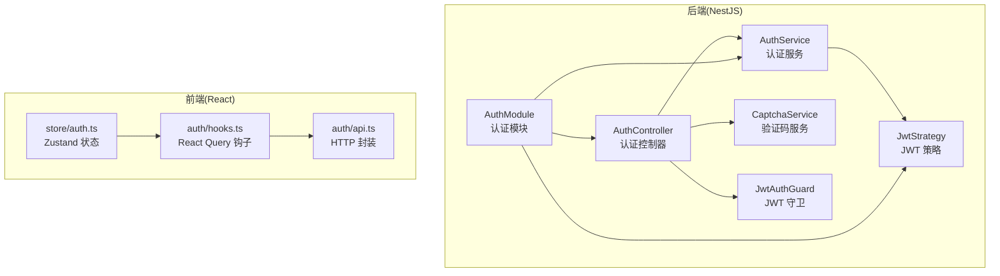
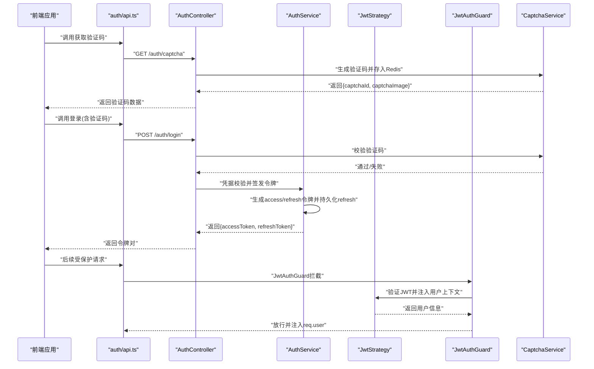
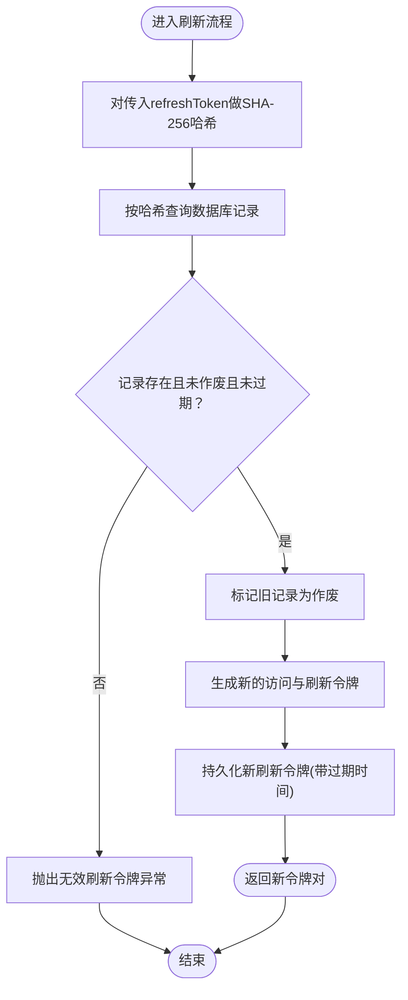
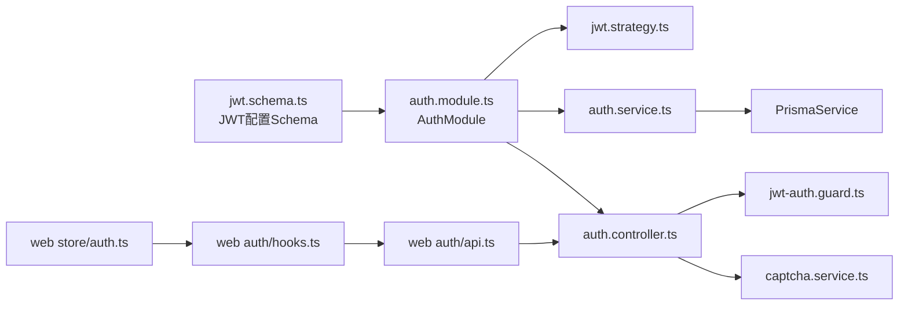

# 认证模块 API

<cite>
**本文引用的文件**
- [apps/nestjs-server/src/modules/auth/auth.controller.ts](file://apps/nestjs-server/src/modules/auth/auth.controller.ts)
- [apps/nestjs-server/src/modules/auth/auth.service.ts](file://apps/nestjs-server/src/modules/auth/auth.service.ts)
- [apps/nestjs-server/src/modules/auth/dto/auth.dto.ts](file://apps/nestjs-server/src/modules/auth/dto/auth.dto.ts)
- [apps/nestjs-server/src/modules/auth/strategies/jwt.strategy.ts](file://apps/nestjs-server/src/modules/auth/strategies/jwt.strategy.ts)
- [apps/nestjs-server/src/common/guards/jwt-auth.guard.ts](file://apps/nestjs-server/src/common/guards/jwt-auth.guard.ts)
- [apps/nestjs-server/src/modules/auth/captcha.service.ts](file://apps/nestjs-server/src/modules/auth/captcha.service.ts)
- [apps/web/src/api/modules/auth/api.ts](file://apps/web/src/api/modules/auth/api.ts)
- [apps/web/src/api/modules/auth/hooks.ts](file://apps/web/src/api/modules/auth/hooks.ts)
- [apps/web/src/store/auth.ts](file://apps/web/src/store/auth.ts)
- [apps/nestjs-server/src/config/schemas/jwt.schema.ts](file://apps/nestjs-server/src/config/schemas/jwt.schema.ts)
- [apps/nestjs-server/src/common/decorators/public.decorator.ts](file://apps/nestjs-server/src/common/decorators/public.decorator.ts)
- [apps/nestjs-server/src/common/enums/biz-code.enum.ts](file://apps/nestjs-server/src/common/enums/biz-code.enum.ts)
- [apps/nestjs-server/src/modules/auth/auth.module.ts](file://apps/nestjs-server/src/modules/auth/auth.module.ts)
- [packages/shared/src/schemas/index.ts](file://packages/shared/src/schemas/index.ts)
</cite>

## 目录
1. [简介](#简介)
2. [项目结构](#项目结构)
3. [核心组件](#核心组件)
4. [架构总览](#架构总览)
5. [详细组件分析](#详细组件分析)
6. [依赖关系分析](#依赖关系分析)
7. [性能与安全考量](#性能与安全考量)
8. [故障排查指南](#故障排查指南)
9. [结论](#结论)
10. [附录：API 定义与调用示例](#附录api-定义与调用示例)

## 简介
本文件面向前端与后端开发者，系统化梳理认证模块的 API 设计与实现，覆盖用户登录、注册、令牌刷新、登出与个人信息查询等核心能力；解释 JWT 令牌的签发、校验与刷新策略；总结错误处理机制与状态管理；并给出认证钩子函数的使用示例、最佳实践以及安全与性能优化建议。

## 项目结构
认证模块由后端 NestJS 服务与前端 React 应用协同组成：
- 后端提供认证控制器、服务、策略与守卫，并通过 DTO 与共享 Schema 统一约束请求/响应。
- 前端通过独立的 API 模块封装 HTTP 请求，配合 React Query 钩子与 Zustand 状态管理完成认证流程。

图表来源
- [apps/nestjs-server/src/modules/auth/auth.controller.ts:30-114](file://apps/nestjs-server/src/modules/auth/auth.controller.ts#L30-L114)
- [apps/nestjs-server/src/modules/auth/auth.service.ts:14-150](file://apps/nestjs-server/src/modules/auth/auth.service.ts#L14-L150)
- [apps/nestjs-server/src/modules/auth/strategies/jwt.strategy.ts:9-48](file://apps/nestjs-server/src/modules/auth/strategies/jwt.strategy.ts#L9-L48)
- [apps/nestjs-server/src/common/guards/jwt-auth.guard.ts:17-42](file://apps/nestjs-server/src/common/guards/jwt-auth.guard.ts#L17-L42)
- [apps/nestjs-server/src/modules/auth/captcha.service.ts:18-66](file://apps/nestjs-server/src/modules/auth/captcha.service.ts#L18-L66)
- [apps/web/src/api/modules/auth/api.ts:1-45](file://apps/web/src/api/modules/auth/api.ts#L1-L45)
- [apps/web/src/api/modules/auth/hooks.ts:1-49](file://apps/web/src/api/modules/auth/hooks.ts#L1-L49)
- [apps/web/src/store/auth.ts:30-63](file://apps/web/src/store/auth.ts#L30-L63)

章节来源
- [apps/nestjs-server/src/modules/auth/auth.controller.ts:1-115](file://apps/nestjs-server/src/modules/auth/auth.controller.ts#L1-L115)
- [apps/web/src/api/modules/auth/api.ts:1-45](file://apps/web/src/api/modules/auth/api.ts#L1-L45)

## 核心组件
- 认证控制器：暴露验证码、注册、登录、刷新、登出、个人资料等接口，统一使用 Swagger 标注与全局错误装饰器。
- 认证服务：负责凭据校验、令牌签发与刷新、登出撤销、密码哈希与令牌哈希等。
- JWT 策略与守卫：从请求头解析 Bearer 令牌，校验签名与有效期，并注入用户上下文；公开接口可通过装饰器豁免鉴权。
- 验证码服务：基于 SVG-Captcha 生成图片验证码，使用 Redis 存储并带 TTL，一次性使用。
- 前端 API 与钩子：统一封装 HTTP 请求，结合 React Query 与 Zustand 实现状态同步与缓存失效。
- 共享 Schema：前后端通过共享包的模式定义保证字段一致性与类型安全。

章节来源
- [apps/nestjs-server/src/modules/auth/auth.controller.ts:28-114](file://apps/nestjs-server/src/modules/auth/auth.controller.ts#L28-L114)
- [apps/nestjs-server/src/modules/auth/auth.service.ts:14-150](file://apps/nestjs-server/src/modules/auth/auth.service.ts#L14-L150)
- [apps/nestjs-server/src/modules/auth/strategies/jwt.strategy.ts:9-48](file://apps/nestjs-server/src/modules/auth/strategies/jwt.strategy.ts#L9-L48)
- [apps/nestjs-server/src/common/guards/jwt-auth.guard.ts:17-42](file://apps/nestjs-server/src/common/guards/jwt-auth.guard.ts#L17-L42)
- [apps/nestjs-server/src/modules/auth/captcha.service.ts:18-66](file://apps/nestjs-server/src/modules/auth/captcha.service.ts#L18-L66)
- [apps/web/src/api/modules/auth/api.ts:1-45](file://apps/web/src/api/modules/auth/api.ts#L1-L45)
- [apps/web/src/api/modules/auth/hooks.ts:1-49](file://apps/web/src/api/modules/auth/hooks.ts#L1-L49)
- [apps/web/src/store/auth.ts:30-63](file://apps/web/src/store/auth.ts#L30-L63)
- [packages/shared/src/schemas/index.ts:1-8](file://packages/shared/src/schemas/index.ts#L1-L8)

## 架构总览
认证模块采用“控制器-服务-策略-守卫”的分层设计，配合 DTO 与共享 Schema 实现前后端契约一致。JWT 作为无状态认证载体，配合刷新令牌与数据库持久化，实现安全且可用的会话管理。

图表来源
- [apps/nestjs-server/src/modules/auth/auth.controller.ts:38-113](file://apps/nestjs-server/src/modules/auth/auth.controller.ts#L38-L113)
- [apps/nestjs-server/src/modules/auth/auth.service.ts:29-142](file://apps/nestjs-server/src/modules/auth/auth.service.ts#L29-L142)
- [apps/nestjs-server/src/modules/auth/strategies/jwt.strategy.ts:22-47](file://apps/nestjs-server/src/modules/auth/strategies/jwt.strategy.ts#L22-L47)
- [apps/nestjs-server/src/common/guards/jwt-auth.guard.ts:23-41](file://apps/nestjs-server/src/common/guards/jwt-auth.guard.ts#L23-L41)
- [apps/nestjs-server/src/modules/auth/captcha.service.ts:24-65](file://apps/nestjs-server/src/modules/auth/captcha.service.ts#L24-L65)
- [apps/web/src/api/modules/auth/api.ts:20-31](file://apps/web/src/api/modules/auth/api.ts#L20-L31)

## 详细组件分析

### 控制器层：接口与流程
- 获取验证码：生成 SVG 图片与唯一 ID，返回给前端用于登录时校验。
- 用户注册：校验邮箱与用户名唯一性，创建用户并返回令牌对。
- 用户登录：先校验验证码，再进行凭据校验，成功后签发访问与刷新令牌。
- 刷新令牌：使用刷新令牌换取新的访问与刷新令牌，旧刷新令牌立即作废。
- 退出登录：撤销当前用户的所有未作废刷新令牌。
- 获取个人资料：基于已认证用户上下文返回用户信息。

章节来源
- [apps/nestjs-server/src/modules/auth/auth.controller.ts:38-113](file://apps/nestjs-server/src/modules/auth/auth.controller.ts#L38-L113)

### 服务层：令牌签发与刷新策略
- 登录与注册：统一走生成令牌流程，签发访问令牌与刷新令牌，刷新令牌持久化到数据库并做哈希存储。
- 刷新逻辑：根据传入的刷新令牌计算哈希，查询数据库记录；若存在、未作废且未过期，则标记旧记录作废并签发新令牌。
- 登出逻辑：批量将当前用户未作废的刷新令牌标记为作废，使旧令牌失效。
- 令牌哈希：使用 SHA-256 对刷新令牌进行哈希存储，提升安全性。

图表来源
- [apps/nestjs-server/src/modules/auth/auth.service.ts:64-84](file://apps/nestjs-server/src/modules/auth/auth.service.ts#L64-L84)
- [apps/nestjs-server/src/modules/auth/auth.service.ts:105-142](file://apps/nestjs-server/src/modules/auth/auth.service.ts#L105-L142)

章节来源
- [apps/nestjs-server/src/modules/auth/auth.service.ts:29-142](file://apps/nestjs-server/src/modules/auth/auth.service.ts#L29-L142)

### JWT 策略与守卫：认证上下文注入
- 策略：从 Authorization 头部提取 Bearer 令牌，使用配置的密钥验证签名与有效期，并从数据库加载用户角色信息注入上下文。
- 守卫：默认启用 JWT 校验；通过公共装饰器标注的路由可豁免鉴权；鉴权失败统一抛出业务异常。

章节来源
- [apps/nestjs-server/src/modules/auth/strategies/jwt.strategy.ts:22-47](file://apps/nestjs-server/src/modules/auth/strategies/jwt.strategy.ts#L22-L47)
- [apps/nestjs-server/src/common/guards/jwt-auth.guard.ts:23-41](file://apps/nestjs-server/src/common/guards/jwt-auth.guard.ts#L23-L41)
- [apps/nestjs-server/src/common/decorators/public.decorator.ts:3-4](file://apps/nestjs-server/src/common/decorators/public.decorator.ts#L3-L4)

### 验证码服务：防暴力破解与一次性使用
- 生成：使用 SVG-Captcha 生成图形验证码，随机 UUID 作为键，小写验证码存入 Redis 并设置 TTL。
- 校验：读取 Redis 中的验证码，匹配则删除键，实现一次性使用；不存在或过期统一视为无效。

章节来源
- [apps/nestjs-server/src/modules/auth/captcha.service.ts:24-65](file://apps/nestjs-server/src/modules/auth/captcha.service.ts#L24-L65)

### 前端集成：API 封装与状态管理
- API 封装：对每个认证接口进行参数解析与响应解构，统一使用共享 Schema。
- React Query 钩子：useCaptcha、useLogin、useRegister、useLogout、useProfile；登录成功写入令牌，登出清理状态并清空缓存。
- Zustand 状态：持久化保存访问令牌与刷新令牌，支持恢复状态并标记认证态。

章节来源
- [apps/web/src/api/modules/auth/api.ts:20-42](file://apps/web/src/api/modules/auth/api.ts#L20-L42)
- [apps/web/src/api/modules/auth/hooks.ts:5-48](file://apps/web/src/api/modules/auth/hooks.ts#L5-L48)
- [apps/web/src/store/auth.ts:30-63](file://apps/web/src/store/auth.ts#L30-L63)

## 依赖关系分析
- 后端模块装配：AuthModule 导入 Passport/JWT 模块，注册异步配置以从配置中心读取密钥与过期时间；导出 AuthService 供其他模块使用。
- 配置约束：JWT 配置要求密钥长度最小值、默认访问令牌与刷新令牌过期时间。
- 错误码：统一从共享包导出，前后端一致。

图表来源
- [apps/nestjs-server/src/modules/auth/auth.module.ts:12-34](file://apps/nestjs-server/src/modules/auth/auth.module.ts#L12-L34)
- [apps/nestjs-server/src/config/schemas/jwt.schema.ts:3-7](file://apps/nestjs-server/src/config/schemas/jwt.schema.ts#L3-L7)
- [apps/nestjs-server/src/modules/auth/auth.controller.ts:30-114](file://apps/nestjs-server/src/modules/auth/auth.controller.ts#L30-L114)
- [apps/nestjs-server/src/modules/auth/auth.service.ts:14-21](file://apps/nestjs-server/src/modules/auth/auth.service.ts#L14-L21)
- [apps/nestjs-server/src/modules/auth/strategies/jwt.strategy.ts:9-20](file://apps/nestjs-server/src/modules/auth/strategies/jwt.strategy.ts#L9-L20)
- [apps/web/src/api/modules/auth/api.ts:1-18](file://apps/web/src/api/modules/auth/api.ts#L1-L18)

章节来源
- [apps/nestjs-server/src/modules/auth/auth.module.ts:12-34](file://apps/nestjs-server/src/modules/auth/auth.module.ts#L12-L34)
- [apps/nestjs-server/src/config/schemas/jwt.schema.ts:3-7](file://apps/nestjs-server/src/config/schemas/jwt.schema.ts#L3-L7)
- [apps/nestjs-server/src/common/enums/biz-code.enum.ts](file://apps/nestjs-server/src/common/enums/biz-code.enum.ts#L15)

## 性能与安全考量
- 性能
  - 登录与注册并发签发访问与刷新令牌采用并行处理，减少 RTT。
  - 验证码使用 Redis 存储并带 TTL，避免数据库压力。
  - 前端使用 React Query 缓存与失效策略，降低重复请求。
- 安全
  - 刷新令牌仅在数据库中持久化并做哈希存储，防止明文泄露。
  - 登出时撤销当前用户所有未作废刷新令牌，确保会话可控。
  - JWT 密钥长度限制与默认过期时间配置，降低弱密钥风险。
  - 公共接口通过装饰器显式豁免鉴权，避免误伤。
- 可靠性
  - 验证码一次性使用，过期即失效，有效对抗暴力破解。
  - 统一业务异常与状态码，便于前端处理与日志追踪。

[本节为通用指导，不直接分析具体文件]

## 故障排查指南
- 无效凭据：登录时凭据不正确将触发认证异常，检查账号与密码是否匹配。
- 验证码问题：验证码不存在或已过期统一返回验证码无效，确认前端是否正确提交 captchaId 与 captchaCode。
- 无效刷新令牌：刷新时若令牌不存在、已作废或已过期，将触发异常；确认是否已登出导致旧令牌失效。
- 未授权访问：受保护路由未携带有效 JWT 或用户不存在时，守卫将抛出未授权异常。
- 业务状态码：前后端统一从共享包导出，定位问题时优先核对状态码与消息映射。

章节来源
- [apps/nestjs-server/src/modules/auth/auth.service.ts:31-32](file://apps/nestjs-server/src/modules/auth/auth.service.ts#L31-L32)
- [apps/nestjs-server/src/modules/auth/captcha.service.ts:52-61](file://apps/nestjs-server/src/modules/auth/captcha.service.ts#L52-L61)
- [apps/nestjs-server/src/common/guards/jwt-auth.guard.ts:36-41](file://apps/nestjs-server/src/common/guards/jwt-auth.guard.ts#L36-L41)
- [apps/nestjs-server/src/common/enums/biz-code.enum.ts](file://apps/nestjs-server/src/common/enums/biz-code.enum.ts#L15)

## 结论
本认证模块通过清晰的分层设计与前后端契约一致的 Schema，实现了高可用、可维护的认证体系。JWT 与刷新令牌组合兼顾了安全性与用户体验；前端通过 React Query 与 Zustand 提升交互效率与状态一致性。建议在生产环境强化密钥轮换、速率限制与审计日志，持续优化令牌生命周期与缓存策略。

[本节为总结性内容，不直接分析具体文件]

## 附录：API 定义与调用示例

### 接口一览
- GET /auth/captcha
  - 功能：获取验证码图片与 ID
  - 返回：验证码 ID 与 SVG 图片内容
  - 限流：短时间窗口内限制调用次数
- POST /auth/register
  - 功能：注册新用户并自动登录
  - 参数：邮箱、用户名、密码
  - 返回：访问令牌与刷新令牌
- POST /auth/login
  - 功能：账号密码登录
  - 参数：账号（邮箱或用户名）、密码、验证码 ID 与验证码
  - 返回：访问令牌与刷新令牌
- POST /auth/refresh
  - 功能：使用刷新令牌换取新令牌
  - 参数：刷新令牌
  - 返回：新的访问令牌与刷新令牌
- POST /auth/logout
  - 功能：退出登录，撤销当前用户所有刷新令牌
  - 返回：无内容
- GET /auth/profile
  - 功能：获取当前用户信息
  - 返回：用户信息（不含密码）

章节来源
- [apps/nestjs-server/src/modules/auth/auth.controller.ts:38-113](file://apps/nestjs-server/src/modules/auth/auth.controller.ts#L38-L113)

### 前端调用示例与最佳实践
- 获取验证码：调用 getCaptcha，渲染图片并在登录表单中提交 captchaId 与 captchaCode。
- 注册/登录：使用 useRegister/useLogin 钩子，成功后通过 useAuthStore.setTokens 写入令牌，并使 profile 查询生效。
- 刷新令牌：在访问令牌即将过期前，使用 refreshToken 接口换取新令牌，避免频繁登录。
- 登出：调用 useLogout，清理本地状态与缓存，确保后续请求不再携带令牌。
- 个人资料：使用 useProfile，在有 accessToken 时自动拉取并缓存。

章节来源
- [apps/web/src/api/modules/auth/api.ts:20-42](file://apps/web/src/api/modules/auth/api.ts#L20-L42)
- [apps/web/src/api/modules/auth/hooks.ts:5-48](file://apps/web/src/api/modules/auth/hooks.ts#L5-L48)
- [apps/web/src/store/auth.ts:36-46](file://apps/web/src/store/auth.ts#L36-L46)

### 数据模型与配置要点
- DTO 与 Schema：前后端通过共享包的模式定义保持一致，避免字段错配。
- JWT 配置：密钥长度最小值、访问令牌与刷新令牌过期时间、刷新密钥等均在配置 Schema 中约束。
- 业务状态码：统一从共享包导出，前后端一致。

章节来源
- [apps/nestjs-server/src/modules/auth/dto/auth.dto.ts:12-30](file://apps/nestjs-server/src/modules/auth/dto/auth.dto.ts#L12-L30)
- [apps/nestjs-server/src/config/schemas/jwt.schema.ts:3-7](file://apps/nestjs-server/src/config/schemas/jwt.schema.ts#L3-L7)
- [packages/shared/src/schemas/index.ts](file://packages/shared/src/schemas/index.ts#L1)