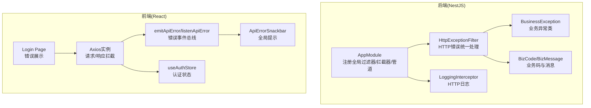
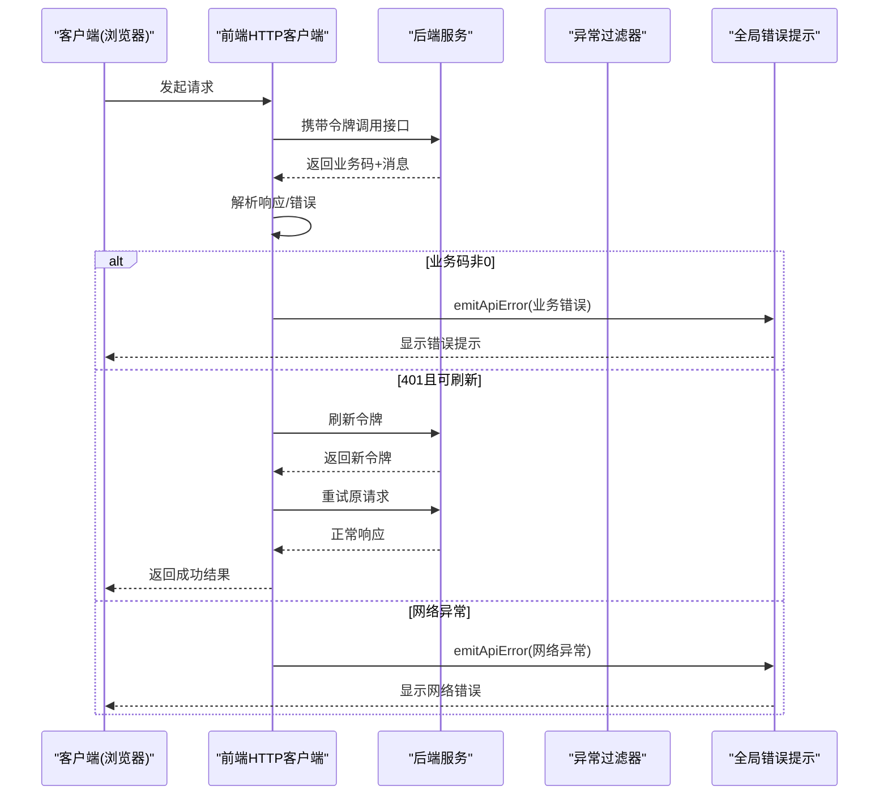
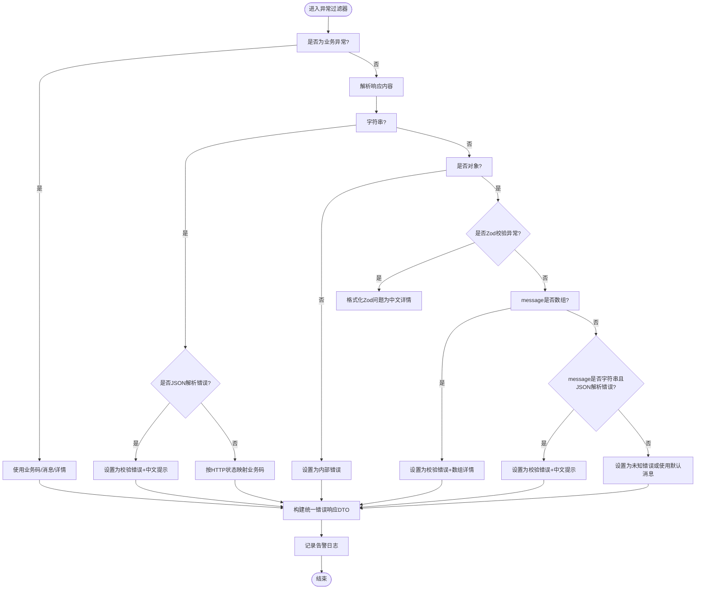
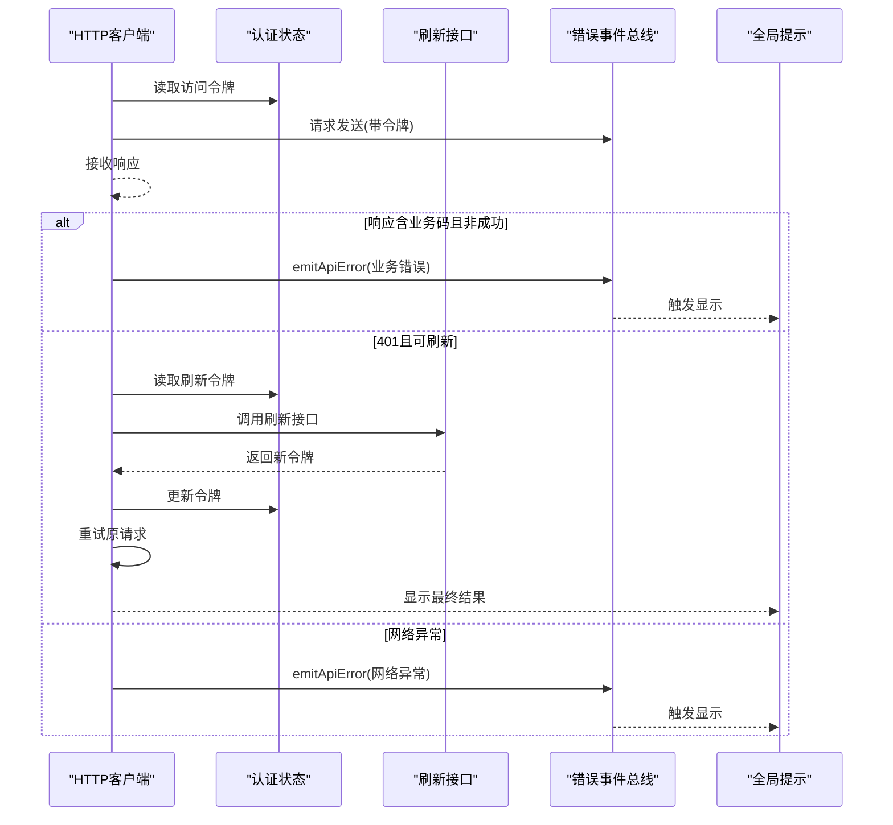
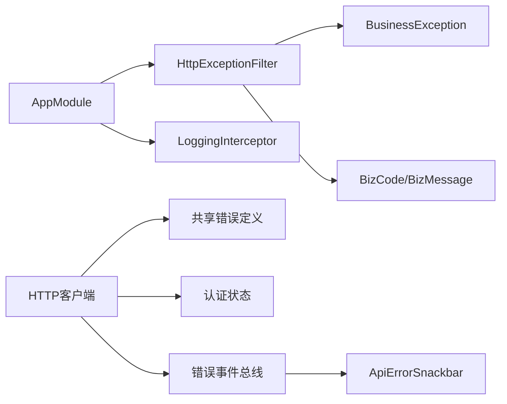

# 错误处理机制

<cite>
**本文引用的文件**
- [apps/nestjs-server/src/app.module.ts](file://apps/nestjs-server/src/app.module.ts)
- [apps/nestjs-server/src/common/filters/http-exception.filter.ts](file://apps/nestjs-server/src/common/filters/http-exception.filter.ts)
- [apps/nestjs-server/src/common/exceptions/business.exception.ts](file://apps/nestjs-server/src/common/exceptions/business.exception.ts)
- [apps/nestjs-server/src/common/enums/biz-code.enum.ts](file://apps/nestjs-server/src/common/enums/biz-code.enum.ts)
- [apps/nestjs-server/src/common/interceptors/logging.interceptor.ts](file://apps/nestjs-server/src/common/interceptors/logging.interceptor.ts)
- [apps/nestjs-server/src/modules/auth/auth.service.ts](file://apps/nestjs-server/src/modules/auth/auth.service.ts)
- [apps/web/src/api/core/http.ts](file://apps/web/src/api/core/http.ts)
- [apps/web/src/api/core/api-error.ts](file://apps/web/src/api/core/api-error.ts)
- [apps/web/src/components/ApiErrorSnackbar.tsx](file://apps/web/src/components/ApiErrorSnackbar.tsx)
- [apps/web/src/store/auth.ts](file://apps/web/src/store/auth.ts)
- [apps/web/src/pages/Login.tsx](file://apps/web/src/pages/Login.tsx)
- [apps/web/src/main.tsx](file://apps/web/src/main.tsx)
- [packages/shared/src/errors/index.ts](file://packages/shared/src/errors/index.ts)
</cite>

## 目录

1. [简介](#简介)
2. [项目结构](#项目结构)
3. [核心组件](#核心组件)
4. [架构总览](#架构总览)
5. [详细组件分析](#详细组件分析)
6. [依赖关系分析](#依赖关系分析)
7. [性能考量](#性能考量)
8. [故障排查指南](#故障排查指南)
9. [结论](#结论)
10. [附录](#附录)

## 简介

本文件系统化梳理了本项目的错误处理机制，覆盖后端 API 的错误捕获、分类与统一返回，前端 HTTP 客户端的错误拦截、自动鉴权刷新与用户提示，以及跨端一致的业务错误码与消息体系。重点包括：

- HTTP 错误码映射与业务码对齐
- 网络错误与鉴权刷新流程
- 业务逻辑错误的统一异常模型
- 全局错误拦截器与日志记录
- 用户体验优化：错误事件总线与 Snackbar 提示
- 错误恢复与调试建议

## 项目结构

围绕错误处理的关键目录与文件如下：

- 后端（NestJS）
  - 异常过滤器：统一捕获并格式化错误响应
  - 业务异常类：承载业务码与消息
  - 业务码枚举：前后端共享
  - 日志拦截器：记录请求/响应与耗时
  - 应用模块：注册全局过滤器、拦截器、管道与守卫
- 前端（React + Axios）
  - HTTP 客户端：请求拦截、响应拦截、鉴权刷新、错误抛出
  - 错误事件总线：统一派发业务错误
  - UI 组件：全局错误提示条
  - 状态管理：认证状态持久化与清理
  - 页面：登录页对错误的直观反馈

图表来源

- [apps/nestjs-server/src/app.module.ts:35-60](file://apps/nestjs-server/src/app.module.ts#L35-L60)
- [apps/nestjs-server/src/common/filters/http-exception.filter.ts:16-68](file://apps/nestjs-server/src/common/filters/http-exception.filter.ts#L16-L68)
- [apps/nestjs-server/src/common/exceptions/business.exception.ts:16-41](file://apps/nestjs-server/src/common/exceptions/business.exception.ts#L16-L41)
- [apps/nestjs-server/src/common/enums/biz-code.enum.ts:1-16](file://apps/nestjs-server/src/common/enums/biz-code.enum.ts#L1-L16)
- [apps/web/src/api/core/http.ts:94-179](file://apps/web/src/api/core/http.ts#L94-L179)
- [apps/web/src/api/core/api-error.ts:16-42](file://apps/web/src/api/core/api-error.ts#L16-L42)
- [apps/web/src/components/ApiErrorSnackbar.tsx:7-57](file://apps/web/src/components/ApiErrorSnackbar.tsx#L7-L57)
- [apps/web/src/store/auth.ts:30-63](file://apps/web/src/store/auth.ts#L30-L63)
- [apps/web/src/pages/Login.tsx:79-92](file://apps/web/src/pages/Login.tsx#L79-L92)

章节来源

- [apps/nestjs-server/src/app.module.ts:19-62](file://apps/nestjs-server/src/app.module.ts#L19-L62)
- [apps/web/src/main.tsx:12-22](file://apps/web/src/main.tsx#L12-L22)

## 核心组件

- 后端全局异常过滤器
  - 捕获所有 HttpException，区分业务异常与通用异常，进行业务码映射与消息格式化，并输出统一错误响应
  - 支持 Zod 校验异常与 class-validator 校验错误的细节提取
- 业务异常类
  - 统一携带业务码、消息与可选的字段级错误详情，自动计算对应 HTTP 状态码
- 业务码与消息
  - 通过共享包导出，前后端一致，避免歧义
- 前端 HTTP 客户端
  - 请求头注入令牌；响应拦截统一解析业务码并抛出业务异常；401 自动刷新令牌并重试；网络异常统一提示
- 错误事件总线
  - 将业务错误转换为浏览器自定义事件，供全局组件订阅与展示
- 全局错误提示
  - ApiErrorSnackbar 在顶部显示错误消息，支持自动消失与手动关闭
- 认证状态管理
  - 使用持久化状态保存令牌与用户信息，401 时清空并触发错误提示

章节来源

- [apps/nestjs-server/src/common/filters/http-exception.filter.ts:16-68](file://apps/nestjs-server/src/common/filters/http-exception.filter.ts#L16-L68)
- [apps/nestjs-server/src/common/exceptions/business.exception.ts:16-41](file://apps/nestjs-server/src/common/exceptions/business.exception.ts#L16-L41)
- [apps/nestjs-server/src/common/enums/biz-code.enum.ts:1-16](file://apps/nestjs-server/src/common/enums/biz-code.enum.ts#L1-L16)
- [apps/web/src/api/core/http.ts:94-179](file://apps/web/src/api/core/http.ts#L94-L179)
- [apps/web/src/api/core/api-error.ts:16-42](file://apps/web/src/api/core/api-error.ts#L16-L42)
- [apps/web/src/components/ApiErrorSnackbar.tsx:7-57](file://apps/web/src/components/ApiErrorSnackbar.tsx#L7-L57)
- [apps/web/src/store/auth.ts:30-63](file://apps/web/src/store/auth.ts#L30-L63)

## 架构总览

后端与前端的错误处理形成闭环：后端统一返回业务码与消息，前端解析并抛出业务异常，再通过事件总线驱动 UI 展示，必要时自动刷新令牌并重试。

图表来源

- [apps/web/src/api/core/http.ts:102-179](file://apps/web/src/api/core/http.ts#L102-L179)
- [apps/web/src/api/core/api-error.ts:16-32](file://apps/web/src/api/core/api-error.ts#L16-L32)
- [apps/web/src/components/ApiErrorSnackbar.tsx:7-57](file://apps/web/src/components/ApiErrorSnackbar.tsx#L7-L57)

## 详细组件分析

### 后端：全局异常过滤器与业务异常

- 捕获范围：所有 HttpException
- 处理策略：
  - 业务异常：直接使用异常内携带的业务码与消息，输出统一错误响应
  - 其他异常：解析响应内容，识别 JSON 解析错误、Zod 校验异常、class-validator 校验错误等，映射为业务码与消息；其他 HTTP 状态码按映射表转为通用业务码
  - 输出：统一的错误 DTO 结构，包含业务码、消息与可选的字段级详情
- 日志：记录请求方法、URL、状态码与耗时，便于问题定位

图表来源

- [apps/nestjs-server/src/common/filters/http-exception.filter.ts:20-145](file://apps/nestjs-server/src/common/filters/http-exception.filter.ts#L20-L145)

章节来源

- [apps/nestjs-server/src/common/filters/http-exception.filter.ts:16-208](file://apps/nestjs-server/src/common/filters/http-exception.filter.ts#L16-L208)
- [apps/nestjs-server/src/common/exceptions/business.exception.ts:16-41](file://apps/nestjs-server/src/common/exceptions/business.exception.ts#L16-L41)
- [apps/nestjs-server/src/common/enums/biz-code.enum.ts:1-16](file://apps/nestjs-server/src/common/enums/biz-code.enum.ts#L1-L16)
- [apps/nestjs-server/src/common/interceptors/logging.interceptor.ts:6-29](file://apps/nestjs-server/src/common/interceptors/logging.interceptor.ts#L6-L29)

### 前端：HTTP 客户端与错误事件总线

- 请求拦截：从状态管理读取访问令牌并注入 Authorization
- 响应拦截：
  - 若响应包含业务码且非成功：抛出业务异常并派发错误事件
  - 若响应无业务码：直接透传数据（兼容非业务接口）
  - 若响应无网络：抛出网络异常并派发错误事件
- 401 自动刷新：
  - 若存在刷新令牌且未在刷新中：并发队列排队等待刷新完成，刷新成功后重试原请求
  - 若刷新失败或无刷新令牌：清空认证状态并抛出错误
- 错误事件总线：将业务错误转换为浏览器自定义事件，避免组件间耦合
- UI 提示：ApiErrorSnackbar 订阅事件并在顶部显示，支持自动消失与手动关闭

图表来源

- [apps/web/src/api/core/http.ts:94-179](file://apps/web/src/api/core/http.ts#L94-L179)
- [apps/web/src/api/core/api-error.ts:16-32](file://apps/web/src/api/core/api-error.ts#L16-L32)
- [apps/web/src/components/ApiErrorSnackbar.tsx:7-57](file://apps/web/src/components/ApiErrorSnackbar.tsx#L7-L57)
- [apps/web/src/store/auth.ts:30-63](file://apps/web/src/store/auth.ts#L30-L63)

章节来源

- [apps/web/src/api/core/http.ts:1-236](file://apps/web/src/api/core/http.ts#L1-L236)
- [apps/web/src/api/core/api-error.ts:1-45](file://apps/web/src/api/core/api-error.ts#L1-L45)
- [apps/web/src/components/ApiErrorSnackbar.tsx:1-58](file://apps/web/src/components/ApiErrorSnackbar.tsx#L1-L58)
- [apps/web/src/store/auth.ts:1-64](file://apps/web/src/store/auth.ts#L1-L64)

### 业务模块示例：认证模块

- 登录/注册/刷新令牌/登出等场景均使用业务异常类抛出明确的业务码与消息
- 例如：凭证无效、邮箱已注册、用户名被占用、刷新令牌无效等
- 通过统一的业务异常类，保证前后端错误语义一致

章节来源

- [apps/nestjs-server/src/modules/auth/auth.service.ts:29-84](file://apps/nestjs-server/src/modules/auth/auth.service.ts#L29-L84)

### 用户界面：登录页错误展示

- 登录页通过 React Query 的错误状态展示“登录失败”的提示
- 配合全局错误提示组件，提升用户感知与可操作性

章节来源

- [apps/web/src/pages/Login.tsx:79-203](file://apps/web/src/pages/Login.tsx#L79-L203)

## 依赖关系分析

- 后端
  - AppModule 全局注册异常过滤器、拦截器、验证管道与守卫
  - 异常过滤器依赖业务异常类与业务码枚举，实现错误统一化
  - 日志拦截器提供运行时可观测性
- 前端
  - HTTP 客户端依赖共享的业务码与消息映射、认证状态与错误事件总线
  - UI 组件订阅错误事件，实现解耦展示

图表来源

- [apps/nestjs-server/src/app.module.ts:35-60](file://apps/nestjs-server/src/app.module.ts#L35-L60)
- [apps/nestjs-server/src/common/filters/http-exception.filter.ts:16-68](file://apps/nestjs-server/src/common/filters/http-exception.filter.ts#L16-L68)
- [apps/web/src/api/core/http.ts:94-179](file://apps/web/src/api/core/http.ts#L94-L179)
- [apps/web/src/api/core/api-error.ts:16-32](file://apps/web/src/api/core/api-error.ts#L16-L32)
- [apps/web/src/components/ApiErrorSnackbar.tsx:7-57](file://apps/web/src/components/ApiErrorSnackbar.tsx#L7-L57)

章节来源

- [apps/nestjs-server/src/app.module.ts:19-62](file://apps/nestjs-server/src/app.module.ts#L19-L62)
- [packages/shared/src/errors/index.ts:1-55](file://packages/shared/src/errors/index.ts#L1-L55)

## 性能考量

- 响应拦截中对响应数据进行模式校验，若失败会抛出业务异常并记录详细问题，有助于快速定位数据结构不一致导致的性能退化
- 401 自动刷新采用并发队列与重试机制，避免重复刷新与请求风暴
- 日志拦截器仅记录关键指标（状态码、耗时、用户标识），避免过多 IO 影响吞吐

## 故障排查指南

- 后端
  - 查看异常过滤器日志：确认是否为业务异常或通用异常，核对业务码与消息
  - 校验 DTO 与 Zod 校验器：关注字段级错误详情，定位具体字段
  - 关注 HTTP 状态码映射：确认 400/401/403/404/500 是否符合预期
- 前端
  - 检查网络拦截器：确认请求头是否包含正确的访问令牌
  - 观察错误事件总线：确认是否收到业务错误事件
  - 401 场景：确认刷新令牌是否存在、刷新接口是否成功、并发队列是否正确放行
- 通用
  - 使用 React Query Devtools 观察查询/变更的状态与错误
  - 在登录页等关键页面，结合页面内的错误提示与全局提示共同定位问题

章节来源

- [apps/nestjs-server/src/common/filters/http-exception.filter.ts:16-208](file://apps/nestjs-server/src/common/filters/http-exception.filter.ts#L16-L208)
- [apps/web/src/api/core/http.ts:94-179](file://apps/web/src/api/core/http.ts#L94-L179)
- [apps/web/src/api/core/api-error.ts:16-42](file://apps/web/src/api/core/api-error.ts#L16-L42)
- [apps/web/src/main.tsx:12-22](file://apps/web/src/main.tsx#L12-L22)

## 结论

本项目通过“后端统一异常过滤器 + 前端统一 HTTP 客户端 + 错误事件总线 + 全局提示组件”的组合，实现了跨端一致、可追踪、可恢复的错误处理闭环。业务异常类与共享的业务码/消息体系确保前后端语义一致；401 自动刷新与并发队列避免用户感知到鉴权抖动；日志拦截器与错误事件总线为运维与开发提供了清晰的可观测性路径。

## 附录

- 业务码与消息映射（节选）
  - 成功、未知错误、请求参数校验失败、未授权、权限不足、资源不存在、服务器内部错误、凭证无效、邮箱已注册、用户名被占用、刷新令牌无效或已过期、验证码相关、用户/菜单/角色/字典相关等
- 建议实践
  - 所有业务逻辑错误统一使用业务异常类抛出
  - 响应拦截中对非业务接口保留透传能力
  - 在关键页面增加本地化错误提示作为兜底
  - 对高频错误建立监控与告警

章节来源

- [packages/shared/src/errors/index.ts:4-31](file://packages/shared/src/errors/index.ts#L4-L31)
