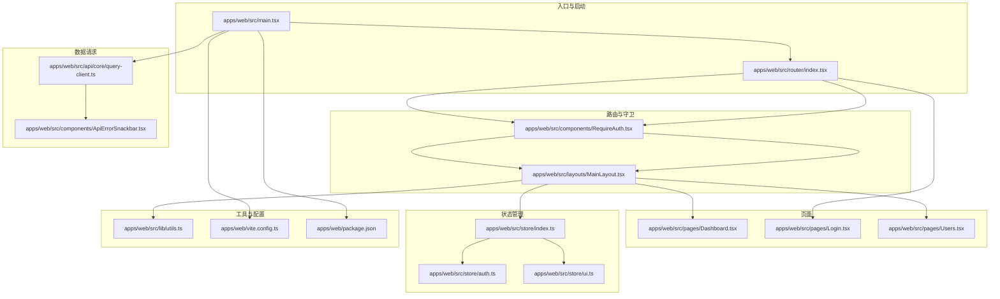
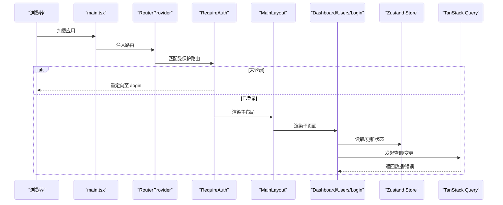

# React 应用架构

<cite>
**本文引用的文件**
- [apps/web/src/main.tsx](file://apps/web/src/main.tsx)
- [apps/web/src/router/index.tsx](file://apps/web/src/router/index.tsx)
- [apps/web/src/layouts/MainLayout.tsx](file://apps/web/src/layouts/MainLayout.tsx)
- [apps/web/src/components/RequireAuth.tsx](file://apps/web/src/components/RequireAuth.tsx)
- [apps/web/src/store/auth.ts](file://apps/web/src/store/auth.ts)
- [apps/web/src/store/ui.ts](file://apps/web/src/store/ui.ts)
- [apps/web/src/store/index.ts](file://apps/web/src/store/index.ts)
- [apps/web/src/api/core/query-client.ts](file://apps/web/src/api/core/query-client.ts)
- [apps/web/src/components/ApiErrorSnackbar.tsx](file://apps/web/src/components/ApiErrorSnackbar.tsx)
- [apps/web/src/lib/utils.ts](file://apps/web/src/lib/utils.ts)
- [apps/web/src/pages/Dashboard.tsx](file://apps/web/src/pages/Dashboard.tsx)
- [apps/web/src/pages/Login.tsx](file://apps/web/src/pages/Login.tsx)
- [apps/web/src/pages/Users.tsx](file://apps/web/src/pages/Users.tsx)
- [apps/web/vite.config.ts](file://apps/web/vite.config.ts)
- [apps/web/package.json](file://apps/web/package.json)
</cite>

## 目录

1. [引言](#引言)
2. [项目结构](#项目结构)
3. [核心组件](#核心组件)
4. [架构总览](#架构总览)
5. [详细组件分析](#详细组件分析)
6. [依赖分析](#依赖分析)
7. [性能考虑](#性能考虑)
8. [故障排查指南](#故障排查指南)
9. [结论](#结论)
10. [附录](#附录)

## 引言

本文件面向使用 React 19 的前端团队，系统性梳理基于 Vite + React Router + Zustand + TanStack Query 的应用架构。重点覆盖应用入口点配置、路由系统设计模式（含嵌套路由与路由守卫）、主布局组件与导航策略、状态管理（认证与 UI 状态）、数据请求与错误处理、以及性能优化与开发调试实践。文档通过分层讲解与图示化表达，帮助读者快速理解并复用该架构。

## 项目结构

Web 前端采用模块化目录组织，围绕“入口 → 路由 → 布局 → 页面 → 组件 → 状态 → 请求”的层次展开，并辅以工具函数与主题样式。

图表来源

- [apps/web/src/main.tsx:1-23](file://apps/web/src/main.tsx#L1-L23)
- [apps/web/src/router/index.tsx:1-51](file://apps/web/src/router/index.tsx#L1-L51)
- [apps/web/src/layouts/MainLayout.tsx:1-97](file://apps/web/src/layouts/MainLayout.tsx#L1-L97)
- [apps/web/src/components/RequireAuth.tsx:1-14](file://apps/web/src/components/RequireAuth.tsx#L1-L14)
- [apps/web/src/store/auth.ts:1-64](file://apps/web/src/store/auth.ts#L1-L64)
- [apps/web/src/store/ui.ts:1-47](file://apps/web/src/store/ui.ts#L1-L47)
- [apps/web/src/store/index.ts:1-3](file://apps/web/src/store/index.ts#L1-L3)
- [apps/web/src/api/core/query-client.ts:1-32](file://apps/web/src/api/core/query-client.ts#L1-L32)
- [apps/web/src/components/ApiErrorSnackbar.tsx:1-58](file://apps/web/src/components/ApiErrorSnackbar.tsx#L1-L58)
- [apps/web/src/lib/utils.ts:1-7](file://apps/web/src/lib/utils.ts#L1-L7)
- [apps/web/src/pages/Dashboard.tsx:1-41](file://apps/web/src/pages/Dashboard.tsx#L1-L41)
- [apps/web/src/pages/Login.tsx:1-221](file://apps/web/src/pages/Login.tsx#L1-L221)
- [apps/web/src/pages/Users.tsx:1-34](file://apps/web/src/pages/Users.tsx#L1-L34)
- [apps/web/vite.config.ts:1-23](file://apps/web/vite.config.ts#L1-L23)
- [apps/web/package.json:1-44](file://apps/web/package.json#L1-L44)

章节来源

- [apps/web/src/main.tsx:1-23](file://apps/web/src/main.tsx#L1-L23)
- [apps/web/src/router/index.tsx:1-51](file://apps/web/src/router/index.tsx#L1-L51)
- [apps/web/vite.config.ts:1-23](file://apps/web/vite.config.ts#L1-L23)
- [apps/web/package.json:1-44](file://apps/web/package.json#L1-L44)

## 核心组件

- 应用入口与 Provider 层
  - 入口文件负责挂载根节点，注入查询客户端、全局提示器、路由提供者与错误提示条，并引入全局样式。
  - 关键路径参考：[apps/web/src/main.tsx:12-22](file://apps/web/src/main.tsx#L12-L22)
- 路由系统与守卫
  - 使用浏览器路由创建器定义顶层路由，通过 RequireAuth 实现登录态守卫；主布局包裹受保护的子路由。
  - 关键路径参考：[apps/web/src/router/index.tsx:12-48](file://apps/web/src/router/index.tsx#L12-L48)，[apps/web/src/components/RequireAuth.tsx:4-13](file://apps/web/src/components/RequireAuth.tsx#L4-L13)
- 主布局与导航
  - 主布局负责移动端抽屉、固定头部与侧边栏导航，结合 UI 状态管理控制抽屉开关；内部通过 Outlet 渲染子页面。
  - 关键路径参考：[apps/web/src/layouts/MainLayout.tsx:14-96](file://apps/web/src/layouts/MainLayout.tsx#L14-L96)
- 认证状态与 UI 状态
  - 认证状态包含令牌与用户信息，支持持久化与水合逻辑；UI 状态管理移动端抽屉与侧边栏折叠。
  - 关键路径参考：[apps/web/src/store/auth.ts:30-63](file://apps/web/src/store/auth.ts#L30-L63)，[apps/web/src/store/ui.ts:20-46](file://apps/web/src/store/ui.ts#L20-L46)
- 数据请求与错误处理
  - 查询客户端统一配置重试、过期时间与窗口焦点行为；错误事件通过全局 Snackbar 提示。
  - 关键路径参考：[apps/web/src/api/core/query-client.ts:5-31](file://apps/web/src/api/core/query-client.ts#L5-L31)，[apps/web/src/components/ApiErrorSnackbar.tsx:7-57](file://apps/web/src/components/ApiErrorSnackbar.tsx#L7-L57)

章节来源

- [apps/web/src/main.tsx:1-23](file://apps/web/src/main.tsx#L1-L23)
- [apps/web/src/router/index.tsx:1-51](file://apps/web/src/router/index.tsx#L1-L51)
- [apps/web/src/components/RequireAuth.tsx:1-14](file://apps/web/src/components/RequireAuth.tsx#L1-L14)
- [apps/web/src/layouts/MainLayout.tsx:1-97](file://apps/web/src/layouts/MainLayout.tsx#L1-L97)
- [apps/web/src/store/auth.ts:1-64](file://apps/web/src/store/auth.ts#L1-L64)
- [apps/web/src/store/ui.ts:1-47](file://apps/web/src/store/ui.ts#L1-L47)
- [apps/web/src/api/core/query-client.ts:1-32](file://apps/web/src/api/core/query-client.ts#L1-L32)
- [apps/web/src/components/ApiErrorSnackbar.tsx:1-58](file://apps/web/src/components/ApiErrorSnackbar.tsx#L1-L58)

## 架构总览

下图展示从入口到页面渲染、状态更新与数据请求的整体调用链路。

图表来源

- [apps/web/src/main.tsx:12-22](file://apps/web/src/main.tsx#L12-L22)
- [apps/web/src/router/index.tsx:12-48](file://apps/web/src/router/index.tsx#L12-L48)
- [apps/web/src/components/RequireAuth.tsx:4-13](file://apps/web/src/components/RequireAuth.tsx#L4-L13)
- [apps/web/src/layouts/MainLayout.tsx:14-96](file://apps/web/src/layouts/MainLayout.tsx#L14-L96)
- [apps/web/src/pages/Dashboard.tsx:6-40](file://apps/web/src/pages/Dashboard.tsx#L6-L40)
- [apps/web/src/pages/Users.tsx:6-33](file://apps/web/src/pages/Users.tsx#L6-L33)
- [apps/web/src/pages/Login.tsx:60-220](file://apps/web/src/pages/Login.tsx#L60-L220)
- [apps/web/src/store/auth.ts:30-63](file://apps/web/src/store/auth.ts#L30-L63)
- [apps/web/src/api/core/query-client.ts:5-31](file://apps/web/src/api/core/query-client.ts#L5-L31)

## 详细组件分析

### 应用入口与初始化流程

- 初始化步骤
  - 创建根节点并挂载 StrictMode 包裹的应用。
  - 注入查询客户端与 Devtools，确保数据缓存与调试能力可用。
  - 注入 TooltipProvider 与全局样式，保证 UI 交互与视觉一致性。
  - 通过 RouterProvider 挂载路由树。
- 关键路径参考
  - [apps/web/src/main.tsx:12-22](file://apps/web/src/main.tsx#L12-L22)
  - [apps/web/vite.config.ts:6-22](file://apps/web/vite.config.ts#L6-L22)

章节来源

- [apps/web/src/main.tsx:1-23](file://apps/web/src/main.tsx#L1-L23)
- [apps/web/vite.config.ts:1-23](file://apps/web/vite.config.ts#L1-L23)

### 路由系统与导航策略

- 设计模式
  - 顶层路由包含登录页与受保护路由组；受保护路由组通过 RequireAuth 守卫拦截未登录用户。
  - 受保护路由组内嵌套主布局，主布局内部再按路径渲染仪表盘、用户管理等页面。
  - 未上线的功能路径以“即将上线”页面占位，便于统一管理。
- 导航策略
  - 主布局中的导航项使用 NavLink，支持激活态样式与移动端抽屉关闭联动。
  - 登录成功后自动跳转至首页，避免重复登录。
- 关键路径参考
  - [apps/web/src/router/index.tsx:12-48](file://apps/web/src/router/index.tsx#L12-L48)
  - [apps/web/src/layouts/MainLayout.tsx:9-12](file://apps/web/src/layouts/MainLayout.tsx#L9-L12)
  - [apps/web/src/layouts/MainLayout.tsx:50-72](file://apps/web/src/layouts/MainLayout.tsx#L50-L72)
  - [apps/web/src/pages/Login.tsx:68-72](file://apps/web/src/pages/Login.tsx#L68-L72)

章节来源

- [apps/web/src/router/index.tsx:1-51](file://apps/web/src/router/index.tsx#L1-L51)
- [apps/web/src/layouts/MainLayout.tsx:1-97](file://apps/web/src/layouts/MainLayout.tsx#L1-L97)
- [apps/web/src/pages/Login.tsx:1-221](file://apps/web/src/pages/Login.tsx#L1-L221)

### 主布局组件与导航实现

- 结构要点
  - 固定侧边栏在桌面端常驻，移动端通过抽屉控制显示/隐藏。
  - 头部区域提供移动端菜单按钮与面包屑式标题。
  - 通过 Outlet 渲染当前子路由内容。
- 交互细节
  - 移动端抽屉开关与关闭由 UI 状态管理驱动。
  - 导航项点击后自动关闭移动端抽屉，提升移动端体验。
- 关键路径参考
  - [apps/web/src/layouts/MainLayout.tsx:14-96](file://apps/web/src/layouts/MainLayout.tsx#L14-L96)
  - [apps/web/src/store/ui.ts:20-46](file://apps/web/src/store/ui.ts#L20-L46)

章节来源

- [apps/web/src/layouts/MainLayout.tsx:1-97](file://apps/web/src/layouts/MainLayout.tsx#L1-L97)
- [apps/web/src/store/ui.ts:1-47](file://apps/web/src/store/ui.ts#L1-L47)

### 路由守卫机制

- RequireAuth 行为
  - 读取认证状态，未登录则重定向至登录页并携带来源地址。
  - 已登录则放行，进入主布局与子页面。
- 与认证状态的耦合
  - 认证状态来自 Zustand，具备持久化能力，支持水合后自动置为已登录。
- 关键路径参考
  - [apps/web/src/components/RequireAuth.tsx:4-13](file://apps/web/src/components/RequireAuth.tsx#L4-L13)
  - [apps/web/src/store/auth.ts:30-63](file://apps/web/src/store/auth.ts#L30-L63)

章节来源

- [apps/web/src/components/RequireAuth.tsx:1-14](file://apps/web/src/components/RequireAuth.tsx#L1-L14)
- [apps/web/src/store/auth.ts:1-64](file://apps/web/src/store/auth.ts#L1-L64)

### 状态管理：认证与 UI

- 认证状态（Zustand）
  - 字段：访问令牌、刷新令牌、用户信息、登录态。
  - 功能：设置令牌、设置用户、清理认证；持久化仅保留必要字段；水合时根据令牌设置登录态。
- UI 状态（Zustand）
  - 字段：移动端抽屉开关、侧边栏折叠。
  - 功能：切换抽屉、关闭抽屉、切换侧边栏。
- 关键路径参考
  - [apps/web/src/store/auth.ts:30-63](file://apps/web/src/store/auth.ts#L30-L63)
  - [apps/web/src/store/ui.ts:20-46](file://apps/web/src/store/ui.ts#L20-L46)
  - [apps/web/src/store/index.ts:1-3](file://apps/web/src/store/index.ts#L1-L3)

章节来源

- [apps/web/src/store/auth.ts:1-64](file://apps/web/src/store/auth.ts#L1-L64)
- [apps/web/src/store/ui.ts:1-47](file://apps/web/src/store/ui.ts#L1-L47)
- [apps/web/src/store/index.ts:1-3](file://apps/web/src/store/index.ts#L1-L3)

### 数据请求与错误处理

- 查询客户端配置
  - 查询默认：最多重试 2 次，UNAUTHORIZED 业务错误不重试；缓存过期时间 30 秒；窗口聚焦不自动刷新。
  - 变更默认：不重试。
  - 错误回调统一触发全局错误事件。
- 全局错误提示
  - 监听错误事件，弹出可关闭的 Snackbar，支持自动消失。
- 关键路径参考
  - [apps/web/src/api/core/query-client.ts:5-31](file://apps/web/src/api/core/query-client.ts#L5-L31)
  - [apps/web/src/components/ApiErrorSnackbar.tsx:7-57](file://apps/web/src/components/ApiErrorSnackbar.tsx#L7-L57)

章节来源

- [apps/web/src/api/core/query-client.ts:1-32](file://apps/web/src/api/core/query-client.ts#L1-L32)
- [apps/web/src/components/ApiErrorSnackbar.tsx:1-58](file://apps/web/src/components/ApiErrorSnackbar.tsx#L1-L58)

### 页面组件与数据绑定

- 仪表盘
  - 展示欢迎语、服务健康状态卡片；根据加载/错误状态切换 UI。
- 用户管理
  - 列表页加载用户数据并逐条渲染卡片。
- 登录页
  - 支持账号、密码、验证码输入；提交后跳转首页；错误提示与加载态。
- 关键路径参考
  - [apps/web/src/pages/Dashboard.tsx:6-40](file://apps/web/src/pages/Dashboard.tsx#L6-L40)
  - [apps/web/src/pages/Users.tsx:6-33](file://apps/web/src/pages/Users.tsx#L6-L33)
  - [apps/web/src/pages/Login.tsx:60-220](file://apps/web/src/pages/Login.tsx#L60-L220)

章节来源

- [apps/web/src/pages/Dashboard.tsx:1-41](file://apps/web/src/pages/Dashboard.tsx#L1-L41)
- [apps/web/src/pages/Users.tsx:1-34](file://apps/web/src/pages/Users.tsx#L1-L34)
- [apps/web/src/pages/Login.tsx:1-221](file://apps/web/src/pages/Login.tsx#L1-L221)

## 依赖分析

- 运行时依赖
  - React 19、React Router 7、Zustand、TanStack React Query、TailwindCSS、Lucide React 等。
- 开发依赖
  - Vite、@vitejs/plugin-react、TailwindCSS 插件、TypeScript、ESLint 等。
- 代理与别名
  - Vite 服务器代理 /api 到后端服务；路径别名 @ 指向 src。
- 关键路径参考
  - [apps/web/package.json:14-28](file://apps/web/package.json#L14-L28)
  - [apps/web/package.json:30-42](file://apps/web/package.json#L30-L42)
  - [apps/web/vite.config.ts:6-22](file://apps/web/vite.config.ts#L6-L22)

章节来源

- [apps/web/package.json:1-44](file://apps/web/package.json#L1-L44)
- [apps/web/vite.config.ts:1-23](file://apps/web/vite.config.ts#L1-L23)

## 性能考虑

- 查询缓存与过期
  - 合理设置 staleTime 与 refetchOnWindowFocus，减少不必要的网络请求。
  - 对于需要实时性的接口，谨慎开启窗口聚焦刷新。
- 重试策略
  - 业务错误（如未授权）不重试，普通网络错误最多重试 2 次，降低资源浪费。
- 组件懒加载与分割
  - 将大型页面拆分为独立模块，配合路由懒加载进一步优化首屏。
- 图标与样式
  - 使用轻量图标库与原子化样式，避免冗余 CSS。
- 状态粒度
  - 将 UI 状态与业务状态分离，避免无关状态导致的无谓重渲染。
- 编译与打包
  - 使用 Vite 的快速冷启与按需编译特性；生产构建开启压缩与 Tree-shaking。

## 故障排查指南

- 登录后仍被重定向到登录页
  - 检查认证状态是否持久化成功，确认水合逻辑是否将 accessToken 映射为已登录。
  - 参考：[apps/web/src/store/auth.ts:48-62](file://apps/web/src/store/auth.ts#L48-L62)
- 移动端抽屉无法关闭
  - 确认 UI 状态动作是否正确调用，检查移动端点击遮罩与导航项点击关闭逻辑。
  - 参考：[apps/web/src/layouts/MainLayout.tsx:20-28](file://apps/web/src/layouts/MainLayout.tsx#L20-L28)，[apps/web/src/layouts/MainLayout.tsx:57](file://apps/web/src/layouts/MainLayout.tsx#L57)
- 全局错误提示不出现
  - 确认错误事件监听是否注册，查询/变更错误是否触发了全局事件。
  - 参考：[apps/web/src/components/ApiErrorSnackbar.tsx:10-14](file://apps/web/src/components/ApiErrorSnackbar.tsx#L10-L14)，[apps/web/src/api/core/query-client.ts:7-15](file://apps/web/src/api/core/query-client.ts#L7-L15)
- 接口 401 无限重试
  - 确认业务错误识别逻辑与 UNAUTHORIZED 分支，避免对未授权错误进行重试。
  - 参考：[apps/web/src/api/core/query-client.ts:18-23](file://apps/web/src/api/core/query-client.ts#L18-L23)

章节来源

- [apps/web/src/store/auth.ts:1-64](file://apps/web/src/store/auth.ts#L1-L64)
- [apps/web/src/layouts/MainLayout.tsx:1-97](file://apps/web/src/layouts/MainLayout.tsx#L1-L97)
- [apps/web/src/components/ApiErrorSnackbar.tsx:1-58](file://apps/web/src/components/ApiErrorSnackbar.tsx#L1-L58)
- [apps/web/src/api/core/query-client.ts:1-32](file://apps/web/src/api/core/query-client.ts#L1-L32)

## 结论

该 React 应用以清晰的层次划分与现代工具链实现了高可维护性与良好开发体验。入口层统一注入 Provider，路由层通过守卫保障安全边界，主布局承担导航与响应式交互，状态层以轻量 Store 承担认证与 UI 状态，数据层以 QueryClient 统一处理缓存与错误。建议在后续迭代中持续关注首屏性能、路由懒加载与错误监控体系的完善。

## 附录

- 最佳实践清单
  - 将 UI 状态与业务状态解耦，避免跨域污染。
  - 对关键页面启用骨架屏或占位符，改善感知性能。
  - 在路由守卫中记录来源地址，提升用户体验。
  - 对高频交互组件使用 memo 化与细粒度状态切片。
  - 使用类型安全的数据请求钩子，减少运行时错误。
- 开发调试技巧
  - 使用 React Query Devtools 观察缓存命中与重试次数。
  - 在 Vite 中通过代理快速联调后端接口。
  - 使用 Tailwind 的原子类与 cn 工具函数统一样式拼接。
