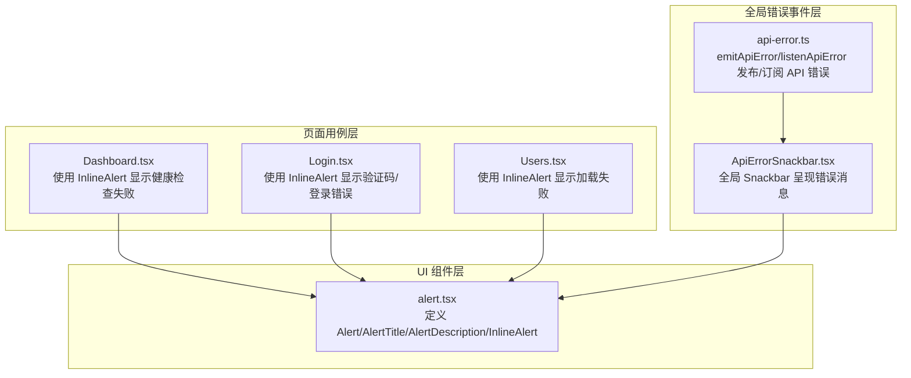
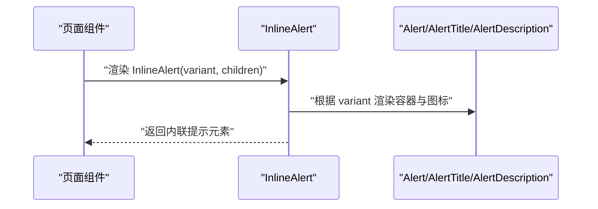
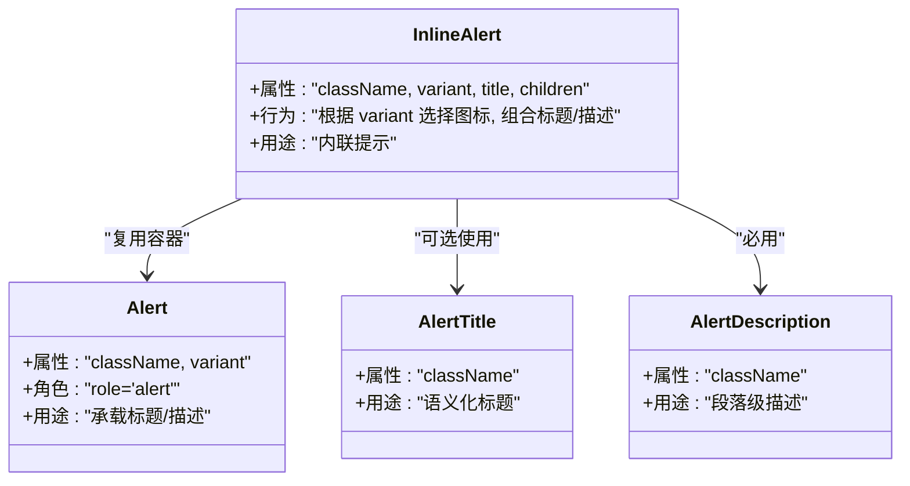
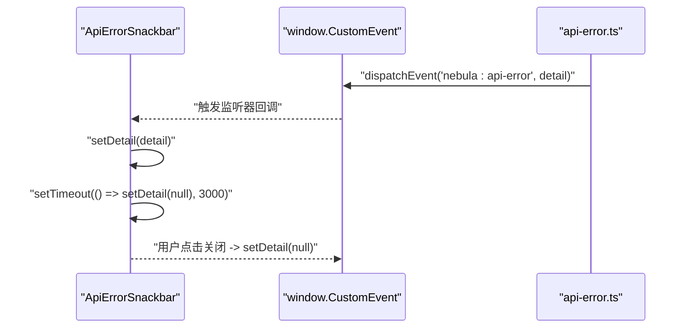
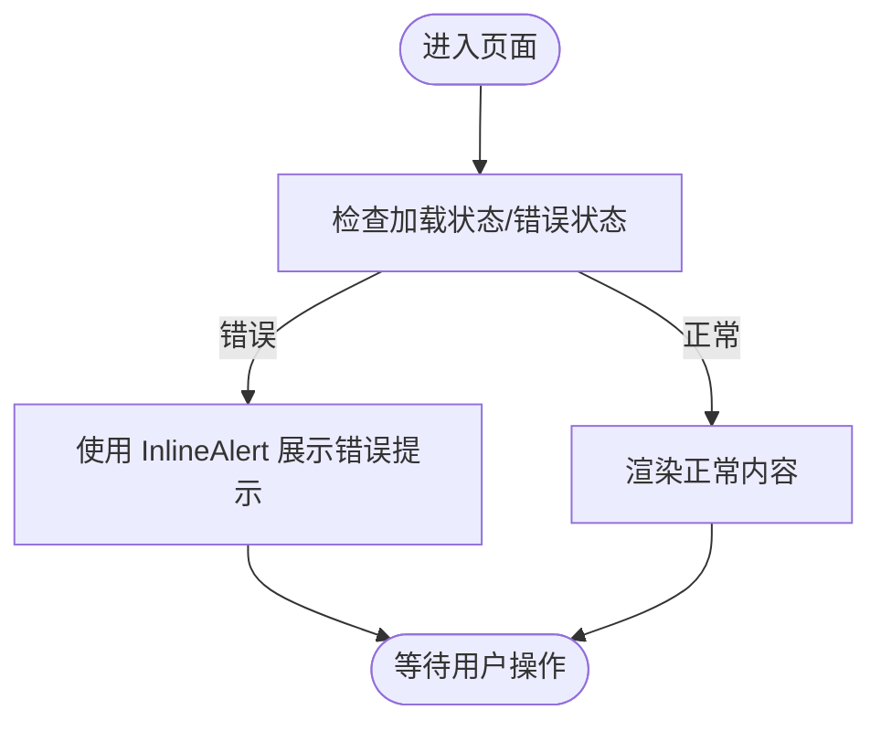
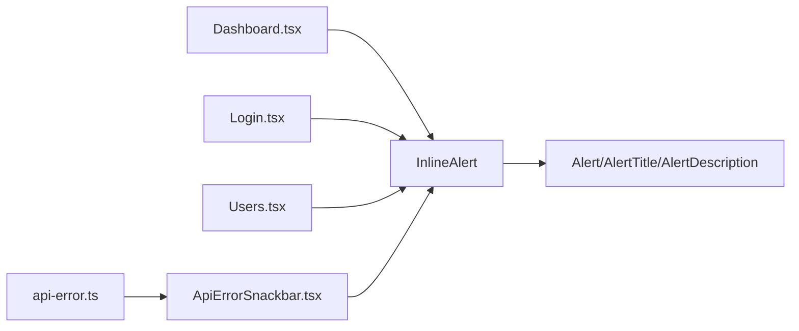

# Alert 提示组件

<cite>
**本文引用的文件**
- [alert.tsx](file://apps/web/src/components/ui/alert.tsx)
- [ApiErrorSnackbar.tsx](file://apps/web/src/components/ApiErrorSnackbar.tsx)
- [api-error.ts](file://apps/web/src/api/core/api-error.ts)
- [Dashboard.tsx](file://apps/web/src/pages/Dashboard.tsx)
- [Login.tsx](file://apps/web/src/pages/Login.tsx)
- [Users.tsx](file://apps/web/src/pages/Users.tsx)
</cite>

## 目录

1. [简介](#简介)
2. [项目结构](#项目结构)
3. [核心组件](#核心组件)
4. [架构总览](#架构总览)
5. [详细组件分析](#详细组件分析)
6. [依赖关系分析](#依赖关系分析)
7. [性能考量](#性能考量)
8. [故障排查指南](#故障排查指南)
9. [结论](#结论)
10. [附录](#附录)

## 简介

本文件系统化梳理前端 Web 应用中的 Alert 提示组件，涵盖设计理念、类型配置、使用方式与最佳实践。重点说明两类呈现形态：块级 Alert 与内联 InlineAlert 的差异与适用场景；解释“默认”和“破坏性（destructive）”两种语义变体的视觉与语义含义；阐述关闭机制、自动消失时长与交互细节；并通过真实页面用例展示在用户反馈、系统通知与错误信息中的应用。

## 项目结构

Alert 相关代码主要分布在以下位置：

- UI 组件层：定义基础 Alert 及其子组件（标题、描述、内联变体）
- 页面用例层：在仪表盘、登录页、用户页等场景中使用 InlineAlert 展示错误或异常
- 全局错误事件层：通过自定义事件分发 API 错误详情，并由全局 Snackbar 组件统一呈现

图表来源

- [alert.tsx:1-62](file://apps/web/src/components/ui/alert.tsx#L1-L62)
- [ApiErrorSnackbar.tsx:1-58](file://apps/web/src/components/ApiErrorSnackbar.tsx#L1-L58)
- [api-error.ts:1-45](file://apps/web/src/api/core/api-error.ts#L1-L45)
- [Dashboard.tsx:1-205](file://apps/web/src/pages/Dashboard.tsx#L1-L205)
- [Login.tsx:1-221](file://apps/web/src/pages/Login.tsx#L1-L221)
- [Users.tsx:1-34](file://apps/web/src/pages/Users.tsx#L1-L34)

章节来源

- [alert.tsx:1-62](file://apps/web/src/components/ui/alert.tsx#L1-L62)
- [ApiErrorSnackbar.tsx:1-58](file://apps/web/src/components/ApiErrorSnackbar.tsx#L1-L58)
- [api-error.ts:1-45](file://apps/web/src/api/core/api-error.ts#L1-L45)
- [Dashboard.tsx:1-205](file://apps/web/src/pages/Dashboard.tsx#L1-L205)
- [Login.tsx:1-221](file://apps/web/src/pages/Login.tsx#L1-L221)
- [Users.tsx:1-34](file://apps/web/src/pages/Users.tsx#L1-L34)

## 核心组件

- Alert：基础容器，支持 variant="default|destructive"，用于承载标题与描述内容
- AlertTitle：语义化标题，强调可读性与无障碍
- AlertDescription：段落级描述区域，支持内部段落继承行高
- InlineAlert：内联提示，自动根据 variant 选择图标（破坏性使用警示圆圈，其他使用感叹号），并组合标题与描述形成紧凑的一行式提示

设计要点

- 使用 class-variance-authority 动态生成样式类，确保变体与扩展类名的合并
- 通过 role="alert" 提升可访问性
- 内联模式强制横向布局与图标间距，便于在表单、卡片等紧凑空间中使用

章节来源

- [alert.tsx:6-35](file://apps/web/src/components/ui/alert.tsx#L6-L35)
- [alert.tsx:37-59](file://apps/web/src/components/ui/alert.tsx#L37-L59)

## 架构总览

Alert 的使用路径分为两类：

- 页面内直接使用 InlineAlert 展示局部错误或状态提示
- 通过 API 错误事件系统，由全局 Snackbar 统一呈现系统级错误/警告

图表来源

- [alert.tsx:19-59](file://apps/web/src/components/ui/alert.tsx#L19-L59)
- [Dashboard.tsx:126-128](file://apps/web/src/pages/Dashboard.tsx#L126-L128)
- [Login.tsx:169-170](file://apps/web/src/pages/Login.tsx#L169-L170)
- [Login.tsx:199-203](file://apps/web/src/pages/Login.tsx#L199-L203)
- [Users.tsx:13-15](file://apps/web/src/pages/Users.tsx#L13-L15)

## 详细组件分析

### 组件关系与职责

- Alert：提供基础容器与变体样式
- AlertTitle/AlertDescription：分别负责标题与正文内容
- InlineAlert：封装图标、布局与标题可选逻辑，面向高频内联场景

图表来源

- [alert.tsx:19-59](file://apps/web/src/components/ui/alert.tsx#L19-L59)

章节来源

- [alert.tsx:19-59](file://apps/web/src/components/ui/alert.tsx#L19-L59)

### 类型与语义

- 默认（default）：常规信息提示，边框与文本颜色适配浅色背景，适合非紧急状态
- 破坏性（destructive）：强调错误或危险，边框与文本采用破坏性色彩，图标亦随之切换为警示样式，适合错误、失败或需要立即关注的状态

章节来源

- [alert.tsx:6-17](file://apps/web/src/components/ui/alert.tsx#L6-L17)
- [alert.tsx:47-58](file://apps/web/src/components/ui/alert.tsx#L47-L58)

### 关闭机制与自动消失

- 页面内 InlineAlert：通常作为静态提示展示，不内置自动消失逻辑，需由上层业务决定何时移除
- 全局 Snackbar：监听 API 错误事件，在收到错误详情后显示，并在 3 秒后自动隐藏；同时提供关闭按钮，支持手动关闭

图表来源

- [ApiErrorSnackbar.tsx:10-28](file://apps/web/src/components/ApiErrorSnackbar.tsx#L10-L28)
- [api-error.ts:9-32](file://apps/web/src/api/core/api-error.ts#L9-L32)

章节来源

- [ApiErrorSnackbar.tsx:1-58](file://apps/web/src/components/ApiErrorSnackbar.tsx#L1-L58)
- [api-error.ts:1-45](file://apps/web/src/api/core/api-error.ts#L1-L45)

### 动画与过渡

- InlineAlert：无内置动画，依赖外层布局与主题过渡
- 全局 Snackbar：固定定位、居中显示，具备阴影与模糊背景，关闭时通过状态变更实现淡出

章节来源

- [ApiErrorSnackbar.tsx:34-56](file://apps/web/src/components/ApiErrorSnackbar.tsx#L34-L56)

### 使用示例与场景

- 仪表盘健康检查失败：在卡片内使用 InlineAlert 展示错误状态
- 登录页验证码加载失败/登录失败：在表单区域使用 InlineAlert 提示用户
- 用户列表加载失败：在列表上方使用 InlineAlert 提示错误

图表来源

- [Dashboard.tsx:126-128](file://apps/web/src/pages/Dashboard.tsx#L126-L128)
- [Login.tsx:169-170](file://apps/web/src/pages/Login.tsx#L169-L170)
- [Login.tsx:199-203](file://apps/web/src/pages/Login.tsx#L199-L203)
- [Users.tsx:13-15](file://apps/web/src/pages/Users.tsx#L13-L15)

章节来源

- [Dashboard.tsx:126-128](file://apps/web/src/pages/Dashboard.tsx#L126-L128)
- [Login.tsx:169-170](file://apps/web/src/pages/Login.tsx#L169-L170)
- [Login.tsx:199-203](file://apps/web/src/pages/Login.tsx#L199-L203)
- [Users.tsx:13-15](file://apps/web/src/pages/Users.tsx#L13-L15)

## 依赖关系分析

- InlineAlert 依赖 Alert/AlertTitle/AlertDescription 的基础能力
- 页面组件通过导入 InlineAlert 在各自上下文中使用
- 全局错误事件通过自定义事件发布 API 错误详情，Snackbar 订阅并呈现

图表来源

- [alert.tsx:19-59](file://apps/web/src/components/ui/alert.tsx#L19-L59)
- [Dashboard.tsx:126-128](file://apps/web/src/pages/Dashboard.tsx#L126-L128)
- [Login.tsx:169-170](file://apps/web/src/pages/Login.tsx#L169-L170)
- [Login.tsx:199-203](file://apps/web/src/pages/Login.tsx#L199-L203)
- [Users.tsx:13-15](file://apps/web/src/pages/Users.tsx#L13-L15)
- [api-error.ts:34-42](file://apps/web/src/api/core/api-error.ts#L34-L42)
- [ApiErrorSnackbar.tsx:10-14](file://apps/web/src/components/ApiErrorSnackbar.tsx#L10-L14)

章节来源

- [alert.tsx:19-59](file://apps/web/src/components/ui/alert.tsx#L19-L59)
- [api-error.ts:34-42](file://apps/web/src/api/core/api-error.ts#L34-L42)
- [ApiErrorSnackbar.tsx:10-14](file://apps/web/src/components/ApiErrorSnackbar.tsx#L10-L14)

## 性能考量

- InlineAlert 为轻量组件，仅进行条件渲染与图标选择，开销极低
- 全局 Snackbar 的定时器在无错误时不会启动，避免不必要的计时与状态更新
- 建议在高频错误场景下，结合去抖/节流策略减少重复弹窗

## 故障排查指南

- 问题：InlineAlert 不显示
  - 排查：确认传入 children 是否为空；检查父容器是否有溢出或隐藏样式
- 问题：破坏性样式未生效
  - 排查：确认 variant 设置为 destructive；检查主题变量与暗黑模式下的覆盖规则
- 问题：全局错误未显示
  - 排查：确认已调用错误事件发布函数；检查自定义事件监听是否注册；确认错误详情的 severity 字段是否正确

章节来源

- [alert.tsx:6-17](file://apps/web/src/components/ui/alert.tsx#L6-L17)
- [ApiErrorSnackbar.tsx:10-28](file://apps/web/src/components/ApiErrorSnackbar.tsx#L10-L28)
- [api-error.ts:16-32](file://apps/web/src/api/core/api-error.ts#L16-L32)

## 结论

Alert 提示组件通过清晰的语义变体与内联布局，满足从页面局部提示到全局系统通知的多样化需求。配合自定义事件的全局错误分发机制，可在保证一致性的同时提升用户体验与可维护性。建议在实际项目中遵循“就近提示、及时关闭、语义明确”的原则，合理选择 InlineAlert 或全局 Snackbar，并结合主题与无障碍规范进行样式定制。

## 附录

- 最佳实践
  - 语义优先：错误使用 destructive，一般信息使用 default
  - 交互可控：提供关闭按钮或自动消失，避免干扰用户操作
  - 可访问性：保持 role="alert" 与合适的对比度
  - 样式定制：通过扩展 className 覆盖默认样式，保持与整体设计一致
