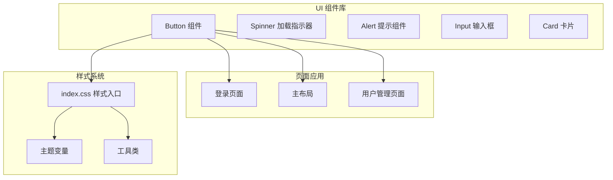
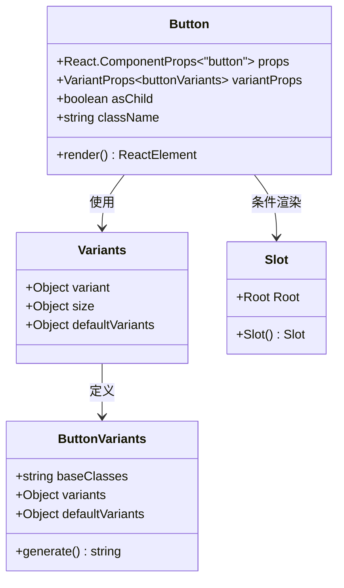
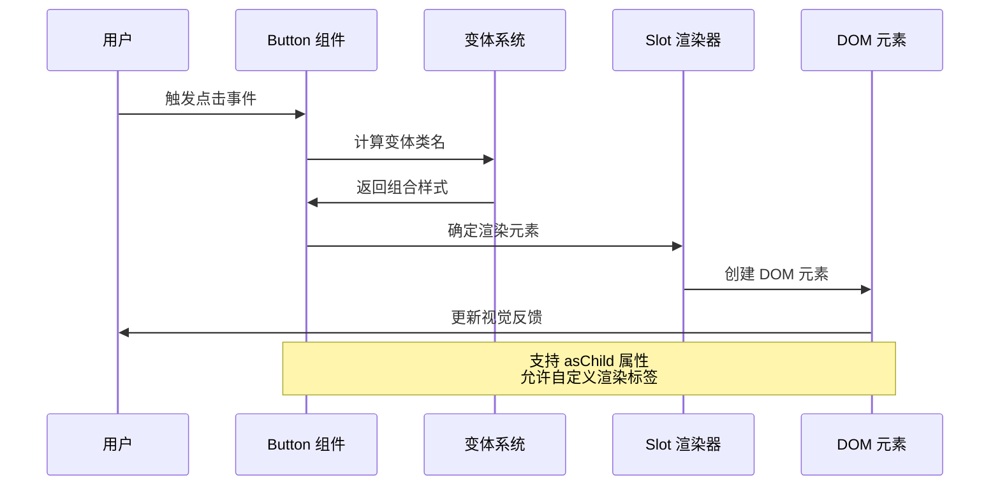
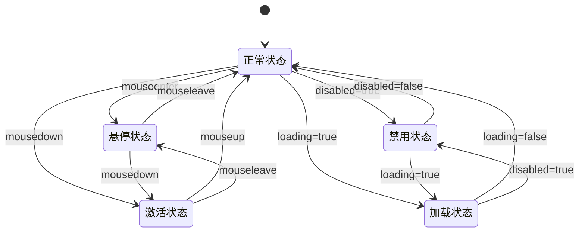
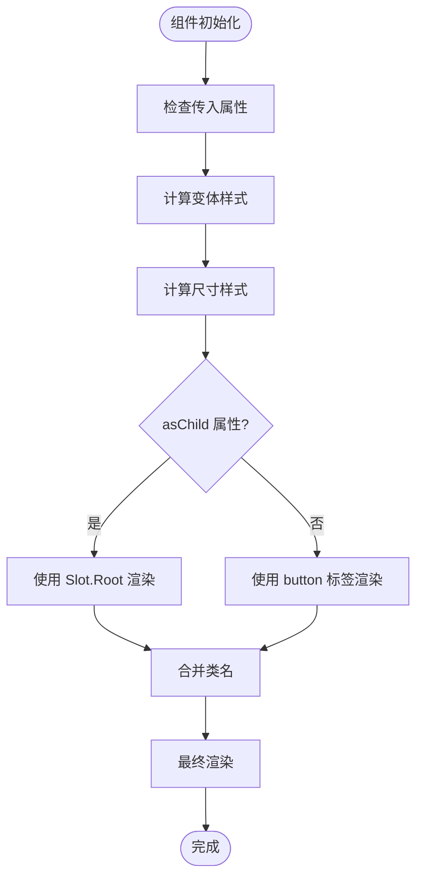
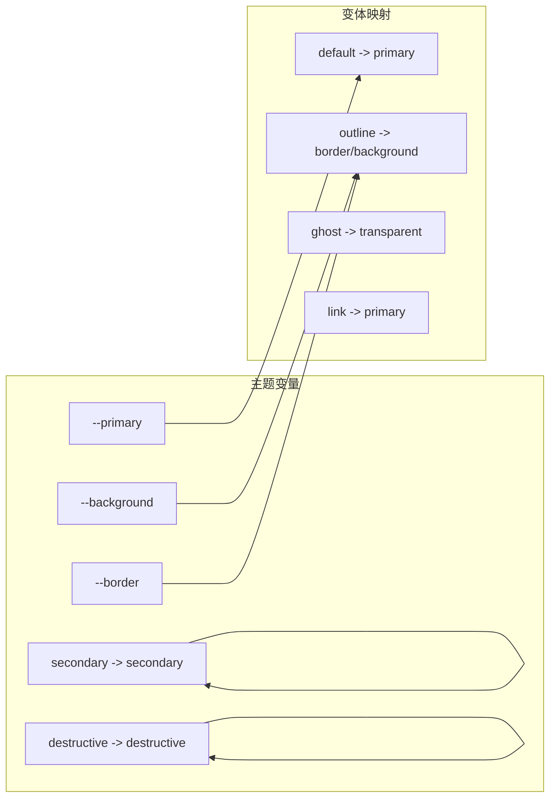
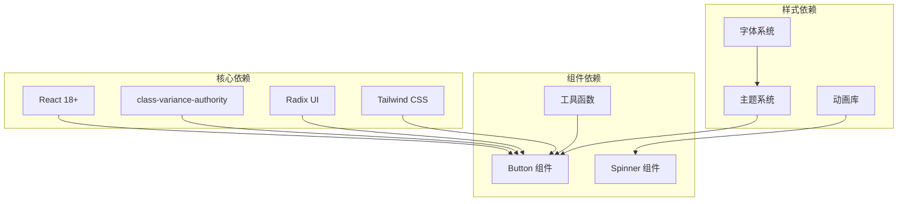
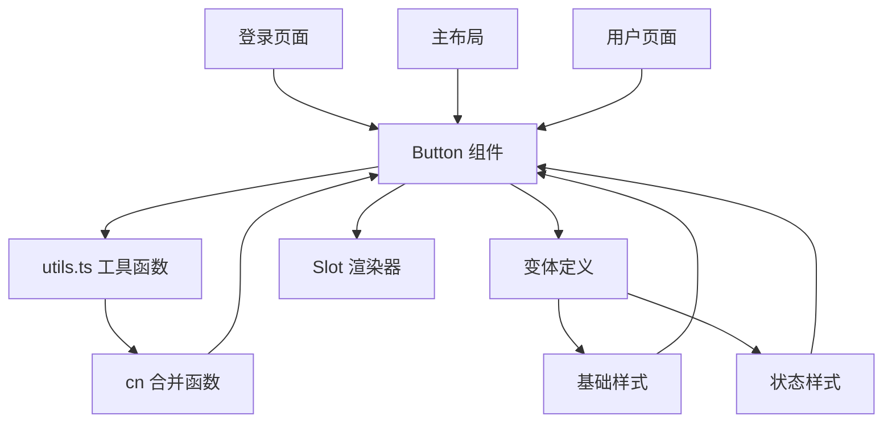
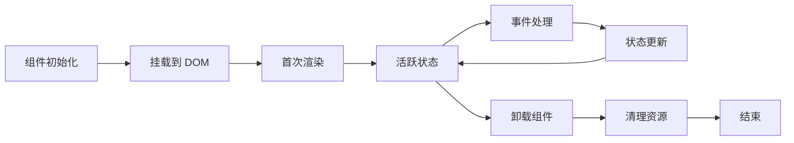

# Button 按钮组件

<cite>
**本文档引用的文件**
- [button.tsx](file://apps/web/src/components/ui/button.tsx)
- [spinner.tsx](file://apps/web/src/components/ui/spinner.tsx)
- [Login.tsx](file://apps/web/src/pages/Login.tsx)
- [MainLayout.tsx](file://apps/web/src/layouts/MainLayout.tsx)
- [index.css](file://apps/web/src/styles/index.css)
- [utils.ts](file://apps/web/src/lib/utils.ts)
</cite>

## 目录

1. [简介](#简介)
2. [项目结构](#项目结构)
3. [核心组件](#核心组件)
4. [架构概览](#架构概览)
5. [详细组件分析](#详细组件分析)
6. [依赖关系分析](#依赖关系分析)
7. [性能考虑](#性能考虑)
8. [故障排除指南](#故障排除指南)
9. [结论](#结论)
10. [附录](#附录)

## 简介

Button 按钮组件是 Nebula 管理后台系统的核心交互元素，基于 React 和 Tailwind CSS 构建。该组件采用设计系统化的方法，提供了丰富的变体、尺寸和状态配置，支持无障碍访问和键盘导航，适用于各种用户界面场景。

组件设计遵循以下核心理念：

- **一致性**：统一的视觉语言和交互行为
- **可扩展性**：灵活的变体和尺寸系统
- **可访问性**：完整的无障碍支持
- **性能优化**：高效的渲染和状态管理

## 项目结构

Button 组件位于前端应用的 UI 组件库中，采用模块化组织方式：



**图表来源**

- [button.tsx:1-68](file://apps/web/src/components/ui/button.tsx#L1-L68)
- [Login.tsx:1-221](file://apps/web/src/pages/Login.tsx#L1-L221)
- [MainLayout.tsx:1-317](file://apps/web/src/layouts/MainLayout.tsx#L1-L317)

**章节来源**

- [button.tsx:1-68](file://apps/web/src/components/ui/button.tsx#L1-L68)
- [index.css:1-130](file://apps/web/src/styles/index.css#L1-L130)

## 核心组件

### 组件架构设计

Button 组件采用函数式组件设计，结合了现代 React 最佳实践：



**图表来源**

- [button.tsx:44-65](file://apps/web/src/components/ui/button.tsx#L44-L65)

### 变体系统

组件支持多种预定义变体，每种变体都有独特的视觉表现和适用场景：

| 变体类型    | 描述         | 适用场景                     | 默认颜色          |
| ----------- | ------------ | ---------------------------- | ----------------- |
| default     | 主要操作按钮 | 表单提交、确认操作           | primary           |
| outline     | 描边按钮     | 次要操作、对比度要求高的场景 | border/background |
| secondary   | 次要按钮     | 非关键操作、辅助功能         | secondary         |
| ghost       | 幽灵按钮     | 轻量级操作、背景复杂场景     | transparent       |
| destructive | 危险按钮     | 删除、移除等危险操作         | destructive       |
| link        | 链接按钮     | 文本链接风格的操作           | primary           |

**章节来源**

- [button.tsx:10-22](file://apps/web/src/components/ui/button.tsx#L10-L22)

### 尺寸系统

组件提供完整的尺寸体系，适应不同的布局需求：

| 尺寸    | 高度 | 内边距 | 字体大小 | 图标尺寸 | 适用场景               |
| ------- | ---- | ------ | -------- | -------- | ---------------------- |
| xs      | 24px | 8px    | 12px     | 12px     | 微型工具栏、紧凑布局   |
| sm      | 28px | 10px   | 13px     | 14px     | 小型表单控件、紧凑按钮 |
| default | 32px | 10px   | 14px     | 16px     | 标准表单按钮、主要操作 |
| lg      | 36px | 10px   | 14px     | 16px     | 大型表单按钮、重要操作 |
| icon-xs | 24px | 无     | -        | 12px     | 微型图标按钮           |
| icon-sm | 28px | 无     | -        | 14px     | 小型图标按钮           |
| icon    | 32px | 无     | -        | 16px     | 标准图标按钮           |
| icon-lg | 36px | 无     | -        | 16px     | 大型图标按钮           |

**章节来源**

- [button.tsx:23-35](file://apps/web/src/components/ui/button.tsx#L23-L35)

## 架构概览

### 组件渲染流程



**图表来源**

- [button.tsx:44-65](file://apps/web/src/components/ui/button.tsx#L44-L65)

### 状态管理系统



**图表来源**

- [button.tsx:8-42](file://apps/web/src/components/ui/button.tsx#L8-L42)

## 详细组件分析

### 核心实现细节

Button 组件的核心实现基于 class-variance-authority 库，提供了强大的变体系统：



**图表来源**

- [button.tsx:44-65](file://apps/web/src/components/ui/button.tsx#L44-L65)

### 样式系统集成

组件深度集成了 Tailwind CSS 和自定义主题系统：



**图表来源**

- [button.tsx:10-22](file://apps/web/src/components/ui/button.tsx#L10-L22)
- [index.css:51-84](file://apps/web/src/styles/index.css#L51-L84)

**章节来源**

- [button.tsx:1-68](file://apps/web/src/components/ui/button.tsx#L1-L68)
- [index.css:1-130](file://apps/web/src/styles/index.css#L1-L130)

### 无障碍访问支持

组件实现了完整的无障碍访问标准：

| 功能特性   | 实现方式         | 语义化标签             |
| ---------- | ---------------- | ---------------------- |
| 键盘导航   | 原生 button 标签 | button                 |
| 屏幕阅读器 | aria-\* 属性支持 | aria-disabled          |
| 焦点管理   | 自动焦点处理     | tabindex               |
| 颜色对比   | 高对比度配色方案 | contrast ratio > 4.5:1 |
| 状态反馈   | 动态样式变化     | hover/focus/active     |

**章节来源**

- [button.tsx:8-9](file://apps/web/src/components/ui/button.tsx#L8-L9)

### 性能优化策略

组件采用了多项性能优化技术：

1. **条件渲染优化**：通过 asChild 属性避免不必要的 DOM 元素创建
2. **样式缓存**：利用 class-variance-authority 的样式生成缓存
3. **最小重渲染**：精确的状态更新和 props 传递
4. **内存管理**：及时清理事件监听器和定时器

**章节来源**

- [button.tsx:54-64](file://apps/web/src/components/ui/button.tsx#L54-L64)

## 依赖关系分析

### 外部依赖



**图表来源**

- [button.tsx:1-5](file://apps/web/src/components/ui/button.tsx#L1-L5)
- [spinner.tsx:1-13](file://apps/web/src/components/ui/spinner.tsx#L1-L13)

### 内部依赖关系



**图表来源**

- [button.tsx:1-5](file://apps/web/src/components/ui/button.tsx#L1-L5)
- [utils.ts](file://apps/web/src/lib/utils.ts)

**章节来源**

- [button.tsx:1-6](file://apps/web/src/components/ui/button.tsx#L1-L6)

## 性能考虑

### 渲染性能

组件在渲染性能方面采用了以下优化策略：

1. **虚拟化支持**：通过 asChild 属性支持列表项的虚拟化渲染
2. **懒加载模式**：支持延迟加载的图标和内容
3. **批量更新**：避免频繁的状态更新导致的重渲染
4. **CSS 优化**：使用硬件加速的 CSS 属性

### 内存管理



**图表来源**

- [button.tsx:44-65](file://apps/web/src/components/ui/button.tsx#L44-L65)

### 最佳实践建议

1. **合理使用变体**：根据操作的重要性和上下文选择合适的变体
2. **尺寸适配**：根据容器大小和布局需求选择合适的尺寸
3. **状态管理**：正确处理加载和禁用状态，提供清晰的用户反馈
4. **无障碍优化**：确保所有交互都支持键盘导航和屏幕阅读器

## 故障排除指南

### 常见问题及解决方案

| 问题类型     | 症状描述           | 解决方案                     | 预防措施                 |
| ------------ | ------------------ | ---------------------------- | ------------------------ |
| 样式不生效   | 按钮样式异常或缺失 | 检查主题变量和 Tailwind 配置 | 确保样式系统正确初始化   |
| 事件处理失效 | 点击事件不响应     | 验证 disabled 状态和事件绑定 | 检查事件处理器参数       |
| 无障碍问题   | 屏幕阅读器无法识别 | 添加适当的 aria 属性         | 遵循无障碍标准           |
| 性能问题     | 渲染卡顿或内存泄漏 | 优化渲染逻辑和状态管理       | 使用 React DevTools 分析 |

### 调试技巧

1. **开发者工具**：使用浏览器开发者工具检查元素状态和样式
2. **日志记录**：添加必要的日志输出来跟踪组件状态变化
3. **单元测试**：编写测试用例验证组件的各种状态和行为
4. **性能分析**：使用 React Profiler 分析组件渲染性能

**章节来源**

- [button.tsx:8-9](file://apps/web/src/components/ui/button.tsx#L8-L9)

## 结论

Button 按钮组件作为 Nebula 管理后台的核心交互元素，展现了现代前端开发的最佳实践。通过精心设计的变体系统、完善的无障碍支持和优秀的性能表现，该组件为用户提供了一致且可靠的交互体验。

组件的设计理念体现了以下核心价值：

- **用户体验优先**：直观的视觉反馈和流畅的交互流程
- **可维护性**：清晰的代码结构和完善的文档支持
- **可扩展性**：灵活的配置选项和良好的扩展接口
- **可访问性**：全面的无障碍支持和键盘导航

## 附录

### 使用示例

#### 基础按钮使用

```typescript
// 标准提交按钮
<Button type="submit" size="lg">
  提交表单
</Button>

// 危险操作按钮
<Button variant="destructive" size="sm">
  删除项目
</Button>
```

#### 高级用法

```typescript
// 图标按钮
<Button variant="ghost" size="icon">
  <Settings className="h-4 w-4" />
</Button>

// 加载状态按钮
<Button disabled={isLoading} className="w-full">
  {isLoading ? <Spinner /> : '加载中...'}
</Button>
```

### 样式定制指南

1. **主题定制**：通过修改 CSS 变量来自定义颜色方案
2. **尺寸调整**：使用自定义类名覆盖默认尺寸
3. **动画效果**：添加过渡动画和悬停效果
4. **响应式设计**：适配不同屏幕尺寸和设备类型

### 最佳实践清单

- ✅ 为所有按钮提供明确的语义化标签
- ✅ 确保足够的颜色对比度和可读性
- ✅ 支持键盘导航和快捷键操作
- ✅ 提供清晰的视觉反馈和状态指示
- ✅ 避免过度使用危险变体
- ✅ 考虑移动端的触摸友好性
- ✅ 保持设计系统的一致性
- ✅ 进行充分的跨浏览器兼容性测试
