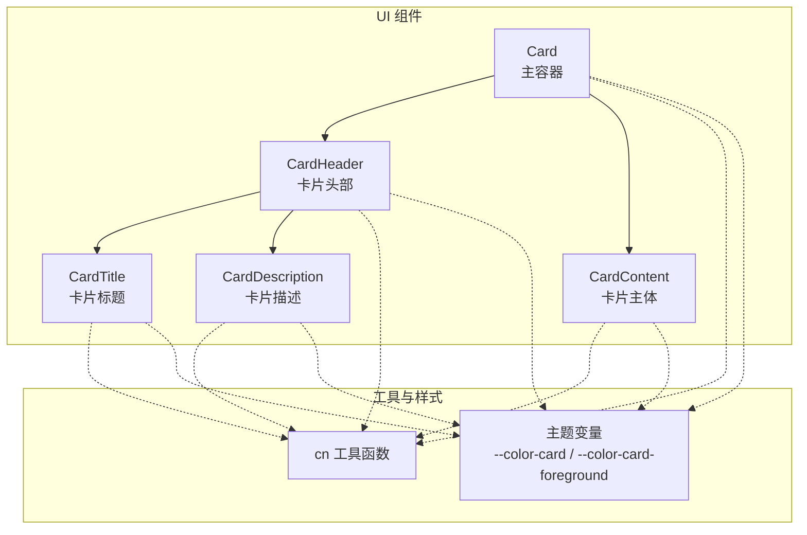
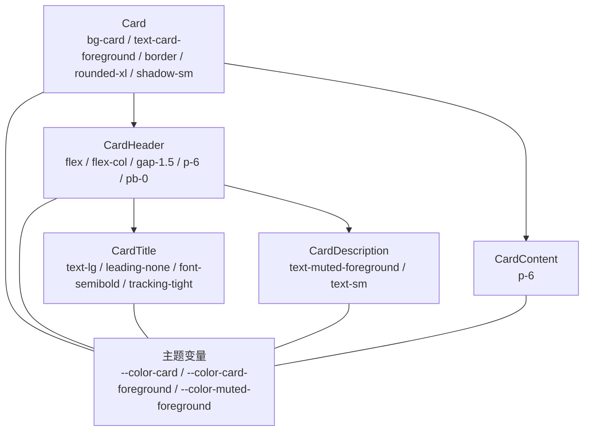
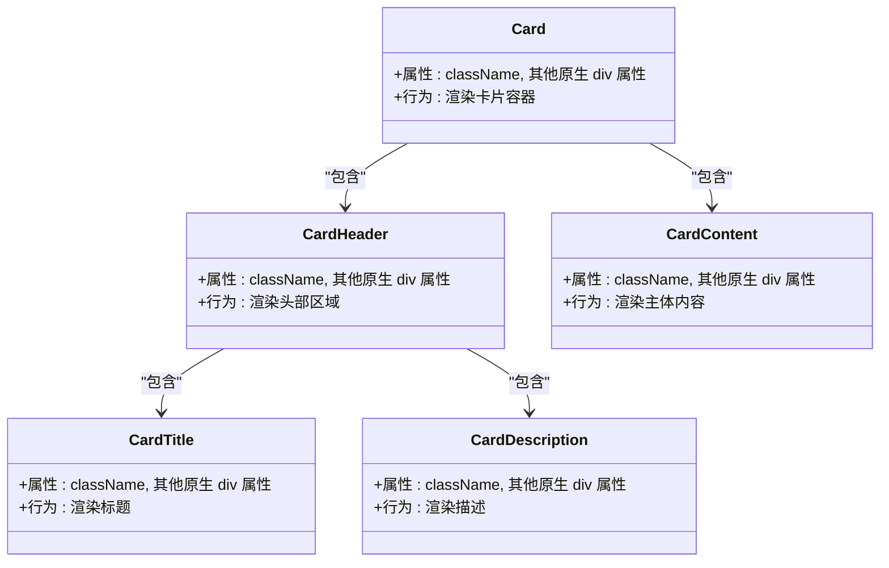
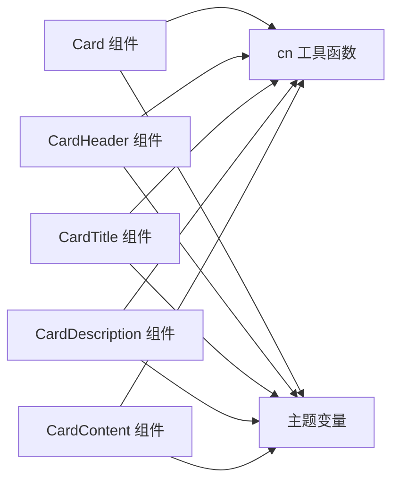

# Card 卡片组件

<cite>
**本文档引用的文件**
- [card.tsx](file://apps/web/src/components/ui/card.tsx)
- [utils.ts](file://apps/web/src/lib/utils.ts)
- [index.css](file://apps/web/src/styles/index.css)
- [Dashboard.tsx](file://apps/web/src/pages/Dashboard.tsx)
- [Login.tsx](file://apps/web/src/pages/Login.tsx)
- [Users.tsx](file://apps/web/src/pages/Users.tsx)
</cite>

## 目录

1. [简介](#简介)
2. [项目结构](#项目结构)
3. [核心组件](#核心组件)
4. [架构总览](#架构总览)
5. [详细组件分析](#详细组件分析)
6. [依赖关系分析](#依赖关系分析)
7. [性能考虑](#性能考虑)
8. [故障排除指南](#故障排除指南)
9. [结论](#结论)
10. [附录](#附录)

## 简介

本文件为 Card 卡片组件的完整技术文档，涵盖设计理念、布局配置、使用方法与最佳实践。Card 组件通过语义化 slot 标记与 Tailwind CSS 类名组合，提供统一的卡片容器能力；配合独立的头部、标题、描述与主体区域组件，形成清晰的信息分层结构。文档同时结合实际页面使用案例，说明响应式布局、阴影效果与交互状态的实现方式，并给出样式定制与组合模式建议。

## 项目结构

Card 组件位于前端 Web 应用的 UI 组件库中，采用细粒度拆分：主容器 Card 与子区域组件（Header、Title、Description、Content）分别导出，便于按需组合使用。样式系统基于 Tailwind CSS 与主题变量，通过 cn 工具函数合并类名，确保可维护性与一致性。

图表来源

- [card.tsx:4-48](file://apps/web/src/components/ui/card.tsx#L4-L48)
- [utils.ts:4-6](file://apps/web/src/lib/utils.ts#L4-L6)
- [index.css:38-41](file://apps/web/src/styles/index.css#L38-L41)

章节来源

- [card.tsx:1-49](file://apps/web/src/components/ui/card.tsx#L1-L49)
- [utils.ts:1-7](file://apps/web/src/lib/utils.ts#L1-L7)
- [index.css:1-130](file://apps/web/src/styles/index.css#L1-L130)

## 核心组件

- Card 主容器：提供卡片的基础外观（背景色、边框、圆角、阴影），并通过 data-slot="card" 标识语义槽位，支持通过 className 扩展样式。
- CardHeader 头部区域：用于放置标题与描述等头部信息，内置间距与排版规则，支持通过 className 自定义。
- CardTitle 标题：用于显示卡片的主要标题文本，内置字号、字重与行高设置。
- CardDescription 描述：用于显示辅助说明文字，内置“弱前景色”与字号规范。
- CardContent 主体内容：用于承载卡片内的具体内容，提供内边距与语义槽位标识。

这些组件均通过 cn 工具函数合并传入的 className，确保与主题变量和 Tailwind 类名协同工作。

章节来源

- [card.tsx:4-48](file://apps/web/src/components/ui/card.tsx#L4-L48)
- [utils.ts:4-6](file://apps/web/src/lib/utils.ts#L4-L6)
- [index.css:38-41](file://apps/web/src/styles/index.css#L38-L41)

## 架构总览

Card 组件体系遵循“容器 + 区域”的分层设计，通过语义化槽位与主题变量实现一致的视觉与交互体验。下图展示了组件间的依赖关系与样式来源：

图表来源

- [card.tsx:4-48](file://apps/web/src/components/ui/card.tsx#L4-L48)
- [index.css:38-41](file://apps/web/src/styles/index.css#L38-L41)

## 详细组件分析

### 设计理念与布局配置

- 语义化槽位：每个组件均带有 data-slot 属性，便于调试与样式覆盖。
- 分层结构：头部区（标题/描述）与主体区分离，提升信息层级与可读性。
- 响应式基础：头部区默认使用列向布局与间距，适配移动端紧凑空间。
- 主题集成：组件颜色来自主题变量，自动适配明暗模式。

章节来源

- [card.tsx:4-48](file://apps/web/src/components/ui/card.tsx#L4-L48)
- [index.css:86-118](file://apps/web/src/styles/index.css#L86-L118)

### 使用方法与组合模式

- 基础卡片：仅包含头部与主体，适合简单信息展示。
- 带描述卡片：在头部添加描述，增强上下文说明。
- 统一样式卡片：通过 className 覆盖默认样式，如调整阴影、边框或内边距。
- 响应式网格：在页面中以网格布局组合多个卡片，实现信息密度与对齐的一致性。

章节来源

- [Dashboard.tsx:98-109](file://apps/web/src/pages/Dashboard.tsx#L98-L109)
- [Login.tsx:100-110](file://apps/web/src/pages/Login.tsx#L100-L110)
- [Users.tsx:20-29](file://apps/web/src/pages/Users.tsx#L20-L29)

### 响应式布局与交互状态

- 响应式网格：Dashboard 中使用 sm:grid-cols-2、lg:grid-cols-4 实现统计卡片的自适应排列。
- 交互状态：部分页面将卡片作为按钮容器使用，通过 hover 效果与过渡动画增强交互反馈。
- 内容占位：在异步加载场景中，使用加载指示器填充卡片主体，保持布局稳定。

章节来源

- [Dashboard.tsx:98-109](file://apps/web/src/pages/Dashboard.tsx#L98-L109)
- [Dashboard.tsx:121-126](file://apps/web/src/pages/Dashboard.tsx#L121-L126)
- [Dashboard.tsx:65-77](file://apps/web/src/pages/Dashboard.tsx#L65-L77)

### 样式定制指南

- 背景色与前景色：通过 --color-card 与 --color-card-foreground 控制卡片背景与文字颜色。
- 弱前景色：通过 --color-muted-foreground 控制描述文本的颜色。
- 圆角与阴影：卡片默认使用圆角与轻微阴影，可通过 className 覆盖或移除。
- 边框与透明度：在需要时可移除边框或调整透明度以融入背景。

章节来源

- [index.css:38-41](file://apps/web/src/styles/index.css#L38-L41)
- [index.css:54-55](file://apps/web/src/styles/index.css#L54-L55)
- [index.css:89-90](file://apps/web/src/styles/index.css#L89-L90)
- [index.css:120-130](file://apps/web/src/styles/index.css#L120-L130)

### 组件类图

图表来源

- [card.tsx:4-48](file://apps/web/src/components/ui/card.tsx#L4-L48)

## 依赖关系分析

- 组件依赖 cn 工具函数进行类名合并，确保传入的 className 与默认样式正确叠加。
- 主题变量通过 CSS 自定义属性提供，Card 组件直接消费这些变量以实现明暗模式切换。
- 页面层通过组合 Card 子组件实现不同布局与交互效果。

图表来源

- [card.tsx:2-2](file://apps/web/src/components/ui/card.tsx#L2-L2)
- [utils.ts:4-6](file://apps/web/src/lib/utils.ts#L4-L6)
- [index.css:38-41](file://apps/web/src/styles/index.css#L38-L41)

章节来源

- [card.tsx:1-49](file://apps/web/src/components/ui/card.tsx#L1-L49)
- [utils.ts:1-7](file://apps/web/src/lib/utils.ts#L1-L7)
- [index.css:1-130](file://apps/web/src/styles/index.css#L1-L130)

## 性能考虑

- 组件轻量：Card 及其子组件均为无状态纯渲染组件，开销极低。
- 样式合并：通过 cn 合并类名，避免重复样式与冲突，减少不必要的重绘。
- 主题变量：使用 CSS 变量而非内联样式，有利于浏览器缓存与批量更新。
- 响应式布局：在页面层面使用网格布局，避免在组件内部进行复杂计算。

## 故障排除指南

- 样式不生效：确认是否正确传入 className，且未被更高优先级样式覆盖。
- 文本颜色异常：检查主题变量是否正确设置，或是否被局部样式覆盖。
- 布局错位：检查父容器的网格或 Flex 布局设置，避免影响子组件的排版。
- 明暗模式不一致：确认根元素是否应用了正确的主题类，以及 CSS 变量是否正确声明。

## 结论

Card 卡片组件通过简洁的分层设计与主题集成，提供了高度可复用的信息容器能力。结合页面中的多种组合模式与响应式布局实践，能够满足从信息展示到内容容器的广泛需求。建议在扩展样式时遵循主题变量与类名合并的最佳实践，以保证一致性和可维护性。

## 附录

### 使用示例路径

- 基础卡片组合（头部 + 标题 + 描述 + 主体）
  - [Dashboard.tsx:113-120](file://apps/web/src/pages/Dashboard.tsx#L113-L120)
  - [Login.tsx:100-110](file://apps/web/src/pages/Login.tsx#L100-L110)
  - [Users.tsx:20-29](file://apps/web/src/pages/Users.tsx#L20-L29)
- 响应式网格布局
  - [Dashboard.tsx:98-109](file://apps/web/src/pages/Dashboard.tsx#L98-L109)
- 交互式卡片（按钮容器）
  - [Dashboard.tsx:65-77](file://apps/web/src/pages/Dashboard.tsx#L65-L77)

### 样式定制参考

- 主题变量位置
  - [index.css:38-41](file://apps/web/src/styles/index.css#L38-L41)
  - [index.css:54-55](file://apps/web/src/styles/index.css#L54-L55)
  - [index.css:89-90](file://apps/web/src/styles/index.css#L89-L90)
- 类名合并工具
  - [utils.ts:4-6](file://apps/web/src/lib/utils.ts#L4-L6)
