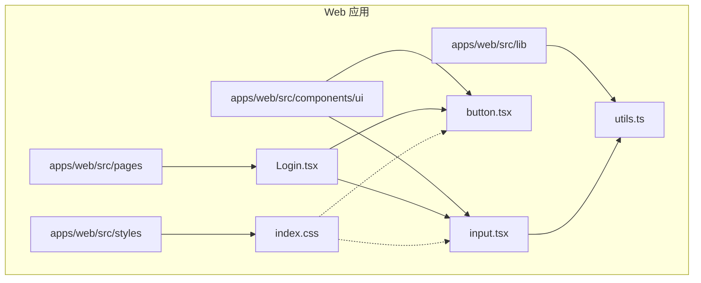
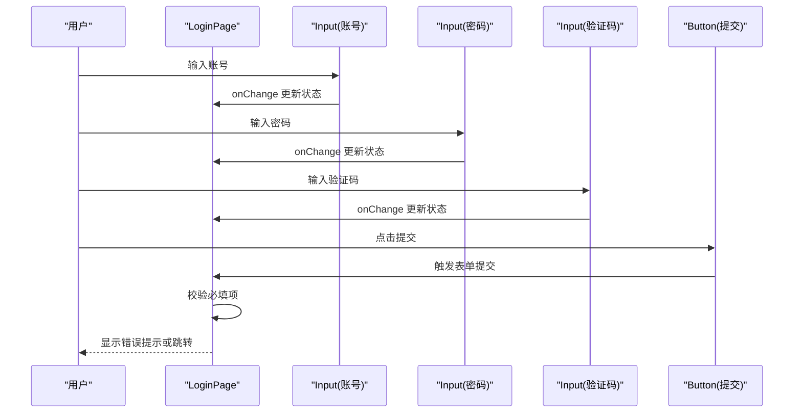
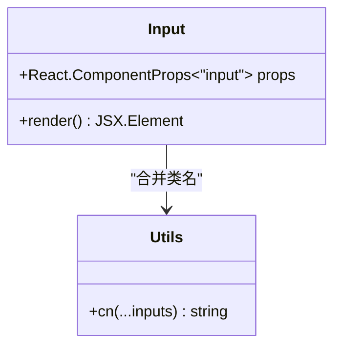
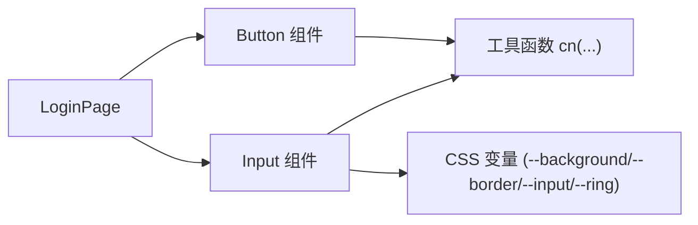

# Input 输入组件

<cite>
**本文档引用的文件**
- [input.tsx](file://apps/web/src/components/ui/input.tsx)
- [Login.tsx](file://apps/web/src/pages/Login.tsx)
- [utils.ts](file://apps/web/src/lib/utils.ts)
- [index.css](file://apps/web/src/styles/index.css)
- [button.tsx](file://apps/web/src/components/ui/button.tsx)
</cite>

## 目录
1. [简介](#简介)
2. [项目结构](#项目结构)
3. [核心组件](#核心组件)
4. [架构总览](#架构总览)
5. [详细组件分析](#详细组件分析)
6. [依赖关系分析](#依赖关系分析)
7. [性能考虑](#性能考虑)
8. [故障排除指南](#故障排除指南)
9. [结论](#结论)
10. [附录](#附录)

## 简介
本文件系统性梳理 Nebula Web 前端中 Input 输入组件的设计理念、属性配置、使用方式与最佳实践。围绕不同输入类型（文本、密码、邮箱等）、尺寸、状态（错误、成功、禁用）进行说明，并结合登录页的实际应用示例，阐述输入验证、格式化与实时反馈机制。同时提供样式定制指南与无障碍访问支持建议，帮助开发者在表单场景中高效、一致地使用 Input 组件。

## 项目结构
Input 组件位于前端应用的 UI 组件库目录下，采用最小封装原则：基于原生 input 元素，通过 Tailwind CSS 类名组合实现统一风格与可扩展性；其样式变量由全局主题 CSS 提供，确保在明暗模式下的一致表现。

图表来源
- [input.tsx:1-19](file://apps/web/src/components/ui/input.tsx#L1-L19)
- [Login.tsx:1-221](file://apps/web/src/pages/Login.tsx#L1-L221)
- [utils.ts:1-7](file://apps/web/src/lib/utils.ts#L1-L7)
- [index.css:1-130](file://apps/web/src/styles/index.css#L1-L130)
- [button.tsx:1-68](file://apps/web/src/components/ui/button.tsx#L1-L68)

章节来源
- [input.tsx:1-19](file://apps/web/src/components/ui/input.tsx#L1-L19)
- [Login.tsx:1-221](file://apps/web/src/pages/Login.tsx#L1-L221)
- [utils.ts:1-7](file://apps/web/src/lib/utils.ts#L1-L7)
- [index.css:1-130](file://apps/web/src/styles/index.css#L1-L130)
- [button.tsx:1-68](file://apps/web/src/components/ui/button.tsx#L1-L68)

## 核心组件
- 组件定位：轻量封装的原生 input 元素，提供统一的视觉风格与交互行为。
- 设计原则：
  - 最小 API：仅暴露必要的 props（className、type 及原生 input 支持的所有属性），避免过度封装。
  - 样式统一：通过 Tailwind 类名组合实现一致的边框、背景、占位符颜色、焦点环与禁用态。
  - 可扩展性：允许通过 className 进行局部覆盖，满足业务自定义需求。
  - 数据槽标记：使用 data-slot 属性便于测试与主题切换时的精准选择器。

章节来源
- [input.tsx:4-16](file://apps/web/src/components/ui/input.tsx#L4-L16)

## 架构总览
Input 组件在登录页中的使用体现了典型的“受控组件”模式：父组件维护输入值状态，Input 接收 value 与 onChange 回调，实现双向绑定与实时校验。登录页还展示了不同输入类型的典型用法（账号、密码、验证码），并通过按钮组件触发提交逻辑。

图表来源
- [Login.tsx:112-214](file://apps/web/src/pages/Login.tsx#L112-L214)
- [input.tsx:4-16](file://apps/web/src/components/ui/input.tsx#L4-L16)

章节来源
- [Login.tsx:112-214](file://apps/web/src/pages/Login.tsx#L112-L214)

## 详细组件分析

### 组件类图
Input 组件为纯函数组件，接收标准 input 属性并渲染原生 input 元素，内部通过工具函数合并类名，最终输出具备统一样式的输入框。

图表来源
- [input.tsx:4-16](file://apps/web/src/components/ui/input.tsx#L4-L16)
- [utils.ts:4-6](file://apps/web/src/lib/utils.ts#L4-L6)

章节来源
- [input.tsx:4-16](file://apps/web/src/components/ui/input.tsx#L4-L16)
- [utils.ts:4-6](file://apps/web/src/lib/utils.ts#L4-L6)

### 属性与配置
- 基础属性
  - type：支持原生 input 的所有类型（如 text、password、email、number 等）。登录页示例展示了 password 类型用于隐藏输入内容。
  - placeholder：设置占位符文本，增强可用性。
  - value / onChange：受控组件模式的关键属性，用于与父组件状态同步。
  - required：HTML5 必填约束，配合表单提交时的校验。
  - className：允许传入额外类名进行局部样式覆盖。
  - 其他原生 input 属性：如 autoComplete、disabled、minLength、maxLength、pattern 等均可透传。

- 样式与状态
  - 默认态：统一的边框、背景、字体大小与内边距，确保跨浏览器一致性。
  - 焦点态：显示焦点环（ring），提升键盘可达性。
  - 禁用态：禁用指针事件并降低不透明度，明确不可编辑状态。
  - 占位符：使用语义化的占位符颜色，保证对比度与可读性。
  - 数据槽标记：data-slot="input" 便于主题切换与自动化测试。

- 尺寸与布局
  - 组件本身不提供独立的尺寸变体，但可通过传入 className 调整高度、宽度与内边距，以适配不同布局需求。

章节来源
- [input.tsx:4-16](file://apps/web/src/components/ui/input.tsx#L4-L16)
- [Login.tsx:123-161](file://apps/web/src/pages/Login.tsx#L123-L161)

### 不同类型与场景
- 文本输入：适用于普通文本字段，如账号、昵称等。
- 密码输入：type="password" 隐藏字符，配合自动完成策略（如 current-password）提升安全性与体验。
- 邮箱输入：type="email" 可获得基础的邮箱格式提示（视浏览器而定）。
- 数字输入：type="number" 限制数字输入，适合年龄、数量等场景。
- 自动完成：根据用途设置合适的 autoComplete 值，减少重复输入与安全风险。

章节来源
- [Login.tsx:123-161](file://apps/web/src/pages/Login.tsx#L123-L161)

### 状态管理与实时反馈
- 错误状态：通过表单提交后的错误展示组件进行反馈，例如登录失败时的错误提示。
- 成功状态：在无错误且数据有效时，保持默认外观，必要时可结合外部反馈组件进行确认提示。
- 禁用状态：在请求进行中或条件不满足时禁用输入框，防止重复提交或无效操作。
- 实时校验：可在 onChange 中进行简单校验（如长度、格式），并在 UI 上即时给出视觉反馈（如边框颜色变化）。

章节来源
- [Login.tsx:198-203](file://apps/web/src/pages/Login.tsx#L198-L203)
- [Login.tsx:206-213](file://apps/web/src/pages/Login.tsx#L206-L213)

### 表单集成与最佳实践
- 受控组件：始终通过 value 与 onChange 维护输入状态，避免非受控模式带来的复杂性。
- 标签关联：为每个输入框提供对应的 label 标签，提升可访问性与用户体验。
- 提交流程：在表单层面集中处理提交逻辑，先进行前端校验，再发起后端请求。
- 错误处理：对网络异常、服务端错误等情况进行统一处理，并向用户清晰反馈。
- 无障碍：确保键盘可达、屏幕阅读器友好，提供清晰的错误信息与提示文案。

章节来源
- [Login.tsx:112-214](file://apps/web/src/pages/Login.tsx#L112-L214)

### 样式定制指南
- 主题变量：组件依赖全局 CSS 变量（如 --background、--border、--input、--ring 等），通过修改这些变量即可实现整体风格切换。
- 暗色模式：通过 .dark 选择器与变量重映射，确保在深色环境下仍具高对比度与可读性。
- 局部覆盖：通过传入 className 对组件进行微调（如调整内边距、圆角半径、阴影等），但建议遵循设计系统规范。
- 与按钮联动：在表单中与 Button 组件配合使用，保持视觉与交互的一致性。

章节来源
- [index.css:24-49](file://apps/web/src/styles/index.css#L24-L49)
- [index.css:51-118](file://apps/web/src/styles/index.css#L51-L118)
- [button.tsx:7-42](file://apps/web/src/components/ui/button.tsx#L7-L42)

### 无障碍访问支持
- 语义化标签：为每个输入框提供关联的 label，确保屏幕阅读器能正确朗读。
- 键盘导航：组件默认支持键盘聚焦与操作，确保无需鼠标即可完成输入。
- 焦点可见性：通过焦点环（ring）突出当前聚焦元素，提升导航体验。
- 错误提示：当输入无效时，提供明确的错误信息与视觉提示，辅助用户修正。
- 自动完成功能：合理设置 autoComplete，减少重复输入与潜在的安全风险。

章节来源
- [Login.tsx:119-161](file://apps/web/src/pages/Login.tsx#L119-L161)

## 依赖关系分析
Input 组件的依赖链路简洁清晰：直接依赖工具函数进行类名合并，样式由全局 CSS 提供，运行时通过数据槽标记与主题变量实现可定制性。

图表来源
- [input.tsx:4-16](file://apps/web/src/components/ui/input.tsx#L4-L16)
- [utils.ts:4-6](file://apps/web/src/lib/utils.ts#L4-L6)
- [index.css:24-49](file://apps/web/src/styles/index.css#L24-L49)
- [Login.tsx:112-214](file://apps/web/src/pages/Login.tsx#L112-L214)
- [button.tsx:44-67](file://apps/web/src/components/ui/button.tsx#L44-L67)

章节来源
- [input.tsx:4-16](file://apps/web/src/components/ui/input.tsx#L4-L16)
- [utils.ts:4-6](file://apps/web/src/lib/utils.ts#L4-L6)
- [index.css:24-49](file://apps/web/src/styles/index.css#L24-L49)
- [Login.tsx:112-214](file://apps/web/src/pages/Login.tsx#L112-L214)
- [button.tsx:44-67](file://apps/web/src/components/ui/button.tsx#L44-L67)

## 性能考虑
- 渲染开销：作为轻量封装，Input 的渲染成本极低，适合高频使用的表单场景。
- 样式计算：通过 Tailwind 类名组合与 CSS 变量，避免运行时样式计算，提升渲染效率。
- 事件处理：建议在父组件层进行节流/防抖处理（如搜索场景），避免频繁重渲染。
- 图片/资源：验证码图片属于外部资源，应关注加载与缓存策略，避免阻塞主流程。

## 故障排除指南
- 输入框无样式或样式错乱
  - 检查全局 CSS 是否正确引入，确认 CSS 变量未被覆盖。
  - 确认 data-slot="input" 未被意外移除，以便主题系统正确识别。
- 焦点环不可见
  - 检查是否禁用了默认样式或覆盖了 ring 相关类名。
- 自动完成问题
  - 确保为输入框设置了正确的 autoComplete 值（如 username、current-password）。
- 表单提交失败
  - 在父组件中检查必填项与格式校验逻辑，确保错误信息清晰可见。
  - 关注网络请求状态与错误响应，提供友好的用户提示。

章节来源
- [index.css:120-130](file://apps/web/src/styles/index.css#L120-L130)
- [Login.tsx:198-203](file://apps/web/src/pages/Login.tsx#L198-L203)

## 结论
Input 输入组件以“最小 API + 统一样式 + 可扩展性”为核心设计理念，在登录页等关键业务场景中展现了良好的可用性与可维护性。通过合理的类型选择、状态管理与无障碍支持，能够为用户提供一致、可靠且易用的输入体验。配合全局主题变量与工具函数，开发者可以轻松实现风格定制与规模化复用。

## 附录
- 使用要点速记
  - 优先使用受控组件模式，确保状态单一可信源。
  - 合理设置 type 与 autoComplete，兼顾安全与体验。
  - 通过 className 进行局部覆盖，避免破坏整体风格。
  - 在表单中与 Button、Alert 等组件协同，形成完整的交互闭环。