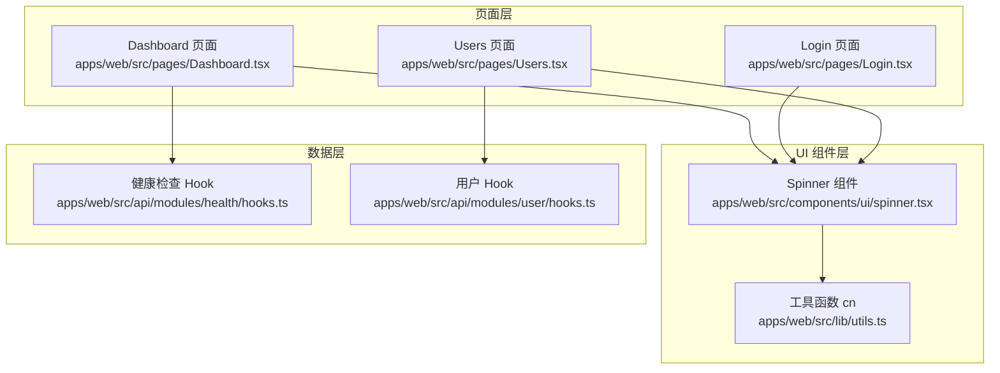
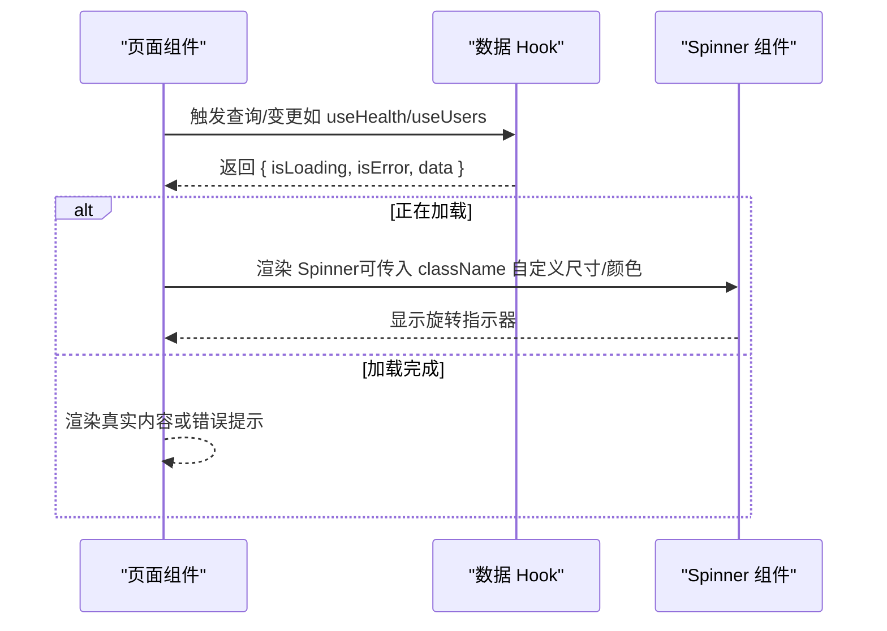
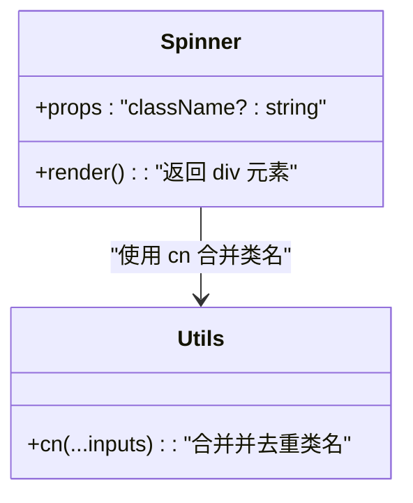
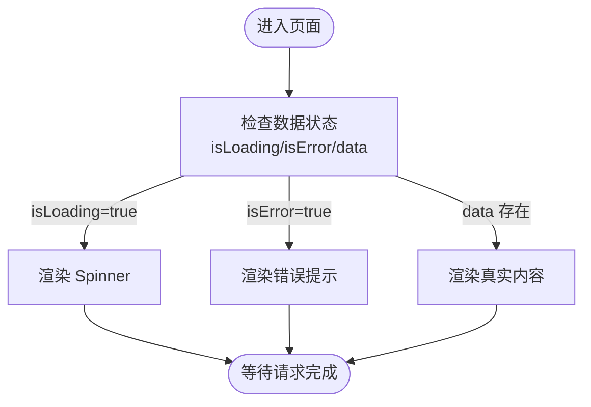
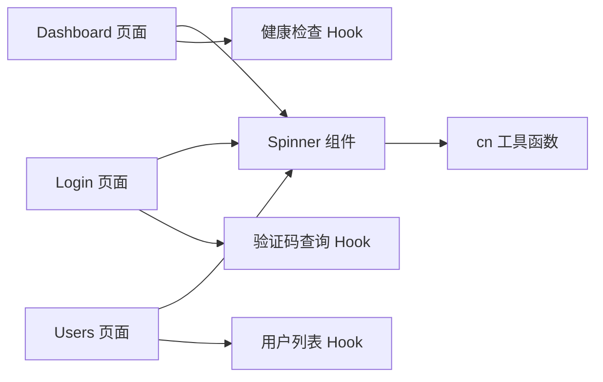

# Spinner 加载组件

<cite>
**本文档引用的文件**
- [spinner.tsx](file://apps/web/src/components/ui/spinner.tsx)
- [utils.ts](file://apps/web/src/lib/utils.ts)
- [Dashboard.tsx](file://apps/web/src/pages/Dashboard.tsx)
- [Login.tsx](file://apps/web/src/pages/Login.tsx)
- [Users.tsx](file://apps/web/src/pages/Users.tsx)
- [hooks.ts（健康检查）](file://apps/web/src/api/modules/health/hooks.ts)
- [hooks.ts（用户）](file://apps/web/src/api/modules/user/hooks.ts)
</cite>

## 目录
1. [简介](#简介)
2. [项目结构](#项目结构)
3. [核心组件](#核心组件)
4. [架构总览](#架构总览)
5. [详细组件分析](#详细组件分析)
6. [依赖关系分析](#依赖关系分析)
7. [性能考量](#性能考量)
8. [故障排查指南](#故障排查指南)
9. [结论](#结论)
10. [附录](#附录)

## 简介
本文件围绕前端 Web 应用中的 Spinner 加载组件展开，系统性阐述其设计理念、尺寸与样式配置、状态管理与用户体验策略，并结合实际页面使用场景（数据请求、页面切换、操作执行）给出实践示例与优化建议。该组件采用轻量设计，通过 Tailwind CSS 类名组合实现旋转动画与圆环样式，支持通过 className 扩展自定义尺寸与颜色。

## 项目结构
Spinner 组件位于 UI 组件层，被多个页面在不同状态下复用，典型使用包括：
- 数据请求加载态：Dashboard 页面的健康检查、Users 页面的用户列表
- 表单交互加载态：Login 页面的验证码刷新与登录提交按钮状态联动

图表来源
- [spinner.tsx](file://apps/web/src/components/ui/ui/spinner.tsx)
- [utils.ts](file://apps/web/src/lib/utils.ts)
- [Dashboard.tsx](file://apps/web/src/pages/Dashboard.tsx)
- [Login.tsx](file://apps/web/src/pages/Login.tsx)
- [Users.tsx](file://apps/web/src/pages/Users.tsx)
- [hooks.ts（健康检查）](file://apps/web/src/api/modules/health/hooks.ts)
- [hooks.ts（用户）](file://apps/web/src/api/modules/user/hooks.ts)

章节来源
- [spinner.tsx:1-13](file://apps/web/src/components/ui/spinner.tsx#L1-L13)
- [utils.ts:1-7](file://apps/web/src/lib/utils.ts#L1-L7)
- [Dashboard.tsx:1-205](file://apps/web/src/pages/Dashboard.tsx#L1-L205)
- [Login.tsx:1-221](file://apps/web/src/pages/Login.tsx#L1-L221)
- [Users.tsx:1-34](file://apps/web/src/pages/Users.tsx#L1-L34)
- [hooks.ts（健康检查）:1-11](file://apps/web/src/api/modules/health/hooks.ts#L1-L11)
- [hooks.ts（用户）:1-56](file://apps/web/src/api/modules/user/hooks.ts#L1-L56)

## 核心组件
- 组件名称：Spinner
- 文件路径：apps/web/src/components/ui/spinner.tsx
- 设计理念：极简的圆形旋转指示器，使用边框绘制圆环，顶部透明形成“环形”效果；通过 animate-spin 实现旋转动画；默认尺寸为 6，颜色继承主题 primary。
- 关键属性：
  - className：可选，用于扩展尺寸、颜色、布局等样式（例如通过 size-*、text-*、bg-*、border-* 等类名覆盖）
- 默认样式要点：
  - 边框宽度固定为 2
  - 顶部透明（无填充），仅边框可见
  - 圆角与居中对齐
  - 旋转动画由 animate-spin 提供

使用示例（路径引用）：
- 在 Dashboard 页面中，当健康检查查询处于 loading 状态时展示 Spinner
  - [Dashboard.tsx:122-125](file://apps/web/src/pages/Dashboard.tsx#L122-L125)
- 在 Users 页面中，当用户列表查询处于 loading 状态时展示 Spinner（自定义尺寸为 8）
  - [Users.tsx:9-11](file://apps/web/src/pages/Users.tsx#L9-L11)
- 在 Login 页面中，验证码查询处于 loading 状态时展示 Spinner
  - [Login.tsx:165-168](file://apps/web/src/pages/Login.tsx#L165-L168)

章节来源
- [spinner.tsx:1-13](file://apps/web/src/components/ui/spinner.tsx#L1-L13)
- [utils.ts:1-7](file://apps/web/src/lib/utils.ts#L1-L7)
- [Dashboard.tsx:122-125](file://apps/web/src/pages/Dashboard.tsx#L122-L125)
- [Login.tsx:165-168](file://apps/web/src/pages/Login.tsx#L165-L168)
- [Users.tsx:9-11](file://apps/web/src/pages/Users.tsx#L9-L11)

## 架构总览
Spinner 组件不直接发起网络请求，而是作为 UI 展示层组件，配合数据层 Hook 的状态进行条件渲染。典型流程如下：

图表来源
- [Dashboard.tsx:82-83](file://apps/web/src/pages/Dashboard.tsx#L82-L83)
- [Login.tsx:62-63](file://apps/web/src/pages/Login.tsx#L62-L63)
- [Users.tsx](file://apps/web/src/pages/Users.tsx#L7)
- [hooks.ts（健康检查）:4-10](file://apps/web/src/api/modules/health/hooks.ts#L4-L10)
- [hooks.ts（用户）:9-14](file://apps/web/src/api/modules/user/hooks.ts#L9-L14)
- [spinner.tsx:3-12](file://apps/web/src/components/ui/spinner.tsx#L3-L12)

## 详细组件分析

### 组件实现与样式解析
- 组件导出：函数式组件，接收 className 可选参数
- 样式拼接：通过工具函数 cn 合并默认类名与传入 className
- 默认类名含义（语义化解释）：
  - border-primary：边框颜色使用主题 primary
  - size-6：元素尺寸为 6（具体像素取决于 Tailwind 配置）
  - animate-spin：应用旋转动画
  - rounded-full：圆角
  - border-2：边框宽度为 2
  - border-t-transparent：顶部透明（形成环形）

图表来源
- [spinner.tsx:1-13](file://apps/web/src/components/ui/spinner.tsx#L1-L13)
- [utils.ts:4-6](file://apps/web/src/lib/utils.ts#L4-L6)

章节来源
- [spinner.tsx:1-13](file://apps/web/src/components/ui/spinner.tsx#L1-L13)
- [utils.ts:1-7](file://apps/web/src/lib/utils.ts#L1-L7)

### 尺寸与颜色配置
- 尺寸配置
  - 默认：size-6（组件内已设定）
  - 自定义：通过传入 className 覆盖 size-* 类名（如 size-8）
  - 示例：Users 页面中使用了自定义尺寸
    - [Users.tsx](file://apps/web/src/pages/Users.tsx#L10)
- 颜色配置
  - 默认：border-primary（继承主题 primary）
  - 自定义：通过传入 className 覆盖 border-* 或 text-* 类名
  - 示例：Dashboard 中沿用默认 primary 边框
    - [Dashboard.tsx](file://apps/web/src/pages/Dashboard.tsx#L124)
- 动画样式
  - 默认：animate-spin（组件内已设定）
  - 自定义：可通过传入 className 覆盖动画类名（谨慎使用，避免破坏视觉一致性）

章节来源
- [spinner.tsx](file://apps/web/src/components/ui/spinner.tsx#L7)
- [Dashboard.tsx](file://apps/web/src/pages/Dashboard.tsx#L124)
- [Users.tsx](file://apps/web/src/pages/Users.tsx#L10)

### 状态管理与显示时机
- 常见状态
  - isLoading：数据请求中，展示 Spinner
  - isError：请求失败，通常展示错误提示而非 Spinner
  - data：请求成功，渲染真实内容
- 页面级使用
  - Dashboard：健康检查查询处于 loading 时展示 Spinner
    - [Dashboard.tsx:122-125](file://apps/web/src/pages/Dashboard.tsx#L122-L125)
  - Login：验证码查询处于 loading 时展示 Spinner
    - [Login.tsx:165-168](file://apps/web/src/pages/Login.tsx#L165-L168)
  - Users：用户列表查询处于 loading 时展示 Spinner（自定义尺寸）
    - [Users.tsx:9-11](file://apps/web/src/pages/Users.tsx#L9-L11)

图表来源
- [Dashboard.tsx:122-125](file://apps/web/src/pages/Dashboard.tsx#L122-L125)
- [Login.tsx:165-168](file://apps/web/src/pages/Login.tsx#L165-L168)
- [Users.tsx:9-11](file://apps/web/src/pages/Users.tsx#L9-L11)

章节来源
- [Dashboard.tsx:122-125](file://apps/web/src/pages/Dashboard.tsx#L122-L125)
- [Login.tsx:165-168](file://apps/web/src/pages/Login.tsx#L165-L168)
- [Users.tsx:9-11](file://apps/web/src/pages/Users.tsx#L9-L11)

### 用户体验考虑
- 明确的反馈：在长时间请求或网络延迟时，及时展示 Spinner，避免用户误以为页面卡死
- 合理的尺寸：根据容器大小选择合适尺寸，确保视觉平衡
- 一致性：同一功能区保持统一的加载样式与颜色
- 可读性：在复杂布局中，Spinner 应有明确的对齐与间距，避免遮挡关键信息
- 无障碍：Spinner 不替代文本提示，必要时配合文字说明（如“加载中…”）

## 依赖关系分析
- 组件依赖
  - 工具函数 cn：用于合并类名，保证样式覆盖与去重
- 页面依赖
  - Dashboard：依赖健康检查 Hook 的查询状态
  - Login：依赖验证码查询与登录 Mutation 的状态
  - Users：依赖用户列表查询的状态
- 外部库
  - Tailwind CSS：提供尺寸、颜色、动画类名
  - @tanstack/react-query：提供查询与变更状态（isLoading/isError 等）

图表来源
- [spinner.tsx:1-13](file://apps/web/src/components/ui/spinner.tsx#L1-L13)
- [utils.ts:4-6](file://apps/web/src/lib/utils.ts#L4-L6)
- [Dashboard.tsx:82-83](file://apps/web/src/pages/Dashboard.tsx#L82-L83)
- [Login.tsx:62-63](file://apps/web/src/pages/Login.tsx#L62-L63)
- [Users.tsx](file://apps/web/src/pages/Users.tsx#L7)
- [hooks.ts（健康检查）:4-10](file://apps/web/src/api/modules/health/hooks.ts#L4-L10)
- [hooks.ts（用户）:9-14](file://apps/web/src/api/modules/user/hooks.ts#L9-L14)

章节来源
- [spinner.tsx:1-13](file://apps/web/src/components/ui/spinner.tsx#L1-L13)
- [utils.ts:1-7](file://apps/web/src/lib/utils.ts#L1-L7)
- [Dashboard.tsx:82-83](file://apps/web/src/pages/Dashboard.tsx#L82-L83)
- [Login.tsx:62-63](file://apps/web/src/pages/Login.tsx#L62-L63)
- [Users.tsx](file://apps/web/src/pages/Users.tsx#L7)
- [hooks.ts（健康检查）:4-10](file://apps/web/src/api/modules/health/hooks.ts#L4-L10)
- [hooks.ts（用户）:9-14](file://apps/web/src/api/modules/user/hooks.ts#L9-L14)

## 性能考量
- 渲染开销
  - Spinner 为纯 DOM 元素，开销极低；动画由浏览器合成层驱动，性能良好
- 条件渲染
  - 仅在 isLoading 时渲染，避免不必要的节点创建
- 样式合并
  - 使用 cn 合并类名，减少重复样式声明，提升样式计算效率
- 动画节流
  - animate-spin 由浏览器处理，无需额外逻辑；若需自定义动画，建议使用 transform rotate 并配合 will-change 或 GPU 加速属性
- 请求频率
  - 对于频繁刷新的数据（如健康检查），设置合理的 refetchInterval，避免过度请求导致 UI 抖动与资源浪费
  - 示例参考：健康检查 Hook 的 refetchInterval 设置
    - [hooks.ts（健康检查）](file://apps/web/src/api/modules/health/hooks.ts#L8)

## 故障排查指南
- Spinner 不显示
  - 检查父组件是否在非 isLoading 状态下渲染了其他内容
  - 确认数据 Hook 的状态是否正确传递
  - 参考：Dashboard 与 Users 页面的条件渲染
    - [Dashboard.tsx:122-125](file://apps/web/src/pages/Dashboard.tsx#L122-L125)
    - [Users.tsx:9-11](file://apps/web/src/pages/Users.tsx#L9-L11)
- Spinner 颜色或尺寸异常
  - 检查传入的 className 是否覆盖了 size-* 或 border-* 类名
  - 确认 Tailwind 主题与类名拼接顺序
  - 参考：Users 页面自定义尺寸的使用
    - [Users.tsx](file://apps/web/src/pages/Users.tsx#L10)
- 动画不生效
  - 确认 animate-spin 类名未被覆盖
  - 若自定义动画，确保使用浏览器支持的 transform rotate 与合适的性能属性
- 加载时间过长
  - 优化数据请求与缓存策略，合理设置 refetchInterval
  - 参考：健康检查 Hook 的 refetchInterval
    - [hooks.ts（健康检查）](file://apps/web/src/api/modules/health/hooks.ts#L8)

章节来源
- [Dashboard.tsx:122-125](file://apps/web/src/pages/Dashboard.tsx#L122-L125)
- [Login.tsx:165-168](file://apps/web/src/pages/Login.tsx#L165-L168)
- [Users.tsx:9-11](file://apps/web/src/pages/Users.tsx#L9-L11)
- [hooks.ts（健康检查）](file://apps/web/src/api/modules/health/hooks.ts#L8)

## 结论
Spinner 加载组件以简洁、高性能的方式为用户提供了清晰的加载反馈。通过与数据层 Hook 的状态绑定，它能够在不同页面与场景中准确反映加载状态。合理配置尺寸与颜色、遵循一致的视觉规范、结合良好的状态管理与性能优化策略，可以显著提升用户体验与系统稳定性。

## 附录
- 使用建议清单
  - 在 isLoading 时显示 Spinner，在 isError 时显示错误提示
  - 为不同容器选择合适的尺寸（如 size-6、size-8）
  - 使用 border-primary 保持品牌一致性
  - 避免在短时间内频繁刷新导致的视觉闪烁
  - 对高频刷新的数据设置合理的 refetchInterval