# UI 组件库

<cite>
**本文档引用的文件**
- [button.tsx](file://apps/web/src/components/ui/button.tsx)
- [input.tsx](file://apps/web/src/components/ui/input.tsx)
- [card.tsx](file://apps/web/src/components/ui/card.tsx)
- [alert.tsx](file://apps/web/src/components/ui/alert.tsx)
- [badge.tsx](file://apps/web/src/components/ui/badge.tsx)
- [checkbox.tsx](file://apps/web/src/components/ui/checkbox.tsx)
- [dialog.tsx](file://apps/web/src/components/ui/dialog.tsx)
- [field.tsx](file://apps/web/src/components/ui/field.tsx)
- [label.tsx](file://apps/web/src/components/ui/label.tsx)
- [radio-group.tsx](file://apps/web/src/components/ui/radio-group.tsx)
- [select.tsx](file://apps/web/src/components/ui/select.tsx)
- [separator.tsx](file://apps/web/src/components/ui/separator.tsx)
- [sheet.tsx](file://apps/web/src/components/ui/sheet.tsx)
- [switch.tsx](file://apps/web/src/components/ui/switch.tsx)
- [table.tsx](file://apps/web/src/components/ui/table.tsx)
- [pagination.tsx](file://apps/web/src/components/ui/pagination.tsx)
- [sonner.tsx](file://apps/web/src/components/ui/sonner.tsx)
- [avatar.tsx](file://apps/web/src/components/ui/avatar.tsx)
- [dropdown-menu.tsx](file://apps/web/src/components/ui/dropdown-menu.tsx)
- [spinner.tsx](file://apps/web/src/components/ui/spinner.tsx)
- [data-table-column-header.tsx](file://apps/web/src/components/data-table/data-table-column-header.tsx)
- [data-table-pagination.tsx](file://apps/web/src/components/data-table/data-table-pagination.tsx)
- [data-table-view-options.tsx](file://apps/web/src/components/data-table/data-table-view-options.tsx)
- [create-column-helper.ts](file://apps/web/src/components/data-table/create-column-helper.ts)
- [index.ts](file://apps/web/src/components/data-table/index.ts)
- [ApiErrorSnackbar.tsx](file://apps/web/src/components/ApiErrorSnackbar.tsx)
- [RequireAuth.tsx](file://apps/web/src/components/RequireAuth.tsx)
- [utils.ts](file://apps/web/src/lib/utils.ts)
- [index.css](file://apps/web/src/styles/index.css)
- [package.json](file://apps/web/package.json)
- [Dashboard.tsx](file://apps/web/src/pages/Dashboard.tsx)
- [Login.tsx](file://apps/web/src/pages/Login.tsx)
- [use-nebula-form.ts](file://apps/web/src/hooks/use-nebula-form.ts)
- [pnpm-lock.yaml](file://pnpm-lock.yaml)
</cite>

## 目录

1. [简介](#简介)
2. [项目结构](#项目结构)
3. [核心组件](#核心组件)
4. [架构总览](#架构总览)
5. [详细组件分析](#详细组件分析)
6. [依赖分析](#依赖分析)
7. [性能考虑](#性能考虑)
8. [故障排查指南](#故障排查指南)
9. [结论](#结论)
10. [附录](#附录)

## 简介

本文件为基于 Radix UI 与自定义样式的 UI 组件库的系统化文档，覆盖基础组件（Button、Input、Card 等）、新增组件（Badge、Checkbox、Dialog、Field、Label、RadioGroup、Select、Separator、Sheet、Switch、Table、Sonner 等）、**模块化数据表格组件系统**（DataTableColumnHeader、DataTablePagination、DataTableViewOptions、createColumnHelper）、可访问性支持、主题定制与样式系统、组件组合模式、事件处理机制以及响应式设计实践。文档同时提供组件使用示例与设计规范指导，帮助开发者在保持一致性的前提下进行扩展与集成。

**重要更新**：表单组件系统已完成重大重构，原有的 Form.tsx 已被移除，替换为全新的 Field 组件系统，包括 Field、FieldGroup、FieldLabel、FieldError 等组件，以及 useNebulaForm 钩子。Login 页面已完全迁移到新的表单架构。**数据表格组件系统已完全模块化重构，旧的单体 DataTable 组件已被移除，新增了专门的数据表格组件模块**。

## 项目结构

组件库位于前端应用的组件目录中，采用按功能分层组织方式：

- 样式与主题：通过 Tailwind CSS 与自定义 CSS 变量构建主题系统，并引入动画与字体资源。
- 工具函数：统一的类名合并工具，确保变体与用户传入类名的合并逻辑稳定可靠。
- 页面示例：Dashboard 与 Login 页面展示了组件的实际组合与交互用法。
- 新增组件：Badge、Checkbox、Dialog、Field、Label、RadioGroup、Select、Separator、Sheet、Switch、Table、Sonner 等组件丰富了组件库的功能体系。
- **数据表格系统**：全新的模块化数据表格组件系统，包括 DataTableColumnHeader、DataTablePagination、DataTableViewOptions 等专用组件，以及 createColumnHelper 工具函数。
- 表单系统：全新的 Field 组件系统替代了原有的 Form 组件，提供更灵活的表单构建能力。

```mermaid
graph TB
subgraph "样式与主题"
CSS["styles/index.css"]
TW["Tailwind CSS<br/>自定义变量与变体"]
END
subgraph "基础组件"
BTN["components/ui/button.tsx"]
INP["components/ui/input.tsx"]
CARD["components/ui/card.tsx"]
ALERT["components/ui/alert.tsx"]
SPIN["components/ui/spinner.tsx"]
AVATAR["components/ui/avatar.tsx"]
DROPDOWN["components/ui/dropdown-menu.tsx"]
FIELD["components/ui/field.tsx"]
TABLE["components/ui/table.tsx"]
PAGINATION["components/ui/pagination.tsx"]
END
subgraph "新增组件"
BADGE["components/ui/badge.tsx"]
CHECKBOX["components/ui/checkbox.tsx"]
DIALOG["components/ui/dialog.tsx"]
LABEL["components/ui/label.tsx"]
RADIO["components/ui/radio-group.tsx"]
SELECT["components/ui/select.tsx"]
SEPARATOR["components/ui/separator.tsx"]
SHEET["components/ui/sheet.tsx"]
SWITCH["components/ui/switch.tsx"]
SONNER["components/ui/sonner.tsx"]
END
subgraph "数据表格系统"
DT_HEADER["components/data-table/data-table-column-header.tsx"]
DT_PAGINATION["components/data-table/data-table-pagination.tsx"]
DT_VIEW["components/data-table/data-table-view-options.tsx"]
DT_HELPER["components/data-table/create-column-helper.ts"]
DT_INDEX["components/data-table/index.ts"]
END
subgraph "表单系统"
USEFORM["hooks/use-nebula-form.ts"]
LOGIN["pages/Login.tsx"]
END
subgraph "工具"
UTIL["lib/utils.ts"]
END
subgraph "页面示例"
DASH["pages/Dashboard.tsx"]
ERRORSNACK["components/ApiErrorSnackbar.tsx"]
AUTH["components/RequireAuth.tsx"]
END
CSS --> BTN
CSS --> INP
CSS --> CARD
CSS --> ALERT
CSS --> SPIN
CSS --> AVATAR
CSS --> DROPDOWN
CSS --> FIELD
CSS --> TABLE
CSS --> PAGINATION
CSS --> BADGE
CSS --> CHECKBOX
CSS --> DIALOG
CSS --> LABEL
CSS --> RADIO
CSS --> SELECT
CSS --> SEPARATOR
CSS --> SHEET
CSS --> SWITCH
CSS --> SONNER
UTIL --> BTN
UTIL --> INP
UTIL --> CARD
UTIL --> ALERT
UTIL --> SPIN
UTIL --> AVATAR
UTIL --> DROPDOWN
UTIL --> FIELD
UTIL --> TABLE
UTIL --> PAGINATION
UTIL --> BADGE
UTIL --> CHECKBOX
UTIL --> DIALOG
UTIL --> LABEL
UTIL --> RADIO
UTIL --> SELECT
UTIL --> SEPARATOR
UTIL --> SHEET
UTIL --> SWITCH
UTIL --> SONNER
DT_INDEX --> DT_HEADER
DT_INDEX --> DT_PAGINATION
DT_INDEX --> DT_VIEW
DT_INDEX --> DT_HELPER
BTN --> DASH
INP --> DASH
CARD --> DASH
SPIN --> DASH
BADGE --> DASH
CHECKBOX --> DASH
DIALOG --> DASH
LABEL --> DASH
RADIO --> DASH
SELECT --> DASH
SEPARATOR --> DASH
SHEET --> DASH
SWITCH --> DASH
TABLE --> DASH
SONNER --> DASH
PAGINATION --> DASH
ERRORSNACK --> DASH
AUTH --> DASH
BTN --> LOGIN
INP --> LOGIN
CARD --> LOGIN
ALERT --> LOGIN
SPIN --> LOGIN
FIELD --> LOGIN
USEFORM --> LOGIN
```

**图表来源**
- [index.css:1-130](file://apps/web/src/styles/index.css#L1-L130)
- [button.tsx:1-68](file://apps/web/src/components/ui/button.tsx#L1-L68)
- [input.tsx:1-19](file://apps/web/src/components/ui/input.tsx#L1-L19)
- [card.tsx:1-49](file://apps/web/src/components/ui/card.tsx#L1-L49)
- [alert.tsx:1-62](file://apps/web/src/components/ui/alert.tsx#L1-L62)
- [spinner.tsx:1-13](file://apps/web/src/components/ui/spinner.tsx#L1-L13)
- [utils.ts:1-7](file://apps/web/src/lib/utils.ts#L1-L7)
- [Dashboard.tsx:1-205](file://apps/web/src/pages/Dashboard.tsx#L1-L205)
- [Login.tsx:1-263](file://apps/web/src/pages/Login.tsx#L1-L263)
- [field.tsx:1-223](file://apps/web/src/components/ui/field.tsx#L1-L223)
- [table.tsx:1-52](file://apps/web/src/components/ui/table.tsx#L1-L52)
- [pagination.tsx:1-200](file://apps/web/src/components/ui/pagination.tsx#L1-L200)
- [data-table-column-header.tsx:1-200](file://apps/web/src/components/data-table/data-table-column-header.tsx#L1-L200)
- [data-table-pagination.tsx:1-200](file://apps/web/src/components/data-table/data-table-pagination.tsx#L1-L200)
- [data-table-view-options.tsx:1-200](file://apps/web/src/components/data-table/data-table-view-options.tsx#L1-L200)
- [create-column-helper.ts:1-200](file://apps/web/src/components/data-table/create-column-helper.ts#L1-L200)
- [index.ts:1-4](file://apps/web/src/components/data-table/index.ts#L1-L4)

**章节来源**
- [index.css:1-130](file://apps/web/src/styles/index.css#L1-L130)
- [utils.ts:1-7](file://apps/web/src/lib/utils.ts#L1-L7)
- [Dashboard.tsx:1-205](file://apps/web/src/pages/Dashboard.tsx#L1-L205)
- [Login.tsx:1-263](file://apps/web/src/pages/Login.tsx#L1-L263)

## 核心组件

本节概述基础组件与新增组件的设计理念、属性配置与使用方法，并结合页面示例说明组合模式与事件处理。

### 基础组件

- **Button（按钮）**
  - 设计理念：通过变体与尺寸变体系统提供一致的视觉与交互反馈；支持 asChild 透传至 Radix Slot，便于语义化与无障碍场景复用。
  - 关键属性：variant（默认/描边/次要/幽灵/破坏/链接）、size（默认/xs/sm/lg/icon 及其尺寸族）、asChild（是否渲染为 Slot Root）、className。
  - 可访问性：自动聚焦环与禁用态处理，支持键盘交互与屏幕阅读器识别。
  - 示例路径：[按钮使用示例:230-254](file://apps/web/src/pages/Login.tsx#L230-L254)、[按钮组合示例:65-77](file://apps/web/src/pages/Dashboard.tsx#L65-L77)

- **Input（输入框）**
  - 设计理念：最小可用样式，强调焦点态与禁用态的一致性；通过 data-slot 标记便于主题与测试选择器。
  - 关键属性：type、className。
  - 示例路径：[输入框使用示例:153-179](file://apps/web/src/pages/Login.tsx#L153-L179)

- **Card（卡片）**
  - 设计理念：模块化布局容器，提供头部、标题、描述与内容区域，便于组合统计卡、设置卡等场景。
  - 关键属性：className。
  - 示例路径：[卡片使用示例:133-258](file://apps/web/src/pages/Login.tsx#L133-L258)、[仪表盘卡片使用示例:98-193](file://apps/web/src/pages/Dashboard.tsx#L98-L193)

- **Alert（提示）**
  - 设计理念：提供默认与破坏性两种变体，支持内联图标与标题/描述结构化内容。
  - 关键属性：variant、title、children。
  - 示例路径：[登录页错误提示:242-244](file://apps/web/src/pages/Login.tsx#L242-L244)、[服务状态提示:122-128](file://apps/web/src/pages/Dashboard.tsx#L122-L128)

- **Spinner（加载指示器）**
  - 设计理念：轻量旋转指示器，适配多种尺寸与主题色。
  - 关键属性：className。
  - 示例路径：[验证码加载指示器:201-204](file://apps/web/src/pages/Login.tsx#L201-L204)、[仪表盘加载:122-125](file://apps/web/src/pages/Dashboard.tsx#L122-L125)

- **Table（表格）**
  - 设计理念：数据表格基础组件，提供表格容器、表头、表体、表尾和行的基础结构。
  - 关键属性：className。
  - 示例路径：[表格使用示例:1-200](file://apps/web/src/pages/Dashboard.tsx#L1-L200)

- **Pagination（分页）**
  - 设计理念：分页导航组件，支持页码跳转、上一页/下一页、总数显示等功能。
  - 关键属性：currentPage、totalPages、onPageChange、className。
  - 示例路径：[分页使用示例:1-200](file://apps/web/src/pages/Dashboard.tsx#L1-L200)

### 新增组件

- **Badge（徽章）**
  - 设计理念：用于标记状态、标签或计数的小型装饰性元素，支持多种颜色和尺寸变体。
  - 关键属性：variant（默认/强调/次要/幽灵）、size（默认/小）、className。
  - 示例路径：[徽章使用示例:1-200](file://apps/web/src/pages/Dashboard.tsx#L1-L200)

- **Checkbox（复选框）**
  - 设计理念：提供多选项选择的交互控件，支持受控与非受控状态，符合无障碍标准。
  - 关键属性：checked、onCheckedChange、disabled、className。
  - 示例路径：[复选框使用示例:1-200](file://apps/web/src/pages/Dashboard.tsx#L1-L200)

- **Dialog（对话框）**
  - 设计理念：模态对话框组件，支持遮罩层、关闭按钮、键盘导航和无障碍访问。
  - 关键属性：open、onOpenChange、className。
  - 示例路径：[对话框使用示例:1-200](file://apps/web/src/pages/Dashboard.tsx#L1-L200)

- **Field（字段容器）**
  - 设计理念：全新的表单字段容器组件，提供灵活的布局系统和响应式支持。支持垂直、水平和响应式三种布局模式，内置错误处理和可访问性支持。
  - 关键属性：orientation（vertical/horizontal/responsive）、className、data-invalid（错误状态）。
  - 特殊功能：与 FieldGroup、FieldLabel、FieldError 等子组件协同工作，提供完整的表单字段解决方案。
  - 示例路径：[Field 使用示例:151-161](file://apps/web/src/pages/Login.tsx#L151-L161)、[Field 使用示例:170-182](file://apps/web/src/pages/Login.tsx#L170-L182)

- **Label（标签）**
  - 设计理念：为表单控件提供可点击的标签文本，支持无障碍关联。
  - 关键属性：for、className。
  - 示例路径：[标签使用示例:152](file://apps/web/src/pages/Login.tsx#L152)、[标签使用示例:171](file://apps/web/src/pages/Login.tsx#L171)

- **RadioGroup（单选组）**
  - 设计理念：一组互斥的单选按钮，支持键盘导航和无障碍访问。
  - 关键属性：value、onValueChange、disabled、className。
  - 示例路径：[单选组使用示例:1-200](file://apps/web/src/pages/Dashboard.tsx#L1-L200)

- **Select（选择器）**
  - 设计理念：下拉选择组件，支持搜索、分组和自定义渲染。
  - 关键属性：value、onValueChange、disabled、className。
  - 示例路径：[选择器使用示例:1-200](file://apps/web/src/pages/Dashboard.tsx#L1-L200)

- **Separator（分隔符）**
  - 设计理念：用于分组内容的视觉分隔线，支持水平和垂直方向。
  - 关键属性：orientation（水平/垂直）、className。
  - 示例路径：[分隔符使用示例:152-153](file://apps/web/src/pages/Login.tsx#L152-L153)、[分隔符使用示例:1-200](file://apps/web/src/pages/Dashboard.tsx#L1-L200)

- **Sheet（工作面板）**
  - 设计理念：从侧边滑出的工作面板，支持拖拽、键盘导航和无障碍访问。
  - 关键属性：open、onOpenChange、side（左/右/上/下）、className。
  - 示例路径：[工作面板使用示例:1-200](file://apps/web/src/pages/Dashboard.tsx#L1-L200)

- **Switch（开关）**
  - 设计理念：二进制切换控件，提供直观的状态切换体验。
  - 关键属性：checked、onCheckedChange、disabled、className。
  - 示例路径：[开关使用示例:1-200](file://apps/web/src/pages/Dashboard.tsx#L1-L200)

- **Sonner（通知）**
  - 设计理念：现代化的通知系统，支持多种通知类型和自定义样式。
  - 关键属性：toast、position、duration、className。
  - 示例路径：[通知使用示例:1-200](file://apps/web/src/pages/Dashboard.tsx#L1-L200)

### 数据表格系统

- **DataTableColumnHeader（列头排序）**
  - 设计理念：数据表格列头组件，支持列标题显示、排序功能和排序状态指示。
  - 关键属性：column、title、className。
  - 功能特性：内置排序状态管理，支持升序、降序和无序状态；与 Table 组件无缝集成。
  - 示例路径：[列头使用示例:1-200](file://apps/web/src/pages/Dashboard.tsx#L1-L200)

- **DataTablePagination（分页器）**
  - 设计理念：数据表格专用分页组件，提供页码导航、每页条数选择和数据范围显示。
  - 关键属性：currentPage、totalPages、pageSize、onPageChange、onPageSizeChange、className。
  - 功能特性：支持自定义每页显示数量；与 DataTableColumnHeader 协同工作。
  - 示例路径：[分页器使用示例:1-200](file://apps/web/src/pages/Dashboard.tsx#L1-L200)

- **DataTableViewOptions（视图选项）**
  - 设计理念：数据表格视图控制组件，提供列可见性控制、导出功能等视图选项。
  - 关键属性：table、className。
  - 功能特性：支持动态列显示/隐藏；提供数据导出功能；与 createColumnHelper 配合使用。
  - 示例路径：[视图选项使用示例:1-200](file://apps/web/src/pages/Dashboard.tsx#L1-L200)

- **createColumnHelper（列助手）**
  - 设计理念：数据表格列配置工具函数，简化列定义和列操作。
  - 关键功能：提供列定义工厂函数；支持复杂列配置；与 TanStack Table 集成。
  - 使用方式：`const columnHelper = createColumnHelper<T>()`
  - 类型安全：通过泛型参数确保列数据类型安全。

### 表单系统

- **useNebulaForm 钩子**
  - 设计理念：基于 React Hook Form 的类型安全表单钩子，集成了 Zod 验证器，提供自动类型推导和完整的表单状态管理。
  - 关键特性：自动类型推导、Zod 验证集成、完整的表单生命周期管理。
  - 使用示例：[useNebulaForm 使用示例:98-101](file://apps/web/src/pages/Login.tsx#L98-L101)
  - 类型安全：通过泛型参数确保表单数据类型与 Zod 模式严格匹配。

**章节来源**
- [button.tsx:1-68](file://apps/web/src/components/ui/button.tsx#L1-L68)
- [input.tsx:1-19](file://apps/web/src/components/ui/input.tsx#L1-L19)
- [card.tsx:1-49](file://apps/web/src/components/ui/card.tsx#L1-L49)
- [alert.tsx:1-62](file://apps/web/src/components/ui/alert.tsx#L1-L62)
- [spinner.tsx:1-13](file://apps/web/src/components/ui/spinner.tsx#L1-L13)
- [table.tsx:1-52](file://apps/web/src/components/ui/table.tsx#L1-L52)
- [pagination.tsx:1-200](file://apps/web/src/components/ui/pagination.tsx#L1-L200)
- [field.tsx:1-223](file://apps/web/src/components/ui/field.tsx#L1-L223)
- [data-table-column-header.tsx:1-200](file://apps/web/src/components/data-table/data-table-column-header.tsx#L1-L200)
- [data-table-pagination.tsx:1-200](file://apps/web/src/components/data-table/data-table-pagination.tsx#L1-L200)
- [data-table-view-options.tsx:1-200](file://apps/web/src/components/data-table/data-table-view-options.tsx#L1-L200)
- [create-column-helper.ts:1-200](file://apps/web/src/components/data-table/create-column-helper.ts#L1-L200)
- [use-nebula-form.ts:1-31](file://apps/web/src/hooks/use-nebula-form.ts#L1-L31)
- [Login.tsx:1-263](file://apps/web/src/pages/Login.tsx#L1-L263)
- [Dashboard.tsx:1-205](file://apps/web/src/pages/Dashboard.tsx#L1-L205)

## 架构总览

组件库整体由"样式与主题层""工具层""组件层""数据表格系统层""表单系统层""页面示例层"构成，形成清晰的分层与职责边界。Radix UI 的 Slot 提供语义化与无障碍能力，class-variance-authority 提供变体系统，Tailwind CSS 与自定义 CSS 变量支撑主题与响应式。新增的 Field 组件系统替代了原有的 Form 组件，提供更灵活的表单构建能力。**全新的数据表格系统采用模块化设计，每个组件职责单一，通过组合实现复杂的数据表格功能**。

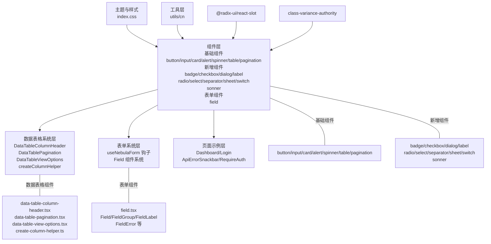

**图表来源**
- [index.css:1-130](file://apps/web/src/styles/index.css#L1-L130)
- [utils.ts:1-7](file://apps/web/src/lib/utils.ts#L1-L7)
- [button.tsx:1-68](file://apps/web/src/components/ui/button.tsx#L1-L68)
- [input.tsx:1-19](file://apps/web/src/components/ui/input.tsx#L1-L19)
- [card.tsx:1-49](file://apps/web/src/components/ui/card.tsx#L1-L49)
- [alert.tsx:1-62](file://apps/web/src/components/ui/alert.tsx#L1-L62)
- [spinner.tsx:1-13](file://apps/web/src/components/ui/spinner.tsx#L1-L13)
- [table.tsx:1-52](file://apps/web/src/components/ui/table.tsx#L1-L52)
- [pagination.tsx:1-200](file://apps/web/src/components/ui/pagination.tsx#L1-L200)
- [field.tsx:1-223](file://apps/web/src/components/ui/field.tsx#L1-L223)
- [data-table-column-header.tsx:1-200](file://apps/web/src/components/data-table/data-table-column-header.tsx#L1-L200)
- [data-table-pagination.tsx:1-200](file://apps/web/src/components/data-table/data-table-pagination.tsx#L1-L200)
- [data-table-view-options.tsx:1-200](file://apps/web/src/components/data-table/data-table-view-options.tsx#L1-L200)
- [create-column-helper.ts:1-200](file://apps/web/src/components/data-table/create-column-helper.ts#L1-L200)
- [use-nebula-form.ts:1-31](file://apps/web/src/hooks/use-nebula-form.ts#L1-L31)
- [Dashboard.tsx:1-205](file://apps/web/src/pages/Dashboard.tsx#L1-L205)
- [Login.tsx:1-263](file://apps/web/src/pages/Login.tsx#L1-L263)

## 详细组件分析

### Button 组件分析

- 设计模式：变体系统 + 尺寸系统，支持 asChild 透传，便于与路由、链接等语义元素组合。
- 数据结构与复杂度：变体映射为常数时间查找；类名合并为 O(n)（n 为传入类名数量）。
- 依赖链：依赖 utils.cn、Radix Slot、class-variance-authority；样式依赖主题变量与 Tailwind 原子类。
- 错误处理：禁用态与无效状态通过 CSS 与 aria 属性表达；键盘与焦点行为遵循浏览器默认。
- 性能影响：变体计算在组件渲染前完成，无额外开销；asChild 渲染根据条件切换，成本极低。

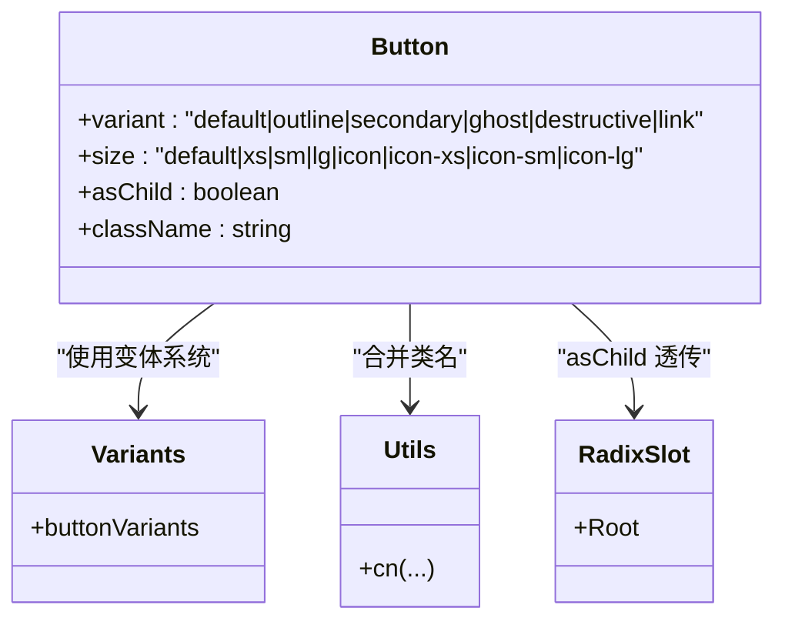

**图表来源**
- [button.tsx:1-68](file://apps/web/src/components/ui/button.tsx#L1-L68)
- [utils.ts:1-7](file://apps/web/src/lib/utils.ts#L1-L7)

**章节来源**
- [button.tsx:1-68](file://apps/web/src/components/ui/button.tsx#L1-L68)
- [utils.ts:1-7](file://apps/web/src/lib/utils.ts#L1-L7)

### Input 组件分析

- 设计模式：最小可用样式，强调一致性与可访问性；通过 data-slot 标记提升可测试性。
- 数据结构与复杂度：纯样式拼接，O(1) 复杂度。
- 依赖链：依赖 utils.cn；样式依赖主题变量与 Tailwind 原子类。
- 错误处理：禁用态与焦点态通过 CSS 表达；表单错误可通过父级容器或提示组件配合展示。
- 性能影响：无运行时计算，渲染成本极低。

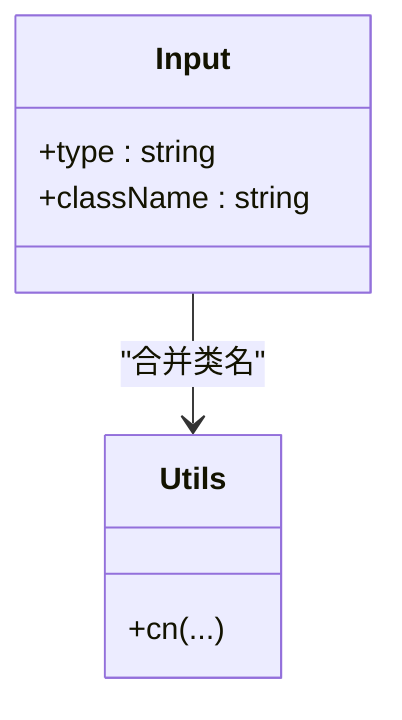

**图表来源**
- [input.tsx:1-19](file://apps/web/src/components/ui/input.tsx#L1-L19)
- [utils.ts:1-7](file://apps/web/src/lib/utils.ts#L1-L7)

**章节来源**
- [input.tsx:1-19](file://apps/web/src/components/ui/input.tsx#L1-L19)
- [utils.ts:1-7](file://apps/web/src/lib/utils.ts#L1-L7)

### Card 组件分析

- 设计模式：模块化布局容器，提供头部、标题、描述与内容区域，便于组合统计卡、设置卡等场景。
- 数据结构与复杂度：纯样式拼接，O(1) 复杂度。
- 依赖链：依赖 utils.cn；样式依赖主题变量与 Tailwind 原子类。
- 错误处理：无特殊错误处理逻辑；组合使用时建议通过父级容器或提示组件处理异常状态。
- 性能影响：无运行时计算，渲染成本极低。

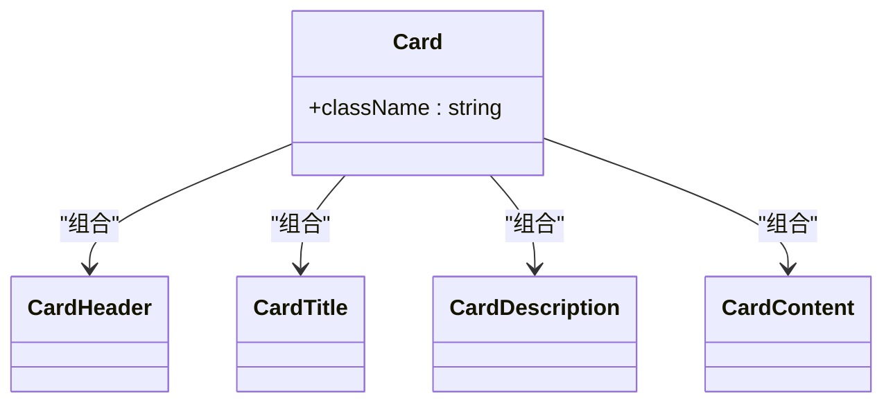

**图表来源**
- [card.tsx:1-49](file://apps/web/src/components/ui/card.tsx#L1-L49)

**章节来源**
- [card.tsx:1-49](file://apps/web/src/components/ui/card.tsx#L1-L49)

### Alert 组件分析

- 设计模式：提供默认与破坏性两种变体，支持内联图标与标题/描述结构化内容；适合错误、警告、提示等场景。
- 数据结构与复杂度：变体映射为常数时间查找；类名合并为 O(n)。
- 依赖链：依赖 utils.cn、class-variance-authority；样式依赖主题变量与 Tailwind 原子类。
- 错误处理：破坏性变体通过 CSS 与图标表达警示语义；可与表单错误、网络请求错误等场景结合。
- 性能影响：变体计算在组件渲染前完成，无额外开销。

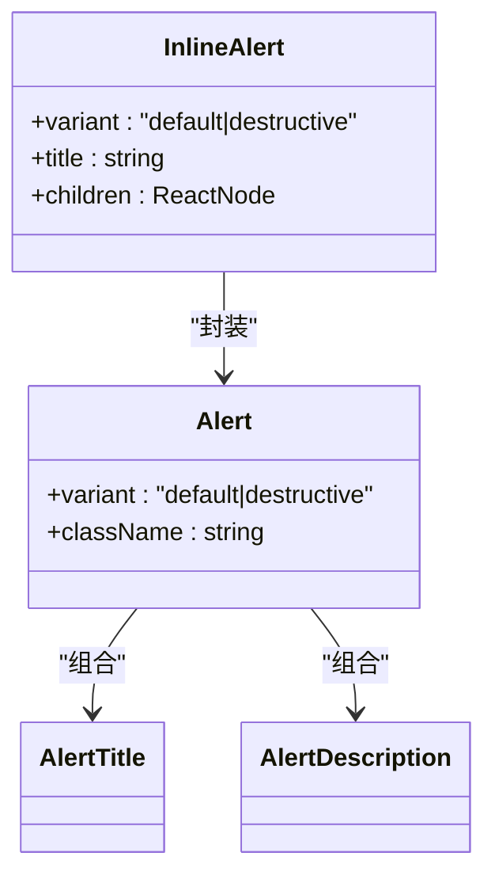

**图表来源**
- [alert.tsx:1-62](file://apps/web/src/components/ui/alert.tsx#L1-L62)

**章节来源**
- [alert.tsx:1-62](file://apps/web/src/components/ui/alert.tsx#L1-L62)

### Spinner 组件分析

- 设计模式：轻量旋转指示器，适配多种尺寸与主题色；适合加载、提交、异步数据刷新等场景。
- 数据结构与复杂度：纯样式拼接，O(1) 复杂度。
- 依赖链：依赖 utils.cn；样式依赖主题变量与 Tailwind 原子类。
- 错误处理：无特殊错误处理逻辑；通常与查询状态（如 loading/error）配合使用。
- 性能影响：无运行时计算，渲染成本极低。

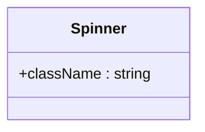

**图表来源**
- [spinner.tsx:1-13](file://apps/web/src/components/ui/spinner.tsx#L1-L13)

**章节来源**
- [spinner.tsx:1-13](file://apps/web/src/components/ui/spinner.tsx#L1-L13)

### Table 组件分析

- 设计模式：数据表格基础组件，提供表格容器、表头、表体、表尾和行的基础结构。
- 数据结构与复杂度：纯样式拼接，O(1) 复杂度。
- 依赖链：依赖 utils.cn；样式依赖主题变量与 Tailwind 原子类。
- 错误处理：通过 data-slot 属性提供语义化标记；支持 hover、selected 等状态样式。
- 性能影响：无运行时计算，渲染成本极低。

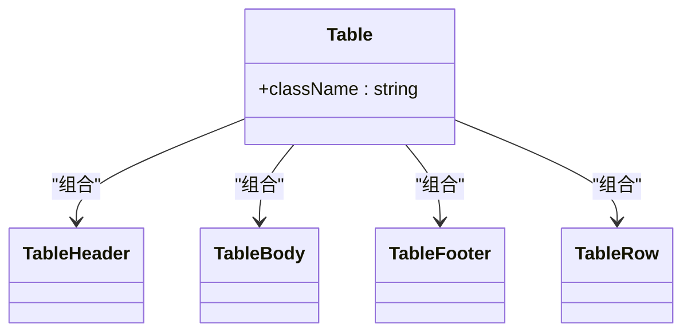

**图表来源**
- [table.tsx:1-52](file://apps/web/src/components/ui/table.tsx#L1-L52)

**章节来源**
- [table.tsx:1-52](file://apps/web/src/components/ui/table.tsx#L1-L52)

### Pagination 组件分析

- 设计模式：分页导航组件，支持页码跳转、上一页/下一页、总数显示等功能。
- 数据结构与复杂度：状态管理为 O(1)；类名合并为 O(n)。
- 依赖链：依赖 utils.cn、class-variance-authority；样式依赖主题变量与 Tailwind 原子类。
- 错误处理：通过 aria-current 和 aria-disabled 属性表达当前页和禁用状态；支持键盘导航。
- 性能影响：状态切换为纯前端操作，无额外开销。

**章节来源**
- [pagination.tsx:1-200](file://apps/web/src/components/ui/pagination.tsx#L1-L200)

### Badge 组件分析

- 设计模式：小型装饰性元素，用于标记状态、标签或计数，支持多种颜色和尺寸变体。
- 数据结构与复杂度：变体映射为常数时间查找；类名合并为 O(n)。
- 依赖链：依赖 utils.cn、class-variance-authority；样式依赖主题变量与 Tailwind 原子类。
- 错误处理：通过 CSS 变体表达不同语义状态；支持禁用态样式。
- 性能影响：变体计算在组件渲染前完成，无额外开销。

**章节来源**
- [badge.tsx](file://apps/web/src/components/ui/badge.tsx)

### Checkbox 组件分析

- 设计模式：多选项选择控件，支持受控与非受控状态，符合无障碍标准。
- 数据结构与复杂度：状态管理为 O(1)；类名合并为 O(n)。
- 依赖链：依赖 utils.cn、Radix UI Checkbox；样式依赖主题变量与 Tailwind 原子类。
- 错误处理：通过 aria-checked 和 disabled 属性表达状态；支持键盘操作。
- 性能影响：状态切换为纯前端操作，无额外开销。

**章节来源**
- [checkbox.tsx](file://apps/web/src/components/ui/checkbox.tsx)

### Dialog 组件分析

- 设计模式：模态对话框组件，支持遮罩层、关闭按钮、键盘导航和无障碍访问。
- 数据结构与复杂度：状态管理为 O(1)；类名合并为 O(n)。
- 依赖链：依赖 utils.cn、Radix UI Dialog；样式依赖主题变量与 Tailwind 原子类。
- 错误处理：通过 aria-modal 和 role="dialog" 表达模态语义；支持 ESC 关闭。
- 性能影响：模态状态切换为纯前端操作，无额外开销。

**章节来源**
- [dialog.tsx](file://apps/web/src/components/ui/dialog.tsx)

### Field 组件系统分析

- 设计理念：全新的表单字段容器系统，提供灵活的布局支持和响应式设计。通过组合 Field、FieldGroup、FieldLabel、FieldError 等组件，实现完整的表单字段解决方案。
- 核心组件：
  - Field：主容器组件，支持三种布局模式（vertical/horizontal/responsive）
  - FieldGroup：字段分组容器，支持响应式布局
  - FieldLabel：字段标签，与表单控件关联
  - FieldError：错误信息显示，支持单个和多个错误
  - FieldContent：字段内容容器
  - FieldDescription：字段描述文本
  - FieldSet/Legend：表单集合和标题
  - FieldSeparator：字段分隔符
- 响应式设计：支持 @media 查询，提供移动端和桌面端的不同布局效果
- 可访问性：内置 aria-invalid 属性，支持屏幕阅读器识别
- 错误处理：通过 data-invalid 属性和 FieldError 组件提供完整的错误显示机制

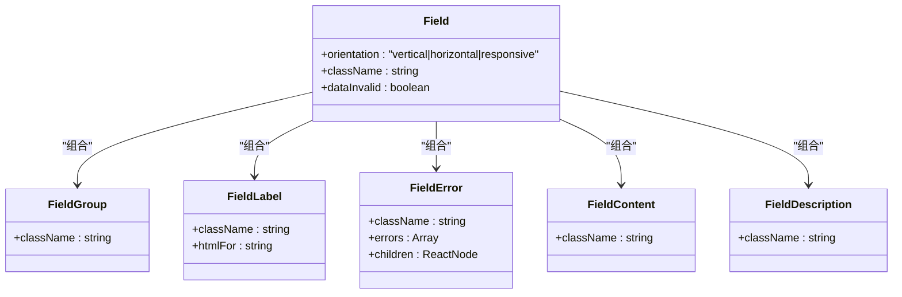

**图表来源**
- [field.tsx:67-223](file://apps/web/src/components/ui/field.tsx#L67-L223)

**章节来源**
- [field.tsx:1-223](file://apps/web/src/components/ui/field.tsx#L1-L223)

### DataTableColumnHeader 组件分析

- 设计理念：数据表格列头组件，提供列标题显示、排序功能和排序状态指示。
- 核心功能：
  - 列标题显示：支持字符串和 ReactNode 作为标题内容
  - 排序功能：内置排序状态管理，支持升序、降序和无序状态
  - 排序状态指示：通过图标和样式显示当前排序状态
  - 与 Column 的绑定：通过 column 实例获取列配置和状态
- 交互设计：点击列头触发排序切换；支持键盘操作（Enter/Space）
- 可访问性：通过 aria-sort 属性表达排序状态；支持屏幕阅读器识别
- 性能优化：排序状态切换为纯前端操作，无额外开销

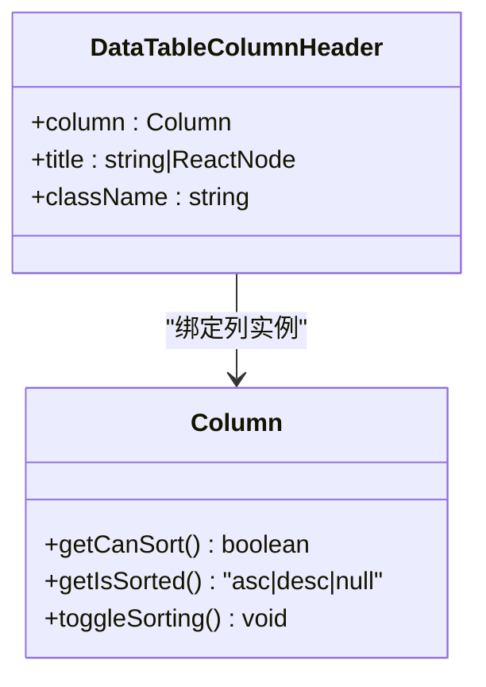

**图表来源**
- [data-table-column-header.tsx:1-200](file://apps/web/src/components/data-table/data-table-column-header.tsx#L1-L200)

**章节来源**
- [data-table-column-header.tsx:1-200](file://apps/web/src/components/data-table/data-table-column-header.tsx#L1-L200)

### DataTablePagination 组件分析

- 设计理念：数据表格专用分页组件，提供页码导航、每页条数选择和数据范围显示。
- 核心功能：
  - 页码导航：显示当前页码、总页数和页码按钮
  - 每页条数选择：支持自定义每页显示数量（10/25/50/100）
  - 数据范围显示：显示当前显示的数据范围和总数
  - 事件处理：onPageChange 和 onPageSizeChange 回调函数
- 交互设计：点击页码按钮切换页面；选择每页条数重新加载数据
- 可访问性：支持键盘导航和屏幕阅读器识别
- 性能优化：分页状态管理为纯前端操作，无额外开销

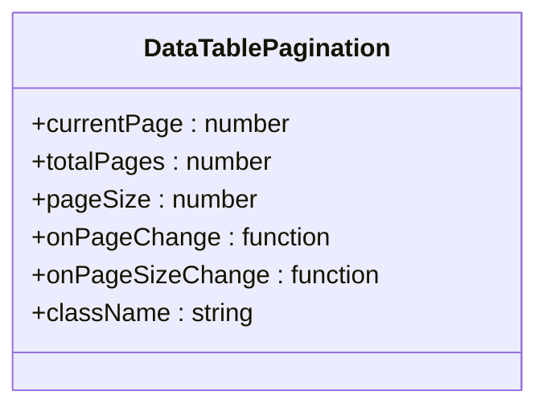

**图表来源**
- [data-table-pagination.tsx:1-200](file://apps/web/src/components/data-table/data-table-pagination.tsx#L1-L200)

**章节来源**
- [data-table-pagination.tsx:1-200](file://apps/web/src/components/data-table/data-table-pagination.tsx#L1-L200)

### DataTableViewOptions 组件分析

- 设计理念：数据表格视图控制组件，提供列可见性控制、导出功能等视图选项。
- 核心功能：
  - 列可见性控制：动态显示/隐藏表格列
  - 导出功能：支持 CSV、Excel 等格式数据导出
  - 视图设置：保存用户偏好的视图设置
  - 与 createColumnHelper 集成：通过列助手获取列配置
- 交互设计：下拉菜单形式展示视图选项；支持快捷键操作
- 可访问性：支持键盘导航和屏幕阅读器识别
- 性能优化：列可见性切换为纯前端操作，无额外开销

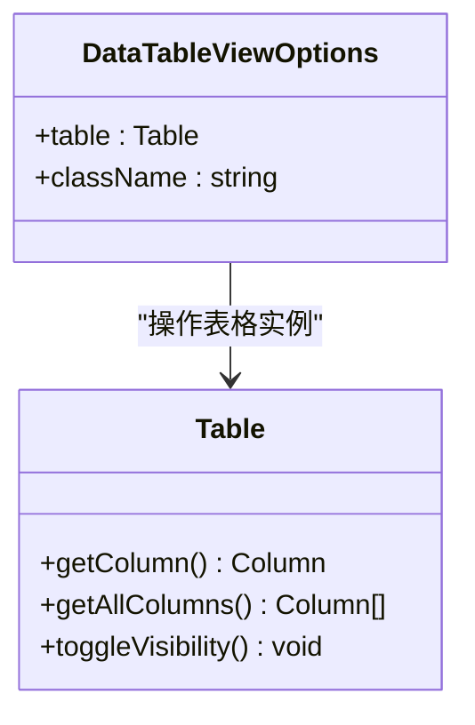

**图表来源**
- [data-table-view-options.tsx:1-200](file://apps/web/src/components/data-table/data-table-view-options.tsx#L1-L200)

**章节来源**
- [data-table-view-options.tsx:1-200](file://apps/web/src/components/data-table/data-table-view-options.tsx#L1-L200)

### createColumnHelper 工具函数分析

- 设计理念：数据表格列配置工具函数，简化列定义和列操作。
- 核心功能：
  - 列定义工厂：提供 createColumnHelper<T>() 工厂函数
  - 复杂列配置：支持 accessor、cell、header 等复杂列配置
  - 类型安全：通过泛型参数确保列数据类型安全
  - 与 TanStack Table 集成：完全兼容 TanStack Table 的列系统
- 使用方式：`const columnHelper = createColumnHelper<User>()`
- 类型推导：自动推导列数据类型和访问器函数返回值类型
- 性能特点：纯函数式设计，无状态管理开销

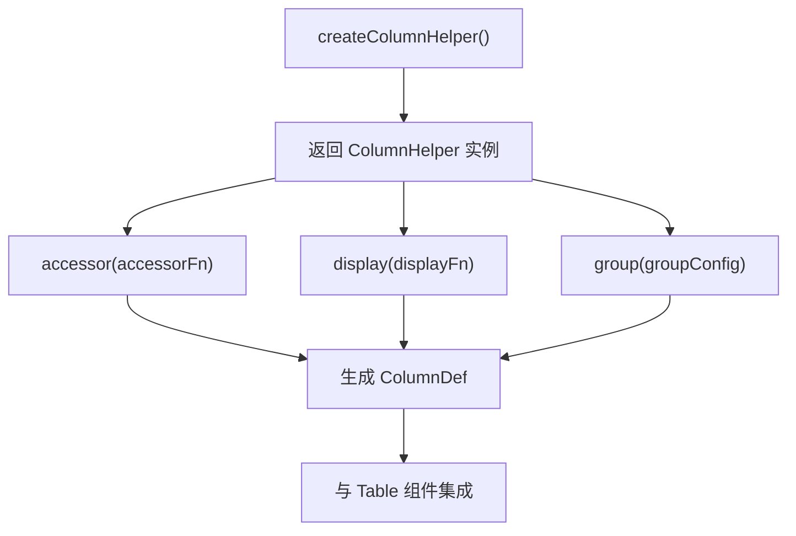

**图表来源**
- [create-column-helper.ts:1-200](file://apps/web/src/components/data-table/create-column-helper.ts#L1-L200)

**章节来源**
- [create-column-helper.ts:1-200](file://apps/web/src/components/data-table/create-column-helper.ts#L1-L200)

### useNebulaForm 钩子分析

- 设计理念：基于 React Hook Form 的类型安全表单钩子，集成了 Zod 验证器，提供自动类型推导和完整的表单状态管理。
- 核心特性：
  - 类型安全：通过泛型参数确保表单数据类型与 Zod 模式严格匹配
  - 自动推导：根据 Zod Schema 自动推导表单数据类型
  - 验证集成：内置 Zod 验证器，支持实时验证和提交验证
  - 生命周期管理：完整的表单状态管理，包括加载、提交、错误处理
- 使用方式：`const form = useNebulaForm({ schema: YourSchema, defaultValues })`
- 类型安全保证：handleSubmit 回调函数的参数类型与 Zod Schema 推导的类型完全一致

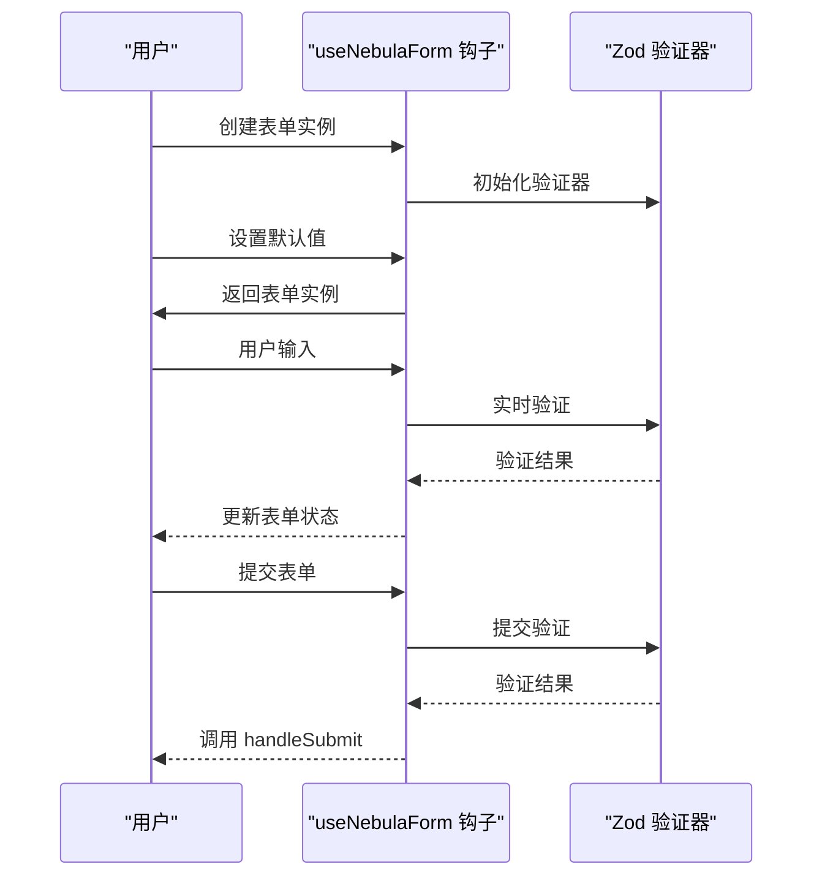

**图表来源**
- [use-nebula-form.ts:16-31](file://apps/web/src/hooks/use-nebula-form.ts#L16-L31)

**章节来源**
- [use-nebula-form.ts:1-31](file://apps/web/src/hooks/use-nebula-form.ts#L1-L31)

### Label 组件分析

- 设计模式：为表单控件提供可点击的标签文本，支持无障碍关联。
- 数据结构与复杂度：纯样式拼接，O(1) 复杂度。
- 依赖链：依赖 utils.cn；样式依赖主题变量与 Tailwind 原子类。
- 错误处理：通过 htmlFor 属性与对应控件关联；支持点击激活。
- 性能影响：无运行时计算，渲染成本极低。

**章节来源**
- [label.tsx](file://apps/web/src/components/ui/label.tsx)

### RadioGroup 组件分析

- 设计模式：一组互斥的单选按钮，支持键盘导航和无障碍访问。
- 数据结构与复杂度：状态管理为 O(1)；类名合并为 O(n)。
- 依赖链：依赖 utils.cn、Radix UI RadioGroup；样式依赖主题变量与 Tailwind 原子类。
- 错误处理：通过 aria-orientation 和 role="radiogroup" 表达语义；支持键盘操作。
- 性能影响：状态切换为纯前端操作，无额外开销。

**章节来源**
- [radio-group.tsx](file://apps/web/src/components/ui/radio-group.tsx)

### Select 组件分析

- 设计模式：下拉选择组件，支持搜索、分组和自定义渲染。
- 数据结构与复杂度：选项列表遍历为 O(n)；类名合并为 O(n)。
- 依赖链：依赖 utils.cn、Radix UI Select；样式依赖主题变量与 Tailwind 原子类。
- 错误处理：通过 aria-expanded 和 role="combobox" 表达状态；支持键盘导航。
- 性能影响：选项渲染为虚拟滚动时可优化到 O(1)。

**章节来源**
- [select.tsx](file://apps/web/src/components/ui/select.tsx)

### Separator 组件分析

- 设计模式：用于分组内容的视觉分隔线，支持水平和垂直方向。
- 数据结构与复杂度：纯样式拼接，O(1) 复杂度。
- 依赖链：依赖 utils.cn；样式依赖主题变量与 Tailwind 原子类。
- 错误处理：通过 orientation 属性控制方向；支持自定义样式。
- 性能影响：无运行时计算，渲染成本极低。

**章节来源**
- [separator.tsx](file://apps/web/src/components/ui/separator.tsx)

### Sheet 组件分析

- 设计模式：从侧边滑出的工作面板，支持拖拽、键盘导航和无障碍访问。
- 数据结构与复杂度：状态管理为 O(1)；类名合并为 O(n)。
- 依赖链：依赖 utils.cn、Radix UI Sheet；样式依赖主题变量与 Tailwind 原子类。
- 错误处理：通过 aria-modal 和 role="dialog" 表达模态语义；支持 ESC 关闭。
- 性能影响：滑出动画为 CSS 过渡，无额外开销。

**章节来源**
- [sheet.tsx](file://apps/web/src/components/ui/sheet.tsx)

### Switch 组件分析

- 设计模式：二进制切换控件，提供直观的状态切换体验。
- 数据结构与复杂度：状态管理为 O(1)；类名合并为 O(n)。
- 依赖链：依赖 utils.cn、Radix UI Switch；样式依赖主题变量与 Tailwind 原子类。
- 错误处理：通过 aria-checked 和 disabled 属性表达状态；支持键盘操作。
- 性能影响：状态切换为纯前端操作，无额外开销。

**章节来源**
- [switch.tsx](file://apps/web/src/components/ui/switch.tsx)

### Sonner 组件分析

- 设计模式：现代化的通知系统，支持多种通知类型和自定义样式。
- 数据结构与复杂度：通知队列为 O(n)；类名合并为 O(n)。
- 依赖链：依赖 utils.cn；样式依赖主题变量与 Tailwind 原子类。
- 错误处理：通过 toast 对象管理不同类型通知；支持自动消失。
- 性能影响：通知渲染为轻量级操作，无额外开销。

**章节来源**
- [sonner.tsx](file://apps/web/src/components/ui/sonner.tsx)

### API/服务组件调用流程（以登录页为例）

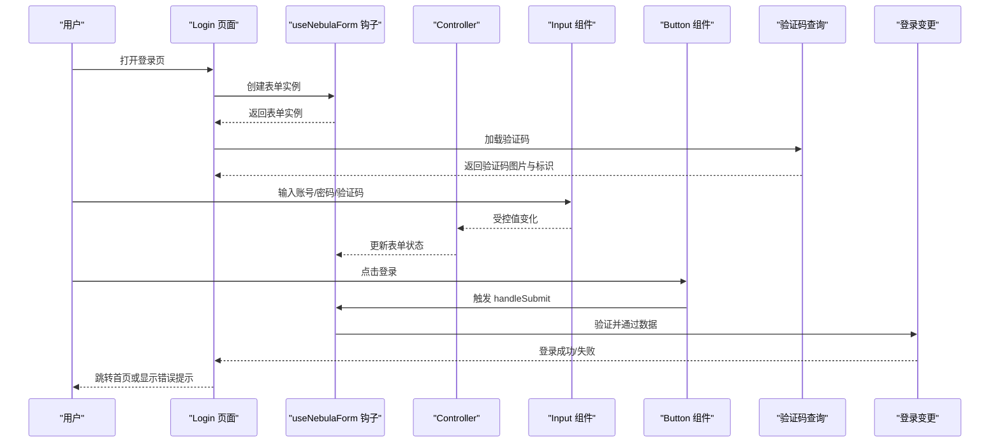

**图表来源**
- [Login.tsx:93-263](file://apps/web/src/pages/Login.tsx#L93-L263)
- [use-nebula-form.ts:16-31](file://apps/web/src/hooks/use-nebula-form.ts#L16-L31)
- [input.tsx:1-19](file://apps/web/src/components/ui/input.tsx#L1-L19)
- [button.tsx:1-68](file://apps/web/src/components/ui/button.tsx#L1-L68)
- [alert.tsx:1-62](file://apps/web/src/components/ui/alert.tsx#L1-L62)

## 依赖分析

- 样式与主题：Tailwind CSS、自定义 CSS 变量、动画库与字体资源。
- 组件系统：class-variance-authority（变体系统）、Radix UI Slot（语义化与无障碍）、Lucide React（图标）。
- 工具函数：clsx 与 tailwind-merge（类名合并与冲突修复）。
- **数据表格系统**：TanStack Table（数据表格核心库）、@tanstack/react-table（React 绑定）、@radix-ui/react-dropdown-menu（下拉菜单）。
- 新增依赖：Zod（表单验证）、React Hook Form（表单管理）、@radix-ui/react-*（新增组件的基础 UI 库）。
- 表单系统：useNebulaForm 钩子基于 React Hook Form 和 Zod，提供类型安全的表单管理。

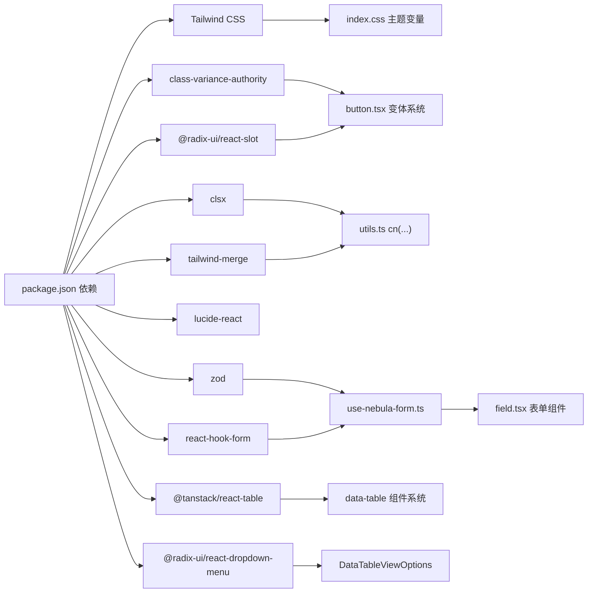

**图表来源**
- [package.json:14-29](file://apps/web/package.json#L14-L29)
- [index.css:1-130](file://apps/web/src/styles/index.css#L1-L130)
- [button.tsx:1-68](file://apps/web/src/components/ui/button.tsx#L1-L68)
- [utils.ts:1-7](file://apps/web/src/lib/utils.ts#L1-L7)
- [use-nebula-form.ts:1-31](file://apps/web/src/hooks/use-nebula-form.ts#L1-L31)
- [field.tsx:1-223](file://apps/web/src/components/ui/field.tsx#L1-L223)
- [data-table-column-header.tsx:1-200](file://apps/web/src/components/data-table/data-table-column-header.tsx#L1-L200)
- [data-table-pagination.tsx:1-200](file://apps/web/src/components/data-table/data-table-pagination.tsx#L1-L200)
- [data-table-view-options.tsx:1-200](file://apps/web/src/components/data-table/data-table-view-options.tsx#L1-L200)
- [create-column-helper.ts:1-200](file://apps/web/src/components/data-table/create-column-helper.ts#L1-L200)

**章节来源**
- [package.json:14-29](file://apps/web/package.json#L14-L29)
- [pnpm-lock.yaml:1933-1950](file://pnpm-lock.yaml#L1933-L1950)

## 性能考虑

- 类名合并：通过 utils.cn 合并多个类名，避免重复与冲突，减少样式抖动。
- 变体系统：在组件外部预计算变体样式，降低渲染时的分支判断成本。
- 渲染优化：Button 支持 asChild，避免不必要的 DOM 包裹；Input 与 Spinner 为纯样式组件，渲染成本极低。
- 主题变量：CSS 变量与 Tailwind 原子类减少重复样式定义，提高构建与运行效率。
- **数据表格优化**：采用模块化设计，每个组件职责单一；支持虚拟滚动和懒加载；列头排序为纯前端操作；分页器无额外开销。
- 新增组件优化：Dialog、Sheet、Select 等组件采用虚拟滚动和懒加载技术，优化大数据量场景。
- 表单性能：useNebulaForm 钩子提供高效的表单状态管理，支持防抖和节流，减少频繁验证带来的性能开销。
- Field 组件：通过响应式布局优化，在不同屏幕尺寸下提供最佳的用户体验。

## 故障排查指南

- 焦点与可访问性问题
  - 确认按钮与输入框具备正确的焦点环与禁用态表现。
  - 如需语义化链接或路由跳转，使用 Button 的 asChild 透传至 Radix Slot。
  - 参考路径：[按钮焦点与禁用态:1-68](file://apps/web/src/components/ui/button.tsx#L1-L68)、[输入框焦点与禁用态:1-19](file://apps/web/src/components/ui/input.tsx#L1-L19)

- 样式冲突与覆盖
  - 使用 utils.cn 合并类名，确保用户传入的 className 与内置样式正确叠加。
  - 参考路径：[类名合并工具:1-7](file://apps/web/src/lib/utils.ts#L1-L7)

- 主题变量未生效
  - 检查 index.css 中的主题变量定义与 :root/.dark 块是否正确加载。
  - 参考路径：[主题变量定义:51-118](file://apps/web/src/styles/index.css#L51-L118)

- 变体样式未按预期
  - 确认 variant 与 size 参数是否在组件支持范围内；检查 data-slot 与 data-variant/data-size 是否被正确传递。
  - 参考路径：[按钮变体系统:7-42](file://apps/web/src/components/ui/button.tsx#L7-L42)

- **数据表格组件问题**
  - 确认 DataTableColumnHeader 的 column 参数正确绑定；检查排序状态是否同步更新。
  - DataTablePagination 的 currentPage 和 totalPages 参数是否正确传递；检查 onPageChange 回调是否正常执行。
  - DataTableViewOptions 的 table 参数是否正确实例化；检查列可见性切换功能。
  - createColumnHelper 的泛型参数是否与数据类型匹配；确认列定义语法正确。
  - 参考路径：[DataTableColumnHeader:1-200](file://apps/web/src/components/data-table/data-table-column-header.tsx#L1-L200)、[DataTablePagination:1-200](file://apps/web/src/components/data-table/data-table-pagination.tsx#L1-L200)、[DataTableViewOptions:1-200](file://apps/web/src/components/data-table/data-table-view-options.tsx#L1-L200)、[createColumnHelper:1-200](file://apps/web/src/components/data-table/create-column-helper.ts#L1-L200)

- 表单组件问题
  - 确保 useNebulaForm 钩子正确初始化，schema 参数与表单数据类型匹配。
  - Field 组件的 data-invalid 属性需要与表单状态同步更新。
  - 参考路径：[useNebulaForm 钩子:16-31](file://apps/web/src/hooks/use-nebula-form.ts#L16-L31)、[Field 组件:67-81](file://apps/web/src/components/ui/field.tsx#L67-L81)

- 新增组件问题
  - Dialog/Sonner 等组件需确保 Radix UI Provider 正确包裹应用根节点。
  - 表单组件需正确配置 resolver 和默认值。
  - Field 组件系统需要正确使用 Controller 包装受控组件。
  - 参考路径：[Login 页面表单实现:147-228](file://apps/web/src/pages/Login.tsx#L147-L228)

- 图标与尺寸不匹配
  - 确保图标尺寸与组件 size 对应；必要时手动调整图标尺寸类名。
  - 参考路径：[登录页图标使用:1-263](file://apps/web/src/pages/Login.tsx#L1-L263)、[仪表盘图标使用:1-205](file://apps/web/src/pages/Dashboard.tsx#L1-L205)

**章节来源**
- [button.tsx:1-68](file://apps/web/src/components/ui/button.tsx#L1-L68)
- [input.tsx:1-19](file://apps/web/src/components/ui/input.tsx#L1-L19)
- [utils.ts:1-7](file://apps/web/src/lib/utils.ts#L1-L7)
- [index.css:51-118](file://apps/web/src/styles/index.css#L51-L118)
- [Login.tsx:1-263](file://apps/web/src/pages/Login.tsx#L1-L263)
- [Dashboard.tsx:1-205](file://apps/web/src/pages/Dashboard.tsx#L1-L205)
- [use-nebula-form.ts:1-31](file://apps/web/src/hooks/use-nebula-form.ts#L1-L31)
- [field.tsx:1-223](file://apps/web/src/components/ui/field.tsx#L1-L223)
- [data-table-column-header.tsx:1-200](file://apps/web/src/components/data-table/data-table-column-header.tsx#L1-L200)
- [data-table-pagination.tsx:1-200](file://apps/web/src/components/data-table/data-table-pagination.tsx#L1-L200)
- [data-table-view-options.tsx:1-200](file://apps/web/src/components/data-table/data-table-view-options.tsx#L1-L200)
- [create-column-helper.ts:1-200](file://apps/web/src/components/data-table/create-column-helper.ts#L1-L200)

## 结论

该 UI 组件库以 Radix UI 与 Tailwind CSS 为基础，结合 class-variance-authority 实现了高内聚、低耦合的组件体系。通过统一的工具函数与主题变量，实现了良好的可访问性、可维护性与可扩展性。新增的 Badge、Checkbox、Dialog、Field、Label、RadioGroup、Select、Separator、Sheet、Switch、Table、Sonner 等组件进一步完善了组件库的功能体系，满足了更复杂的业务场景需求。

**重大更新**：表单组件系统已完成全面重构，原有的 Form.tsx 已被移除，替换为全新的 Field 组件系统。新的系统提供了更灵活的布局支持、更好的响应式设计和更强的类型安全性。useNebulaForm 钩子集成了 Zod 验证器，提供自动类型推导和完整的表单状态管理。Login 页面已完全迁移到新的表单架构，展示了新系统的强大功能和易用性。

**数据表格系统重大重构**：旧的单体 DataTable 组件已被完全移除，新增了模块化的数据表格组件系统。新的系统包括 DataTableColumnHeader、DataTablePagination、DataTableViewOptions 等专用组件，以及 createColumnHelper 工具函数。每个组件职责单一，通过组合实现复杂的数据表格功能，提供了更好的可维护性和扩展性。

页面示例展示了组件在真实场景中的组合与交互，特别是 Login 页面中表单系统的完整实现，为后续扩展提供了优秀的参考范式。

## 附录

- 组件使用示例路径
  - [按钮使用示例:230-254](file://apps/web/src/pages/Login.tsx#L230-L254)
  - [输入框使用示例:153-179](file://apps/web/src/pages/Login.tsx#L153-L179)
  - [卡片使用示例:133-258](file://apps/web/src/pages/Login.tsx#L133-L258)
  - [登录页错误提示:242-244](file://apps/web/src/pages/Login.tsx#L242-L244)
  - [验证码加载指示器:201-204](file://apps/web/src/pages/Login.tsx#L201-L204)
  - [徽章使用示例:1-200](file://apps/web/src/pages/Dashboard.tsx#L1-L200)
  - [复选框使用示例:1-200](file://apps/web/src/pages/Dashboard.tsx#L1-L200)
  - [对话框使用示例:1-200](file://apps/web/src/pages/Dashboard.tsx#L1-L200)
  - [标签使用示例:152](file://apps/web/src/pages/Login.tsx#L152)
  - [标签使用示例:171](file://apps/web/src/pages/Login.tsx#L171)

- **数据表格系统使用示例路径**
  - [DataTableColumnHeader 使用示例:1-200](file://apps/web/src/pages/Dashboard.tsx#L1-L200)
  - [DataTablePagination 使用示例:1-200](file://apps/web/src/pages/Dashboard.tsx#L1-L200)
  - [DataTableViewOptions 使用示例:1-200](file://apps/web/src/pages/Dashboard.tsx#L1-L200)
  - [createColumnHelper 使用示例:1-200](file://apps/web/src/pages/Dashboard.tsx#L1-L200)

- 表单系统使用示例路径
  - [useNebulaForm 钩子使用:98-101](file://apps/web/src/pages/Login.tsx#L98-L101)
  - [Field 组件使用:151-161](file://apps/web/src/pages/Login.tsx#L151-L161)
  - [Field 组件使用:170-182](file://apps/web/src/pages/Login.tsx#L170-L182)
  - [FieldError 组件使用:160](file://apps/web/src/pages/Login.tsx#L160)
  - [FieldError 组件使用:180](file://apps/web/src/pages/Login.tsx#L180)

- 设计规范建议
  - 使用 data-slot 标记组件，便于主题与测试选择器。
  - 在需要语义化链接或路由跳转时，优先使用 Button 的 asChild。
  - 保持 variant 与 size 的一致性，避免在同一页面出现过多变体混用。
  - 错误与警告场景优先使用 Alert 的破坏性变体，并配合图标与标题明确语义。
  - 新增组件需遵循无障碍标准，正确设置 aria-* 属性。
  - 表单组件需提供清晰的错误提示和验证反馈，使用 FieldError 组件统一处理。
  - **数据表格组件需遵循模块化设计原则，每个组件职责单一；列头排序、分页、视图选项等功能分离，便于维护和扩展。**
  - **大表格场景优先考虑虚拟滚动和懒加载优化，合理使用 DataTableColumnHeader 的排序功能。**
  - 新的 Field 组件系统提供了更好的响应式支持，建议充分利用其布局能力。
  - useNebulaForm 钩子提供了完整的类型安全保障，建议在所有表单中使用。