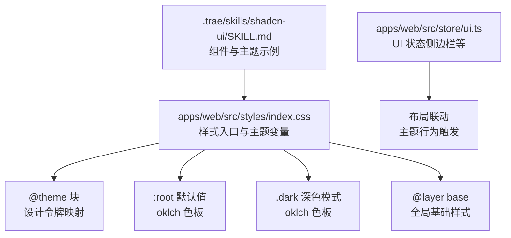
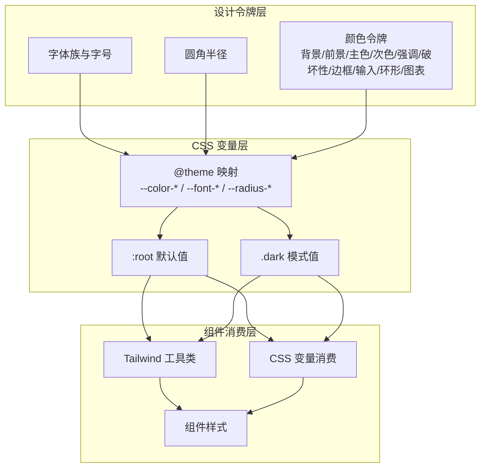
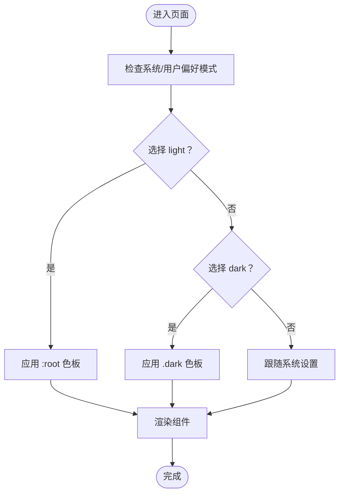
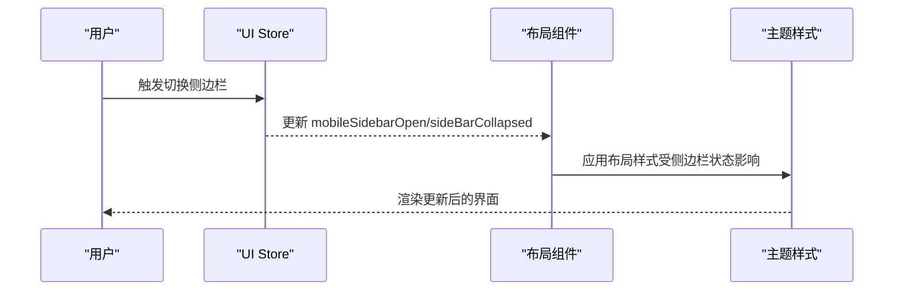
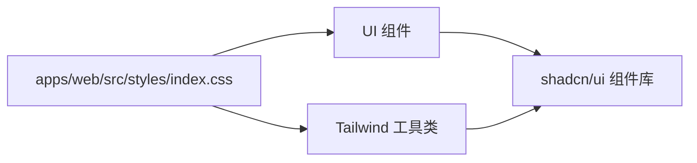

# 主题系统

<cite>
**本文引用的文件**
- [apps/web/src/styles/index.css](file://apps/web/src/styles/index.css)
- [apps/web/src/store/ui.ts](file://apps/web/src/store/ui.ts)
- [.trae/skills/shadcn-ui/SKILL.md](file://.trae/skills/shadcn-ui/SKILL.md)
</cite>

## 目录

1. [简介](#简介)
2. [项目结构](#项目结构)
3. [核心组件](#核心组件)
4. [架构总览](#架构总览)
5. [详细组件分析](#详细组件分析)
6. [依赖关系分析](#依赖关系分析)
7. [性能考量](#性能考量)
8. [故障排查指南](#故障排查指南)
9. [结论](#结论)
10. [附录](#附录)

## 简介

本主题系统以 CSS 变量为核心，结合 Tailwind CSS 与 shadcn/ui 组件体系，构建了统一的颜色系统、排版系统与圆角半径体系，并通过深色模式与自定义变体实现跨设备与跨浏览器的一致体验。系统采用 oklch 颜色空间定义基础色板，确保在不同显示设备上具备更佳的可感知亮度与对比度表现；同时通过设计令牌（Design Tokens）抽象，为品牌定制与主题扩展提供稳定接口。

## 项目结构

主题系统主要由以下部分组成：

- 样式入口：集中定义 CSS 变量、@theme 块、深色模式分支与基础层样式
- 组件状态：UI 状态管理（如侧边栏开关），用于联动主题行为
- 设计资源：参考模板与组件示例，指导主题定制与一致性维护

图表来源

- [apps/web/src/styles/index.css:1-130](file://apps/web/src/styles/index.css#L1-L130)
- [apps/web/src/store/ui.ts:1-42](file://apps/web/src/store/ui.ts#L1-L42)
- [.trae/skills/shadcn-ui/SKILL.md:326-416](file://.trae/skills/shadcn-ui/SKILL.md#L326-L416)

章节来源

- [apps/web/src/styles/index.css:1-130](file://apps/web/src/styles/index.css#L1-L130)
- [apps/web/src/store/ui.ts:1-42](file://apps/web/src/store/ui.ts#L1-L42)
- [.trae/skills/shadcn-ui/SKILL.md:326-416](file://.trae/skills/shadcn-ui/SKILL.md#L326-L416)

## 核心组件

- CSS 变量与设计令牌
  - 使用 @theme inline 将设计令牌映射到 CSS 变量，便于组件与工具类消费
  - 字体族、圆角半径等通用设计令牌通过变量组合与缩放实现层级化
- 颜色系统
  - 基于 oklch 的色板，覆盖背景、前景、卡片、弹出层、主色、次色、强调色、破坏性操作、边框、输入、环形高亮与图表系列
  - 提供浅色与深色两套色板，保证在不同模式下的可读性与对比度
- 深色模式支持
  - 通过自定义深色变体与 .dark 类选择器实现模式切换
  - 支持 light/dark/system 三种模式控制
- 基础层样式
  - 在 @layer base 中统一设置边框、轮廓、背景与文字颜色，确保全局一致性

章节来源

- [apps/web/src/styles/index.css:8-49](file://apps/web/src/styles/index.css#L8-L49)
- [apps/web/src/styles/index.css:51-118](file://apps/web/src/styles/index.css#L51-L118)
- [apps/web/src/styles/index.css:120-130](file://apps/web/src/styles/index.css#L120-L130)

## 架构总览

主题系统采用“设计令牌 → CSS 变量 → 组件消费”的分层架构。@theme 块负责将设计令牌映射为 CSS 变量，:root 定义默认值，.dark 定义深色模式值，@layer base 提供全局基线样式。组件通过 Tailwind 工具类或 CSS 变量消费这些令牌，从而实现一致的主题表现。

图表来源

- [apps/web/src/styles/index.css:8-49](file://apps/web/src/styles/index.css#L8-L49)
- [apps/web/src/styles/index.css:51-118](file://apps/web/src/styles/index.css#L51-L118)
- [apps/web/src/styles/index.css:120-130](file://apps/web/src/styles/index.css#L120-L130)

## 详细组件分析

### CSS 变量与设计令牌映射

- 设计令牌映射
  - 通过 @theme inline 将字体族、侧边栏与图表系列等令牌映射为 CSS 变量，供组件与工具类直接消费
- 通用令牌
  - 字体族：标题与正文使用同一字体族，确保视觉统一
  - 圆角半径：基于基准半径进行多级缩放，形成 sm/md/lg/xl/2xl/3xl/4xl 的层级化体系
- 全局变量
  - 通过 :root 定义默认色板，包含背景、前景、卡片、弹出层、主色、次色、强调色、破坏性、边框、输入、环形高亮与图表系列

章节来源

- [apps/web/src/styles/index.css:8-49](file://apps/web/src/styles/index.css#L8-L49)
- [apps/web/src/styles/index.css:51-75](file://apps/web/src/styles/index.css#L51-L75)

### 深色模式与自定义变体

- 自定义深色变体
  - 使用 @custom-variant dark 定义深色变体选择器，配合 .dark 类实现条件样式
- 深色模式色板
  - 在 .dark 中重新定义颜色令牌，确保在深色背景下具备合适的对比度与可读性
- 模式控制
  - 可通过外部库提供的主题切换逻辑（如示例中的 ThemeToggle 组件）实现 light/dark/system 切换

图表来源

- [apps/web/src/styles/index.css:6](file://apps/web/src/styles/index.css#L6)
- [apps/web/src/styles/index.css:86-118](file://apps/web/src/styles/index.css#L86-L118)
- [.trae/skills/shadcn-ui/SKILL.md:326-358](file://.trae/skills/shadcn-ui/SKILL.md#L326-L358)

章节来源

- [apps/web/src/styles/index.css:6](file://apps/web/src/styles/index.css#L6)
- [apps/web/src/styles/index.css:86-118](file://apps/web/src/styles/index.css#L86-L118)
- [.trae/skills/shadcn-ui/SKILL.md:326-358](file://.trae/skills/shadcn-ui/SKILL.md#L326-L358)

### 基础层样式与全局一致性

- 边框与轮廓
  - 在 @layer base 中统一应用边框与轮廓样式，确保所有元素遵循一致的视觉基线
- 背景与文字
  - 通过 body 与 html 的基类设置背景与文字颜色，保证整体风格统一
- 字体族
  - 在 html 层设置默认字体族，确保全局排版一致性

章节来源

- [apps/web/src/styles/index.css:120-130](file://apps/web/src/styles/index.css#L120-L130)

### UI 状态与主题联动（侧边栏）

- 状态管理
  - 使用 Zustand 管理移动端侧边栏开关与折叠状态，为布局与主题交互提供状态支撑
- 主题联动
  - 侧边栏状态变化可能影响布局宽度与内容区域的可视范围，需与主题变量中的侧边栏相关令牌保持一致

图表来源

- [apps/web/src/store/ui.ts:20-42](file://apps/web/src/store/ui.ts#L20-L42)
- [apps/web/src/styles/index.css:11-18](file://apps/web/src/styles/index.css#L11-L18)

章节来源

- [apps/web/src/store/ui.ts:1-42](file://apps/web/src/store/ui.ts#L1-L42)
- [apps/web/src/styles/index.css:11-18](file://apps/web/src/styles/index.css#L11-L18)

## 依赖关系分析

- 组件耦合
  - 组件通过 Tailwind 工具类与 CSS 变量消费主题令牌，降低对具体颜色值的硬编码耦合
- 外部依赖
  - Tailwind CSS 提供原子化样式能力
  - shadcn/ui 组件库与主题变量协同工作，确保组件在不同主题下保持一致外观
- 潜在循环依赖
  - 主题样式与组件之间为单向依赖（样式被组件消费），无循环依赖风险

图表来源

- [apps/web/src/styles/index.css:1-130](file://apps/web/src/styles/index.css#L1-L130)
- [.trae/skills/shadcn-ui/SKILL.md:394-416](file://.trae/skills/shadcn-ui/SKILL.md#L394-L416)

章节来源

- [apps/web/src/styles/index.css:1-130](file://apps/web/src/styles/index.css#L1-L130)
- [.trae/skills/shadcn-ui/SKILL.md:394-416](file://.trae/skills/shadcn-ui/SKILL.md#L394-L416)

## 性能考量

- CSS 变量的优势
  - 通过 CSS 变量实现主题切换，避免重绘与重复样式定义，提升运行时性能
- 设计令牌的复用
  - 将字体、圆角、颜色等设计令牌集中管理，减少样式冗余，提高维护效率
- 深色模式的按需加载
  - 将深色模式样式与默认样式分离，仅在需要时生效，降低初始渲染负担

## 故障排查指南

- 深色模式不生效
  - 检查是否正确引入深色变体与 .dark 类选择器
  - 确认模式切换逻辑与 DOM 类名同步
- 颜色对比度不足
  - 对比度不足时优先调整前景与背景的 oklch 值，确保满足可访问性要求
- 圆角与字体不一致
  - 检查 @theme 中的圆角与字体映射是否正确，确认全局基础层样式未被覆盖

章节来源

- [apps/web/src/styles/index.css:6](file://apps/web/src/styles/index.css#L6)
- [apps/web/src/styles/index.css:86-118](file://apps/web/src/styles/index.css#L86-L118)
- [apps/web/src/styles/index.css:120-130](file://apps/web/src/styles/index.css#L120-L130)

## 结论

该主题系统以 CSS 变量与设计令牌为核心，结合 oklch 颜色空间与深色模式支持，提供了稳定、可扩展且跨浏览器一致的主题体验。通过 @theme 块与 @layer base 的分层设计，组件与工具类得以高效消费主题令牌，实现品牌定制与扩展的最佳实践。

## 附录

- 主题定制指南
  - 颜色系统：优先调整 oklch 色板，确保主色、次色与前景/背景的对比度符合可访问性标准
  - 字体系统：通过设计令牌映射统一字体族，避免在组件中硬编码字体属性
  - 圆角半径：基于基准半径进行缩放，形成层级化体系，保持视觉一致性
- 命名约定
  - 颜色令牌：使用语义化前缀（如 primary、secondary、destructive、muted、accent），后接状态或用途（如 foreground）
  - 布局令牌：使用布局相关前缀（如 sidebar、popover、card），确保组件间一致性
- 响应式与跨浏览器兼容性
  - 使用 Tailwind 原子化工具类与 CSS 变量相结合的方式，确保在不同屏幕尺寸与浏览器环境下的一致表现
- 扩展与品牌定制最佳实践
  - 通过 @theme 块集中管理设计令牌，避免在组件中直接引用底层变量
  - 为品牌色建立独立的令牌层，便于在不同模式下进行差异化配置

章节来源

- [apps/web/src/styles/index.css:8-49](file://apps/web/src/styles/index.css#L8-L49)
- [apps/web/src/styles/index.css:51-118](file://apps/web/src/styles/index.css#L51-L118)
- [.trae/skills/shadcn-ui/SKILL.md:360-390](file://.trae/skills/shadcn-ui/SKILL.md#L360-L390)
