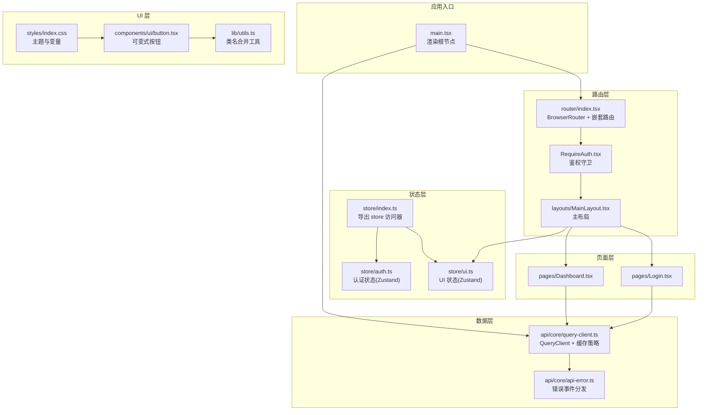
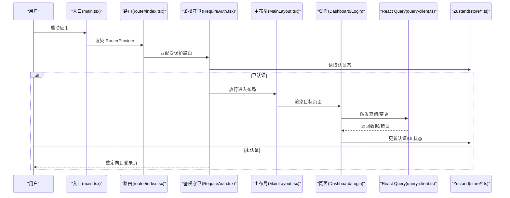
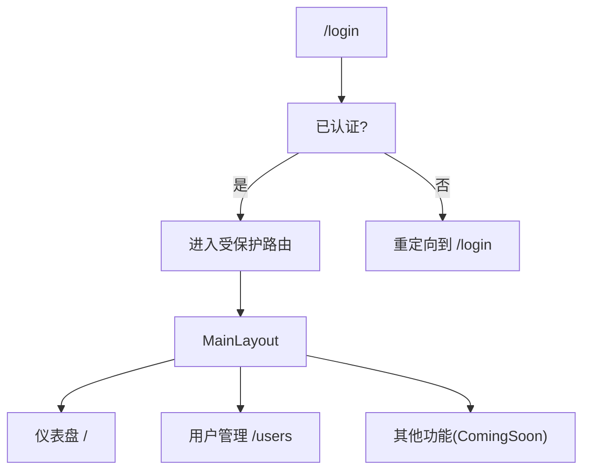
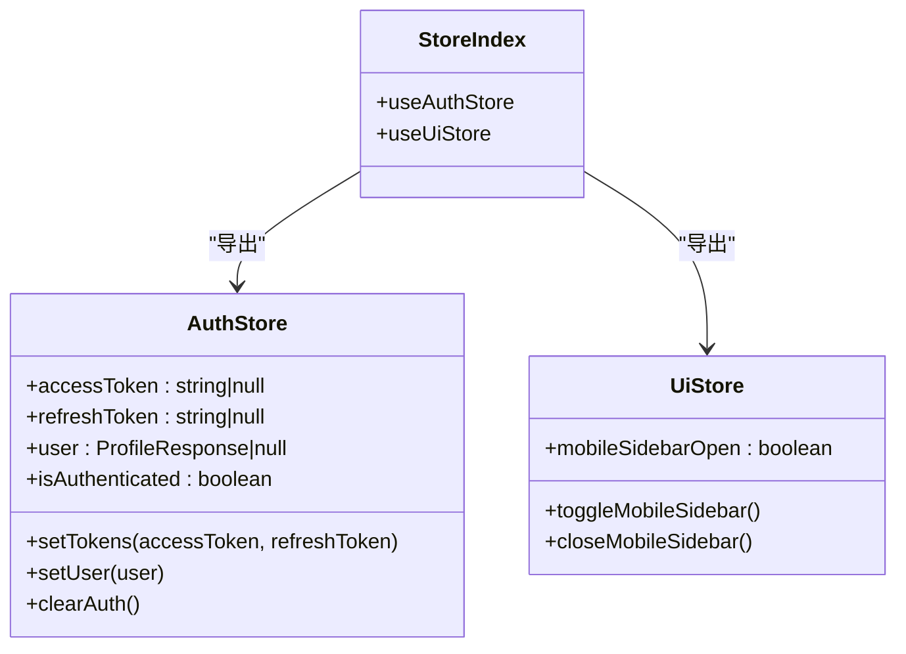
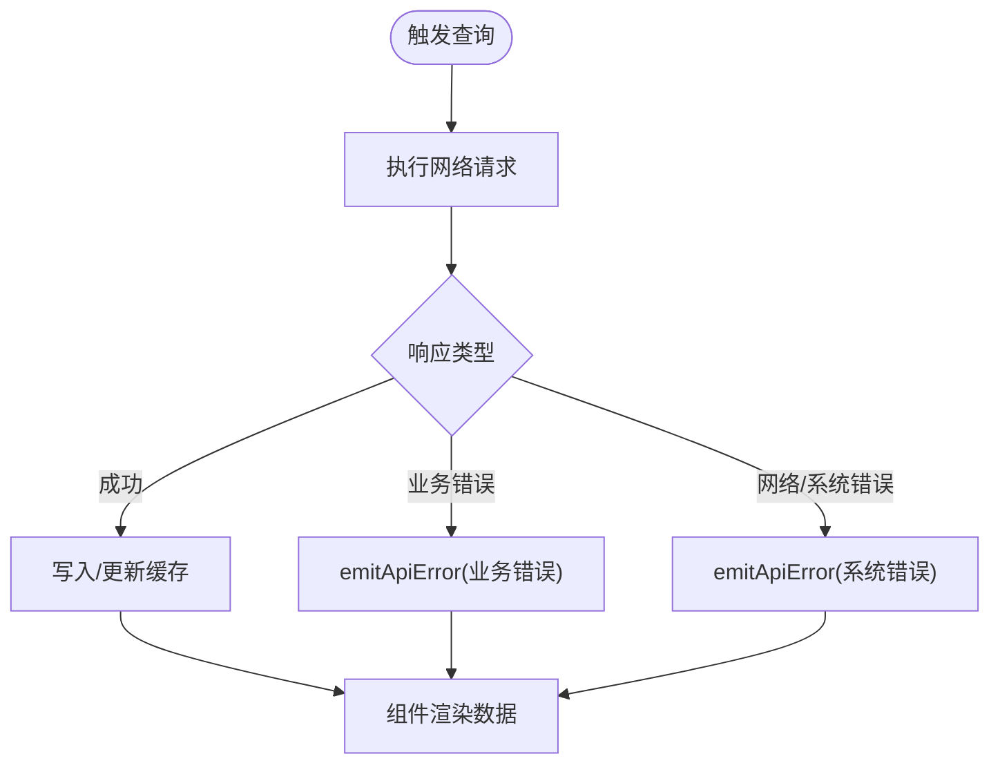
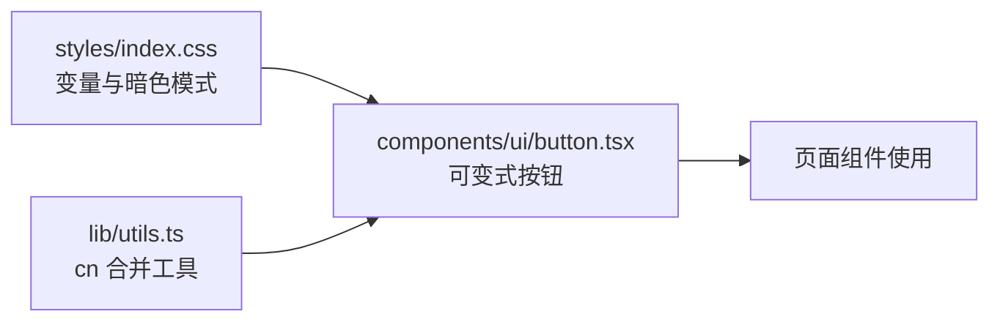
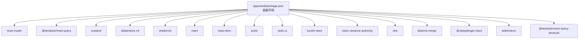

# 前端系统

<cite>
**本文引用的文件**
- [apps/web/package.json](file://apps/web/package.json)
- [apps/web/src/main.tsx](file://apps/web/src/main.tsx)
- [apps/web/src/router/index.tsx](file://apps/web/src/router/index.tsx)
- [apps/web/src/store/index.ts](file://apps/web/src/store/index.ts)
- [apps/web/src/store/auth.ts](file://apps/web/src/store/auth.ts)
- [apps/web/src/store/ui.ts](file://apps/web/src/store/ui.ts)
- [apps/web/src/api/core/query-client.ts](file://apps/web/src/api/core/query-client.ts)
- [apps/web/src/api/core/api-error.ts](file://apps/web/src/api/core/api-error.ts)
- [apps/web/src/components/RequireAuth.tsx](file://apps/web/src/components/RequireAuth.tsx)
- [apps/web/src/components/ui/button.tsx](file://apps/web/src/components/ui/button.tsx)
- [apps/web/src/layouts/MainLayout.tsx](file://apps/web/src/layouts/MainLayout.tsx)
- [apps/web/src/pages/Dashboard.tsx](file://apps/web/src/pages/Dashboard.tsx)
- [apps/web/src/pages/Login.tsx](file://apps/web/src/pages/Login.tsx)
- [apps/web/src/lib/utils.ts](file://apps/web/src/lib/utils.ts)
- [apps/web/src/styles/index.css](file://apps/web/src/styles/index.css)
- [apps/web/vite.config.ts](file://apps/web/vite.config.ts)
</cite>

## 目录
1. [简介](#简介)
2. [项目结构](#项目结构)
3. [核心组件](#核心组件)
4. [架构总览](#架构总览)
5. [详细组件分析](#详细组件分析)
6. [依赖关系分析](#依赖关系分析)
7. [性能考量](#性能考量)
8. [故障排查指南](#故障排查指南)
9. [结论](#结论)
10. [附录](#附录)

## 简介
本文件为基于 React 19 + TypeScript 的前端系统综合文档，聚焦于组件设计模式、状态管理策略、路由系统、数据获取与缓存（React Query）、状态持久化（Zustand）、UI 组件库与主题系统、响应式设计、API 集成与错误处理、以及用户体验优化与最佳实践。文档通过逐层拆解关键源文件，结合可视化图示帮助读者快速理解系统架构与实现细节。

## 项目结构
前端应用位于 apps/web，采用 Vite + React 19 + TypeScript 技术栈，配合 Tailwind CSS v4、shadcn/ui 组件库与 Radix UI 原子组件，构建现代化管理后台界面。核心模块包括：
- 应用入口与根 Provider：在入口文件中注入路由、React Query 提供者、全局错误提示与调试工具。
- 路由系统：基于 React Router v7 的嵌套路由与受保护页面。
- 状态管理：Zustand 管理认证态与 UI 状态，支持 devtools 与持久化。
- 数据层：React Query 管理查询与变更，统一错误分发与重试策略。
- UI 组件：基于 class-variance-authority 与 radix-ui 的可变式按钮等基础组件。
- 主题与样式：Tailwind v4 自定义变量与暗色模式，字体与动画集成。
- 构建与代理：Vite 开发服务器与本地 API 代理至后端服务。

图表来源
- [apps/web/src/main.tsx:1-20](file://apps/web/src/main.tsx#L1-L20)
- [apps/web/src/router/index.tsx:1-51](file://apps/web/src/router/index.tsx#L1-L51)
- [apps/web/src/components/RequireAuth.tsx:1-14](file://apps/web/src/components/RequireAuth.tsx#L1-L14)
- [apps/web/src/layouts/MainLayout.tsx:1-97](file://apps/web/src/layouts/MainLayout.tsx#L1-L97)
- [apps/web/src/store/index.ts:1-3](file://apps/web/src/store/index.ts#L1-L3)
- [apps/web/src/store/auth.ts:1-64](file://apps/web/src/store/auth.ts#L1-L64)
- [apps/web/src/store/ui.ts:1-37](file://apps/web/src/store/ui.ts#L1-L37)
- [apps/web/src/api/core/query-client.ts:1-32](file://apps/web/src/api/core/query-client.ts#L1-L32)
- [apps/web/src/api/core/api-error.ts:1-45](file://apps/web/src/api/core/api-error.ts#L1-L45)
- [apps/web/src/components/ui/button.tsx:1-68](file://apps/web/src/components/ui/button.tsx#L1-L68)
- [apps/web/src/lib/utils.ts:1-7](file://apps/web/src/lib/utils.ts#L1-L7)
- [apps/web/src/styles/index.css:1-130](file://apps/web/src/styles/index.css#L1-L130)
- [apps/web/src/pages/Dashboard.tsx:1-41](file://apps/web/src/pages/Dashboard.tsx#L1-L41)
- [apps/web/src/pages/Login.tsx:1-221](file://apps/web/src/pages/Login.tsx#L1-L221)

章节来源
- [apps/web/package.json:1-44](file://apps/web/package.json#L1-L44)
- [apps/web/vite.config.ts:1-23](file://apps/web/vite.config.ts#L1-L23)

## 核心组件
- 应用入口与根 Provider
  - 在入口文件中，应用被包裹在 QueryClientProvider 中，同时挂载 RouterProvider、全局错误提示与 React Query Devtools，确保数据层与路由层在根节点统一生效。
- 路由系统
  - 使用 createBrowserRouter 定义登录页与受保护的嵌套路由；RequireAuth 守卫根据认证状态决定是否放行；MainLayout 作为受保护区域的容器布局。
- 状态管理
  - 认证状态（access token、refresh token、用户信息、认证态）通过 Zustand 管理，并启用 devtools 与持久化；UI 状态（移动端侧边栏开关）同样通过 Zustand 管理并启用 devtools。
- 数据层
  - React Query 的 QueryClient 配置了查询与变更的默认行为：查询重试策略、过期时间、窗口焦点重取；错误通过统一事件分发器上报。
- UI 组件与主题
  - 可变式按钮组件基于 class-variance-authority 与 radix-ui，支持多种变体与尺寸；样式通过 Tailwind v4 自定义变量与暗色模式实现，字体与动画按需引入。

章节来源
- [apps/web/src/main.tsx:1-20](file://apps/web/src/main.tsx#L1-L20)
- [apps/web/src/router/index.tsx:1-51](file://apps/web/src/router/index.tsx#L1-L51)
- [apps/web/src/store/auth.ts:1-64](file://apps/web/src/store/auth.ts#L1-L64)
- [apps/web/src/store/ui.ts:1-37](file://apps/web/src/store/ui.ts#L1-L37)
- [apps/web/src/api/core/query-client.ts:1-32](file://apps/web/src/api/core/query-client.ts#L1-L32)
- [apps/web/src/api/core/api-error.ts:1-45](file://apps/web/src/api/core/api-error.ts#L1-L45)
- [apps/web/src/components/ui/button.tsx:1-68](file://apps/web/src/components/ui/button.tsx#L1-L68)
- [apps/web/src/styles/index.css:1-130](file://apps/web/src/styles/index.css#L1-L130)

## 架构总览
下图展示从入口到页面渲染、状态更新与数据请求的整体流程：

图表来源
- [apps/web/src/main.tsx:1-20](file://apps/web/src/main.tsx#L1-L20)
- [apps/web/src/router/index.tsx:1-51](file://apps/web/src/router/index.tsx#L1-L51)
- [apps/web/src/components/RequireAuth.tsx:1-14](file://apps/web/src/components/RequireAuth.tsx#L1-L14)
- [apps/web/src/layouts/MainLayout.tsx:1-97](file://apps/web/src/layouts/MainLayout.tsx#L1-L97)
- [apps/web/src/pages/Dashboard.tsx:1-41](file://apps/web/src/pages/Dashboard.tsx#L1-L41)
- [apps/web/src/pages/Login.tsx:1-221](file://apps/web/src/pages/Login.tsx#L1-L221)
- [apps/web/src/api/core/query-client.ts:1-32](file://apps/web/src/api/core/query-client.ts#L1-L32)
- [apps/web/src/store/auth.ts:1-64](file://apps/web/src/store/auth.ts#L1-L64)
- [apps/web/src/store/ui.ts:1-37](file://apps/web/src/store/ui.ts#L1-L37)

## 详细组件分析

### 路由系统设计
- 设计要点
  - 登录页独立路由，无需认证即可访问。
  - 受保护路由通过 RequireAuth 守卫，未认证则跳转登录页并携带来源地址。
  - 主布局 MainLayout 提供导航菜单、移动端侧边栏开关与内容区 Outlet。
  - 仪表盘与用户管理等页面在受保护区域内按路径渲染。
- 关键交互
  - 移动端打开侧边栏时遮罩层覆盖全屏，点击遮罩或点击菜单项自动关闭侧边栏。
  - 导航链接激活态通过 NavLink 的 isActive 状态切换高亮样式。

图表来源
- [apps/web/src/router/index.tsx:1-51](file://apps/web/src/router/index.tsx#L1-L51)
- [apps/web/src/components/RequireAuth.tsx:1-14](file://apps/web/src/components/RequireAuth.tsx#L1-L14)
- [apps/web/src/layouts/MainLayout.tsx:1-97](file://apps/web/src/layouts/MainLayout.tsx#L1-L97)

章节来源
- [apps/web/src/router/index.tsx:1-51](file://apps/web/src/router/index.tsx#L1-L51)
- [apps/web/src/components/RequireAuth.tsx:1-14](file://apps/web/src/components/RequireAuth.tsx#L1-L14)
- [apps/web/src/layouts/MainLayout.tsx:1-97](file://apps/web/src/layouts/MainLayout.tsx#L1-L97)

### 状态管理策略（Zustand）
- 认证状态（AuthStore）
  - 状态字段：访问令牌、刷新令牌、用户信息、认证态。
  - 动作：设置令牌、设置用户、清理认证。
  - 特性：启用 devtools 便于调试；持久化仅保存令牌相关字段；水合阶段根据令牌恢复认证态。
- UI 状态（UiStore）
  - 状态字段：移动端侧边栏开关。
  - 动作：切换与关闭侧边栏。
  - 特性：启用 devtools 便于调试。
- 访问方式
  - 通过 store/index.ts 统一导出 useAuthStore 与 useUiStore，供组件按需订阅。

图表来源
- [apps/web/src/store/auth.ts:1-64](file://apps/web/src/store/auth.ts#L1-L64)
- [apps/web/src/store/ui.ts:1-37](file://apps/web/src/store/ui.ts#L1-L37)
- [apps/web/src/store/index.ts:1-3](file://apps/web/src/store/index.ts#L1-L3)

章节来源
- [apps/web/src/store/auth.ts:1-64](file://apps/web/src/store/auth.ts#L1-L64)
- [apps/web/src/store/ui.ts:1-37](file://apps/web/src/store/ui.ts#L1-L37)
- [apps/web/src/store/index.ts:1-3](file://apps/web/src/store/index.ts#L1-L3)

### 数据获取与缓存（React Query）
- QueryClient 配置
  - 查询默认：最多重试 2 次；业务未授权错误不重试；缓存 30 秒；窗口焦点不自动重取。
  - 变更默认：不重试。
  - 错误回调：统一通过 emitApiError 分发业务/非业务错误。
- 错误分发
  - emitApiError 将错误转换为标准化事件负载，避免重复通知；listenApiError 提供监听接口。
- 页面使用
  - Dashboard 与 Login 页面分别调用 useProfile/useHealth 与 useCaptcha/useLogin，利用 React Query 的 loading/error/data 流程驱动 UI。

图表来源
- [apps/web/src/api/core/query-client.ts:1-32](file://apps/web/src/api/core/query-client.ts#L1-L32)
- [apps/web/src/api/core/api-error.ts:1-45](file://apps/web/src/api/core/api-error.ts#L1-L45)
- [apps/web/src/pages/Dashboard.tsx:1-41](file://apps/web/src/pages/Dashboard.tsx#L1-L41)
- [apps/web/src/pages/Login.tsx:1-221](file://apps/web/src/pages/Login.tsx#L1-L221)

章节来源
- [apps/web/src/api/core/query-client.ts:1-32](file://apps/web/src/api/core/query-client.ts#L1-L32)
- [apps/web/src/api/core/api-error.ts:1-45](file://apps/web/src/api/core/api-error.ts#L1-L45)
- [apps/web/src/pages/Dashboard.tsx:1-41](file://apps/web/src/pages/Dashboard.tsx#L1-L41)
- [apps/web/src/pages/Login.tsx:1-221](file://apps/web/src/pages/Login.tsx#L1-L221)

### UI 组件库与主题系统
- 组件库
  - 按钮组件基于 class-variance-authority 实现多变体与多尺寸，支持 asChild 透传与 Slot Root。
  - 类名合并工具 cn 结合 clsx 与 tailwind-merge，保证样式冲突最小化。
- 主题系统
  - Tailwind v4 自定义变量集中于 styles/index.css，定义前景/背景/强调色/圆角半径等。
  - 暗色模式通过自定义变体与 CSS 变量切换，根元素与 .dark 类共同作用。
  - 字体使用 Geist Variable，动画库按需引入。

图表来源
- [apps/web/src/styles/index.css:1-130](file://apps/web/src/styles/index.css#L1-L130)
- [apps/web/src/components/ui/button.tsx:1-68](file://apps/web/src/components/ui/button.tsx#L1-L68)
- [apps/web/src/lib/utils.ts:1-7](file://apps/web/src/lib/utils.ts#L1-L7)

章节来源
- [apps/web/src/components/ui/button.tsx:1-68](file://apps/web/src/components/ui/button.tsx#L1-L68)
- [apps/web/src/lib/utils.ts:1-7](file://apps/web/src/lib/utils.ts#L1-L7)
- [apps/web/src/styles/index.css:1-130](file://apps/web/src/styles/index.css#L1-L130)

### 响应式设计实现
- 移动优先：侧边栏在小屏隐藏，通过顶部按钮触发抽屉式展开；遮罩层覆盖全屏，点击关闭。
- 断点适配：大屏显示固定侧边栏，小屏切换为抽屉；导航项在小屏紧凑显示。
- 交互反馈：按钮与导航项在激活态与悬停态有明确视觉反馈，提升可用性。

章节来源
- [apps/web/src/layouts/MainLayout.tsx:1-97](file://apps/web/src/layouts/MainLayout.tsx#L1-L97)

### API 集成模式与错误处理
- API 集成
  - 页面通过 React Query Hooks 触发请求，自动管理加载、错误与数据状态。
  - 登录页在提交前校验验证码 ID，提交后跳转首页。
- 错误处理
  - 统一错误事件：emitApiError 将业务错误映射为可读消息，非业务错误统一提示“请求失败，请稍后重试”。
  - 监听器：listenApiError 提供订阅接口，用于全局 Snackbar 或提示条展示。

章节来源
- [apps/web/src/pages/Login.tsx:1-221](file://apps/web/src/pages/Login.tsx#L1-L221)
- [apps/web/src/api/core/api-error.ts:1-45](file://apps/web/src/api/core/api-error.ts#L1-L45)

### 用户体验优化策略
- 加载态：使用 Spinner 组件与条件渲染，避免空白与闪烁。
- 错误态：InlineAlert 提示具体错误，登录页对验证码加载失败与业务错误进行区分提示。
- 无障碍：按钮与导航项具备键盘可达性与语义化标签。
- 性能：查询缓存与合理重试，减少无效请求；移动端侧边栏状态仅在需要时更新。

章节来源
- [apps/web/src/pages/Dashboard.tsx:1-41](file://apps/web/src/pages/Dashboard.tsx#L1-L41)
- [apps/web/src/pages/Login.tsx:1-221](file://apps/web/src/pages/Login.tsx#L1-L221)
- [apps/web/src/components/ui/spinner.tsx](file://apps/web/src/components/ui/spinner.tsx)

## 依赖关系分析
- 外部依赖
  - React 19、React Router 7、React Query 5、Zustand 5、Tailwind CSS v4、shadcn/ui、Radix UI、Lucide React。
- 内部依赖
  - 应用入口依赖路由、React Query 提供者与全局错误提示。
  - 页面依赖 React Query Hooks、UI 组件与 Zustand 状态。
  - 布局依赖 UI 状态与 UI 组件。
- 构建与开发
  - Vite 配置别名 @ 指向 src，开发服务器代理 /api 至后端服务端口。

图表来源
- [apps/web/package.json:1-44](file://apps/web/package.json#L1-L44)

章节来源
- [apps/web/package.json:1-44](file://apps/web/package.json#L1-L44)
- [apps/web/vite.config.ts:1-23](file://apps/web/vite.config.ts#L1-L23)

## 性能考量
- 查询缓存与过期：合理的 staleTime 与手动 invalidation 可降低请求频率。
- 重试策略：业务未授权错误不重试，避免无意义的资源消耗。
- 窗口焦点重取：关闭后可在后台保持缓存，减少不必要的刷新。
- 组件渲染：使用条件渲染与骨架屏思路（Spinner）提升感知性能。
- 打包与懒加载：建议后续对路由级页面进行懒加载以进一步优化首屏。

## 故障排查指南
- 登录失败
  - 检查验证码 ID 是否存在，确认 mutateAsync 参数完整性。
  - 查看登录 Mutation 的 isError 与错误提示，必要时开启 React Query Devtools 观察请求状态。
- 未认证跳转
  - 确认 AuthStore 是否已持久化 token 并在水合阶段恢复 isAuthenticated。
  - 若本地存储异常，尝试清除相关存储键后重新登录。
- 请求失败提示
  - 通过 listenApiError 订阅错误事件，确认错误类型与严重级别。
  - 对业务错误，依据错误码映射提示；对系统错误，提示通用失败信息。
- 样式问题
  - 检查 styles/index.css 变量是否正确编译，暗色模式切换逻辑是否生效。
  - 确认 cn 工具链未因重复类名导致样式覆盖。

章节来源
- [apps/web/src/pages/Login.tsx:1-221](file://apps/web/src/pages/Login.tsx#L1-L221)
- [apps/web/src/store/auth.ts:1-64](file://apps/web/src/store/auth.ts#L1-L64)
- [apps/web/src/api/core/api-error.ts:1-45](file://apps/web/src/api/core/api-error.ts#L1-L45)
- [apps/web/src/styles/index.css:1-130](file://apps/web/src/styles/index.css#L1-L130)

## 结论
本前端系统以 React 19 + TypeScript 为基础，结合 React Query 与 Zustand 构建了清晰的数据流与状态管理模式；通过 shadcn/ui 与 Tailwind v4 实现一致且可定制的 UI 体系；路由系统以守卫与嵌套布局保障访问控制与导航体验。整体架构具备良好的扩展性与可维护性，适合在中大型管理后台场景中持续演进。

## 附录
- 组件使用示例（路径指引）
  - 登录表单与验证码刷新：[apps/web/src/pages/Login.tsx:1-221](file://apps/web/src/pages/Login.tsx#L1-L221)
  - 仪表盘数据展示：[apps/web/src/pages/Dashboard.tsx:1-41](file://apps/web/src/pages/Dashboard.tsx#L1-L41)
  - 可变式按钮组件：[apps/web/src/components/ui/button.tsx:1-68](file://apps/web/src/components/ui/button.tsx#L1-L68)
  - 主布局与移动端侧边栏：[apps/web/src/layouts/MainLayout.tsx:1-97](file://apps/web/src/layouts/MainLayout.tsx#L1-L97)
- 开发最佳实践
  - 使用 React Query Hooks 管理数据生命周期，避免在组件内直接发起请求。
  - 将 UI 状态与业务状态分离，UI 状态尽量轻量化并使用 devtools 调试。
  - 错误处理统一通过 emitApiError 与 listenApiError，确保一致性与可追踪性。
  - 样式合并使用 cn 工具，遵循原子化与最小冲突原则。
  - 路由守卫与布局解耦，便于复用与测试。