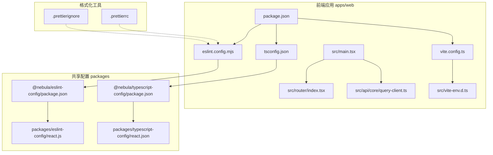
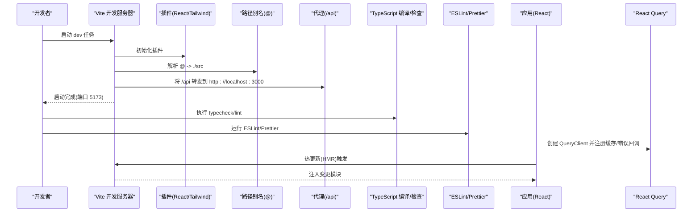
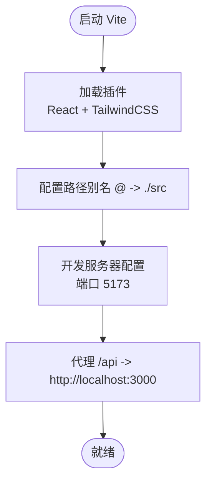
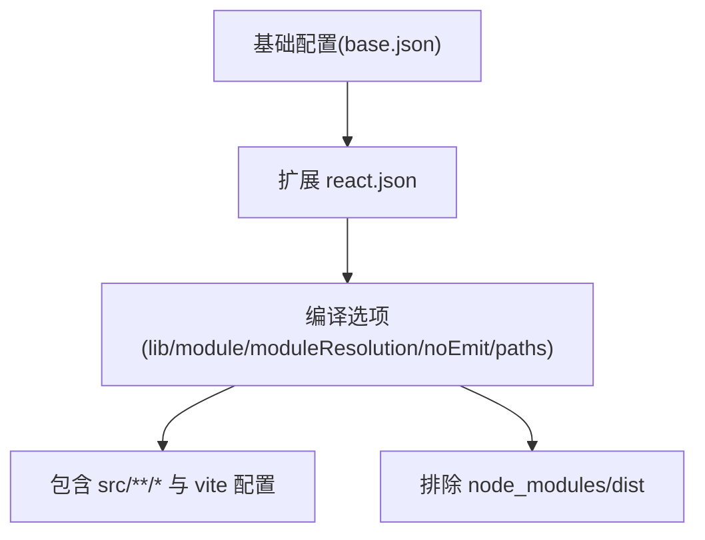
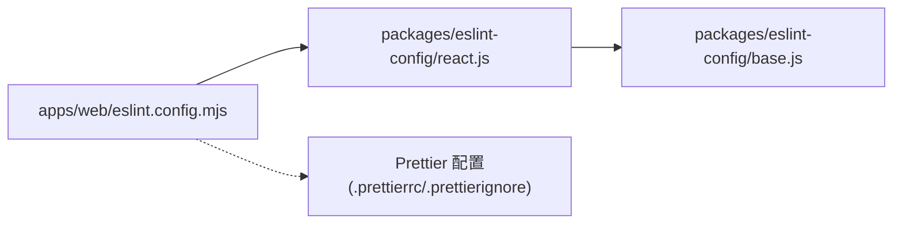
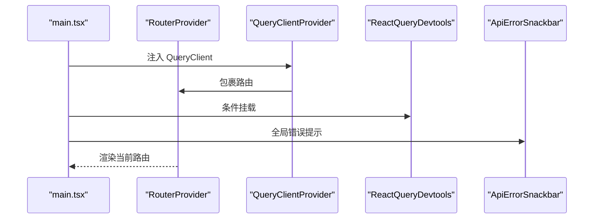
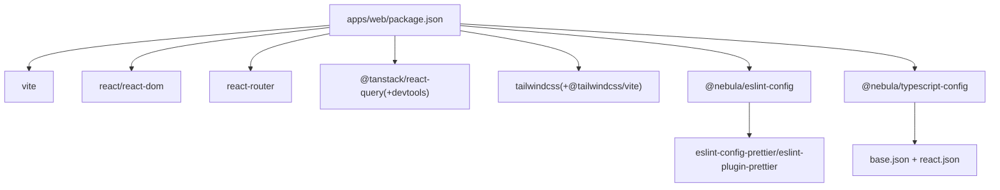

# 开发工具链

<cite>
**本文引用的文件**
- [apps/web/vite.config.ts](file://apps/web/vite.config.ts)
- [apps/web/tsconfig.json](file://apps/web/tsconfig.json)
- [apps/web/eslint.config.mjs](file://apps/web/eslint.config.mjs)
- [apps/web/package.json](file://apps/web/package.json)
- [apps/web/src/main.tsx](file://apps/web/src/main.tsx)
- [apps/web/src/router/index.tsx](file://apps/web/src/router/index.tsx)
- [apps/web/src/api/core/query-client.ts](file://apps/web/src/api/core/query-client.ts)
- [apps/web/src/vite-env.d.ts](file://apps/web/src/vite-env.d.ts)
- [packages/eslint-config/package.json](file://packages/eslint-config/package.json)
- [packages/eslint-config/react.js](file://packages/eslint-config/react.js)
- [packages/typescript-config/package.json](file://packages/typescript-config/package.json)
- [packages/typescript-config/react.json](file://packages/typescript-config/react.json)
- [.prettierrc](file://.prettierrc)
- [.prettierignore](file://.prettierignore)
</cite>

## 目录
1. [简介](#简介)
2. [项目结构](#项目结构)
3. [核心组件](#核心组件)
4. [架构总览](#架构总览)
5. [组件详解](#组件详解)
6. [依赖关系分析](#依赖关系分析)
7. [性能与优化](#性能与优化)
8. [故障排除指南](#故障排除指南)
9. [结论](#结论)
10. [附录](#附录)

## 简介
本文件系统性梳理前端开发工具链，覆盖 Vite 构建配置、TypeScript 类型系统、ESLint 规则与 Prettier 格式化，以及开发服务器、热重载、代理、构建产物与运行时集成（如 React Query Devtools）。文档同时提供性能优化建议、代码分割实践、生产环境最佳实践、开发环境配置示例与常见问题排查方法，帮助团队在保持一致性的前提下提升开发效率与应用质量。

## 项目结构
前端工程位于 apps/web，采用 Vite + React + TypeScript 技术栈；共享规则通过 packages 下的包统一管理（@nebula/eslint-config、@nebula/typescript-config），形成可复用的配置体系。

图表来源
- [apps/web/vite.config.ts:1-23](file://apps/web/vite.config.ts#L1-L23)
- [apps/web/tsconfig.json:1-15](file://apps/web/tsconfig.json#L1-L15)
- [apps/web/eslint.config.mjs:1-10](file://apps/web/eslint.config.mjs#L1-L10)
- [apps/web/package.json:1-44](file://apps/web/package.json#L1-L44)
- [apps/web/src/main.tsx:1-23](file://apps/web/src/main.tsx#L1-L23)
- [apps/web/src/router/index.tsx:1-51](file://apps/web/src/router/index.tsx#L1-L51)
- [apps/web/src/api/core/query-client.ts:1-32](file://apps/web/src/api/core/query-client.ts#L1-L32)
- [apps/web/src/vite-env.d.ts:1-10](file://apps/web/src/vite-env.d.ts#L1-L10)
- [packages/eslint-config/package.json:1-23](file://packages/eslint-config/package.json#L1-L23)
- [packages/eslint-config/react.js:1-15](file://packages/eslint-config/react.js#L1-L15)
- [packages/typescript-config/package.json:1-11](file://packages/typescript-config/package.json#L1-L11)
- [packages/typescript-config/react.json:1-11](file://packages/typescript-config/react.json#L1-L11)
- [.prettierrc:1-11](file://.prettierrc#L1-L11)
- [.prettierignore:1-7](file://.prettierignore#L1-L7)

章节来源
- [apps/web/package.json:1-44](file://apps/web/package.json#L1-L44)
- [apps/web/vite.config.ts:1-23](file://apps/web/vite.config.ts#L1-L23)
- [apps/web/tsconfig.json:1-15](file://apps/web/tsconfig.json#L1-L15)
- [apps/web/eslint.config.mjs:1-10](file://apps/web/eslint.config.mjs#L1-L10)
- [packages/eslint-config/package.json:1-23](file://packages/eslint-config/package.json#L1-L23)
- [packages/typescript-config/package.json:1-11](file://packages/typescript-config/package.json#L1-L11)

## 核心组件
- Vite 构建与开发服务器：插件、别名、端口与代理配置，支持 React JSX 与 TailwindCSS。
- TypeScript：基于共享配置扩展，启用 bundler 模块解析与路径映射。
- ESLint：基于共享配置导出的 React 规则集，结合 Prettier 统一风格。
- Prettier：独立格式化配置与忽略列表，保障跨文件一致性。
- 运行时集成：React Query 客户端与 Devtools、路由与全局样式注入。

章节来源
- [apps/web/vite.config.ts:6-22](file://apps/web/vite.config.ts#L6-L22)
- [apps/web/tsconfig.json:3-12](file://apps/web/tsconfig.json#L3-L12)
- [apps/web/eslint.config.mjs:1-10](file://apps/web/eslint.config.mjs#L1-L10)
- [.prettierrc:1-11](file://.prettierrc#L1-L11)
- [.prettierignore:1-7](file://.prettierignore#L1-L7)
- [apps/web/src/main.tsx:1-23](file://apps/web/src/main.tsx#L1-L23)
- [apps/web/src/api/core/query-client.ts:1-32](file://apps/web/src/api/core/query-client.ts#L1-L32)

## 架构总览
下图展示从开发到构建的关键流程：Vite 启动开发服务器，加载插件与别名，转发 /api 前缀请求至后端；TypeScript 提供类型检查；ESLint/Prettier 在编辑器与 CI 中协同保证代码质量；React Query 提供缓存与错误处理，并在开发时显示 Devtools。

图表来源
- [apps/web/vite.config.ts:6-22](file://apps/web/vite.config.ts#L6-L22)
- [apps/web/src/main.tsx:1-23](file://apps/web/src/main.tsx#L1-L23)
- [apps/web/src/api/core/query-client.ts:1-32](file://apps/web/src/api/core/query-client.ts#L1-L32)
- [apps/web/package.json:6-12](file://apps/web/package.json#L6-L12)

## 组件详解

### Vite 构建与开发服务器
- 插件生态：React JSX 与 TailwindCSS 插件集成，提升开发体验与样式能力。
- 路径别名：将 @ 映射到 src，便于模块导入与维护。
- 开发服务器：默认端口 5173，配置 /api 前缀代理到后端服务，便于前后端联调。
- 环境声明：通过 vite-env.d.ts 声明 Vite 环境变量接口，确保类型安全。

图表来源
- [apps/web/vite.config.ts:6-22](file://apps/web/vite.config.ts#L6-L22)
- [apps/web/src/vite-env.d.ts:1-10](file://apps/web/src/vite-env.d.ts#L1-L10)

章节来源
- [apps/web/vite.config.ts:6-22](file://apps/web/vite.config.ts#L6-L22)
- [apps/web/src/vite-env.d.ts:1-10](file://apps/web/src/vite-env.d.ts#L1-L10)

### TypeScript 配置与类型检查
- 配置继承：基于 @nebula/typescript-config/react.json，统一库版本、JSX 语义与 DOM 类型。
- 模块解析：bundler 模式与 ESNext 模块，适配现代打包器。
- 路径映射：与 Vite 别名保持一致，避免重复维护。
- 入口范围：包含 src 内所有 ts/tsx 文件及 vite 配置文件，确保类型覆盖全面。

图表来源
- [packages/typescript-config/react.json:1-11](file://packages/typescript-config/react.json#L1-L11)
- [apps/web/tsconfig.json:3-14](file://apps/web/tsconfig.json#L3-L14)

章节来源
- [apps/web/tsconfig.json:1-15](file://apps/web/tsconfig.json#L1-L15)
- [packages/typescript-config/react.json:1-11](file://packages/typescript-config/react.json#L1-L11)
- [packages/typescript-config/package.json:1-11](file://packages/typescript-config/package.json#L1-L11)

### ESLint 规则与代码格式化
- 规则来源：共享包 @nebula/eslint-config 导出的 React 规则集，统一浏览器全局与 React 语义。
- 配置组织：主配置文件聚合规则并声明忽略项，便于本地与 CI 复用。
- 与 Prettier 协作：通过 eslint-config-prettier 关闭冲突规则，配合 prettier 执行格式化。
- 包导出：共享包以多入口导出不同场景规则（如 react/nestjs/base）。

图表来源
- [apps/web/eslint.config.mjs:1-10](file://apps/web/eslint.config.mjs#L1-L10)
- [packages/eslint-config/react.js:1-15](file://packages/eslint-config/react.js#L1-L15)
- [packages/eslint-config/package.json:1-23](file://packages/eslint-config/package.json#L1-L23)
- [.prettierrc:1-11](file://.prettierrc#L1-L11)
- [.prettierignore:1-7](file://.prettierignore#L1-L7)

章节来源
- [apps/web/eslint.config.mjs:1-10](file://apps/web/eslint.config.mjs#L1-L10)
- [packages/eslint-config/react.js:1-15](file://packages/eslint-config/react.js#L1-L15)
- [packages/eslint-config/package.json:1-23](file://packages/eslint-config/package.json#L1-L23)
- [.prettierrc:1-11](file://.prettierrc#L1-L11)
- [.prettierignore:1-7](file://.prettierignore#L1-L7)

### 应用初始化与运行时集成
- 入口渲染：StrictMode、QueryClientProvider、TooltipProvider、RouterProvider 组合，统一状态与 UI 上下文。
- 错误提示：全局 ApiErrorSnackbar 展示错误信息。
- 开发工具：React Query Devtools 默认关闭，按需开启。
- 路由结构：登录页与受保护页面组合，嵌套路由清晰分层。
- 查询客户端：集中配置缓存、错误处理与重试策略，区分查询与变更。

图表来源
- [apps/web/src/main.tsx:1-23](file://apps/web/src/main.tsx#L1-L23)
- [apps/web/src/router/index.tsx:1-51](file://apps/web/src/router/index.tsx#L1-L51)
- [apps/web/src/api/core/query-client.ts:1-32](file://apps/web/src/api/core/query-client.ts#L1-L32)

章节来源
- [apps/web/src/main.tsx:1-23](file://apps/web/src/main.tsx#L1-L23)
- [apps/web/src/router/index.tsx:1-51](file://apps/web/src/router/index.tsx#L1-L51)
- [apps/web/src/api/core/query-client.ts:1-32](file://apps/web/src/api/core/query-client.ts#L1-L32)

## 依赖关系分析
- 应用层依赖：Vite、React、React Router、React Query、TailwindCSS 及其相关工具。
- 共享配置：@nebula/eslint-config 与 @nebula/typescript-config 作为工作区包被应用依赖，实现规则与类型配置的集中管理。
- 开发脚本：dev/build/preview/lint/typecheck/clean 等命令串联开发与构建流程。

图表来源
- [apps/web/package.json:1-44](file://apps/web/package.json#L1-L44)
- [packages/eslint-config/package.json:1-23](file://packages/eslint-config/package.json#L1-L23)
- [packages/typescript-config/package.json:1-11](file://packages/typescript-config/package.json#L1-L11)

章节来源
- [apps/web/package.json:1-44](file://apps/web/package.json#L1-L44)
- [packages/eslint-config/package.json:1-23](file://packages/eslint-config/package.json#L1-L23)
- [packages/typescript-config/package.json:1-11](file://packages/typescript-config/package.json#L1-L11)

## 性能与优化
- 代码分割与懒加载
  - 使用 React Router 的嵌套路由与页面级组件划分，结合动态导入实现按需加载，减少首屏体积。
  - 对非关键路径（菜单、角色、字典等）采用占位组件或延迟加载策略，降低初始渲染压力。
- 构建优化
  - 使用 Vite 的原生 ESM 与预构建依赖，缩短冷启动时间；在大型项目中可考虑预构建第三方包。
  - 生产构建时利用最小化与资源内联策略，结合 CDN 与缓存头优化静态资源交付。
- 状态与网络
  - React Query 的默认缓存与重试策略已针对业务错误进行区分处理，避免不必要的重试；可进一步细化 staleTime/refetchOnWindowFocus 以平衡实时性与性能。
- 样式与字体
  - TailwindCSS 按需生成样式，建议结合 Purge 配置清理未使用类；变量字体与动画按需引入，避免冗余。
- 类型与检查
  - 在 CI 中执行 tsc --noEmit 与 ESLint，提前发现潜在问题；将 Prettier 作为提交前钩子，确保格式一致性。

[本节为通用性能建议，不直接分析具体文件]

## 故障排除指南
- 环境变量未生效
  - 确认 .env 或 Vite 环境变量命名规范与 vite-env.d.ts 声明一致；检查 Vite 配置是否正确注入。
  - 参考：[apps/web/src/vite-env.d.ts:3-9](file://apps/web/src/vite-env.d.ts#L3-L9)
- 代理 /api 请求失败
  - 检查后端服务是否在 http://localhost:3000 正常运行；确认 Vite 代理配置与目标地址一致。
  - 参考：[apps/web/vite.config.ts:15-20](file://apps/web/vite.config.ts#L15-L20)
- 路由跳转异常
  - 核对路由层级与路径定义，确保受保护路由与嵌套结构正确；检查 RequireAuth 组件逻辑。
  - 参考：[apps/web/src/router/index.tsx:12-48](file://apps/web/src/router/index.tsx#L12-L48)
- 类型检查报错
  - 更新 tsconfig.json 的 include/exclude 与路径映射，确保新增文件被纳入类型检查。
  - 参考：[apps/web/tsconfig.json:12-13](file://apps/web/tsconfig.json#L12-L13)
- ESLint 报错或格式不一致
  - 在编辑器中安装 ESLint/Prettier 插件，执行 lint 与 format；检查 .prettierrc 与 .prettierignore 是否覆盖了目标文件。
  - 参考：[apps/web/eslint.config.mjs:6-8](file://apps/web/eslint.config.mjs#L6-L8)，[.prettierrc:1-11](file://.prettierrc#L1-L11)，[.prettierignore:1-7](file://.prettierignore#L1-L7)
- React Query 错误未弹窗
  - 确认全局错误提示组件已挂载且事件发射正常；检查 queryClient 的缓存与错误回调配置。
  - 参考：[apps/web/src/api/core/query-client.ts:6-15](file://apps/web/src/api/core/query-client.ts#L6-L15)，[apps/web/src/main.tsx:16-19](file://apps/web/src/main.tsx#L16-L19)

章节来源
- [apps/web/src/vite-env.d.ts:3-9](file://apps/web/src/vite-env.d.ts#L3-L9)
- [apps/web/vite.config.ts:15-20](file://apps/web/vite.config.ts#L15-L20)
- [apps/web/src/router/index.tsx:12-48](file://apps/web/src/router/index.tsx#L12-L48)
- [apps/web/tsconfig.json:12-13](file://apps/web/tsconfig.json#L12-L13)
- [apps/web/eslint.config.mjs:6-8](file://apps/web/eslint.config.mjs#L6-L8)
- [.prettierrc:1-11](file://.prettierrc#L1-L11)
- [.prettierignore:1-7](file://.prettierignore#L1-L7)
- [apps/web/src/api/core/query-client.ts:6-15](file://apps/web/src/api/core/query-client.ts#L6-L15)
- [apps/web/src/main.tsx:16-19](file://apps/web/src/main.tsx#L16-L19)

## 结论
本工具链通过共享配置与现代构建工具实现了高一致性与高效率的前端开发体验。Vite 提供快速开发与热重载，TypeScript 保障类型安全，ESLint/Prettier 统一风格，React Query 提升数据层稳定性。遵循本文档的配置与优化建议，可在开发与生产环境中获得更佳的性能与可维护性。

[本节为总结性内容，不直接分析具体文件]

## 附录

### 开发环境配置示例
- 启动开发服务器：执行 dev 脚本，访问 http://localhost:5173。
- 代理后端 API：将 /api 前缀请求转发至 http://localhost:3000。
- 类型检查：执行 typecheck 脚本，确保无编译错误。
- 代码检查：执行 lint 脚本，修复规则警告。
- 预览构建：执行 preview 脚本，验证生产构建效果。

章节来源
- [apps/web/package.json:6-12](file://apps/web/package.json#L6-L12)
- [apps/web/vite.config.ts:13-21](file://apps/web/vite.config.ts#L13-L21)