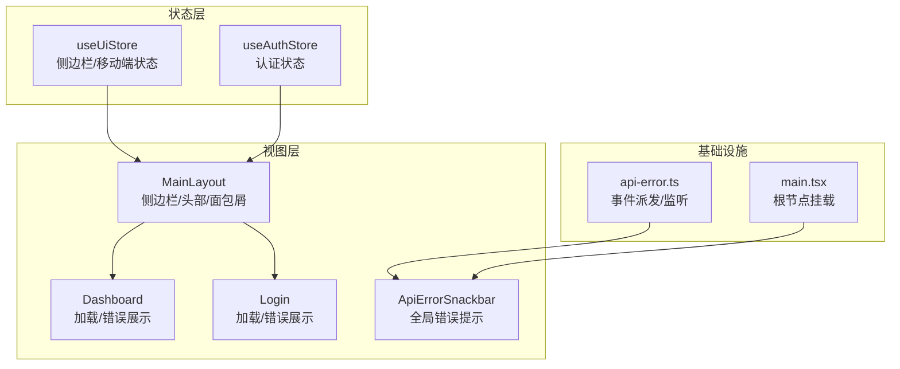
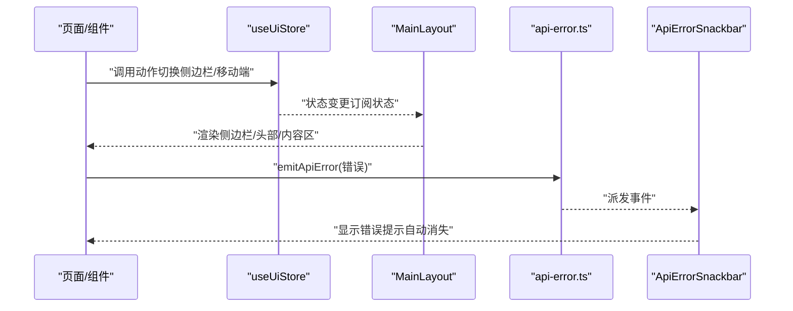
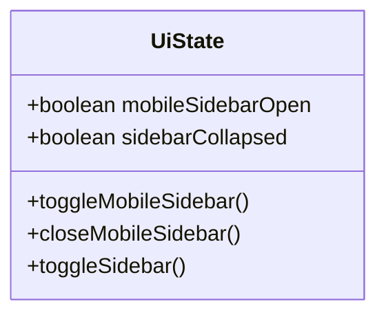
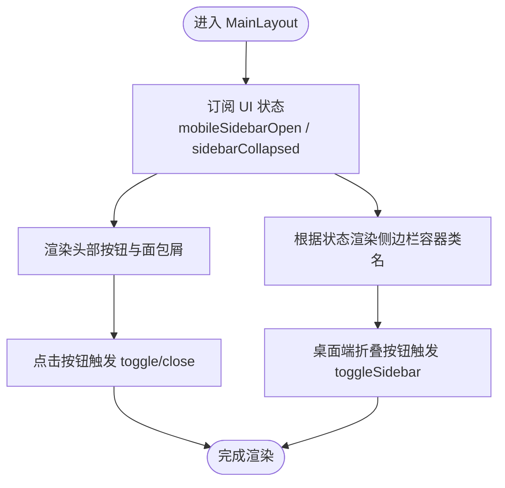
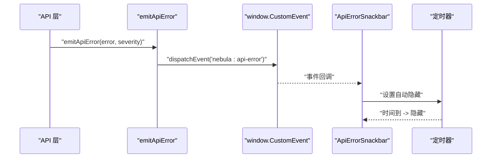
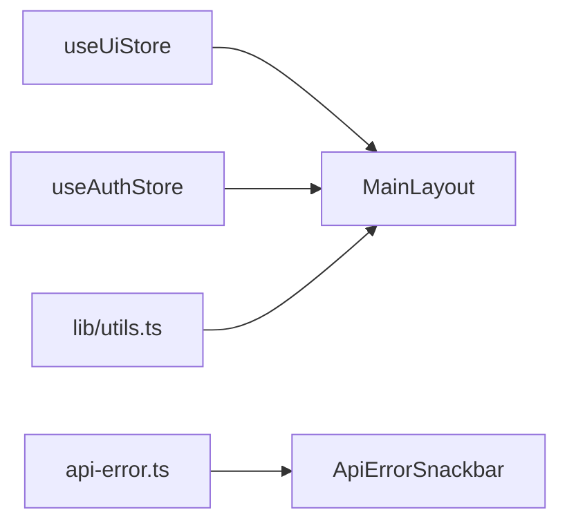

# UI 状态管理

<cite>
**本文引用的文件**
- [apps/web/src/store/ui.ts](file://apps/web/src/store/ui.ts)
- [apps/web/src/layouts/MainLayout.tsx](file://apps/web/src/layouts/MainLayout.tsx)
- [apps/web/src/components/ApiErrorSnackbar.tsx](file://apps/web/src/components/ApiErrorSnackbar.tsx)
- [apps/web/src/api/core/api-error.ts](file://apps/web/src/api/core/api-error.ts)
- [apps/web/src/store/auth.ts](file://apps/web/src/store/auth.ts)
- [apps/web/src/main.tsx](file://apps/web/src/main.tsx)
- [apps/web/src/pages/Dashboard.tsx](file://apps/web/src/pages/Dashboard.tsx)
- [apps/web/src/pages/Login.tsx](file://apps/web/src/pages/Login.tsx)
- [apps/web/src/lib/utils.ts](file://apps/web/src/lib/utils.ts)
</cite>

## 目录

1. [引言](#引言)
2. [项目结构](#项目结构)
3. [核心组件](#核心组件)
4. [架构总览](#架构总览)
5. [详细组件分析](#详细组件分析)
6. [依赖关系分析](#依赖关系分析)
7. [性能考量](#性能考量)
8. [故障排查指南](#故障排查指南)
9. [结论](#结论)
10. [附录](#附录)

## 引言

本文件聚焦于前端应用中的“UI 状态管理”，系统性阐述侧边栏展开/收起、移动端侧边栏开关、全局错误提示等 UI 状态的设计与实现。内容涵盖状态模型、响应式更新机制、与认证状态的协同、错误提示的生命周期管理、以及性能优化与最佳实践。

## 项目结构

UI 状态主要由 Zustand 状态库集中管理，并在布局组件中进行消费；全局错误提示通过事件总线与 Snackbar 组件联动；页面层通过查询状态（如加载、错误）驱动 UI 呈现。

图表来源

- [apps/web/src/store/ui.ts:1-43](file://apps/web/src/store/ui.ts#L1-L43)
- [apps/web/src/store/auth.ts:1-64](file://apps/web/src/store/auth.ts#L1-L64)
- [apps/web/src/layouts/MainLayout.tsx:1-317](file://apps/web/src/layouts/MainLayout.tsx#L1-L317)
- [apps/web/src/components/ApiErrorSnackbar.tsx:1-58](file://apps/web/src/components/ApiErrorSnackbar.tsx#L1-L58)
- [apps/web/src/api/core/api-error.ts:1-45](file://apps/web/src/api/core/api-error.ts#L1-L45)
- [apps/web/src/main.tsx:1-23](file://apps/web/src/main.tsx#L1-L23)

章节来源

- [apps/web/src/store/ui.ts:1-43](file://apps/web/src/store/ui.ts#L1-L43)
- [apps/web/src/layouts/MainLayout.tsx:1-317](file://apps/web/src/layouts/MainLayout.tsx#L1-L317)
- [apps/web/src/components/ApiErrorSnackbar.tsx:1-58](file://apps/web/src/components/ApiErrorSnackbar.tsx#L1-L58)
- [apps/web/src/api/core/api-error.ts:1-45](file://apps/web/src/api/core/api-error.ts#L1-L45)
- [apps/web/src/main.tsx:1-23](file://apps/web/src/main.tsx#L1-L23)

## 核心组件

- UI 状态存储（Zustand）
  - 状态键：移动端侧边栏开关、侧边栏折叠状态
  - 动作：切换移动端侧边栏、关闭移动端侧边栏、切换侧边栏折叠
- 主布局（MainLayout）
  - 消费 UI 状态，渲染侧边栏、头部、面包屑与内容区域
  - 移动端 overlay 背景遮罩与动画过渡
- 全局错误提示（ApiErrorSnackbar）
  - 订阅窗口事件，自动弹出并在定时后消失
- 错误事件系统（api-error.ts）
  - 统一派发业务错误与通用错误，支持严重级别
- 页面层（Dashboard/Login）
  - 基于查询状态（加载/错误）渲染占位与错误提示

章节来源

- [apps/web/src/store/ui.ts:1-43](file://apps/web/src/store/ui.ts#L1-L43)
- [apps/web/src/layouts/MainLayout.tsx:171-317](file://apps/web/src/layouts/MainLayout.tsx#L171-L317)
- [apps/web/src/components/ApiErrorSnackbar.tsx:1-58](file://apps/web/src/components/ApiErrorSnackbar.tsx#L1-L58)
- [apps/web/src/api/core/api-error.ts:16-42](file://apps/web/src/api/core/api-error.ts#L16-L42)
- [apps/web/src/pages/Dashboard.tsx:122-128](file://apps/web/src/pages/Dashboard.tsx#L122-L128)
- [apps/web/src/pages/Login.tsx:165-171](file://apps/web/src/pages/Login.tsx#L165-L171)

## 架构总览

UI 状态管理采用“集中式状态 + 组件订阅”的模式，配合事件总线实现跨模块的错误提示。整体流程如下：

图表来源

- [apps/web/src/store/ui.ts:20-42](file://apps/web/src/store/ui.ts#L20-L42)
- [apps/web/src/layouts/MainLayout.tsx:171-317](file://apps/web/src/layouts/MainLayout.tsx#L171-L317)
- [apps/web/src/api/core/api-error.ts:16-42](file://apps/web/src/api/core/api-error.ts#L16-L42)
- [apps/web/src/components/ApiErrorSnackbar.tsx:7-58](file://apps/web/src/components/ApiErrorSnackbar.tsx#L7-L58)

## 详细组件分析

### UI 状态模型与动作

- 状态模型
  - 移动端侧边栏开关：用于移动端抽屉的显隐
  - 侧边栏折叠状态：用于桌面端侧边栏宽度与文本显示的切换
- 动作
  - 切换移动端侧边栏：翻转开关
  - 关闭移动端侧边栏：强制关闭
  - 切换侧边栏折叠：翻转折叠状态
- 设计要点
  - 使用 devtools 包裹便于调试
  - 状态粒度小、职责单一，避免冗余订阅

图表来源

- [apps/web/src/store/ui.ts:5-18](file://apps/web/src/store/ui.ts#L5-L18)

章节来源

- [apps/web/src/store/ui.ts:1-43](file://apps/web/src/store/ui.ts#L1-L43)

### 主布局中的 UI 状态消费

- 消费方式
  - 从 useUiStore 中选择性订阅所需状态与动作
- 渲染逻辑
  - 侧边栏容器类名根据折叠与移动端开关动态计算
  - 头部按钮触发移动端开关与关闭
  - 移动端 overlay 在侧边栏打开时显示并可点击关闭
- 工具函数
  - 使用工具函数合并条件类名，保证样式切换平滑

图表来源

- [apps/web/src/layouts/MainLayout.tsx:171-317](file://apps/web/src/layouts/MainLayout.tsx#L171-L317)
- [apps/web/src/lib/utils.ts:4-6](file://apps/web/src/lib/utils.ts#L4-L6)

章节来源

- [apps/web/src/layouts/MainLayout.tsx:171-317](file://apps/web/src/layouts/MainLayout.tsx#L171-L317)
- [apps/web/src/lib/utils.ts:1-7](file://apps/web/src/lib/utils.ts#L1-L7)

### 全局错误提示与事件总线

- 事件派发
  - 统一封装错误对象，区分业务错误与通用错误
  - 通过自定义事件在窗口层面广播
- 提示组件
  - 订阅事件后显示错误消息，支持手动关闭
  - 自动定时隐藏，避免阻塞用户操作
- 交互细节
  - 严重级别决定样式与语义
  - 防重复通知（对同一对象去重）

图表来源

- [apps/web/src/api/core/api-error.ts:16-42](file://apps/web/src/api/core/api-error.ts#L16-L42)
- [apps/web/src/components/ApiErrorSnackbar.tsx:7-58](file://apps/web/src/components/ApiErrorSnackbar.tsx#L7-L58)

章节来源

- [apps/web/src/api/core/api-error.ts:1-45](file://apps/web/src/api/core/api-error.ts#L1-L45)
- [apps/web/src/components/ApiErrorSnackbar.tsx:1-58](file://apps/web/src/components/ApiErrorSnackbar.tsx#L1-L58)

### 与认证状态的协同

- 认证状态持久化
  - 使用持久化中间件仅保存令牌字段，减少存储体积
  - 恢复时根据令牌设置认证态
- 与 UI 的关系
  - 登录成功后跳转至主布局，此时 UI 状态独立存在
  - 用户登出时清空认证状态，不影响 UI 状态（可按需清理）

章节来源

- [apps/web/src/store/auth.ts:30-64](file://apps/web/src/store/auth.ts#L30-L64)
- [apps/web/src/pages/Login.tsx:68-72](file://apps/web/src/pages/Login.tsx#L68-L72)

### 页面层的加载与错误状态

- Dashboard
  - 健康检查查询的加载/错误分支，分别渲染加载指示或错误提示
- Login
  - 验证码加载/错误分支，提供刷新能力
  - 登录失败时显示内联错误提示
- 通用加载指示
  - 使用统一的 Spinner 组件提升一致性

章节来源

- [apps/web/src/pages/Dashboard.tsx:122-128](file://apps/web/src/pages/Dashboard.tsx#L122-L128)
- [apps/web/src/pages/Login.tsx:165-171](file://apps/web/src/pages/Login.tsx#L165-L171)
- [apps/web/src/components/ui/spinner.tsx:1-13](file://apps/web/src/components/ui/spinner.tsx#L1-L13)

## 依赖关系分析

- 组件耦合
  - MainLayout 依赖 UI 状态与工具函数，保持低耦合高内聚
  - Snackbar 与事件系统解耦，通过事件通信
- 状态依赖
  - UI 状态不依赖认证状态，但两者在布局中共同影响视图
- 外部依赖
  - Zustand 提供轻量状态管理
  - TailwindCSS + clsx/twMerge 提供样式组合能力

图表来源

- [apps/web/src/store/ui.ts:1-43](file://apps/web/src/store/ui.ts#L1-L43)
- [apps/web/src/store/auth.ts:1-64](file://apps/web/src/store/auth.ts#L1-L64)
- [apps/web/src/layouts/MainLayout.tsx:1-317](file://apps/web/src/layouts/MainLayout.tsx#L1-L317)
- [apps/web/src/components/ApiErrorSnackbar.tsx:1-58](file://apps/web/src/components/ApiErrorSnackbar.tsx#L1-L58)
- [apps/web/src/lib/utils.ts:1-7](file://apps/web/src/lib/utils.ts#L1-L7)

章节来源

- [apps/web/src/store/ui.ts:1-43](file://apps/web/src/store/ui.ts#L1-L43)
- [apps/web/src/store/auth.ts:1-64](file://apps/web/src/store/auth.ts#L1-L64)
- [apps/web/src/layouts/MainLayout.tsx:1-317](file://apps/web/src/layouts/MainLayout.tsx#L1-L317)
- [apps/web/src/components/ApiErrorSnackbar.tsx:1-58](file://apps/web/src/components/ApiErrorSnackbar.tsx#L1-L58)
- [apps/web/src/lib/utils.ts:1-7](file://apps/web/src/lib/utils.ts#L1-L7)

## 性能考量

- 状态订阅最小化
  - 仅订阅需要的状态片段，避免不必要的重渲染
- 类名合并
  - 使用工具函数合并条件类名，减少 DOM 属性计算开销
- 事件去重
  - 对同一错误对象进行去重，避免重复提示造成的抖动
- 动画与过渡
  - 合理的过渡时长与缓动函数，兼顾流畅与性能
- 加载与错误分支
  - 页面层对加载/错误分支进行短路径处理，减少无效渲染

## 故障排查指南

- 侧边栏无法关闭
  - 检查移动端 overlay 是否阻止了点击事件
  - 确认 closeMobileSidebar 动作是否被正确绑定
- 折叠状态不生效
  - 检查桌面端折叠按钮是否触发 toggleSidebar
  - 确认类名计算逻辑是否包含折叠状态
- 错误提示不出现
  - 确认错误事件是否被派发
  - 检查 Snackbar 是否已挂载在根节点
- 错误提示未自动消失
  - 检查定时器是否被清理或覆盖
  - 确认事件监听是否正确移除

章节来源

- [apps/web/src/layouts/MainLayout.tsx:182-189](file://apps/web/src/layouts/MainLayout.tsx#L182-L189)
- [apps/web/src/components/ApiErrorSnackbar.tsx:16-28](file://apps/web/src/components/ApiErrorSnackbar.tsx#L16-L28)
- [apps/web/src/api/core/api-error.ts:34-42](file://apps/web/src/api/core/api-error.ts#L34-L42)
- [apps/web/src/main.tsx:12-22](file://apps/web/src/main.tsx#L12-L22)

## 结论

该 UI 状态管理体系以 Zustand 为核心，围绕侧边栏与移动端交互提供简洁明确的状态与动作；通过事件总线实现全局错误提示的解耦；页面层基于查询状态进行加载与错误分支渲染。整体设计具备良好的可维护性与扩展性，适合在中大型前端应用中推广使用。

## 附录

- 最佳实践
  - 将 UI 状态与业务状态分离，保持 UI 状态无副作用
  - 使用事件总线传递跨组件的非直接依赖信息
  - 对复杂类名组合使用工具函数，确保一致性和可读性
  - 在布局组件中集中处理尺寸与过渡，降低子组件复杂度
- 扩展建议
  - 可引入状态持久化（如 localStorage）以恢复 UI 布局偏好
  - 可增加主题与语言等全局 UI 设置的状态源
  - 可为 UI 状态添加快照与回滚能力，增强调试体验
