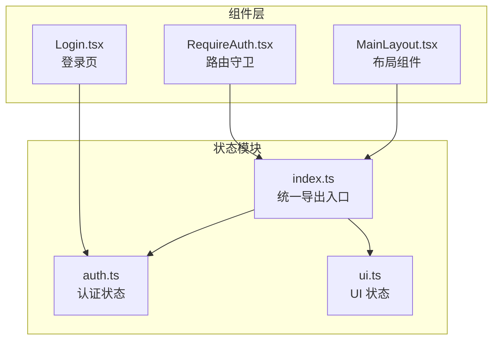
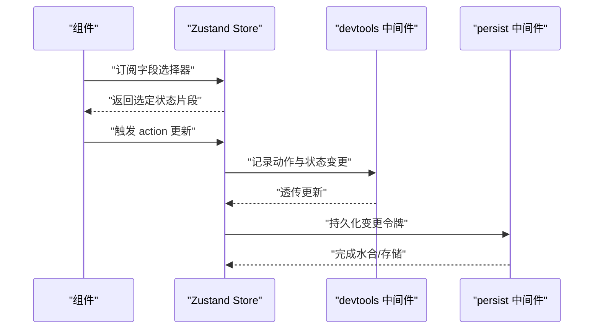
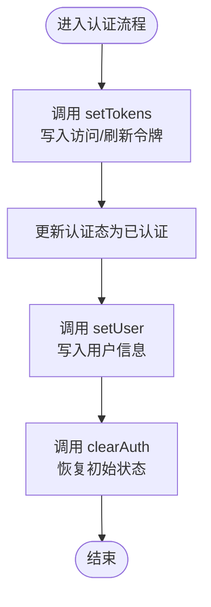
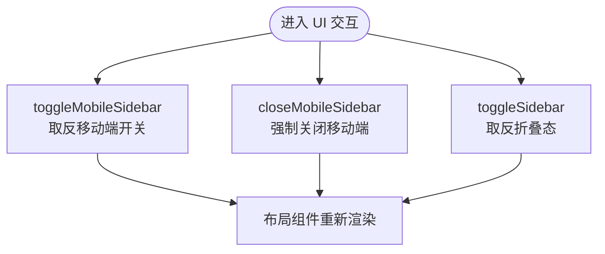
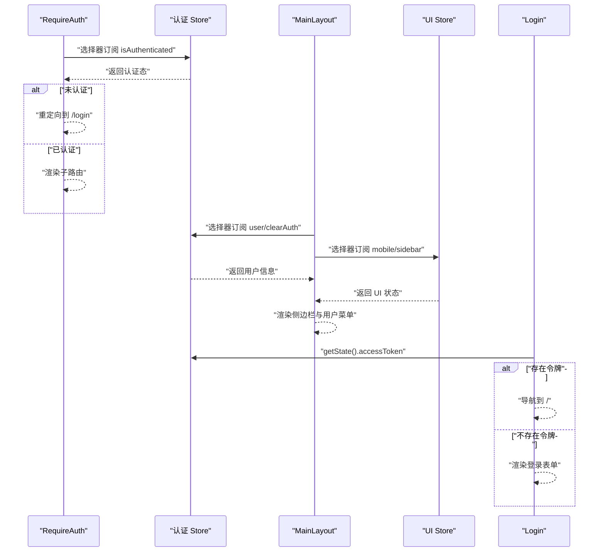
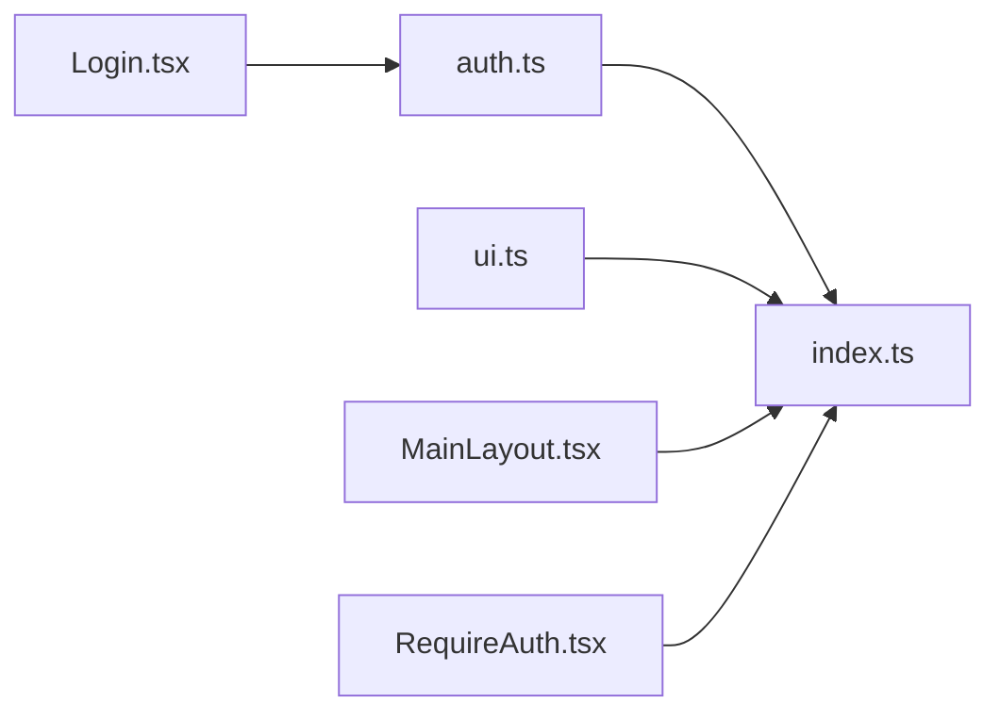

# 状态管理架构

<cite>
**本文引用的文件**
- [apps/web/src/store/index.ts](file://apps/web/src/store/index.ts)
- [apps/web/src/store/auth.ts](file://apps/web/src/store/auth.ts)
- [apps/web/src/store/ui.ts](file://apps/web/src/store/ui.ts)
- [apps/web/src/components/RequireAuth.tsx](file://apps/web/src/components/RequireAuth.tsx)
- [apps/web/src/layouts/MainLayout.tsx](file://apps/web/src/layouts/MainLayout.tsx)
- [apps/web/src/pages/Login.tsx](file://apps/web/src/pages/Login.tsx)
</cite>

## 目录

1. [引言](#引言)
2. [项目结构](#项目结构)
3. [核心组件](#核心组件)
4. [架构总览](#架构总览)
5. [详细组件分析](#详细组件分析)
6. [依赖分析](#依赖分析)
7. [性能考虑](#性能考虑)
8. [故障排查指南](#故障排查指南)
9. [结论](#结论)
10. [附录](#附录)

## 引言

本文件系统性梳理前端应用中基于 Zustand 的状态管理架构，重点覆盖以下方面：

- 整体架构设计：状态模块的组织结构、命名约定与导入导出机制
- 模块间依赖关系：状态传递模式与组合策略
- 扩展性与模块化：最佳实践与代码组织建议
- 性能优化：中间件使用、选择器订阅与持久化策略
- 调试技巧与维护策略：开发工具、日志与错误处理

## 项目结构

前端状态管理位于 Web 应用的 store 目录，采用“按功能域拆分”的模块化组织方式：

- 认证状态模块：负责令牌、用户信息与认证态
- UI 状态模块：负责布局与交互态（如侧边栏）
- 统一导出入口：通过 index.ts 将各模块导出，便于上层组件统一引入

图表来源

- [apps/web/src/store/index.ts:1-3](file://apps/web/src/store/index.ts#L1-L3)
- [apps/web/src/store/auth.ts:1-64](file://apps/web/src/store/auth.ts#L1-L64)
- [apps/web/src/store/ui.ts:1-43](file://apps/web/src/store/ui.ts#L1-L43)
- [apps/web/src/layouts/MainLayout.tsx:29-177](file://apps/web/src/layouts/MainLayout.tsx#L29-L177)
- [apps/web/src/components/RequireAuth.tsx:1-14](file://apps/web/src/components/RequireAuth.tsx#L1-L14)
- [apps/web/src/pages/Login.tsx:10-72](file://apps/web/src/pages/Login.tsx#L10-L72)

章节来源

- [apps/web/src/store/index.ts:1-3](file://apps/web/src/store/index.ts#L1-L3)
- [apps/web/src/store/auth.ts:1-64](file://apps/web/src/store/auth.ts#L1-L64)
- [apps/web/src/store/ui.ts:1-43](file://apps/web/src/store/ui.ts#L1-L43)

## 核心组件

- 认证状态模块（auth.ts）
  - 数据结构：包含访问令牌、刷新令牌、用户信息与认证态
  - 行为接口：设置令牌、设置用户、清理认证
  - 中间件：devtools（开发调试）、persist（本地持久化）
  - 持久化策略：仅持久化令牌字段，并在水合时根据令牌推导认证态
- UI 状态模块（ui.ts）
  - 数据结构：移动端侧边栏开关、侧边栏折叠态
  - 行为接口：切换移动端侧边栏、关闭移动端侧边栏、切换侧边栏
  - 中间件：devtools（开发调试）
- 统一导出入口（index.ts）
  - 将各模块的 Hook 导出，供上层组件统一按需引入

章节来源

- [apps/web/src/store/auth.ts:6-28](file://apps/web/src/store/auth.ts#L6-L28)
- [apps/web/src/store/auth.ts:30-63](file://apps/web/src/store/auth.ts#L30-L63)
- [apps/web/src/store/ui.ts:5-18](file://apps/web/src/store/ui.ts#L5-L18)
- [apps/web/src/store/ui.ts:20-42](file://apps/web/src/store/ui.ts#L20-L42)
- [apps/web/src/store/index.ts:1-3](file://apps/web/src/store/index.ts#L1-L3)

## 架构总览

Zustand 状态管理采用“单一职责 + 组合导出”的设计：

- 每个状态模块聚焦一个领域（认证、UI），避免状态耦合
- 通过 index.ts 提供统一入口，降低上层组件的导入复杂度
- 组件通过选择器订阅所需字段，减少不必要重渲染
- 使用 devtools 中间件增强可调试性；使用 persist 中间件实现令牌持久化

图表来源

- [apps/web/src/store/auth.ts:30-63](file://apps/web/src/store/auth.ts#L30-L63)
- [apps/web/src/store/ui.ts:20-42](file://apps/web/src/store/ui.ts#L20-L42)

## 详细组件分析

### 认证状态模块（auth.ts）

- 设计要点
  - 类型安全：通过接口定义状态与行为，最终合并为统一类型
  - 动作封装：将状态更新逻辑收敛在 store 内部，保证一致性
  - 持久化策略：仅持久化令牌，避免敏感信息泄露；水合时根据令牌推导认证态
  - 开发体验：启用 devtools，便于时间旅行调试
- 关键流程
  - 设置令牌：同时写入访问与刷新令牌并标记已认证
  - 设置用户：更新用户信息
  - 清理认证：恢复初始状态，断开认证态
- 与组件的交互
  - 布局组件订阅用户信息与清理方法，用于展示与登出
  - 登录页在挂载时检查令牌以决定是否跳转首页

图表来源

- [apps/web/src/store/auth.ts:36-46](file://apps/web/src/store/auth.ts#L36-L46)
- [apps/web/src/store/auth.ts:54-58](file://apps/web/src/store/auth.ts#L54-L58)

章节来源

- [apps/web/src/store/auth.ts:6-28](file://apps/web/src/store/auth.ts#L6-L28)
- [apps/web/src/store/auth.ts:30-63](file://apps/web/src/store/auth.ts#L30-L63)
- [apps/web/src/layouts/MainLayout.tsx:118-120](file://apps/web/src/layouts/MainLayout.tsx#L118-L120)
- [apps/web/src/pages/Login.tsx:68-72](file://apps/web/src/pages/Login.tsx#L68-L72)

### UI 状态模块（ui.ts）

- 设计要点
  - 精简状态：仅包含与 UI 呈现直接相关的布尔值
  - 行为明确：提供切换与关闭两类操作，语义清晰
  - 开发体验：启用 devtools，便于观察 UI 交互状态变化
- 关键流程
  - 切换移动端侧边栏：基于当前状态取反
  - 切换侧边栏：基于当前状态取反
  - 关闭移动端侧边栏：强制置为关闭

图表来源

- [apps/web/src/store/ui.ts:26-38](file://apps/web/src/store/ui.ts#L26-L38)
- [apps/web/src/layouts/MainLayout.tsx:172-177](file://apps/web/src/layouts/MainLayout.tsx#L172-L177)

章节来源

- [apps/web/src/store/ui.ts:5-18](file://apps/web/src/store/ui.ts#L5-L18)
- [apps/web/src/store/ui.ts:20-42](file://apps/web/src/store/ui.ts#L20-L42)
- [apps/web/src/layouts/MainLayout.tsx:172-177](file://apps/web/src/layouts/MainLayout.tsx#L172-L177)

### 统一导出入口（index.ts）

- 设计要点
  - 将各模块的 Hook 通过单一入口导出，降低上层组件的导入成本
  - 支持按需引入，避免不必要的打包体积
- 使用模式
  - 布局组件从统一入口引入多个 store Hook
  - 其他页面组件按需引入特定模块的 Hook

章节来源

- [apps/web/src/store/index.ts:1-3](file://apps/web/src/store/index.ts#L1-L3)
- [apps/web/src/layouts/MainLayout.tsx:29-29](file://apps/web/src/layouts/MainLayout.tsx#L29-L29)
- [apps/web/src/components/RequireAuth.tsx:1-2](file://apps/web/src/components/RequireAuth.tsx#L1-L2)

### 组件与状态的交互模式

- 认证守卫（RequireAuth）
  - 通过选择器订阅认证态，未认证则重定向至登录页
- 布局组件（MainLayout）
  - 同时订阅认证与 UI 两个 store，实现用户信息展示与侧边栏控制
- 登录页（Login）
  - 在挂载阶段检查令牌，若存在则直接跳转首页

图表来源

- [apps/web/src/components/RequireAuth.tsx:5-12](file://apps/web/src/components/RequireAuth.tsx#L5-L12)
- [apps/web/src/layouts/MainLayout.tsx:118-177](file://apps/web/src/layouts/MainLayout.tsx#L118-L177)
- [apps/web/src/pages/Login.tsx:68-72](file://apps/web/src/pages/Login.tsx#L68-L72)

章节来源

- [apps/web/src/components/RequireAuth.tsx:1-14](file://apps/web/src/components/RequireAuth.tsx#L1-L14)
- [apps/web/src/layouts/MainLayout.tsx:29-177](file://apps/web/src/layouts/MainLayout.tsx#L29-L177)
- [apps/web/src/pages/Login.tsx:68-72](file://apps/web/src/pages/Login.tsx#L68-L72)

## 依赖分析

- 模块内聚与解耦
  - 认证与 UI 状态模块彼此独立，互不依赖，降低耦合度
- 上层组件依赖
  - 布局组件同时依赖两个模块，体现跨域状态消费
  - 登录页仅依赖认证模块，保持最小依赖
- 导入导出路径
  - 统一通过 index.ts 导出，便于集中管理与重构

图表来源

- [apps/web/src/store/index.ts:1-3](file://apps/web/src/store/index.ts#L1-L3)
- [apps/web/src/store/auth.ts:1-64](file://apps/web/src/store/auth.ts#L1-L64)
- [apps/web/src/store/ui.ts:1-43](file://apps/web/src/store/ui.ts#L1-L43)
- [apps/web/src/layouts/MainLayout.tsx:29-29](file://apps/web/src/layouts/MainLayout.tsx#L29-L29)
- [apps/web/src/components/RequireAuth.tsx:1-2](file://apps/web/src/components/RequireAuth.tsx#L1-L2)
- [apps/web/src/pages/Login.tsx:10-10](file://apps/web/src/pages/Login.tsx#L10-L10)

章节来源

- [apps/web/src/store/index.ts:1-3](file://apps/web/src/store/index.ts#L1-L3)
- [apps/web/src/layouts/MainLayout.tsx:29-29](file://apps/web/src/layouts/MainLayout.tsx#L29-L29)
- [apps/web/src/components/RequireAuth.tsx:1-2](file://apps/web/src/components/RequireAuth.tsx#L1-L2)
- [apps/web/src/pages/Login.tsx:10-10](file://apps/web/src/pages/Login.tsx#L10-L10)

## 性能考虑

- 选择器订阅
  - 通过选择器仅订阅所需字段，避免因无关状态更新导致的重渲染
  - 推荐在组件中使用选择器而非直接订阅整个 store
- 中间件使用
  - devtools：仅在开发环境启用，生产环境移除以减少开销
  - persist：仅持久化必要字段（令牌），避免存储大对象
- 水合策略
  - 在水合阶段根据令牌推导认证态，避免重复计算
- 并发与批量更新
  - 将相关状态更新合并到一次 set 调用中，减少中间态抖动

## 故障排查指南

- 认证态异常
  - 确认 persist 存储中的令牌是否存在且有效
  - 检查水合回调是否正确设置认证态
- UI 状态异常
  - 检查切换动作是否被正确调用
  - 确认选择器订阅的字段与组件渲染逻辑一致
- 调试技巧
  - 使用 devtools 观察动作序列与状态快照
  - 在开发环境开启严格模式，定位意外的全局状态修改
- 维护策略
  - 新增状态时遵循“单一职责”原则，避免状态膨胀
  - 对外暴露稳定的 Hook 名称与类型，减少破坏性变更
  - 为关键动作添加注释与测试，确保行为可追溯

## 结论

该 Zustand 状态管理架构以“模块化 + 组合导出”为核心，实现了认证与 UI 状态的清晰分离，配合选择器订阅与中间件增强了可维护性与可调试性。通过最小依赖与持久化策略，既满足了功能需求，又兼顾了性能与安全性。

## 附录

- 最佳实践清单
  - 使用选择器订阅状态，避免订阅整库
  - 仅持久化必要字段，避免敏感信息泄漏
  - 在开发环境启用 devtools，生产环境移除
  - 为每个状态模块提供稳定导出，便于上层统一引入
  - 为关键动作添加注释与测试，确保行为可追溯
