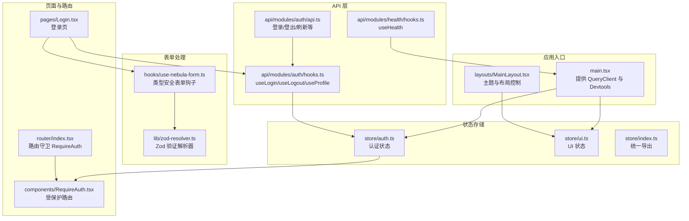
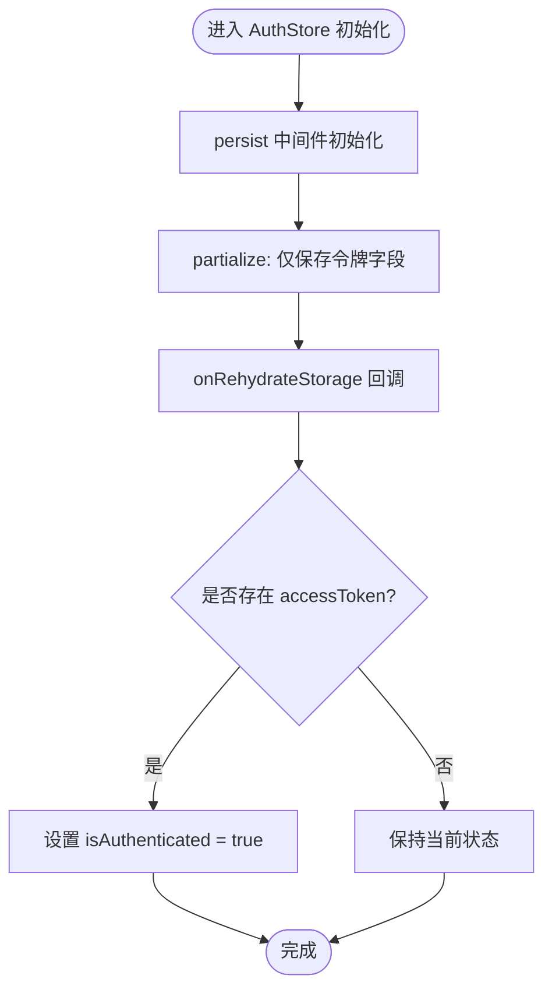
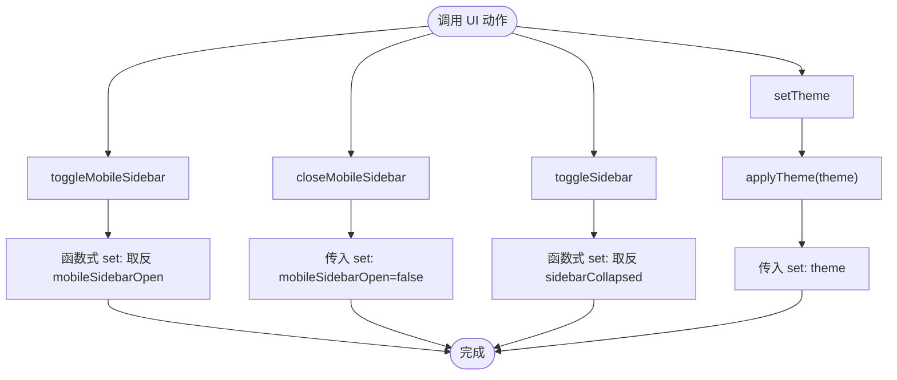
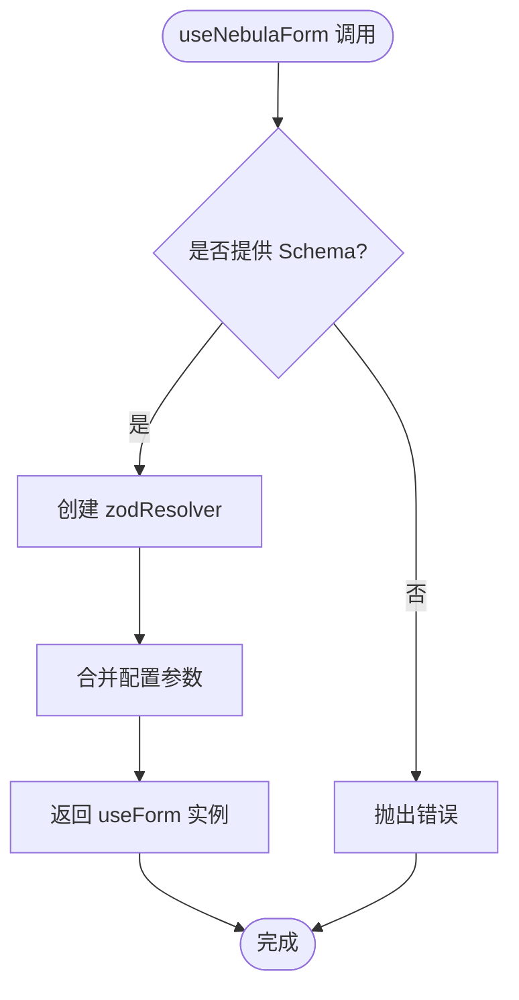
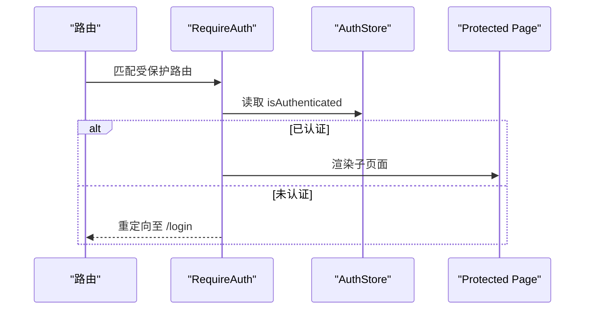
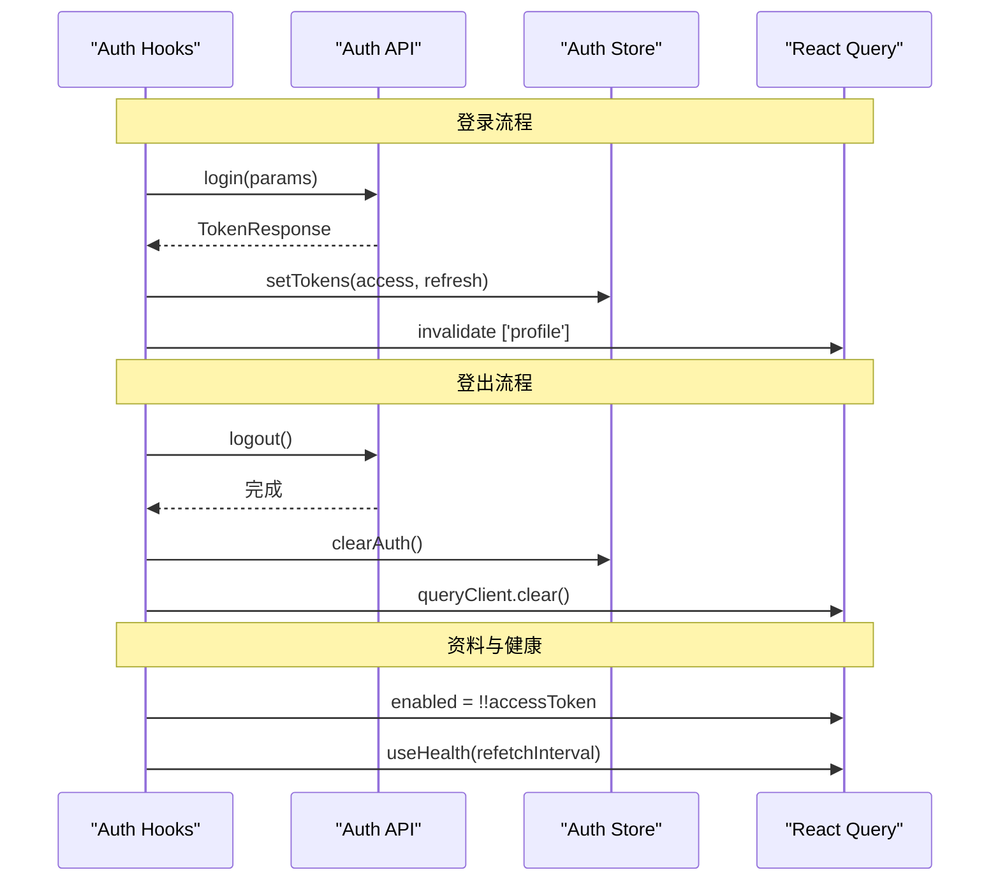
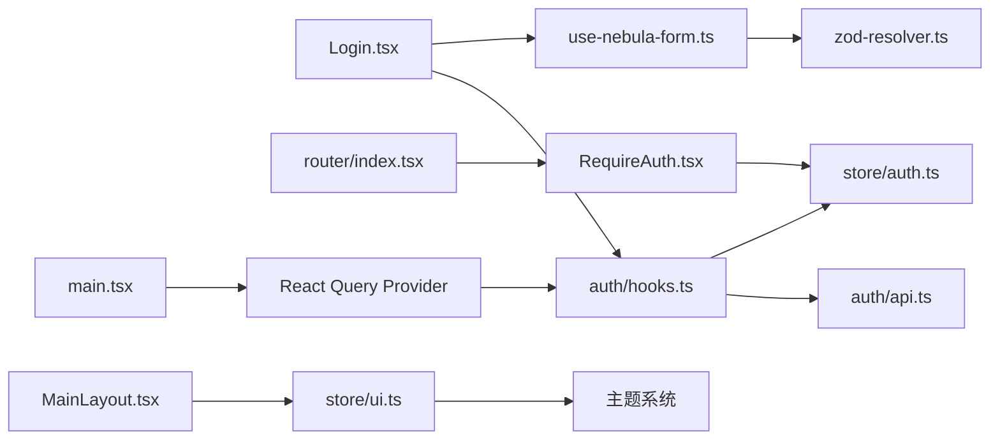

# 状态管理系统

<cite>
**本文档引用的文件**
- [apps/web/src/hooks/use-nebula-form.ts](file://apps/web/src/hooks/use-nebula-form.ts)
- [apps/web/src/lib/zod-resolver.ts](file://apps/web/src/lib/zod-resolver.ts)
- [apps/web/src/store/index.ts](file://apps/web/src/store/index.ts)
- [apps/web/src/store/auth.ts](file://apps/web/src/store/auth.ts)
- [apps/web/src/store/ui.ts](file://apps/web/src/store/ui.ts)
- [apps/web/src/main.tsx](file://apps/web/src/main.tsx)
- [apps/web/src/components/RequireAuth.tsx](file://apps/web/src/components/RequireAuth.tsx)
- [apps/web/src/pages/Login.tsx](file://apps/web/src/pages/Login.tsx)
- [apps/web/src/router/index.tsx](file://apps/web/src/router/index.tsx)
- [apps/web/src/api/modules/auth/hooks.ts](file://apps/web/src/api/modules/auth/hooks.ts)
- [apps/web/src/api/modules/auth/api.ts](file://apps/web/src/api/modules/auth/api.ts)
- [apps/web/src/api/modules/health/hooks.ts](file://apps/web/src/api/modules/health/hooks.ts)
- [apps/web/src/layouts/MainLayout.tsx](file://apps/web/src/layouts/MainLayout.tsx)
</cite>

## 更新摘要
**所做更改**
- 新增 useNebulaForm 钩子文档，介绍集中化表单配置、Zod 验证模式和默认值管理
- 增强 UI 状态管理章节，包含主题切换和响应式布局状态
- 更新表单验证架构，展示类型安全的表单处理流程
- 扩展状态持久化策略，涵盖主题偏好和侧边栏状态

## 目录

1. [简介](#简介)
2. [项目结构](#项目结构)
3. [核心组件](#核心组件)
4. [架构总览](#架构总览)
5. [详细组件分析](#详细组件分析)
6. [依赖关系分析](#依赖关系分析)
7. [性能考虑](#性能考虑)
8. [故障排查指南](#故障排查指南)
9. [结论](#结论)
10. [附录](#附录)

## 简介

本文件系统性梳理基于 Zustand 的前端状态管理方案，覆盖认证状态管理、UI 状态管理与全局状态设计模式。文档重点阐述：

- 状态模块组织：按领域拆分（认证、UI），通过统一入口导出
- 状态更新机制：使用 Zustand 原子更新与中间件（devtools、persist）
- 状态持久化策略：仅持久化必要字段，结合水合钩子恢复状态
- 订阅模式与异步处理：结合 React Query 在登录/登出时驱动状态变更
- 表单验证架构：useNebulaForm 钩子提供类型安全的表单配置和 Zod 验证
- 调试技巧与最佳实践：命名动作、限制持久化字段、避免过度渲染
- 性能优化建议：细粒度订阅、选择器隔离、查询缓存联动

## 项目结构

状态管理位于 Web 应用层，采用"按功能域划分"的模块化组织方式：

- store 层：定义独立的 Zustand 存储模块（认证、UI）
- hooks 层：提供自定义钩子，包括 useNebulaForm 表单处理
- api 层：封装后端接口与 React Query Hooks，负责异步副作用
- 页面与路由：通过 Hooks 触发异步请求，间接驱动状态更新
- 入口：应用根节点提供 QueryClient 上下文，支持调试工具



**图表来源**
- [apps/web/src/main.tsx:12-22](file://apps/web/src/main.tsx#L12-L22)
- [apps/web/src/layouts/MainLayout.tsx:30](file://apps/web/src/layouts/MainLayout.tsx#L30)
- [apps/web/src/store/index.ts:1-3](file://apps/web/src/store/index.ts#L1-L3)
- [apps/web/src/store/auth.ts:30-63](file://apps/web/src/store/auth.ts#L30-L63)
- [apps/web/src/store/ui.ts:20-42](file://apps/web/src/store/ui.ts#L20-L42)
- [apps/web/src/hooks/use-nebula-form.ts:16-30](file://apps/web/src/hooks/use-nebula-form.ts#L16-L30)
- [apps/web/src/lib/zod-resolver.ts:20-44](file://apps/web/src/lib/zod-resolver.ts#L20-L44)
- [apps/web/src/router/index.tsx:12-48](file://apps/web/src/router/index.tsx#L12-L48)
- [apps/web/src/components/RequireAuth.tsx:4-13](file://apps/web/src/components/RequireAuth.tsx#L4-L13)
- [apps/web/src/pages/Login.tsx:60-92](file://apps/web/src/pages/Login.tsx#L60-L92)
- [apps/web/src/api/modules/auth/hooks.ts:12-22](file://apps/web/src/api/modules/auth/hooks.ts#L12-L22)
- [apps/web/src/api/modules/auth/api.ts:28-30](file://apps/web/src/api/modules/auth/api.ts#L28-L30)
- [apps/web/src/api/modules/health/hooks.ts:4-9](file://apps/web/src/api/modules/health/hooks.ts#L4-L9)

**章节来源**
- [apps/web/src/main.tsx:12-22](file://apps/web/src/main.tsx#L12-L22)
- [apps/web/src/layouts/MainLayout.tsx:30](file://apps/web/src/layouts/MainLayout.tsx#L30)
- [apps/web/src/store/index.ts:1-3](file://apps/web/src/store/index.ts#L1-L3)
- [apps/web/src/store/auth.ts:30-63](file://apps/web/src/store/auth.ts#L30-L63)
- [apps/web/src/store/ui.ts:20-42](file://apps/web/src/store/ui.ts#L20-L42)
- [apps/web/src/hooks/use-nebula-form.ts:16-30](file://apps/web/src/hooks/use-nebula-form.ts#L16-L30)
- [apps/web/src/lib/zod-resolver.ts:20-44](file://apps/web/src/lib/zod-resolver.ts#L20-L44)
- [apps/web/src/router/index.tsx:12-48](file://apps/web/src/router/index.tsx#L12-L48)
- [apps/web/src/components/RequireAuth.tsx:4-13](file://apps/web/src/components/RequireAuth.tsx#L4-L13)
- [apps/web/src/pages/Login.tsx:60-92](file://apps/web/src/pages/Login.tsx#L60-L92)
- [apps/web/src/api/modules/auth/hooks.ts:12-22](file://apps/web/src/api/modules/auth/hooks.ts#L12-L22)
- [apps/web/src/api/modules/auth/api.ts:28-30](file://apps/web/src/api/modules/auth/api.ts#L28-L30)
- [apps/web/src/api/modules/health/hooks.ts:4-9](file://apps/web/src/api/modules/health/hooks.ts#L4-L9)

## 核心组件

- 认证状态模块（auth.ts）
  - 数据结构：令牌、用户信息、认证态标志
  - 动作：设置令牌、设置用户、清理认证
  - 中间件：devtools（命名动作）、persist（仅持久化令牌）
  - 水合逻辑：从存储恢复时根据令牌设置认证态
- UI 状态模块（ui.ts）
  - 数据结构：移动端侧边栏开关、侧边栏折叠状态、主题偏好
  - 动作：切换移动端侧边栏、关闭移动端侧边栏、切换侧边栏、设置主题
  - 中间件：devtools（命名动作）、persist（持久化主题和侧边栏状态）
  - 主题系统：支持 light/dark/system 三种主题模式，自动监听系统主题变化
- 表单处理钩子（use-nebula-form.ts）
  - 类型安全：基于 Zod Schema 自动推导表单类型
  - 集中配置：统一的表单配置和验证规则
  - 默认值管理：支持默认值设置和类型推导
- 统一导出（store/index.ts）
  - 将各模块导出为 useXxxStore 钩子，便于页面直接使用

**章节来源**
- [apps/web/src/store/auth.ts:5-18](file://apps/web/src/store/auth.ts#L5-L18)
- [apps/web/src/store/auth.ts:23-28](file://apps/web/src/store/auth.ts#L23-L28)
- [apps/web/src/store/auth.ts:30-63](file://apps/web/src/store/auth.ts#L30-L63)
- [apps/web/src/store/ui.ts:4-18](file://apps/web/src/store/ui.ts#L4-L18)
- [apps/web/src/store/ui.ts:20-42](file://apps/web/src/store/ui.ts#L20-L42)
- [apps/web/src/hooks/use-nebula-form.ts:5-15](file://apps/web/src/hooks/use-nebula-form.ts#L5-L15)
- [apps/web/src/hooks/use-nebula-form.ts:16-30](file://apps/web/src/hooks/use-nebula-form.ts#L16-L30)
- [apps/web/src/store/index.ts:1-3](file://apps/web/src/store/index.ts#L1-L3)

## 架构总览

Zustand 作为轻量状态容器，与 React Query 协同工作，新增表单验证架构：

- 登录成功后，Mutation 成功回调调用 Zustand 动作写入令牌并触发查询失效
- 页面组件通过 Hooks 触发异步请求，间接驱动状态更新
- 表单组件使用 useNebulaForm 提供类型安全的验证和默认值管理
- 路由守卫读取 Zustand 的认证态决定是否放行
- 开发阶段启用 devtools，生产环境可移除或禁用

```mermaid
sequenceDiagram
participant U as "用户"
participant L as "Login 页面"
participant F as "useNebulaForm 钩子"
participantr H as "Auth Hooks"
participant A as "Auth API"
participant S as "Auth Store"
participant Q as "React Query"
U->>L : 提交登录表单
L->>F : 创建类型安全表单
F-->>L : 返回验证后的表单实例
L->>H : 调用 useLogin()
H->>A : 调用 login(params)
A-->>H : 返回 TokenResponse
H->>S : 调用 setTokens(access, refresh)
H->>Q : 使 ['profile'] 查询失效
Q-->>L : 触发重新拉取用户资料
L-->>U : 跳转首页并显示内容
```

**图表来源**
- [apps/web/src/pages/Login.tsx:79-92](file://apps/web/src/pages/Login.tsx#L79-L92)
- [apps/web/src/hooks/use-nebula-form.ts:16-30](file://apps/web/src/hooks/use-nebula-form.ts#L16-L30)
- [apps/web/src/api/modules/auth/hooks.ts:12-22](file://apps/web/src/api/modules/auth/hooks.ts#L12-L22)
- [apps/web/src/api/modules/auth/api.ts:28-30](file://apps/web/src/api/modules/auth/api.ts#L28-L30)
- [apps/web/src/store/auth.ts:36-38](file://apps/web/src/store/auth.ts#L36-L38)

## 详细组件分析

### 认证状态模块（AuthStore）

- 设计要点
  - 将令牌与认证态解耦：仅持久化令牌，认证态在水合时根据令牌推导
  - 动作命名清晰，便于 devtools 调试
  - 清理认证时重置为初始数据，确保会话完全清除
- 状态更新流程
  - 登录成功：setTokens 写入令牌并标记已认证
  - 设置用户：setUser 写入用户信息
  - 登出：clearAuth 清空所有认证相关字段
- 持久化策略
  - 仅持久化 accessToken 与 refreshToken
  - 水合后若存在 accessToken，则设置 isAuthenticated 为真



**图表来源**
- [apps/web/src/store/auth.ts:48-59](file://apps/web/src/store/auth.ts#L48-L59)

**章节来源**
- [apps/web/src/store/auth.ts:30-63](file://apps/web/src/store/auth.ts#L30-L63)
- [apps/web/src/store/auth.ts:48-59](file://apps/web/src/store/auth.ts#L48-L59)

### UI 状态模块（UiStore）

- 设计要点
  - 专注 UI 行为：移动端侧边栏开关与桌面侧边栏折叠
  - 主题系统：支持 light/dark/system 三种主题模式
  - 响应式设计：自动监听系统主题变化
  - 使用函数式更新，避免不必要的对象重建
  - 动作命名直观，利于调试
- 更新机制
  - 切换类动作使用函数式 set，读取当前状态翻转目标字段
  - 关闭动作直接传入新值，减少计算
  - 主题切换时应用 CSS 类并禁用过渡动画
- 持久化策略
  - 仅持久化 theme 和 sidebarCollapsed 字段
  - 水合时应用之前保存的主题设置



**图表来源**
- [apps/web/src/store/ui.ts:26-38](file://apps/web/src/store/ui.ts#L26-L38)
- [apps/web/src/store/ui.ts:79-82](file://apps/web/src/store/ui.ts#L79-L82)

**章节来源**
- [apps/web/src/store/ui.ts:20-42](file://apps/web/src/store/ui.ts#L20-L42)
- [apps/web/src/store/ui.ts:79-96](file://apps/web/src/store/ui.ts#L79-L96)

### 表单处理架构（useNebulaForm）

- 设计要点
  - 类型安全：基于 Zod Schema 自动推导表单类型
  - 集中配置：统一的表单配置和验证规则
  - 默认值管理：支持默认值设置和类型推导
  - 兼容性：解决 React Hook Form 与 Zod 4 的类型兼容问题
- 实现机制
  - 接收 Zod Schema 和 React Hook Form 配置
  - 使用自定义 zodResolver 进行验证
  - 返回类型安全的 useForm 实例
  - 支持 handleSubmit、setError、clearErrors 等标准方法
- 使用示例
  - 在页面组件中导入 useNebulaForm
  - 传入 Zod Schema 和默认值配置
  - 通过返回的表单实例进行数据绑定和验证



**图表来源**
- [apps/web/src/hooks/use-nebula-form.ts:16-30](file://apps/web/src/hooks/use-nebula-form.ts#L16-L30)
- [apps/web/src/lib/zod-resolver.ts:20-44](file://apps/web/src/lib/zod-resolver.ts#L20-L44)

**章节来源**
- [apps/web/src/hooks/use-nebula-form.ts:5-15](file://apps/web/src/hooks/use-nebula-form.ts#L5-L15)
- [apps/web/src/hooks/use-nebula-form.ts:16-30](file://apps/web/src/hooks/use-nebula-form.ts#L16-L30)
- [apps/web/src/lib/zod-resolver.ts:15-44](file://apps/web/src/lib/zod-resolver.ts#L15-L44)

### 路由守卫与状态订阅

- 路由守卫
  - RequireAuth 读取认证态，未认证则跳转登录页
- 页面订阅
  - Login 页在挂载时检查是否存在 accessToken，存在则直接跳转首页
  - 登录成功后通过 Mutation 回调写入状态并触发查询失效
- 布局订阅
  - MainLayout 订阅主题和用户信息，实现动态主题切换和用户状态显示



**图表来源**
- [apps/web/src/router/index.tsx:12-48](file://apps/web/src/router/index.tsx#L12-L48)
- [apps/web/src/components/RequireAuth.tsx:4-13](file://apps/web/src/components/RequireAuth.tsx#L4-L13)
- [apps/web/src/store/auth.ts:54-57](file://apps/web/src/store/auth.ts#L54-L57)

**章节来源**
- [apps/web/src/router/index.tsx:12-48](file://apps/web/src/router/index.tsx#L12-L48)
- [apps/web/src/components/RequireAuth.tsx:4-13](file://apps/web/src/components/RequireAuth.tsx#L4-L13)
- [apps/web/src/pages/Login.tsx:68-72](file://apps/web/src/pages/Login.tsx#L68-L72)
- [apps/web/src/layouts/MainLayout.tsx:120-137](file://apps/web/src/layouts/MainLayout.tsx#L120-L137)

### 异步状态处理（登录/登出/资料）

- 登录
  - useLogin 返回 Mutation，成功回调调用 setTokens 并失效 ['profile'] 查询
- 登出
  - useLogout 返回 Mutation，settled 后调用 clearAuth 并清空查询缓存
- 用户资料
  - useProfile 条件启用：仅当 accessToken 存在时才发起请求
- 健康检查
  - useHealth 以轮询间隔刷新系统健康状态



**图表来源**
- [apps/web/src/api/modules/auth/hooks.ts:12-22](file://apps/web/src/api/modules/auth/hooks.ts#L12-L22)
- [apps/web/src/api/modules/auth/hooks.ts:30-39](file://apps/web/src/api/modules/auth/hooks.ts#L30-L39)
- [apps/web/src/api/modules/auth/hooks.ts:42-48](file://apps/web/src/api/modules/auth/hooks.ts#L42-L48)
- [apps/web/src/api/modules/auth/api.ts:28-30](file://apps/web/src/api/modules/auth/api.ts#L28-L30)
- [apps/web/src/api/modules/health/hooks.ts:4-9](file://apps/web/src/api/modules/health/hooks.ts#L4-L9)

**章节来源**
- [apps/web/src/api/modules/auth/hooks.ts:12-22](file://apps/web/src/api/modules/auth/hooks.ts#L12-L22)
- [apps/web/src/api/modules/auth/hooks.ts:30-39](file://apps/web/src/api/modules/auth/hooks.ts#L30-L39)
- [apps/web/src/api/modules/auth/hooks.ts:42-48](file://apps/web/src/api/modules/auth/hooks.ts#L42-L48)
- [apps/web/src/api/modules/auth/api.ts:28-30](file://apps/web/src/api/modules/auth/api.ts#L28-L30)
- [apps/web/src/api/modules/health/hooks.ts:4-9](file://apps/web/src/api/modules/health/hooks.ts#L4-L9)

## 依赖关系分析

- 组件耦合
  - 页面组件仅通过 Hooks 与状态交互，降低耦合
  - 路由守卫与状态模块弱耦合，仅读取认证态
  - 表单组件通过 useNebulaForm 钩子与验证系统解耦
- 外部依赖
  - Zustand：状态容器与中间件
  - React Query：异步数据流与缓存
  - React Hook Form：表单处理框架
  - Zod：类型安全验证库
  - React Router：路由与守卫
- 潜在风险
  - 若在非受控组件中直接读取 store，可能引发订阅不一致
  - 持久化字段过多会增加序列化开销
  - 表单验证类型推导可能影响构建性能



**图表来源**
- [apps/web/src/pages/Login.tsx:60-92](file://apps/web/src/pages/Login.tsx#L60-L92)
- [apps/web/src/hooks/use-nebula-form.ts:16-30](file://apps/web/src/hooks/use-nebula-form.ts#L16-L30)
- [apps/web/src/lib/zod-resolver.ts:20-44](file://apps/web/src/lib/zod-resolver.ts#L20-L44)
- [apps/web/src/api/modules/auth/hooks.ts:12-22](file://apps/web/src/api/modules/auth/hooks.ts#L12-L22)
- [apps/web/src/api/modules/auth/api.ts:28-30](file://apps/web/src/api/modules/auth/api.ts#L28-L30)
- [apps/web/src/store/auth.ts:30-63](file://apps/web/src/store/auth.ts#L30-L63)
- [apps/web/src/router/index.tsx:12-48](file://apps/web/src/router/index.tsx#L12-L48)
- [apps/web/src/components/RequireAuth.tsx:4-13](file://apps/web/src/components/RequireAuth.tsx#L4-L13)
- [apps/web/src/main.tsx:14-19](file://apps/web/src/main.tsx#L14-L19)
- [apps/web/src/layouts/MainLayout.tsx:30](file://apps/web/src/layouts/MainLayout.tsx#L30)
- [apps/web/src/store/ui.ts:79-96](file://apps/web/src/store/ui.ts#L79-L96)

**章节来源**
- [apps/web/src/pages/Login.tsx:60-92](file://apps/web/src/pages/Login.tsx#L60-L92)
- [apps/web/src/hooks/use-nebula-form.ts:16-30](file://apps/web/src/hooks/use-nebula-form.ts#L16-L30)
- [apps/web/src/lib/zod-resolver.ts:20-44](file://apps/web/src/lib/zod-resolver.ts#L20-L44)
- [apps/web/src/api/modules/auth/hooks.ts:12-22](file://apps/web/src/api/modules/auth/hooks.ts#L12-L22)
- [apps/web/src/api/modules/auth/api.ts:28-30](file://apps/web/src/api/modules/auth/api.ts#L28-L30)
- [apps/web/src/store/auth.ts:30-63](file://apps/web/src/store/auth.ts#L30-L63)
- [apps/web/src/router/index.tsx:12-48](file://apps/web/src/router/index.tsx#L12-L48)
- [apps/web/src/components/RequireAuth.tsx:4-13](file://apps/web/src/components/RequireAuth.tsx#L4-L13)
- [apps/web/src/main.tsx:14-19](file://apps/web/src/main.tsx#L14-L19)
- [apps/web/src/layouts/MainLayout.tsx:30](file://apps/web/src/layouts/MainLayout.tsx#L30)
- [apps/web/src/store/ui.ts:79-96](file://apps/web/src/store/ui.ts#L79-L96)

## 性能考虑

- 订阅粒度
  - 仅订阅所需字段，避免因无关状态变化导致重渲染
  - 对于复杂选择器，建议使用浅比较或 useMemo 缓存
  - 表单组件使用选择器订阅特定字段而非整个表单状态
- 持久化范围
  - 仅持久化必要字段，减少序列化与反序列化成本
  - 水合时进行最小化状态修复（如根据令牌设置认证态）
  - 主题和侧边栏状态持久化，提升用户体验连续性
- 查询联动
  - 登录成功后失效 ['profile'] 查询，避免陈旧数据
  - 登出后清空查询缓存，防止敏感数据残留
- 表单性能
  - 使用类型推导避免运行时类型检查开销
  - 自定义 resolver 减少第三方包依赖
  - 合理使用默认值，避免重复初始化
- 调试与开发体验
  - devtools 命名动作有助于定位状态变更来源
  - 表单验证错误信息结构化，便于调试
  - 生产环境可关闭 devtools 或限制日志级别

## 故障排查指南

- 登录后仍提示未登录
  - 检查登录 Mutation 是否调用了 setTokens
  - 确认路由守卫读取的是最新认证态
  - 参考路径：[apps/web/src/api/modules/auth/hooks.ts:17-20](file://apps/web/src/api/modules/auth/hooks.ts#L17-L20)，[apps/web/src/components/RequireAuth.tsx:6](file://apps/web/src/components/RequireAuth.tsx#L6)
- 登出后状态未清理
  - 确认登出 Mutation 的 settled 回调是否执行 clearAuth
  - 检查是否调用了 queryClient.clear()
  - 参考路径：[apps/web/src/api/modules/auth/hooks.ts:35-39](file://apps/web/src/api/modules/auth/hooks.ts#L35-L39)
- 无法加载用户资料
  - 确认 accessToken 是否存在且有效
  - 检查 useProfile 的 enabled 条件
  - 参考路径：[apps/web/src/api/modules/auth/hooks.ts:46](file://apps/web/src/api/modules/auth/hooks.ts#L46)
- UI 状态异常
  - 检查动作是否使用函数式 set 正确翻转状态
  - 确认主题切换时 CSS 类是否正确应用
  - 参考路径：[apps/web/src/store/ui.ts:26-38](file://apps/web/src/store/ui.ts#L26-L38)，[apps/web/src/store/ui.ts:79-82](file://apps/web/src/store/ui.ts#L79-L82)
- 表单验证问题
  - 检查 Zod Schema 是否正确配置
  - 确认 useNebulaForm 的配置参数
  - 验证默认值是否符合 Schema 类型
  - 参考路径：[apps/web/src/hooks/use-nebula-form.ts:16-30](file://apps/web/src/hooks/use-nebula-form.ts#L16-L30)，[apps/web/src/lib/zod-resolver.ts:20-44](file://apps/web/src/lib/zod-resolver.ts#L20-L44)
- 开发调试
  - 打开 React Query Devtools 与 Zustand Devtools，观察动作与状态变化
  - 检查表单验证错误信息的结构化输出
  - 参考路径：[apps/web/src/main.tsx:19](file://apps/web/src/main.tsx#L19)，[apps/web/src/store/auth.ts:61](file://apps/web/src/store/auth.ts#L61)

**章节来源**
- [apps/web/src/api/modules/auth/hooks.ts:17-20](file://apps/web/src/api/modules/auth/hooks.ts#L17-L20)
- [apps/web/src/components/RequireAuth.tsx:6](file://apps/web/src/components/RequireAuth.tsx#L6)
- [apps/web/src/api/modules/auth/hooks.ts:35-39](file://apps/web/src/api/modules/auth/hooks.ts#L35-L39)
- [apps/web/src/api/modules/auth/hooks.ts:46](file://apps/web/src/api/modules/auth/hooks.ts#L46)
- [apps/web/src/store/ui.ts:26-38](file://apps/web/src/store/ui.ts#L26-L38)
- [apps/web/src/store/ui.ts:79-82](file://apps/web/src/store/ui.ts#L79-L82)
- [apps/web/src/hooks/use-nebula-form.ts:16-30](file://apps/web/src/hooks/use-nebula-form.ts#L16-L30)
- [apps/web/src/lib/zod-resolver.ts:20-44](file://apps/web/src/lib/zod-resolver.ts#L20-L44)
- [apps/web/src/main.tsx:19](file://apps/web/src/main.tsx#L19)
- [apps/web/src/store/auth.ts:61](file://apps/web/src/store/auth.ts#L61)

## 结论

本状态管理方案以 Zustand 为核心，结合 React Query 实现"同步+异步"双通道的状态更新，新增表单验证架构提供类型安全的表单处理：

- 认证态通过令牌驱动，UI 态聚焦界面行为和主题管理
- 通过中间件与水合逻辑实现安全、可控的持久化
- useNebulaForm 钩子提供类型安全的表单配置和 Zod 验证
- 路由守卫与页面订阅形成闭环，保证用户体验一致性
- 建议在团队内统一动作命名、订阅粒度与调试规范，持续优化性能与可维护性。

## 附录

- 最佳实践清单
  - 动作命名：使用语义化名称，便于 devtools 追踪
  - 订阅策略：按需订阅，避免过度渲染
  - 持久化策略：最小化持久化字段，必要时在水合时修复状态
  - 异步联动：登录/登出与查询缓存联动，避免脏数据
  - 表单验证：使用 Zod Schema 提供类型安全的验证规则
  - 调试工具：开发期开启 devtools，生产期谨慎保留
- 参考文件索引
  - [apps/web/src/store/auth.ts](file://apps/web/src/store/auth.ts)
  - [apps/web/src/store/ui.ts](file://apps/web/src/store/ui.ts)
  - [apps/web/src/store/index.ts](file://apps/web/src/store/index.ts)
  - [apps/web/src/hooks/use-nebula-form.ts](file://apps/web/src/hooks/use-nebula-form.ts)
  - [apps/web/src/lib/zod-resolver.ts](file://apps/web/src/lib/zod-resolver.ts)
  - [apps/web/src/api/modules/auth/hooks.ts](file://apps/web/src/api/modules/auth/hooks.ts)
  - [apps/web/src/api/modules/auth/api.ts](file://apps/web/src/api/modules/auth/api.ts)
  - [apps/web/src/router/index.tsx](file://apps/web/src/router/index.tsx)
  - [apps/web/src/components/RequireAuth.tsx](file://apps/web/src/components/RequireAuth.tsx)
  - [apps/web/src/pages/Login.tsx](file://apps/web/src/pages/Login.tsx)
  - [apps/web/src/main.tsx](file://apps/web/src/main.tsx)
  - [apps/web/src/api/modules/health/hooks.ts](file://apps/web/src/api/modules/health/hooks.ts)
  - [apps/web/src/layouts/MainLayout.tsx](file://apps/web/src/layouts/MainLayout.tsx)