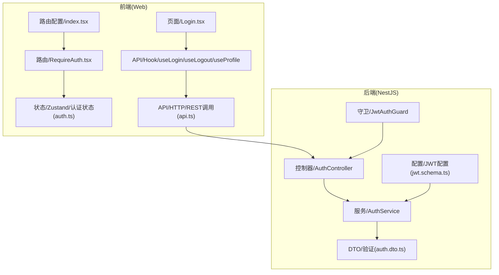
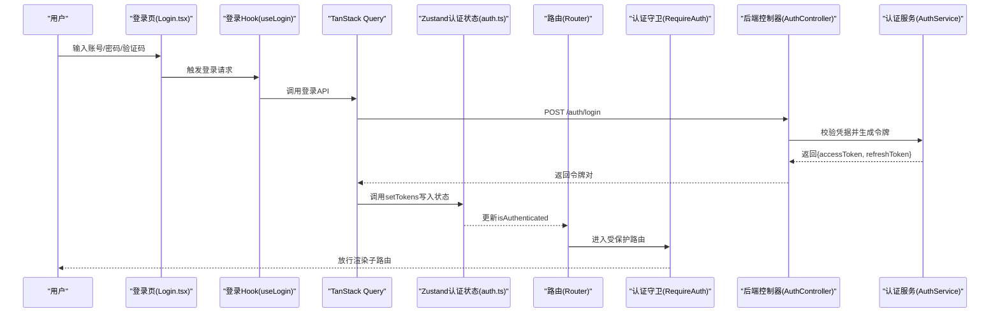
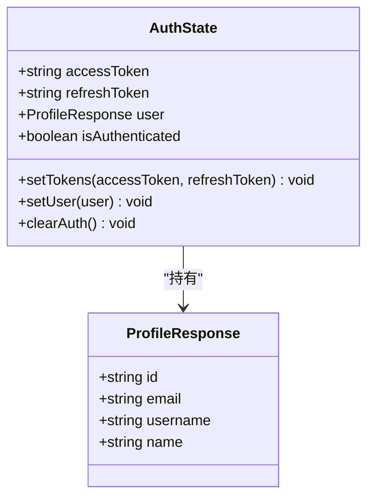
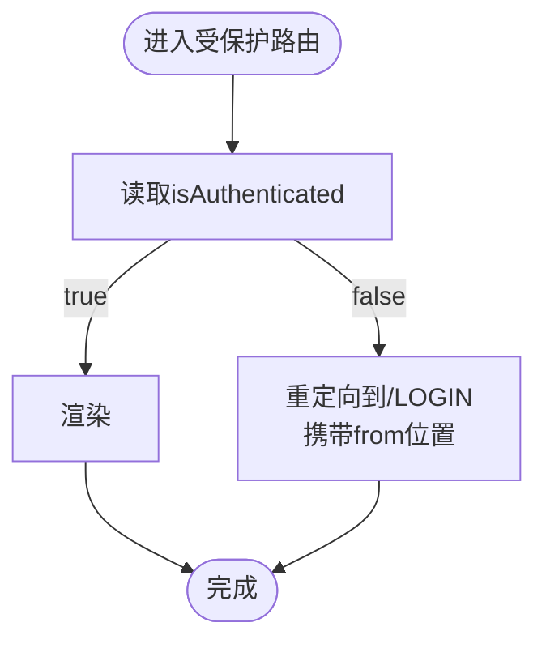
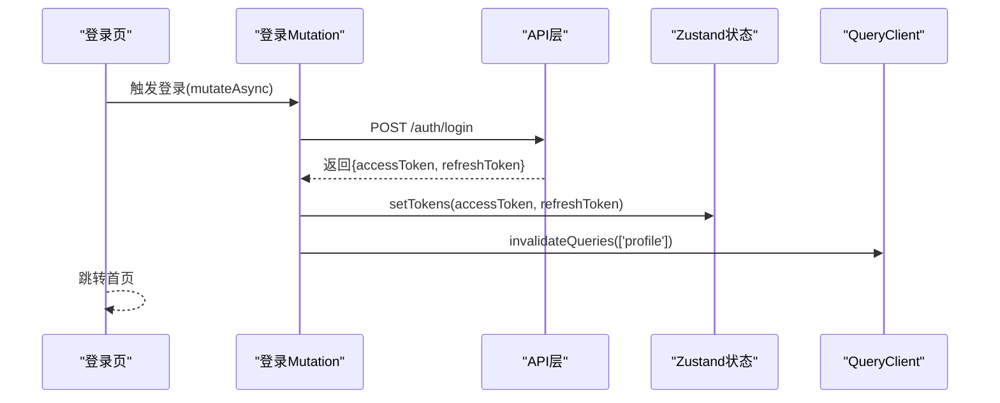
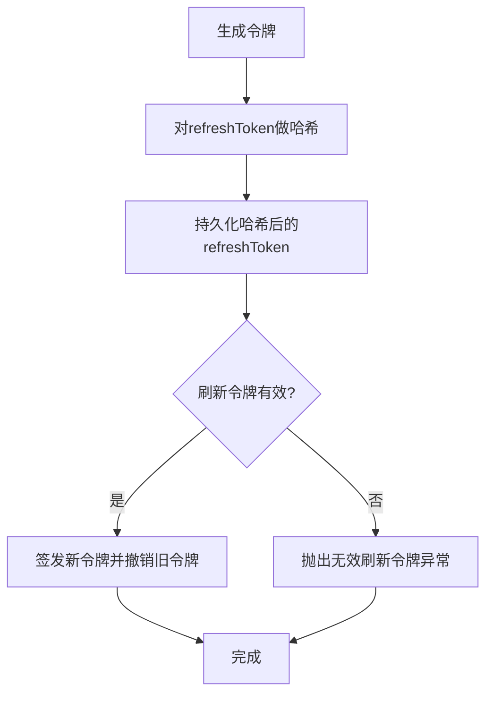
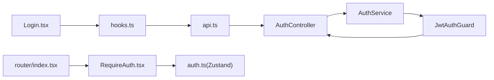

# 认证状态管理

<cite>
**本文引用的文件**
- [apps/web/src/store/auth.ts](file://apps/web/src/store/auth.ts)
- [apps/web/src/components/RequireAuth.tsx](file://apps/web/src/components/RequireAuth.tsx)
- [apps/web/src/router/index.tsx](file://apps/web/src/router/index.tsx)
- [apps/web/src/pages/Login.tsx](file://apps/web/src/pages/Login.tsx)
- [apps/web/src/api/modules/auth/hooks.ts](file://apps/web/src/api/modules/auth/hooks.ts)
- [apps/web/src/api/modules/auth/api.ts](file://apps/web/src/api/modules/auth/api.ts)
- [apps/nestjs-server/src/modules/auth/auth.service.ts](file://apps/nestjs-server/src/modules/auth/auth.service.ts)
- [apps/nestjs-server/src/modules/auth/auth.controller.ts](file://apps/nestjs-server/src/modules/auth/auth.controller.ts)
- [apps/nestjs-server/src/common/guards/jwt-auth.guard.ts](file://apps/nestjs-server/src/common/guards/jwt-auth.guard.ts)
- [apps/nestjs-server/src/modules/auth/dto/auth.dto.ts](file://apps/nestjs-server/src/modules/auth/dto/auth.dto.ts)
- [packages/shared/src/schemas/auth.schema.ts](file://packages/shared/src/schemas/auth.schema.ts)
- [apps/nestjs-server/src/config/schemas/jwt.schema.ts](file://apps/nestjs-server/src/config/schemas/jwt.schema.ts)
</cite>

## 目录

1. [简介](#简介)
2. [项目结构](#项目结构)
3. [核心组件](#核心组件)
4. [架构总览](#架构总览)
5. [详细组件分析](#详细组件分析)
6. [依赖关系分析](#依赖关系分析)
7. [性能考量](#性能考量)
8. [故障排查指南](#故障排查指南)
9. [结论](#结论)
10. [附录](#附录)

## 简介

本文件系统性阐述基于 Zustand 的前端认证状态管理方案，涵盖登录状态、JWT 令牌管理、用户信息存储与认证生命周期；详述初始化、更新机制与持久化策略；解释认证守卫组件与路由保护机制，以及认证状态的响应式更新方式。同时提供最佳实践、安全注意事项与常见问题解决方案。

## 项目结构

前端采用 React + Vite + TanStack Query + Zustand 构建，认证状态集中在应用内状态管理；后端采用 NestJS + Passport + JWT 提供认证服务；前后端通过共享的 Zod Schema 保证数据契约一致性。

图表来源

- [apps/web/src/pages/Login.tsx:1-221](file://apps/web/src/pages/Login.tsx#L1-L221)
- [apps/web/src/components/RequireAuth.tsx:1-14](file://apps/web/src/components/RequireAuth.tsx#L1-L14)
- [apps/web/src/router/index.tsx:1-51](file://apps/web/src/router/index.tsx#L1-L51)
- [apps/web/src/store/auth.ts:1-64](file://apps/web/src/store/auth.ts#L1-L64)
- [apps/web/src/api/modules/auth/hooks.ts:1-49](file://apps/web/src/api/modules/auth/hooks.ts#L1-L49)
- [apps/web/src/api/modules/auth/api.ts:1-45](file://apps/web/src/api/modules/auth/api.ts#L1-L45)
- [apps/nestjs-server/src/modules/auth/auth.controller.ts:1-115](file://apps/nestjs-server/src/modules/auth/auth.controller.ts#L1-L115)
- [apps/nestjs-server/src/modules/auth/auth.service.ts:1-151](file://apps/nestjs-server/src/modules/auth/auth.service.ts#L1-L151)
- [apps/nestjs-server/src/common/guards/jwt-auth.guard.ts:1-43](file://apps/nestjs-server/src/common/guards/jwt-auth.guard.ts#L1-L43)
- [apps/nestjs-server/src/modules/auth/dto/auth.dto.ts:1-30](file://apps/nestjs-server/src/modules/auth/dto/auth.dto.ts#L1-L30)
- [apps/nestjs-server/src/config/schemas/jwt.schema.ts:1-11](file://apps/nestjs-server/src/config/schemas/jwt.schema.ts#L1-L11)

章节来源

- [apps/web/src/store/auth.ts:1-64](file://apps/web/src/store/auth.ts#L1-L64)
- [apps/web/src/router/index.tsx:1-51](file://apps/web/src/router/index.tsx#L1-L51)
- [apps/nestjs-server/src/modules/auth/auth.controller.ts:1-115](file://apps/nestjs-server/src/modules/auth/auth.controller.ts#L1-L115)

## 核心组件

- 认证状态存储（Zustand）
  - 状态键：访问令牌、刷新令牌、用户资料、是否已认证
  - 动作：设置令牌、设置用户、清理认证
  - 持久化：仅持久化令牌，恢复时根据令牌置为已认证
- 认证守卫组件（RequireAuth）
  - 基于认证状态决定是否放行至受保护路由
- 登录页与API集成
  - 登录流程：获取验证码 -> 提交登录 -> 成功后写入状态并跳转
  - 登出流程：调用登出接口 -> 清理状态并清空查询缓存
- 后端认证服务
  - 生成访问/刷新令牌，校验刷新令牌，撤销用户所有刷新令牌
  - JWT 配置与 TTL 管理

章节来源

- [apps/web/src/store/auth.ts:1-64](file://apps/web/src/store/auth.ts#L1-L64)
- [apps/web/src/components/RequireAuth.tsx:1-14](file://apps/web/src/components/RequireAuth.tsx#L1-L14)
- [apps/web/src/pages/Login.tsx:1-221](file://apps/web/src/pages/Login.tsx#L1-L221)
- [apps/web/src/api/modules/auth/hooks.ts:1-49](file://apps/web/src/api/modules/auth/hooks.ts#L1-L49)
- [apps/nestjs-server/src/modules/auth/auth.service.ts:1-151](file://apps/nestjs-server/src/modules/auth/auth.service.ts#L1-L151)

## 架构总览

下图展示从前端状态到后端认证服务的整体交互路径，包括登录、令牌持久化、路由保护与用户资料获取。

图表来源

- [apps/web/src/pages/Login.tsx:60-92](file://apps/web/src/pages/Login.tsx#L60-L92)
- [apps/web/src/api/modules/auth/hooks.ts:12-22](file://apps/web/src/api/modules/auth/hooks.ts#L12-L22)
- [apps/web/src/store/auth.ts:30-63](file://apps/web/src/store/auth.ts#L30-L63)
- [apps/web/src/router/index.tsx:12-47](file://apps/web/src/router/index.tsx#L12-L47)
- [apps/web/src/components/RequireAuth.tsx:4-13](file://apps/web/src/components/RequireAuth.tsx#L4-L13)
- [apps/nestjs-server/src/modules/auth/auth.controller.ts:63-76](file://apps/nestjs-server/src/modules/auth/auth.controller.ts#L63-L76)
- [apps/nestjs-server/src/modules/auth/auth.service.ts:29-37](file://apps/nestjs-server/src/modules/auth/auth.service.ts#L29-L37)

## 详细组件分析

### Zustand 认证状态设计

- 数据模型
  - 字段：访问令牌、刷新令牌、用户资料、是否已认证
  - 初始化：全部为空/未认证
- 动作
  - 设置令牌：写入两个令牌并标记为已认证
  - 设置用户：写入用户资料
  - 清理认证：重置为初始状态
- 持久化策略
  - 仅持久化令牌字段，避免持久化敏感用户数据
  - 恢复时若存在访问令牌则置为已认证
- 开发工具
  - 使用 devtools 中间件便于调试

图表来源

- [apps/web/src/store/auth.ts:6-21](file://apps/web/src/store/auth.ts#L6-L21)
- [packages/shared/src/schemas/auth.schema.ts:48-53](file://packages/shared/src/schemas/auth.schema.ts#L48-L53)

章节来源

- [apps/web/src/store/auth.ts:1-64](file://apps/web/src/store/auth.ts#L1-L64)
- [packages/shared/src/schemas/auth.schema.ts:1-61](file://packages/shared/src/schemas/auth.schema.ts#L1-L61)

### 认证守卫与路由保护

- RequireAuth 组件
  - 读取认证状态中的已认证标志
  - 未认证则重定向至登录页，并携带来源位置
  - 已认证则渲染子路由
- 路由配置
  - 受保护的根路由组包裹 RequireAuth
  - 子路由按需渲染仪表盘、用户列表等页面

图表来源

- [apps/web/src/components/RequireAuth.tsx:4-13](file://apps/web/src/components/RequireAuth.tsx#L4-L13)
- [apps/web/src/router/index.tsx:12-47](file://apps/web/src/router/index.tsx#L12-L47)

章节来源

- [apps/web/src/components/RequireAuth.tsx:1-14](file://apps/web/src/components/RequireAuth.tsx#L1-L14)
- [apps/web/src/router/index.tsx:1-51](file://apps/web/src/router/index.tsx#L1-L51)

### 登录流程与状态更新

- 登录页
  - 获取验证码并支持刷新
  - 提交登录参数（账号、密码、验证码ID、验证码）
  - 登录成功后跳转首页
- 登录 Hook
  - 调用登录 API
  - 成功回调中写入令牌到 Zustand
  - 使用户资料查询失效以触发后续拉取
- 登出 Hook
  - 调用登出 API
  - 成功回调中清理 Zustand 状态并清空查询缓存

图表来源

- [apps/web/src/pages/Login.tsx:79-92](file://apps/web/src/pages/Login.tsx#L79-L92)
- [apps/web/src/api/modules/auth/hooks.ts:12-22](file://apps/web/src/api/modules/auth/hooks.ts#L12-L22)
- [apps/web/src/store/auth.ts:36-38](file://apps/web/src/store/auth.ts#L36-L38)

章节来源

- [apps/web/src/pages/Login.tsx:1-221](file://apps/web/src/pages/Login.tsx#L1-L221)
- [apps/web/src/api/modules/auth/hooks.ts:1-49](file://apps/web/src/api/modules/auth/hooks.ts#L1-L49)

### 用户资料与认证守卫联动

- 用户资料查询
  - 查询键为固定值，启用条件为存在访问令牌
  - 登录成功后通过查询失效触发拉取
- 守卫联动
  - RequireAuth 依赖 isAuthenticate 标志
  - 登录成功后状态变为已认证，守卫放行

章节来源

- [apps/web/src/api/modules/auth/hooks.ts:42-48](file://apps/web/src/api/modules/auth/hooks.ts#L42-L48)
- [apps/web/src/components/RequireAuth.tsx:4-13](file://apps/web/src/components/RequireAuth.tsx#L4-L13)

### 后端认证服务与JWT配置

- 令牌生成
  - 生成访问令牌与刷新令牌，分别使用不同密钥与TTL
  - 将刷新令牌进行哈希后持久化，便于校验与撤销
- 刷新与撤销
  - 刷新接口校验哈希后的刷新令牌有效性，撤销旧令牌并发放新令牌
  - 退出登录接口撤销指定用户的所有未撤销刷新令牌
- 守卫与控制器
  - JwtAuthGuard 在非公开接口中强制鉴权
  - 控制器暴露验证码、注册、登录、刷新、登出、用户资料等接口

图表来源

- [apps/nestjs-server/src/modules/auth/auth.service.ts:105-142](file://apps/nestjs-server/src/modules/auth/auth.service.ts#L105-L142)
- [apps/nestjs-server/src/modules/auth/auth.service.ts:64-84](file://apps/nestjs-server/src/modules/auth/auth.service.ts#L64-L84)
- [apps/nestjs-server/src/modules/auth/auth.controller.ts:78-89](file://apps/nestjs-server/src/modules/auth/auth.controller.ts#L78-L89)

章节来源

- [apps/nestjs-server/src/modules/auth/auth.service.ts:1-151](file://apps/nestjs-server/src/modules/auth/auth.service.ts#L1-L151)
- [apps/nestjs-server/src/common/guards/jwt-auth.guard.ts:1-43](file://apps/nestjs-server/src/common/guards/jwt-auth.guard.ts#L1-L43)
- [apps/nestjs-server/src/modules/auth/auth.controller.ts:1-115](file://apps/nestjs-server/src/modules/auth/auth.controller.ts#L1-L115)

## 依赖关系分析

- 前端
  - 页面依赖 Hook 与状态；Hook 依赖 API 层；API 层依赖后端 REST 接口
  - 路由配置依赖守卫；守卫依赖状态
- 后端
  - 控制器依赖服务；服务依赖 JWT 服务、Prisma、配置与 DTO
  - 守卫依赖 Passport 与反射器，统一处理鉴权失败

图表来源

- [apps/web/src/pages/Login.tsx:1-221](file://apps/web/src/pages/Login.tsx#L1-L221)
- [apps/web/src/api/modules/auth/hooks.ts:1-49](file://apps/web/src/api/modules/auth/hooks.ts#L1-L49)
- [apps/web/src/api/modules/auth/api.ts:1-45](file://apps/web/src/api/modules/auth/api.ts#L1-L45)
- [apps/nestjs-server/src/modules/auth/auth.controller.ts:1-115](file://apps/nestjs-server/src/modules/auth/auth.controller.ts#L1-L115)
- [apps/nestjs-server/src/modules/auth/auth.service.ts:1-151](file://apps/nestjs-server/src/modules/auth/auth.service.ts#L1-L151)
- [apps/nestjs-server/src/common/guards/jwt-auth.guard.ts:1-43](file://apps/nestjs-server/src/common/guards/jwt-auth.guard.ts#L1-L43)
- [apps/web/src/router/index.tsx:1-51](file://apps/web/src/router/index.tsx#L1-L51)
- [apps/web/src/components/RequireAuth.tsx:1-14](file://apps/web/src/components/RequireAuth.tsx#L1-L14)
- [apps/web/src/store/auth.ts:1-64](file://apps/web/src/store/auth.ts#L1-L64)

章节来源

- [apps/web/src/store/auth.ts:1-64](file://apps/web/src/store/auth.ts#L1-L64)
- [apps/web/src/router/index.tsx:1-51](file://apps/web/src/router/index.tsx#L1-L51)
- [apps/nestjs-server/src/modules/auth/auth.controller.ts:1-115](file://apps/nestjs-server/src/modules/auth/auth.controller.ts#L1-L115)

## 性能考量

- 状态粒度
  - 将用户资料与令牌分离存储，避免在高频更新时触发不必要的渲染
- 查询缓存
  - 使用 QueryClient 管理查询缓存，登录成功后失效用户资料查询，确保数据一致性
- 持久化范围
  - 仅持久化令牌，减少本地存储体积与风险
- 并发优化
  - 令牌生成使用并发签名，缩短响应时间

## 故障排查指南

- 登录后仍被重定向到登录页
  - 检查登录成功回调是否调用了写入令牌的动作
  - 确认路由守卫读取的状态标志是否已更新
- 用户资料未加载
  - 确认访问令牌存在且查询启用条件满足
  - 检查登录成功后是否触发了查询失效
- 刷新令牌无效
  - 检查后端是否撤销旧令牌并正确持久化新令牌
  - 核对 JWT 密钥与 TTL 配置
- 退出登录后仍可访问
  - 确认后端已撤销用户所有刷新令牌
  - 前端是否清理了状态并清空查询缓存

章节来源

- [apps/web/src/api/modules/auth/hooks.ts:12-22](file://apps/web/src/api/modules/auth/hooks.ts#L12-L22)
- [apps/web/src/api/modules/auth/hooks.ts:30-39](file://apps/web/src/api/modules/auth/hooks.ts#L30-L39)
- [apps/nestjs-server/src/modules/auth/auth.service.ts:64-84](file://apps/nestjs-server/src/modules/auth/auth.service.ts#L64-L84)

## 结论

本方案以 Zustand 管理前端认证状态，结合 RequireAuth 实现路由级保护；登录流程通过 TanStack Query 与后端 REST 接口协同，实现令牌写入与用户资料拉取；后端以 NestJS + Passport + JWT 提供强健的认证能力，并通过 DTO 与配置保障安全性与可维护性。整体设计简洁、边界清晰、易于扩展与维护。

## 附录

### 最佳实践

- 令牌安全
  - 仅持久化令牌，不持久化用户资料
  - 使用 HTTPS 传输，严格管理 JWT 密钥
- 状态管理
  - 将用户资料与令牌解耦，避免状态膨胀
  - 使用查询失效策略保持数据一致性
- 路由保护
  - 对非公开接口统一使用守卫
  - 明确登录态变更点，确保守卫逻辑及时生效

### 安全考虑

- 前端
  - 不在本地存储中保存敏感用户信息
  - 严格校验与序列化输入输出
- 后端
  - 刷新令牌哈希存储，支持撤销
  - 严格的 DTO 校验与错误码规范
  - 审计与限流策略

### 常见问题

- 登录成功但页面未跳转
  - 检查登录回调中的导航逻辑
- 刷新令牌后仍提示未授权
  - 确认前端已写入新令牌并更新请求头
- 多标签页登录冲突
  - 建议在其他标签页监听 storage 事件同步状态
