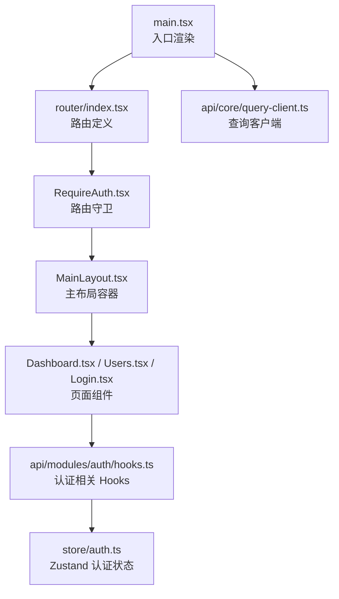
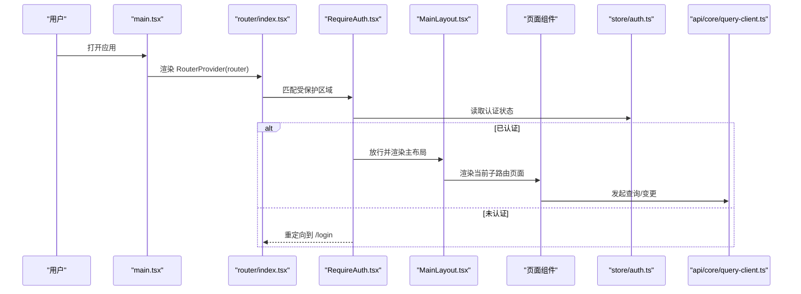
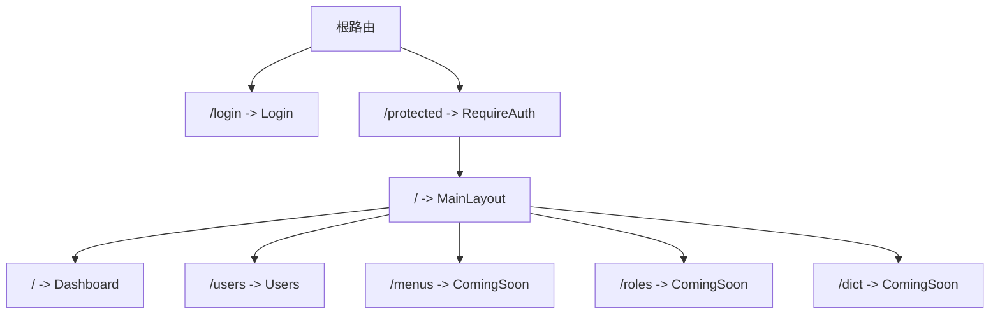
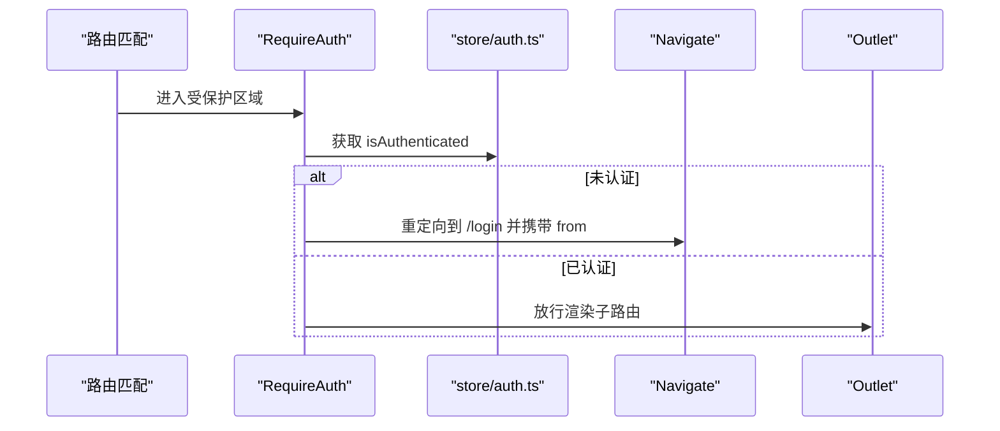
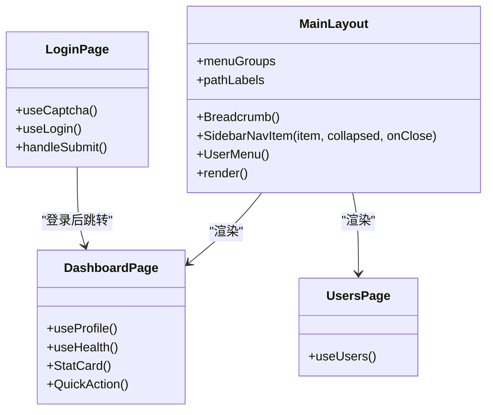
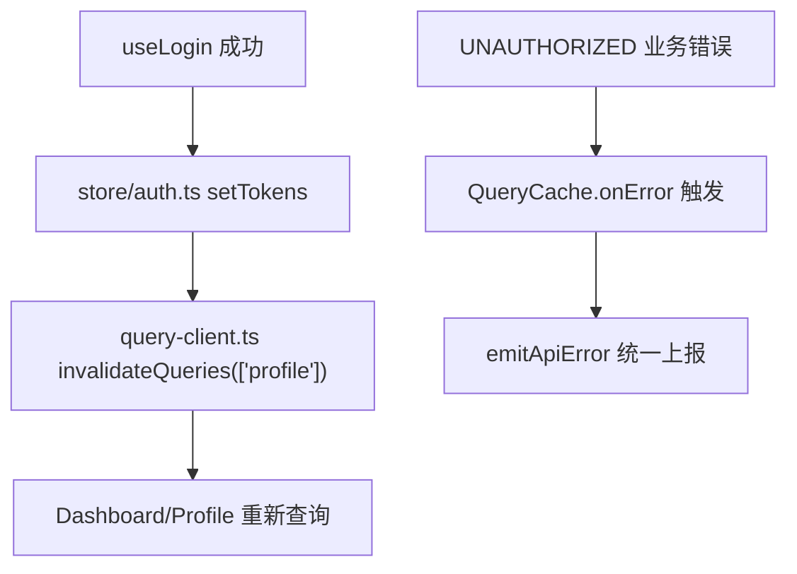
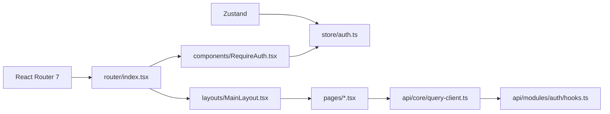

# 路由导航

<cite>
**本文引用的文件**
- [apps/web/src/router/index.tsx](file://apps/web/src/router/index.tsx)
- [apps/web/src/main.tsx](file://apps/web/src/main.tsx)
- [apps/web/src/layouts/MainLayout.tsx](file://apps/web/src/layouts/MainLayout.tsx)
- [apps/web/src/components/RequireAuth.tsx](file://apps/web/src/components/RequireAuth.tsx)
- [apps/web/src/pages/Dashboard.tsx](file://apps/web/src/pages/Dashboard.tsx)
- [apps/web/src/pages/Login.tsx](file://apps/web/src/pages/Login.tsx)
- [apps/web/src/pages/Users.tsx](file://apps/web/src/pages/Users.tsx)
- [apps/web/src/store/auth.ts](file://apps/web/src/store/auth.ts)
- [apps/web/src/api/modules/auth/hooks.ts](file://apps/web/src/api/modules/auth/hooks.ts)
- [apps/web/src/api/core/query-client.ts](file://apps/web/src/api/core/query-client.ts)
</cite>

## 目录

1. [简介](#简介)
2. [项目结构](#项目结构)
3. [核心组件](#核心组件)
4. [架构总览](#架构总览)
5. [详细组件分析](#详细组件分析)
6. [依赖关系分析](#依赖关系分析)
7. [性能考量](#性能考量)
8. [故障排查指南](#故障排查指南)
9. [结论](#结论)
10. [附录](#附录)

## 简介

本文件系统性梳理基于 React Router 7 的前端路由导航体系，覆盖路由配置、嵌套路由、路由守卫与权限控制、导航保护策略、页面组件设计、懒加载与导航优化等主题。通过源码级分析，帮助开发者在不直接阅读代码的前提下理解整体架构与实现要点。

## 项目结构

前端应用采用单页应用（SPA）架构，使用 React Router 7 的 createBrowserRouter 构建路由表；全局状态通过 Zustand 管理认证信息；数据请求与缓存通过 TanStack React Query 统一处理；UI 布局由主布局组件承载，内部通过 Outlet 渲染子路由内容。

图表来源

- [apps/web/src/main.tsx:1-23](file://apps/web/src/main.tsx#L1-L23)
- [apps/web/src/router/index.tsx:12-48](file://apps/web/src/router/index.tsx#L12-L48)
- [apps/web/src/components/RequireAuth.tsx:4-13](file://apps/web/src/components/RequireAuth.tsx#L4-L13)
- [apps/web/src/layouts/MainLayout.tsx:172-316](file://apps/web/src/layouts/MainLayout.tsx#L172-L316)
- [apps/web/src/api/core/query-client.ts:5-31](file://apps/web/src/api/core/query-client.ts#L5-L31)
- [apps/web/src/api/modules/auth/hooks.ts:12-22](file://apps/web/src/api/modules/auth/hooks.ts#L12-L22)
- [apps/web/src/store/auth.ts:30-63](file://apps/web/src/store/auth.ts#L30-L63)

章节来源

- [apps/web/src/main.tsx:1-23](file://apps/web/src/main.tsx#L1-L23)
- [apps/web/src/router/index.tsx:12-48](file://apps/web/src/router/index.tsx#L12-L48)

## 核心组件

- 路由定义与嵌套路由
  - 使用 createBrowserRouter 定义根路由，登录路由直连；受保护路由通过 RequireAuth 包裹形成“受保护区域”，其下为 MainLayout 主布局，再内嵌多个子路由（仪表盘、用户管理、待开发模块等）。
  - 子路由采用路径前缀组织，支持 index 路由作为默认子路由。
- 路由守卫与权限控制
  - RequireAuth 读取认证状态，未认证则重定向至登录页并携带来源地址，认证后放行。
- 页面组件与布局
  - MainLayout 提供侧边栏导航、面包屑、头部用户菜单与 Outlet 内容区；Dashboard 与 Users 展示不同业务视图。
- 全局状态与数据流
  - Zustand 管理令牌与用户信息；React Query 统一处理查询与变更，错误统一上报。

章节来源

- [apps/web/src/router/index.tsx:12-48](file://apps/web/src/router/index.tsx#L12-L48)
- [apps/web/src/components/RequireAuth.tsx:4-13](file://apps/web/src/components/RequireAuth.tsx#L4-L13)
- [apps/web/src/layouts/MainLayout.tsx:32-72](file://apps/web/src/layouts/MainLayout.tsx#L32-L72)
- [apps/web/src/store/auth.ts:30-63](file://apps/web/src/store/auth.ts#L30-L63)
- [apps/web/src/api/core/query-client.ts:5-31](file://apps/web/src/api/core/query-client.ts#L5-L31)

## 架构总览

下图展示从入口到页面渲染的关键调用链路，以及路由守卫与状态管理的交互。

图表来源

- [apps/web/src/main.tsx:9-19](file://apps/web/src/main.tsx#L9-L19)
- [apps/web/src/router/index.tsx:12-48](file://apps/web/src/router/index.tsx#L12-L48)
- [apps/web/src/components/RequireAuth.tsx:4-13](file://apps/web/src/components/RequireAuth.tsx#L4-L13)
- [apps/web/src/layouts/MainLayout.tsx:172-316](file://apps/web/src/layouts/MainLayout.tsx#L172-L316)
- [apps/web/src/store/auth.ts:30-63](file://apps/web/src/store/auth.ts#L30-L63)
- [apps/web/src/api/core/query-client.ts:5-31](file://apps/web/src/api/core/query-client.ts#L5-L31)

## 详细组件分析

### 路由配置与嵌套路由

- 路由表结构
  - 登录路由直连 LoginPage。
  - 受保护区域：RequireAuth -> MainLayout -> Dashboard、Users、待开发模块（ComingSoonPage）。
  - index 路由用于根路径下的默认页面。
- 嵌套路由要点
  - 通过 children 数组组织层级关系，便于共享布局与权限控制。
  - 子路由 path 以相对路径书写，结合父级布局形成统一导航体验。
- 动态路由与参数
  - 当前路由未使用动态段（如 :id），若需动态路由，可在 path 中添加占位符并在目标组件中通过 useRouteParams 或类似方式读取。

图表来源

- [apps/web/src/router/index.tsx:12-48](file://apps/web/src/router/index.tsx#L12-L48)

章节来源

- [apps/web/src/router/index.tsx:12-48](file://apps/web/src/router/index.tsx#L12-L48)

### 路由守卫与导航保护

- 实现机制
  - RequireAuth 读取认证状态，未认证时重定向到登录页并携带来源位置，认证后渲染 Outlet。
- 导航保护策略
  - 将需要保护的路由置于 RequireAuth 下方，确保所有子路由均受保护。
  - 登录成功后可依据来源地址进行回跳，提升用户体验。
- 权限控制扩展
  - 可在 RequireAuth 中增加角色校验逻辑，按需拒绝无权访问的路由。

图表来源

- [apps/web/src/components/RequireAuth.tsx:4-13](file://apps/web/src/components/RequireAuth.tsx#L4-L13)
- [apps/web/src/store/auth.ts:30-63](file://apps/web/src/store/auth.ts#L30-L63)

章节来源

- [apps/web/src/components/RequireAuth.tsx:4-13](file://apps/web/src/components/RequireAuth.tsx#L4-L13)
- [apps/web/src/store/auth.ts:30-63](file://apps/web/src/store/auth.ts#L30-L63)

### 页面组件设计与布局

- 主布局 MainLayout
  - 提供侧边栏导航、面包屑、头部用户菜单与内容区 Outlet。
  - 通过 useLocation 与 pathLabels 映射生成面包屑，增强导航可发现性。
- 页面组件
  - Dashboard：展示统计卡片、服务状态与快速操作，使用 React Query 获取用户与健康状态数据。
  - Users：展示用户列表，包含加载与错误处理。
  - Login：登录表单，集成验证码加载、刷新与提交流程，登录成功后跳转首页。

图表来源

- [apps/web/src/layouts/MainLayout.tsx:32-72](file://apps/web/src/layouts/MainLayout.tsx#L32-L72)
- [apps/web/src/pages/Dashboard.tsx:81-196](file://apps/web/src/pages/Dashboard.tsx#L81-L196)
- [apps/web/src/pages/Users.tsx:6-33](file://apps/web/src/pages/Users.tsx#L6-L33)
- [apps/web/src/pages/Login.tsx:60-220](file://apps/web/src/pages/Login.tsx#L60-L220)

章节来源

- [apps/web/src/layouts/MainLayout.tsx:32-72](file://apps/web/src/layouts/MainLayout.tsx#L32-L72)
- [apps/web/src/pages/Dashboard.tsx:81-196](file://apps/web/src/pages/Dashboard.tsx#L81-L196)
- [apps/web/src/pages/Users.tsx:6-33](file://apps/web/src/pages/Users.tsx#L6-L33)
- [apps/web/src/pages/Login.tsx:60-220](file://apps/web/src/pages/Login.tsx#L60-L220)

### 数据流与状态管理

- 认证状态
  - Zustand store 管理 accessToken、refreshToken、user 与 isAuthenticated；持久化仅保留令牌字段，避免敏感信息泄露。
- 查询与变更
  - React Query 提供查询缓存、重试与错误处理；登录成功后失效 profile 查询，触发重新拉取用户资料。
- 错误处理
  - QueryClient 在查询与变更失败时统一上报错误，便于集中处理网络异常与业务错误。

图表来源

- [apps/web/src/api/modules/auth/hooks.ts:12-22](file://apps/web/src/api/modules/auth/hooks.ts#L12-L22)
- [apps/web/src/store/auth.ts:36-46](file://apps/web/src/store/auth.ts#L36-L46)
- [apps/web/src/api/core/query-client.ts:5-31](file://apps/web/src/api/core/query-client.ts#L5-L31)

章节来源

- [apps/web/src/store/auth.ts:30-63](file://apps/web/src/store/auth.ts#L30-L63)
- [apps/web/src/api/modules/auth/hooks.ts:12-22](file://apps/web/src/api/modules/auth/hooks.ts#L12-L22)
- [apps/web/src/api/core/query-client.ts:5-31](file://apps/web/src/api/core/query-client.ts#L5-L31)

## 依赖关系分析

- 组件耦合
  - 路由层与页面层解耦，通过 Outlet 渲染；布局层与页面层解耦，通过路由配置组织。
  - RequireAuth 仅依赖认证状态，不直接关心具体页面。
- 外部依赖
  - React Router 7：路由定义与导航能力。
  - Zustand：轻量状态管理，持久化存储令牌。
  - TanStack React Query：统一数据获取与缓存策略。

图表来源

- [apps/web/src/router/index.tsx:12-48](file://apps/web/src/router/index.tsx#L12-L48)
- [apps/web/src/components/RequireAuth.tsx:4-13](file://apps/web/src/components/RequireAuth.tsx#L4-L13)
- [apps/web/src/layouts/MainLayout.tsx:172-316](file://apps/web/src/layouts/MainLayout.tsx#L172-L316)
- [apps/web/src/store/auth.ts:30-63](file://apps/web/src/store/auth.ts#L30-L63)
- [apps/web/src/api/core/query-client.ts:5-31](file://apps/web/src/api/core/query-client.ts#L5-L31)
- [apps/web/src/api/modules/auth/hooks.ts:12-22](file://apps/web/src/api/modules/auth/hooks.ts#L12-L22)

章节来源

- [apps/web/src/router/index.tsx:12-48](file://apps/web/src/router/index.tsx#L12-L48)
- [apps/web/src/components/RequireAuth.tsx:4-13](file://apps/web/src/components/RequireAuth.tsx#L4-L13)
- [apps/web/src/layouts/MainLayout.tsx:172-316](file://apps/web/src/layouts/MainLayout.tsx#L172-L316)
- [apps/web/src/store/auth.ts:30-63](file://apps/web/src/store/auth.ts#L30-L63)
- [apps/web/src/api/core/query-client.ts:5-31](file://apps/web/src/api/core/query-client.ts#L5-L31)
- [apps/web/src/api/modules/auth/hooks.ts:12-22](file://apps/web/src/api/modules/auth/hooks.ts#L12-L22)

## 性能考量

- 缓存与重试
  - 查询默认缓存 30 秒，窗口聚焦时不自动刷新，减少无效请求。
  - 业务错误且为未授权时禁止重试，避免重复失败。
- 懒加载建议
  - 对大型页面组件可采用 React.lazy 与 Suspense 实现按需加载，降低首屏体积。
  - 结合 React Router 的懒加载语法，将大组件拆分到独立模块。
- 导航优化
  - 使用相对路径与 index 路由简化导航逻辑。
  - 在布局中预取必要数据，缩短首次渲染等待时间。

## 故障排查指南

- 登录后无法进入受保护页面
  - 检查 RequireAuth 是否正确包裹受保护区域。
  - 确认 store 中已写入令牌并标记为已认证。
- 登录成功但未跳转首页
  - 确认登录 mutation 的 onSuccess 回调是否执行 setTokens。
  - 检查 queryClient 是否正确失效 profile 查询。
- 面包屑不显示或显示错误
  - 确认 pathLabels 中是否存在对应路径映射。
- 业务错误未提示
  - 检查 QueryClient 的 onError 是否被触发并上报。

章节来源

- [apps/web/src/components/RequireAuth.tsx:4-13](file://apps/web/src/components/RequireAuth.tsx#L4-L13)
- [apps/web/src/store/auth.ts:36-46](file://apps/web/src/store/auth.ts#L36-L46)
- [apps/web/src/api/core/query-client.ts:5-31](file://apps/web/src/api/core/query-client.ts#L5-L31)
- [apps/web/src/layouts/MainLayout.tsx:49-72](file://apps/web/src/layouts/MainLayout.tsx#L49-L72)

## 结论

本路由导航系统以 React Router 7 为核心，结合 RequireAuth 实现基础权限控制，配合 Zustand 与 React Query 构建清晰的数据与状态流。通过嵌套路由与主布局，实现了统一的导航体验与良好的可维护性。后续可在现有基础上引入动态路由、路由级懒加载与更细粒度的权限校验，进一步提升性能与安全性。

## 附录

- 路由配置示例（路径）
  - [apps/web/src/router/index.tsx](file://apps/web/src/router/index.tsx)
- 路由守卫示例（路径）
  - [apps/web/src/components/RequireAuth.tsx](file://apps/web/src/components/RequireAuth.tsx)
- 布局与页面示例（路径）
  - [apps/web/src/layouts/MainLayout.tsx](file://apps/web/src/layouts/MainLayout.tsx)
  - [apps/web/src/pages/Dashboard.tsx](file://apps/web/src/pages/Dashboard.tsx)
  - [apps/web/src/pages/Users.tsx](file://apps/web/src/pages/Users.tsx)
  - [apps/web/src/pages/Login.tsx](file://apps/web/src/pages/Login.tsx)
- 状态与数据流示例（路径）
  - [apps/web/src/store/auth.ts](file://apps/web/src/store/auth.ts)
  - [apps/web/src/api/modules/auth/hooks.ts](file://apps/web/src/api/modules/auth/hooks.ts)
  - [apps/web/src/api/core/query-client.ts](file://apps/web/src/api/core/query-client.ts)
