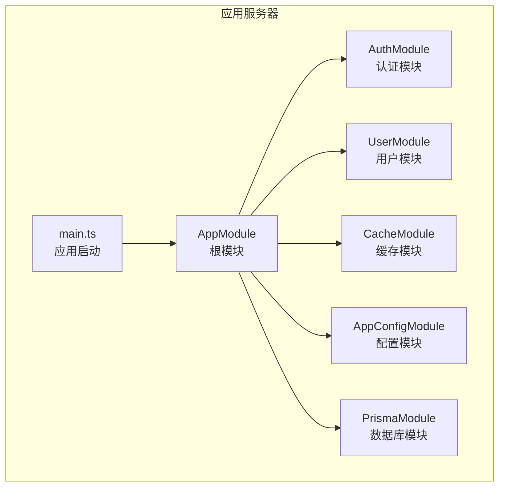
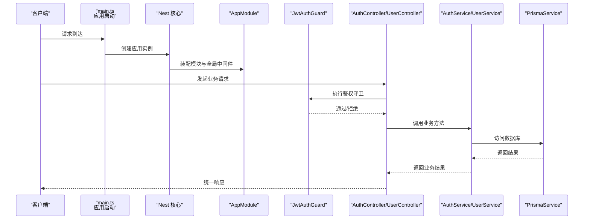
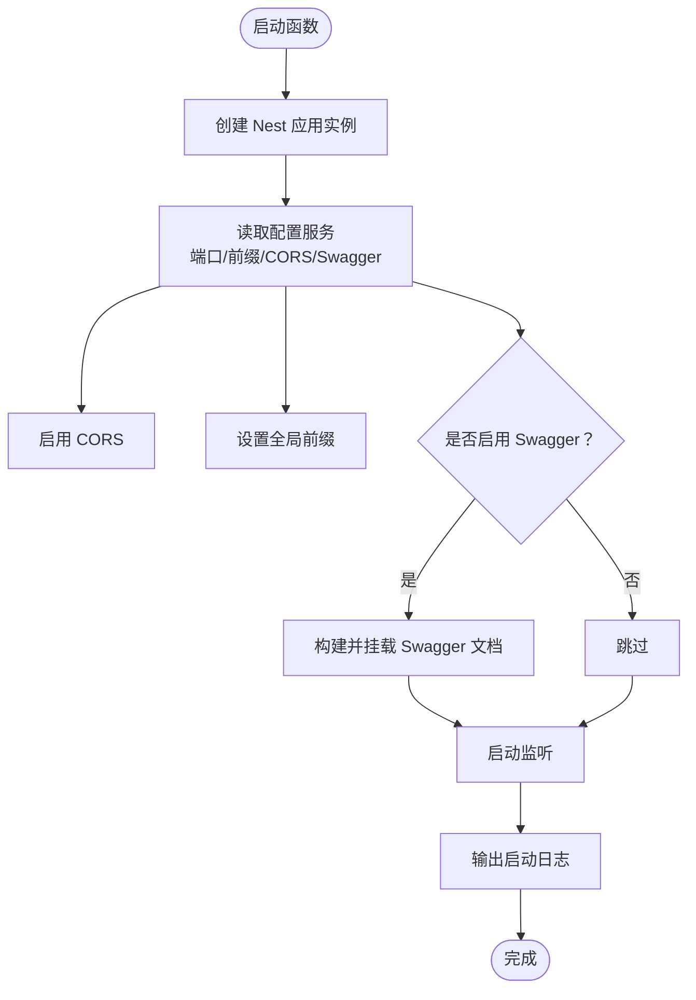
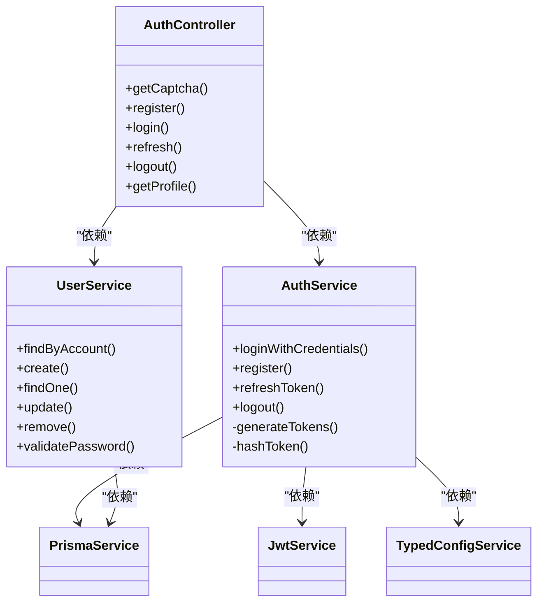
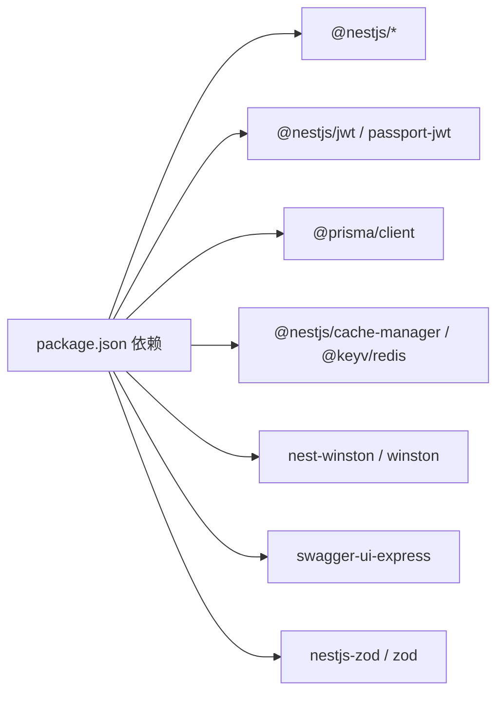

# NestJS 架构设计

<cite>
**本文引用的文件**
- [apps/nestjs-server/src/app.module.ts](file://apps/nestjs-server/src/app.module.ts)
- [apps/nestjs-server/src/main.ts](file://apps/nestjs-server/src/main.ts)
- [apps/nestjs-server/src/modules/auth/auth.module.ts](file://apps/nestjs-server/src/modules/auth/auth.module.ts)
- [apps/nestjs-server/src/modules/auth/auth.controller.ts](file://apps/nestjs-server/src/modules/auth/auth.controller.ts)
- [apps/nestjs-server/src/modules/auth/auth.service.ts](file://apps/nestjs-server/src/modules/auth/auth.service.ts)
- [apps/nestjs-server/src/modules/user/user.module.ts](file://apps/nestjs-server/src/modules/user/user.module.ts)
- [apps/nestjs-server/src/modules/user/user.controller.ts](file://apps/nestjs-server/src/modules/user/user.controller.ts)
- [apps/nestjs-server/src/modules/user/user.service.ts](file://apps/nestjs-server/src/modules/user/user.service.ts)
- [apps/nestjs-server/src/modules/cache/cache.module.ts](file://apps/nestjs-server/src/modules/cache/cache.module.ts)
- [apps/nestjs-server/src/common/guards/jwt-auth.guard.ts](file://apps/nestjs-server/src/common/guards/jwt-auth.guard.ts)
- [apps/nestjs-server/src/common/interceptors/logging.interceptor.ts](file://apps/nestjs-server/src/common/interceptors/logging.interceptor.ts)
- [apps/nestjs-server/src/common/filters/http-exception.filter.ts](file://apps/nestjs-server/src/common/filters/http-exception.filter.ts)
- [apps/nestjs-server/src/prisma/prisma.module.ts](file://apps/nestjs-server/src/prisma/prisma.module.ts)
- [apps/nestjs-server/src/config/config.module.ts](file://apps/nestjs-server/src/config/config.module.ts)
- [apps/nestjs-server/package.json](file://apps/nestjs-server/package.json)
</cite>

## 目录

1. [简介](#简介)
2. [项目结构](#项目结构)
3. [核心组件](#核心组件)
4. [架构总览](#架构总览)
5. [详细组件分析](#详细组件分析)
6. [依赖分析](#依赖分析)
7. [性能考虑](#性能考虑)
8. [故障排查指南](#故障排查指南)
9. [结论](#结论)
10. [附录](#附录)

## 简介

本文件面向希望深入理解与实践 NestJS 架构设计的工程师，围绕以下目标展开：整体模块化设计原则、依赖注入容器工作机制、应用启动流程、根模块 AppModule 的作用与子模块组织、控制器/服务/仓储层职责划分与交互模式、应用生命周期管理、中间件注册与全局异常处理等。文档同时提供架构图与代码示例路径，帮助读者快速把握 NestJS 的设计哲学与最佳实践。

## 项目结构

本项目采用多模块分层组织方式，核心入口位于应用服务器目录，按功能域拆分为认证、用户、健康检查、缓存、日志、配置等模块；基础能力通过全局模块与共享服务提供，例如配置加载、Prisma 数据访问、JWT 认证策略等。

- 应用入口与根模块
  - 启动入口：[apps/nestjs-server/src/main.ts](file://apps/nestjs-server/src/main.ts)
  - 根模块：[apps/nestjs-server/src/app.module.ts](file://apps/nestjs-server/src/app.module.ts)
- 功能模块
  - 认证模块：[apps/nestjs-server/src/modules/auth/auth.module.ts](file://apps/nestjs-server/src/modules/auth/auth.module.ts)
  - 用户模块：[apps/nestjs-server/src/modules/user/user.module.ts](file://apps/nestjs-server/src/modules/user/user.module.ts)
  - 缓存模块：[apps/nestjs-server/src/modules/cache/cache.module.ts](file://apps/nestjs-server/src/modules/cache/cache.module.ts)
  - 配置模块：[apps/nestjs-server/src/config/config.module.ts](file://apps/nestjs-server/src/config/config.module.ts)
  - 数据库模块：[apps/nestjs-server/src/prisma/prisma.module.ts](file://apps/nestjs-server/src/prisma/prisma.module.ts)
- 公共基础设施
  - 守卫、拦截器、过滤器、DTO、枚举、工具等位于 [apps/nestjs-server/src/common](file://apps/nestjs-server/src/common) 目录

图表来源

- [apps/nestjs-server/src/main.ts:1-47](file://apps/nestjs-server/src/main.ts#L1-L47)
- [apps/nestjs-server/src/app.module.ts:1-63](file://apps/nestjs-server/src/app.module.ts#L1-L63)

章节来源

- [apps/nestjs-server/src/main.ts:1-47](file://apps/nestjs-server/src/main.ts#L1-L47)
- [apps/nestjs-server/src/app.module.ts:1-63](file://apps/nestjs-server/src/app.module.ts#L1-L63)

## 核心组件

- 根模块 AppModule
  - 职责：聚合所有子模块，注册全局守卫/拦截器/管道/过滤器，集中配置限流、缓存、Redis、Prisma、Swagger 等横切能力。
  - 关键点：通过 APP\_\* 绑定全局行为，确保每个请求都经过统一的鉴权、日志、参数校验与异常处理。
- 配置模块 AppConfigModule
  - 职责：基于 @nestjs/config 加载环境配置，提供类型化配置服务，支持生产环境忽略 .env 文件以避免污染。
- 数据库模块 PrismaModule
  - 职责：全局提供 PrismaService，屏蔽 ORM 细节，供各业务服务使用。
- 认证模块 AuthModule
  - 职责：整合 Passport/JWT，提供登录、注册、刷新令牌、退出登录、验证码等能力；导出 AuthService 供其他模块复用。
- 用户模块 UserModule
  - 职责：提供用户 CRUD 接口与业务逻辑，依赖 PrismaService 实现数据持久化。
- 缓存模块 CacheModule
  - 职责：基于 @nestjs/cache-manager 与 Redis 提供全局缓存能力，统一 TTL 与存储后端。
- 全局中间件与横切关注点
  - 守卫：JwtAuthGuard（结合 Reflector 支持 @Public 跳过鉴权）
  - 拦截器：LoggingInterceptor（记录请求/响应）、TransformInterceptor（统一响应包装）
  - 过滤器：HttpExceptionFilter（统一异常映射与响应）
  - 管道：ZodValidationPipe（参数/请求体校验）

章节来源

- [apps/nestjs-server/src/app.module.ts:1-63](file://apps/nestjs-server/src/app.module.ts#L1-L63)
- [apps/nestjs-server/src/config/config.module.ts:1-20](file://apps/nestjs-server/src/config/config.module.ts#L1-L20)
- [apps/nestjs-server/src/prisma/prisma.module.ts:1-10](file://apps/nestjs-server/src/prisma/prisma.module.ts#L1-L10)
- [apps/nestjs-server/src/modules/auth/auth.module.ts:1-35](file://apps/nestjs-server/src/modules/auth/auth.module.ts#L1-L35)
- [apps/nestjs-server/src/modules/user/user.module.ts:1-11](file://apps/nestjs-server/src/modules/user/user.module.ts#L1-L11)
- [apps/nestjs-server/src/modules/cache/cache.module.ts:1-20](file://apps/nestjs-server/src/modules/cache/cache.module.ts#L1-L20)
- [apps/nestjs-server/src/common/guards/jwt-auth.guard.ts:1-43](file://apps/nestjs-server/src/common/guards/jwt-auth.guard.ts#L1-L43)
- [apps/nestjs-server/src/common/interceptors/logging.interceptor.ts:1-30](file://apps/nestjs-server/src/common/interceptors/logging.interceptor.ts#L1-L30)
- [apps/nestjs-server/src/common/filters/http-exception.filter.ts:1-208](file://apps/nestjs-server/src/common/filters/http-exception.filter.ts#L1-L208)

## 架构总览

下图展示从应用启动到请求处理的关键流程，涵盖模块装配、全局中间件注册、路由匹配与控制器执行、服务层处理、数据库访问与响应返回。

图表来源

- [apps/nestjs-server/src/main.ts:1-47](file://apps/nestjs-server/src/main.ts#L1-L47)
- [apps/nestjs-server/src/app.module.ts:1-63](file://apps/nestjs-server/src/app.module.ts#L1-L63)
- [apps/nestjs-server/src/common/guards/jwt-auth.guard.ts:1-43](file://apps/nestjs-server/src/common/guards/jwt-auth.guard.ts#L1-L43)
- [apps/nestjs-server/src/modules/auth/auth.controller.ts:1-115](file://apps/nestjs-server/src/modules/auth/auth.controller.ts#L1-L115)
- [apps/nestjs-server/src/modules/user/user.controller.ts:1-79](file://apps/nestjs-server/src/modules/user/user.controller.ts#L1-L79)
- [apps/nestjs-server/src/modules/auth/auth.service.ts:1-151](file://apps/nestjs-server/src/modules/auth/auth.service.ts#L1-L151)
- [apps/nestjs-server/src/modules/user/user.service.ts:1-113](file://apps/nestjs-server/src/modules/user/user.service.ts#L1-L113)
- [apps/nestjs-server/src/prisma/prisma.module.ts:1-10](file://apps/nestjs-server/src/prisma/prisma.module.ts#L1-L10)

## 详细组件分析

### 根模块 AppModule 设计

- 模块装配
  - 引入配置、限流、Redis、缓存、Prisma、认证、用户、健康检查、日志等模块。
- 全局注册
  - APP_GUARD：JwtAuthGuard + 自定义 ThrottlerGuard
  - APP_INTERCEPTOR：LoggingInterceptor + TransformInterceptor
  - APP_PIPE：ZodValidationPipe
  - APP_FILTER：HttpExceptionFilter
- 作用
  - 将横切关注点集中于根模块，保证应用一致性与可维护性；子模块专注业务边界。

章节来源

- [apps/nestjs-server/src/app.module.ts:1-63](file://apps/nestjs-server/src/app.module.ts#L1-L63)

### 应用启动流程（main.ts）

- 创建应用实例并启用日志缓冲
- 注入配置服务读取运行参数（端口、前缀、CORS、Swagger 开关）
- 设置全局 CORS、全局前缀、Swagger 文档
- 启动监听并输出启动日志

图表来源

- [apps/nestjs-server/src/main.ts:1-47](file://apps/nestjs-server/src/main.ts#L1-L47)

章节来源

- [apps/nestjs-server/src/main.ts:1-47](file://apps/nestjs-server/src/main.ts#L1-L47)

### 认证模块（AuthModule）

- 结构
  - 控制器：AuthController（验证码、注册、登录、刷新、退出、个人资料）
  - 服务：AuthService（登录凭据校验、注册、令牌刷新、登出、JWT 生成与存储）
  - 策略：JwtStrategy（Passport 策略）
  - 依赖：UserModule、JwtModule、PrismaService
- 交互
  - AuthController -> AuthService -> PrismaService
  - 登录/注册时生成访问令牌与刷新令牌，刷新令牌安全存储并设置过期时间

图表来源

- [apps/nestjs-server/src/modules/auth/auth.controller.ts:1-115](file://apps/nestjs-server/src/modules/auth/auth.controller.ts#L1-L115)
- [apps/nestjs-server/src/modules/auth/auth.service.ts:1-151](file://apps/nestjs-server/src/modules/auth/auth.service.ts#L1-L151)
- [apps/nestjs-server/src/modules/user/user.service.ts:1-113](file://apps/nestjs-server/src/modules/user/user.service.ts#L1-L113)
- [apps/nestjs-server/src/prisma/prisma.module.ts:1-10](file://apps/nestjs-server/src/prisma/prisma.module.ts#L1-L10)

章节来源

- [apps/nestjs-server/src/modules/auth/auth.module.ts:1-35](file://apps/nestjs-server/src/modules/auth/auth.module.ts#L1-L35)
- [apps/nestjs-server/src/modules/auth/auth.controller.ts:1-115](file://apps/nestjs-server/src/modules/auth/auth.controller.ts#L1-L115)
- [apps/nestjs-server/src/modules/auth/auth.service.ts:1-151](file://apps/nestjs-server/src/modules/auth/auth.service.ts#L1-L151)

### 用户模块（UserModule）

- 结构
  - 控制器：UserController（创建、查询、更新、删除）
  - 服务：UserService（用户 CRUD、密码哈希、账号唯一性校验）
  - 依赖：PrismaService
- 特点
  - 使用 select 精准投影，避免敏感字段泄露
  - 通过 Prisma 约束保障邮箱/用户名唯一性

章节来源

- [apps/nestjs-server/src/modules/user/user.module.ts:1-11](file://apps/nestjs-server/src/modules/user/user.module.ts#L1-L11)
- [apps/nestjs-server/src/modules/user/user.controller.ts:1-79](file://apps/nestjs-server/src/modules/user/user.controller.ts#L1-L79)
- [apps/nestjs-server/src/modules/user/user.service.ts:1-113](file://apps/nestjs-server/src/modules/user/user.service.ts#L1-L113)

### 缓存模块（CacheModule）

- 结构
  - 基于 @nestjs/cache-manager 与 Redis（KeyvRedis）提供全局缓存
  - TTL 固定为 30 秒，便于调试与验证
- 作用
  - 为高频读取场景提供高性能缓存，降低数据库压力

章节来源

- [apps/nestjs-server/src/modules/cache/cache.module.ts:1-20](file://apps/nestjs-server/src/modules/cache/cache.module.ts#L1-L20)

### 全局中间件与横切关注点

- 守卫 JwtAuthGuard
  - 基于 Reflector 识别 @Public 装饰，支持公开路由
  - 未通过鉴权时抛出业务异常
- 拦截器 LoggingInterceptor
  - 记录请求方法、URL、用户 ID、IP、UA、耗时与状态码
- 过滤器 HttpExceptionFilter
  - 将业务异常、Zod 校验异常、通用 HttpException 映射为统一响应结构
  - 支持将 JSON 解析错误识别为校验错误
- 管道 ZodValidationPipe
  - 在进入控制器前进行参数/请求体校验，减少重复校验逻辑

章节来源

- [apps/nestjs-server/src/common/guards/jwt-auth.guard.ts:1-43](file://apps/nestjs-server/src/common/guards/jwt-auth.guard.ts#L1-L43)
- [apps/nestjs-server/src/common/interceptors/logging.interceptor.ts:1-30](file://apps/nestjs-server/src/common/interceptors/logging.interceptor.ts#L1-L30)
- [apps/nestjs-server/src/common/filters/http-exception.filter.ts:1-208](file://apps/nestjs-server/src/common/filters/http-exception.filter.ts#L1-L208)
- [apps/nestjs-server/src/app.module.ts:49-50](file://apps/nestjs-server/src/app.module.ts#L49-L50)

## 依赖分析

- 外部依赖概览（部分）
  - 平台与框架：@nestjs/\*、reflect-metadata、rxjs
  - 安全与认证：@nestjs/jwt、@nestjs/passport、passport-jwt、bcryptjs
  - 数据库与缓存：@prisma/client、cache-manager、@keyv/redis、ioredis
  - 工具与可观测性：dayjs、nest-winston、winston、swagger-ui-express、nestjs-zod
- 内部模块耦合
  - AppModule 聚合所有子模块，形成“中心辐射”结构
  - AuthModule 依赖 UserModule 与 PrismaService
  - UserModule 仅依赖 PrismaService
  - CacheModule 依赖 RedisService（由 Redis 模块提供）
  - AppConfigModule 为全局模块，供任意模块注入

图表来源

- [apps/nestjs-server/package.json:26-58](file://apps/nestjs-server/package.json#L26-L58)

章节来源

- [apps/nestjs-server/package.json:1-85](file://apps/nestjs-server/package.json#L1-L85)

## 性能考虑

- 全局限流
  - 通过 ThrottlerModule 预置短/中/长三档限流规则，建议在 AuthController 上按需使用 @Throttle 装饰器细化策略。
- 缓存策略
  - CacheModule 使用 Redis 作为后端，TTL 30 秒适合开发与测试；生产可根据热点数据调整 TTL 与淘汰策略。
- 日志与监控
  - LoggingInterceptor 记录请求耗时与状态码，建议结合指标采集（如 Prometheus）进一步完善可观测性。
- 数据访问
  - UserService 使用 select 精准投影，避免传输冗余字段；建议对高频查询建立索引并评估分页策略。

## 故障排查指南

- 统一异常映射
  - HttpExceptionFilter 将业务异常、Zod 校验异常与通用 HttpException 映射为统一响应结构，便于前端一致处理。
- 常见问题定位
  - 参数校验失败：确认 ZodValidationPipe 是否生效，查看过滤器对 Zod 校验异常的格式化输出。
  - 未授权访问：检查 JwtAuthGuard 是否正确识别 @Public 装饰，确认 JWT 令牌有效性与过期时间。
  - JSON 解析错误：过滤器会将 JSON 语法错误识别为校验错误并返回中文提示，便于快速定位。
- 日志审计
  - LoggingInterceptor 输出请求上下文与耗时，结合 Winston 配置可区分不同级别日志。

章节来源

- [apps/nestjs-server/src/common/filters/http-exception.filter.ts:1-208](file://apps/nestjs-server/src/common/filters/http-exception.filter.ts#L1-L208)
- [apps/nestjs-server/src/common/interceptors/logging.interceptor.ts:1-30](file://apps/nestjs-server/src/common/interceptors/logging.interceptor.ts#L1-L30)

## 结论

本项目遵循 NestJS 模块化与依赖注入的核心思想，通过根模块集中治理横切关注点，子模块聚焦业务边界，形成清晰的职责划分与稳定的扩展骨架。配合全局守卫、拦截器、过滤器与管道，实现了统一的安全、可观测性与错误处理体验。建议在生产环境中进一步完善限流策略、缓存 TTL、数据库索引与监控指标，以获得更佳的稳定性与性能表现。

## 附录

- 代码示例路径（不含具体代码内容）
  - 应用启动入口：[apps/nestjs-server/src/main.ts](file://apps/nestjs-server/src/main.ts)
  - 根模块装配与全局注册：[apps/nestjs-server/src/app.module.ts](file://apps/nestjs-server/src/app.module.ts)
  - 认证模块装配与控制器：[apps/nestjs-server/src/modules/auth/auth.module.ts](file://apps/nestjs-server/src/modules/auth/auth.module.ts), [apps/nestjs-server/src/modules/auth/auth.controller.ts](file://apps/nestjs-server/src/modules/auth/auth.controller.ts)
  - 用户模块装配与服务：[apps/nestjs-server/src/modules/user/user.module.ts](file://apps/nestjs-server/src/modules/user/user.module.ts), [apps/nestjs-server/src/modules/user/user.service.ts](file://apps/nestjs-server/src/modules/user/user.service.ts)
  - 缓存模块装配：[apps/nestjs-server/src/modules/cache/cache.module.ts](file://apps/nestjs-server/src/modules/cache/cache.module.ts)
  - 配置模块装配：[apps/nestjs-server/src/config/config.module.ts](file://apps/nestjs-server/src/config/config.module.ts)
  - 数据库模块装配：[apps/nestjs-server/src/prisma/prisma.module.ts](file://apps/nestjs-server/src/prisma/prisma.module.ts)
  - 全局守卫实现：[apps/nestjs-server/src/common/guards/jwt-auth.guard.ts](file://apps/nestjs-server/src/common/guards/jwt-auth.guard.ts)
  - 全局拦截器实现：[apps/nestjs-server/src/common/interceptors/logging.interceptor.ts](file://apps/nestjs-server/src/common/interceptors/logging.interceptor.ts)
  - 全局异常过滤器实现：[apps/nestjs-server/src/common/filters/http-exception.filter.ts](file://apps/nestjs-server/src/common/filters/http-exception.filter.ts)
  - 依赖清单：[apps/nestjs-server/package.json](file://apps/nestjs-server/package.json)
