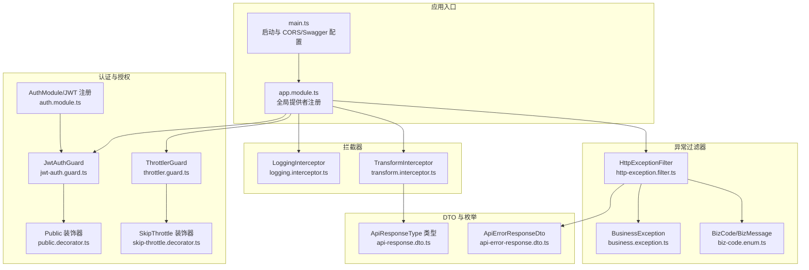
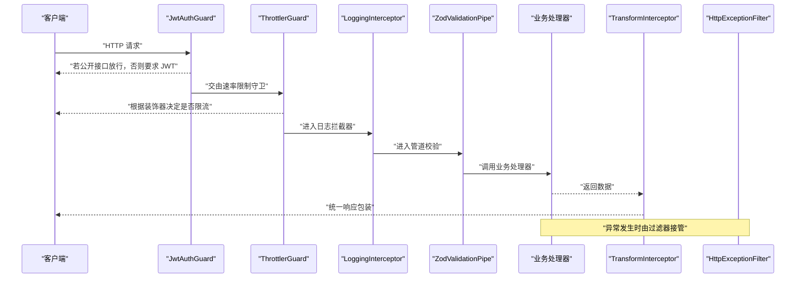
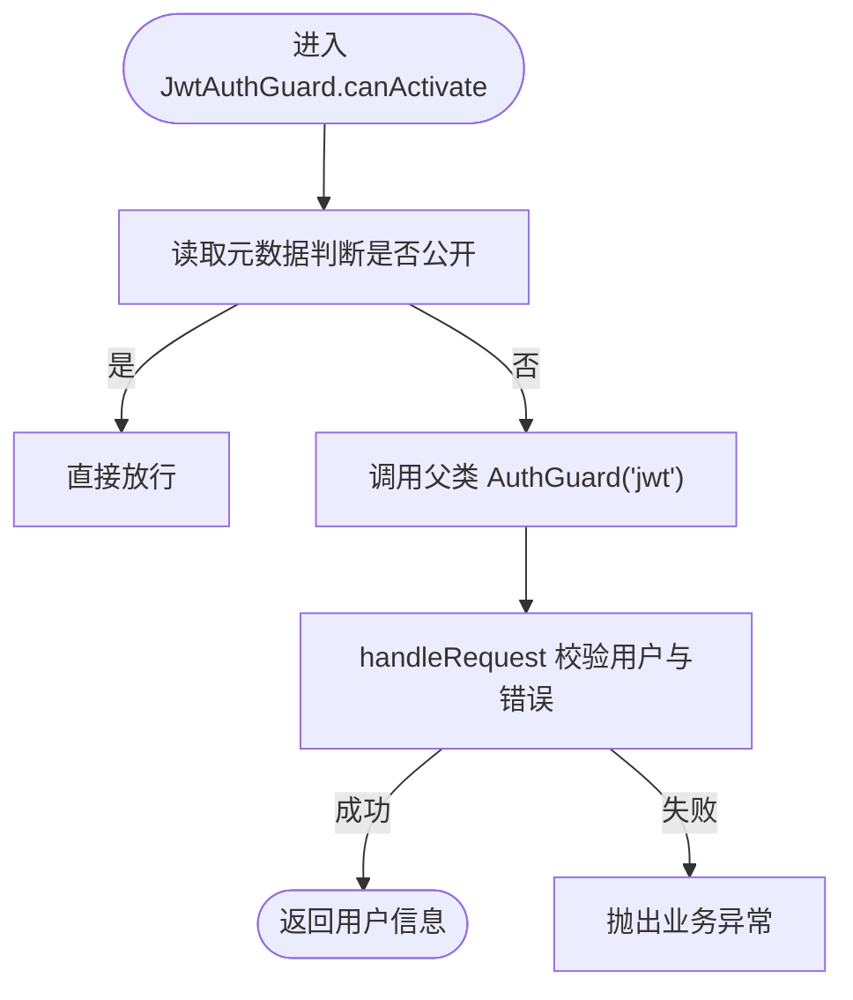
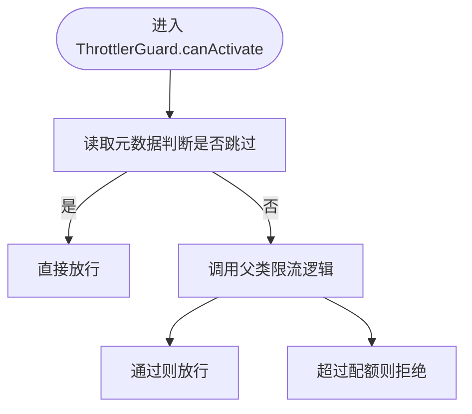
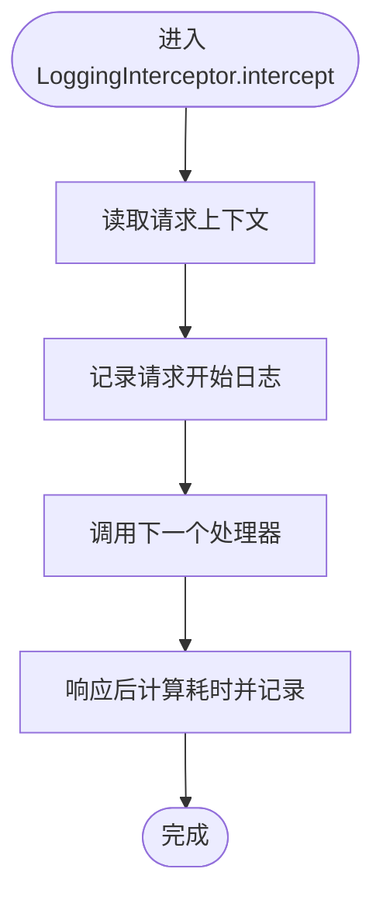
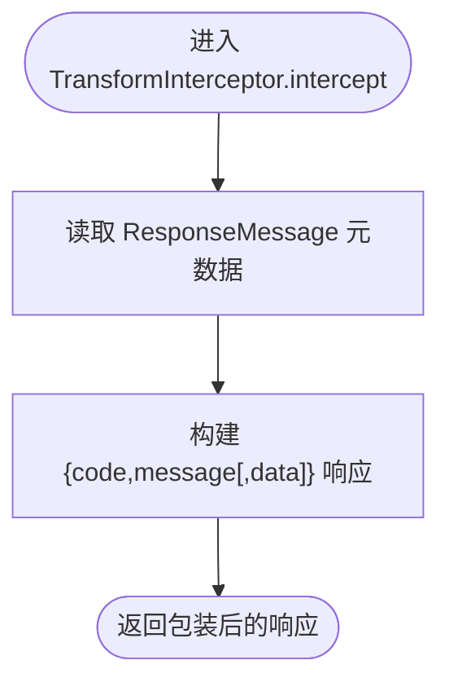
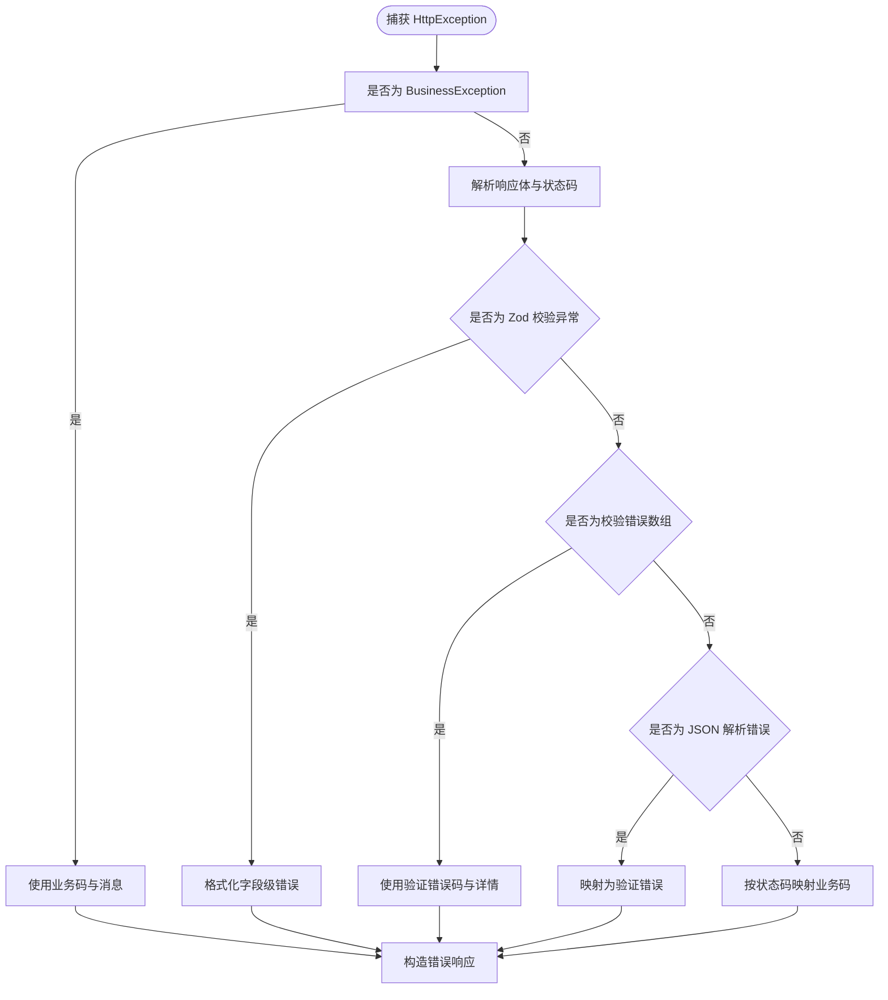
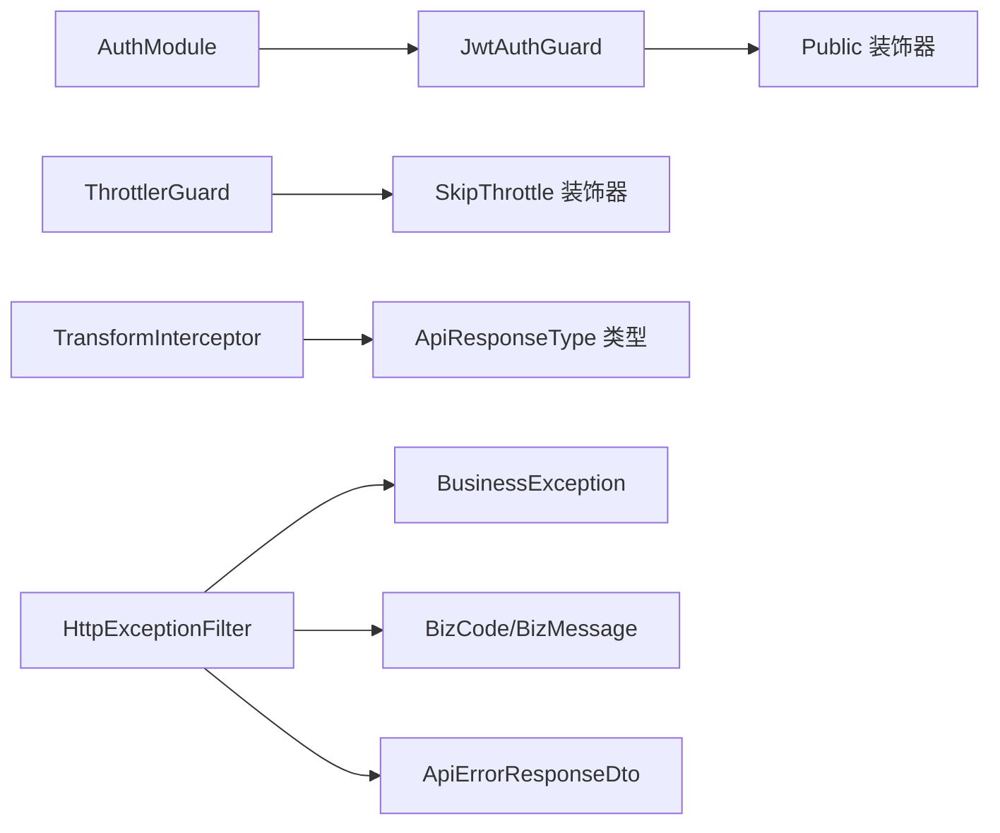

# 中间件与拦截器

<cite>
**本文引用的文件**
- [main.ts](file://apps/nestjs-server/src/main.ts)
- [app.module.ts](file://apps/nestjs-server/src/app.module.ts)
- [jwt-auth.guard.ts](file://apps/nestjs-server/src/common/guards/jwt-auth.guard.ts)
- [throttler.guard.ts](file://apps/nestjs-server/src/common/guards/throttler.guard.ts)
- [public.decorator.ts](file://apps/nestjs-server/src/common/decorators/public.decorator.ts)
- [skip-throttle.decorator.ts](file://apps/nestjs-server/src/common/decorators/skip-throttle.decorator.ts)
- [logging.interceptor.ts](file://apps/nestjs-server/src/common/interceptors/logging.interceptor.ts)
- [transform.interceptor.ts](file://apps/nestjs-server/src/common/interceptors/transform.interceptor.ts)
- [http-exception.filter.ts](file://apps/nestjs-server/src/common/filters/http-exception.filter.ts)
- [business.exception.ts](file://apps/nestjs-server/src/common/exceptions/business.exception.ts)
- [biz-code.enum.ts](file://apps/nestjs-server/src/common/enums/biz-code.enum.ts)
- [api-response.dto.ts](file://apps/nestjs-server/src/common/dto/api-response.dto.ts)
- [api-error-response.dto.ts](file://apps/nestjs-server/src/common/dto/api-error-response.dto.ts)
- [auth.module.ts](file://apps/nestjs-server/src/modules/auth/auth.module.ts)
</cite>

## 目录

1. [简介](#简介)
2. [项目结构](#项目结构)
3. [核心组件](#核心组件)
4. [架构总览](#架构总览)
5. [详细组件分析](#详细组件分析)
6. [依赖关系分析](#依赖关系分析)
7. [性能考量](#性能考量)
8. [故障排查指南](#故障排查指南)
9. [结论](#结论)
10. [附录](#附录)

## 简介

本文件系统性梳理并说明本项目的中间件与拦截器体系，覆盖以下主题：

- 请求拦截、响应处理与错误捕获机制
- 自定义守卫：JWT 认证守卫与速率限制守卫
- 拦截器：日志记录、统一响应包装与性能监控
- 异常过滤器：统一处理业务异常与系统异常
- 管道验证、转换器与拦截器的组合使用模式
- 完整的中间件配置示例、自定义实现与性能优化建议
- 跨域处理、CORS 配置与安全防护措施

## 项目结构

本项目采用标准的 NestJS 应用结构，关键中间件与拦截器相关代码集中在 common 目录下，并通过全局提供者在应用启动时注册。

图表来源

- [main.ts:1-47](file://apps/nestjs-server/src/main.ts#L1-L47)
- [app.module.ts:1-63](file://apps/nestjs-server/src/app.module.ts#L1-L63)
- [jwt-auth.guard.ts:1-43](file://apps/nestjs-server/src/common/guards/jwt-auth.guard.ts#L1-L43)
- [throttler.guard.ts:1-33](file://apps/nestjs-server/src/common/guards/throttler.guard.ts#L1-L33)
- [public.decorator.ts:1-5](file://apps/nestjs-server/src/common/decorators/public.decorator.ts#L1-L5)
- [skip-throttle.decorator.ts:1-12](file://apps/nestjs-server/src/common/decorators/skip-throttle.decorator.ts#L1-L12)
- [logging.interceptor.ts:1-30](file://apps/nestjs-server/src/common/interceptors/logging.interceptor.ts#L1-L30)
- [transform.interceptor.ts:1-36](file://apps/nestjs-server/src/common/interceptors/transform.interceptor.ts#L1-L36)
- [http-exception.filter.ts:1-208](file://apps/nestjs-server/src/common/filters/http-exception.filter.ts#L1-L208)
- [business.exception.ts:1-42](file://apps/nestjs-server/src/common/exceptions/business.exception.ts#L1-L42)
- [biz-code.enum.ts:1-16](file://apps/nestjs-server/src/common/enums/biz-code.enum.ts#L1-L16)
- [api-response.dto.ts:1-14](file://apps/nestjs-server/src/common/dto/api-response.dto.ts#L1-L14)
- [api-error-response.dto.ts:1-11](file://apps/nestjs-server/src/common/dto/api-error-response.dto.ts#L1-L11)
- [auth.module.ts:1-35](file://apps/nestjs-server/src/modules/auth/auth.module.ts#L1-L35)

章节来源

- [main.ts:1-47](file://apps/nestjs-server/src/main.ts#L1-L47)
- [app.module.ts:1-63](file://apps/nestjs-server/src/app.module.ts#L1-L63)

## 核心组件

- 全局守卫
  - JwtAuthGuard：基于 Passport 的 JWT 守卫，结合反射判断是否公开接口；未通过认证或无用户信息时抛出业务异常。
  - 自定义 ThrottlerGuard：扩展 Nest 的 ThrottlerGuard，支持通过装饰器跳过速率限制。
- 全局拦截器
  - LoggingInterceptor：记录请求方法、URL、用户 ID、IP、UA 以及响应状态码与耗时。
  - TransformInterceptor：统一包装响应结构，自动注入业务码与消息，按需携带 data 字段。
- 全局异常过滤器
  - HttpExceptionFilter：将 HttpException 映射为业务码与消息，区分业务异常、Zod 校验异常、class-validator 校验异常与 JSON 解析错误。
- 全局管道
  - ZodValidationPipe：统一进行输入校验与转换，配合 HttpExceptionFilter 提供一致的错误响应。
- 装饰器
  - Public：标记公开接口，绕过 JwtAuthGuard。
  - SkipThrottle：标记高频但低风险接口，绕过 ThrottlerGuard。
- 认证模块
  - AuthModule：注册 Passport 与 JWT，提供策略与服务。

章节来源

- [jwt-auth.guard.ts:1-43](file://apps/nestjs-server/src/common/guards/jwt-auth.guard.ts#L1-L43)
- [throttler.guard.ts:1-33](file://apps/nestjs-server/src/common/guards/throttler.guard.ts#L1-L33)
- [logging.interceptor.ts:1-30](file://apps/nestjs-server/src/common/interceptors/logging.interceptor.ts#L1-L30)
- [transform.interceptor.ts:1-36](file://apps/nestjs-server/src/common/interceptors/transform.interceptor.ts#L1-L36)
- [http-exception.filter.ts:1-208](file://apps/nestjs-server/src/common/filters/http-exception.filter.ts#L1-L208)
- [public.decorator.ts:1-5](file://apps/nestjs-server/src/common/decorators/public.decorator.ts#L1-L5)
- [skip-throttle.decorator.ts:1-12](file://apps/nestjs-server/src/common/decorators/skip-throttle.decorator.ts#L1-L12)
- [auth.module.ts:1-35](file://apps/nestjs-server/src/modules/auth/auth.module.ts#L1-L35)

## 架构总览

下图展示请求从进入应用到返回响应的关键路径，包括守卫、拦截器与异常过滤器的协作流程。

图表来源

- [app.module.ts:35-59](file://apps/nestjs-server/src/app.module.ts#L35-L59)
- [jwt-auth.guard.ts:23-34](file://apps/nestjs-server/src/common/guards/jwt-auth.guard.ts#L23-L34)
- [throttler.guard.ts:20-31](file://apps/nestjs-server/src/common/guards/throttler.guard.ts#L20-L31)
- [logging.interceptor.ts:10-28](file://apps/nestjs-server/src/common/interceptors/logging.interceptor.ts#L10-L28)
- [transform.interceptor.ts:13-34](file://apps/nestjs-server/src/common/interceptors/transform.interceptor.ts#L13-L34)
- [http-exception.filter.ts:20-68](file://apps/nestjs-server/src/common/filters/http-exception.filter.ts#L20-L68)

## 详细组件分析

### 守卫：JWT 认证守卫

- 设计要点
  - 继承自 AuthGuard('jwt')，复用 Passport 的认证流程。
  - 使用 Reflector 读取 Public 装饰器元数据，公开接口直接放行。
  - handleRequest 在无用户或出现错误时抛出业务异常，统一错误语义。
- 关键行为
  - 公开接口：跳过认证。
  - 非公开接口：执行认证，失败则抛出业务异常。
- 适用场景
  - 需要鉴权的路由默认启用；对登录页、验证码等公开接口使用 Public 装饰器标注。

图表来源

- [jwt-auth.guard.ts:23-41](file://apps/nestjs-server/src/common/guards/jwt-auth.guard.ts#L23-L41)
- [public.decorator.ts:3-4](file://apps/nestjs-server/src/common/decorators/public.decorator.ts#L3-L4)

章节来源

- [jwt-auth.guard.ts:1-43](file://apps/nestjs-server/src/common/guards/jwt-auth.guard.ts#L1-L43)
- [public.decorator.ts:1-5](file://apps/nestjs-server/src/common/decorators/public.decorator.ts#L1-L5)

### 守卫：速率限制守卫

- 设计要点
  - 继承自 NestThrottlerGuard，重写 canActivate。
  - 通过 Reflector 读取 SkipThrottle 元数据，允许某些高频接口跳过限制。
- 关键行为
  - 标记 SkipThrottle 的接口直接放行。
  - 未标记的接口走默认的限流策略（短、中、长三个窗口配置）。
- 适用场景
  - 健康检查、统计接口等高频但无安全风险的端点。

图表来源

- [throttler.guard.ts:20-31](file://apps/nestjs-server/src/common/guards/throttler.guard.ts#L20-L31)
- [skip-throttle.decorator.ts:3-11](file://apps/nestjs-server/src/common/decorators/skip-throttle.decorator.ts#L3-L11)

章节来源

- [throttler.guard.ts:1-33](file://apps/nestjs-server/src/common/guards/throttler.guard.ts#L1-L33)
- [skip-throttle.decorator.ts:1-12](file://apps/nestjs-server/src/common/decorators/skip-throttle.decorator.ts#L1-L12)

### 拦截器：日志拦截器

- 功能特性
  - 记录请求方法、URL、用户 ID、IP、UA。
  - 计算处理耗时并在响应后记录状态码与耗时。
  - 使用 Nest Logger 输出结构化日志。
- 性能影响
  - 日志输出为同步 I/O，建议在生产环境控制日志级别与采样率。

图表来源

- [logging.interceptor.ts:10-28](file://apps/nestjs-server/src/common/interceptors/logging.interceptor.ts#L10-L28)

章节来源

- [logging.interceptor.ts:1-30](file://apps/nestjs-server/src/common/interceptors/logging.interceptor.ts#L1-L30)

### 拦截器：统一响应包装

- 功能特性
  - 通过 Reflector 读取 ResponseMessage 元数据，设置统一的成功消息。
  - 固定业务码与消息，按需携带 data 字段，避免空数据时冗余字段。
  - 与 DTO 结合，保证前后端响应结构一致。
- 适用场景
  - 所有成功响应均以统一结构返回，便于前端消费与调试。

图表来源

- [transform.interceptor.ts:13-34](file://apps/nestjs-server/src/common/interceptors/transform.interceptor.ts#L13-L34)
- [response-message.decorator.ts:3-4](file://apps/nestjs-server/src/common/decorators/response-message.decorator.ts#L3-L4)
- [api-response.dto.ts:1-14](file://apps/nestjs-server/src/common/dto/api-response.dto.ts#L1-L14)

章节来源

- [transform.interceptor.ts:1-36](file://apps/nestjs-server/src/common/interceptors/transform.interceptor.ts#L1-L36)
- [response-message.decorator.ts:1-5](file://apps/nestjs-server/src/common/decorators/response-message.decorator.ts#L1-L5)
- [api-response.dto.ts:1-14](file://apps/nestjs-server/src/common/dto/api-response.dto.ts#L1-L14)

### 异常过滤器：统一异常处理

- 设计要点
  - 捕获 HttpException，优先识别 BusinessException 并透传其业务码与消息。
  - 对其他 HttpException 进行解析与映射，将状态码映射为业务码。
  - 特殊处理 ZodValidationException 与 class-validator 校验错误，提取字段级错误详情。
  - JSON 解析错误识别并转译为统一的验证错误。
- 行为特征
  - 业务异常：保留自定义消息与详情。
  - 校验异常：返回验证错误码与字段级详情。
  - 其他异常：根据状态码映射到通用业务码。
- 与业务码体系联动
  - 业务码与消息来自共享枚举，确保前后端一致。

图表来源

- [http-exception.filter.ts:20-68](file://apps/nestjs-server/src/common/filters/http-exception.filter.ts#L20-L68)
- [http-exception.filter.ts:70-145](file://apps/nestjs-server/src/common/filters/http-exception.filter.ts#L70-L145)
- [http-exception.filter.ts:157-186](file://apps/nestjs-server/src/common/filters/http-exception.filter.ts#L157-L186)
- [http-exception.filter.ts:191-206](file://apps/nestjs-server/src/common/filters/http-exception.filter.ts#L191-L206)
- [business.exception.ts:24-40](file://apps/nestjs-server/src/common/exceptions/business.exception.ts#L24-L40)
- [biz-code.enum.ts:1-16](file://apps/nestjs-server/src/common/enums/biz-code.enum.ts#L1-L16)
- [api-error-response.dto.ts:4-10](file://apps/nestjs-server/src/common/dto/api-error-response.dto.ts#L4-L10)

章节来源

- [http-exception.filter.ts:1-208](file://apps/nestjs-server/src/common/filters/http-exception.filter.ts#L1-L208)
- [business.exception.ts:1-42](file://apps/nestjs-server/src/common/exceptions/business.exception.ts#L1-L42)
- [biz-code.enum.ts:1-16](file://apps/nestjs-server/src/common/enums/biz-code.enum.ts#L1-L16)
- [api-error-response.dto.ts:1-11](file://apps/nestjs-server/src/common/dto/api-error-response.dto.ts#L1-L11)

### 管道：输入校验与转换

- 设计要点
  - 使用 ZodValidationPipe 进行输入校验与转换，与 HttpExceptionFilter 协作统一错误响应。
  - 与拦截器配合，确保请求在进入业务处理器前已完成结构化校验。
- 适用场景
  - 所有控制器输入参数均通过管道进行强约束，减少手写校验逻辑。

章节来源

- [app.module.ts:49-50](file://apps/nestjs-server/src/app.module.ts#L49-L50)

### 跨域与安全配置

- CORS 配置
  - 启动时从配置服务读取允许的来源列表，启用多源 CORS 放行。
- Swagger 文档
  - 条件开启，添加 Bearer 授权，生成并暴露文档页面。
- 全局前缀
  - 设置全局 API 前缀，便于版本化与隔离。

章节来源

- [main.ts:19-33](file://apps/nestjs-server/src/main.ts#L19-L33)

## 依赖关系分析

- 组件耦合
  - JwtAuthGuard 依赖 Reflector 与 BusinessException，与 AuthModule 的策略配合工作。
  - ThrottlerGuard 依赖 Reflector 与装饰器元数据，与限流模块配置协同。
  - TransformInterceptor 依赖 Reflector 与业务码枚举，输出结构与共享 DTO 对齐。
  - HttpExceptionFilter 依赖业务码枚举与多种异常类型，形成统一错误出口。
- 外部依赖
  - Passport/JWT：提供认证能力。
  - Throttler：提供速率限制能力。
  - Zod：提供声明式输入校验。
  - Swagger：提供文档能力。

图表来源

- [jwt-auth.guard.ts:19-34](file://apps/nestjs-server/src/common/guards/jwt-auth.guard.ts#L19-L34)
- [throttler.guard.ts:11-31](file://apps/nestjs-server/src/common/guards/throttler.guard.ts#L11-L31)
- [transform.interceptor.ts:10-34](file://apps/nestjs-server/src/common/interceptors/transform.interceptor.ts#L10-L34)
- [http-exception.filter.ts:17-68](file://apps/nestjs-server/src/common/filters/http-exception.filter.ts#L17-L68)
- [auth.module.ts:12-33](file://apps/nestjs-server/src/modules/auth/auth.module.ts#L12-L33)

章节来源

- [app.module.ts:35-59](file://apps/nestjs-server/src/app.module.ts#L35-L59)

## 性能考量

- 拦截器链路
  - LoggingInterceptor 会增加一次时间戳计算与日志输出，建议在高并发场景下调低日志级别或启用采样。
  - TransformInterceptor 为纯内存映射，性能开销极小。
- 限流策略
  - 短/中/长窗口配置已内置，可根据实际流量调整阈值与 TTL。
- 认证与校验
  - JWT 解析与 Zod 校验均为 CPU 密集操作，建议在网关层或边缘缓存热点资源。
- CORS
  - 允许多个来源时，浏览器每次请求都会携带 Origin，注意 Nginx 或反向代理的缓存策略。

## 故障排查指南

- 认证失败
  - 现象：返回业务异常，提示未授权。
  - 排查：确认请求头是否包含有效 Token；检查 Public 装饰器是否误用。
- 速率限制触发
  - 现象：被 ThrottlerGuard 拒绝。
  - 排查：确认接口是否需要 SkipThrottle；核对限流配置与当前窗口内的请求数。
- 输入校验失败
  - 现象：HttpExceptionFilter 返回验证错误，包含字段级详情。
  - 排查：对照 Zod schema 与 class-validator 规则，修正请求体。
- JSON 解析错误
  - 现象：被识别为请求体格式无效。
  - 排查：检查 Content-Type 与请求体格式，确保为合法 JSON。
- 统一错误响应
  - 现象：所有错误均以 { code, message[, details] } 形式返回。
  - 排查：确认 HttpExceptionFilter 已注册且未被覆盖。

章节来源

- [jwt-auth.guard.ts:36-41](file://apps/nestjs-server/src/common/guards/jwt-auth.guard.ts#L36-L41)
- [throttler.guard.ts:20-31](file://apps/nestjs-server/src/common/guards/throttler.guard.ts#L20-L31)
- [http-exception.filter.ts:20-68](file://apps/nestjs-server/src/common/filters/http-exception.filter.ts#L20-L68)
- [http-exception.filter.ts:150-155](file://apps/nestjs-server/src/common/filters/http-exception.filter.ts#L150-L155)

## 结论

本项目通过全局守卫、拦截器与异常过滤器实现了“认证—限流—日志—校验—统一响应—错误处理”的完整链路，配合装饰器与共享业务码体系，确保了安全性、可观测性与一致性。建议在生产环境中结合业务流量特征进一步优化限流策略与日志采样，并持续完善 Swagger 文档与安全基线。

## 附录

### 中间件配置示例（步骤说明）

- 启用 CORS
  - 在应用启动时从配置服务读取允许的来源列表，调用启用 CORS 的方法。
- 设置全局前缀
  - 通过配置服务读取 API 前缀并设置全局前缀。
- 注册全局提供者
  - 在根模块中注册守卫、拦截器、异常过滤器与管道，确保全局生效。

章节来源

- [main.ts:19-22](file://apps/nestjs-server/src/main.ts#L19-L22)
- [app.module.ts:35-59](file://apps/nestjs-server/src/app.module.ts#L35-L59)

### 自定义实现建议

- 自定义守卫
  - 可参考 JwtAuthGuard 与 ThrottlerGuard 的实现方式，利用 Reflector 读取元数据，必要时重写 canActivate。
- 自定义拦截器
  - 可在 LoggingInterceptor 基础上增加采样、脱敏与指标上报；在 TransformInterceptor 基础上扩展分页、导出等场景。
- 自定义异常过滤器
  - 可扩展 HttpExceptionFilter，增加敏感信息脱敏、审计日志与外部告警联动。

### 组合使用模式

- 控制器级装饰器
  - 使用 Public 与 SkipThrottle 对个别接口进行细粒度控制。
- 全局与局部结合
  - 全局启用 JwtAuthGuard 与 ThrottlerGuard，局部通过装饰器微调策略。
- 管道+拦截器+过滤器
  - 输入由 ZodValidationPipe 校验，输出由 TransformInterceptor 包装，异常由 HttpExceptionFilter 统一处理。

章节来源

- [public.decorator.ts:3-4](file://apps/nestjs-server/src/common/decorators/public.decorator.ts#L3-L4)
- [skip-throttle.decorator.ts:3-11](file://apps/nestjs-server/src/common/decorators/skip-throttle.decorator.ts#L3-L11)
- [app.module.ts:35-59](file://apps/nestjs-server/src/app.module.ts#L35-L59)
