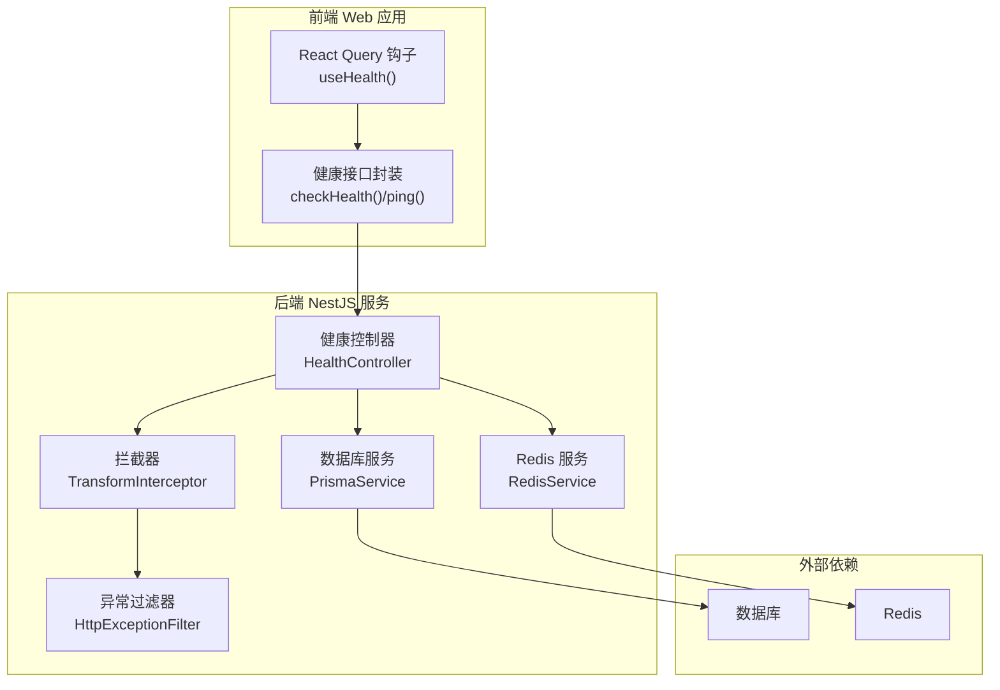
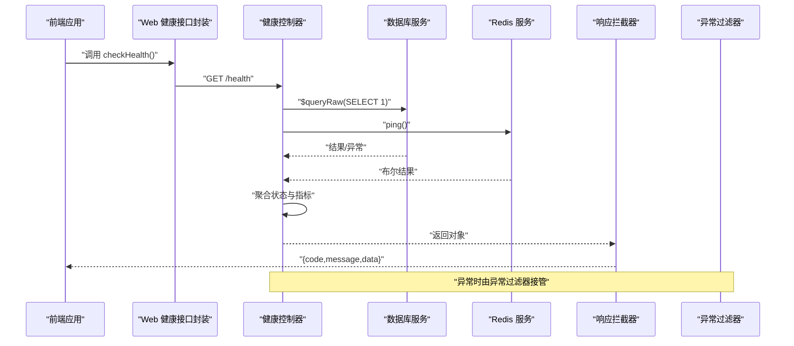
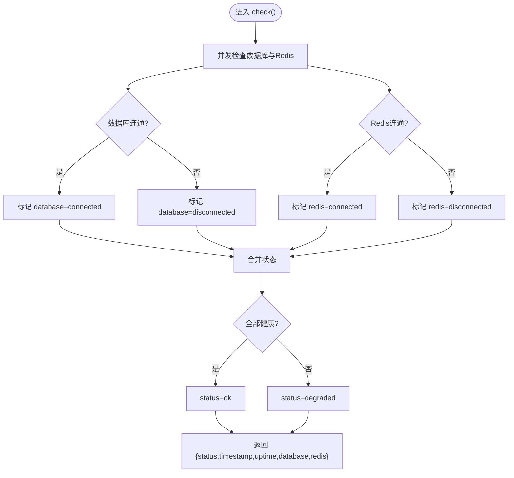
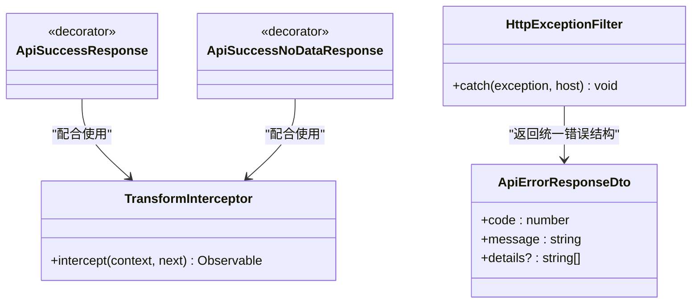
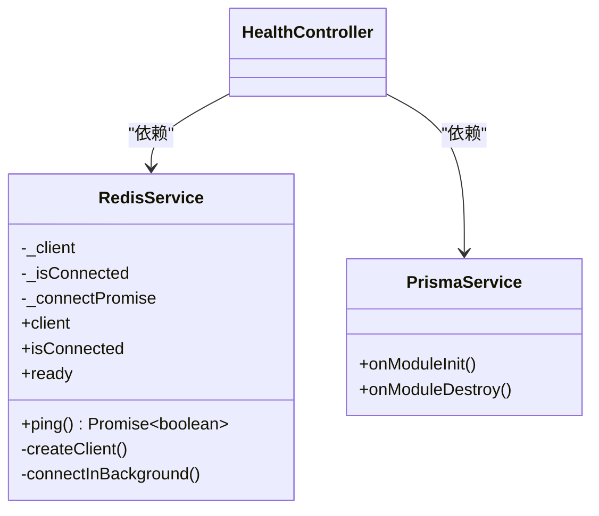
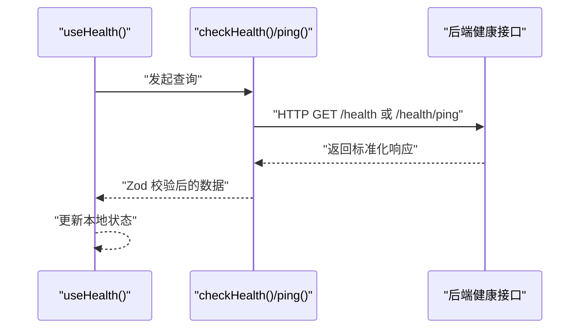
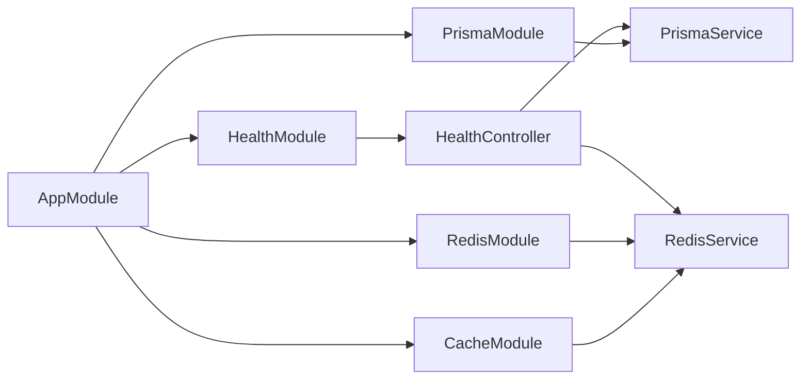

# 健康监控系统

<cite>
**本文引用的文件**
- [apps/nestjs-server/src/modules/health/health.controller.ts](file://apps/nestjs-server/src/modules/health/health.controller.ts)
- [apps/nestjs-server/src/modules/health/health.module.ts](file://apps/nestjs-server/src/modules/health/health.module.ts)
- [apps/web/src/api/modules/health/api.ts](file://apps/web/src/api/modules/health/api.ts)
- [apps/web/src/api/modules/health/hooks.ts](file://apps/web/src/api/modules/health/hooks.ts)
- [apps/nestjs-server/src/common/decorators/api-success-response.decorator.ts](file://apps/nestjs-server/src/common/decorators/api-success-response.decorator.ts)
- [apps/nestjs-server/src/common/interceptors/transform.interceptor.ts](file://apps/nestjs-server/src/common/interceptors/transform.interceptor.ts)
- [apps/nestjs-server/src/common/filters/http-exception.filter.ts](file://apps/nestjs-server/src/common/filters/http-exception.filter.ts)
- [apps/nestjs-server/src/common/dto/api-response.dto.ts](file://apps/nestjs-server/src/common/dto/api-response.dto.ts)
- [apps/nestjs-server/src/common/dto/api-error-response.dto.ts](file://apps/nestjs-server/src/common/dto/api-error-response.dto.ts)
- [apps/nestjs-server/src/common/decorators/response-message.decorator.ts](file://apps/nestjs-server/src/common/decorators/response-message.decorator.ts)
- [apps/nestjs-server/src/app.module.ts](file://apps/nestjs-server/src/app.module.ts)
- [apps/nestjs-server/src/prisma/prisma.service.ts](file://apps/nestjs-server/src/prisma/prisma.service.ts)
- [apps/nestjs-server/src/modules/redis/redis.service.ts](file://apps/nestjs-server/src/modules/redis/redis.service.ts)
- [apps/nestjs-server/src/modules/redis/redis.module.ts](file://apps/nestjs-server/src/modules/redis/redis.module.ts)
- [apps/nestjs-server/src/modules/cache/cache.module.ts](file://apps/nestjs-server/src/modules/cache/cache.module.ts)
- [apps/nestjs-server/src/config/schemas/redis.schema.ts](file://apps/nestjs-server/src/config/schemas/redis.schema.ts)
</cite>

## 目录
1. [简介](#简介)
2. [项目结构](#项目结构)
3. [核心组件](#核心组件)
4. [架构总览](#架构总览)
5. [详细组件分析](#详细组件分析)
6. [依赖关系分析](#依赖关系分析)
7. [性能考量](#性能考量)
8. [故障排查指南](#故障排查指南)
9. [结论](#结论)
10. [附录](#附录)

## 简介
本文件面向健康监控系统，围绕健康检查接口的实现原理展开，覆盖应用状态检测、依赖服务验证与性能指标采集；详解健康检查控制器的实现与扩展点，阐述 API 响应装饰器如何统一成功响应格式与错误处理；说明监控指标的收集与报告机制，并给出自动化集成、告警与故障恢复策略建议。文档同时提供生产环境监控、日志分析与性能调优的最佳实践。

## 项目结构
健康监控系统主要由以下部分组成：
- 后端 NestJS 服务：提供健康检查与 Ping 接口，统一响应包装与错误处理。
- 前端 Web 应用：消费健康检查接口，进行轮询展示与状态联动。
- Redis 与数据库：作为健康检查的核心依赖，分别用于缓存与持久化存储。
- 配置体系：集中管理 Redis 等外部依赖的连接参数与行为。

图表来源
- [apps/web/src/api/modules/health/hooks.ts:1-11](file://apps/web/src/api/modules/health/hooks.ts#L1-L11)
- [apps/web/src/api/modules/health/api.ts:1-26](file://apps/web/src/api/modules/health/api.ts#L1-L26)
- [apps/nestjs-server/src/modules/health/health.controller.ts:1-99](file://apps/nestjs-server/src/modules/health/health.controller.ts#L1-L99)
- [apps/nestjs-server/src/common/interceptors/transform.interceptor.ts:1-36](file://apps/nestjs-server/src/common/interceptors/transform.interceptor.ts#L1-L36)
- [apps/nestjs-server/src/common/filters/http-exception.filter.ts:1-208](file://apps/nestjs-server/src/common/filters/http-exception.filter.ts#L1-L208)
- [apps/nestjs-server/src/prisma/prisma.service.ts:1-36](file://apps/nestjs-server/src/prisma/prisma.service.ts#L1-L36)
- [apps/nestjs-server/src/modules/redis/redis.service.ts:1-150](file://apps/nestjs-server/src/modules/redis/redis.service.ts#L1-L150)

章节来源
- [apps/nestjs-server/src/modules/health/health.controller.ts:1-99](file://apps/nestjs-server/src/modules/health/health.controller.ts#L1-L99)
- [apps/nestjs-server/src/modules/health/health.module.ts:1-10](file://apps/nestjs-server/src/modules/health/health.module.ts#L1-L10)
- [apps/web/src/api/modules/health/api.ts:1-26](file://apps/web/src/api/modules/health/api.ts#L1-L26)
- [apps/web/src/api/modules/health/hooks.ts:1-11](file://apps/web/src/api/modules/health/hooks.ts#L1-L11)

## 核心组件
- 健康控制器：提供健康检查与 Ping 接口，聚合数据库与 Redis 的连接状态，计算服务运行时长与时间戳。
- 响应装饰器与拦截器：统一成功响应结构，自动包裹 code/message/data；错误通过全局异常过滤器转换为业务错误码与消息。
- Redis 服务：支持懒加载、后台连接、指数退避重连与连接超时控制，提供 ping 检测能力。
- 数据库服务：基于 Prisma 初始化连接，支持 SQLite 与 PostgreSQL，用于健康检查中的数据库连通性验证。
- 前端健康接口封装：使用 Zod Schema 校验响应，结合 React Query 进行轮询与状态展示。

章节来源
- [apps/nestjs-server/src/modules/health/health.controller.ts:58-76](file://apps/nestjs-server/src/modules/health/health.controller.ts#L58-L76)
- [apps/nestjs-server/src/common/decorators/api-success-response.decorator.ts:70-126](file://apps/nestjs-server/src/common/decorators/api-success-response.decorator.ts#L70-L126)
- [apps/nestjs-server/src/common/interceptors/transform.interceptor.ts:13-34](file://apps/nestjs-server/src/common/interceptors/transform.interceptor.ts#L13-L34)
- [apps/nestjs-server/src/common/filters/http-exception.filter.ts:16-68](file://apps/nestjs-server/src/common/filters/http-exception.filter.ts#L16-L68)
- [apps/nestjs-server/src/modules/redis/redis.service.ts:84-92](file://apps/nestjs-server/src/modules/redis/redis.service.ts#L84-L92)
- [apps/nestjs-server/src/prisma/prisma.service.ts:28-34](file://apps/nestjs-server/src/prisma/prisma.service.ts#L28-L34)
- [apps/web/src/api/modules/health/api.ts:5-25](file://apps/web/src/api/modules/health/api.ts#L5-L25)

## 架构总览
健康检查的整体流程如下：
- 前端通过 React Query 定期拉取健康状态。
- 后端控制器并发检查数据库与 Redis 的连通性。
- 成功响应经由拦截器统一包装；错误由异常过滤器转换为业务错误码。
- Redis 服务采用懒加载与后台连接策略，提升启动性能与稳定性。

图表来源
- [apps/web/src/api/modules/health/api.ts:19-21](file://apps/web/src/api/modules/health/api.ts#L19-L21)
- [apps/nestjs-server/src/modules/health/health.controller.ts:58-76](file://apps/nestjs-server/src/modules/health/health.controller.ts#L58-L76)
- [apps/nestjs-server/src/common/interceptors/transform.interceptor.ts:13-34](file://apps/nestjs-server/src/common/interceptors/transform.interceptor.ts#L13-L34)
- [apps/nestjs-server/src/common/filters/http-exception.filter.ts:16-68](file://apps/nestjs-server/src/common/filters/http-exception.filter.ts#L16-L68)

## 详细组件分析

### 健康控制器实现与扩展
- 并发检查策略：使用 Promise.all 并发执行数据库与 Redis 的连通性检查，缩短整体耗时。
- 状态聚合：根据数据库与 Redis 的检查结果，计算整体健康状态与降级标记。
- 指标采集：返回当前时间戳与进程运行时长，便于外部系统进行存活与性能观测。
- 可扩展性：可通过注入更多依赖服务并在同一控制器内扩展检查逻辑，实现“多依赖服务验证”。

图表来源
- [apps/nestjs-server/src/modules/health/health.controller.ts:58-76](file://apps/nestjs-server/src/modules/health/health.controller.ts#L58-L76)

章节来源
- [apps/nestjs-server/src/modules/health/health.controller.ts:18-76](file://apps/nestjs-server/src/modules/health/health.controller.ts#L18-L76)

### API 响应装饰器与拦截器
- 统一成功响应：通过 ApiSuccessResponse 装饰器与响应拦截器，将业务返回值自动包装为 { code, message, data? } 结构，保证前后端一致性。
- 无数据响应：ApiSuccessNoDataResponse 支持仅返回状态信息的场景。
- 全局错误处理：HttpExceptionFilter 将 HttpException 映射为业务错误码与消息，记录日志并返回统一错误结构。

图表来源
- [apps/nestjs-server/src/common/interceptors/transform.interceptor.ts:13-34](file://apps/nestjs-server/src/common/interceptors/transform.interceptor.ts#L13-L34)
- [apps/nestjs-server/src/common/decorators/api-success-response.decorator.ts:70-126](file://apps/nestjs-server/src/common/decorators/api-success-response.decorator.ts#L70-L126)
- [apps/nestjs-server/src/common/filters/http-exception.filter.ts:16-68](file://apps/nestjs-server/src/common/filters/http-exception.filter.ts#L16-L68)
- [apps/nestjs-server/src/common/dto/api-error-response.dto.ts:1-11](file://apps/nestjs-server/src/common/dto/api-error-response.dto.ts#L1-L11)

章节来源
- [apps/nestjs-server/src/common/interceptors/transform.interceptor.ts:13-34](file://apps/nestjs-server/src/common/interceptors/transform.interceptor.ts#L13-L34)
- [apps/nestjs-server/src/common/decorators/api-success-response.decorator.ts:70-126](file://apps/nestjs-server/src/common/decorators/api-success-response.decorator.ts#L70-L126)
- [apps/nestjs-server/src/common/filters/http-exception.filter.ts:16-68](file://apps/nestjs-server/src/common/filters/http-exception.filter.ts#L16-L68)
- [apps/nestjs-server/src/common/dto/api-response.dto.ts:1-14](file://apps/nestjs-server/src/common/dto/api-response.dto.ts#L1-L14)
- [apps/nestjs-server/src/common/dto/api-error-response.dto.ts:1-11](file://apps/nestjs-server/src/common/dto/api-error-response.dto.ts#L1-L11)
- [apps/nestjs-server/src/common/decorators/response-message.decorator.ts:1-5](file://apps/nestjs-server/src/common/decorators/response-message.decorator.ts#L1-L5)

### Redis 服务与数据库服务
- Redis 服务：支持懒加载、后台连接、连接超时与最大重试次数控制；提供 ping 方法用于健康检查。
- 数据库服务：基于 Prisma 初始化连接，支持 SQLite 与 PostgreSQL，用于健康检查中的数据库连通性验证。

图表来源
- [apps/nestjs-server/src/modules/redis/redis.service.ts:18-147](file://apps/nestjs-server/src/modules/redis/redis.service.ts#L18-L147)
- [apps/nestjs-server/src/prisma/prisma.service.ts:6-35](file://apps/nestjs-server/src/prisma/prisma.service.ts#L6-L35)
- [apps/nestjs-server/src/modules/health/health.controller.ts:13-16](file://apps/nestjs-server/src/modules/health/health.controller.ts#L13-L16)

章节来源
- [apps/nestjs-server/src/modules/redis/redis.service.ts:84-92](file://apps/nestjs-server/src/modules/redis/redis.service.ts#L84-L92)
- [apps/nestjs-server/src/prisma/prisma.service.ts:28-34](file://apps/nestjs-server/src/prisma/prisma.service.ts#L28-L34)

### 前端健康接口封装与轮询
- 健康状态与 Ping 接口封装：使用 Zod Schema 校验响应结构，确保类型安全。
- React Query 钩子：定期轮询健康状态，便于前端展示与联动。

图表来源
- [apps/web/src/api/modules/health/hooks.ts:4-10](file://apps/web/src/api/modules/health/hooks.ts#L4-L10)
- [apps/web/src/api/modules/health/api.ts:19-25](file://apps/web/src/api/modules/health/api.ts#L19-L25)

章节来源
- [apps/web/src/api/modules/health/api.ts:5-25](file://apps/web/src/api/modules/health/api.ts#L5-L25)
- [apps/web/src/api/modules/health/hooks.ts:1-11](file://apps/web/src/api/modules/health/hooks.ts#L1-L11)

## 依赖关系分析
- 模块装配：AppModule 注册 HealthModule、RedisModule、CacheModule、PrismaModule 等，形成健康检查所需的依赖生态。
- 依赖注入：HealthController 通过构造函数注入 PrismaService 与 RedisService，实现解耦与可测试性。
- 配置驱动：Redis 配置通过 TypedConfigService 读取，支持 host/port/password/db/keyPrefix/connectTimeout/maxRetries/lazyConnect 等参数。

图表来源
- [apps/nestjs-server/src/app.module.ts:19-62](file://apps/nestjs-server/src/app.module.ts#L19-L62)
- [apps/nestjs-server/src/modules/health/health.module.ts:5-9](file://apps/nestjs-server/src/modules/health/health.module.ts#L5-L9)
- [apps/nestjs-server/src/modules/redis/redis.module.ts:4-8](file://apps/nestjs-server/src/modules/redis/redis.module.ts#L4-L8)
- [apps/nestjs-server/src/modules/cache/cache.module.ts:6-20](file://apps/nestjs-server/src/modules/cache/cache.module.ts#L6-L20)
- [apps/nestjs-server/src/prisma/prisma.service.ts:10-26](file://apps/nestjs-server/src/prisma/prisma.service.ts#L10-L26)

章节来源
- [apps/nestjs-server/src/app.module.ts:19-62](file://apps/nestjs-server/src/app.module.ts#L19-L62)
- [apps/nestjs-server/src/modules/health/health.module.ts:5-9](file://apps/nestjs-server/src/modules/health/health.module.ts#L5-L9)
- [apps/nestjs-server/src/modules/redis/redis.module.ts:4-8](file://apps/nestjs-server/src/modules/redis/redis.module.ts#L4-L8)
- [apps/nestjs-server/src/modules/cache/cache.module.ts:6-20](file://apps/nestjs-server/src/modules/cache/cache.module.ts#L6-L20)
- [apps/nestjs-server/src/config/schemas/redis.schema.ts:3-15](file://apps/nestjs-server/src/config/schemas/redis.schema.ts#L3-L15)

## 性能考量
- 并发检查：健康检查使用 Promise.all 并发验证数据库与 Redis，降低总耗时。
- 懒加载与后台连接：RedisService 支持懒加载与后台连接，避免阻塞应用启动。
- 指数退避与重试上限：连接失败采用指数退避策略并设置最大重试次数，防止资源浪费。
- 连接超时控制：通过 connectTimeout 控制单次连接尝试的超时时间，提升稳定性。
- 响应拦截：统一响应包装减少重复逻辑，提高序列化效率。

章节来源
- [apps/nestjs-server/src/modules/health/health.controller.ts:58-62](file://apps/nestjs-server/src/modules/health/health.controller.ts#L58-L62)
- [apps/nestjs-server/src/modules/redis/redis.service.ts:106-114](file://apps/nestjs-server/src/modules/redis/redis.service.ts#L106-L114)
- [apps/nestjs-server/src/modules/redis/redis.service.ts:132-147](file://apps/nestjs-server/src/modules/redis/redis.service.ts#L132-L147)

## 故障排查指南
- 健康检查返回降级：检查数据库与 Redis 的连通性；确认连接参数与网络可达性。
- Redis 连接失败：查看连接超时、重试次数与懒加载配置；关注日志中的错误信息。
- 数据库连接问题：确认 Prisma 初始化参数与数据库服务状态。
- 响应格式异常：检查响应拦截器与装饰器是否正确应用；核对 Zod Schema 与后端返回结构。
- 错误码映射：异常过滤器会将 HTTP 状态映射为业务错误码，便于定位问题类型。

章节来源
- [apps/nestjs-server/src/common/filters/http-exception.filter.ts:16-68](file://apps/nestjs-server/src/common/filters/http-exception.filter.ts#L16-L68)
- [apps/nestjs-server/src/modules/redis/redis.service.ts:116-122](file://apps/nestjs-server/src/modules/redis/redis.service.ts#L116-L122)
- [apps/nestjs-server/src/prisma/prisma.service.ts:28-34](file://apps/nestjs-server/src/prisma/prisma.service.ts#L28-L34)

## 结论
健康监控系统通过并发检查数据库与 Redis、统一响应包装与错误处理，实现了稳定可靠的健康检查能力。结合前端轮询与配置化的 Redis 参数，可在生产环境中快速落地自动化集成、告警与故障恢复策略。建议在实际部署中进一步扩展指标采集维度（如内存、CPU、QPS 等），并完善告警阈值与自愈机制以提升系统韧性。

## 附录

### 监控指标与报告机制
- 健康状态：ok/degraded，用于表达整体健康状况。
- 时间戳与运行时长：用于存活检测与性能观测。
- 依赖状态：database/redis 的 connected/disconnected，用于表达关键依赖可用性。
- 日志与错误：异常过滤器记录错误上下文，便于问题追踪。

章节来源
- [apps/nestjs-server/src/modules/health/health.controller.ts:69-75](file://apps/nestjs-server/src/modules/health/health.controller.ts#L69-L75)
- [apps/nestjs-server/src/common/filters/http-exception.filter.ts:18-67](file://apps/nestjs-server/src/common/filters/http-exception.filter.ts#L18-L67)

### 自定义检查器与扩展建议
- 新增依赖检查：在 HealthController 中注入新的服务实例，仿照数据库与 Redis 的检查方式添加新字段与状态判断。
- 指标采集：在控制器中扩展返回对象，加入内存使用、CPU 负载等指标（需引入系统级指标采集库）。
- 告警与恢复：结合外部监控平台（如 Prometheus/Grafana/PagerDuty）设置阈值与告警规则，必要时触发自动恢复脚本或扩缩容策略。

章节来源
- [apps/nestjs-server/src/modules/health/health.controller.ts:58-76](file://apps/nestjs-server/src/modules/health/health.controller.ts#L58-L76)

### 生产环境监控、日志分析与性能调优
- 连接参数优化：合理设置 Redis 的 connectTimeout、maxRetries 与 lazyConnect，平衡启动速度与稳定性。
- 健康检查频率：前端轮询间隔建议不低于 30 秒，避免对后端造成压力。
- 日志级别：在生产环境适当提高日志级别，聚焦错误与关键事件。
- 性能调优：优先优化慢查询与热点键；结合缓存命中率与延迟指标进行针对性优化。

章节来源
- [apps/nestjs-server/src/config/schemas/redis.schema.ts:3-15](file://apps/nestjs-server/src/config/schemas/redis.schema.ts#L3-L15)
- [apps/web/src/api/modules/health/hooks.ts:8](file://apps/web/src/api/modules/health/hooks.ts#L8)