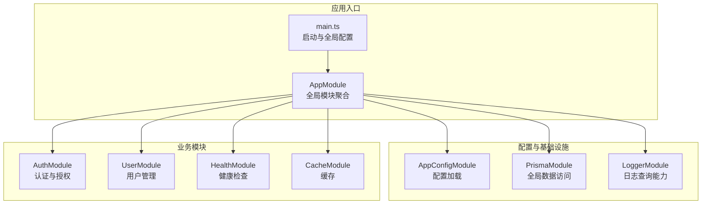
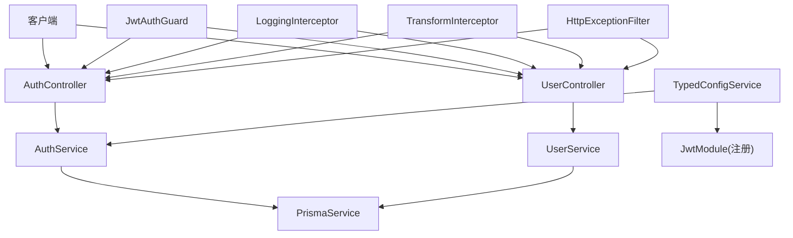
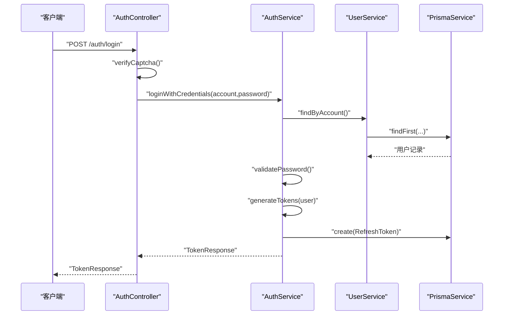
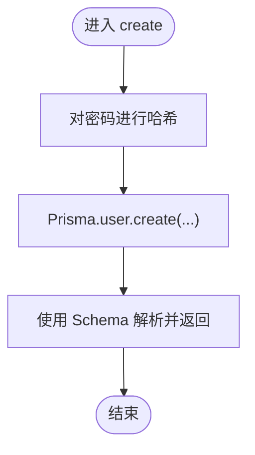
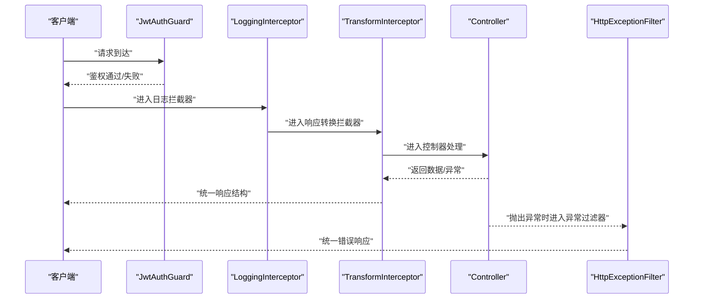
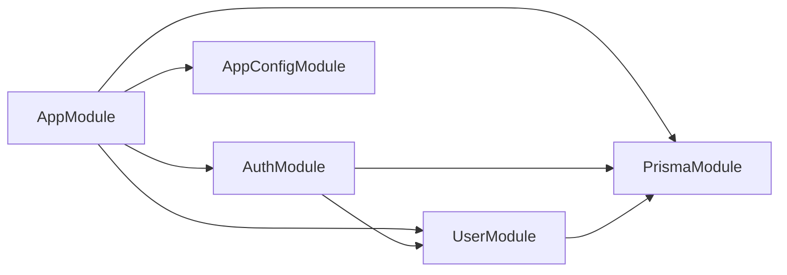

# 后端系统

<cite>
**本文引用的文件**
- [apps/nestjs-server/src/main.ts](file://apps/nestjs-server/src/main.ts)
- [apps/nestjs-server/src/app.module.ts](file://apps/nestjs-server/src/app.module.ts)
- [apps/nestjs-server/src/config/config.module.ts](file://apps/nestjs-server/src/config/config.module.ts)
- [apps/nestjs-server/src/prisma/prisma.module.ts](file://apps/nestjs-server/src/prisma/prisma.module.ts)
- [apps/nestjs-server/src/modules/auth/auth.module.ts](file://apps/nestjs-server/src/modules/auth/auth.module.ts)
- [apps/nestjs-server/src/modules/auth/auth.controller.ts](file://apps/nestjs-server/src/modules/auth/auth.controller.ts)
- [apps/nestjs-server/src/modules/auth/auth.service.ts](file://apps/nestjs-server/src/modules/auth/auth.service.ts)
- [apps/nestjs-server/src/modules/user/user.module.ts](file://apps/nestjs-server/src/modules/user/user.module.ts)
- [apps/nestjs-server/src/modules/user/user.service.ts](file://apps/nestjs-server/src/modules/user/user.service.ts)
- [apps/nestjs-server/src/common/guards/jwt-auth.guard.ts](file://apps/nestjs-server/src/common/guards/jwt-auth.guard.ts)
- [apps/nestjs-server/src/common/decorators/public.decorator.ts](file://apps/nestjs-server/src/common/decorators/public.decorator.ts)
- [apps/nestjs-server/src/common/interceptors/logging.interceptor.ts](file://apps/nestjs-server/src/common/interceptors/logging.interceptor.ts)
- [apps/nestjs-server/src/common/interceptors/transform.interceptor.ts](file://apps/nestjs-server/src/common/interceptors/transform.interceptor.ts)
- [apps/nestjs-server/src/common/filters/http-exception.filter.ts](file://apps/nestjs-server/src/common/filters/http-exception.filter.ts)
- [apps/nestjs-server/src/modules/logger/logger.module.ts](file://apps/nestjs-server/src/modules/logger/logger.module.ts)
</cite>

## 目录
1. [引言](#引言)
2. [项目结构](#项目结构)
3. [核心组件](#核心组件)
4. [架构总览](#架构总览)
5. [详细组件分析](#详细组件分析)
6. [依赖分析](#依赖分析)
7. [性能考虑](#性能考虑)
8. [故障排查指南](#故障排查指南)
9. [结论](#结论)
10. [附录](#附录)

## 引言
本文件面向基于 NestJS 的后端系统，系统采用模块化设计与依赖注入机制，结合中间件与拦截器体系，构建了认证授权、数据访问与业务逻辑分层清晰的服务端架构。本文从整体架构、模块职责、数据流与处理逻辑、配置与日志、错误处理与性能监控等方面进行深入解析，并提供最佳实践与排障建议。

## 项目结构
后端以 NestJS 应用为核心，采用“按功能域”组织模块，核心模块包括认证、用户、健康检查、缓存、日志与配置等；数据访问通过 Prisma 实现；全局中间件与拦截器在应用级装配，确保统一的请求处理与响应格式。

图表来源
- [apps/nestjs-server/src/main.ts:1-47](file://apps/nestjs-server/src/main.ts#L1-L47)
- [apps/nestjs-server/src/app.module.ts:18-61](file://apps/nestjs-server/src/app.module.ts#L18-L61)
- [apps/nestjs-server/src/config/config.module.ts:1-20](file://apps/nestjs-server/src/config/config.module.ts#L1-L20)
- [apps/nestjs-server/src/prisma/prisma.module.ts:1-10](file://apps/nestjs-server/src/prisma/prisma.module.ts#L1-L10)
- [apps/nestjs-server/src/modules/logger/logger.module.ts:1-9](file://apps/nestjs-server/src/modules/logger/logger.module.ts#L1-L9)

章节来源
- [apps/nestjs-server/src/main.ts:1-47](file://apps/nestjs-server/src/main.ts#L1-L47)
- [apps/nestjs-server/src/app.module.ts:18-61](file://apps/nestjs-server/src/app.module.ts#L18-L61)

## 核心组件
- 应用入口与启动：负责创建 Nest 应用实例、启用关闭钩子、设置全局前缀、CORS、Swagger 文档以及日志记录器。
- 全局模块聚合：集中导入配置、限流、缓存、Prisma、认证、用户、健康检查与日志模块，并注册全局守卫、拦截器、验证管道与异常过滤器。
- 认证模块：提供验证码、注册、登录、刷新令牌与登出等接口，集成 JWT 与策略。
- 用户模块：提供用户增删改查与账号查询等服务。
- 数据访问层：Prisma 作为 ORM，提供类型安全的数据读写。
- 中间件与拦截器：统一日志记录、响应结构转换与异常过滤。
- 配置管理：基于 @nestjs/config 的类型化配置服务，支持命名空间访问与运行时加载。

章节来源
- [apps/nestjs-server/src/main.ts:9-44](file://apps/nestjs-server/src/main.ts#L9-L44)
- [apps/nestjs-server/src/app.module.ts:18-61](file://apps/nestjs-server/src/app.module.ts#L18-L61)
- [apps/nestjs-server/src/config/config.module.ts:6-19](file://apps/nestjs-server/src/config/config.module.ts#L6-L19)

## 架构总览
系统采用“控制器-服务-仓储/数据访问”的分层设计，认证授权通过 JWT 守卫与策略实现，全局拦截器统一输出结构，异常过滤器统一错误响应，配置模块提供类型化配置。

图表来源
- [apps/nestjs-server/src/modules/auth/auth.controller.ts:30-115](file://apps/nestjs-server/src/modules/auth/auth.controller.ts#L30-L115)
- [apps/nestjs-server/src/modules/auth/auth.service.ts:14-151](file://apps/nestjs-server/src/modules/auth/auth.service.ts#L14-L151)
- [apps/nestjs-server/src/modules/user/user.service.ts:13-113](file://apps/nestjs-server/src/modules/user/user.service.ts#L13-L113)
- [apps/nestjs-server/src/common/guards/jwt-auth.guard.ts:17-43](file://apps/nestjs-server/src/common/guards/jwt-auth.guard.ts#L17-L43)
- [apps/nestjs-server/src/common/interceptors/logging.interceptor.ts:6-30](file://apps/nestjs-server/src/common/interceptors/logging.interceptor.ts#L6-L30)
- [apps/nestjs-server/src/common/interceptors/transform.interceptor.ts:9-36](file://apps/nestjs-server/src/common/interceptors/transform.interceptor.ts#L9-L36)
- [apps/nestjs-server/src/common/filters/http-exception.filter.ts:16-68](file://apps/nestjs-server/src/common/filters/http-exception.filter.ts#L16-L68)
- [apps/nestjs-server/src/modules/auth/auth.module.ts:12-35](file://apps/nestjs-server/src/modules/auth/auth.module.ts#L12-L35)

## 详细组件分析

### 认证模块（Auth）
- 职责与边界
  - 提供验证码生成与校验、注册、登录、刷新令牌与登出等接口。
  - 通过 AuthService 执行业务逻辑，依赖 UserService 与 PrismaService。
- 关键流程
  - 登录：先校验验证码，再根据账号与密码查找用户并校验密码，最后生成访问与刷新令牌并持久化刷新令牌。
  - 刷新：对传入刷新令牌进行哈希比对，确认未撤销且未过期后，撤销旧令牌并发放新令牌。
  - 注册：前置校验邮箱与用户名唯一性，创建用户并返回令牌。
  - 登出：撤销当前用户所有未撤销的刷新令牌。
- 依赖关系
  - JwtModule 通过配置服务动态注册，签名选项包含过期时间。
  - CaptchaService 用于验证码生成与校验。
- 接口与装饰器
  - 使用 @Public 装饰器允许匿名访问特定接口。
  - 使用 @Throttle 控制接口频率。
  - 使用 @ApiSuccessResponse/@ApiGlobalErrors 统一响应结构与文档注解。

图表来源
- [apps/nestjs-server/src/modules/auth/auth.controller.ts:63-76](file://apps/nestjs-server/src/modules/auth/auth.controller.ts#L63-L76)
- [apps/nestjs-server/src/modules/auth/auth.service.ts:29-37](file://apps/nestjs-server/src/modules/auth/auth.service.ts#L29-L37)
- [apps/nestjs-server/src/modules/user/user.service.ts:70-77](file://apps/nestjs-server/src/modules/user/user.service.ts#L70-L77)

章节来源
- [apps/nestjs-server/src/modules/auth/auth.controller.ts:30-115](file://apps/nestjs-server/src/modules/auth/auth.controller.ts#L30-L115)
- [apps/nestjs-server/src/modules/auth/auth.service.ts:14-151](file://apps/nestjs-server/src/modules/auth/auth.service.ts#L14-L151)
- [apps/nestjs-server/src/modules/auth/auth.module.ts:12-35](file://apps/nestjs-server/src/modules/auth/auth.module.ts#L12-L35)

### 用户模块（User）
- 职责与边界
  - 提供用户创建、查询列表、单个查询、更新与删除等操作。
  - 密码加密与账号唯一性校验由上层（如 AuthService）前置处理，此处依赖数据库唯一约束。
- 关键流程
  - 创建：对明文密码进行哈希，写入数据库并返回标准化用户响应。
  - 查询：支持按 ID、邮箱、用户名与账号（邮箱或用户名）查询。
  - 更新/删除：先校验资源存在性，再执行更新/删除。
- 数据选择
  - 使用 select 精准投影字段，避免敏感信息泄露。

图表来源
- [apps/nestjs-server/src/modules/user/user.service.ts:17-31](file://apps/nestjs-server/src/modules/user/user.service.ts#L17-L31)

章节来源
- [apps/nestjs-server/src/modules/user/user.service.ts:13-113](file://apps/nestjs-server/src/modules/user/user.service.ts#L13-L113)
- [apps/nestjs-server/src/modules/user/user.module.ts:1-11](file://apps/nestjs-server/src/modules/user/user.module.ts#L1-L11)

### 数据访问层（Prisma）
- 设计要点
  - 以 PrismaService 为中心，提供类型安全的数据访问。
  - 在 PrismaModule 中声明为全局模块，便于跨模块注入。
- 复杂度与性能
  - 查询复杂度取决于数据库索引与查询条件；建议在高频字段建立索引。
  - 使用 select 精准投影减少网络与序列化开销。

章节来源
- [apps/nestjs-server/src/prisma/prisma.module.ts:1-10](file://apps/nestjs-server/src/prisma/prisma.module.ts#L1-L10)

### 中间件与拦截器
- 日志拦截器（LoggingInterceptor）
  - 记录请求方法、URL、用户标识、IP、UA 与耗时，统一输出到 HTTP 日志通道。
- 响应转换拦截器（TransformInterceptor）
  - 将控制器返回值包装为统一响应结构，自动注入业务码与消息，支持自定义响应消息。
- 全局装配
  - 在 AppModule 中注册为全局拦截器，确保所有请求均被处理。

图表来源
- [apps/nestjs-server/src/common/guards/jwt-auth.guard.ts:17-43](file://apps/nestjs-server/src/common/guards/jwt-auth.guard.ts#L17-L43)
- [apps/nestjs-server/src/common/interceptors/logging.interceptor.ts:6-30](file://apps/nestjs-server/src/common/interceptors/logging.interceptor.ts#L6-L30)
- [apps/nestjs-server/src/common/interceptors/transform.interceptor.ts:9-36](file://apps/nestjs-server/src/common/interceptors/transform.interceptor.ts#L9-L36)
- [apps/nestjs-server/src/common/filters/http-exception.filter.ts:16-68](file://apps/nestjs-server/src/common/filters/http-exception.filter.ts#L16-L68)

章节来源
- [apps/nestjs-server/src/common/interceptors/logging.interceptor.ts:6-30](file://apps/nestjs-server/src/common/interceptors/logging.interceptor.ts#L6-L30)
- [apps/nestjs-server/src/common/interceptors/transform.interceptor.ts:9-36](file://apps/nestjs-server/src/common/interceptors/transform.interceptor.ts#L9-L36)
- [apps/nestjs-server/src/common/filters/http-exception.filter.ts:16-68](file://apps/nestjs-server/src/common/filters/http-exception.filter.ts#L16-L68)

### 守卫与装饰器
- JwtAuthGuard
  - 基于 Passport 的 JWT 守卫，结合反射器判断是否为公开接口；非公开接口鉴权失败时抛出业务异常。
- Public 装饰器
  - 通过元数据标记接口为公开，绕过 JwtAuthGuard。

章节来源
- [apps/nestjs-server/src/common/guards/jwt-auth.guard.ts:17-43](file://apps/nestjs-server/src/common/guards/jwt-auth.guard.ts#L17-L43)
- [apps/nestjs-server/src/common/decorators/public.decorator.ts:1-5](file://apps/nestjs-server/src/common/decorators/public.decorator.ts#L1-L5)

### 配置管理
- AppConfigModule
  - 使用 @nestjs/config 加载配置，支持命名空间访问与忽略环境文件（生产环境）。
- TypedConfigService
  - 提供类型化读取能力，便于在模块中按命名空间获取配置（如 app、jwt、logger 等）。

章节来源
- [apps/nestjs-server/src/config/config.module.ts:6-19](file://apps/nestjs-server/src/config/config.module.ts#L6-L19)

### 错误处理与统一响应
- HttpExceptionFilter
  - 将业务异常、HTTP 异常、Zod 校验异常与 JSON 解析错误统一映射为业务码与消息，支持可选 details。
  - 对业务异常记录告警日志，其他异常记录警告日志。
- 全局装配
  - 在 AppModule 中注册为全局异常过滤器。

章节来源
- [apps/nestjs-server/src/common/filters/http-exception.filter.ts:16-208](file://apps/nestjs-server/src/common/filters/http-exception.filter.ts#L16-L208)
- [apps/nestjs-server/src/app.module.ts:54-57](file://apps/nestjs-server/src/app.module.ts#L54-L57)

## 依赖分析
- 模块耦合
  - AppModule 作为全局聚合模块，集中导入各功能模块与基础设施模块。
  - AuthModule 依赖 UserModule 与 PrismaService；UserModule 仅依赖 PrismaService。
  - 全局守卫、拦截器与过滤器在 AppModule 中统一注册，降低控制器侧样板代码。
- 外部依赖
  - JWT 签名与验证、Passport 策略、Zod 校验管道、Swagger 文档、Throttler 限流。
- 可能的循环依赖
  - 当前模块导入关系为单向（AppModule -> 各模块），未见循环依赖迹象。

图表来源
- [apps/nestjs-server/src/app.module.ts:18-32](file://apps/nestjs-server/src/app.module.ts#L18-L32)
- [apps/nestjs-server/src/modules/auth/auth.module.ts:12-32](file://apps/nestjs-server/src/modules/auth/auth.module.ts#L12-L32)
- [apps/nestjs-server/src/modules/user/user.module.ts:1-11](file://apps/nestjs-server/src/modules/user/user.module.ts#L1-L11)

章节来源
- [apps/nestjs-server/src/app.module.ts:18-32](file://apps/nestjs-server/src/app.module.ts#L18-L32)

## 性能考虑
- 请求处理链路
  - 全局拦截器与守卫在每个请求上都会执行，建议保持逻辑轻量，必要时引入缓存与限流策略。
- 限流与节流
  - AppModule 已注册 ThrottlerModule 并配置多组限流规则，可在控制器或路由上进一步细化。
- 数据访问
  - 使用 select 精准投影字段，避免不必要的列传输；对高频查询建立数据库索引。
- 日志与监控
  - LoggingInterceptor 输出请求耗时与状态码，建议结合外部日志系统与指标采集工具进行聚合分析。

## 故障排查指南
- 认证相关
  - 登录失败：检查账号是否存在、密码是否正确、验证码是否有效。
  - 刷新令牌失败：确认刷新令牌未撤销、未过期，旧令牌已被正确撤销。
  - 登出后仍可使用：检查是否正确撤销用户所有未撤销刷新令牌。
- 响应与格式
  - 控制器返回值未被统一包装：确认 TransformInterceptor 是否已注册为全局拦截器。
  - 异常未按业务码返回：确认 HttpExceptionFilter 是否注册为全局过滤器。
- 配置问题
  - JWT 过期时间或密钥不生效：检查 TypedConfigService 的命名空间读取与 JwtModule 注册工厂。
- 日志与可观测性
  - 缺少请求日志：确认 LoggingInterceptor 是否生效，以及日志级别配置。

章节来源
- [apps/nestjs-server/src/common/filters/http-exception.filter.ts:28-68](file://apps/nestjs-server/src/common/filters/http-exception.filter.ts#L28-L68)
- [apps/nestjs-server/src/common/interceptors/transform.interceptor.ts:13-34](file://apps/nestjs-server/src/common/interceptors/transform.interceptor.ts#L13-L34)
- [apps/nestjs-server/src/common/guards/jwt-auth.guard.ts:36-41](file://apps/nestjs-server/src/common/guards/jwt-auth.guard.ts#L36-L41)

## 结论
本系统通过模块化设计与依赖注入，实现了清晰的职责分离与高内聚低耦合的架构。认证授权、数据访问与业务逻辑分层明确，配合全局拦截器与异常过滤器，提供了统一的请求处理与响应格式。建议在生产环境中进一步完善限流策略、数据库索引与日志/监控体系，持续优化性能与稳定性。

## 附录
- 最佳实践
  - 控制器仅做参数接收与转发，业务逻辑集中在服务层。
  - 使用 DTO 与 Zod 校验，保证输入一致性与安全性。
  - 使用 select 精准投影字段，避免敏感信息泄露。
  - 对关键操作增加审计日志与指标埋点。
  - 严格区分业务异常与系统异常，前者走业务码，后者走通用错误码。