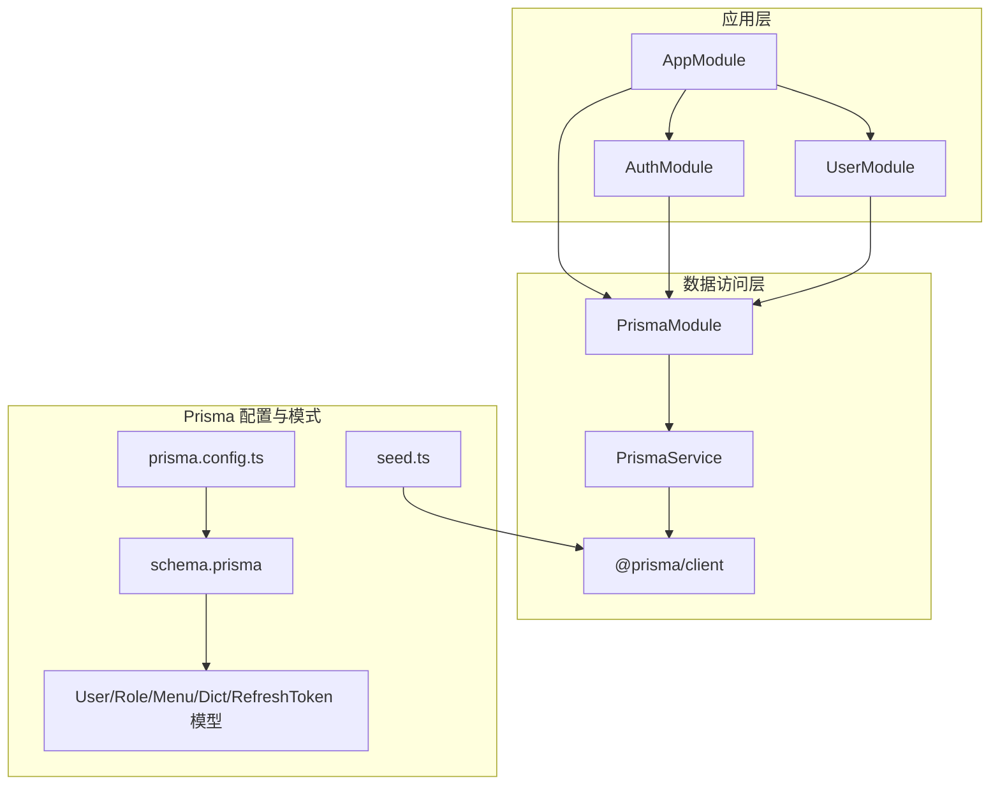
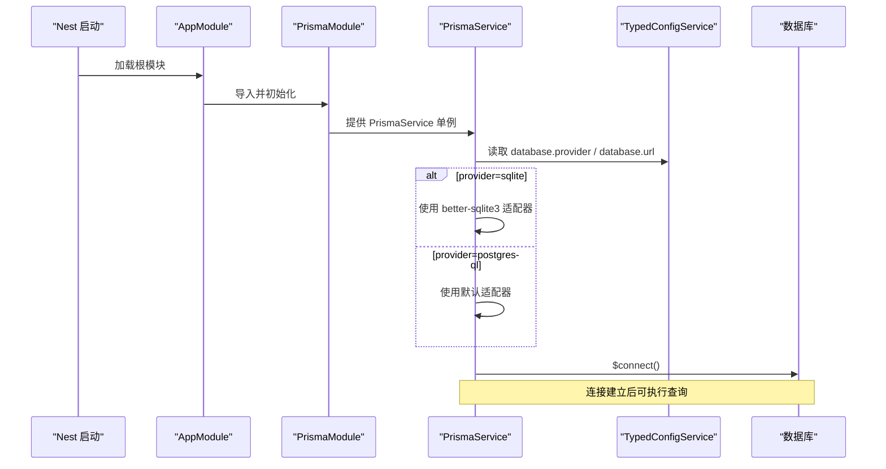
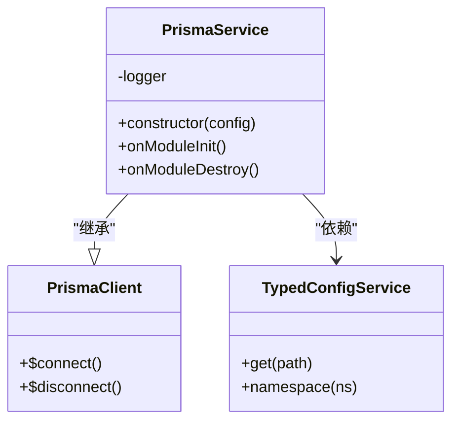
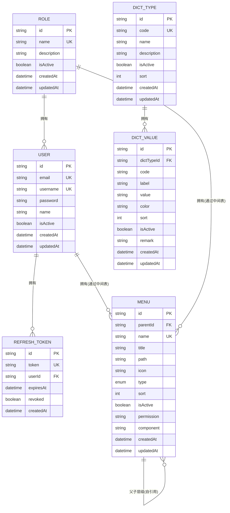
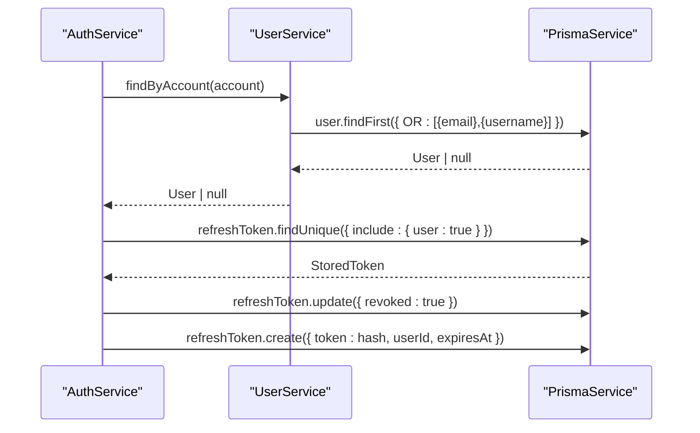
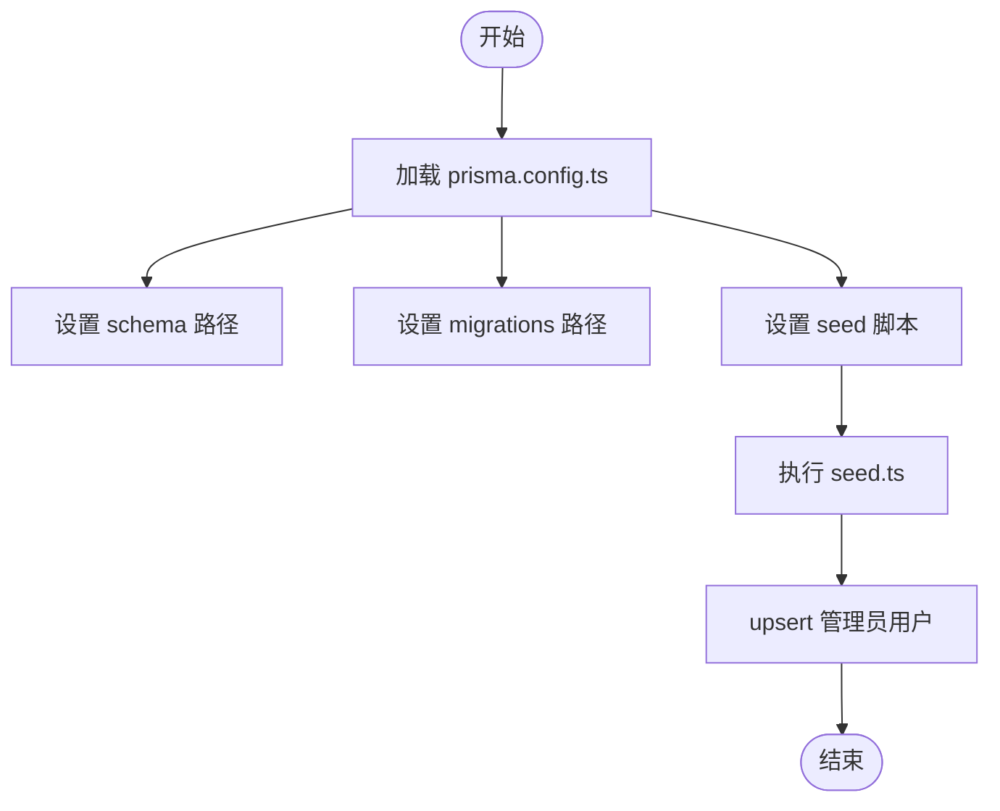
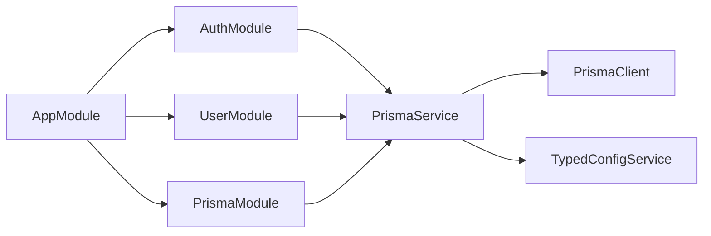

# 数据访问层

<cite>
**本文引用的文件**
- [schema.prisma](file://apps/nestjs-server/prisma/schema.prisma)
- [prisma.config.ts](file://apps/nestjs-server/prisma.config.ts)
- [prisma.service.ts](file://apps/nestjs-server/src/prisma/prisma.service.ts)
- [prisma.module.ts](file://apps/nestjs-server/src/prisma/prisma.module.ts)
- [seed.ts](file://apps/nestjs-server/prisma/seed.ts)
- [User.prisma](file://apps/nestjs-server/prisma/schema/User.prisma)
- [Role.prisma](file://apps/nestjs-server/prisma/schema/Role.prisma)
- [RefreshToken.prisma](file://apps/nestjs-server/prisma/schema/RefreshToken.prisma)
- [Menu.prisma](file://apps/nestjs-server/prisma/schema/Menu.prisma)
- [Dict.prisma](file://apps/nestjs-server/prisma/schema/Dict.prisma)
- [database.schema.ts](file://apps/nestjs-server/src/config/schemas/database.schema.ts)
- [typed-config.service.ts](file://apps/nestjs-server/src/config/typed-config.service.ts)
- [app.module.ts](file://apps/nestjs-server/src/app.module.ts)
- [user.service.ts](file://apps/nestjs-server/src/modules/user/user.service.ts)
- [auth.service.ts](file://apps/nestjs-server/src/modules/auth/auth.service.ts)
- [user.module.ts](file://apps/nestjs-server/src/modules/user/user.module.ts)
- [auth.module.ts](file://apps/nestjs-server/src/modules/auth/auth.module.ts)
- [package.json](file://apps/nestjs-server/package.json)
</cite>

## 目录
1. [简介](#简介)
2. [项目结构](#项目结构)
3. [核心组件](#核心组件)
4. [架构总览](#架构总览)
5. [详细组件分析](#详细组件分析)
6. [依赖分析](#依赖分析)
7. [性能考虑](#性能考虑)
8. [故障排查指南](#故障排查指南)
9. [结论](#结论)
10. [附录](#附录)

## 简介
本文件系统化梳理数据访问层的设计与实现，重点覆盖以下方面：
- Prisma ORM 的配置与使用：数据库连接、模型定义与关系映射、迁移与种子、查询构建器用法
- PrismaService 的实现与依赖注入机制：全局单例、生命周期钩子、适配器选择
- 数据模型设计原则：实体关系、索引优化、约束设置
- 复杂查询、联表操作与聚合统计的实践路径
- 数据库迁移管理、种子数据与性能优化策略
- 事务处理、错误恢复与数据一致性保障
- 完整的数据模型文档、查询示例与最佳实践

## 项目结构
数据访问层相关文件主要分布在以下位置：
- Prisma 配置与模式：apps/nestjs-server/prisma
- Prisma 服务与模块：apps/nestjs-server/src/prisma
- 应用配置与类型化配置服务：apps/nestjs-server/src/config
- 业务模块对 Prisma 的使用：apps/nestjs-server/src/modules/{user,auth}

图表来源
- [app.module.ts:19-62](file://apps/nestjs-server/src/app.module.ts#L19-L62)
- [prisma.module.ts:1-10](file://apps/nestjs-server/src/prisma/prisma.module.ts#L1-L10)
- [prisma.service.ts:1-36](file://apps/nestjs-server/src/prisma/prisma.service.ts#L1-L36)
- [prisma.config.ts:1-14](file://apps/nestjs-server/prisma.config.ts#L1-L14)
- [schema.prisma:1-9](file://apps/nestjs-server/prisma/schema.prisma#L1-L9)
- [seed.ts:1-41](file://apps/nestjs-server/prisma/seed.ts#L1-L41)

章节来源
- [app.module.ts:19-62](file://apps/nestjs-server/src/app.module.ts#L19-L62)
- [prisma.module.ts:1-10](file://apps/nestjs-server/src/prisma/prisma.module.ts#L1-L10)
- [prisma.config.ts:1-14](file://apps/nestjs-server/prisma.config.ts#L1-L14)
- [schema.prisma:1-9](file://apps/nestjs-server/prisma/schema.prisma#L1-L9)

## 核心组件
- Prisma 配置与适配器
  - schema.prisma 定义 generator 与 datasource（默认 sqlite）
  - prisma.config.ts 统一管理 schema 路径、migrations、seed 以及 datasource.url 来源
  - seed.ts 使用 better-sqlite3 适配器进行种子数据初始化
- PrismaService
  - 扩展 PrismaClient，实现 OnModuleInit/OnModuleDestroy 生命周期钩子
  - 依据配置动态选择 sqlite 或 PostgreSQL 适配器
  - 全局导出，供业务模块注入使用
- 类型化配置服务
  - 提供点语法读取配置的能力，确保 database.provider 与 DATABASE_URL 可靠可用
- 业务模块使用
  - UserService/AuthService 通过构造函数注入 PrismaService，执行 CRUD 与复杂查询

章节来源
- [schema.prisma:1-9](file://apps/nestjs-server/prisma/schema.prisma#L1-L9)
- [prisma.config.ts:1-14](file://apps/nestjs-server/prisma.config.ts#L1-L14)
- [seed.ts:1-41](file://apps/nestjs-server/prisma/seed.ts#L1-L41)
- [prisma.service.ts:1-36](file://apps/nestjs-server/src/prisma/prisma.service.ts#L1-L36)
- [typed-config.service.ts:23-36](file://apps/nestjs-server/src/config/typed-config.service.ts#L23-L36)
- [user.service.ts:14-113](file://apps/nestjs-server/src/modules/user/user.service.ts#L14-L113)
- [auth.service.ts:151](file://apps/nestjs-server/src/modules/auth/auth.service.ts#L151)

## 架构总览
下图展示从应用启动到数据库交互的关键流程，包括依赖注入、配置加载与 Prisma 初始化。

图表来源
- [app.module.ts:19-62](file://apps/nestjs-server/src/app.module.ts#L19-L62)
- [prisma.module.ts:1-10](file://apps/nestjs-server/src/prisma/prisma.module.ts#L1-L10)
- [prisma.service.ts:10-26](file://apps/nestjs-server/src/prisma/prisma.service.ts#L10-L26)
- [typed-config.service.ts:23-36](file://apps/nestjs-server/src/config/typed-config.service.ts#L23-L36)

## 详细组件分析

### PrismaService 实现与依赖注入
- 设计要点
  - 继承 PrismaClient 并实现生命周期钩子，确保在模块初始化时连接、销毁时断开
  - 通过 TypedConfigService 读取数据库配置，动态选择适配器
  - 全局模块导出，避免重复实例化
- 关键行为
  - onModuleInit：执行 $connect()
  - onModuleDestroy：执行 $disconnect()
  - 适配器选择：sqlite 使用 better-sqlite3；PostgreSQL 通过 prisma.config.ts 的 datasource.url 自动解析

图表来源
- [prisma.service.ts:6-36](file://apps/nestjs-server/src/prisma/prisma.service.ts#L6-L36)
- [typed-config.service.ts:7-45](file://apps/nestjs-server/src/config/typed-config.service.ts#L7-L45)

章节来源
- [prisma.service.ts:1-36](file://apps/nestjs-server/src/prisma/prisma.service.ts#L1-L36)
- [prisma.module.ts:1-10](file://apps/nestjs-server/src/prisma/prisma.module.ts#L1-L10)

### 数据模型设计与关系映射
- User（用户）
  - 主键：String @id @default(uuid())
  - 唯一字段：email、username
  - 默认值：isActive=true、createdAt=now()、updatedAt=now()
  - 关系：一对多 RefreshToken、多对多 Role（别名 UserRoles）
  - 映射：@@map("users")
- Role（角色）
  - 主键：String @id @default(uuid())
  - 唯一字段：name
  - 默认值：isActive=true、createdAt=now()、updatedAt=now()
  - 关系：多对多 User（别名 UserRoles）、多对多 Menu（别名 RoleMenus）
  - 映射：@@map("roles")
- RefreshToken（刷新令牌）
  - 主键：String @id @default(uuid())
  - 唯一字段：token
  - 外键：userId -> User(id)，删除策略：Cascade
  - 字段：expiresAt、revoked、createdAt
  - 索引：@@index([userId])
- Menu（菜单）
  - 主举：String @id @default(uuid())
  - 自引用：parentId -> Menu(id)，删除策略：Cascade
  - 唯一字段：name
  - 枚举：MenuType{menu,button,link}
  - 默认值：type=menu、sort=0、isActive=true、createdAt=now()、updatedAt=now()
  - 关系：多对多 Role（别名 RoleMenus）
  - 索引：@@index([parentId])
- DictType/DictValue（字典）
  - DictType：主键、唯一 code、isActive、sort、createdAt、updatedAt、一对多 DictValue
  - DictValue：主键、外键 dictTypeId -> DictType(id)、唯一 [dictTypeId, code]、索引 [dictTypeId]
  - 映射：@@map("dict_types")、@@map("dict_values")

图表来源
- [User.prisma:1-15](file://apps/nestjs-server/prisma/schema/User.prisma#L1-L15)
- [Role.prisma:1-13](file://apps/nestjs-server/prisma/schema/Role.prisma#L1-L13)
- [RefreshToken.prisma:1-12](file://apps/nestjs-server/prisma/schema/RefreshToken.prisma#L1-L12)
- [Menu.prisma:1-28](file://apps/nestjs-server/prisma/schema/Menu.prisma#L1-L28)
- [Dict.prisma:1-34](file://apps/nestjs-server/prisma/schema/Dict.prisma#L1-L34)

章节来源
- [User.prisma:1-15](file://apps/nestjs-server/prisma/schema/User.prisma#L1-L15)
- [Role.prisma:1-13](file://apps/nestjs-server/prisma/schema/Role.prisma#L1-L13)
- [RefreshToken.prisma:1-12](file://apps/nestjs-server/prisma/schema/RefreshToken.prisma#L1-L12)
- [Menu.prisma:1-28](file://apps/nestjs-server/prisma/schema/Menu.prisma#L1-L28)
- [Dict.prisma:1-34](file://apps/nestjs-server/prisma/schema/Dict.prisma#L1-L34)

### 查询构建器与复杂查询实践
- 基础 CRUD
  - UserService 展示 create/findMany/findUnique/update/delete 的典型用法，并通过 select 精准投影字段
- 联表与包含
  - AuthService 在刷新令牌场景中使用 include 包含 user 关系，便于后续签发新令牌
- 复合条件与去重
  - findByAccount 使用 OR 条件同时匹配邮箱与用户名
- 原子性与并发控制
  - upsert 用于幂等创建/更新（例如种子脚本中的用户 upsert）

图表来源
- [user.service.ts:70-77](file://apps/nestjs-server/src/modules/user/user.service.ts#L70-L77)
- [auth.service.ts:29-84](file://apps/nestjs-server/src/modules/auth/auth.service.ts#L29-L84)

章节来源
- [user.service.ts:17-113](file://apps/nestjs-server/src/modules/user/user.service.ts#L17-L113)
- [auth.service.ts:29-151](file://apps/nestjs-server/src/modules/auth/auth.service.ts#L29-L151)

### 迁移管理、种子数据与开发工作流
- 迁移与种子
  - prisma.config.ts 指定 schema 目录、migrations 目录与 seed 脚本入口
  - seed.ts 使用 better-sqlite3 适配器初始化管理员用户，采用 upsert 保证幂等
- 开发命令
  - package.json 中提供 dev/build/test 等常用脚本，配合 prisma CLI 使用

图表来源
- [prisma.config.ts:4-13](file://apps/nestjs-server/prisma.config.ts#L4-L13)
- [seed.ts:11-31](file://apps/nestjs-server/prisma/seed.ts#L11-L31)

章节来源
- [prisma.config.ts:1-14](file://apps/nestjs-server/prisma.config.ts#L1-L14)
- [seed.ts:1-41](file://apps/nestjs-server/prisma/seed.ts#L1-L41)
- [package.json:8-24](file://apps/nestjs-server/package.json#L8-L24)

### 事务处理、错误恢复与一致性
- 事务
  - PrismaService 支持事务 API（如 transaction），可在需要强一致性的场景中使用
- 错误恢复
  - 业务异常通过 BusinessException 抛出，结合 HttpExceptionFilter 统一处理
- 一致性保障
  - 唯一约束（email/username/token/code+dictTypeId）与外键约束（onDelete=Cascade）共同维护参照完整性
  - 通过 select 精准投影减少不必要字段传输，降低耦合

章节来源
- [business.exception.ts](file://apps/nestjs-server/src/common/exceptions/business.exception.ts)
- [http-exception.filter.ts](file://apps/nestjs-server/src/common/filters/http-exception.filter.ts)
- [User.prisma:3-4](file://apps/nestjs-server/prisma/schema/User.prisma#L3-L4)
- [RefreshToken.prisma:3](file://apps/nestjs-server/prisma/schema/RefreshToken.prisma#L3)
- [Dict.prisma:30](file://apps/nestjs-server/prisma/schema/Dict.prisma#L30)

## 依赖分析
- 模块耦合
  - AppModule 导入 PrismaModule，使所有业务模块可通过依赖注入获得 PrismaService
  - AuthModule 与 UserModule 分别依赖 PrismaService 执行认证与用户管理逻辑
- 外部依赖
  - @prisma/client、@prisma/adapter-better-sqlite3、prisma
  - 通过 TypedConfigService 读取 DATABASE_URL 与 provider，确保运行时可切换数据库

图表来源
- [app.module.ts:19-62](file://apps/nestjs-server/src/app.module.ts#L19-L62)
- [prisma.module.ts:1-10](file://apps/nestjs-server/src/prisma/prisma.module.ts#L1-L10)
- [auth.module.ts:12-34](file://apps/nestjs-server/src/modules/auth/auth.module.ts#L12-L34)
- [user.module.ts:1-11](file://apps/nestjs-server/src/modules/user/user.module.ts#L1-L11)

章节来源
- [app.module.ts:19-62](file://apps/nestjs-server/src/app.module.ts#L19-L62)
- [auth.module.ts:12-34](file://apps/nestjs-server/src/modules/auth/auth.module.ts#L12-L34)
- [user.module.ts:1-11](file://apps/nestjs-server/src/modules/user/user.module.ts#L1-L11)

## 性能考虑
- 索引优化
  - 在高频过滤字段上建立索引（如 User.email/username、RefreshToken.token、DictValue.dictTypeId+code、Menu.parentId）
- 查询投影
  - 使用 select 精准投影字段，避免 N+1 与大对象传输
- 连接池与日志
  - database.schema.ts 提供 maxConnections 与 logging 配置项，建议在生产关闭日志以降低开销
- 缓存策略
  - 结合 RedisModule/CacheModule 对热点数据进行缓存，减轻数据库压力

章节来源
- [RefreshToken.prisma:10](file://apps/nestjs-server/prisma/schema/RefreshToken.prisma#L10)
- [Dict.prisma:30-31](file://apps/nestjs-server/prisma/schema/Dict.prisma#L30-L31)
- [Menu.prisma:25](file://apps/nestjs-server/prisma/schema/Menu.prisma#L25)
- [User.prisma:3-4](file://apps/nestjs-server/prisma/schema/User.prisma#L3-L4)
- [database.schema.ts:4-8](file://apps/nestjs-server/src/config/schemas/database.schema.ts#L4-L8)

## 故障排查指南
- 数据库连接失败
  - 检查 DATABASE_URL 是否正确（sqlite 文件路径或 PostgreSQL 连接串）
  - 确认 provider 与适配器匹配（sqlite 使用 better-sqlite3）
- 种子数据未生效
  - 确认 prisma.config.ts 的 seed 脚本路径与执行权限
  - 查看 seed.ts 输出日志，确认 upsert 成功
- 查询结果为空
  - 检查 where 条件是否命中唯一索引
  - 使用 include 或 select 排查关系字段与投影字段
- 事务异常
  - 使用 PrismaService.transaction 包裹多步写操作，捕获异常回滚

章节来源
- [prisma.service.ts:14-23](file://apps/nestjs-server/src/prisma/prisma.service.ts#L14-L23)
- [prisma.config.ts:8](file://apps/nestjs-server/prisma.config.ts#L8)
- [seed.ts:11-31](file://apps/nestjs-server/prisma/seed.ts#L11-L31)
- [user.service.ts:103-111](file://apps/nestjs-server/src/modules/user/user.service.ts#L103-L111)

## 结论
本数据访问层以 Prisma 为核心，结合全局单例的 PrismaService 与类型化配置服务，实现了灵活的数据库适配、完善的模型关系与索引设计、以及清晰的业务查询封装。通过迁移与种子管理、性能优化策略与一致性保障，为上层业务提供了稳定可靠的数据能力。

## 附录
- 配置项参考
  - database.provider：sqlite 或 postgresql
  - database.url：数据库连接串（DATABASE_URL 环境变量）
  - database.maxConnections：最大连接数
  - database.logging：是否开启查询日志
- 常用命令
  - 开发：npm run dev
  - 测试：npm run test
  - 迁移：npx prisma migrate dev
  - 生成客户端：npx prisma generate
  - 种子：npx prisma db seed

章节来源
- [database.schema.ts:4-8](file://apps/nestjs-server/src/config/schemas/database.schema.ts#L4-L8)
- [package.json:8-24](file://apps/nestjs-server/package.json#L8-L24)
- [prisma.config.ts:4-13](file://apps/nestjs-server/prisma.config.ts#L4-L13)