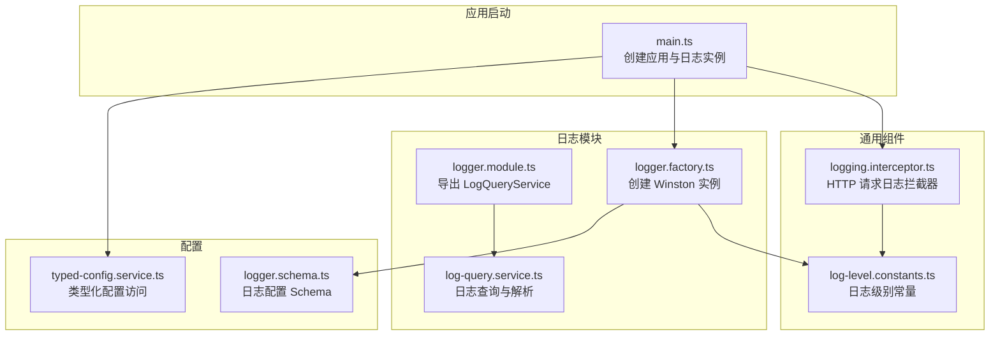
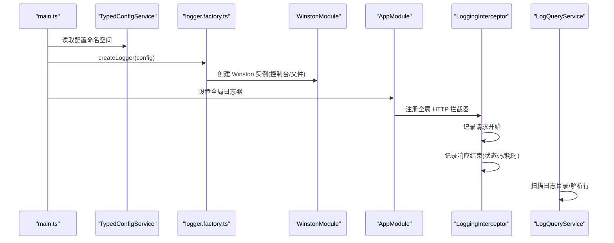
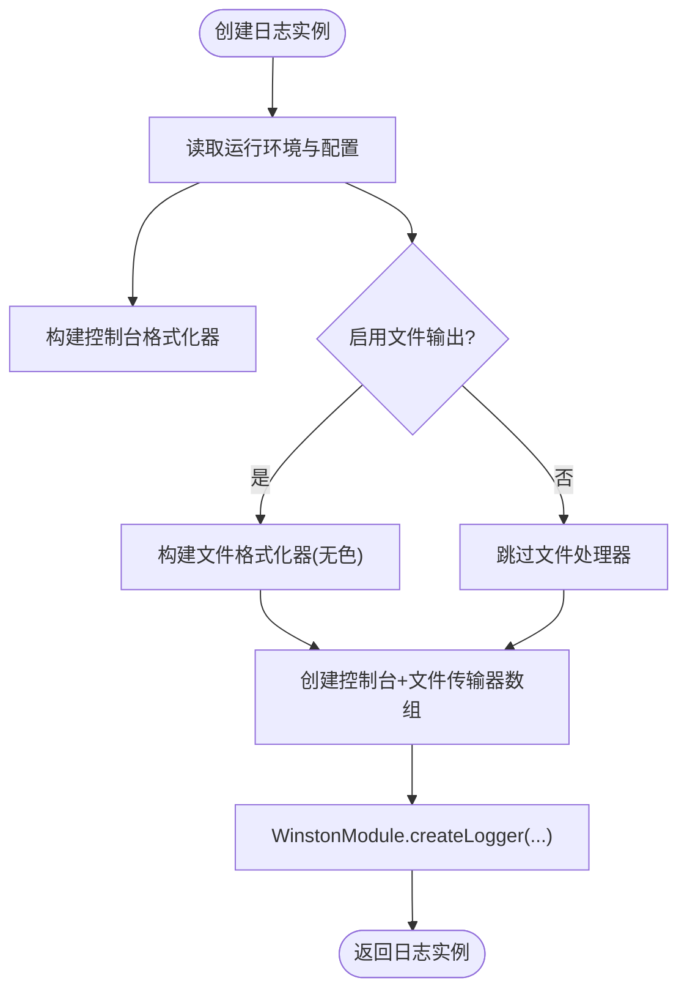
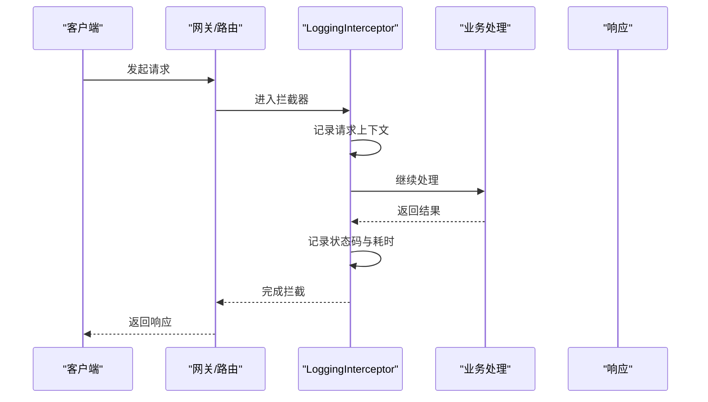
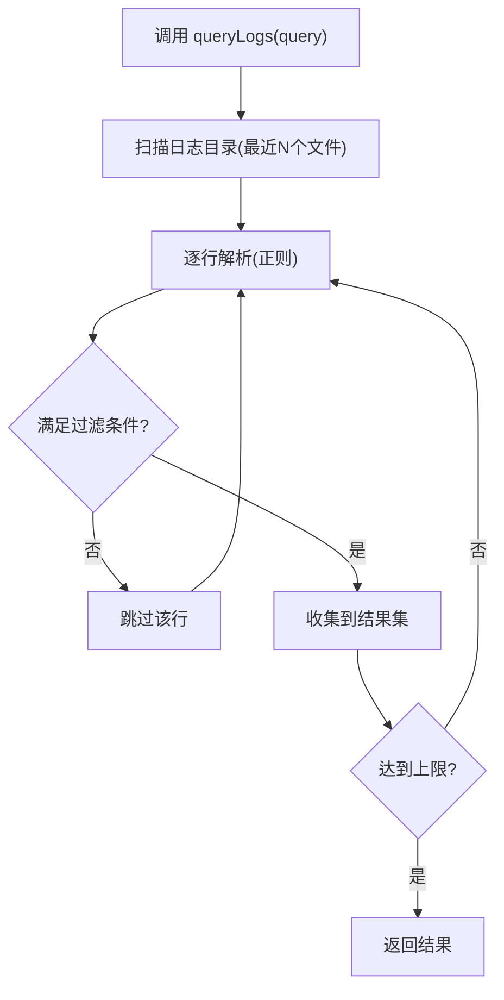
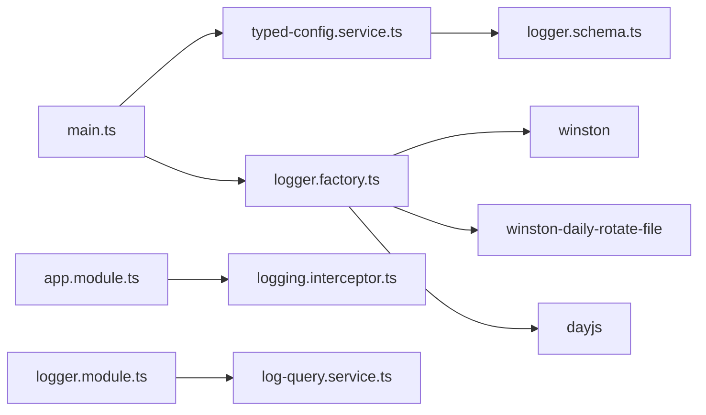

# 日志记录系统

<cite>
**本文引用的文件**
- [logger.factory.ts](file://apps/nestjs-server/src/modules/logger/logger.factory.ts)
- [logger.module.ts](file://apps/nestjs-server/src/modules/logger/logger.module.ts)
- [log-query.service.ts](file://apps/nestjs-server/src/modules/logger/log-query.service.ts)
- [logging.interceptor.ts](file://apps/nestjs-server/src/common/interceptors/logging.interceptor.ts)
- [log-level.constants.ts](file://apps/nestjs-server/src/common/constants/log-level.constants.ts)
- [logger.schema.ts](file://apps/nestjs-server/src/config/schemas/logger.schema.ts)
- [typed-config.service.ts](file://apps/nestjs-server/src/config/typed-config.service.ts)
- [app.module.ts](file://apps/nestjs-server/src/app.module.ts)
- [main.ts](file://apps/nestjs-server/src/main.ts)
</cite>

## 目录

1. [简介](#简介)
2. [项目结构](#项目结构)
3. [核心组件](#核心组件)
4. [架构总览](#架构总览)
5. [详细组件分析](#详细组件分析)
6. [依赖关系分析](#依赖关系分析)
7. [性能考量](#性能考量)
8. [故障排查指南](#故障排查指南)
9. [结论](#结论)
10. [附录](#附录)

## 简介

本文件系统性梳理并说明本项目的日志记录体系，覆盖以下主题：

- Winston 日志框架的配置与使用：日志级别、输出格式、处理器（控制台与文件）。
- 日志工厂的实现原理与日志实例创建机制。
- 请求日志拦截器的工作原理：如何记录 HTTP 请求与响应信息。
- 文件轮转策略与日志归档：按日期轮转与大小限制。
- 结构化日志格式、上下文信息传递与性能监控集成思路。
- 完整的日志配置示例、自定义处理器建议与最佳实践。
- 日志安全、隐私保护与合规性要求。

## 项目结构

日志相关模块集中于后端应用的特定目录，采用“功能模块 + 工具服务”的分层组织方式：

- 模块层：日志模块定义与导出。
- 工厂层：创建 Winston 实例，组合格式与传输器。
- 服务层：日志查询与检索能力。
- 拦截器层：全局 HTTP 请求日志记录。
- 配置层：类型化配置与 Schema 校验。

图表来源

- [main.ts:1-47](file://apps/nestjs-server/src/main.ts#L1-L47)
- [logger.factory.ts:1-127](file://apps/nestjs-server/src/modules/logger/logger.factory.ts#L1-L127)
- [logger.module.ts:1-9](file://apps/nestjs-server/src/modules/logger/logger.module.ts#L1-L9)
- [log-query.service.ts:1-122](file://apps/nestjs-server/src/modules/logger/log-query.service.ts#L1-L122)
- [logging.interceptor.ts:1-30](file://apps/nestjs-server/src/common/interceptors/logging.interceptor.ts#L1-L30)
- [log-level.constants.ts:1-10](file://apps/nestjs-server/src/common/constants/log-level.constants.ts#L1-L10)
- [logger.schema.ts:1-13](file://apps/nestjs-server/src/config/schemas/logger.schema.ts#L1-L13)
- [typed-config.service.ts:1-46](file://apps/nestjs-server/src/config/typed-config.service.ts#L1-L46)

章节来源

- [main.ts:1-47](file://apps/nestjs-server/src/main.ts#L1-L47)
- [logger.factory.ts:1-127](file://apps/nestjs-server/src/modules/logger/logger.factory.ts#L1-L127)
- [logger.module.ts:1-9](file://apps/nestjs-server/src/modules/logger/logger.module.ts#L1-L9)
- [log-query.service.ts:1-122](file://apps/nestjs-server/src/modules/logger/log-query.service.ts#L1-L122)
- [logging.interceptor.ts:1-30](file://apps/nestjs-server/src/common/interceptors/logging.interceptor.ts#L1-L30)
- [log-level.constants.ts:1-10](file://apps/nestjs-server/src/common/constants/log-level.constants.ts#L1-L10)
- [logger.schema.ts:1-13](file://apps/nestjs-server/src/config/schemas/logger.schema.ts#L1-L13)
- [typed-config.service.ts:1-46](file://apps/nestjs-server/src/config/typed-config.service.ts#L1-L46)

## 核心组件

- 日志工厂：根据环境与配置动态创建 Winston 日志实例，组合控制台与可选的文件传输器，统一格式化与级别。
- 日志查询服务：扫描日志目录，解析日志行，支持关键词、级别、时间范围与模块过滤。
- 请求日志拦截器：在请求进入与完成时记录方法、URL、状态码、耗时、用户标识与 IP 等上下文。
- 类型化配置：通过 Zod Schema 定义日志配置项，TypedConfigService 提供类型安全的访问接口。

章节来源

- [logger.factory.ts:85-127](file://apps/nestjs-server/src/modules/logger/logger.factory.ts#L85-L127)
- [log-query.service.ts:31-83](file://apps/nestjs-server/src/modules/logger/log-query.service.ts#L31-L83)
- [logging.interceptor.ts:10-28](file://apps/nestjs-server/src/common/interceptors/logging.interceptor.ts#L10-L28)
- [logger.schema.ts:4-10](file://apps/nestjs-server/src/config/schemas/logger.schema.ts#L4-L10)
- [typed-config.service.ts:23-36](file://apps/nestjs-server/src/config/typed-config.service.ts#L23-L36)

## 架构总览

下图展示从应用启动到日志记录与查询的关键流程：

图表来源

- [main.ts:9-17](file://apps/nestjs-server/src/main.ts#L9-L17)
- [typed-config.service.ts:42-44](file://apps/nestjs-server/src/config/typed-config.service.ts#L42-L44)
- [logger.factory.ts:85-127](file://apps/nestjs-server/src/modules/logger/logger.factory.ts#L85-L127)
- [app.module.ts:45-46](file://apps/nestjs-server/src/app.module.ts#L45-L46)
- [logging.interceptor.ts:10-28](file://apps/nestjs-server/src/common/interceptors/logging.interceptor.ts#L10-L28)
- [log-query.service.ts:31-83](file://apps/nestjs-server/src/modules/logger/log-query.service.ts#L31-L83)

## 详细组件分析

### 日志工厂与 Winston 配置

- 动态格式化：根据运行环境决定是否启用颜色；统一时间戳、级别、上下文、消息与额外元数据的打印格式；对非字符串消息进行序列化。
- 处理器组合：
  - 控制台处理器：彩色/非彩色输出，级别由配置决定。
  - 文件处理器：每日轮转（按日期），支持最大文件数与单文件最大大小；分别生成合并日志与错误日志。
- 实例创建：通过 Nest 的 WinstonModule 创建日志实例，设置退出行为为不因异常退出进程。

图表来源

- [logger.factory.ts:85-127](file://apps/nestjs-server/src/modules/logger/logger.factory.ts#L85-L127)

章节来源

- [logger.factory.ts:15-83](file://apps/nestjs-server/src/modules/logger/logger.factory.ts#L15-L83)
- [logger.factory.ts:93-127](file://apps/nestjs-server/src/modules/logger/logger.factory.ts#L93-L127)

### 日志级别与格式定制

- 级别常量：提供受控的级别集合，确保配置与使用一致。
- 格式化细节：
  - 时间戳：使用带 ANSI 颜色的时间片段。
  - 上下文：以方括号包裹显示，便于过滤与识别。
  - 元数据：对除保留字段外的其余键进行清洗与序列化，避免敏感信息泄露。
  - 耗时：若存在毫秒字段，格式化为加时长提示。
- 颜色策略：开发环境启用颜色区分不同级别，生产环境统一去色以保证日志可读性与兼容性。

章节来源

- [log-level.constants.ts:1-10](file://apps/nestjs-server/src/common/constants/log-level.constants.ts#L1-L10)
- [logger.factory.ts:15-83](file://apps/nestjs-server/src/modules/logger/logger.factory.ts#L15-L83)

### 请求日志拦截器

- 触发时机：在请求进入与处理完成后分别记录。
- 记录内容：
  - 请求阶段：方法、URL、用户 ID（匿名）、IP、UA。
  - 响应阶段：状态码、耗时（毫秒）。
- 日志上下文：拦截器使用专用上下文名称，便于在日志中快速筛选 HTTP 流量。

图表来源

- [logging.interceptor.ts:10-28](file://apps/nestjs-server/src/common/interceptors/logging.interceptor.ts#L10-L28)

章节来源

- [logging.interceptor.ts:10-28](file://apps/nestjs-server/src/common/interceptors/logging.interceptor.ts#L10-L28)

### 文件轮转策略与日志归档

- 轮转规则：基于日期的每日轮转，文件名包含日期模板，便于按天归档。
- 存储位置：统一目录，支持配置；默认目录可通过配置项指定。
- 归档与清理：
  - 最大文件数：超过阈值自动删除最旧文件。
  - 单文件最大大小：达到阈值触发新文件，避免单文件过大影响读写与传输。
- 分类存储：合并日志与错误日志分离，便于问题定位与审计。

章节来源

- [logger.factory.ts:100-120](file://apps/nestjs-server/src/modules/logger/logger.factory.ts#L100-L120)
- [logger.schema.ts:5-10](file://apps/nestjs-server/src/config/schemas/logger.schema.ts#L5-L10)

### 日志查询与检索

- 查询接口：支持按级别、关键词、时间范围、模块与数量限制进行过滤。
- 解析逻辑：正则提取时间戳、级别、模块与消息；对空行与解析失败的行进行跳过。
- 文件扫描：限定扫描最近若干个文件，按日期倒序，优先命中最新日志。
- 输出模型：标准化日志条目结构，便于前端展示与二次处理。

图表来源

- [log-query.service.ts:31-83](file://apps/nestjs-server/src/modules/logger/log-query.service.ts#L31-L83)
- [log-query.service.ts:98-112](file://apps/nestjs-server/src/modules/logger/log-query.service.ts#L98-L112)
- [log-query.service.ts:85-96](file://apps/nestjs-server/src/modules/logger/log-query.service.ts#L85-L96)

章节来源

- [log-query.service.ts:31-83](file://apps/nestjs-server/src/modules/logger/log-query.service.ts#L31-L83)
- [log-query.service.ts:98-112](file://apps/nestjs-server/src/modules/logger/log-query.service.ts#L98-L112)
- [log-query.service.ts:85-96](file://apps/nestjs-server/src/modules/logger/log-query.service.ts#L85-L96)

### 类型化配置与注入

- 配置 Schema：定义日志目录、级别、文件开关、最大文件数与最大大小等键。
- 类型化访问：通过路径点语法安全获取嵌套配置，缺失或越界时抛错，避免运行期误用。
- 应用注入：在启动阶段读取配置并创建日志实例，随后设置为全局日志器。

章节来源

- [logger.schema.ts:4-10](file://apps/nestjs-server/src/config/schemas/logger.schema.ts#L4-L10)
- [typed-config.service.ts:23-36](file://apps/nestjs-server/src/config/typed-config.service.ts#L23-L36)
- [main.ts:14-17](file://apps/nestjs-server/src/main.ts#L14-L17)

## 依赖关系分析

- 模块耦合：
  - main.ts 依赖 TypedConfigService 与 logger.factory.ts，负责创建与设置全局日志器。
  - AppModule 将 LoggingInterceptor 注册为全局拦截器，形成横切关注点。
  - LoggerModule 导出 LogQueryService，供上层模块使用。
- 外部依赖：
  - Winston 与 nest-winston：日志核心与 Nest 集成。
  - winston-daily-rotate-file：文件轮转。
  - dayjs：时间格式化。
  - Zod：配置校验。
- 可能的循环依赖：当前结构未见直接循环依赖，但需注意配置与工厂之间的间接依赖链。

图表来源

- [main.ts:14-17](file://apps/nestjs-server/src/main.ts#L14-L17)
- [logger.factory.ts:4-6](file://apps/nestjs-server/src/modules/logger/logger.factory.ts#L4-L6)
- [app.module.ts:45-46](file://apps/nestjs-server/src/app.module.ts#L45-L46)
- [logger.module.ts:5-6](file://apps/nestjs-server/src/modules/logger/logger.module.ts#L5-L6)
- [typed-config.service.ts:11-12](file://apps/nestjs-server/src/config/typed-config.service.ts#L11-L12)
- [logger.schema.ts:1-13](file://apps/nestjs-server/src/config/schemas/logger.schema.ts#L1-L13)

章节来源

- [main.ts:14-17](file://apps/nestjs-server/src/main.ts#L14-L17)
- [app.module.ts:45-46](file://apps/nestjs-server/src/app.module.ts#L45-L46)
- [logger.module.ts:5-6](file://apps/nestjs-server/src/modules/logger/logger.module.ts#L5-L6)
- [logger.factory.ts:4-6](file://apps/nestjs-server/src/modules/logger/logger.factory.ts#L4-L6)

## 性能考量

- I/O 开销：
  - 文件轮转在写入时检查大小与日期，建议合理设置最大大小与文件数，避免频繁切换文件。
  - 日志查询仅扫描最近若干文件并限制总数，降低磁盘扫描压力。
- CPU 开销：
  - 格式化器包含时间戳与元数据序列化，建议在生产关闭颜色以减少 ANSI 字符处理开销。
  - 拦截器仅在请求前后进行简单计算与日志写入，开销极低。
- 内存占用：
  - 日志查询一次性读取文件内容，建议限制扫描文件数量与查询上限，防止内存峰值过高。
- 并发与稳定性：
  - Winston 默认异步写入，结合 DailyRotateFile 的原子重命名，具备较好的并发安全性。
  - exitOnError 关闭，避免日志异常导致进程退出。

## 故障排查指南

- 启动失败或日志不可用：
  - 检查根配置是否存在，类型化配置在缺失时会终止进程。
  - 确认日志目录可写，文件轮转需要写权限。
- 日志为空或不完整：
  - 核对文件轮转参数（最大大小、最大文件数）是否过于保守。
  - 确认日志级别设置是否过高，导致低级别日志被过滤。
- 查询不到日志：
  - 确认日志目录与文件命名是否符合预期（按日期轮转）。
  - 检查查询关键字大小写与时间范围是否正确。
- HTTP 日志缺失：
  - 确认全局拦截器已注册且未被其他拦截器覆盖。
  - 检查拦截器上下文名称是否与日志筛选一致。

章节来源

- [typed-config.service.ts:14-17](file://apps/nestjs-server/src/config/typed-config.service.ts#L14-L17)
- [logger.factory.ts:100-120](file://apps/nestjs-server/src/modules/logger/logger.factory.ts#L100-L120)
- [log-query.service.ts:85-96](file://apps/nestjs-server/src/modules/logger/log-query.service.ts#L85-L96)
- [app.module.ts:45-46](file://apps/nestjs-server/src/app.module.ts#L45-L46)

## 结论

本日志系统以 Winston 为核心，结合类型化配置与拦截器机制，实现了可控、可扩展、可运维的日志能力。通过文件轮转与查询服务，既满足日常观测，也兼顾了归档与检索需求。建议在生产环境中关闭颜色、合理设置轮转参数，并配合安全与合规策略，持续优化日志质量与成本。

## 附录

### 配置项与默认值

- loggerDir：日志目录，默认值参见配置 Schema。
- loggerLevel：日志级别枚举，默认值参见配置 Schema。
- loggerEnableFile：是否启用文件输出，默认值参见配置 Schema。
- loggerMaxFiles：保留的文件数量，默认值参见配置 Schema。
- loggerMaxSize：单文件最大大小，默认值参见配置 Schema。

章节来源

- [logger.schema.ts:4-10](file://apps/nestjs-server/src/config/schemas/logger.schema.ts#L4-L10)

### 自定义处理器建议

- 结构化日志：在格式化器中加入 JSON 序列化与字段裁剪，避免敏感字段透传。
- 自定义传输器：可引入 Elasticsearch、Syslog 或云日志服务 SDK，按需扩展。
- 性能监控集成：在拦截器中采集指标（如 P95/P99 耗时），结合日志进行关联分析。

### 最佳实践

- 环境区分：开发启用颜色与详细级别，生产关闭颜色并提升最低记录级别。
- 敏感信息：使用清洗工具移除或脱敏元数据，避免日志泄露。
- 归档策略：结合业务峰值与合规要求设定轮转与保留周期。
- 查询优化：限制查询窗口与返回条数，必要时建立索引或预处理日志。
