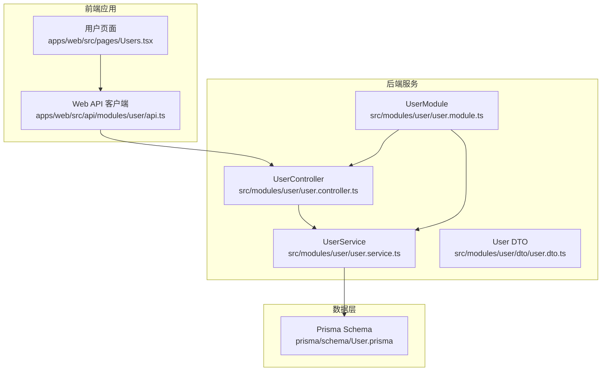
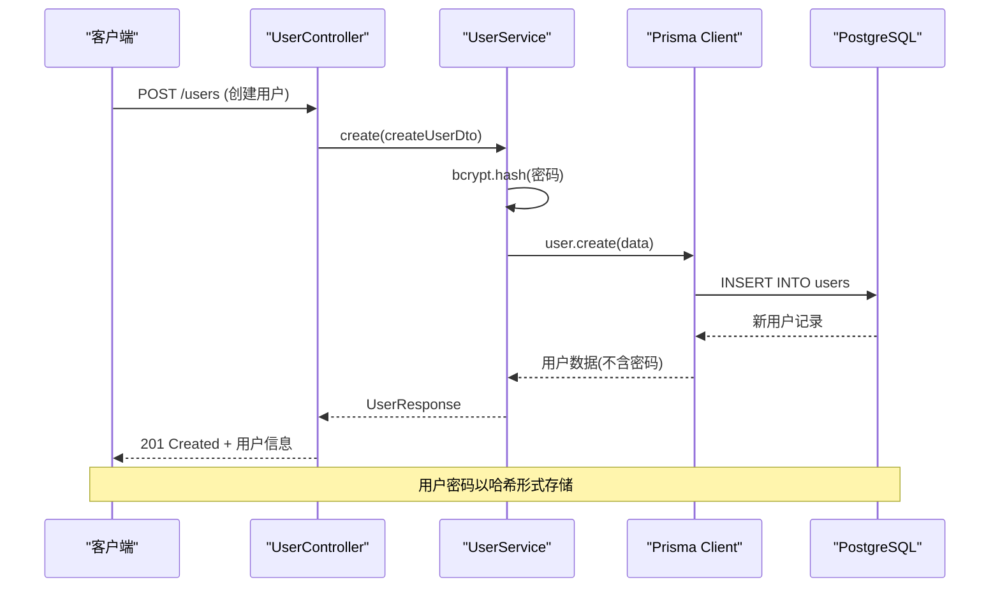
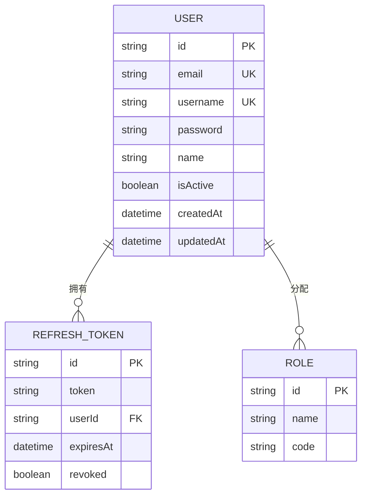
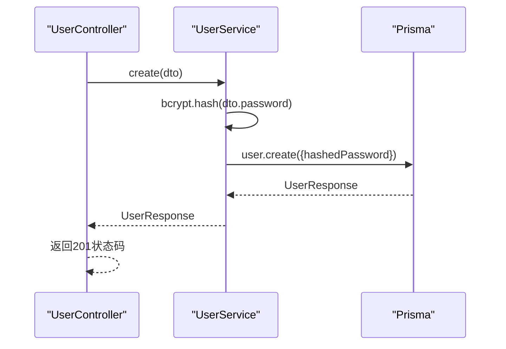
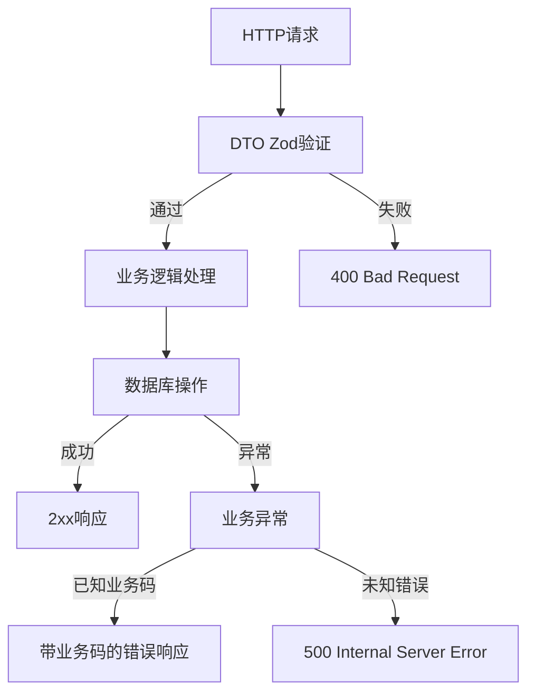
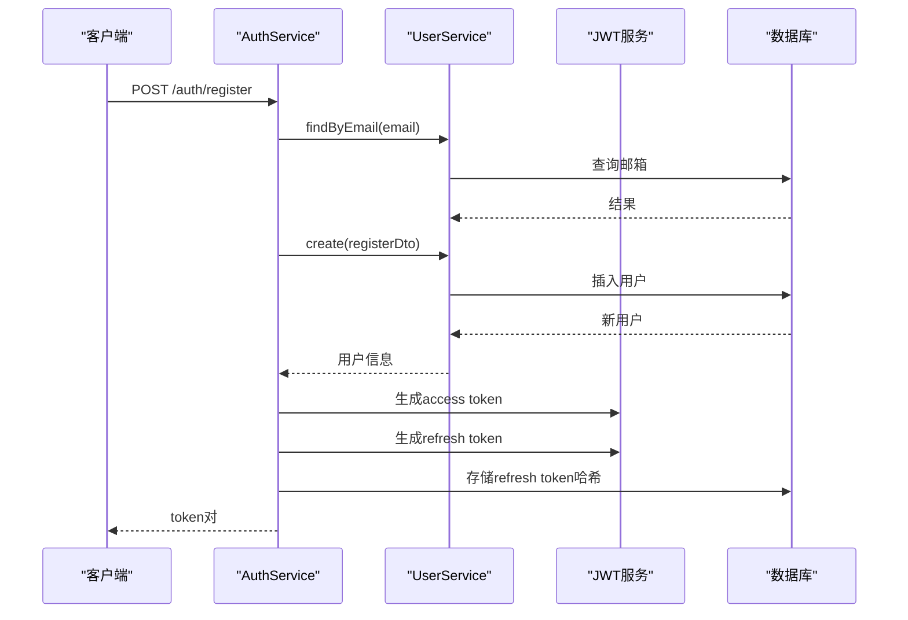
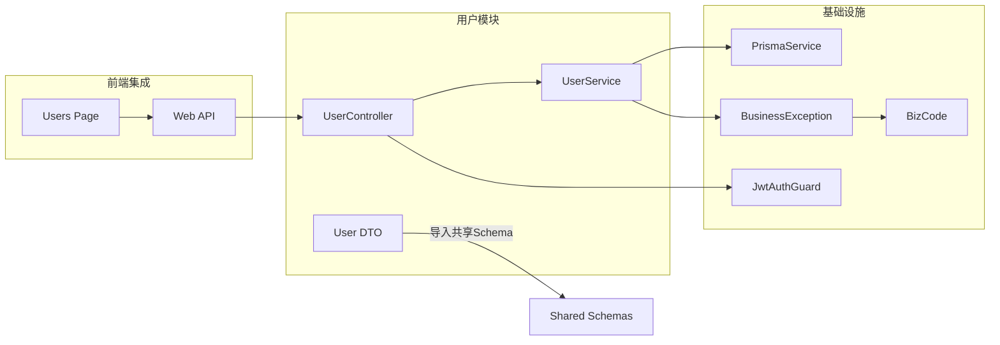
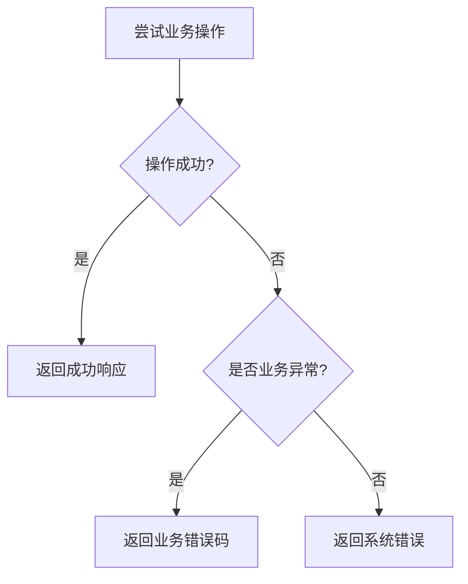

# 用户管理系统

<cite>
**本文档引用的文件**
- [User.prisma](file://apps/nestjs-server/prisma/schema/User.prisma)
- [user.controller.ts](file://apps/nestjs-server/src/modules/user/user.controller.ts)
- [user.service.ts](file://apps/nestjs-server/src/modules/user/user.service.ts)
- [user.dto.ts](file://apps/nestjs-server/src/modules/user/dto/user.dto.ts)
- [user.module.ts](file://apps/nestjs-server/src/modules/user/user.module.ts)
- [api.ts](file://apps/web/src/api/modules/user/api.ts)
- [Users.tsx](file://apps/web/src/pages/Users.tsx)
- [biz-code.enum.ts](file://apps/nestjs-server/src/common/enums/biz-code.enum.ts)
- [business.exception.ts](file://apps/nestjs-server/src/common/exceptions/business.exception.ts)
- [jwt-auth.guard.ts](file://apps/nestjs-server/src/common/guards/jwt-auth.guard.ts)
- [auth.service.ts](file://apps/nestjs-server/src/modules/auth/auth.service.ts)
- [index.ts](file://apps/web/src/api/index.ts)
- [schemas/index.ts](file://packages/shared/src/schemas/index.ts)
</cite>

## 目录
1. [简介](#简介)
2. [项目结构](#项目结构)
3. [核心组件](#核心组件)
4. [架构概览](#架构概览)
5. [详细组件分析](#详细组件分析)
6. [依赖关系分析](#依赖关系分析)
7. [性能考虑](#性能考虑)
8. [故障排除指南](#故障排除指南)
9. [结论](#结论)
10. [附录](#附录)

## 简介
本文件为用户管理系统的详细技术文档，涵盖用户实体设计、CRUD操作实现、查询接口设计、状态管理与权限控制、数据验证与错误处理、事务管理以及API接口文档。系统采用NestJS + Prisma + PostgreSQL的技术栈，前端使用React + TypeScript，通过共享Schema确保前后端数据一致性。

## 项目结构
用户管理模块位于NestJS服务端的`src/modules/user`目录下，包含控制器、服务层、DTO定义和模块配置；前端位于`apps/web/src/api/modules/user`目录，提供HTTP客户端封装。

**图表来源**
- [user.controller.ts:1-79](file://apps/nestjs-server/src/modules/user/user.controller.ts#L1-L79)
- [user.service.ts:1-113](file://apps/nestjs-server/src/modules/user/user.service.ts#L1-L113)
- [user.dto.ts:1-26](file://apps/nestjs-server/src/modules/user/dto/user.dto.ts#L1-L26)
- [user.module.ts:1-11](file://apps/nestjs-server/src/modules/user/user.module.ts#L1-L11)
- [User.prisma:1-15](file://apps/nestjs-server/prisma/schema/User.prisma#L1-L15)

**章节来源**
- [user.controller.ts:1-79](file://apps/nestjs-server/src/modules/user/user.controller.ts#L1-L79)
- [user.service.ts:1-113](file://apps/nestjs-server/src/modules/user/user.service.ts#L1-L113)
- [user.dto.ts:1-26](file://apps/nestjs-server/src/modules/user/dto/user.dto.ts#L1-L26)
- [user.module.ts:1-11](file://apps/nestjs-server/src/modules/user/user.module.ts#L1-L11)

## 核心组件
用户管理的核心组件包括：
- 用户实体模型：定义用户表结构、字段约束和关系映射
- 控制器层：暴露REST API端点，处理请求参数和响应格式
- 服务层：实现业务逻辑，包括密码哈希、数据验证和数据库操作
- DTO层：定义请求/响应数据结构，使用Zod进行类型安全验证
- 权限控制：基于JWT的认证守卫，确保API访问安全

**章节来源**
- [User.prisma:1-15](file://apps/nestjs-server/prisma/schema/User.prisma#L1-L15)
- [user.controller.ts:1-79](file://apps/nestjs-server/src/modules/user/user.controller.ts#L1-L79)
- [user.service.ts:1-113](file://apps/nestjs-server/src/modules/user/user.service.ts#L1-L113)
- [user.dto.ts:1-26](file://apps/nestjs-server/src/modules/user/dto/user.dto.ts#L1-L26)
- [jwt-auth.guard.ts:1-43](file://apps/nestjs-server/src/common/guards/jwt-auth.guard.ts#L1-L43)

## 架构概览
系统采用分层架构，前后端分离，通过共享Schema确保数据一致性。用户模块遵循RESTful设计原则，提供标准的CRUD操作。

**图表来源**
- [user.controller.ts:28-37](file://apps/nestjs-server/src/modules/user/user.controller.ts#L28-L37)
- [user.service.ts:17-31](file://apps/nestjs-server/src/modules/user/user.service.ts#L17-L31)
- [User.prisma:1-15](file://apps/nestjs-server/prisma/schema/User.prisma#L1-L15)

## 详细组件分析

### 用户实体设计
用户实体采用Prisma模型定义，包含以下核心字段：

**图表来源**
- [User.prisma:1-15](file://apps/nestjs-server/prisma/schema/User.prisma#L1-L15)

字段定义与约束：
- id: UUID主键，默认自动生成
- email: 唯一索引，用于登录凭证
- username: 唯一索引，用于显示标识
- password: 存储哈希后的密码
- name: 可选显示名称
- isActive: 用户状态，默认启用
- createdAt/updatedAt: 自动时间戳管理

**章节来源**
- [User.prisma:1-15](file://apps/nestjs-server/prisma/schema/User.prisma#L1-L15)

### CRUD操作实现

#### 创建用户
控制器接收CreateUserDto，服务层进行密码哈希后持久化存储。

**图表来源**
- [user.controller.ts:28-37](file://apps/nestjs-server/src/modules/user/user.controller.ts#L28-L37)
- [user.service.ts:17-31](file://apps/nestjs-server/src/modules/user/user.service.ts#L17-L31)

#### 读取用户
支持获取所有用户和按ID获取单个用户，均返回脱敏数据。

#### 更新用户
服务层先验证用户存在性，再执行部分字段更新。

#### 删除用户
级联删除用户及其关联的刷新令牌。

**章节来源**
- [user.controller.ts:39-77](file://apps/nestjs-server/src/modules/user/user.controller.ts#L39-L77)
- [user.service.ts:33-97](file://apps/nestjs-server/src/modules/user/user.service.ts#L33-L97)

### 查询接口设计
当前实现提供基础的CRUD接口，支持：
- 获取用户列表：GET /users
- 获取单个用户：GET /users/:id  
- 创建用户：POST /users
- 更新用户：PATCH /users/:id
- 删除用户：DELETE /users/:id

查询能力扩展建议：
- 分页：添加skip/take参数
- 排序：支持createdAt、username等字段排序
- 过滤：支持isActive、email模糊匹配等条件

**章节来源**
- [user.controller.ts:28-77](file://apps/nestjs-server/src/modules/user/user.controller.ts#L28-L77)

### 数据验证与错误处理
系统采用多层验证机制：

**图表来源**
- [user.dto.ts:1-26](file://apps/nestjs-server/src/modules/user/dto/user.dto.ts#L1-L26)
- [business.exception.ts:1-42](file://apps/nestjs-server/src/common/exceptions/business.exception.ts#L1-L42)

验证规则：
- 请求参数使用Zod Schema进行类型检查
- 响应数据使用DateTimeStringSchema转换时间格式
- 业务异常统一使用BizCode枚举

**章节来源**
- [user.dto.ts:1-26](file://apps/nestjs-server/src/modules/user/dto/user.dto.ts#L1-L26)
- [biz-code.enum.ts:1-16](file://apps/nestjs-server/src/common/enums/biz-code.enum.ts#L1-L16)
- [business.exception.ts:1-42](file://apps/nestjs-server/src/common/exceptions/business.exception.ts#L1-L42)

### 权限控制与状态管理
系统采用JWT认证机制：

**图表来源**
- [auth.service.ts:44-57](file://apps/nestjs-server/src/modules/auth/auth.service.ts#L44-L57)
- [jwt-auth.guard.ts:1-43](file://apps/nestjs-server/src/common/guards/jwt-auth.guard.ts#L1-L43)

权限控制特性：
- JwtAuthGuard全局保护用户模块API
- 支持@Public装饰器标记公开端点
- 用户状态通过isActive字段管理
- 刷新令牌安全存储（SHA-256哈希）

**章节来源**
- [auth.service.ts:1-151](file://apps/nestjs-server/src/modules/auth/auth.service.ts#L1-L151)
- [jwt-auth.guard.ts:1-43](file://apps/nestjs-server/src/common/guards/jwt-auth.guard.ts#L1-L43)

### 事务管理
当前用户操作未显式使用事务，但Prisma默认在单个操作中保持原子性。对于复杂的批量操作，建议在服务层添加事务包装以确保数据一致性。

## 依赖关系分析

**图表来源**
- [user.controller.ts:1-79](file://apps/nestjs-server/src/modules/user/user.controller.ts#L1-L79)
- [user.service.ts:1-113](file://apps/nestjs-server/src/modules/user/user.service.ts#L1-L113)
- [user.dto.ts:1-26](file://apps/nestjs-server/src/modules/user/dto/user.dto.ts#L1-L26)
- [business.exception.ts:1-42](file://apps/nestjs-server/src/common/exceptions/business.exception.ts#L1-L42)
- [biz-code.enum.ts:1-16](file://apps/nestjs-server/src/common/enums/biz-code.enum.ts#L1-L16)
- [jwt-auth.guard.ts:1-43](file://apps/nestjs-server/src/common/guards/jwt-auth.guard.ts#L1-L43)
- [api.ts:1-34](file://apps/web/src/api/modules/user/api.ts#L1-L34)
- [Users.tsx:1-34](file://apps/web/src/pages/Users.tsx#L1-L34)

**章节来源**
- [user.module.ts:1-11](file://apps/nestjs-server/src/modules/user/user.module.ts#L1-L11)
- [schemas/index.ts:1-8](file://packages/shared/src/schemas/index.ts#L1-L8)

## 性能考虑
- 数据库索引：email和username字段具备唯一索引，提升查询性能
- 查询优化：使用select投影避免传输敏感字段
- 密码哈希：成本因子10提供平衡的安全性和性能
- 缓存策略：可考虑在高频查询场景引入Redis缓存
- 分页实现：建议在用户列表查询中添加分页参数

## 故障排除指南
常见问题及解决方案：

### 认证相关错误
- UNAUTHORIZED (2000): JWT无效或过期
- AUTH_INVALID_CREDENTIALS (1001): 用户名或密码错误
- AUTH_EMAIL_ALREADY_REGISTERED (1002): 邮箱已被注册

### 业务逻辑错误  
- USER_NOT_FOUND (2001): 指定用户不存在
- INVALID_INPUT (1000): 请求参数验证失败

### 错误处理流程

**章节来源**
- [business.exception.ts:1-42](file://apps/nestjs-server/src/common/exceptions/business.exception.ts#L1-L42)
- [biz-code.enum.ts:1-16](file://apps/nestjs-server/src/common/enums/biz-code.enum.ts#L1-L16)

## 结论
用户管理系统采用现代化的分层架构，通过Prisma ORM实现数据持久化，结合JWT认证提供安全的用户管理能力。系统具备良好的扩展性，可通过添加分页、排序、过滤等功能进一步完善查询能力。建议后续增强事务管理、缓存策略和监控告警机制。

## 附录

### API接口文档

#### 创建用户
- 方法：POST /users
- 认证：需要JWT
- 请求体：CreateUserDto
- 响应：UserResponse (201)

#### 获取用户列表
- 方法：GET /users  
- 认证：需要JWT
- 响应：UserResponse[] (200)

#### 获取单个用户
- 方法：GET /users/:id
- 认证：需要JWT  
- 响应：UserResponse (200)

#### 更新用户
- 方法：PATCH /users/:id
- 认证：需要JWT
- 请求体：UpdateUserDto
- 响应：UserResponse (200)

#### 删除用户
- 方法：DELETE /users/:id
- 认证：需要JWT
- 响应：无内容 (204)

### 数据安全与隐私保护
- 密码存储：bcrypt哈希，成本因子10
- 传输安全：HTTPS强制使用
- 敏感信息：响应中移除密码字段
- 访问控制：JWT令牌管理，支持刷新令牌撤销
- 数据最小化：查询时使用select投影