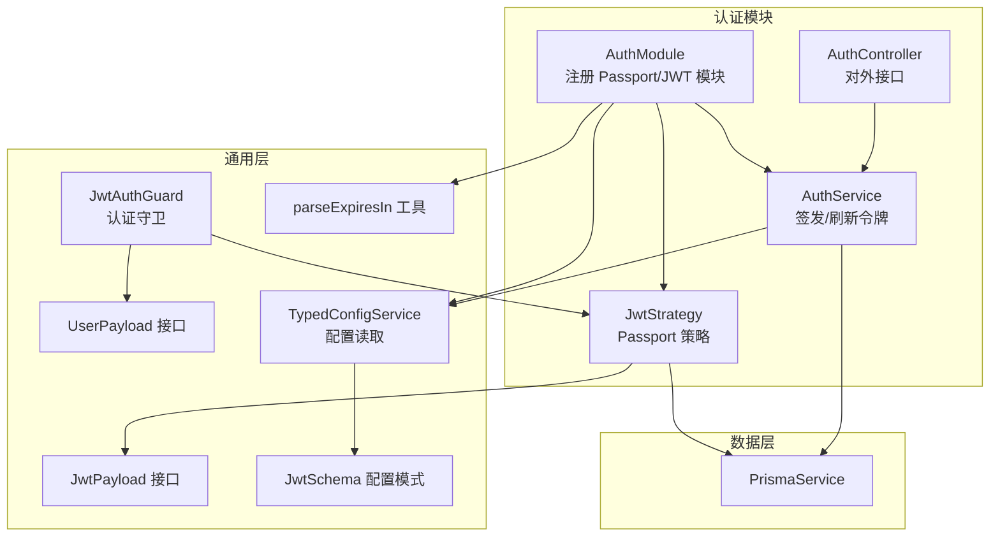
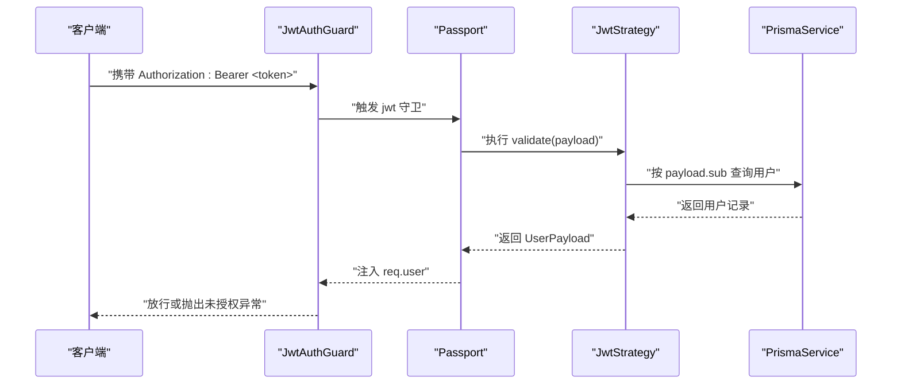
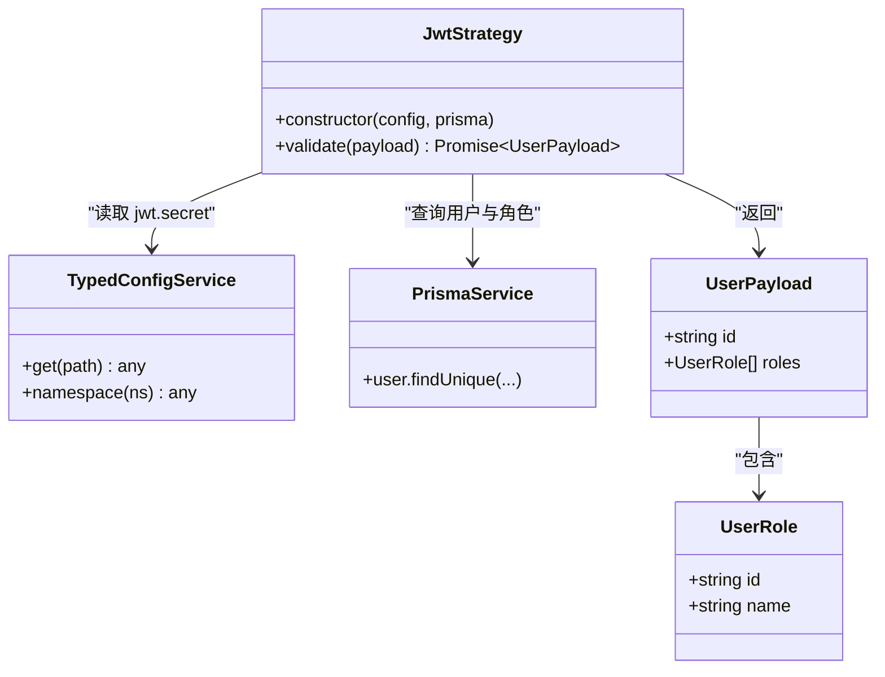
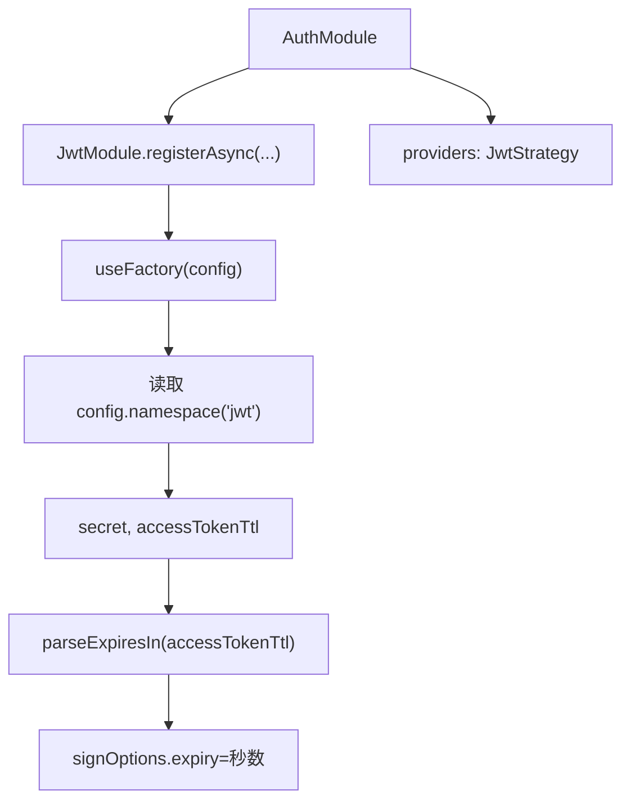
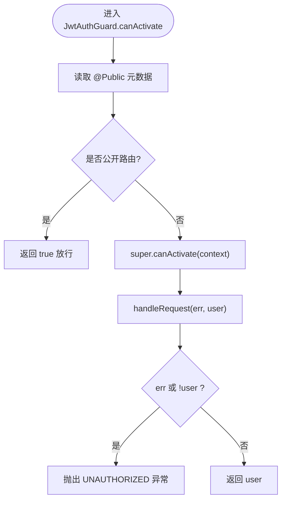
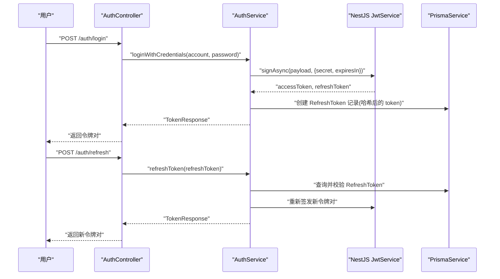
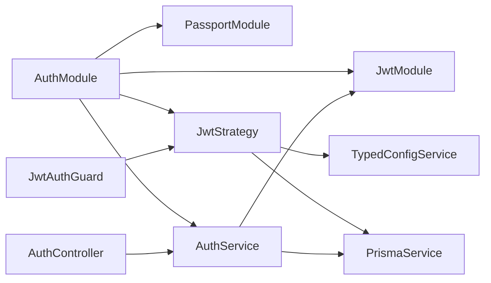

# JWT 策略实现

<cite>
**本文引用的文件**
- [apps/nestjs-server/src/modules/auth/strategies/jwt.strategy.ts](file://apps/nestjs-server/src/modules/auth/strategies/jwt.strategy.ts)
- [apps/nestjs-server/src/common/guards/jwt-auth.guard.ts](file://apps/nestjs-server/src/common/guards/jwt-auth.guard.ts)
- [apps/nestjs-server/src/modules/auth/auth.module.ts](file://apps/nestjs-server/src/modules/auth/auth.module.ts)
- [apps/nestjs-server/src/modules/auth/auth.service.ts](file://apps/nestjs-server/src/modules/auth/auth.service.ts)
- [apps/nestjs-server/src/modules/auth/auth.controller.ts](file://apps/nestjs-server/src/modules/auth/auth.controller.ts)
- [apps/nestjs-server/src/common/interfaces/jwt.interface.ts](file://apps/nestjs-server/src/common/interfaces/jwt.interface.ts)
- [apps/nestjs-server/src/common/interfaces/user.interface.ts](file://apps/nestjs-server/src/common/interfaces/user.interface.ts)
- [apps/nestjs-server/src/config/schemas/jwt.schema.ts](file://apps/nestjs-server/src/config/schemas/jwt.schema.ts)
- [apps/nestjs-server/src/config/typed-config.service.ts](file://apps/nestjs-server/src/config/typed-config.service.ts)
- [apps/nestjs-server/src/common/utils/time.util.ts](file://apps/nestjs-server/src/common/utils/time.util.ts)
- [apps/nestjs-server/src/common/decorators/public.decorator.ts](file://apps/nestjs-server/src/common/decorators/public.decorator.ts)
- [apps/nestjs-server/src/common/enums/biz-code.enum.ts](file://apps/nestjs-server/src/common/enums/biz-code.enum.ts)
</cite>

## 目录

1. [简介](#简介)
2. [项目结构](#项目结构)
3. [核心组件](#核心组件)
4. [架构总览](#架构总览)
5. [详细组件分析](#详细组件分析)
6. [依赖关系分析](#依赖关系分析)
7. [性能考虑](#性能考虑)
8. [故障排查指南](#故障排查指南)
9. [结论](#结论)
10. [附录](#附录)

## 简介

本文件面向需要在 NestJS 中实现与集成 JWT 策略的开发者，系统性梳理项目中的 JWT 策略类、Passport 集成、认证守卫、令牌签发与刷新流程、以及安全最佳实践。重点覆盖以下方面：

- JWT 策略类的配置参数、验证逻辑与安全机制
- 从 JWT 令牌中提取用户信息的完整过程：载荷解析、签名验证、过期时间检查
- Passport JWT 策略的集成方式：策略选项配置、回调函数实现与错误处理
- 在认证流程中使用 JWT 策略的完整示例：令牌格式要求、密钥管理与安全建议
- 认证守卫如何利用 JWT 策略进行请求验证

## 项目结构

本项目采用模块化组织，认证相关能力集中在 auth 模块中，配合 Passport 与 NestJS JWT 模块完成令牌签发与验证；用户角色信息通过 Prisma 查询并注入到用户上下文。

图表来源

- [apps/nestjs-server/src/modules/auth/auth.module.ts:12-34](file://apps/nestjs-server/src/modules/auth/auth.module.ts#L12-L34)
- [apps/nestjs-server/src/modules/auth/auth.service.ts:105-142](file://apps/nestjs-server/src/modules/auth/auth.service.ts#L105-L142)
- [apps/nestjs-server/src/modules/auth/strategies/jwt.strategy.ts:10-48](file://apps/nestjs-server/src/modules/auth/strategies/jwt.strategy.ts#L10-L48)
- [apps/nestjs-server/src/common/guards/jwt-auth.guard.ts:17-42](file://apps/nestjs-server/src/common/guards/jwt-auth.guard.ts#L17-L42)
- [apps/nestjs-server/src/config/schemas/jwt.schema.ts:3-8](file://apps/nestjs-server/src/config/schemas/jwt.schema.ts#L3-L8)
- [apps/nestjs-server/src/config/typed-config.service.ts:23-36](file://apps/nestjs-server/src/config/typed-config.service.ts#L23-L36)
- [apps/nestjs-server/src/common/utils/time.util.ts:12-31](file://apps/nestjs-server/src/common/utils/time.util.ts#L12-L31)

章节来源

- [apps/nestjs-server/src/modules/auth/auth.module.ts:12-34](file://apps/nestjs-server/src/modules/auth/auth.module.ts#L12-L34)
- [apps/nestjs-server/src/modules/auth/auth.service.ts:105-142](file://apps/nestjs-server/src/modules/auth/auth.service.ts#L105-L142)
- [apps/nestjs-server/src/modules/auth/strategies/jwt.strategy.ts:10-48](file://apps/nestjs-server/src/modules/auth/strategies/jwt.strategy.ts#L10-L48)
- [apps/nestjs-server/src/common/guards/jwt-auth.guard.ts:17-42](file://apps/nestjs-server/src/common/guards/jwt-auth.guard.ts#L17-L42)
- [apps/nestjs-server/src/config/schemas/jwt.schema.ts:3-8](file://apps/nestjs-server/src/config/schemas/jwt.schema.ts#L3-L8)
- [apps/nestjs-server/src/config/typed-config.service.ts:23-36](file://apps/nestjs-server/src/config/typed-config.service.ts#L23-L36)
- [apps/nestjs-server/src/common/utils/time.util.ts:12-31](file://apps/nestjs-server/src/common/utils/time.util.ts#L12-L31)

## 核心组件

- JWT 策略类：继承自 PassportStrategy(Strategy)，负责从 Authorization 头解析 Bearer 令牌、验证签名与过期时间，并在回调中加载用户角色信息。
- 认证守卫：基于 AuthGuard('jwt')，结合反射判断是否公开路由，统一处理未授权场景。
- 服务层：封装登录、注册、刷新与登出流程，使用 NestJS JWT 服务签发令牌，同时持久化刷新令牌。
- 配置系统：通过 Zod Schema 校验 JWT 配置，TypedConfigService 提供类型安全的配置读取。
- 数据访问：通过 PrismaService 查询用户与角色信息，构建用户上下文。

章节来源

- [apps/nestjs-server/src/modules/auth/strategies/jwt.strategy.ts:10-48](file://apps/nestjs-server/src/modules/auth/strategies/jwt.strategy.ts#L10-L48)
- [apps/nestjs-server/src/common/guards/jwt-auth.guard.ts:17-42](file://apps/nestjs-server/src/common/guards/jwt-auth.guard.ts#L17-L42)
- [apps/nestjs-server/src/modules/auth/auth.service.ts:105-142](file://apps/nestjs-server/src/modules/auth/auth.service.ts#L105-L142)
- [apps/nestjs-server/src/config/schemas/jwt.schema.ts:3-8](file://apps/nestjs-server/src/config/schemas/jwt.schema.ts#L3-L8)
- [apps/nestjs-server/src/config/typed-config.service.ts:23-36](file://apps/nestjs-server/src/config/typed-config.service.ts#L23-L36)

## 架构总览

下图展示了从客户端发起请求到服务端完成 JWT 验证与用户上下文注入的关键交互：

图表来源

- [apps/nestjs-server/src/common/guards/jwt-auth.guard.ts:18-34](file://apps/nestjs-server/src/common/guards/jwt-auth.guard.ts#L18-L34)
- [apps/nestjs-server/src/modules/auth/strategies/jwt.strategy.ts:22-47](file://apps/nestjs-server/src/modules/auth/strategies/jwt.strategy.ts#L22-L47)
- [apps/nestjs-server/src/common/interfaces/user.interface.ts:6-9](file://apps/nestjs-server/src/common/interfaces/user.interface.ts#L6-L9)

## 详细组件分析

### JWT 策略类（JwtStrategy）

- 继承 PassportStrategy(Strategy)，构造函数中设置：
  - 令牌提取：从 Authorization 头以 Bearer 方式提取
  - 忽略过期：false，启用过期检查
  - 密钥来源：从 TypedConfigService 读取配置项 jwt.secret
- validate 回调：
  - 依据 payload.sub 查询用户，仅选择 id 与角色列表
  - 若用户不存在，回退为匿名角色结构，保证下游流程稳定
  - 将角色映射为 {id, name} 结构返回给守卫

图表来源

- [apps/nestjs-server/src/modules/auth/strategies/jwt.strategy.ts:10-20](file://apps/nestjs-server/src/modules/auth/strategies/jwt.strategy.ts#L10-L20)
- [apps/nestjs-server/src/modules/auth/strategies/jwt.strategy.ts:22-47](file://apps/nestjs-server/src/modules/auth/strategies/jwt.strategy.ts#L22-L47)
- [apps/nestjs-server/src/common/interfaces/user.interface.ts:6-9](file://apps/nestjs-server/src/common/interfaces/user.interface.ts#L6-L9)

章节来源

- [apps/nestjs-server/src/modules/auth/strategies/jwt.strategy.ts:10-48](file://apps/nestjs-server/src/modules/auth/strategies/jwt.strategy.ts#L10-L48)
- [apps/nestjs-server/src/common/interfaces/jwt.interface.ts:5-10](file://apps/nestjs-server/src/common/interfaces/jwt.interface.ts#L5-L10)
- [apps/nestjs-server/src/common/interfaces/user.interface.ts:1-9](file://apps/nestjs-server/src/common/interfaces/user.interface.ts#L1-L9)

### Passport JWT 策略集成

- AuthModule 中注册 PassportModule 与 JwtModule.registerAsync：
  - 从 TypedConfigService 读取 jwt.secret 与 jwt.accessTokenTtl
  - 使用 parseExpiresIn 将字符串形式的 TTL 解析为秒数
  - 将 signOptions.expiry 设置为解析后的秒数
- JwtStrategy 作为提供者被注入，名称为 'jwt'，供 JwtAuthGuard 使用

图表来源

- [apps/nestjs-server/src/modules/auth/auth.module.ts:12-34](file://apps/nestjs-server/src/modules/auth/auth.module.ts#L12-L34)
- [apps/nestjs-server/src/common/utils/time.util.ts:12-31](file://apps/nestjs-server/src/common/utils/time.util.ts#L12-L31)
- [apps/nestjs-server/src/config/typed-config.service.ts:42-44](file://apps/nestjs-server/src/config/typed-config.service.ts#L42-L44)

章节来源

- [apps/nestjs-server/src/modules/auth/auth.module.ts:12-34](file://apps/nestjs-server/src/modules/auth/auth.module.ts#L12-L34)
- [apps/nestjs-server/src/common/utils/time.util.ts:12-31](file://apps/nestjs-server/src/common/utils/time.util.ts#L12-L31)
- [apps/nestjs-server/src/config/typed-config.service.ts:23-36](file://apps/nestjs-server/src/config/typed-config.service.ts#L23-L36)

### 认证守卫（JwtAuthGuard）

- 继承 AuthGuard('jwt')，在 canActivate 中：
  - 使用 Reflector 读取 @Public 元数据，若标记为公开路由则直接放行
  - 否则委托父类 AuthGuard('jwt') 完成验证
- 在 handleRequest 中：
  - 当存在错误或无用户信息时，抛出业务异常（UNAUTHORIZED）

图表来源

- [apps/nestjs-server/src/common/guards/jwt-auth.guard.ts:17-42](file://apps/nestjs-server/src/common/guards/jwt-auth.guard.ts#L17-L42)
- [apps/nestjs-server/src/common/decorators/public.decorator.ts:3-4](file://apps/nestjs-server/src/common/decorators/public.decorator.ts#L3-L4)
- [apps/nestjs-server/src/common/enums/biz-code.enum.ts:15](file://apps/nestjs-server/src/common/enums/biz-code.enum.ts#L15)

章节来源

- [apps/nestjs-server/src/common/guards/jwt-auth.guard.ts:17-42](file://apps/nestjs-server/src/common/guards/jwt-auth.guard.ts#L17-L42)
- [apps/nestjs-server/src/common/decorators/public.decorator.ts:3-4](file://apps/nestjs-server/src/common/decorators/public.decorator.ts#L3-L4)
- [apps/nestjs-server/src/common/enums/biz-code.enum.ts:15](file://apps/nestjs-server/src/common/enums/biz-code.enum.ts#L15)

### 令牌签发与刷新流程

- 登录/注册成功后，AuthService 生成访问令牌与刷新令牌：
  - 访问令牌：payload.sub = 用户 id，使用 jwt.secret 与 accessTokenTtl 签发
  - 刷新令牌：使用 jwt.refreshSecret 与 refreshTokenTtl 签发，并对明文进行 SHA-256 哈希后持久化
- 刷新接口：
  - 校验刷新令牌是否存在、未撤销且未过期
  - 撤销已使用过的刷新令牌，发放新的令牌对
- 登出接口：
  - 撤销当前用户的所有未撤销刷新令牌

图表来源

- [apps/nestjs-server/src/modules/auth/auth.controller.ts:63-89](file://apps/nestjs-server/src/modules/auth/auth.controller.ts#L63-L89)
- [apps/nestjs-server/src/modules/auth/auth.service.ts:105-149](file://apps/nestjs-server/src/modules/auth/auth.service.ts#L105-L149)
- [apps/nestjs-server/src/common/utils/time.util.ts:12-31](file://apps/nestjs-server/src/common/utils/time.util.ts#L12-L31)

章节来源

- [apps/nestjs-server/src/modules/auth/auth.controller.ts:63-89](file://apps/nestjs-server/src/modules/auth/auth.controller.ts#L63-L89)
- [apps/nestjs-server/src/modules/auth/auth.service.ts:105-149](file://apps/nestjs-server/src/modules/auth/auth.service.ts#L105-L149)
- [apps/nestjs-server/src/common/utils/time.util.ts:12-31](file://apps/nestjs-server/src/common/utils/time.util.ts#L12-L31)

### 配置与密钥管理

- 配置模式（Zod）：
  - jwt.secret 与 jwt.refreshSecret 最小长度校验（≥32 位）
  - accessTokenTtl 默认 15 分钟，refreshTokenTtl 默认 7 天
- 配置读取：
  - TypedConfigService 提供 get 与 namespace 方法，支持点语法路径访问
- TTL 解析：
  - parseExpiresIn 支持 s/m/h/d 单位，未匹配时默认 7 天

章节来源

- [apps/nestjs-server/src/config/schemas/jwt.schema.ts:3-8](file://apps/nestjs-server/src/config/schemas/jwt.schema.ts#L3-L8)
- [apps/nestjs-server/src/config/typed-config.service.ts:23-36](file://apps/nestjs-server/src/config/typed-config.service.ts#L23-L36)
- [apps/nestjs-server/src/common/utils/time.util.ts:12-31](file://apps/nestjs-server/src/common/utils/time.util.ts#L12-L31)

## 依赖关系分析

- 模块耦合：
  - AuthModule 同时依赖 PassportModule 与 JwtModule，提供 JwtStrategy 与 AuthService
  - JwtAuthGuard 依赖 JwtStrategy 的 'jwt' 名称
  - JwtStrategy 依赖 PrismaService 与 TypedConfigService
- 外部依赖：
  - passport-jwt：提供 ExtractJwt 与 Strategy
  - @nestjs/jwt：提供 signAsync 与签名选项
  - @nestjs/passport：提供 AuthGuard 基类

图表来源

- [apps/nestjs-server/src/modules/auth/auth.module.ts:12-34](file://apps/nestjs-server/src/modules/auth/auth.module.ts#L12-L34)
- [apps/nestjs-server/src/common/guards/jwt-auth.guard.ts:18-21](file://apps/nestjs-server/src/common/guards/jwt-auth.guard.ts#L18-L21)
- [apps/nestjs-server/src/modules/auth/strategies/jwt.strategy.ts:11-13](file://apps/nestjs-server/src/modules/auth/strategies/jwt.strategy.ts#L11-L13)

章节来源

- [apps/nestjs-server/src/modules/auth/auth.module.ts:12-34](file://apps/nestjs-server/src/modules/auth/auth.module.ts#L12-L34)
- [apps/nestjs-server/src/common/guards/jwt-auth.guard.ts:17-42](file://apps/nestjs-server/src/common/guards/jwt-auth.guard.ts#L17-L42)
- [apps/nestjs-server/src/modules/auth/strategies/jwt.strategy.ts:10-48](file://apps/nestjs-server/src/modules/auth/strategies/jwt.strategy.ts#L10-L48)

## 性能考虑

- 令牌签发并发：AuthService 在生成访问与刷新令牌时使用 Promise.all 并行签发，减少往返延迟
- TTL 解析：parseExpiresIn 使用正则匹配与 switch 分支，时间复杂度 O(1)，避免重复计算
- 查询优化：JwtStrategy 的用户查询仅选择必要字段（id 与角色），降低网络与序列化开销
- 配置缓存：TypedConfigService 通过一次解析根配置对象，后续 get 路径访问为 O(k)（k 为路径层级）

章节来源

- [apps/nestjs-server/src/modules/auth/auth.service.ts:118-127](file://apps/nestjs-server/src/modules/auth/auth.service.ts#L118-L127)
- [apps/nestjs-server/src/common/utils/time.util.ts:12-31](file://apps/nestjs-server/src/common/utils/time.util.ts#L12-L31)
- [apps/nestjs-server/src/modules/auth/strategies/jwt.strategy.ts:23-34](file://apps/nestjs-server/src/modules/auth/strategies/jwt.strategy.ts#L23-L34)
- [apps/nestjs-server/src/config/typed-config.service.ts:23-36](file://apps/nestjs-server/src/config/typed-config.service.ts#L23-L36)

## 故障排查指南

- 未授权（UNAUTHORIZED）：
  - 可能原因：令牌缺失、格式错误、签名无效、已过期、用户不存在
  - 处理：JwtAuthGuard.handleRequest 抛出业务异常，前端应提示重新登录
- 刷新令牌无效：
  - 可能原因：令牌不存在、已被撤销、已过期
  - 处理：AuthService.refreshToken 抛出业务异常，前端引导重新登录
- 配置错误：
  - 可能原因：jwt.secret 或 jwt.refreshSecret 长度不足、TTL 格式不正确
  - 处理：启动时由 Zod 校验失败，需修正环境变量或配置文件

章节来源

- [apps/nestjs-server/src/common/guards/jwt-auth.guard.ts:36-41](file://apps/nestjs-server/src/common/guards/jwt-auth.guard.ts#L36-L41)
- [apps/nestjs-server/src/modules/auth/auth.service.ts:64-84](file://apps/nestjs-server/src/modules/auth/auth.service.ts#L64-L84)
- [apps/nestjs-server/src/config/schemas/jwt.schema.ts:3-8](file://apps/nestjs-server/src/config/schemas/jwt.schema.ts#L3-L8)

## 结论

本实现以最小侵入的方式集成了 Passport JWT 策略，结合 NestJS JWT 模块完成令牌签发与验证，并通过认证守卫统一对请求进行授权控制。策略类专注于用户上下文构建，服务层负责令牌生命周期管理，配置层提供强类型与运行时校验。整体设计具备良好的扩展性与安全性，适合在生产环境中使用。

## 附录

### 令牌格式与使用示例（步骤说明）

- 登录获取令牌对：
  - 请求：POST /auth/login（携带账号、密码与验证码）
  - 响应：返回 { accessToken, refreshToken }
- 使用访问令牌：
  - 请求头：Authorization: Bearer <accessToken>
  - 适用：受保护资源访问
- 刷新令牌：
  - 请求：POST /auth/refresh（携带 refreshToken）
  - 响应：返回新的 { accessToken, refreshToken }
- 登出：
  - 请求：POST /auth/logout（携带 accessToken）
  - 行为：撤销该用户的所有未撤销刷新令牌

章节来源

- [apps/nestjs-server/src/modules/auth/auth.controller.ts:63-102](file://apps/nestjs-server/src/modules/auth/auth.controller.ts#L63-L102)
- [apps/nestjs-server/src/modules/auth/auth.service.ts:105-149](file://apps/nestjs-server/src/modules/auth/auth.service.ts#L105-L149)

### 安全最佳实践

- 密钥管理：
  - 使用足够长度的随机密钥（≥32 位），定期轮换
  - 不在客户端存储敏感密钥
- 令牌生命周期：
  - 访问令牌短周期（如 15 分钟），刷新令牌较长周期（如 7 天）
  - 刷新令牌一旦使用即刻撤销，防止重放
- 错误处理：
  - 统一业务异常码，避免泄露内部细节
  - 对未授权与无效令牌场景进行明确提示

章节来源

- [apps/nestjs-server/src/config/schemas/jwt.schema.ts:3-8](file://apps/nestjs-server/src/config/schemas/jwt.schema.ts#L3-L8)
- [apps/nestjs-server/src/common/enums/biz-code.enum.ts:15](file://apps/nestjs-server/src/common/enums/biz-code.enum.ts#L15)
- [apps/nestjs-server/src/modules/auth/auth.service.ts:64-84](file://apps/nestjs-server/src/modules/auth/auth.service.ts#L64-L84)
