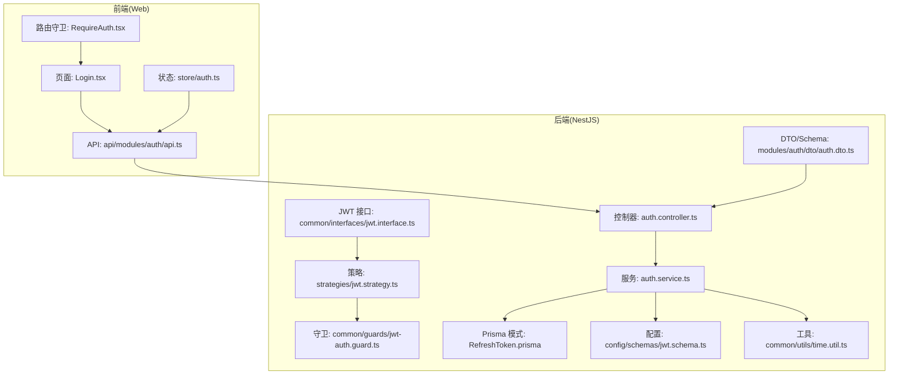
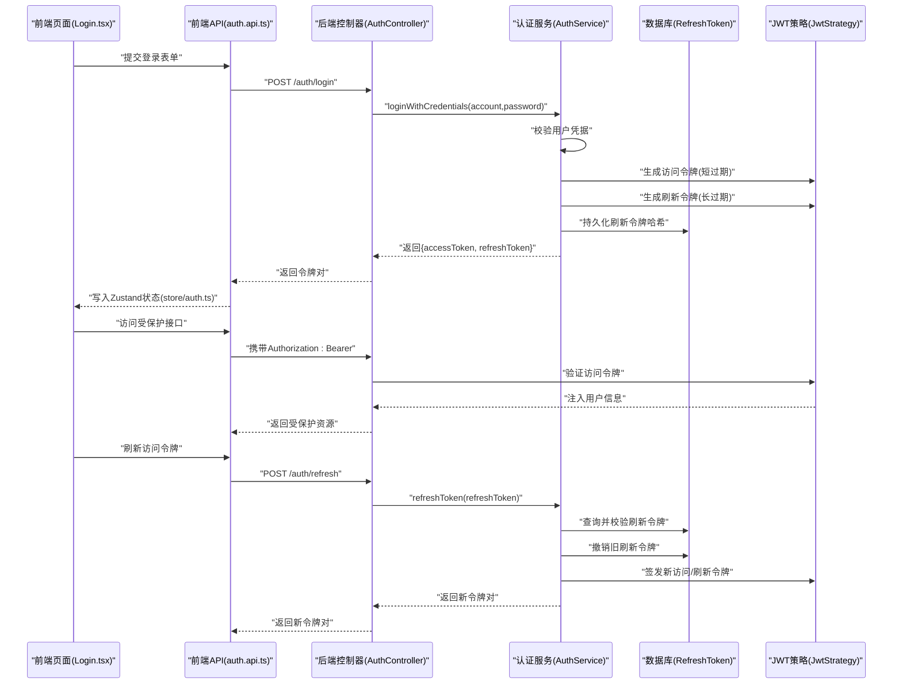
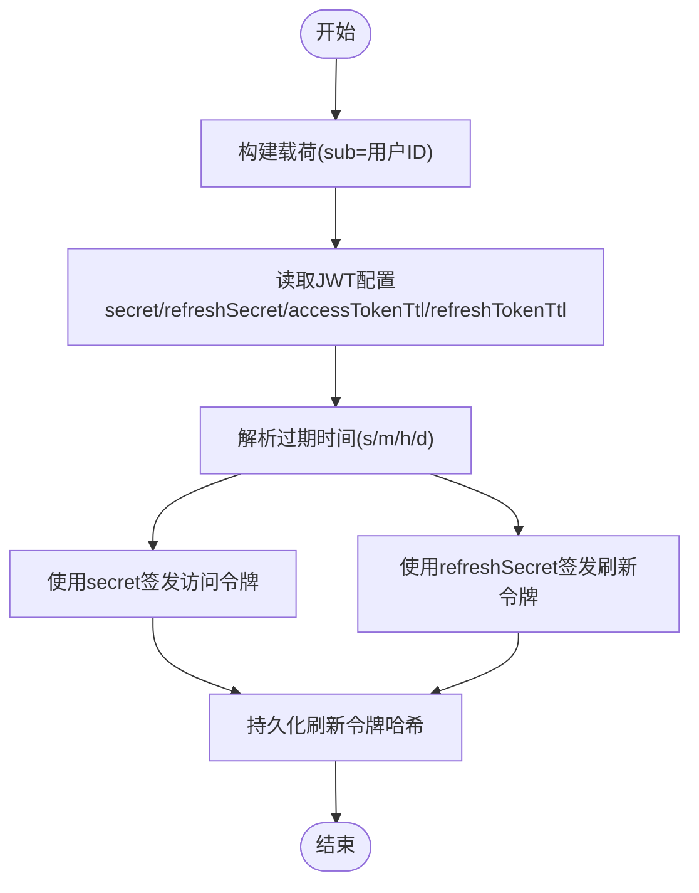
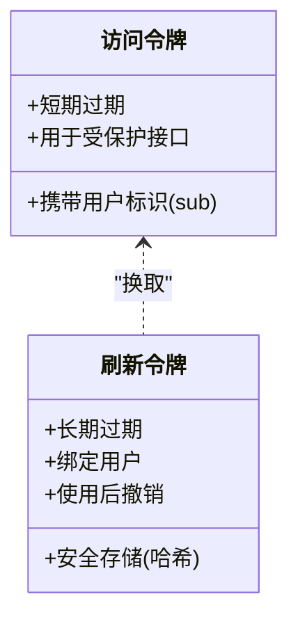
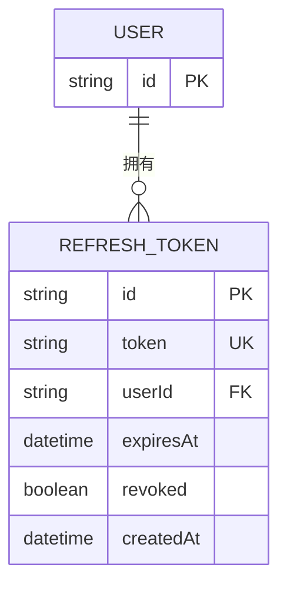
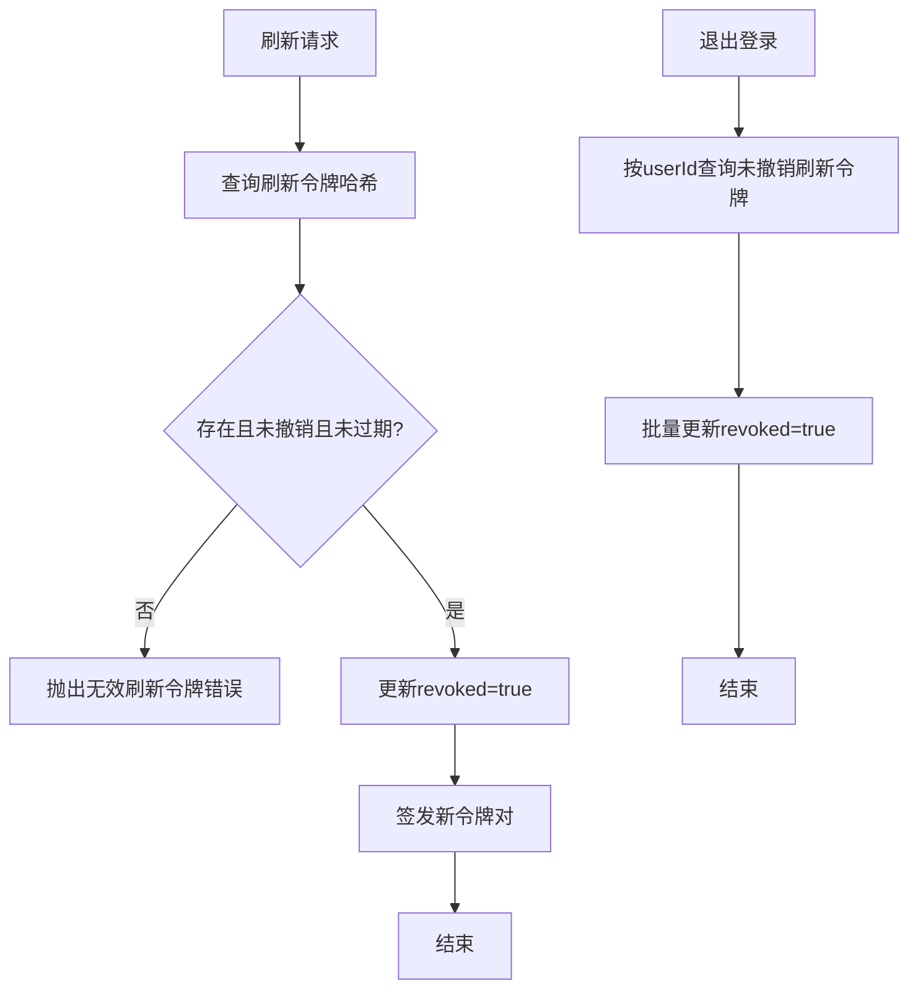
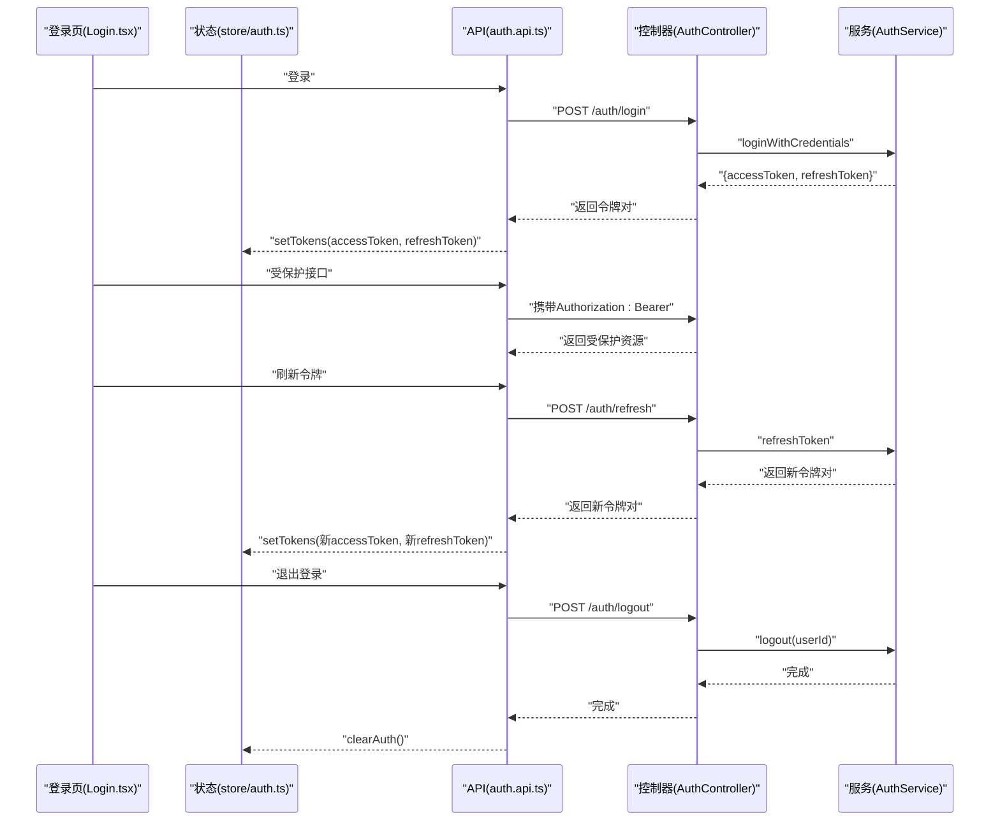
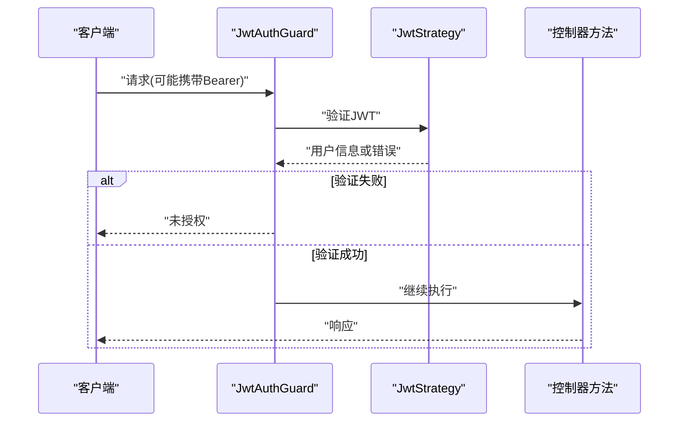
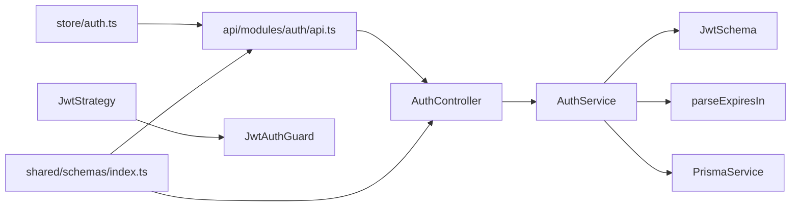

# 令牌管理

<cite>
**本文引用的文件**
- [apps/nestjs-server/src/modules/auth/auth.service.ts](file://apps/nestjs-server/src/modules/auth/auth.service.ts)
- [apps/nestjs-server/src/modules/auth/auth.controller.ts](file://apps/nestjs-server/src/modules/auth/auth.controller.ts)
- [apps/nestjs-server/src/modules/auth/strategies/jwt.strategy.ts](file://apps/nestjs-server/src/modules/auth/strategies/jwt.strategy.ts)
- [apps/nestjs-server/src/common/guards/jwt-auth.guard.ts](file://apps/nestjs-server/src/common/guards/jwt-auth.guard.ts)
- [apps/nestjs-server/prisma/schema/RefreshToken.prisma](file://apps/nestjs-server/prisma/schema/RefreshToken.prisma)
- [apps/nestjs-server/src/modules/auth/dto/auth.dto.ts](file://apps/nestjs-server/src/modules/auth/dto/auth.dto.ts)
- [apps/nestjs-server/src/common/interfaces/jwt.interface.ts](file://apps/nestjs-server/src/common/interfaces/jwt.interface.ts)
- [apps/nestjs-server/src/config/schemas/jwt.schema.ts](file://apps/nestjs-server/src/config/schemas/jwt.schema.ts)
- [apps/nestjs-server/src/common/utils/time.util.ts](file://apps/nestjs-server/src/common/utils/time.util.ts)
- [apps/web/src/store/auth.ts](file://apps/web/src/store/auth.ts)
- [apps/web/src/pages/Login.tsx](file://apps/web/src/pages/Login.tsx)
- [apps/web/src/api/modules/auth/api.ts](file://apps/web/src/api/modules/auth/api.ts)
- [apps/web/src/components/RequireAuth.tsx](file://apps/web/src/components/RequireAuth.tsx)
- [packages/shared/src/schemas/index.ts](file://packages/shared/src/schemas/index.ts)
</cite>

## 目录
1. [引言](#引言)
2. [项目结构](#项目结构)
3. [核心组件](#核心组件)
4. [架构总览](#架构总览)
5. [详细组件分析](#详细组件分析)
6. [依赖关系分析](#依赖关系分析)
7. [性能考量](#性能考量)
8. [故障排查指南](#故障排查指南)
9. [结论](#结论)
10. [附录](#附录)

## 引言
本文件围绕令牌管理系统进行深入技术说明，涵盖 JWT 访问令牌与刷新令牌的生成流程、载荷构建、签名密钥与过期时间配置、生命周期与自动续期机制、刷新令牌的安全存储与撤销策略，并结合前端状态管理与后端控制器/服务/守卫实现，给出端到端的调用链路与安全建议。

## 项目结构
后端采用 NestJS 架构，认证模块位于 apps/nestjs-server/src/modules/auth；前端使用 Zustand 管理认证状态，API 层通过统一的 endpoints 封装调用。Prisma 模式定义了刷新令牌表结构，支持按用户维度绑定与撤销。

图表来源
- [apps/web/src/pages/Login.tsx:1-221](file://apps/web/src/pages/Login.tsx#L1-L221)
- [apps/web/src/store/auth.ts:1-64](file://apps/web/src/store/auth.ts#L1-L64)
- [apps/web/src/api/modules/auth/api.ts:1-45](file://apps/web/src/api/modules/auth/api.ts#L1-L45)
- [apps/web/src/components/RequireAuth.tsx:1-14](file://apps/web/src/components/RequireAuth.tsx#L1-L14)
- [apps/nestjs-server/src/modules/auth/auth.controller.ts:1-115](file://apps/nestjs-server/src/modules/auth/auth.controller.ts#L1-L115)
- [apps/nestjs-server/src/modules/auth/auth.service.ts:1-151](file://apps/nestjs-server/src/modules/auth/auth.service.ts#L1-L151)
- [apps/nestjs-server/src/modules/auth/strategies/jwt.strategy.ts:1-49](file://apps/nestjs-server/src/modules/auth/strategies/jwt.strategy.ts#L1-L49)
- [apps/nestjs-server/src/common/guards/jwt-auth.guard.ts:1-43](file://apps/nestjs-server/src/common/guards/jwt-auth.guard.ts#L1-L43)
- [apps/nestjs-server/prisma/schema/RefreshToken.prisma:1-12](file://apps/nestjs-server/prisma/schema/RefreshToken.prisma#L1-L12)
- [apps/nestjs-server/src/modules/auth/dto/auth.dto.ts:1-30](file://apps/nestjs-server/src/modules/auth/dto/auth.dto.ts#L1-L30)
- [apps/nestjs-server/src/common/interfaces/jwt.interface.ts:1-11](file://apps/nestjs-server/src/common/interfaces/jwt.interface.ts#L1-L11)
- [apps/nestjs-server/src/config/schemas/jwt.schema.ts:1-11](file://apps/nestjs-server/src/config/schemas/jwt.schema.ts#L1-L11)
- [apps/nestjs-server/src/common/utils/time.util.ts:1-72](file://apps/nestjs-server/src/common/utils/time.util.ts#L1-L72)

章节来源
- [apps/nestjs-server/src/modules/auth/auth.controller.ts:1-115](file://apps/nestjs-server/src/modules/auth/auth.controller.ts#L1-L115)
- [apps/nestjs-server/src/modules/auth/auth.service.ts:1-151](file://apps/nestjs-server/src/modules/auth/auth.service.ts#L1-L151)
- [apps/nestjs-server/prisma/schema/RefreshToken.prisma:1-12](file://apps/nestjs-server/prisma/schema/RefreshToken.prisma#L1-L12)
- [apps/web/src/store/auth.ts:1-64](file://apps/web/src/store/auth.ts#L1-L64)

## 核心组件
- 后端认证控制器：提供注册、登录、刷新、退出、获取用户资料等接口，负责参数校验与响应封装。
- 认证服务：实现登录凭据校验、令牌签发、刷新令牌校验与撤销、用户退出撤销等核心逻辑。
- JWT 策略与守卫：基于 Passport 的 JWT 策略解析 Bearer 令牌并注入用户信息，JwtAuthGuard 统一拦截未授权访问。
- Prisma 刷新令牌模型：持久化刷新令牌哈希、用户绑定、过期时间与撤销标记。
- 前端状态与 API：Zustand 存储令牌与用户信息，API 层统一封装请求，页面组件驱动登录流程。

章节来源
- [apps/nestjs-server/src/modules/auth/auth.controller.ts:1-115](file://apps/nestjs-server/src/modules/auth/auth.controller.ts#L1-L115)
- [apps/nestjs-server/src/modules/auth/auth.service.ts:1-151](file://apps/nestjs-server/src/modules/auth/auth.service.ts#L1-L151)
- [apps/nestjs-server/src/modules/auth/strategies/jwt.strategy.ts:1-49](file://apps/nestjs-server/src/modules/auth/strategies/jwt.strategy.ts#L1-L49)
- [apps/nestjs-server/src/common/guards/jwt-auth.guard.ts:1-43](file://apps/nestjs-server/src/common/guards/jwt-auth.guard.ts#L1-L43)
- [apps/nestjs-server/prisma/schema/RefreshToken.prisma:1-12](file://apps/nestjs-server/prisma/schema/RefreshToken.prisma#L1-L12)
- [apps/web/src/store/auth.ts:1-64](file://apps/web/src/store/auth.ts#L1-L64)
- [apps/web/src/api/modules/auth/api.ts:1-45](file://apps/web/src/api/modules/auth/api.ts#L1-L45)

## 架构总览
下图展示了从前端到后端的完整认证流程：登录获取双令牌、使用访问令牌受保护接口、访问令牌过期后使用刷新令牌续期、退出时撤销所有刷新令牌。

图表来源
- [apps/web/src/pages/Login.tsx:1-221](file://apps/web/src/pages/Login.tsx#L1-L221)
- [apps/web/src/api/modules/auth/api.ts:1-45](file://apps/web/src/api/modules/auth/api.ts#L1-L45)
- [apps/web/src/store/auth.ts:1-64](file://apps/web/src/store/auth.ts#L1-L64)
- [apps/nestjs-server/src/modules/auth/auth.controller.ts:1-115](file://apps/nestjs-server/src/modules/auth/auth.controller.ts#L1-L115)
- [apps/nestjs-server/src/modules/auth/auth.service.ts:1-151](file://apps/nestjs-server/src/modules/auth/auth.service.ts#L1-L151)
- [apps/nestjs-server/src/modules/auth/strategies/jwt.strategy.ts:1-49](file://apps/nestjs-server/src/modules/auth/strategies/jwt.strategy.ts#L1-L49)
- [apps/nestjs-server/prisma/schema/RefreshToken.prisma:1-12](file://apps/nestjs-server/prisma/schema/RefreshToken.prisma#L1-L12)

## 详细组件分析

### JWT 令牌生成与配置
- 载荷构建：仅包含用户标识(sub)，避免在令牌内携带敏感信息。
- 签名算法：使用独立的访问令牌与刷新令牌密钥，分别配置过期时间。
- 过期时间：通过配置项与时间解析工具将字符串形式的时间转换为秒数。

图表来源
- [apps/nestjs-server/src/modules/auth/auth.service.ts:105-142](file://apps/nestjs-server/src/modules/auth/auth.service.ts#L105-L142)
- [apps/nestjs-server/src/config/schemas/jwt.schema.ts:1-11](file://apps/nestjs-server/src/config/schemas/jwt.schema.ts#L1-L11)
- [apps/nestjs-server/src/common/utils/time.util.ts:12-31](file://apps/nestjs-server/src/common/utils/time.util.ts#L12-L31)
- [apps/nestjs-server/src/common/interfaces/jwt.interface.ts:1-11](file://apps/nestjs-server/src/common/interfaces/jwt.interface.ts#L1-L11)

章节来源
- [apps/nestjs-server/src/modules/auth/auth.service.ts:105-142](file://apps/nestjs-server/src/modules/auth/auth.service.ts#L105-L142)
- [apps/nestjs-server/src/config/schemas/jwt.schema.ts:1-11](file://apps/nestjs-server/src/config/schemas/jwt.schema.ts#L1-L11)
- [apps/nestjs-server/src/common/utils/time.util.ts:12-31](file://apps/nestjs-server/src/common/utils/time.util.ts#L12-L31)
- [apps/nestjs-server/src/common/interfaces/jwt.interface.ts:1-11](file://apps/nestjs-server/src/common/interfaces/jwt.interface.ts#L1-L11)

### 访问令牌与刷新令牌的区别与用途
- 访问令牌：短期有效，用于访问受保护资源；过期后需使用刷新令牌换取新令牌。
- 刷新令牌：长期有效但被安全存储与严格校验，每次使用都会撤销旧令牌并签发新令牌；退出登录会批量撤销用户所有未撤销的刷新令牌。

图表来源
- [apps/nestjs-server/src/modules/auth/auth.service.ts:64-84](file://apps/nestjs-server/src/modules/auth/auth.service.ts#L64-L84)
- [apps/nestjs-server/src/modules/auth/auth.service.ts:90-98](file://apps/nestjs-server/src/modules/auth/auth.service.ts#L90-L98)
- [apps/nestjs-server/prisma/schema/RefreshToken.prisma:1-12](file://apps/nestjs-server/prisma/schema/RefreshToken.prisma#L1-L12)

章节来源
- [apps/nestjs-server/src/modules/auth/auth.service.ts:64-84](file://apps/nestjs-server/src/modules/auth/auth.service.ts#L64-L84)
- [apps/nestjs-server/src/modules/auth/auth.service.ts:90-98](file://apps/nestjs-server/src/modules/auth/auth.service.ts#L90-L98)
- [apps/nestjs-server/prisma/schema/RefreshToken.prisma:1-12](file://apps/nestjs-server/prisma/schema/RefreshToken.prisma#L1-L12)

### 刷新令牌存储策略与安全要求
- 数据库设计：使用唯一索引 token 字段，外键关联用户，记录过期时间与撤销标记；为 userId 建立索引便于按用户查询。
- 令牌绑定用户：刷新令牌与用户 ID 关联，支持按用户批量撤销。
- 安全存储：仅持久化 SHA-256 哈希值，不存储明文刷新令牌；签发时同时创建持久化记录并设置过期时间。

图表来源
- [apps/nestjs-server/prisma/schema/RefreshToken.prisma:1-12](file://apps/nestjs-server/prisma/schema/RefreshToken.prisma#L1-L12)

章节来源
- [apps/nestjs-server/prisma/schema/RefreshToken.prisma:1-12](file://apps/nestjs-server/prisma/schema/RefreshToken.prisma#L1-L12)
- [apps/nestjs-server/src/modules/auth/auth.service.ts:147-149](file://apps/nestjs-server/src/modules/auth/auth.service.ts#L147-L149)

### 令牌撤销机制与用户登出
- 单次撤销：刷新令牌验证通过后，立即撤销该刷新令牌，防止重复使用。
- 批量撤销：退出登录时，按用户 ID 查询未撤销的刷新令牌并全部标记为撤销，确保彻底登出。

图表来源
- [apps/nestjs-server/src/modules/auth/auth.service.ts:64-84](file://apps/nestjs-server/src/modules/auth/auth.service.ts#L64-L84)
- [apps/nestjs-server/src/modules/auth/auth.service.ts:90-98](file://apps/nestjs-server/src/modules/auth/auth.service.ts#L90-L98)

章节来源
- [apps/nestjs-server/src/modules/auth/auth.service.ts:64-84](file://apps/nestjs-server/src/modules/auth/auth.service.ts#L64-L84)
- [apps/nestjs-server/src/modules/auth/auth.service.ts:90-98](file://apps/nestjs-server/src/modules/auth/auth.service.ts#L90-L98)

### 前端令牌发放与续期流程
- 登录成功：后端返回访问令牌与刷新令牌，前端写入 Zustand 状态并持久化。
- 受保护接口：前端在请求头携带 Authorization: Bearer 访问令牌。
- 刷新令牌：当访问令牌过期，前端调用刷新接口获取新令牌对并更新状态。
- 退出登录：前端触发退出接口，后端撤销用户所有刷新令牌，前端清空状态。

图表来源
- [apps/web/src/pages/Login.tsx:1-221](file://apps/web/src/pages/Login.tsx#L1-L221)
- [apps/web/src/store/auth.ts:1-64](file://apps/web/src/store/auth.ts#L1-L64)
- [apps/web/src/api/modules/auth/api.ts:1-45](file://apps/web/src/api/modules/auth/api.ts#L1-L45)
- [apps/nestjs-server/src/modules/auth/auth.controller.ts:1-115](file://apps/nestjs-server/src/modules/auth/auth.controller.ts#L1-L115)
- [apps/nestjs-server/src/modules/auth/auth.service.ts:1-151](file://apps/nestjs-server/src/modules/auth/auth.service.ts#L1-L151)

章节来源
- [apps/web/src/pages/Login.tsx:1-221](file://apps/web/src/pages/Login.tsx#L1-L221)
- [apps/web/src/store/auth.ts:1-64](file://apps/web/src/store/auth.ts#L1-L64)
- [apps/web/src/api/modules/auth/api.ts:1-45](file://apps/web/src/api/modules/auth/api.ts#L1-L45)
- [apps/nestjs-server/src/modules/auth/auth.controller.ts:1-115](file://apps/nestjs-server/src/modules/auth/auth.controller.ts#L1-L115)
- [apps/nestjs-server/src/modules/auth/auth.service.ts:1-151](file://apps/nestjs-server/src/modules/auth/auth.service.ts#L1-L151)

### 守卫与策略：访问控制与用户注入
- JwtStrategy：从 Authorization 头解析 Bearer 令牌，验证签名与过期，查询用户角色并注入到请求对象。
- JwtAuthGuard：统一拦截器，非公开接口必须通过 JWT 验证，否则抛出未授权异常。

图表来源
- [apps/nestjs-server/src/modules/auth/strategies/jwt.strategy.ts:1-49](file://apps/nestjs-server/src/modules/auth/strategies/jwt.strategy.ts#L1-L49)
- [apps/nestjs-server/src/common/guards/jwt-auth.guard.ts:1-43](file://apps/nestjs-server/src/common/guards/jwt-auth.guard.ts#L1-L43)

章节来源
- [apps/nestjs-server/src/modules/auth/strategies/jwt.strategy.ts:1-49](file://apps/nestjs-server/src/modules/auth/strategies/jwt.strategy.ts#L1-L49)
- [apps/nestjs-server/src/common/guards/jwt-auth.guard.ts:1-43](file://apps/nestjs-server/src/common/guards/jwt-auth.guard.ts#L1-L43)

## 依赖关系分析
- 控制器依赖服务：控制器仅负责参数与响应封装，核心逻辑在服务层。
- 服务依赖配置与工具：读取 JWT 配置、解析过期时间、使用 JwtService 签发令牌、使用 Prisma 持久化刷新令牌。
- 前端依赖共享模式：前后端 DTO/Schema 由共享包统一定义，保证字段一致性。
- 守卫与策略：JwtAuthGuard 继承自 AuthGuard('jwt')，JwtStrategy 配置提取令牌与密钥。

图表来源
- [apps/nestjs-server/src/modules/auth/auth.controller.ts:1-115](file://apps/nestjs-server/src/modules/auth/auth.controller.ts#L1-L115)
- [apps/nestjs-server/src/modules/auth/auth.service.ts:1-151](file://apps/nestjs-server/src/modules/auth/auth.service.ts#L1-L151)
- [apps/nestjs-server/src/config/schemas/jwt.schema.ts:1-11](file://apps/nestjs-server/src/config/schemas/jwt.schema.ts#L1-L11)
- [apps/nestjs-server/src/common/utils/time.util.ts:12-31](file://apps/nestjs-server/src/common/utils/time.util.ts#L12-L31)
- [apps/web/src/store/auth.ts:1-64](file://apps/web/src/store/auth.ts#L1-L64)
- [apps/web/src/api/modules/auth/api.ts:1-45](file://apps/web/src/api/modules/auth/api.ts#L1-L45)
- [apps/nestjs-server/src/modules/auth/strategies/jwt.strategy.ts:1-49](file://apps/nestjs-server/src/modules/auth/strategies/jwt.strategy.ts#L1-L49)
- [apps/nestjs-server/src/common/guards/jwt-auth.guard.ts:1-43](file://apps/nestjs-server/src/common/guards/jwt-auth.guard.ts#L1-L43)
- [packages/shared/src/schemas/index.ts:1-8](file://packages/shared/src/schemas/index.ts#L1-L8)

章节来源
- [apps/nestjs-server/src/modules/auth/auth.controller.ts:1-115](file://apps/nestjs-server/src/modules/auth/auth.controller.ts#L1-L115)
- [apps/nestjs-server/src/modules/auth/auth.service.ts:1-151](file://apps/nestjs-server/src/modules/auth/auth.service.ts#L1-L151)
- [apps/web/src/store/auth.ts:1-64](file://apps/web/src/store/auth.ts#L1-L64)
- [apps/web/src/api/modules/auth/api.ts:1-45](file://apps/web/src/api/modules/auth/api.ts#L1-L45)
- [packages/shared/src/schemas/index.ts:1-8](file://packages/shared/src/schemas/index.ts#L1-L8)

## 性能考量
- 并发签发：访问令牌与刷新令牌并发签发，减少往返延迟。
- 时间解析：统一使用时间解析工具，避免字符串解析错误导致的默认过期时间偏差。
- 数据库索引：为 userId 建立索引，提升按用户查询与批量撤销效率。
- 前端状态：仅持久化必要字段，避免不必要的序列化开销。

## 故障排查指南
- 未授权访问
  - 现象：接口返回未授权错误。
  - 排查：确认请求头是否包含正确的 Bearer 令牌；检查 JwtAuthGuard 是否生效；确认 JwtStrategy 密钥配置正确。
  - 参考
    - [apps/nestjs-server/src/common/guards/jwt-auth.guard.ts:36-41](file://apps/nestjs-server/src/common/guards/jwt-auth.guard.ts#L36-L41)
    - [apps/nestjs-server/src/modules/auth/strategies/jwt.strategy.ts:15-20](file://apps/nestjs-server/src/modules/auth/strategies/jwt.strategy.ts#L15-L20)
- 无效刷新令牌
  - 现象：刷新接口返回无效刷新令牌错误。
  - 排查：确认刷新令牌哈希是否存在、是否已撤销、是否已过期；检查服务端日志与数据库记录。
  - 参考
    - [apps/nestjs-server/src/modules/auth/auth.service.ts:64-73](file://apps/nestjs-server/src/modules/auth/auth.service.ts#L64-L73)
- 退出登录无效
  - 现象：退出后仍可使用旧刷新令牌换取新访问令牌。
  - 排查：确认退出接口是否调用服务端 logout；检查数据库中用户未撤销刷新令牌是否被正确更新。
  - 参考
    - [apps/nestjs-server/src/modules/auth/auth.controller.ts:100-102](file://apps/nestjs-server/src/modules/auth/auth.controller.ts#L100-L102)
    - [apps/nestjs-server/src/modules/auth/auth.service.ts:90-98](file://apps/nestjs-server/src/modules/auth/auth.service.ts#L90-L98)
- 前端无法登录
  - 现象：登录失败或页面无跳转。
  - 排查：确认验证码接口可用；检查前端 store 写入与路由守卫逻辑；查看网络请求与错误提示。
  - 参考
    - [apps/web/src/pages/Login.tsx:79-92](file://apps/web/src/pages/Login.tsx#L79-L92)
    - [apps/web/src/store/auth.ts:36-46](file://apps/web/src/store/auth.ts#L36-L46)
    - [apps/web/src/components/RequireAuth.tsx:4-13](file://apps/web/src/components/RequireAuth.tsx#L4-L13)

章节来源
- [apps/nestjs-server/src/common/guards/jwt-auth.guard.ts:36-41](file://apps/nestjs-server/src/common/guards/jwt-auth.guard.ts#L36-L41)
- [apps/nestjs-server/src/modules/auth/strategies/jwt.strategy.ts:15-20](file://apps/nestjs-server/src/modules/auth/strategies/jwt.strategy.ts#L15-L20)
- [apps/nestjs-server/src/modules/auth/auth.service.ts:64-73](file://apps/nestjs-server/src/modules/auth/auth.service.ts#L64-L73)
- [apps/nestjs-server/src/modules/auth/auth.controller.ts:100-102](file://apps/nestjs-server/src/modules/auth/auth.controller.ts#L100-L102)
- [apps/nestjs-server/src/modules/auth/auth.service.ts:90-98](file://apps/nestjs-server/src/modules/auth/auth.service.ts#L90-L98)
- [apps/web/src/pages/Login.tsx:79-92](file://apps/web/src/pages/Login.tsx#L79-L92)
- [apps/web/src/store/auth.ts:36-46](file://apps/web/src/store/auth.ts#L36-L46)
- [apps/web/src/components/RequireAuth.tsx:4-13](file://apps/web/src/components/RequireAuth.tsx#L4-L13)

## 结论
本系统采用“短效访问令牌 + 长效刷新令牌”的经典方案，配合数据库安全存储与严格的撤销策略，实现了可靠的令牌生命周期管理。前端通过 Zustand 管理令牌状态并与后端 API 协作，形成清晰的登录、续期与退出流程。建议在生产环境中进一步强化传输安全、防重放与审计能力。

## 附录
- 令牌相关业务逻辑示例路径
  - 登录成功发放令牌对：[apps/nestjs-server/src/modules/auth/auth.service.ts:29-37](file://apps/nestjs-server/src/modules/auth/auth.service.ts#L29-L37)
  - 刷新令牌验证与续期：[apps/nestjs-server/src/modules/auth/auth.service.ts:64-84](file://apps/nestjs-server/src/modules/auth/auth.service.ts#L64-L84)
  - 退出登录撤销刷新令牌：[apps/nestjs-server/src/modules/auth/auth.service.ts:90-98](file://apps/nestjs-server/src/modules/auth/auth.service.ts#L90-L98)
  - 前端登录写入状态：[apps/web/src/store/auth.ts:36-38](file://apps/web/src/store/auth.ts#L36-L38)
  - 前端刷新令牌续期：[apps/web/src/api/modules/auth/api.ts:32-34](file://apps/web/src/api/modules/auth/api.ts#L32-L34)
- 安全考虑要点
  - 传输安全：始终通过 HTTPS 传输令牌，避免明文暴露。
  - 防止泄露：前端避免将令牌写入 localStorage（除非强加密），优先使用 HttpOnly Cookie 或内存态。
  - CSRF 防护：刷新令牌与访问令牌分离，避免在同源下复用；对敏感操作启用二次验证。
  - 令牌最小化：载荷仅包含必要信息，避免敏感字段进入令牌。
  - 审计与监控：记录令牌签发、撤销与异常访问事件，定期轮换密钥。