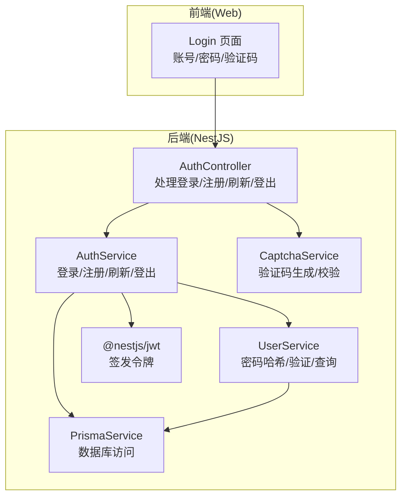
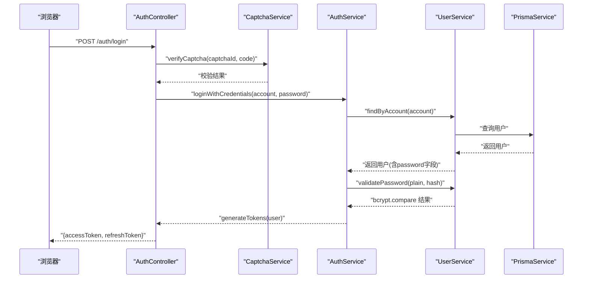
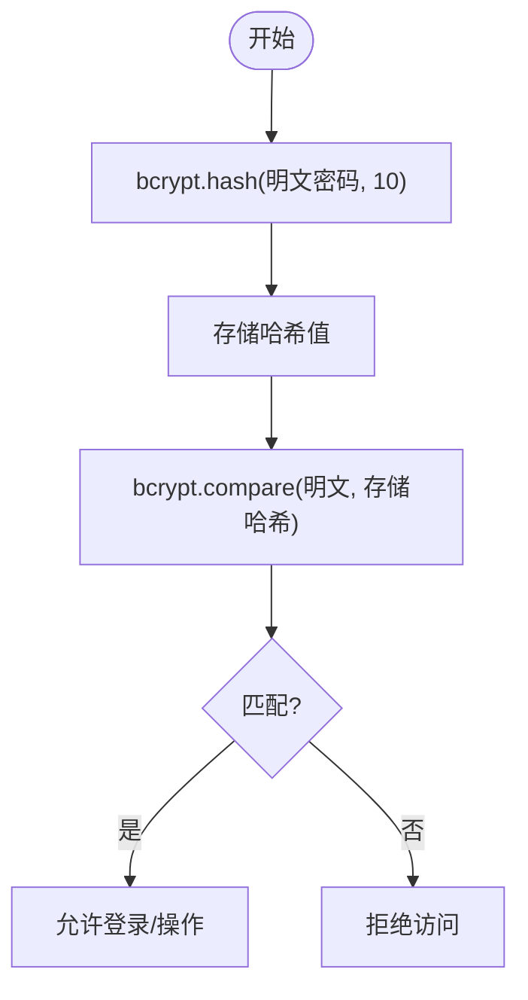
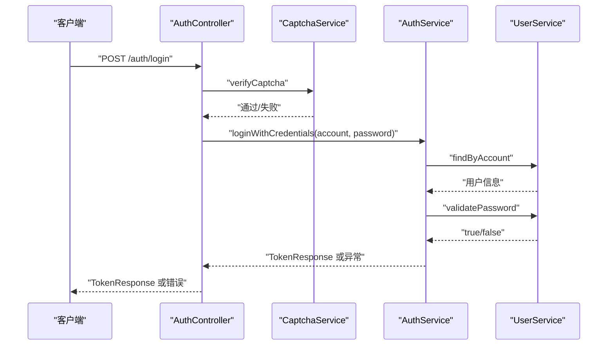
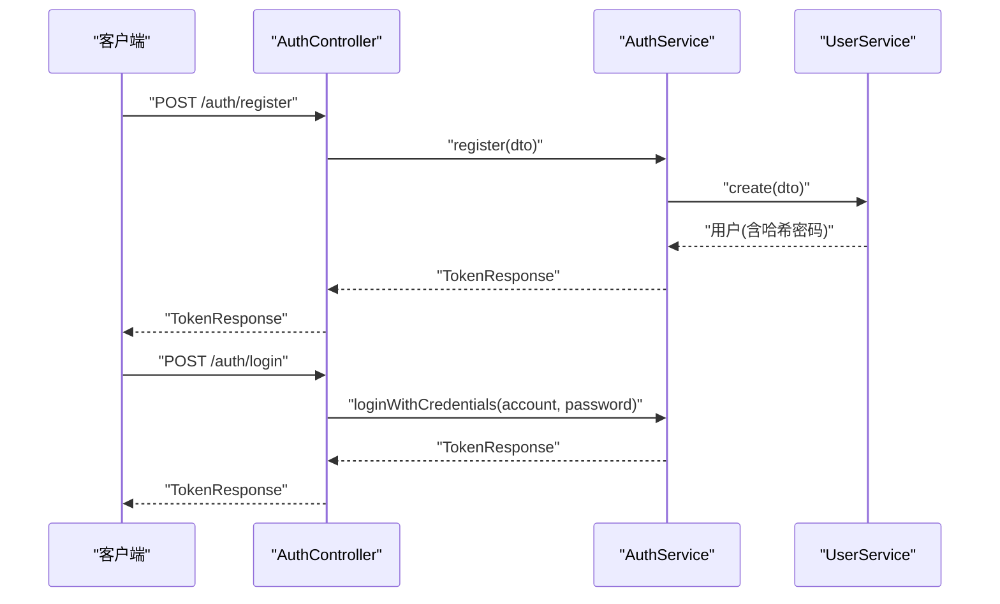
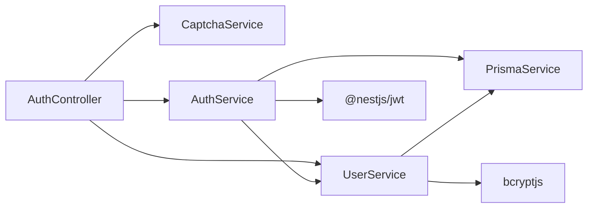

# 密码安全机制

<cite>
**本文引用的文件**
- [apps/nestjs-server/src/modules/user/user.service.ts](file://apps/nestjs-server/src/modules/user/user.service.ts)
- [apps/nestjs-server/src/modules/auth/auth.service.ts](file://apps/nestjs-server/src/modules/auth/auth.service.ts)
- [apps/nestjs-server/src/modules/auth/auth.controller.ts](file://apps/nestjs-server/src/modules/auth/auth.controller.ts)
- [apps/nestjs-server/src/modules/auth/captcha.service.ts](file://apps/nestjs-server/src/modules/auth/captcha.service.ts)
- [apps/nestjs-server/scripts/debug-password.ts](file://apps/nestjs-server/scripts/debug-password.ts)
- [apps/web/src/pages/Login.tsx](file://apps/web/src/pages/Login.tsx)
</cite>

## 目录
1. [引言](#引言)
2. [项目结构](#项目结构)
3. [核心组件](#核心组件)
4. [架构总览](#架构总览)
5. [详细组件分析](#详细组件分析)
6. [依赖关系分析](#依赖关系分析)
7. [性能考量](#性能考量)
8. [故障排查指南](#故障排查指南)
9. [结论](#结论)
10. [附录](#附录)

## 引言
本文件围绕密码安全机制进行系统化技术说明，覆盖以下主题：
- 密码加密算法选择与实现（基于 bcrypt 的哈希策略）
- 登录验证流程（用户输入与存储哈希的比对）
- 密码重置机制（令牌生成、邮箱验证与链接有效期管理）
- 密码强度验证规则（长度、字符类型、常见密码检测）
- 完整业务流程示例（注册、登录、修改密码）
- 安全最佳实践（防字典攻击、防彩虹表攻击、密码历史管理）

为保证准确性，本文所有技术细节均以仓库中实际实现为依据。

## 项目结构
密码相关能力主要分布在后端 NestJS 服务与前端 Web 应用中：
- 后端
  - 用户服务：负责密码哈希、密码验证、用户查询
  - 认证服务：登录、注册、刷新令牌、登出
  - 验证码服务：图形验证码生成与校验
  - 调试脚本：本地调试密码哈希与匹配
- 前端
  - 登录页面：账号、密码、验证码输入与提交

图表来源
- [apps/nestjs-server/src/modules/auth/auth.controller.ts:1-115](file://apps/nestjs-server/src/modules/auth/auth.controller.ts#L1-L115)
- [apps/nestjs-server/src/modules/auth/auth.service.ts:1-151](file://apps/nestjs-server/src/modules/auth/auth.service.ts#L1-L151)
- [apps/nestjs-server/src/modules/user/user.service.ts:1-113](file://apps/nestjs-server/src/modules/user/user.service.ts#L1-L113)
- [apps/nestjs-server/src/modules/auth/captcha.service.ts:1-67](file://apps/nestjs-server/src/modules/auth/captcha.service.ts#L1-L67)

章节来源
- [apps/nestjs-server/src/modules/auth/auth.controller.ts:1-115](file://apps/nestjs-server/src/modules/auth/auth.controller.ts#L1-L115)
- [apps/nestjs-server/src/modules/auth/auth.service.ts:1-151](file://apps/nestjs-server/src/modules/auth/auth.service.ts#L1-L151)
- [apps/nestjs-server/src/modules/user/user.service.ts:1-113](file://apps/nestjs-server/src/modules/user/user.service.ts#L1-L113)
- [apps/nestjs-server/src/modules/auth/captcha.service.ts:1-67](file://apps/nestjs-server/src/modules/auth/captcha.service.ts#L1-L67)

## 核心组件
- 用户服务（UserService）
  - 注册时对明文密码进行 bcrypt 哈希（默认成本因子为 10）
  - 登录时使用 bcrypt.compare 将明文密码与存储的哈希进行比对
- 认证服务（AuthService）
  - loginWithCredentials：根据账号查找用户并验证密码，通过则签发访问与刷新令牌
  - register：重复性检查（邮箱/用户名），创建用户并签发令牌
  - refreshToken：校验刷新令牌有效性（哈希存储、过期与撤销状态），签发新令牌并撤销旧令牌
  - logout：撤销当前用户的所有未撤销刷新令牌
- 验证码服务（CaptchaService）
  - 生成 SVG 图形验证码，存入 Redis 并设置过期时间
  - 校验验证码后立即删除，避免重复使用
- 登录前端（Login 页面）
  - 输入账号、密码、验证码，提交到后端

章节来源
- [apps/nestjs-server/src/modules/user/user.service.ts:17-31](file://apps/nestjs-server/src/modules/user/user.service.ts#L17-L31)
- [apps/nestjs-server/src/modules/user/user.service.ts:99-101](file://apps/nestjs-server/src/modules/user/user.service.ts#L99-L101)
- [apps/nestjs-server/src/modules/auth/auth.service.ts:29-37](file://apps/nestjs-server/src/modules/auth/auth.service.ts#L29-L37)
- [apps/nestjs-server/src/modules/auth/auth.service.ts:44-57](file://apps/nestjs-server/src/modules/auth/auth.service.ts#L44-L57)
- [apps/nestjs-server/src/modules/auth/auth.service.ts:64-84](file://apps/nestjs-server/src/modules/auth/auth.service.ts#L64-L84)
- [apps/nestjs-server/src/modules/auth/auth.service.ts:90-98](file://apps/nestjs-server/src/modules/auth/auth.service.ts#L90-L98)
- [apps/nestjs-server/src/modules/auth/captcha.service.ts:24-46](file://apps/nestjs-server/src/modules/auth/captcha.service.ts#L24-L46)
- [apps/nestjs-server/src/modules/auth/captcha.service.ts:48-65](file://apps/nestjs-server/src/modules/auth/captcha.service.ts#L48-L65)
- [apps/web/src/pages/Login.tsx:111-162](file://apps/web/src/pages/Login.tsx#L111-L162)

## 架构总览
下图展示了从登录请求到令牌发放的关键交互路径，以及密码哈希与验证的核心流程。

图表来源
- [apps/nestjs-server/src/modules/auth/auth.controller.ts:73-76](file://apps/nestjs-server/src/modules/auth/auth.controller.ts#L73-L76)
- [apps/nestjs-server/src/modules/auth/captcha.service.ts:48-65](file://apps/nestjs-server/src/modules/auth/captcha.service.ts#L48-L65)
- [apps/nestjs-server/src/modules/auth/auth.service.ts:29-37](file://apps/nestjs-server/src/modules/auth/auth.service.ts#L29-L37)
- [apps/nestjs-server/src/modules/user/user.service.ts:99-101](file://apps/nestjs-server/src/modules/user/user.service.ts#L99-L101)

## 详细组件分析

### 组件一：密码加密与验证（bcrypt）
- 加密实现
  - 注册时对明文密码执行 bcrypt.hash，成本因子为 10
  - 存储的是不可逆哈希值
- 验证实现
  - 登录时使用 bcrypt.compare 将明文密码与存储哈希比对
  - 返回布尔值表示是否匹配
- 配置参数与强度
  - 成本因子（rounds）：10
  - 字符集与盐：bcrypt 自动处理
  - 建议：在更高性能服务器上可考虑提升成本因子以增强抗暴力破解能力

图表来源
- [apps/nestjs-server/src/modules/user/user.service.ts:17-31](file://apps/nestjs-server/src/modules/user/user.service.ts#L17-L31)
- [apps/nestjs-server/src/modules/user/user.service.ts:99-101](file://apps/nestjs-server/src/modules/user/user.service.ts#L99-L101)

章节来源
- [apps/nestjs-server/src/modules/user/user.service.ts:17-31](file://apps/nestjs-server/src/modules/user/user.service.ts#L17-L31)
- [apps/nestjs-server/src/modules/user/user.service.ts:99-101](file://apps/nestjs-server/src/modules/user/user.service.ts#L99-L101)

### 组件二：登录验证流程
- 流程要点
  - 先通过验证码服务校验图形验证码
  - 查询用户（邮箱或用户名）
  - 使用 validatePassword 比对密码
  - 成功后签发访问令牌与刷新令牌
- 错误处理
  - 凭据无效或密码错误抛出业务异常
  - 验证码不存在或不正确抛出业务异常

图表来源
- [apps/nestjs-server/src/modules/auth/auth.controller.ts:73-76](file://apps/nestjs-server/src/modules/auth/auth.controller.ts#L73-L76)
- [apps/nestjs-server/src/modules/auth/auth.service.ts:29-37](file://apps/nestjs-server/src/modules/auth/auth.service.ts#L29-L37)
- [apps/nestjs-server/src/modules/auth/captcha.service.ts:48-65](file://apps/nestjs-server/src/modules/auth/captcha.service.ts#L48-L65)

章节来源
- [apps/nestjs-server/src/modules/auth/auth.controller.ts:63-76](file://apps/nestjs-server/src/modules/auth/auth.controller.ts#L63-L76)
- [apps/nestjs-server/src/modules/auth/auth.service.ts:29-37](file://apps/nestjs-server/src/modules/auth/auth.service.ts#L29-L37)
- [apps/nestjs-server/src/modules/auth/captcha.service.ts:48-65](file://apps/nestjs-server/src/modules/auth/captcha.service.ts#L48-L65)

### 组件三：密码重置机制（设计与实现现状）
- 当前实现状态
  - 代码库中未发现“密码重置”相关控制器、服务或路由
  - 未见重置令牌生成、邮箱发送、链接有效期管理等逻辑
- 建议的实现方案（概念性，非现有代码）
  - 令牌生成：随机安全字符串 + 哈希存储
  - 邮箱验证：发送带有效期链接的邮件
  - 有效期管理：Redis/数据库记录过期时间
  - 重置流程：校验令牌 -> 校验过期 -> 更新密码（bcrypt 哈希）
- 注意事项
  - 令牌必须单次有效且不可预测
  - 链接过期后不可复用
  - 重置完成后撤销相关令牌

[本节为概念性说明，未直接分析具体源码文件]

### 组件四：密码强度验证规则（现状与建议）
- 现状
  - 代码库未发现专门的密码强度规则校验（长度、字符类型、常见密码检测）
- 建议规则（概念性，非现有代码）
  - 长度：最小 8-12 位，推荐 16+ 位
  - 字符类型：大小写字母、数字、特殊字符混合
  - 常见密码：黑名单检测（如 admin123、password 等）
  - 复杂度：避免连续字符、键盘序列、生日等易猜信息
- 实施位置
  - 建议在注册流程（AuthService.register）之前增加校验步骤

[本节为概念性说明，未直接分析具体源码文件]

### 组件五：完整业务流程示例（注册、登录、修改密码）
- 注册（注册即登录）
  - 控制器接收邮箱、用户名、密码
  - 服务层先做去重检查，再创建用户并返回令牌
  - 密码在创建时完成 bcrypt 哈希
- 登录
  - 先获取验证码并校验
  - 使用账号与密码登录，通过后签发令牌
- 修改密码（当前实现）
  - 代码库未提供“修改密码”的控制器或服务方法
  - 可参考“密码重置”建议方案，在控制器与服务中新增对应流程

图表来源
- [apps/nestjs-server/src/modules/auth/auth.controller.ts:59-61](file://apps/nestjs-server/src/modules/auth/auth.controller.ts#L59-L61)
- [apps/nestjs-server/src/modules/auth/auth.controller.ts:73-76](file://apps/nestjs-server/src/modules/auth/auth.controller.ts#L73-L76)
- [apps/nestjs-server/src/modules/auth/auth.service.ts:44-57](file://apps/nestjs-server/src/modules/auth/auth.service.ts#L44-L57)
- [apps/nestjs-server/src/modules/auth/auth.service.ts:29-37](file://apps/nestjs-server/src/modules/auth/auth.service.ts#L29-L37)

章节来源
- [apps/nestjs-server/src/modules/auth/auth.controller.ts:50-89](file://apps/nestjs-server/src/modules/auth/auth.controller.ts#L50-L89)
- [apps/nestjs-server/src/modules/auth/auth.service.ts:44-57](file://apps/nestjs-server/src/modules/auth/auth.service.ts#L44-L57)
- [apps/nestjs-server/src/modules/user/user.service.ts:17-31](file://apps/nestjs-server/src/modules/user/user.service.ts#L17-L31)

### 组件六：安全最佳实践
- 防字典攻击与暴力破解
  - 图形验证码：登录前强制校验验证码，验证码一次性使用并过期
  - 限流：控制器层对验证码与登录接口设置节流阈值
- 防彩虹表攻击
  - bcrypt 哈希 + 随机盐，成本因子 10
- 密码历史管理（建议）
  - 在数据库中维护用户最近若干条密码哈希，新密码不可与历史重复
  - 可结合“密码强度规则”共同实施

章节来源
- [apps/nestjs-server/src/modules/auth/captcha.service.ts:24-46](file://apps/nestjs-server/src/modules/auth/captcha.service.ts#L24-L46)
- [apps/nestjs-server/src/modules/auth/captcha.service.ts:48-65](file://apps/nestjs-server/src/modules/auth/captcha.service.ts#L48-L65)
- [apps/nestjs-server/src/modules/auth/auth.controller.ts:38-48](file://apps/nestjs-server/src/modules/auth/auth.controller.ts#L38-L48)
- [apps/nestjs-server/src/modules/auth/auth.controller.ts:63-76](file://apps/nestjs-server/src/modules/auth/auth.controller.ts#L63-L76)
- [apps/nestjs-server/src/modules/user/user.service.ts:17-31](file://apps/nestjs-server/src/modules/user/user.service.ts#L17-L31)

## 依赖关系分析
- 组件耦合
  - AuthController 依赖 CaptchaService、AuthService、UserService
  - AuthService 依赖 UserService、PrismaService、JwtService、配置服务
  - UserService 依赖 PrismaService、bcrypt
- 关键依赖链
  - 登录：AuthController → CaptchaService → AuthService → UserService → bcrypt
  - 注册：AuthController → AuthService → UserService → bcrypt
- 外部依赖
  - bcryptjs：密码哈希与验证
  - @nestjs/jwt：JWT 令牌签发
  - Redis：验证码存储（过期自动清理）

图表来源
- [apps/nestjs-server/src/modules/auth/auth.controller.ts:1-115](file://apps/nestjs-server/src/modules/auth/auth.controller.ts#L1-L115)
- [apps/nestjs-server/src/modules/auth/auth.service.ts:1-151](file://apps/nestjs-server/src/modules/auth/auth.service.ts#L1-L151)
- [apps/nestjs-server/src/modules/user/user.service.ts:1-113](file://apps/nestjs-server/src/modules/user/user.service.ts#L1-L113)

章节来源
- [apps/nestjs-server/src/modules/auth/auth.controller.ts:1-115](file://apps/nestjs-server/src/modules/auth/auth.controller.ts#L1-L115)
- [apps/nestjs-server/src/modules/auth/auth.service.ts:1-151](file://apps/nestjs-server/src/modules/auth/auth.service.ts#L1-L151)
- [apps/nestjs-server/src/modules/user/user.service.ts:1-113](file://apps/nestjs-server/src/modules/user/user.service.ts#L1-L113)

## 性能考量
- bcrypt 成本因子 10 已在中等性能服务器上提供良好平衡
- 若并发登录量大，可考虑：
  - 升高成本因子（如 12），但需评估响应延迟
  - 使用连接池与缓存（如 Redis）优化验证码与令牌存储
- 验证码采用异步写入 Redis，避免阻塞请求

[本节为通用指导，未直接分析具体源码文件]

## 故障排查指南
- 常见问题定位
  - 登录失败：检查验证码是否正确、是否过期；确认账号是否存在；核对密码是否匹配
  - 注册失败：检查邮箱/用户名是否重复；确认数据库唯一约束是否生效
  - 令牌刷新失败：检查刷新令牌是否已撤销或过期；确认哈希存储是否一致
- 调试工具
  - 提供了本地调试脚本，可查询用户密码哈希并尝试候选密码匹配
  - 适用于开发环境，严禁在生产使用

章节来源
- [apps/nestjs-server/scripts/debug-password.ts:1-113](file://apps/nestjs-server/scripts/debug-password.ts#L1-L113)
- [apps/nestjs-server/src/modules/auth/captcha.service.ts:48-65](file://apps/nestjs-server/src/modules/auth/captcha.service.ts#L48-L65)
- [apps/nestjs-server/src/modules/auth/auth.service.ts:64-84](file://apps/nestjs-server/src/modules/auth/auth.service.ts#L64-L84)

## 结论
- 本项目采用 bcrypt 进行密码哈希与验证，成本因子为 10，具备良好的抗暴力破解能力
- 登录流程包含图形验证码与限流，有效降低暴力破解风险
- 代码库当前未实现“密码重置”与“密码强度规则”，可在后续版本中按建议方案补充
- 建议引入密码历史与强度规则，并持续评估与调整 bcrypt 成本因子以适配性能目标

[本节为总结性内容，未直接分析具体源码文件]

## 附录
- 前端登录页面字段
  - 账号、密码、验证码（提交时需携带验证码 ID）
- 后端接口要点
  - 获取验证码：GET /auth/captcha
  - 用户注册：POST /auth/register
  - 用户登录：POST /auth/login（需验证码）
  - 刷新令牌：POST /auth/refresh
  - 退出登录：POST /auth/logout

章节来源
- [apps/web/src/pages/Login.tsx:111-162](file://apps/web/src/pages/Login.tsx#L111-L162)
- [apps/nestjs-server/src/modules/auth/auth.controller.ts:38-102](file://apps/nestjs-server/src/modules/auth/auth.controller.ts#L38-L102)