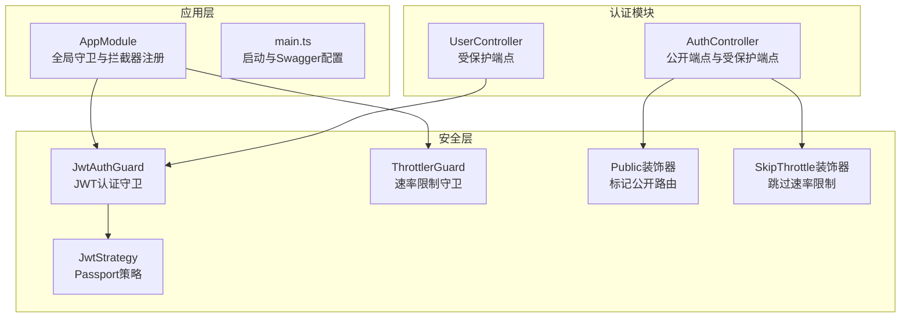
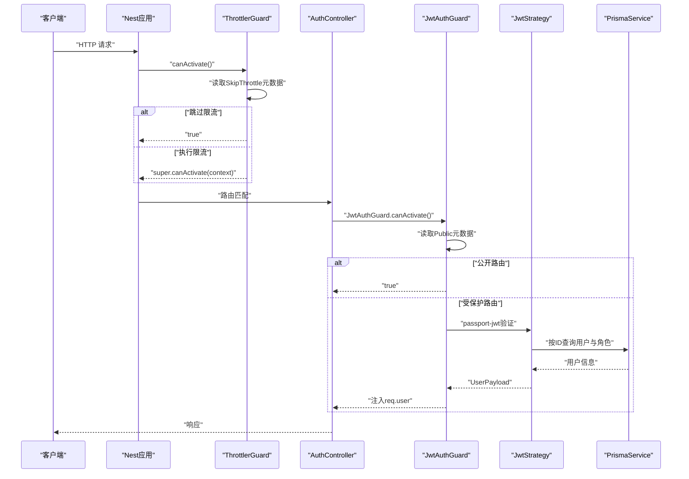
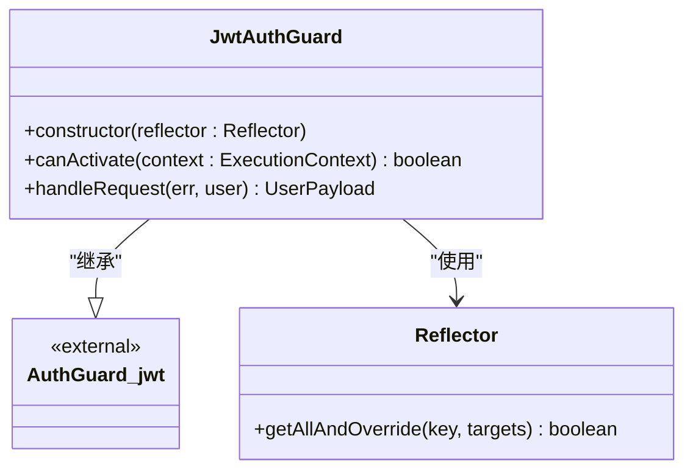
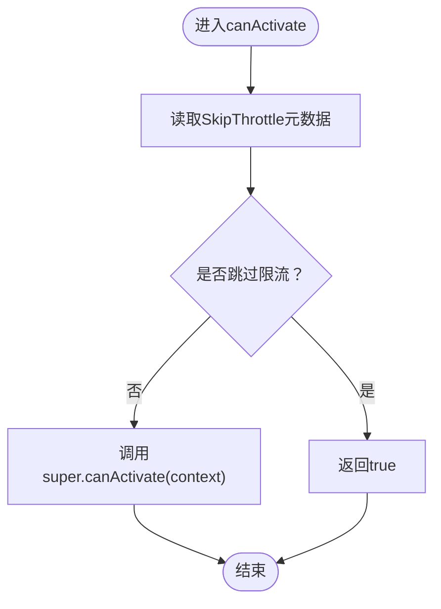
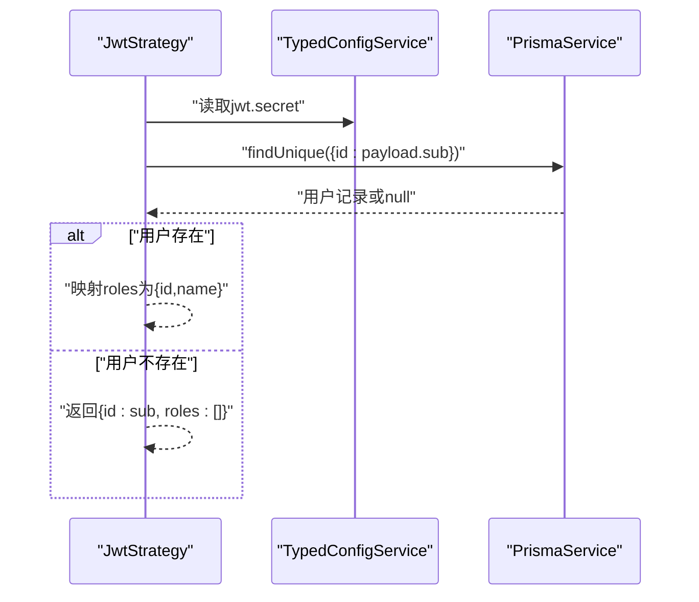
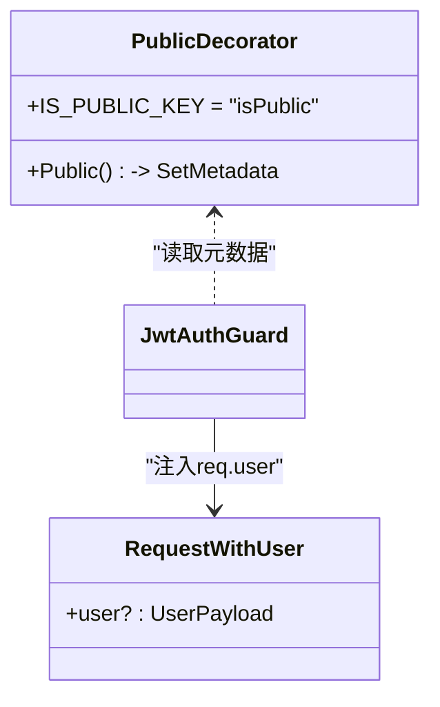
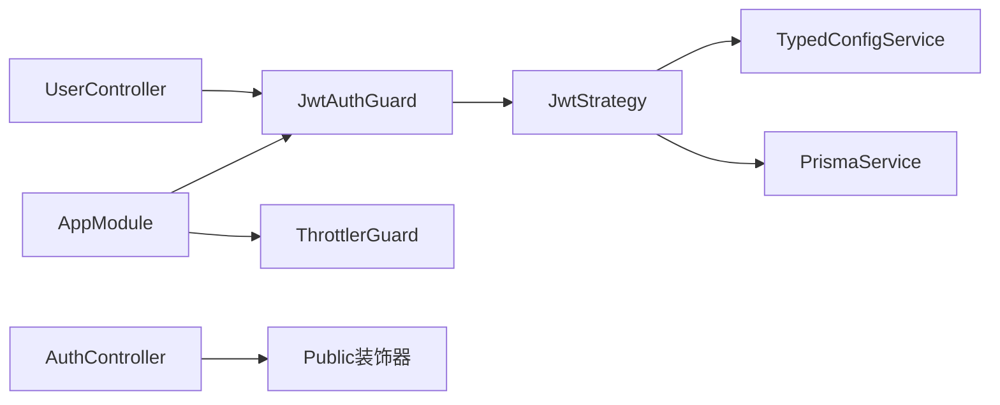

# 认证守卫机制

<cite>
**本文引用的文件**
- [jwt-auth.guard.ts](file://apps/nestjs-server/src/common/guards/jwt-auth.guard.ts)
- [throttler.guard.ts](file://apps/nestjs-server/src/common/guards/throttler.guard.ts)
- [public.decorator.ts](file://apps/nestjs-server/src/common/decorators/public.decorator.ts)
- [skip-throttle.decorator.ts](file://apps/nestjs-server/src/common/decorators/skip-throttle.decorator.ts)
- [jwt.strategy.ts](file://apps/nestjs-server/src/modules/auth/strategies/jwt.strategy.ts)
- [auth.controller.ts](file://apps/nestjs-server/src/modules/auth/auth.controller.ts)
- [user.controller.ts](file://apps/nestjs-server/src/modules/user/user.controller.ts)
- [app.module.ts](file://apps/nestjs-server/src/app.module.ts)
- [main.ts](file://apps/nestjs-server/src/main.ts)
- [user.interface.ts](file://apps/nestjs-server/src/common/interfaces/user.interface.ts)
- [jwt.interface.ts](file://apps/nestjs-server/src/common/interfaces/jwt.interface.ts)
- [biz-code.enum.ts](file://apps/nestjs-server/src/common/enums/biz-code.enum.ts)
- [business.exception.ts](file://apps/nestjs-server/src/common/exceptions/business.exception.ts)
- [jwt.schema.ts](file://apps/nestjs-server/src/config/schemas/jwt.schema.ts)
</cite>

## 目录
1. [简介](#简介)
2. [项目结构](#项目结构)
3. [核心组件](#核心组件)
4. [架构总览](#架构总览)
5. [详细组件分析](#详细组件分析)
6. [依赖分析](#依赖分析)
7. [性能考虑](#性能考虑)
8. [故障排查指南](#故障排查指南)
9. [结论](#结论)
10. [附录](#附录)

## 简介
本文件系统性阐述 Nebula 项目的认证与授权守卫机制，重点覆盖以下方面：
- JWT 认证守卫的工作原理：请求拦截、令牌解析与验证、用户上下文注入、错误处理。
- 守卫执行顺序与优先级：全局守卫、速率限制守卫与认证守卫的协作关系。
- 公共路由装饰器的使用：如何绕过认证保护特定端点。
- 请求拦截器与守卫的配合：如何在守卫中设置用户信息到请求对象。
- 速率限制守卫的实现与配置：基于装饰器与全局守卫的组合策略。
- 不同场景下的守卫使用示例：全局守卫配置、控制器级守卫、方法级守卫。

## 项目结构
本项目采用 NestJS 模块化架构，认证相关能力集中在以下位置：
- 守卫与装饰器：apps/nestjs-server/src/common/guards 与 apps/nestjs-server/src/common/decorators
- 认证策略与模块：apps/nestjs-server/src/modules/auth
- 应用入口与全局配置：apps/nestjs-server/src/app.module.ts、apps/nestjs-server/src/main.ts
- 接口类型与异常：apps/nestjs-server/src/common/interfaces、apps/nestjs-server/src/common/exceptions

图表来源
- [app.module.ts:19-62](file://apps/nestjs-server/src/app.module.ts#L19-L62)
- [main.ts:9-47](file://apps/nestjs-server/src/main.ts#L9-L47)
- [jwt-auth.guard.ts:17-42](file://apps/nestjs-server/src/common/guards/jwt-auth.guard.ts#L17-L42)
- [throttler.guard.ts:10-32](file://apps/nestjs-server/src/common/guards/throttler.guard.ts#L10-L32)
- [jwt.strategy.ts:9-48](file://apps/nestjs-server/src/modules/auth/strategies/jwt.strategy.ts#L9-L48)
- [public.decorator.ts:3-4](file://apps/nestjs-server/src/common/decorators/public.decorator.ts#L3-L4)
- [skip-throttle.decorator.ts:3-11](file://apps/nestjs-server/src/common/decorators/skip-throttle.decorator.ts#L3-L11)
- [auth.controller.ts:30-114](file://apps/nestjs-server/src/modules/auth/auth.controller.ts#L30-L114)
- [user.controller.ts:24-78](file://apps/nestjs-server/src/modules/user/user.controller.ts#L24-L78)

章节来源
- [app.module.ts:19-62](file://apps/nestjs-server/src/app.module.ts#L19-L62)
- [main.ts:9-47](file://apps/nestjs-server/src/main.ts#L9-L47)

## 核心组件
- JwtAuthGuard：继承自 @nestjs/passport 的 AuthGuard('jwt')，通过反射读取 Public 装饰器元数据决定是否放行；在 handleRequest 中对无效用户或错误进行统一业务异常处理。
- ThrottlerGuard：继承自 @nestjs/throttler 的 ThrottlerGuard，通过反射读取 SkipThrottle 装饰器元数据决定是否跳过速率限制。
- JwtStrategy：Passport 策略，负责从 Authorization 头解析 JWT 并验证签名，随后从数据库加载用户角色信息，返回标准化 UserPayload。
- Public 装饰器：标记公开路由，绕过 JwtAuthGuard。
- SkipThrottle 装饰器：标记不受速率限制约束的路由。
- 全局守卫注册：AppModule 将 JwtAuthGuard 与 ThrottlerGuard 注册为全局守卫，形成“先限流、后认证”的执行链路。

章节来源
- [jwt-auth.guard.ts:17-42](file://apps/nestjs-server/src/common/guards/jwt-auth.guard.ts#L17-L42)
- [throttler.guard.ts:10-32](file://apps/nestjs-server/src/common/guards/throttler.guard.ts#L10-L32)
- [jwt.strategy.ts:9-48](file://apps/nestjs-server/src/modules/auth/strategies/jwt.strategy.ts#L9-L48)
- [public.decorator.ts:3-4](file://apps/nestjs-server/src/common/decorators/public.decorator.ts#L3-L4)
- [skip-throttle.decorator.ts:3-11](file://apps/nestjs-server/src/common/decorators/skip-throttle.decorator.ts#L3-L11)
- [app.module.ts:35-43](file://apps/nestjs-server/src/app.module.ts#L35-L43)

## 架构总览
下图展示了请求从进入应用到完成鉴权与限流的整体流程，以及守卫与策略之间的交互关系。

图表来源
- [app.module.ts:35-43](file://apps/nestjs-server/src/app.module.ts#L35-L43)
- [throttler.guard.ts:20-31](file://apps/nestjs-server/src/common/guards/throttler.guard.ts#L20-L31)
- [jwt-auth.guard.ts:23-41](file://apps/nestjs-server/src/common/guards/jwt-auth.guard.ts#L23-L41)
- [jwt.strategy.ts:22-47](file://apps/nestjs-server/src/modules/auth/strategies/jwt.strategy.ts#L22-L47)
- [auth.controller.ts:38-114](file://apps/nestjs-server/src/modules/auth/auth.controller.ts#L38-L114)

## 详细组件分析

### JwtAuthGuard 组件分析
- 请求拦截与元数据读取：通过 Reflector 在处理器与控制器级别读取 Public 元数据，若为公开路由则直接放行。
- 令牌验证与用户上下文：调用父类 AuthGuard('jwt') 完成 passport-jwt 验证；handleRequest 中对无效用户或错误抛出统一业务异常。
- 用户上下文注入：验证通过后，passport 将 UserPayload 注入到 req.user，后续控制器可通过强类型请求对象获取用户信息。

图表来源
- [jwt-auth.guard.ts:17-42](file://apps/nestjs-server/src/common/guards/jwt-auth.guard.ts#L17-L42)

章节来源
- [jwt-auth.guard.ts:17-42](file://apps/nestjs-server/src/common/guards/jwt-auth.guard.ts#L17-L42)
- [business.exception.ts:16-41](file://apps/nestjs-server/src/common/exceptions/business.exception.ts#L16-L41)
- [biz-code.enum.ts:1-16](file://apps/nestjs-server/src/common/enums/biz-code.enum.ts#L1-L16)

### ThrottlerGuard 组件分析
- 速率限制策略：继承自 @nestjs/throttler 的 ThrottlerGuard，结合全局 ThrottlerModule 配置（short、medium、long）实现多级限流。
- 跳过策略：通过 SkipThrottle 装饰器读取元数据，若标记则直接放行，不执行限流判断。
- 执行顺序：由于 JwtAuthGuard 与 ThrottlerGuard 均注册为全局守卫，实际顺序由 Nest 注册顺序决定；在本项目中，JwtAuthGuard 先于 ThrottlerGuard 注册，因此执行顺序为“先认证、后限流”。

图表来源
- [throttler.guard.ts:20-31](file://apps/nestjs-server/src/common/guards/throttler.guard.ts#L20-L31)

章节来源
- [throttler.guard.ts:10-32](file://apps/nestjs-server/src/common/guards/throttler.guard.ts#L10-L32)
- [app.module.ts:22-26](file://apps/nestjs-server/src/app.module.ts#L22-L26)

### JwtStrategy 组件分析
- 令牌解析：使用 ExtractJwt.fromAuthHeaderAsBearerToken() 从 Authorization 头解析 JWT。
- 签名验证：使用配置中的 secretOrKey 进行 HS256 验证，ignoreExpiration=false。
- 用户上下文构建：按 payload.sub 查询用户与角色，返回标准化 UserPayload；若用户不存在，返回空角色列表的最小化用户对象。

图表来源
- [jwt.strategy.ts:10-47](file://apps/nestjs-server/src/modules/auth/strategies/jwt.strategy.ts#L10-L47)
- [jwt.schema.ts:3-8](file://apps/nestjs-server/src/config/schemas/jwt.schema.ts#L3-L8)

章节来源
- [jwt.strategy.ts:9-48](file://apps/nestjs-server/src/modules/auth/strategies/jwt.strategy.ts#L9-L48)
- [jwt.schema.ts:1-11](file://apps/nestjs-server/src/config/schemas/jwt.schema.ts#L1-L11)

### 公共路由装饰器与请求上下文
- Public 装饰器：通过 SetMetadata 设置元数据键值，JwtAuthGuard 在 canActivate 中读取该元数据以决定是否放行。
- 请求上下文注入：JwtStrategy 返回的 UserPayload 会被注入到 req.user；控制器可通过强类型请求对象直接访问用户信息。

图表来源
- [public.decorator.ts:3-4](file://apps/nestjs-server/src/common/decorators/public.decorator.ts#L3-L4)
- [jwt-auth.guard.ts:13-15](file://apps/nestjs-server/src/common/guards/jwt-auth.guard.ts#L13-L15)
- [auth.controller.ts:24-26](file://apps/nestjs-server/src/modules/auth/auth.controller.ts#L24-L26)

章节来源
- [public.decorator.ts:3-4](file://apps/nestjs-server/src/common/decorators/public.decorator.ts#L3-L4)
- [jwt-auth.guard.ts:13-15](file://apps/nestjs-server/src/common/guards/jwt-auth.guard.ts#L13-L15)
- [auth.controller.ts:24-26](file://apps/nestjs-server/src/modules/auth/auth.controller.ts#L24-L26)

### 速率限制守卫实现与配置
- 全局配置：ThrottlerModule.forRoot 注册多个限流配置（short、medium、long），并在全局提供 ThrottlerGuard。
- 方法级控制：通过 @Throttle 装饰器与 SkipThrottle 装饰器组合，实现细粒度的限流策略控制。
- 执行顺序：JwtAuthGuard 先于 ThrottlerGuard 注册，因此先进行认证再进行限流。

章节来源
- [app.module.ts:22-26](file://apps/nestjs-server/src/app.module.ts#L22-L26)
- [app.module.ts:35-43](file://apps/nestjs-server/src/app.module.ts#L35-L43)
- [auth.controller.ts:38-48](file://apps/nestjs-server/src/modules/auth/auth.controller.ts#L38-L48)
- [auth.controller.ts:63-76](file://apps/nestjs-server/src/modules/auth/auth.controller.ts#L63-L76)
- [auth.controller.ts:78-89](file://apps/nestjs-server/src/modules/auth/auth.controller.ts#L78-L89)

## 依赖分析
- 守卫注册与执行顺序：JwtAuthGuard 与 ThrottlerGuard 均通过 APP_GUARD 提供，注册顺序决定了执行顺序。本项目中 JwtAuthGuard 先注册，因此先认证后限流。
- 认证策略依赖：JwtAuthGuard 依赖 JwtStrategy 完成令牌验证；JwtStrategy 依赖配置服务与数据库服务。
- 控制器依赖：AuthController 使用 Public 装饰器标注公开端点；UserController 默认受 JwtAuthGuard 保护。

图表来源
- [app.module.ts:35-43](file://apps/nestjs-server/src/app.module.ts#L35-L43)
- [jwt-auth.guard.ts:17-21](file://apps/nestjs-server/src/common/guards/jwt-auth.guard.ts#L17-L21)
- [jwt.strategy.ts:11-14](file://apps/nestjs-server/src/modules/auth/strategies/jwt.strategy.ts#L11-L14)
- [auth.controller.ts:38-114](file://apps/nestjs-server/src/modules/auth/auth.controller.ts#L38-L114)
- [user.controller.ts:24-78](file://apps/nestjs-server/src/modules/user/user.controller.ts#L24-L78)

章节来源
- [app.module.ts:19-62](file://apps/nestjs-server/src/app.module.ts#L19-L62)
- [jwt.strategy.ts:9-48](file://apps/nestjs-server/src/modules/auth/strategies/jwt.strategy.ts#L9-L48)

## 性能考虑
- 令牌验证成本：JwtStrategy 对每个请求进行 JWT 解析与数据库查询，建议合理设置缓存与索引，避免重复查询。
- 限流粒度：通过多级限流配置与 SkipThrottle 装饰器，平衡安全与性能；高频健康检查等端点可标记跳过限流。
- 全局守卫开销：两个全局守卫均为轻量判断，整体开销较小；若未来引入更重的守卫，需评估其对延迟的影响。

## 故障排查指南
- 未登录访问受保护端点：JwtAuthGuard.handleRequest 会在用户缺失或错误时抛出统一业务异常，检查令牌格式、签名与过期时间。
- 公开端点仍被拦截：确认控制器或方法上是否正确使用 Public 装饰器，且未被其他守卫覆盖。
- 限流误伤：检查 @Throttle 与 SkipThrottle 的使用是否符合预期，必要时调整 ThrottlerModule 的配置。
- Swagger 文档：启用 Swagger 后可在文档中测试认证头与限流行为，便于定位问题。

章节来源
- [jwt-auth.guard.ts:36-41](file://apps/nestjs-server/src/common/guards/jwt-auth.guard.ts#L36-L41)
- [business.exception.ts:16-41](file://apps/nestjs-server/src/common/exceptions/business.exception.ts#L16-L41)
- [app.module.ts:22-26](file://apps/nestjs-server/src/app.module.ts#L22-L26)

## 结论
本项目通过 JwtAuthGuard 与 ThrottlerGuard 的协同，实现了“先认证、后限流”的安全策略；借助 Public 与 SkipThrottle 装饰器，灵活地对公开端点与高频接口进行差异化保护。JwtStrategy 将令牌解析与用户上下文注入解耦，配合全局守卫与控制器装饰器，提供了清晰、可维护的认证体系。

## 附录

### 守卫使用场景与示例路径
- 全局守卫配置：在 AppModule 中注册 JwtAuthGuard 与 ThrottlerGuard。
  - 参考路径：[app.module.ts:35-43](file://apps/nestjs-server/src/app.module.ts#L35-L43)
- 控制器级守卫：UserController 默认受 JwtAuthGuard 保护。
  - 参考路径：[user.controller.ts:22](file://apps/nestjs-server/src/modules/user/user.controller.ts#L22)
- 方法级守卫：AuthController 中的公开端点使用 Public 装饰器。
  - 参考路径：[auth.controller.ts:38](file://apps/nestjs-server/src/modules/auth/auth.controller.ts#L38)
  - 参考路径：[auth.controller.ts:50](file://apps/nestjs-server/src/modules/auth/auth.controller.ts#L50)
  - 参考路径：[auth.controller.ts:78](file://apps/nestjs-server/src/modules/auth/auth.controller.ts#L78)
- 速率限制守卫：通过 @Throttle 与 SkipThrottle 实现。
  - 参考路径：[auth.controller.ts:40](file://apps/nestjs-server/src/modules/auth/auth.controller.ts#L40)
  - 参考路径：[auth.controller.ts:65](file://apps/nestjs-server/src/modules/auth/auth.controller.ts#L65)
  - 参考路径：[auth.controller.ts:86](file://apps/nestjs-server/src/modules/auth/auth.controller.ts#L86)
  - 参考路径：[skip-throttle.decorator.ts:11](file://apps/nestjs-server/src/common/decorators/skip-throttle.decorator.ts#L11)