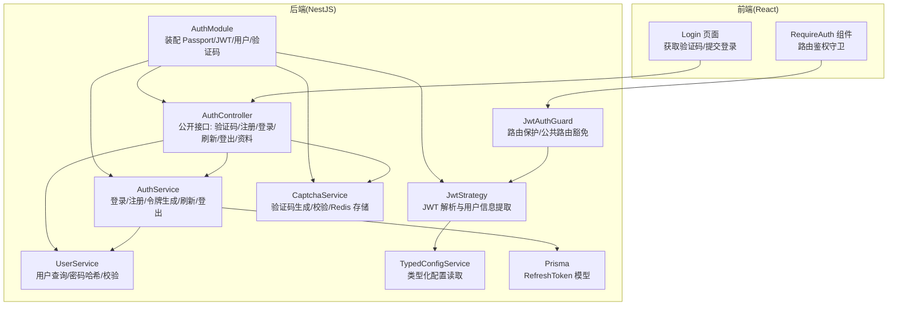
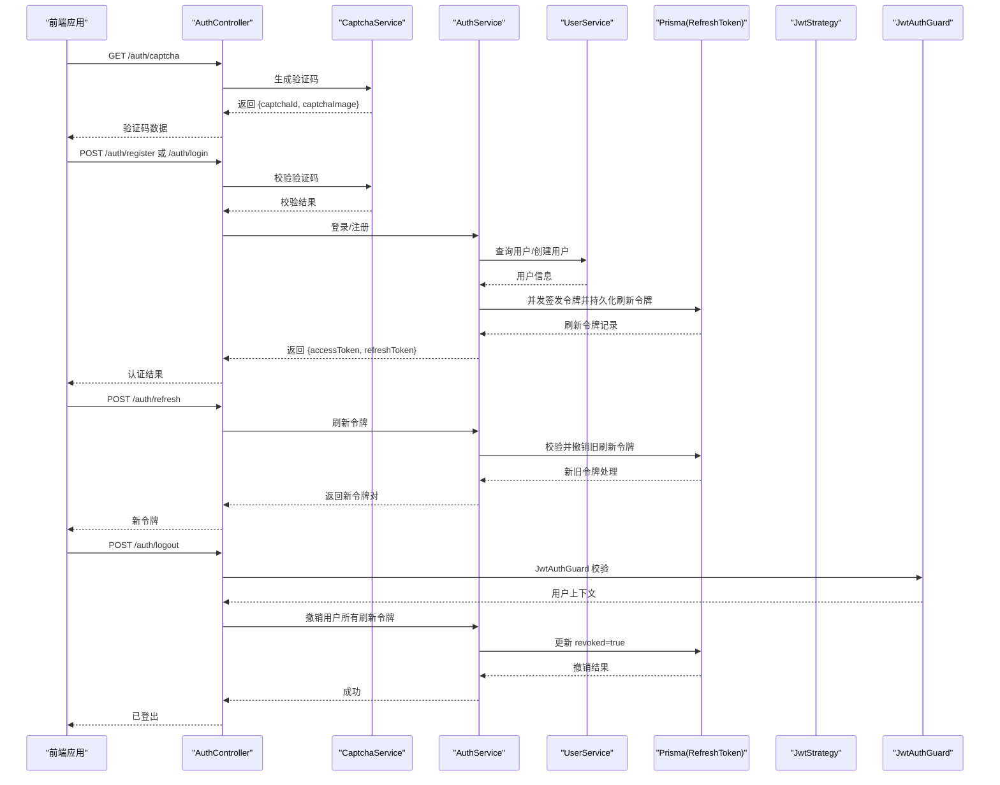
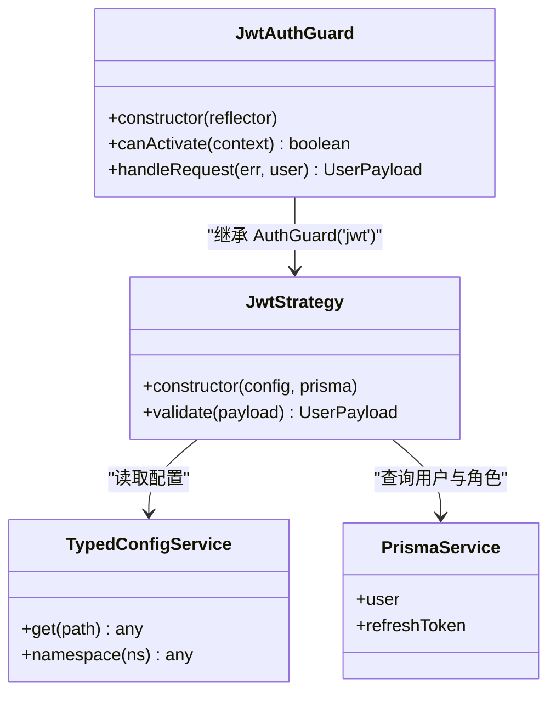
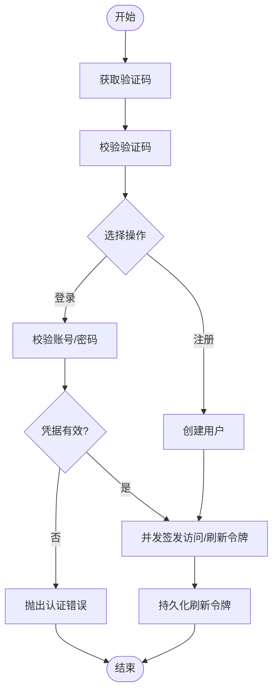
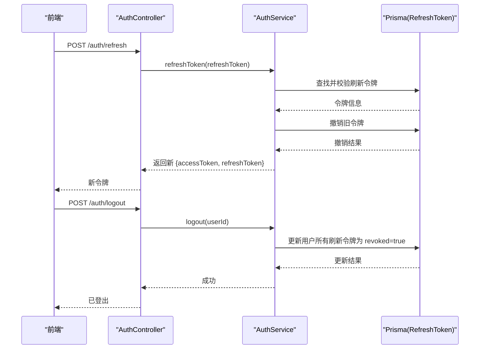
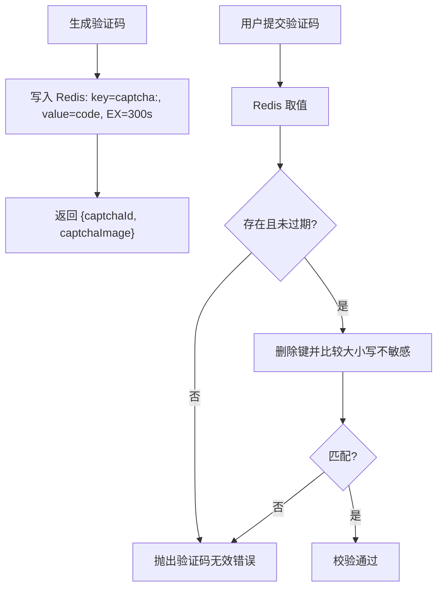
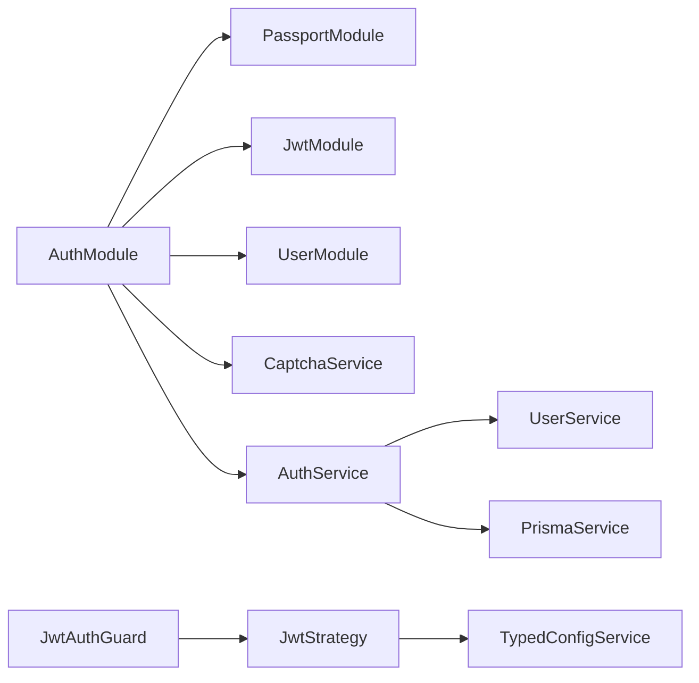

# 认证授权系统

<cite>
**本文引用的文件**
- [apps/nestjs-server/src/modules/auth/auth.module.ts](file://apps/nestjs-server/src/modules/auth/auth.module.ts)
- [apps/nestjs-server/src/modules/auth/auth.service.ts](file://apps/nestjs-server/src/modules/auth/auth.service.ts)
- [apps/nestjs-server/src/modules/auth/auth.controller.ts](file://apps/nestjs-server/src/modules/auth/auth.controller.ts)
- [apps/nestjs-server/src/modules/auth/strategies/jwt.strategy.ts](file://apps/nestjs-server/src/modules/auth/strategies/jwt.strategy.ts)
- [apps/nestjs-server/src/common/guards/jwt-auth.guard.ts](file://apps/nestjs-server/src/common/guards/jwt-auth.guard.ts)
- [apps/nestjs-server/src/modules/auth/captcha.service.ts](file://apps/nestjs-server/src/modules/auth/captcha.service.ts)
- [apps/nestjs-server/src/common/decorators/public.decorator.ts](file://apps/nestjs-server/src/common/decorators/public.decorator.ts)
- [apps/nestjs-server/src/modules/auth/dto/auth.dto.ts](file://apps/nestjs-server/src/modules/auth/dto/auth.dto.ts)
- [apps/nestjs-server/src/common/interfaces/jwt.interface.ts](file://apps/nestjs-server/src/common/interfaces/jwt.interface.ts)
- [apps/nestjs-server/src/common/interfaces/user.interface.ts](file://apps/nestjs-server/src/common/interfaces/user.interface.ts)
- [apps/nestjs-server/src/config/schemas/jwt.schema.ts](file://apps/nestjs-server/src/config/schemas/jwt.schema.ts)
- [apps/nestjs-server/src/config/typed-config.service.ts](file://apps/nestjs-server/src/config/typed-config.service.ts)
- [apps/nestjs-server/src/modules/user/user.service.ts](file://apps/nestjs-server/src/modules/user/user.service.ts)
- [apps/nestjs-server/prisma/schema/RefreshToken.prisma](file://apps/nestjs-server/prisma/schema/RefreshToken.prisma)
- [apps/web/src/components/RequireAuth.tsx](file://apps/web/src/components/RequireAuth.tsx)
- [apps/web/src/pages/Login.tsx](file://apps/web/src/pages/Login.tsx)
</cite>

## 目录

1. [简介](#简介)
2. [项目结构](#项目结构)
3. [核心组件](#核心组件)
4. [架构总览](#架构总览)
5. [详细组件分析](#详细组件分析)
6. [依赖关系分析](#依赖关系分析)
7. [性能考量](#性能考量)
8. [故障排查指南](#故障排查指南)
9. [结论](#结论)
10. [附录](#附录)

## 简介

本文件面向认证授权系统，围绕基于 JWT 的认证机制进行深入说明，覆盖用户登录流程、令牌生成与验证、Passport 策略配置、认证守卫工作原理、验证码系统、密码加密存储以及令牌刷新机制。同时提供完整认证流程图、代码示例路径与安全最佳实践，帮助开发者快速理解并安全集成。

## 项目结构

后端采用 NestJS 架构，认证相关模块集中于 apps/nestjs-server/src/modules/auth，前端位于 apps/web，通过 API 与后端交互。认证模块的关键文件如下：

- 模块装配：AuthModule 负责导入 Passport、JWT、用户模块与验证码服务，并导出 AuthService
- 控制器：AuthController 提供验证码、注册、登录、刷新、登出、获取用户资料等接口
- 服务层：AuthService 实现登录凭据校验、注册、令牌签发与刷新、登出撤销；UserService 负责用户数据与密码哈希
- 策略与守卫：JwtStrategy 处理 JWT 解析与用户信息提取；JwtAuthGuard 结合 @Public 装饰器控制路由访问
- 配置：TypedConfigService 提供类型化配置读取；JWT 配置由 jwt.schema.ts 定义
- 数据模型：Prisma 的 RefreshToken 模型用于持久化刷新令牌

图表来源

- [apps/nestjs-server/src/modules/auth/auth.module.ts:12-34](file://apps/nestjs-server/src/modules/auth/auth.module.ts#L12-L34)
- [apps/nestjs-server/src/modules/auth/auth.controller.ts:30-114](file://apps/nestjs-server/src/modules/auth/auth.controller.ts#L30-L114)
- [apps/nestjs-server/src/modules/auth/auth.service.ts:14-21](file://apps/nestjs-server/src/modules/auth/auth.service.ts#L14-L21)
- [apps/nestjs-server/src/modules/auth/strategies/jwt.strategy.ts:9-20](file://apps/nestjs-server/src/modules/auth/strategies/jwt.strategy.ts#L9-L20)
- [apps/nestjs-server/src/common/guards/jwt-auth.guard.ts:17-42](file://apps/nestjs-server/src/common/guards/jwt-auth.guard.ts#L17-L42)
- [apps/nestjs-server/src/modules/auth/captcha.service.ts:18-22](file://apps/nestjs-server/src/modules/auth/captcha.service.ts#L18-L22)
- [apps/nestjs-server/src/config/typed-config.service.ts:6-18](file://apps/nestjs-server/src/config/typed-config.service.ts#L6-L18)
- [apps/nestjs-server/prisma/schema/RefreshToken.prisma:1-12](file://apps/nestjs-server/prisma/schema/RefreshToken.prisma#L1-L12)
- [apps/web/src/pages/Login.tsx:60-92](file://apps/web/src/pages/Login.tsx#L60-L92)
- [apps/web/src/components/RequireAuth.tsx:4-13](file://apps/web/src/components/RequireAuth.tsx#L4-L13)

章节来源

- [apps/nestjs-server/src/modules/auth/auth.module.ts:12-34](file://apps/nestjs-server/src/modules/auth/auth.module.ts#L12-L34)
- [apps/nestjs-server/src/modules/auth/auth.controller.ts:30-114](file://apps/nestjs-server/src/modules/auth/auth.controller.ts#L30-L114)

## 核心组件

- AuthModule：注册 Passport、JWT 模块，注入 AuthService、JwtStrategy、CaptchaService，并导出 AuthService
- AuthController：定义认证相关 API，使用 @Public 装饰器标注公开接口，其余接口受 JwtAuthGuard 保护
- AuthService：实现登录凭据校验、注册、令牌生成（并发签发）、刷新、登出撤销；使用 Prisma 持久化刷新令牌
- JwtStrategy：从 Authorization 头解析 Bearer 令牌，校验签名与有效期，从数据库加载用户角色信息
- JwtAuthGuard：继承 AuthGuard('jwt')，结合反射判断是否为公共路由，否则抛出未授权错误
- CaptchaService：使用 svg-captcha 生成 SVG 图形验证码，Redis 存储验证码并设置 TTL，一次性使用
- UserService：负责用户查询、密码哈希与校验
- TypedConfigService：提供类型化配置读取，支持命名空间访问
- 配置：jwt.schema.ts 定义 JWT 秘钥、访问令牌与刷新令牌过期时间等

章节来源

- [apps/nestjs-server/src/modules/auth/auth.module.ts:12-34](file://apps/nestjs-server/src/modules/auth/auth.module.ts#L12-L34)
- [apps/nestjs-server/src/modules/auth/auth.controller.ts:30-114](file://apps/nestjs-server/src/modules/auth/auth.controller.ts#L30-L114)
- [apps/nestjs-server/src/modules/auth/auth.service.ts:14-21](file://apps/nestjs-server/src/modules/auth/auth.service.ts#L14-L21)
- [apps/nestjs-server/src/modules/auth/strategies/jwt.strategy.ts:9-20](file://apps/nestjs-server/src/modules/auth/strategies/jwt.strategy.ts#L9-L20)
- [apps/nestjs-server/src/common/guards/jwt-auth.guard.ts:17-42](file://apps/nestjs-server/src/common/guards/jwt-auth.guard.ts#L17-L42)
- [apps/nestjs-server/src/modules/auth/captcha.service.ts:18-22](file://apps/nestjs-server/src/modules/auth/captcha.service.ts#L18-L22)
- [apps/nestjs-server/src/modules/user/user.service.ts:13-15](file://apps/nestjs-server/src/modules/user/user.service.ts#L13-L15)
- [apps/nestjs-server/src/config/typed-config.service.ts:6-18](file://apps/nestjs-server/src/config/typed-config.service.ts#L6-L18)
- [apps/nestjs-server/src/config/schemas/jwt.schema.ts:3-8](file://apps/nestjs-server/src/config/schemas/jwt.schema.ts#L3-L8)

## 架构总览

下图展示认证系统整体交互：前端请求后端接口，后端通过 Passport 策略与守卫完成鉴权，服务层处理业务逻辑并持久化刷新令牌，前端根据响应更新状态。

图表来源

- [apps/nestjs-server/src/modules/auth/auth.controller.ts:38-102](file://apps/nestjs-server/src/modules/auth/auth.controller.ts#L38-L102)
- [apps/nestjs-server/src/modules/auth/captcha.service.ts:24-65](file://apps/nestjs-server/src/modules/auth/captcha.service.ts#L24-L65)
- [apps/nestjs-server/src/modules/auth/auth.service.ts:29-84](file://apps/nestjs-server/src/modules/auth/auth.service.ts#L29-L84)
- [apps/nestjs-server/src/modules/user/user.service.ts:17-31](file://apps/nestjs-server/src/modules/user/user.service.ts#L17-L31)
- [apps/nestjs-server/prisma/schema/RefreshToken.prisma:1-12](file://apps/nestjs-server/prisma/schema/RefreshToken.prisma#L1-L12)
- [apps/nestjs-server/src/common/guards/jwt-auth.guard.ts:17-42](file://apps/nestjs-server/src/common/guards/jwt-auth.guard.ts#L17-L42)

## 详细组件分析

### JWT 策略与守卫

- JwtStrategy：从 Authorization 头解析 Bearer 令牌，使用配置中的 secret 校验签名与有效期；从数据库按用户 ID 加载用户及其角色，若用户不存在则返回空角色列表
- JwtAuthGuard：继承 AuthGuard('jwt')，通过反射检测 @Public 元数据，若是公共路由直接放行；否则交由 Passport 流程校验，失败时抛出未授权业务异常

图表来源

- [apps/nestjs-server/src/modules/auth/strategies/jwt.strategy.ts:9-48](file://apps/nestjs-server/src/modules/auth/strategies/jwt.strategy.ts#L9-L48)
- [apps/nestjs-server/src/common/guards/jwt-auth.guard.ts:17-42](file://apps/nestjs-server/src/common/guards/jwt-auth.guard.ts#L17-L42)
- [apps/nestjs-server/src/config/typed-config.service.ts:23-44](file://apps/nestjs-server/src/config/typed-config.service.ts#L23-L44)

章节来源

- [apps/nestjs-server/src/modules/auth/strategies/jwt.strategy.ts:9-48](file://apps/nestjs-server/src/modules/auth/strategies/jwt.strategy.ts#L9-L48)
- [apps/nestjs-server/src/common/guards/jwt-auth.guard.ts:17-42](file://apps/nestjs-server/src/common/guards/jwt-auth.guard.ts#L17-L42)

### 登录与注册流程

- 登录：先获取验证码并校验，再通过 AuthService.loginWithCredentials 校验账号与密码，成功后并发签发访问令牌与刷新令牌，并持久化刷新令牌
- 注册：先校验邮箱与用户名唯一性，再通过 UserService.create 创建用户并返回用户信息，随后并发签发令牌对

图表来源

- [apps/nestjs-server/src/modules/auth/auth.controller.ts:38-76](file://apps/nestjs-server/src/modules/auth/auth.controller.ts#L38-L76)
- [apps/nestjs-server/src/modules/auth/auth.service.ts:29-57](file://apps/nestjs-server/src/modules/auth/auth.service.ts#L29-L57)
- [apps/nestjs-server/src/modules/auth/captcha.service.ts:48-65](file://apps/nestjs-server/src/modules/auth/captcha.service.ts#L48-L65)

章节来源

- [apps/nestjs-server/src/modules/auth/auth.controller.ts:38-76](file://apps/nestjs-server/src/modules/auth/auth.controller.ts#L38-L76)
- [apps/nestjs-server/src/modules/auth/auth.service.ts:29-57](file://apps/nestjs-server/src/modules/auth/auth.service.ts#L29-L57)

### 令牌刷新与登出

- 刷新：AuthService.refreshToken 校验刷新令牌哈希、过期与撤销状态，撤销旧令牌后并发签发新令牌对
- 登出：AuthService.logout 将指定用户的所有未撤销刷新令牌标记为撤销，使旧令牌失效

图表来源

- [apps/nestjs-server/src/modules/auth/auth.controller.ts:78-102](file://apps/nestjs-server/src/modules/auth/auth.controller.ts#L78-L102)
- [apps/nestjs-server/src/modules/auth/auth.service.ts:64-98](file://apps/nestjs-server/src/modules/auth/auth.service.ts#L64-L98)
- [apps/nestjs-server/prisma/schema/RefreshToken.prisma:1-12](file://apps/nestjs-server/prisma/schema/RefreshToken.prisma#L1-L12)

章节来源

- [apps/nestjs-server/src/modules/auth/auth.controller.ts:78-102](file://apps/nestjs-server/src/modules/auth/auth.controller.ts#L78-L102)
- [apps/nestjs-server/src/modules/auth/auth.service.ts:64-98](file://apps/nestjs-server/src/modules/auth/auth.service.ts#L64-L98)

### 验证码系统

- 生成：使用 svg-captcha 生成图形验证码，返回 captchaId 与 captchaImage；异步写入 Redis，键带前缀并设置 TTL
- 校验：根据 captchaId 从 Redis 取出验证码，若不存在统一视为无效；匹配成功后立即删除，保证一次性使用

图表来源

- [apps/nestjs-server/src/modules/auth/captcha.service.ts:24-65](file://apps/nestjs-server/src/modules/auth/captcha.service.ts#L24-L65)

章节来源

- [apps/nestjs-server/src/modules/auth/captcha.service.ts:18-66](file://apps/nestjs-server/src/modules/auth/captcha.service.ts#L18-L66)

### 密码加密存储

- 注册与更新时使用 bcryptjs 对明文密码进行哈希存储
- 登录时通过 UserService.validatePassword 进行比对

章节来源

- [apps/nestjs-server/src/modules/user/user.service.ts:17-31](file://apps/nestjs-server/src/modules/user/user.service.ts#L17-L31)
- [apps/nestjs-server/src/modules/user/user.service.ts:99-101](file://apps/nestjs-server/src/modules/user/user.service.ts#L99-L101)

### 公共路由装饰器与中间件配置

- @Public 装饰器：通过反射设置元数据，JwtAuthGuard 在 canActivate 中读取该元数据决定是否放行
- 公开接口：验证码、注册、登录、刷新等使用 @Public 标注
- 受保护接口：登出、获取用户资料等默认受 JwtAuthGuard 保护

章节来源

- [apps/nestjs-server/src/common/decorators/public.decorator.ts:3-4](file://apps/nestjs-server/src/common/decorators/public.decorator.ts#L3-L4)
- [apps/nestjs-server/src/common/guards/jwt-auth.guard.ts:23-34](file://apps/nestjs-server/src/common/guards/jwt-auth.guard.ts#L23-L34)
- [apps/nestjs-server/src/modules/auth/auth.controller.ts:38-102](file://apps/nestjs-server/src/modules/auth/auth.controller.ts#L38-L102)

### 前端集成要点

- 登录页：先拉取验证码，再提交账号、密码与验证码；登录成功后跳转首页
- 路由守卫：RequireAuth 组件根据认证状态决定是否放行至受保护页面

章节来源

- [apps/web/src/pages/Login.tsx:60-92](file://apps/web/src/pages/Login.tsx#L60-L92)
- [apps/web/src/components/RequireAuth.tsx:4-13](file://apps/web/src/components/RequireAuth.tsx#L4-L13)

## 依赖关系分析

- 模块耦合：AuthModule 将 Passport、JWT、用户模块与验证码服务组合，AuthService 依赖 Prisma 与 UserService
- 外部依赖：passport-jwt、bcryptjs、svg-captcha、Redis 客户端
- 配置契约：jwt.schema.ts 约束 JWT 秘钥长度与过期时间，默认值合理；TypedConfigService 提供类型化读取

图表来源

- [apps/nestjs-server/src/modules/auth/auth.module.ts:12-34](file://apps/nestjs-server/src/modules/auth/auth.module.ts#L12-L34)
- [apps/nestjs-server/src/modules/auth/auth.service.ts:14-21](file://apps/nestjs-server/src/modules/auth/auth.service.ts#L14-L21)
- [apps/nestjs-server/src/modules/auth/strategies/jwt.strategy.ts:9-20](file://apps/nestjs-server/src/modules/auth/strategies/jwt.strategy.ts#L9-L20)
- [apps/nestjs-server/src/common/guards/jwt-auth.guard.ts:17-42](file://apps/nestjs-server/src/common/guards/jwt-auth.guard.ts#L17-L42)

章节来源

- [apps/nestjs-server/src/modules/auth/auth.module.ts:12-34](file://apps/nestjs-server/src/modules/auth/auth.module.ts#L12-L34)
- [apps/nestjs-server/src/config/schemas/jwt.schema.ts:3-8](file://apps/nestjs-server/src/config/schemas/jwt.schema.ts#L3-L8)

## 性能考量

- 并发签发：AuthService.generateTokens 使用 Promise.all 并发签发访问与刷新令牌，降低 RTT
- 缓存与限流：验证码接口使用限流装饰器，避免暴力破解；验证码使用 Redis TTL 自动清理
- 数据库索引：Prisma 模型为 RefreshToken.userId 建立索引，提升撤销与查询效率
- 密码成本：bcrypt 默认成本 10，兼顾安全性与性能

章节来源

- [apps/nestjs-server/src/modules/auth/auth.service.ts:118-127](file://apps/nestjs-server/src/modules/auth/auth.service.ts#L118-L127)
- [apps/nestjs-server/src/modules/auth/auth.controller.ts:38-48](file://apps/nestjs-server/src/modules/auth/auth.controller.ts#L38-L48)
- [apps/nestjs-server/prisma/schema/RefreshToken.prisma:10-11](file://apps/nestjs-server/prisma/schema/RefreshToken.prisma#L10-L11)
- [apps/nestjs-server/src/modules/user/user.service.ts:20-20](file://apps/nestjs-server/src/modules/user/user.service.ts#L20-L20)

## 故障排查指南

- 未授权错误：JwtAuthGuard.handleRequest 在无用户或错误时抛出未授权业务异常
- 凭据无效：AuthService.loginWithCredentials 在账号或密码错误时抛出认证错误
- 验证码问题：CaptchaService.verifyCaptcha 在验证码不存在或过期、验证码不匹配时抛出相应错误
- 刷新令牌无效：AuthService.refreshToken 在令牌不存在、已撤销或过期时抛出认证错误
- 用户不存在：UserService.findOne 在用户不存在时抛出用户不存在错误

章节来源

- [apps/nestjs-server/src/common/guards/jwt-auth.guard.ts:36-41](file://apps/nestjs-server/src/common/guards/jwt-auth.guard.ts#L36-L41)
- [apps/nestjs-server/src/modules/auth/auth.service.ts:29-37](file://apps/nestjs-server/src/modules/auth/auth.service.ts#L29-L37)
- [apps/nestjs-server/src/modules/auth/captcha.service.ts:48-65](file://apps/nestjs-server/src/modules/auth/captcha.service.ts#L48-L65)
- [apps/nestjs-server/src/modules/auth/auth.service.ts:64-73](file://apps/nestjs-server/src/modules/auth/auth.service.ts#L64-L73)
- [apps/nestjs-server/src/modules/user/user.service.ts:46-48](file://apps/nestjs-server/src/modules/user/user.service.ts#L46-L48)

## 结论

本认证授权系统以 JWT 为核心，结合 Passport 策略与守卫实现强健的路由保护；通过验证码防刷、Redis 存储验证码、bcrypt 密码哈希与刷新令牌持久化，形成完整的安全闭环。并发签发令牌与限流策略提升了用户体验与系统稳定性。建议在生产环境严格管理密钥、定期轮换、监控异常并完善审计日志。

## 附录

- 配置项参考
  - JWT 秘钥与刷新秘钥最小长度约束
  - 访问令牌与刷新令牌过期时间默认值
- 数据模型参考
  - RefreshToken 模型字段与索引
- 接口参考
  - 验证码、注册、登录、刷新、登出、获取用户资料等接口定义与 DTO

章节来源

- [apps/nestjs-server/src/config/schemas/jwt.schema.ts:3-8](file://apps/nestjs-server/src/config/schemas/jwt.schema.ts#L3-L8)
- [apps/nestjs-server/prisma/schema/RefreshToken.prisma:1-12](file://apps/nestjs-server/prisma/schema/RefreshToken.prisma#L1-L12)
- [apps/nestjs-server/src/modules/auth/dto/auth.dto.ts:1-30](file://apps/nestjs-server/src/modules/auth/dto/auth.dto.ts#L1-L30)
- [apps/nestjs-server/src/common/interfaces/jwt.interface.ts:5-10](file://apps/nestjs-server/src/common/interfaces/jwt.interface.ts#L5-L10)
- [apps/nestjs-server/src/common/interfaces/user.interface.ts:1-9](file://apps/nestjs-server/src/common/interfaces/user.interface.ts#L1-L9)
