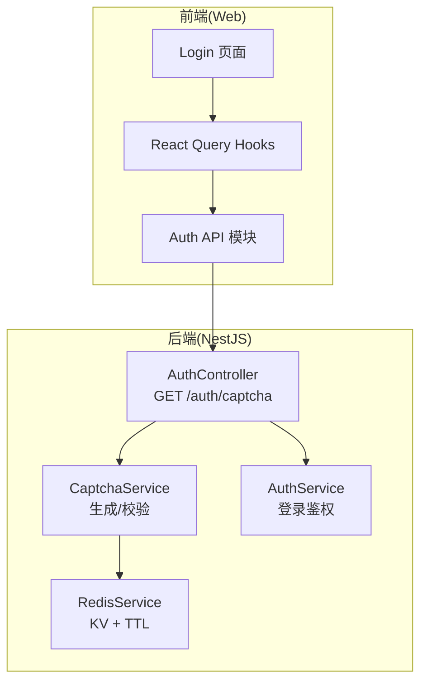
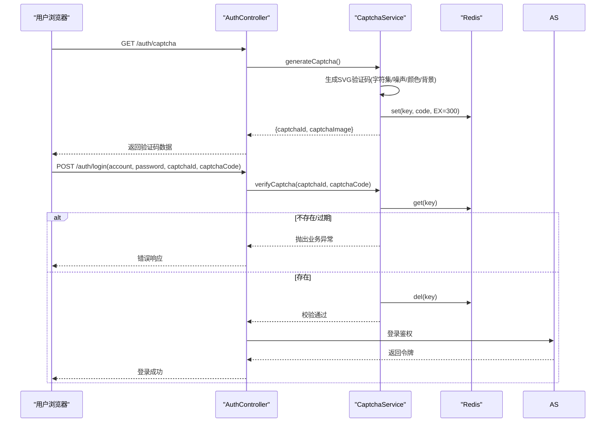
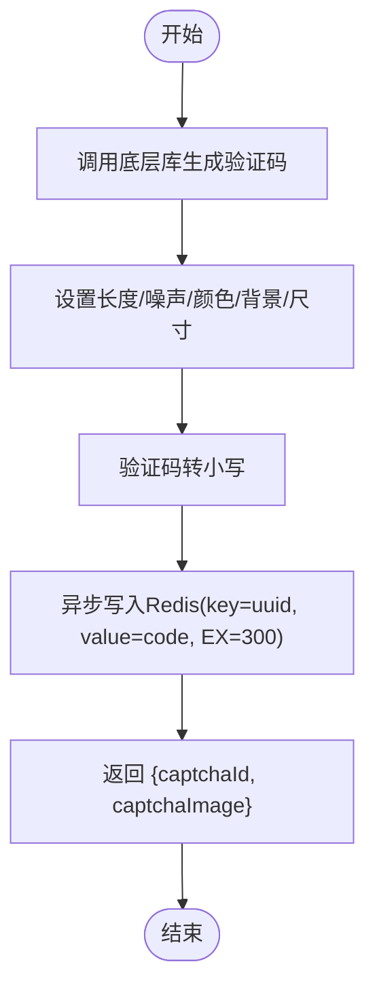
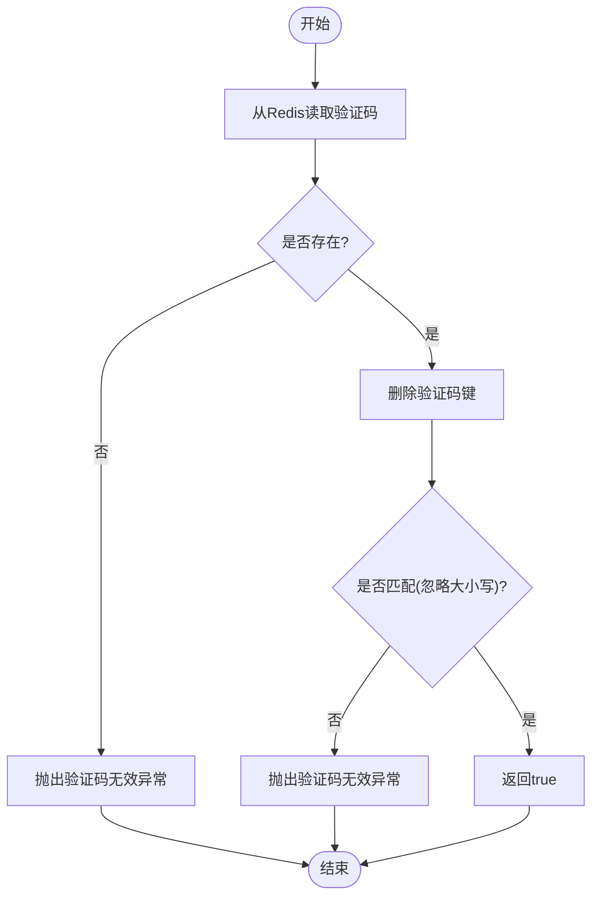
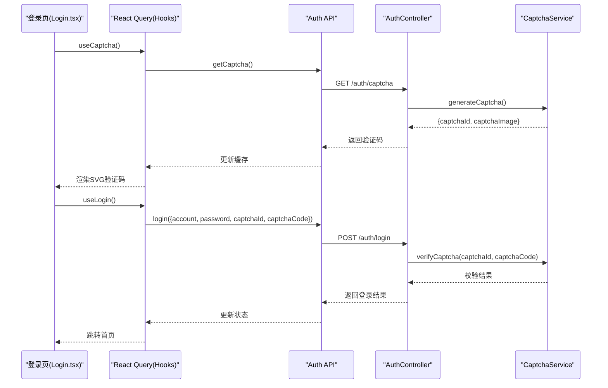
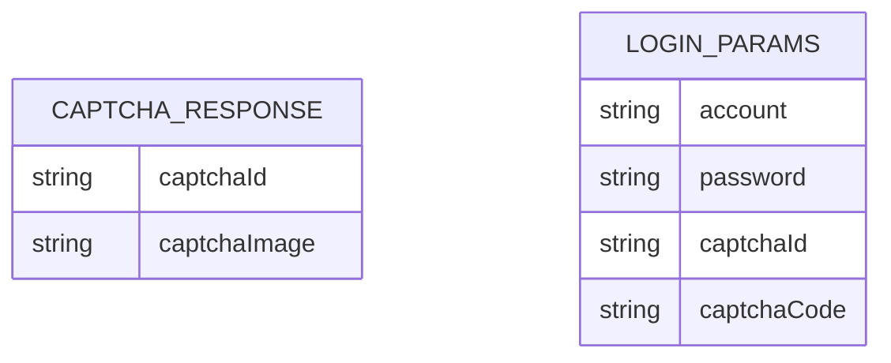
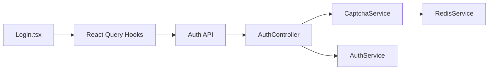

# 验证码系统

<cite>
**本文引用的文件**
- [captcha.service.ts](file://apps/nestjs-server/src/modules/auth/captcha.service.ts)
- [auth.controller.ts](file://apps/nestjs-server/src/modules/auth/auth.controller.ts)
- [auth.dto.ts](file://apps/nestjs-server/src/modules/auth/dto/auth.dto.ts)
- [auth.schema.ts](file://packages/shared/src/schemas/auth.schema.ts)
- [biz-code.enum.ts](file://apps/nestjs-server/src/common/enums/biz-code.enum.ts)
- [Login.tsx](file://apps/web/src/pages/Login.tsx)
- [hooks.ts](file://apps/web/src/api/modules/auth/hooks.ts)
- [api.ts](file://apps/web/src/api/modules/auth/api.ts)
- [captcha.service.spec.ts](file://apps/nestjs-server/src/modules/auth/captcha.service.spec.ts)
</cite>

## 目录

1. [简介](#简介)
2. [项目结构](#项目结构)
3. [核心组件](#核心组件)
4. [架构总览](#架构总览)
5. [详细组件分析](#详细组件分析)
6. [依赖关系分析](#依赖关系分析)
7. [性能考量](#性能考量)
8. [故障排查指南](#故障排查指南)
9. [结论](#结论)
10. [附录](#附录)

## 简介

本文件为验证码系统的完整技术文档，覆盖验证码生成算法、图片生成流程、存储机制、验证流程、安全防护以及前后端集成示例。系统采用 SVG 图片作为验证码载体，基于 Redis 实现跨实例部署的一次性验证码存储，并通过限流策略降低暴力破解风险。

## 项目结构

验证码功能主要分布在后端 NestJS 服务与前端 Web 应用中：

- 后端：验证码服务负责生成与校验；认证控制器提供验证码获取接口；DTO 与 Zod Schema 统一前后端数据结构。
- 前端：登录页通过 React Query 获取验证码并提交登录请求；验证码以 SVG 字符串形式渲染。

图表来源

- [auth.controller.ts:38-48](file://apps/nestjs-server/src/modules/auth/auth.controller.ts#L38-L48)
- [captcha.service.ts:24-46](file://apps/nestjs-server/src/modules/auth/captcha.service.ts#L24-L46)
- [Login.tsx:62-92](file://apps/web/src/pages/Login.tsx#L62-L92)
- [hooks.ts:5-10](file://apps/web/src/api/modules/auth/hooks.ts#L5-L10)
- [api.ts:20-30](file://apps/web/src/api/modules/auth/api.ts#L20-L30)

章节来源

- [auth.controller.ts:38-48](file://apps/nestjs-server/src/modules/auth/auth.controller.ts#L38-L48)
- [captcha.service.ts:24-46](file://apps/nestjs-server/src/modules/auth/captcha.service.ts#L24-L46)
- [Login.tsx:62-92](file://apps/web/src/pages/Login.tsx#L62-L92)
- [hooks.ts:5-10](file://apps/web/src/api/modules/auth/hooks.ts#L5-L10)
- [api.ts:20-30](file://apps/web/src/api/modules/auth/api.ts#L20-L30)

## 核心组件

- 验证码服务：封装验证码生成、存储与校验逻辑，使用 UUID 作为键，Redis 存储验证码文本并设置过期时间。
- 认证控制器：提供获取验证码接口与登录接口，登录前强制进行验证码校验。
- DTO 与 Schema：前后端统一的验证码响应结构与登录参数结构，保证字段一致性。
- 前端集成：登录页通过查询钩子拉取验证码，渲染 SVG 并在登录时提交验证码 ID 与输入值。

章节来源

- [captcha.service.ts:18-66](file://apps/nestjs-server/src/modules/auth/captcha.service.ts#L18-L66)
- [auth.controller.ts:38-76](file://apps/nestjs-server/src/modules/auth/auth.controller.ts#L38-L76)
- [auth.dto.ts:17-29](file://apps/nestjs-server/src/modules/auth/dto/auth.dto.ts#L17-L29)
- [auth.schema.ts:43-46](file://packages/shared/src/schemas/auth.schema.ts#L43-L46)

## 架构总览

验证码系统遵循“生成即存储”的设计：生成验证码时同步异步写入 Redis，客户端保存验证码 ID；提交登录时先校验验证码再执行登录流程。整体流程如下：

图表来源

- [auth.controller.ts:38-76](file://apps/nestjs-server/src/modules/auth/auth.controller.ts#L38-L76)
- [captcha.service.ts:24-65](file://apps/nestjs-server/src/modules/auth/captcha.service.ts#L24-L65)

## 详细组件分析

### 验证码生成算法与图片生成

- 字符集与长度：验证码字符长度为 4，字符集由底层库决定（通常包含字母与数字，避免易混淆字符）。
- 干扰与样式：启用噪声点数量、彩色字符、浅灰背景与固定尺寸，提升抗识别能力。
- 图片格式：返回 SVG 字符串，便于无损缩放与前端直接渲染。
- 大小写处理：生成时将验证码转为小写存入 Redis，验证时也统一转为小写比较。

图表来源

- [captcha.service.ts:24-46](file://apps/nestjs-server/src/modules/auth/captcha.service.ts#L24-L46)

章节来源

- [captcha.service.ts:24-46](file://apps/nestjs-server/src/modules/auth/captcha.service.ts#L24-L46)

### 验证码存储机制与过期控制

- 键命名：使用统一前缀与 UUID 组合形成唯一键，便于清理与检索。
- 过期策略：Redis 设置 TTL，过期后自动清理，避免内存泄漏。
- 异步写入：生成阶段异步写入 Redis，不阻塞 HTTP 响应，提升吞吐。

章节来源

- [captcha.service.ts:9-10](file://apps/nestjs-server/src/modules/auth/captcha.service.ts#L9-L10)
- [captcha.service.ts:37-40](file://apps/nestjs-server/src/modules/auth/captcha.service.ts#L37-L40)

### 验证码验证流程与安全策略

- 一次性使用：验证成功或失败均立即删除 Redis 中的验证码键，防止重复使用与暴力破解。
- 大小写不敏感：统一转为小写比较，降低用户输入误差。
- 统一错误：无法区分“不存在”和“已过期”，统一返回“验证码无效”。

图表来源

- [captcha.service.ts:48-65](file://apps/nestjs-server/src/modules/auth/captcha.service.ts#L48-L65)

章节来源

- [captcha.service.ts:48-65](file://apps/nestjs-server/src/modules/auth/captcha.service.ts#L48-L65)

### 前后端集成与使用示例

- 后端接口
  - 获取验证码：GET /auth/captcha，返回 {captchaId, captchaImage}。
  - 登录接口：POST /auth/login，需携带 captchaId 与 captchaCode。
- 前端流程
  - 登录页通过查询钩子获取验证码并渲染 SVG。
  - 提交登录时，将 captchaId 与用户输入的验证码一并发送至后端。

图表来源

- [Login.tsx:62-92](file://apps/web/src/pages/Login.tsx#L62-L92)
- [hooks.ts:5-22](file://apps/web/src/api/modules/auth/hooks.ts#L5-L22)
- [api.ts:20-30](file://apps/web/src/api/modules/auth/api.ts#L20-L30)
- [auth.controller.ts:38-76](file://apps/nestjs-server/src/modules/auth/auth.controller.ts#L38-L76)
- [captcha.service.ts:24-46](file://apps/nestjs-server/src/modules/auth/captcha.service.ts#L24-L46)

章节来源

- [auth.controller.ts:38-76](file://apps/nestjs-server/src/modules/auth/auth.controller.ts#L38-L76)
- [Login.tsx:62-92](file://apps/web/src/pages/Login.tsx#L62-L92)
- [hooks.ts:5-22](file://apps/web/src/api/modules/auth/hooks.ts#L5-L22)
- [api.ts:20-30](file://apps/web/src/api/modules/auth/api.ts#L20-L30)

### 数据模型与接口定义

- 验证码响应结构：包含验证码 ID 与 SVG 图片字符串。
- 登录参数结构：包含账号、密码、验证码 ID 与验证码内容。

图表来源

- [auth.schema.ts:43-46](file://packages/shared/src/schemas/auth.schema.ts#L43-L46)
- [auth.schema.ts:26-31](file://packages/shared/src/schemas/auth.schema.ts#L26-L31)

章节来源

- [auth.schema.ts:43-46](file://packages/shared/src/schemas/auth.schema.ts#L43-L46)
- [auth.schema.ts:26-31](file://packages/shared/src/schemas/auth.schema.ts#L26-L31)

## 依赖关系分析

- 组件耦合
  - AuthController 依赖 CaptchaService 与 AuthService。
  - CaptchaService 依赖 RedisService。
  - 前端 Login 页面依赖 React Query 与 Auth API 模块。
- 外部依赖
  - svg-captcha：生成 SVG 验证码。
  - Redis：KV 存储与 TTL。
  - Zod：前后端统一的数据校验。

图表来源

- [auth.controller.ts:32-36](file://apps/nestjs-server/src/modules/auth/auth.controller.ts#L32-L36)
- [captcha.service.ts](file://apps/nestjs-server/src/modules/auth/captcha.service.ts#L22)
- [Login.tsx:62-63](file://apps/web/src/pages/Login.tsx#L62-L63)
- [hooks.ts:5-10](file://apps/web/src/api/modules/auth/hooks.ts#L5-L10)
- [api.ts:20-30](file://apps/web/src/api/modules/auth/api.ts#L20-L30)

章节来源

- [auth.controller.ts:32-36](file://apps/nestjs-server/src/modules/auth/auth.controller.ts#L32-L36)
- [captcha.service.ts](file://apps/nestjs-server/src/modules/auth/captcha.service.ts#L22)
- [Login.tsx:62-63](file://apps/web/src/pages/Login.tsx#L62-L63)
- [hooks.ts:5-10](file://apps/web/src/api/modules/auth/hooks.ts#L5-L10)
- [api.ts:20-30](file://apps/web/src/api/modules/auth/api.ts#L20-L30)

## 性能考量

- 异步写入：验证码生成时异步写入 Redis，避免阻塞请求响应。
- TTL 自动清理：Redis 自带过期清理，减少手动维护成本。
- 限流保护：验证码接口与登录接口分别设置了限流策略，限制单位时间内的请求次数，降低暴力破解风险。
- 前端渲染：SVG 图片体积小、可缩放，渲染性能良好。

章节来源

- [captcha.service.ts:37-40](file://apps/nestjs-server/src/modules/auth/captcha.service.ts#L37-L40)
- [auth.controller.ts](file://apps/nestjs-server/src/modules/auth/auth.controller.ts#L40)
- [auth.controller.ts](file://apps/nestjs-server/src/modules/auth/auth.controller.ts#L65)

## 故障排查指南

- 验证码无效
  - 可能原因：验证码不存在或已过期；验证码已被使用。
  - 排查步骤：确认前端是否正确保存 captchaId；检查 Redis 中是否存在对应键；观察是否被提前删除。
- 验证码错误
  - 可能原因：用户输入与存储值不一致（大小写不敏感）。
  - 排查步骤：确认输入是否包含空格或特殊字符；检查大小写转换逻辑。
- 登录失败
  - 可能原因：验证码校验失败导致登录未执行。
  - 排查步骤：查看控制器日志；确认验证码接口与登录接口的调用顺序。
- 前端渲染问题
  - 可能原因：SVG 字符串为空或解析失败。
  - 排查步骤：确认后端返回的 captchaImage 是否为有效字符串；检查前端 dangerouslySetInnerHTML 的使用。

章节来源

- [captcha.service.ts:48-65](file://apps/nestjs-server/src/modules/auth/captcha.service.ts#L48-L65)
- [auth.controller.ts:74-75](file://apps/nestjs-server/src/modules/auth/auth.controller.ts#L74-L75)
- [Login.tsx:164-185](file://apps/web/src/pages/Login.tsx#L164-L185)

## 结论

本验证码系统通过 SVG 图片与 Redis 存储实现了高可用、跨实例的一次性验证码方案。结合限流策略与统一的前后端数据结构，既保障了用户体验，又提升了安全性。建议在生产环境中配合更严格的限流阈值与监控告警，进一步降低安全风险。

## 附录

### 完整使用示例（路径指引）

- 生成验证码接口
  - 方法：GET
  - 路径：/auth/captcha
  - 返回：CaptchaResponse
  - 参考路径：[auth.controller.ts:38-48](file://apps/nestjs-server/src/modules/auth/auth.controller.ts#L38-L48)
- 验证码校验与登录
  - 方法：POST
  - 路径：/auth/login
  - 参数：LoginParams（包含 captchaId 与 captchaCode）
  - 流程：先调用验证码校验，再执行登录
  - 参考路径：[auth.controller.ts:64-76](file://apps/nestjs-server/src/modules/auth/auth.controller.ts#L64-L76)
- 前端获取与渲染
  - 查询钩子：useCaptcha()
  - API：getCaptcha()
  - 渲染：dangerouslySetInnerHTML
  - 参考路径：[Login.tsx:62-92](file://apps/web/src/pages/Login.tsx#L62-L92)，[hooks.ts:5-10](file://apps/web/src/api/modules/auth/hooks.ts#L5-L10)，[api.ts:20-22](file://apps/web/src/api/modules/auth/api.ts#L20-L22)

### 安全考虑

- 防暴力破解
  - 限流：验证码接口与登录接口均设置限流，降低高频尝试风险。
  - 一次性：验证码验证后立即删除，防止重放攻击。
- 防滥用
  - TTL：Redis 自动过期，避免长期占用资源。
  - 输入规范化：统一小写比较，减少因大小写导致的误判。
- 建议增强
  - 更细粒度的限流策略（按 IP 或用户维度）。
  - 引入更复杂的验证码类型（如滑动拼图、点选）以对抗自动化工具。
  - 对频繁失败的账户进行临时封禁或二次校验。

章节来源

- [auth.controller.ts](file://apps/nestjs-server/src/modules/auth/auth.controller.ts#L40)
- [auth.controller.ts](file://apps/nestjs-server/src/modules/auth/auth.controller.ts#L65)
- [captcha.service.ts:57-58](file://apps/nestjs-server/src/modules/auth/captcha.service.ts#L57-L58)
- [biz-code.enum.ts](file://apps/nestjs-server/src/common/enums/biz-code.enum.ts#L15)
