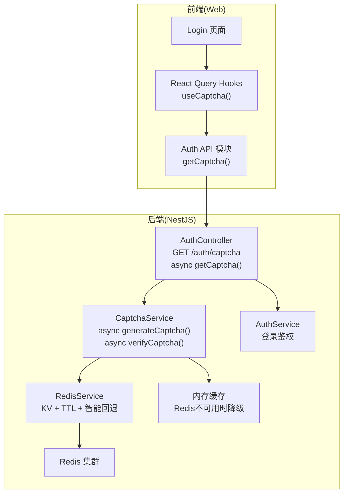
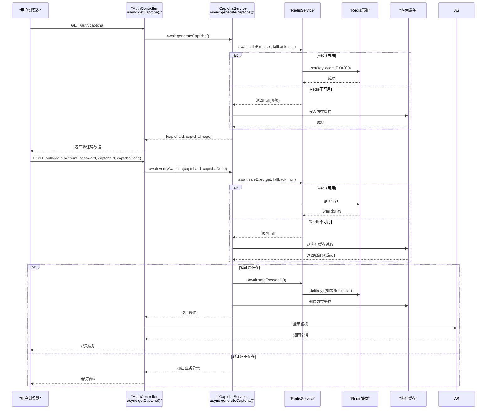
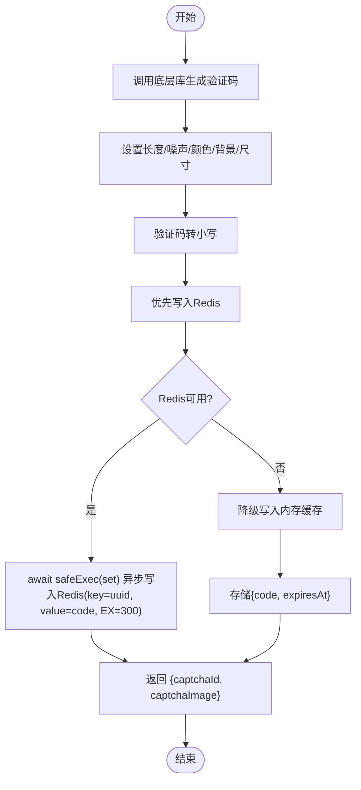
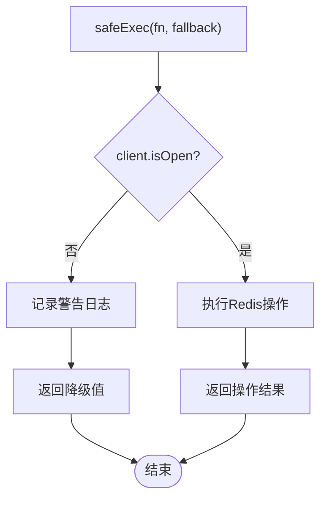
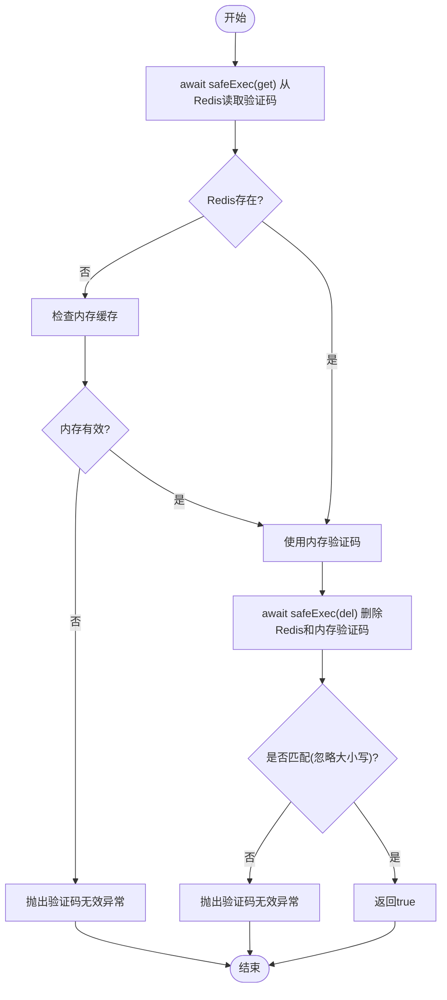
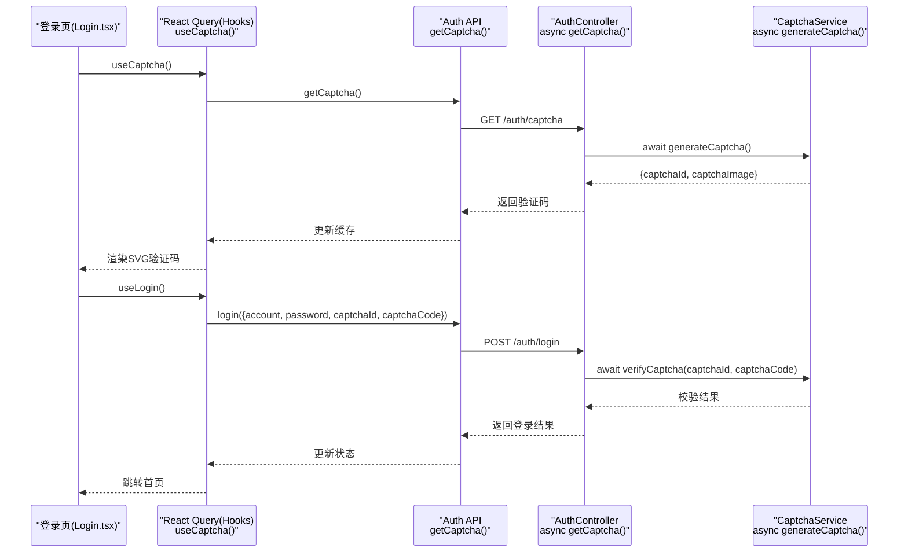
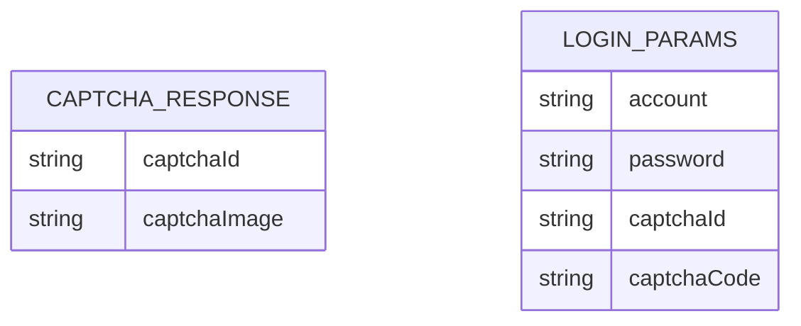
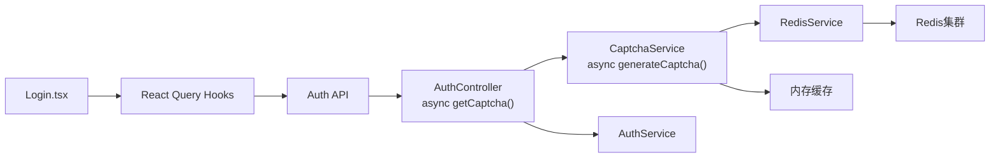

# 验证码系统

<cite>
**本文档引用的文件**
- [captcha.service.ts](file://apps/nestjs-server/src/modules/auth/captcha.service.ts)
- [redis.service.ts](file://apps/nestjs-server/src/modules/redis/redis.service.ts)
- [redis.module.ts](file://apps/nestjs-server/src/modules/redis/redis.module.ts)
- [cache.module.ts](file://apps/nestjs-server/src/modules/cache/cache.module.ts)
- [auth.controller.ts](file://apps/nestjs-server/src/modules/auth/auth.controller.ts)
- [redis.schema.ts](file://apps/nestjs-server/src/config/schemas/redis.schema.ts)
- [biz-code.enum.ts](file://apps/nestjs-server/src/common/enums/biz-code.enum.ts)
- [Login.tsx](file://apps/web/src/pages/Login.tsx)
- [hooks.ts](file://apps/web/src/api/modules/auth/hooks.ts)
- [api.ts](file://apps/web/src/api/modules/auth/api.ts)
- [captcha.service.spec.ts](file://apps/nestjs-server/src/modules/auth/captcha.service.spec.ts)
- [auth.dto.ts](file://apps/nestjs-server/src/modules/auth/dto/auth.dto.ts)
</cite>

## 更新摘要
**所做更改**
- 将 getCaptcha 方法从同步改为异步，提升响应性能
- CaptchaService 的 generateCaptcha 方法完全重构为异步实现
- Redis 存储逻辑从 Promise 链改为 async/await 语法，提高代码可读性
- 前端 React Query 钩子保持同步调用，但底层 API 已支持异步

## 目录
1. [简介](#简介)
2. [项目结构](#项目结构)
3. [核心组件](#核心组件)
4. [架构总览](#架构总览)
5. [详细组件分析](#详细组件分析)
6. [依赖关系分析](#依赖关系分析)
7. [性能考量](#性能考量)
8. [故障排查指南](#故障排查指南)
9. [结论](#结论)
10. [附录](#附录)

## 简介

本文件为验证码系统的完整技术文档，覆盖验证码生成算法、图片生成流程、存储机制、验证流程、安全防护以及前后端集成示例。系统采用 SVG 图片作为验证码载体，基于 Redis 实现跨实例部署的一次性验证码存储，并通过智能回退机制在 Redis 不可用时自动切换到内存存储，确保分布式环境下的高可用性。

**更新** 系统现已完成现代化重构，验证码服务完全采用异步架构，提升了整体性能和可维护性。

## 项目结构

验证码功能主要分布在后端 NestJS 服务与前端 Web 应用中：

- 后端：验证码服务负责生成与校验；认证控制器提供验证码获取接口；Redis 服务提供智能回退机制；DTO 与 Zod Schema 统一前后端数据结构。
- 前端：登录页通过 React Query 获取验证码并提交登录请求；验证码以 SVG 字符串形式渲染。

**图表来源**
- [auth.controller.ts:38-48](file://apps/nestjs-server/src/modules/auth/auth.controller.ts#L38-L48)
- [captcha.service.ts:33-66](file://apps/nestjs-server/src/modules/auth/captcha.service.ts#L33-L66)
- [redis.service.ts:110-122](file://apps/nestjs-server/src/modules/redis/redis.service.ts#L110-L122)
- [Login.tsx:62-92](file://apps/web/src/pages/Login.tsx#L62-L92)

**章节来源**
- [auth.controller.ts:38-48](file://apps/nestjs-server/src/modules/auth/auth.controller.ts#L38-L48)
- [captcha.service.ts:24-66](file://apps/nestjs-server/src/modules/auth/captcha.service.ts#L24-L66)
- [redis.service.ts:101-122](file://apps/nestjs-server/src/modules/redis/redis.service.ts#L101-L122)
- [Login.tsx:62-92](file://apps/web/src/pages/Login.tsx#L62-L92)

## 核心组件

- **验证码服务**：封装验证码生成、存储与校验逻辑，使用 UUID 作为键，Redis 存储验证码文本并设置过期时间，具备智能回退到内存存储的能力。现已完全重构为异步实现。
- **Redis 服务**：提供智能回退机制，当 Redis 不可用时自动降级到内存存储，确保服务连续性。
- **认证控制器**：提供获取验证码接口与登录接口，登录前强制进行验证码校验。getCaptcha 方法已改为异步实现。
- **DTO 与 Schema**：前后端统一的验证码响应结构与登录参数结构，保证字段一致性。
- **前端集成**：登录页通过查询钩子拉取验证码，渲染 SVG 并在登录时提交验证码 ID 与输入值。

**章节来源**
- [captcha.service.ts:18-66](file://apps/nestjs-server/src/modules/auth/captcha.service.ts#L18-L66)
- [redis.service.ts:101-122](file://apps/nestjs-server/src/modules/redis/redis.service.ts#L101-L122)
- [auth.controller.ts:38-76](file://apps/nestjs-server/src/modules/auth/auth.controller.ts#L38-L76)
- [Login.tsx:62-92](file://apps/web/src/pages/Login.tsx#L62-L92)

## 架构总览

验证码系统遵循"生成即存储"的设计：生成验证码时优先写入 Redis，失败时自动降级到内存存储，客户端保存验证码 ID；提交登录时先校验验证码再执行登录流程。整体流程如下：

**图表来源**
- [auth.controller.ts:38-76](file://apps/nestjs-server/src/modules/auth/auth.controller.ts#L38-L76)
- [captcha.service.ts:46-104](file://apps/nestjs-server/src/modules/auth/captcha.service.ts#L46-L104)
- [redis.service.ts:110-122](file://apps/nestjs-server/src/modules/redis/redis.service.ts#L110-L122)

## 详细组件分析

### 验证码生成算法与图片生成

- **字符集与长度**：验证码字符长度为 4，字符集由底层库决定（通常包含字母与数字，避免易混淆字符）。
- **干扰与样式**：启用噪声点数量、彩色字符、浅灰背景与固定尺寸，提升抗识别能力。
- **图片格式**：返回 SVG 字符串，便于无损缩放与前端直接渲染。
- **大小写处理**：生成时将验证码转为小写存入 Redis，验证时也统一转为小写比较。

**图表来源**
- [captcha.service.ts:33-66](file://apps/nestjs-server/src/modules/auth/captcha.service.ts#L33-L66)
- [redis.service.ts:110-122](file://apps/nestjs-server/src/modules/redis/redis.service.ts#L110-L122)

**章节来源**
- [captcha.service.ts:33-66](file://apps/nestjs-server/src/modules/auth/captcha.service.ts#L33-L66)

### 智能回退机制与高可用性

- **Redis 持久化**：使用 Redis 存储验证码数据，支持多实例部署，自带 TTL 自动清理。
- **智能回退**：Redis 不可用时自动降级到内存存储，确保服务连续性。
- **内存缓存**：仅适用于单实例，重启后丢失，提供临时的验证码存储能力。
- **容错处理**：所有 Redis 操作通过 `safeExec` 包装，失败时返回降级值而不影响主流程。

**图表来源**
- [redis.service.ts:110-122](file://apps/nestjs-server/src/modules/redis/redis.service.ts#L110-L122)

**章节来源**
- [captcha.service.ts:46-60](file://apps/nestjs-server/src/modules/auth/captcha.service.ts#L46-L60)
- [redis.service.ts:110-122](file://apps/nestjs-server/src/modules/redis/redis.service.ts#L110-L122)

### 验证码存储机制与过期控制

- **键命名**：使用统一前缀与 UUID 组合形成唯一键，便于清理与检索。
- **过期策略**：Redis 设置 TTL，过期后自动清理，避免内存泄漏。
- **异步写入**：生成阶段异步写入 Redis，不阻塞 HTTP 响应，提升吞吐。
- **双重存储**：Redis 可用时写入 Redis，不可用时写入内存缓存。

**章节来源**
- [captcha.service.ts:9-10](file://apps/nestjs-server/src/modules/auth/captcha.service.ts#L9-L10)
- [captcha.service.ts:46-60](file://apps/nestjs-server/src/modules/auth/captcha.service.ts#L46-L60)

### 验证码验证流程与安全策略

- **优先级验证**：优先从 Redis 读取，失败时降级到内存缓存。
- **一次性使用**：验证成功或失败均立即删除 Redis 和内存中的验证码键，防止重复使用与暴力破解。
- **大小写不敏感**：统一转为小写比较，降低用户输入误差。
- **统一错误**：无法区分"不存在"和"已过期"，统一返回"验证码无效"。

**图表来源**
- [captcha.service.ts:69-104](file://apps/nestjs-server/src/modules/auth/captcha.service.ts#L69-L104)

**章节来源**
- [captcha.service.ts:69-104](file://apps/nestjs-server/src/modules/auth/captcha.service.ts#L69-L104)

### 前后端集成与使用示例

- **后端接口**
  - 获取验证码：GET /auth/captcha，返回 {captchaId, captchaImage}。方法已改为异步实现。
  - 登录接口：POST /auth/login，需携带 captchaId 与 captchaCode。
- **前端流程**
  - 登录页通过查询钩子获取验证码并渲染 SVG。
  - 提交登录时，将 captchaId 与用户输入的验证码一并发送至后端。

**图表来源**
- [Login.tsx:62-92](file://apps/web/src/pages/Login.tsx#L62-L92)
- [hooks.ts:5-22](file://apps/web/src/api/modules/auth/hooks.ts#L5-L22)
- [api.ts:20-30](file://apps/web/src/api/modules/auth/api.ts#L20-L30)
- [auth.controller.ts:38-76](file://apps/nestjs-server/src/modules/auth/auth.controller.ts#L38-L76)
- [captcha.service.ts:33-66](file://apps/nestjs-server/src/modules/auth/captcha.service.ts#L33-L66)

**章节来源**
- [auth.controller.ts:38-76](file://apps/nestjs-server/src/modules/auth/auth.controller.ts#L38-L76)
- [Login.tsx:62-92](file://apps/web/src/pages/Login.tsx#L62-L92)
- [hooks.ts:5-22](file://apps/web/src/api/modules/auth/hooks.ts#L5-L22)
- [api.ts:20-30](file://apps/web/src/api/modules/auth/api.ts#L20-L30)

### 数据模型与接口定义

- **验证码响应结构**：包含验证码 ID 与 SVG 图片字符串。
- **登录参数结构**：包含账号、密码、验证码 ID 与验证码内容。

**图表来源**
- [auth.controller.ts:8-15](file://apps/nestjs-server/src/modules/auth/auth.controller.ts#L8-L15)

**章节来源**
- [auth.controller.ts:8-15](file://apps/nestjs-server/src/modules/auth/auth.controller.ts#L8-L15)

## 依赖关系分析

- **组件耦合**
  - AuthController 依赖 CaptchaService 与 AuthService。
  - CaptchaService 依赖 RedisService 和内存缓存。
  - RedisService 提供智能回退机制。
  - 前端 Login 页面依赖 React Query 与 Auth API 模块。
- **外部依赖**
  - svg-captcha：生成 SVG 验证码。
  - Redis：KV 存储与 TTL。
  - Zod：前后端统一的数据校验。

**图表来源**
- [auth.controller.ts:32-36](file://apps/nestjs-server/src/modules/auth/auth.controller.ts#L32-L36)
- [captcha.service.ts:31](file://apps/nestjs-server/src/modules/auth/captcha.service.ts#L31)
- [redis.service.ts:21](file://apps/nestjs-server/src/modules/redis/redis.service.ts#L21)

**章节来源**
- [auth.controller.ts:32-36](file://apps/nestjs-server/src/modules/auth/auth.controller.ts#L32-L36)
- [captcha.service.ts:31](file://apps/nestjs-server/src/modules/auth/captcha.service.ts#L31)
- [redis.service.ts:21](file://apps/nestjs-server/src/modules/redis/redis.service.ts#L21)

## 性能考量

- **异步写入**：验证码生成时异步写入 Redis，避免阻塞请求响应。
- **TTL 自动清理**：Redis 自带过期清理，减少手动维护成本。
- **智能回退**：Redis 不可用时自动降级到内存存储，不影响服务性能。
- **限流保护**：验证码接口与登录接口分别设置了限流策略，限制单位时间内的请求次数，降低暴力破解风险。
- **前端渲染**：SVG 图片体积小、可缩放，渲染性能良好。

**章节来源**
- [captcha.service.ts:46-60](file://apps/nestjs-server/src/modules/auth/captcha.service.ts#L46-L60)
- [auth.controller.ts:40](file://apps/nestjs-server/src/modules/auth/auth.controller.ts#L40)
- [auth.controller.ts:65](file://apps/nestjs-server/src/modules/auth/auth.controller.ts#L65)

## 故障排查指南

- **验证码无效**
  - 可能原因：验证码不存在或已过期；验证码已被使用；Redis 服务不可用。
  - 排查步骤：确认前端是否正确保存 captchaId；检查 Redis 中是否存在对应键；观察内存缓存是否生效；查看 Redis 日志。
- **验证码错误**
  - 可能原因：用户输入与存储值不一致（大小写不敏感）。
  - 排查步骤：确认输入是否包含空格或特殊字符；检查大小写转换逻辑。
- **Redis 连接问题**
  - 可能原因：Redis 服务器不可达；网络连接中断；认证失败。
  - 排查步骤：检查 Redis 服务状态；验证连接配置；查看重连日志；确认智能回退是否正常工作。
- **内存缓存问题**
  - 可能原因：内存缓存过期未及时清理；内存不足。
  - 排查步骤：检查内存缓存条目数量；验证过期时间；监控内存使用情况。
- **登录失败**
  - 可能原因：验证码校验失败导致登录未执行。
  - 排查步骤：查看控制器日志；确认验证码接口与登录接口的调用顺序；检查智能回退机制。
- **前端渲染问题**
  - 可能原因：SVG 字符串为空或解析失败。
  - 排查步骤：确认后端返回的 captchaImage 是否为有效字符串；检查前端 dangerouslySetInnerHTML 的使用。

**章节来源**
- [captcha.service.ts:69-104](file://apps/nestjs-server/src/modules/auth/captcha.service.ts#L69-L104)
- [redis.service.ts:110-122](file://apps/nestjs-server/src/modules/redis/redis.service.ts#L110-L122)
- [Login.tsx:164-185](file://apps/web/src/pages/Login.tsx#L164-L185)

## 结论

本验证码系统通过 SVG 图片与 Redis 存储实现了高可用、跨实例的一次性验证码方案。新增的智能回退机制确保了在 Redis 不可用时的服务连续性，内存缓存提供了临时的降级存储能力。结合限流策略与统一的前后端数据结构，既保障了用户体验，又提升了安全性。

**更新** 现有的现代化改进显著提升了系统的性能和可维护性。异步架构的引入使得验证码生成和验证过程更加高效，同时保持了原有的安全特性和容错能力。建议在生产环境中配合更严格的限流阈值与监控告警，进一步降低安全风险。

## 附录

### 完整使用示例（路径指引）

- **生成验证码接口**
  - 方法：GET
  - 路径：/auth/captcha
  - 返回：CaptchaResponse
  - 限流：每分钟10次
  - 实现：async getCaptcha() 已完成异步重构
  - 参考路径：[auth.controller.ts:38-48](file://apps/nestjs-server/src/modules/auth/auth.controller.ts#L38-L48)
- **验证码校验与登录**
  - 方法：POST
  - 路径：/auth/login
  - 参数：LoginParams（包含 captchaId 与 captchaCode）
  - 限流：每分钟5次
  - 流程：先调用验证码校验，再执行登录
  - 实现：verifyCaptcha() 已完成异步重构
  - 参考路径：[auth.controller.ts:63-76](file://apps/nestjs-server/src/modules/auth/auth.controller.ts#L63-L76)
- **前端获取与渲染**
  - 查询钩子：useCaptcha()
  - API：getCaptcha()
  - 渲染：dangerouslySetInnerHTML
  - 实现：前端保持同步调用，但底层已支持异步
  - 参考路径：[Login.tsx:62-92](file://apps/web/src/pages/Login.tsx#L62-L92)，[hooks.ts:5-10](file://apps/web/src/api/modules/auth/hooks.ts#L5-L10)，[api.ts:20-22](file://apps/web/src/api/modules/auth/api.ts#L20-L22)

### 安全考虑

- **防暴力破解**
  - 限流：验证码接口与登录接口均设置限流，降低高频尝试风险。
  - 一次性：验证码验证后立即删除，防止重放攻击。
  - 智能回退：Redis 不可用时自动降级到内存存储，确保服务连续性。
- **防滥用**
  - TTL：Redis 自动过期，避免长期占用资源。
  - 输入规范化：统一小写比较，减少因大小写导致的误判。
  - 容错处理：所有 Redis 操作通过 safeExec 包装，失败时不影响主流程。
- **分布式高可用**
  - Redis 集群：支持多实例部署，实现水平扩展。
  - 连接管理：自动重连、连接超时控制、最大重试限制。
  - 缓存集成：与 NestJS Cache Manager 集成，支持多种缓存策略。
- **建议增强**
  - 更细粒度的限流策略（按 IP 或用户维度）。
  - 引入更复杂的验证码类型（如滑动拼图、点选）以对抗自动化工具。
  - 对频繁失败的账户进行临时封禁或二次校验。
  - 监控 Redis 连接状态和性能指标。

**章节来源**
- [auth.controller.ts:40](file://apps/nestjs-server/src/modules/auth/auth.controller.ts#L40)
- [auth.controller.ts:65](file://apps/nestjs-server/src/modules/auth/auth.controller.ts#L65)
- [captcha.service.ts:18](file://apps/nestjs-server/src/modules/auth/captcha.service.ts#L18)
- [redis.service.ts:8](file://apps/nestjs-server/src/modules/redis/redis.service.ts#L8)
- [biz-code.enum.ts:15](file://apps/nestjs-server/src/common/enums/biz-code.enum.ts#L15)